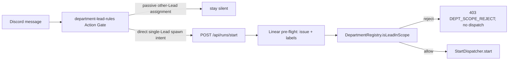

# FLY-127 部门范围启动守卫 — 调研
Issue: FLY-127 (https://linear.app/geoforge3d/issue/FLY-127/lead-spawns-runner-for-tasks-not-assigned-to-its-department)
日期: 2026-08-30
基于: exploration.md

## 1. 启动决策路径

Lead 的“要不要启动”不是单一 handler，而是 prompt 纪律与服务端授权的串联：

`packages/teamlead/scripts/claude-lead.sh` 是规则装载点：

- 非 CoS department Lead 先加载 Flywheel base `department-lead-rules.md`，再加载项目自己的同名规则。
- CoS 不加载 department spawn 规则，而加载 `cos-lead-rules.md`，它要求一条启动指令只路由给一个 department Lead。
- 这个分层说明 `claude-lead.sh` 本身不解析每条 Discord 消息；它决定 Claude Lead 会拿到什么约束。真正不可绕过的动作边界在 Bridge route。

## 2. 服务端授权模型

`DepartmentRegistry.isLeadInScope(projectName, leadId, issueLabels)` 的判定优先级是：

1. `project_unknown`
2. `lead_unknown`
3. `lead_cannot_spawn`
4. `issue_no_department_label`
5. `issue_multiple_department_labels`
6. `label_mismatch`
7. `ok`

对本事故的映射：

- GEO-366 / GEO-101 只有 Ops department label。
- Peter 以 `product-lead` 调用时，registry 唯一解析出的 canonical Lead 是 `ops-lead`，因此得到 `label_mismatch`。
- `runs-route.ts` 在 `StartDispatcher.start` 之前返回 403，错误请求不能创建 Runner。
- Oliver 以 `ops-lead` 调用相同 issue 时得到 `ok` 并进入 dispatch。

该边界以 Linear label + 项目 Lead 配置为依据，不信任 Lead 自述、消息关键词或 caller 传入的 executor 名称。

## 3. Prompt 层的静默规则

`packages/teamlead/lead-rules-base/department-lead-rules.md` 已明确区分两类 mismatch：

- 被动看见“给另一个 Lead 起 Runner”的消息：不调用 Bridge、保持静默。
- 明确 @ 自己的启动请求随后被 Bridge 拒绝：只发一次机读 reason 对应的短诊断，不重试。

这满足“Peter 读到 Oliver-only issue，但不动作”的体验要求，同时保留服务端防御纵深：即使模型误判并调用 API，Runner 仍不会启动。

## 4. 当前测试证据与缺口

已有 coverage：

| 文件 | 已证明 |
|---|---|
| `department-registry.test.ts` | label classification、reject precedence、exact-match allow |
| `start-e2e.test.ts` Peter→Ops case | 403、`canonicalLeadId=ops-lead`、dispatcher 零调用 |
| `start-e2e.test.ts` Oliver→Ops case | 200、dispatcher 一次调用 |
| `lead-rules-bundle.test.ts` / launcher contract | department rules 被正确注入对应 Lead role |
| `doc/qa/reports/v1.27.0-FLY-127-r3-replay-test.md` | 原始混合指令的三层事故重放设计与历史验证 |

缺口不是 production behavior，而是 acceptance 3 的证据形状：Peter reject 和 Oliver allow 分散在两个 test case，未在同一 case 内证明“同一个 Oliver-only issue 最终只产生一个 Oliver dispatch”。

## 5. 最小验证增量

在现有 `start-e2e.test.ts` 的 FLY-127 describe 内新增一个 paired scenario：

1. 为第一次请求返回 Ops labels，Peter 调 `/api/runs/start`。
2. 断言 403 `label_mismatch`，dispatcher 调用次数仍为 0。
3. 为第二次请求返回同样 Ops labels，Oliver 调相同 endpoint、同一 issue id。
4. 断言 200，dispatcher 调用次数恰为 1。
5. 检查唯一一次 `start` 的 request 绑定 `leadId: ops-lead`（按当前 dispatcher request shape 选择精确字段断言）。

这是 tests-only 增量；不会改变 runtime contract。由于被测行为已存在于基线，此新增回归测试预期首次运行即通过，不伪造一个不存在的 RED 阶段。任何 production 修复只有在该测试或现有 suite 暴露真实失败后才进入严格 RED→GREEN。

## 6. 风险

- `mockDispatcher` 在每个 test 的 reset 语义必须核实，避免累积调用造成假阳性。
- LinearClient mock 使用 `mockImplementationOnce`，paired scenario 必须为两次 route 调用各准备一份 labels response。
- 只断言 HTTP 200/403 不够；必须断言 dispatcher 唯一调用，才能证明“only Oliver spawns”。
- 不扩展到真实 Discord/canary、Bridge restart 或生产部署；本节点边界是实现和 PR，DAG QA 节点负责独立环境验证。
