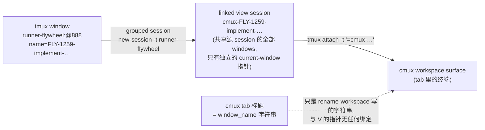

# FLY-1272 cmux tab 名↔pane 内容串台 — 探索

Issue: FLY-1272 (https://linear.app/geoforge3d/issue/FLY-1272/fix-cmux-tab-名pane-内容串台-一个-tab-显示错的会话codex-单显示成-claude-husk今晚坑-founder)
日期: 2026-07-16
基于: 无

## 1. 症状（Annie 2026-07-14 晚，两次）

cmux 侧栏 tab **名字**是 FLY-1259-implement / FLY-1264-implement，点进去 pane **显示的是另一个会话**——都是 FLY-1225 的 QA runner（@runner-51418c98，Claude Opus，撞 weekly limit，cwd=flywheel-FLY-1225）。founder 由此误判「Codex 的单在用 Claude Code 跑」。

Bridge 权威事实：1259/1264 的 implement 都是真 Codex（codex-tmux、正确 cwd）。**是显示层串台，不是后端跑错。**

## 2. 现有架构：tab↔内容如何绑定

每个 agent（Lead / Runner）= 一个 tmux **window**（Lead 在 session `flywheel`，Runner 在 `runner-<project>`，如 `runner-flywheel`）。cmux 侧栏 tab 的显示链路由 `scripts/flywheel-cmux-sync.sh` 维护：



关键事实（`flywheel-cmux-sync.sh`）：

- tab 标题 = workspace title = **window_name 字符串**（`create_workspace_for_window` 建完 workspace 后 `rename-workspace`，行 2182）。
- tab 实际显示 = view session 的 **current-window 指针**指到哪个 window。view session 是 **grouped session**（行 2111 `tmux new-session -d -t "$source_session"`），**共享 `runner-flywheel` 的全部 windows**。
- 指针正确性只靠两处 best-effort `select-window`：create 时的 ready-gate（行 2127），和 60s additive 扫描里的 `refresh_linked_sessions`（行 2229，按 live window_id 重选）。
- **没有任何路径校验「tab 标题 == 指针实际指向的 window」这个 invariant。**

## 3. 实证

### 3.1 tmux 3.5a 隔离实验（本机，独立 socket，2026-07-16）

场景：源 session 有 w-a / w-husk / w-b 三个窗；grouped view session `view-b` select 到 w-b。

| 操作 | view-b 的 current window | 结论 |
|---|---|---|
| kill-window w-b | **落到 @0 w-a（邻居窗）** | 指针 fallback 到组内其他 issue 的窗 —— **这就是串台机制** |
| 重建同名 w-b | 仍指 @0 w-a | 同名重建**不会**自动修复指针；只有 60s refresh 会修 |
| 新建 grouped session（源 session current=w-husk） | 初始指 @0 w-a | 新 view session 初始指向**最低 index 窗**，select 失败/deferred 就停在任意窗上 |

推论：所有 view session 的 fallback/初始指针都倾向落到**同一个低 index 的长寿窗**。事发晚 runner-flywheel 里恰有一个 13:31 起存活 7 小时以上的低 index 窗——FLY-1225 QA runner（weekly-limit Claude，pane 一直活着）。这解释了为什么 1259 和 1264 两个 tab 显示的是**同一个** 1225 会话。

### 3.2 生产 watcher log（/tmp/flywheel-cmux-watcher.log，07-14 晚）

```
18:21:29 Creating workspace: FLY-1259-implement-… (@888)
18:42:09 Creating workspace: FLY-1264-implement-… (@924)
18:56:31 Conservative cleanup: cmux-FLY-1264-implement-… (stale for 384s)   ← @924 已死 ~6.4min
19:12:24 Creating workspace: FLY-1264-implement-… (@943)                    ← 同名重生
19:36:42 Conservative cleanup: cmux-FLY-1264-implement-… (stale for 342s)   ← @943 又死
19:45:42 Conservative cleanup: cmux-FLY-1259-implement-… (stale for 400s)   ← @888 死
22:07:35 / 22:27:41 / 22:45:17 …同名窗继续重生，churn 持续整晚
```

同晚 FLY-1225 侧：`FLY-1225-qa-…(@680)` 13:31 创建，其 workspace 反复 reconcile/create（13:35、16:03、16:06、20:16 都还在，窗 id 始终 @680）——即那个 weekly-limit husk 窗**一直活着**，长期占据低 index 位。

两个要点：

1. **1259/1264 的 implement 窗当晚反复死亡+同名重生**（何因属 runner 生命周期问题，不在本单 scope；本单管的是显示层不许说谎）。
2. 清理走的全是 **300s conservative 兜底**而不是 30s 事件路径 → 事件（pane-died / window-unlinked）当晚在丢。每次「窗死 → 5-6.5 分钟后 tab 才被关」的窗口期内，若窗是被 kill-window 移除的，指针 fallback 到邻居窗，**tab 名不变、内容变成别的 issue 的会话**——Annie 点进去就看到 1225 的 Claude。她一晚撞上两次与 churn 频率一致。

### 3.3 代码审计：为什么现有修复路径都救不了

| 路径 | 为什么不覆盖 |
|---|---|
| `refresh_linked_sessions`（60s additive） | 只在**存在同名活窗**时重选；窗死了没同名活窗 → 不修。且事件驱动路径不修：create 事件对已存在 workspace 早退（行 2544），指针错位不被触碰 |
| self-heal（FLY-169/254） | 只救「0 client + bare shell」（attach 失败掉壳）；**attach 着但指错窗**（client>0）恰好被安全门排除 |
| 30s pending cleanup（事件驱动） | 依赖 pane-died/window-unlinked 事件送达；事件丢了就退化到 300s |
| 300s conservative cleanup | 兜底能关掉 tab，但窗口期长达 5-6.5 分钟，串台全程可见 |
| FLY-867 Fix B（dead-husk 不建 tab） | 管「不给死窗建 tab」，不管「活 tab 的指针飘到别的窗」 |

## 4. 根因

**cmux tab 标题与其显示内容之间没有绑定。** 标题是一次性写入的字符串；内容由 grouped view session 的 current-window 指针决定，而该指针：

1. 在目标窗被 kill-window 移除时，被 tmux **自动 fallback 到组内任意邻居窗**（实测落在 previous/最低 index 窗，即长寿 husk）；
2. 在 view session 新建而 select-window 失败/延迟时，**初始就指着任意窗**；
3. 唯一的收敛机制（60s refresh）依赖「同名活窗存在」这个前提，且没有任何 invariant 校验兜底。

结构性缺陷 = grouped session 共享**全部** windows（fallback 才有处可落）+ 无「标题↔内容」一致性校验。事发晚的 runner churn + 事件丢失只是放大器，把本来 ≤60s 的暴露窗拉长到 5-6.5 分钟且反复出现。

## 5. 修复方向（options）

### Option A — link-window 隔离（结构性根治，推荐核心）

view session 不再 grouped 共享全部窗，改为**只链接自己的目标窗**：`tmux new-session` 独立建 session 后 `link-window -s runner-flywheel:@wid -t cmux-X:`，杀掉占位窗。效果：

- 组内没有别的窗可 fallback → **物理上不可能显示别的 issue 的会话**（要么显示自己的窗/自己的 dead pane，要么窗没了 session 一起死、surface 掉壳，走既有 self-heal/cleanup）。
- husk 窗从此**串不进**任何活 issue 的 tab（issue 要做 #3 自动满足）。
- 代价：create/refresh 路径改写（select 变 link+select；同名重生要 link 新窗），对既有机制（self-heal、reopen sweep、dedup、orphan-pin reaper、reconcile）需逐一兼容性审计——该脚本历史上 FLY-98/102/110/129/169/177/254/293/685/825/867/873 全部踩过坑，改动核心路径风险高，需全量测试 + 529 真机 E2E。

### Option B — watcher 侧「标题↔内容」invariant 校验 + 立即修复（issue 要做 #1 的字面实现）

每个 15s tick（或至少 60s additive pass）对每个 managed workspace 校验：view session 的 active window 身份（id+name）== workspace title；不一致时：有同名活窗 → 立即重选；没有 → **立即** kill view session + 关 tab（不给 30s/300s 宽限——「缺 tab」可以宽限，「显示别人的内容」是 actively harmful，必须秒杀）。

- 优点：改动面小（纯新增检测层），不动 create 语义，兼容性风险低；也覆盖未知的指针移动源（如 attach 客户端切窗）。
- 缺点：收敛式保证（暴露窗 ≤ 一个 tick），不是「绝不」；单独做 B 达不到验收句里的「绝不显示成别的 husk」的结构强度。

### Option C = A + B（推荐）

A 根治 fallback（结构性「绝不」），B 作为纵深防御 + 回归探测（invariant 破坏时修复并记 log，成为以后任何显示层回归的告警器）。

### Option D —（否决）只加固事件覆盖/缩短宽限

治标：仍依赖事件送达，事发晚恰好证明事件会丢；且 30s 内串台仍可见。

## 6. 推荐

**Option C（A 为核心 + B 为纵深）**，理由：验收标准写的是「绝不显示成别的 husk」——只有把 fallback 的物理可能性消掉才配得上「绝不」；B 兜住 A 覆盖不到的未知移动源，并把任何未来回归变成 log 可见。

Scope 边界（明确不做）：

- 1259/1264 implement 窗当晚反复死亡的原因（runner 生命周期/quota 之夜的 churn）→ 另属 FLY-1225/runner-lifecycle 族，不在本单。
- weekly-limit husk 自己的 tab（标题=它自己的窗名）是**如实显示**，不是本 bug；要不要杀 husk 是 FLY-867/lifecycle 的事。

## 7. 留给 research 的问题

> 收口注记（2026-07-16）：以下问题已全部在 research.md（v11）与 plan.md（v14，§2 统一决策表为唯一权威合同）中回答；本节保留作为 brainstorm 阶段的原始问题清单。Option C 经 Tadashi brainstorm gate 批准后，又经 Codex design review 12 轮演进（含两次降海拔重构），最终形态以 plan 为准。

1. link-window 方案与既有 12 处机制的逐一兼容性（self-heal 的 0-client 判定、reopen 一次性 sweep、dedup_workspaces_by_title、orphan-pin reaper、reconcile、FLY-825 create dedup、`linked_session_exists` 语义、cleanup_workspace_for）。
2. 同名重生（retry/park 同名兄弟窗，FLY-867 一族）在 link 模式下的 re-link 语义：link 新窗 + unlink 死窗的原子性与时序。
3. Lead session（`flywheel`）与 QA session（`runner-flywheel-qa-*`）同样适用性确认。
4. B 的校验读什么：`tmux display-message -t '=cmux-X' '#{window_id} #{window_name}'` 与 title 的比对形态；同名多窗时的判定。
5. 测试形态：test-cmux-sync.sh 单测 + 529 Room 真机 E2E（验收场景：Codex implement 单 + weekly-limit Claude husk 共存，kill Codex 窗，断言 tab 永不显示 husk 内容）。注意 FLY-1285 教训：平台谓词必须真机验，hermetic stub 会给假绿。
