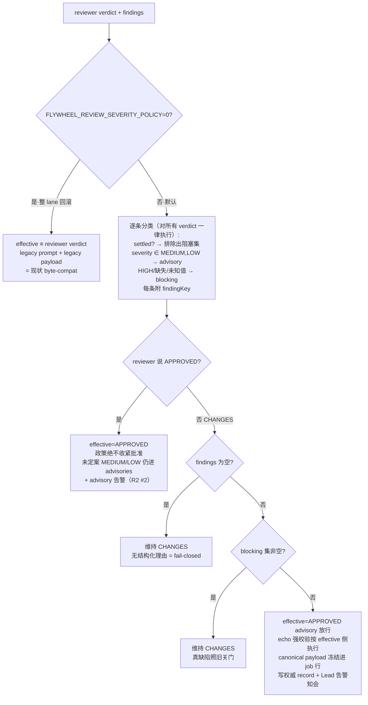

# FLY-1278 跨家族审查门收敛修复 — 实施计划

Issue: FLY-1278 (https://linear.app/geoforge3d/issue/FLY-1278/fix-跨家族审查门在-lead-已裁决的非阻塞项上死循环-审稿人反复重提被-overrule-的优化建议强制门永不收敛fly-1251)
日期: 2026-07-15
基于: research.md

> 设计已经 brainstorm gate 获 Lead 批准（A+B+C+D 组合 + 三个确认点按推荐 + FLY-1251 真实序列回归 fixture 直令）。本计划给 implement 阶段（同分支、独立 session）照建。Codex design review R1 的 8 项反馈已全部吸收（见 §7 修订记录）。

## 0. 一句话

在跨家族审查 lane 加三层收敛机制：**门侧机械 severity 政策**（MEDIUM/LOW 永不关门）、**Lead per-finding 裁决通道**（受监督、审计可见、裁决项从阻塞集排除——含 HIGH）、**裁决感知的审稿 prompt**（严禁重提已定案项 + 修掉推重提措辞）——真 HIGH 缺陷照旧 fail-closed，FLY-827/1188 全部既有防线零弱化。

## 1. 决策快照（已裁决，不再重开）

| 决策点 | 结论 |
|---|---|
| severity 政策默认值 | **default ON**；`FLYWHEEL_REVIEW_SEVERITY_POLICY=0` = **整 lane 完整回滚**（effective 计算 + 新 prompt 段 + 新 payload 形状三者同门控，见 §3.0）+ 端到端 reverse-compat sentinel |
| 裁决对 HIGH 生效？ | **生效**（配 dispute-alert + Discord issue thread 审计）；verify-approval / founder ship gate 零改动 = 终极兜底不变 |
| 裁决作用域 | **issue 级**（project + issue 规范身份，alias-aware：UUID 与 Linear identifier 混用现实，见 §3.2），跨 execution/respawn 存活 |
| advisory findings 去向 | 附 verdict payload 传 runner + Lead 告警知会（真实接线，见 §3.4），绝不静默丢；期望由 runner/Lead 立 follow-up |
| 否决项 | runner gate 文本透传进审稿 prompt（作者可伪造裁决豁免真 HIGH）；N 轮自动放行；codex_skip 放宽 |
| 范围 | 只动跨家族 lane；legacy claude-author lane byte-compat；verify-approval / isCodexGateSatisfied / auto-QA 消费端零改动 |

## 2. 效果流（effective verdict 计算）



## 3. 设计细则（Codex R1 修订后）

### 3.0 开关边界（R1 #1）

`FLYWHEEL_REVIEW_SEVERITY_POLICY`（`severityPolicyEnabled(env)`，缺省 true，仅显式 `"0"` 为 false）**同时门控三处**，保证 `=0` 是可证的整 lane 回滚：
1. effective verdict 计算（旁路 → effective ≡ reviewer verdict）；
2. buildPrompt 的全部新增段（severity 语义/政策告知/id 要求/GOVERNANCE 段/reround 措辞改动）——`=0` 时 prompt 逐字节等于现状；
3. verdict payload 形状——`=0` 时发 legacy canonical（无新字段）。
裁决端点/表在 `=0` 下仍可写（治理数据不丢），但不参与匹配、不进 prompt。端到端 sentinel 测试断言四面：prompt 字节、落库 verdict、投递 payload 字节、无 advisory/dispute 告警（见 §5）。

### 3.1 runJob 精确顺序（R1 #2 + R2 #1 —— downgraded 放行不得绕 R12 HIGH-6；快照先于 prompt）

**裁决快照的加载点在 `buildPrompt` 之前**（R2 #1：buildPrompt 在 reviewRound 之前跑、§3.7 GOVERNANCE 段要用它——不能等 verdict 回来才读）：runJob 在构造 prompt 前对 (project, issue 规范簇) 一次性 `listActiveReviewFindingRulings`，得到**本轮不可变快照**；该快照 ①注入 prompt GOVERNANCE 段 ②reviewRound 返回后原样复用于 `computeEffectiveVerdict`——**verdict 时刻不再重读表**。子进程运行期间的 create/revoke 都不影响本轮、都影响下一轮（两个方向各一条测试：reviewRound 阻塞中插入 ruling / 撤销 ruling → 本轮结果不变，下一轮生效）。

verdict 返回后按此顺序，写成集成测试钉死：
1. gate 重验（现状 `gateStillOpen`，不动）；
2. **用轮前冻结的快照计算 effective verdict**（§3.6 匹配 + severity 分类；**分类对所有 verdict 一律执行**，见下）；
3. head 复核（现状 `tryDeriveHead` vs frozen，不动）；
4. **echo 规则按 EFFECTIVE verdict 分支**：effective=APPROVED（含 downgraded）→ 要求 `reviewedHeadSha` 存在且 === frozen，否则 `reviewed_wrong_head` fail（与真 APPROVED 同标准）；effective=CHANGES → 维持现状 mismatch-only 规则；
5. 持久化：`completeCodexReviewJob` 扩展写 `verdict = effective` + 新列（§3.3）；
6. 投递（stored canonical bytes，§3.3）→ **owned 后**才 `commitAuthorityIfApproved`（现状顺序不变）。

现状代码在 666 行按 `outcome.verdict` 分支——实现时该分支整体改造为按 effective 分支，禁止保留旧分支旁路。

**分类与 advisory 通道对 APPROVED 同样生效**（R2 #2）：§3.7 的新 prompt 要求 reviewer 全 MEDIUM/LOW 投 APPROVED——政策落地后这才是常态路径，advisory 不能只在 CHANGES 分支产出。`computeEffectiveVerdict` 对任何 reviewer verdict 都做逐条分类与 findingKey 装饰：reviewer=APPROVED 时 effective 恒 APPROVED（不收紧），但其未定案 MEDIUM/LOW findings 照样进 `advisories`、进冻结 response_json、触发 `review_advisory_pass` 告警；APPROVED 携带的 HIGH/未知 severity findings 保持可见（原文进 payload 与 response_json）且不改判（非收紧原则）——本计划只承诺 payload 可见性，不为该异常组合另设告警（R3 #4 措辞校准）。测试补 APPROVED+MEDIUM、APPROVED+混合 MEDIUM/LOW、APPROVED+HIGH/未知 三类。

### 3.2 issue 规范身份（R1 #4）

- 库内现实：`sessions.issue_id` 可能是 Linear UUID 或 `FLY-XXXX`（StateStore.ts:3704/5445 自认；PreHydrator 分存 node.id 与 issueIdentifier）。
- 裁决表存 `issue_id_canonical`（解析结果）+ `issue_identifier`（人类形式，审计）。解析规则：CLI 给的 issue 引用在**本 project 范围内**同时匹配 `sessions.issue_id` 与 `sessions.issue_identifier`（及 codex_review_job.issue_id）；恰一个规范簇 → 采用；零命中或跨簇歧义 → **fail-closed 404/409**。
- 匹配查询（buildPrompt / effective 计算 / 端点校验）全部 alias-aware：以规范簇为键。
- 回归测试：同 issue 两个 execution 一存 UUID 一存 `FLY-XXXX`，一条 ruling 对两者同时生效。

### 3.3 canonical payload 单一真相（R1 #6）

- 新增单一构造器 `buildVerdictPayload(job)`（纯函数，稳定键序）。
- `codex_review_job` 新列：`reviewer_verdict TEXT`、`advisories_json TEXT`、`settled_json TEXT`、**`response_json TEXT`（verdict 时刻冻结的逐字节 canonical payload）**、`payload_version INTEGER`（本次 = 2；历史行 NULL）。`policyNote` 为稳定 token 文案、包含在 response_json 内，不动态生成。
- 活路径与 `deliverStoredResponse` 重投**都发 `response_json` 原文**；`isOurResponse` 比对同一字符串。
- 升级窗口：**仅 `payload_version IS NULL` 的历史行**允许以 legacy 形状（从行字段按旧构造重建）做归属比对；version=2 的行只认 response_json 原文——**反向测试**：new-shape job 遇 old-shape existing response 判 FOREIGN。
- delivery nonce 与 deliver-before-authority 顺序保持现状。

### 3.4 告警与 Discord 审计的真实接线（R1 #3）

- **事实**：生产 plugin.ts:6080 未注入 `alertLead`（research §3.7 修订）。
- 接线方案：新增 review 告警 kind（`review_advisory_pass` / `review_ruling_recorded` / `review_ruling_disputed` / `review_ruling_notify_failed`）走既有 `ALERT_EVENT_TYPES` + kind-contract + 路由（kind-contract 的 exhaustive 测试同步扩）；同时注入 **issue-thread poster** dep（复用 `AutoQaEffects.postThreadResult` 形态，auto-qa-effects.ts:146）。
- **告警 dep 的精确形态**（R2 #4）：现状 `ReviewCoordinatorDeps.alertLead` 是同步 string-in（94-95 行），而 `LeadAlertNotifier.alert` 是结构化异步（LeadAlertNotifier.ts:353-374,619）。coordinator 侧改为/新增**结构化异步 dep**：`emitReviewAlert(event: { kind; eventId; issueId; executionId?; requestId?; rulingId?; message }): Promise<void>`——**确定性 eventId**：advisory=`review-advisory:<request_id>`、recorded/notify_failed=`review-ruling:<ruling_id>[:notify_failed]`、dispute=`review-dispute:<request_id>:<ruling_id>`（吃 LeadAlertNotifier per-eventId 去重）；plugin.ts 用 late-bound routed-sink wrapper 注入（notifier 在 coordinator 之后构造的既有模式）；coordinator 内 await + catch（告警失败绝不 fail job，log 即可）。
- **裁决生效语义**：ruling **落库即 active**（治理权威不被 Discord 可用性劫持）；thread 贴文为 best-effort 副作用——表加 `notified_at`，失败留 NULL + `review_ruling_notify_failed` 告警，Bridge boot 时对 `notified_at IS NULL` 的 active ruling 重驱贴文。**投递语义 = at-least-once，不是恰一次**（R2 #4：POST 成功后、stamp 前崩溃会重复贴文）——接受该有界重复并写明；贴文正文带 `ruling_id` 供人肉对账去重；不声称「幂等重投」。
- 测试：production-wiring 测试（kind 路由 exhaustive + coordinator 构造注入断言 + eventId 确定性）+ thread 贴文失败路径（notified_at NULL + 告警 + boot 重驱、重复贴文带同 ruling_id 可对账）。

### 3.5 裁决表 schema 与不变量（R1 #5 + #7）

```sql
CREATE TABLE IF NOT EXISTS review_finding_ruling (
  ruling_id          TEXT PRIMARY KEY,           -- uuid
  project_name       TEXT NOT NULL,
  issue_id_canonical TEXT NOT NULL,
  issue_identifier   TEXT,                       -- 人类形式审计副本
  finding_key        TEXT NOT NULL,              -- reviewer id（主）或 f:<sha256(file+"\n"+title) 前16hex>
  source_request_id  TEXT NOT NULL,              -- 服务端从命中的已投递 job 派生
  source_finding_index INTEGER NOT NULL,         -- 同上
  finding_title      TEXT,                       -- 裁决时刻快照（服务端取，不信 CLI）
  finding_severity   TEXT,                       -- 同上
  review_type        TEXT NOT NULL,              -- 服务端从命中 job 派生（'design'|'code'）
  disposition        TEXT NOT NULL CHECK(disposition IN ('overruled','follow_up')),
  follow_up_issue    TEXT,                       -- follow_up 时必填，格式 ^[A-Z]+-[0-9]+$
  rationale          TEXT NOT NULL,              -- 1..2000 字符，拒控制字符
  ruled_by           TEXT NOT NULL,              -- 1..64 字符
  execution_id       TEXT,                       -- 裁决时上下文（审计）
  created_at         TEXT NOT NULL DEFAULT (datetime('now')),
  notified_at        TEXT,                       -- Discord 贴文成功戳（§3.4）
  revoked_at         TEXT,
  revoked_by         TEXT,
  revoke_reason      TEXT
);
CREATE INDEX IF NOT EXISTS idx_review_ruling_issue
  ON review_finding_ruling(project_name, issue_id_canonical);
-- R2 #3：唯一活跃不变量在 DB 边界机械成立（partial unique index，
-- 先例 idx_deferred_active，StateStore.ts:1978）
CREATE UNIQUE INDEX IF NOT EXISTS idx_review_ruling_active
  ON review_finding_ruling(project_name, issue_id_canonical, finding_key, review_type)
  WHERE revoked_at IS NULL;
```

- **服务端派生，不信 CLI**：finding_title/severity/review_type/source_request_id/source_finding_index 全部从命中的已投递 job 行取；CLI 只提供定位（issue + finding_key，或 `--request-id <id> --finding-index <n>` 备选定位——解决 reviewer 未发 id 时 Lead 的可操作性）。
- **finding 来源选取规则**（R2 #3）：request-id+index 定位 = 精确；按 finding_key 定位时，同 key 命中多个已投递 finding → 只有当所有候选解析到**同一 review_type + 同一 issue 规范簇**时取最新投递者，否则 **409 fail-closed**（要求 Lead 用 request-id+index 消歧）。
- **issue 规范簇代表**（R2 #3，补 §3.2）：簇内存在 Linear UUID → 以 UUID 为 `issue_id_canonical`；纯 identifier 簇 → 以 identifier 本身；解析确定性由测试钉死。
- **唯一活跃不变量**：partial unique index（上）在 DB 边界兜底 + StateStore 单写者事务内 check-then-insert 提供幂等语义：重复创建且 disposition/follow_up_issue/rationale **语义一致** → 幂等返回既有 ruling；**意图冲突**（同 key 不同 disposition/follow-up/rationale）→ **409**，要求先 revoke 再重裁，绝不静默吞掉分歧。并发创建单 active 由 index 保证，测试钉死。
- **撤销审计**：revoke 置 revoked_at/revoked_by/revoke_reason（行不删）。partial-revoke 测试：撤销后该 finding 恢复阻塞资格。
- **字段边界**（R1 #7）：rationale ≤2000、ruled_by ≤64、finding_key ≤128、follow_up_issue 匹配 `^[A-Z]+-[0-9]+$`；全字段拒 控制字符区间（正则以转义形式书写：反斜杠u0000-反斜杠u001f 加 反斜杠u007f，绝不落字面控制字节）（isSafePlanPath 同款）；这些文本会进 privileged reviewer prompt，注入面按 planPath MED-6 同标准对待。

### 3.6 settled 匹配 + prompt 注入（R1 #5 #7）

- **共享指纹 helper 单一导出**（`findingFingerprint(file, title)`）：端点校验、effective 匹配、payload 渲染、测试四处同源。
- 匹配优先级：① `finding.id` === finding_key；② `finding.disputesRuling` === finding_key（显式异议）；③ 指纹兜底。reviewType 必须等于 ruling.review_type。
- **自动异议**（R1 #5）：HIGH finding 命中 active ruling（任一路径）而未带 disputesRuling → 同样触发 dispute 告警（可选字段不许成为静默 HIGH 异议通道）；仍不机械关门。
- **payload 可操作性**（R1 #7）：投递的每条 finding/advisory 附服务端算好的 `findingKey`（id 或指纹）——Lead 直接拿它跑 review-ruling，无需自算指纹。
- **prompt 预算**：GOVERNANCE 段结构化序列化（固定分隔符 + 字段名，非自由拼接），单条 ruling 渲染截断 title≤200/rationale≤500；注入上限 20 条（按 created_at 最新优先），溢出 → 段尾注明「+N more settled rulings elided」+ 告警提醒 Lead 收敛（issue 级 20 条裁决本身已是异常信号）。

### 3.7 组件 B/D prompt 文案（受 §3.0 开关门控）

1. R1 contract 追加：severity 定义（HIGH = correctness/security/data-loss/authorization、ship-unsafe 才 block；MEDIUM = 不影响 ship 安全的改进；LOW = nit）+「Vote CHANGES_REQUESTED ONLY if you have at least one HIGH finding；全 MEDIUM/LOW → APPROVED 并列出，作为 non-blocking advisories 传递」+「每条 finding 给稳定 "id"（短 slug），re-review 轮对同一问题**复用同 id**」。
2. reround 措辞：「Focus on whether the findings NOT marked governance-settled were correctly fixed, and on anything new the fixes introduced.」
3. GOVERNANCE 段（有 active ruling 才注入；内容全部来自 Lead 权威表，绝不含 runner 文本）：逐条 finding_key/title/disposition/rationale/follow_up_issue + 指令「governance-settled，勿重提、勿以此投 CHANGES_REQUESTED；有新证据认定为 HIGH 真缺陷 → 以 "disputesRuling": "<finding_key>" 重提，会 alert Lead 复议但不机械关门」。

### 3.8 CLI 与 runner 契约

- `flywheel-comm review-ruling`（新 commands/review-ruling.ts + index.ts 注册）：
  ```
  flywheel-comm review-ruling --project <name> --issue <FLY-XXXX|uuid> \
    (--finding <key> | --request-id <id> --finding-index <n>) \
    --disposition overruled|follow-up [--follow-up FLY-YYYY] --reason "…" --lead <name>
  flywheel-comm review-ruling --revoke <ruling_id> --project <name> --lead <name> --reason "…"
  ```
  POST `POST /review-rulings`（`FLYWHEEL_BRIDGE_URL` + ingest token，request-review.ts 形态）；成功打印 ruling JSON；4xx 透传非零退出；**无本地重试链**（Lead 交互式操作，失败即报错重跑）。
- 信任边界（文档明示）：CLI 层无硬身份（与全机现状同 posture）；防线 = 只裁已投递 finding + 服务端派生快照 + 全量审计 + Discord 可见 + founder gate 不变；硬认证对齐 FLY-246 follow-up。
- `codex-runner-contract.md` review 节更新：payload 新字段说明；APPROVED-with-advisories → 推进 + advisories relay 给 Lead（ask --report）定 follow-up；「认为 blocking finding 错的 → relay Lead（ask），Lead 视情 review-ruling，然后再 request-review 新一轮；**绝不在 gate/request 文本里自称携带 Lead 裁决——那不是权威通道，审稿人也看不到**」。

## 4. 实施切片（单 PR，四个顺序 commit 组；全程 TDD）

| Slice | 内容 | 关键交付 |
|---|---|---|
| 1 | 政策引擎 + verdict 加工 + canonical payload | review-verdict-policy.ts（severityPolicyEnabled/isNonBlockingSeverity/computeEffectiveVerdict/findingFingerprint）；runJob §3.1 顺序改造；StateStore 新列（幂等 ALTER）+ completeCodexReviewJob 扩展（新参可选缺省旧行为）；buildVerdictPayload + response_json/payload_version + 双形状归属规则 |
| 2 | 裁决通道 | review_finding_ruling 表 + StateStore 方法（insert 幂等/revoke/listActive alias-aware）；`POST /review-rulings` 端点（校验 §3.5）；alert kinds + kind-contract + plugin 注入 alertLead/thread-poster（§3.4）；CLI review-ruling |
| 3 | prompt + settled 匹配 | buildPrompt 三处改造（§3.7，受开关门控）；settled 匹配 + 自动异议（§3.6）；ClaudeReviewFinding 加 id/disputesRuling（解析容忍缺失） |
| 4 | 契约 + 文档 | codex-runner-contract.md；codex-gate.ts/review-family.ts 注释小面；docs 收尾 |

依赖（R3 #3 每个 commit 组独立可构建）：共享 ruling 类型 + 读取 seam（空实现）随 Slice 1 先落，Slice 1 的 runJob 改造与政策测试用**注入的空快照**跑通；Slice 2 落表/端点/真实读取并替换 seam；Slice 3 接 GOVERNANCE prompt 与 settled 匹配。Slice 2 的端点校验依赖 Slice 1 的 findingFingerprint。

## 5. 测试计划（TDD；测试先行于每个 slice）

### 单元（review-verdict-policy）
- severity 矩阵：HIGH / MEDIUM / LOW / 缺失 / "Critical" / 混合 / 大小写空白归一。
- CHANGES + 空 findings → 维持 CHANGES；APPROVED + HIGH findings → 维持 APPROVED。
- settled：id / disputesRuling / 指纹三路径；revoked 不命中；review_type 过滤；HIGH-无-disputesRuling 命中 → 标记 auto-dispute。
- 开关：`=0` → effective ≡ reviewer verdict + advisories/settled 恒空。

### coordinator 集成（既有 seams：reviewRound / openCommDb / deriveHead / wakeRunner / emitReviewAlert mock）
- MEDIUM-only CHANGES → effective APPROVED：record 落库、payload 带 advisories+findingKey+policyNote、advisory 告警一次、gate 应答 + wake。
- HIGH → 维持关门，行为与现状逐字段一致。
- **APPROVED 侧 advisory 通道**（R2 #2）：APPROVED+MEDIUM、APPROVED+混合 MEDIUM/LOW → effective APPROVED + advisories 进 payload/response_json + `review_advisory_pass` 告警；APPROVED+HIGH/未知 severity → 保持 APPROVED（非收紧）且 findings 原文可见。
- settled HIGH（先插 ruling）→ effective APPROVED + settled_json 记录 + record 落库；dispute（显式与自动两种）→ 告警发出、不阻塞。
- **§3.1 顺序测试**：downgraded 放行 echo 缺失/不匹配 → `reviewed_wrong_head` fail（新分支不得回落旧 CHANGES 容忍规则）；**快照双向测试**（R2 #1）：reviewRound 阻塞期间 create ruling / revoke ruling → 本轮结果不变、下一轮生效（快照在 buildPrompt 前冻结、verdict 时复用同一快照，两处断言同一对象）。
- **payload 单源**：活路径与 outbox 重投逐字节同为 response_json；legacy 行（payload_version NULL）旧形状归属成功；**反向**：version=2 行遇旧形状 existing response 判 FOREIGN + 告警。
- design review 同政策路径（无权威 record，仅 gate 应答语义）。
- **`=0` 端到端 sentinel**：同一输入下 prompt 逐字节 == 现状、落库 verdict == reviewer verdict、payload 逐字节 == legacy 形状、零新告警。

### 裁决端点/CLI/接线
- 只裁已投递 finding：未投递 key → 400；已投递（id 与指纹、及 request-id+index 定位）→ 201 + 服务端快照字段正确。
- follow_up 缺号 → 400；字段边界（超长/控制字符/issue 格式）→ 400。
- 幂等创建（同 key 同语义二次 → 返回既有）；**意图冲突创建**（同 key 不同 disposition/理由）→ 409（R2 #3）；**同 key 多候选歧义**（跨 review_type/簇）→ 409；并发创建单 active（partial unique index 兜底）；revoke 审计三字段 + partial-revoke 恢复阻塞。
- alias-aware：UUID 与 FLY-XXXX 混用两 execution 共享 ruling；歧义 fail-closed；规范簇代表确定性（UUID 优先）。**簇演化回归**（R3 #2）：先在纯 identifier 簇下建 ruling，随后新 execution 引入 UUID↔identifier 边——active 查询/唯一性检查/revoke 必须复用既有 ruling，不得在新代表值下插第二条 active。
- production wiring：kind-contract exhaustive + plugin 构造注入断言 + eventId 确定性；thread 贴文失败 → notified_at NULL + 告警 + boot 重驱（at-least-once，正文含 ruling_id 对账）。
- 设计文档/fixture 无字面控制字节的轻量检查（R2 #5）。

### FLY-1251 真实回归 fixture（Lead 直令，验收核心；R1 #8 修订）
- **数据源 = 已存证的逐字节生产导出** `engineering/doc/FLY-1278-review-gate-convergence/fixtures/fly-1251-rounds-6-9.json`（sha256 = ccc985af…，含 request_id/round/frozen_head/findings_json 原文；导出记录见同目录 README）。implement 复制/引用该文件为测试 fixture，**不得从 prose 重构**。
- 三种执行形态（R1 #8：政策 ON 下自然流在 R6 收敛，不能一个测试既收敛又续跑）：
  1. **表驱动政策 replay**：R6-R9 四轮 findings 各自过 computeEffectiveVerdict，政策 ON 全部 → APPROVED(advisory)，政策 OFF 全部 → CHANGES；
  2. **R6 coordinator 收敛测试**（政策 ON）：mock reviewRound 返回 R6 真实 verdict+findings → effectiveVerdict=APPROVED、advisory 原文完整传递、authority record 落库、告警知会——死锁机械不可能；
  3. **政策 OFF 序列**（`=0` sentinel）：R6→R9 顺序请求全部维持 CHANGES——精确复现旧死锁形态（证明修复归因于政策）。
- StateStore 迁移幂等（新列/新表重复初始化）。

### 回归面
- 既有 review-request-coordinator / StateStore.codex-review / codex-gate / verify-approval / auto-qa-coordinator 全套绿；`await-codex-gate` legacy lane 零改动断言（文件未触碰 + 既有测试绿）。

## 6. 兼容性 · 部署 · 风险

- **兼容**：政策 default ON（Lead 拍板：bug fix）；`=0` 整 lane 回滚（§3.0，e2e sentinel 钉死）。无 ruling 时 C/D 零行为差。DB 变更全 additive + 幂等。payload 新字段 additive，runner 旧读法（只看 reviewVerdict）不破。
- **部署**：coordinator/端点/告警在 Bridge 进程内 → merge 后随下一次**攒批 Bridge 重启**生效；CLI 新子命令随 dist 构建即用。
- **风险与缓解**：
  1. reviewer 把真缺陷标 MEDIUM → advisory 放行：B 的 severity 语义 + 下游独立 QA（FLY-579）+ founder ship gate 双兜底；advisory 永远可见（payload + 告警）。
  2. reviewer 不发/不复用 id → severity 政策照常；裁决匹配退化为指纹 + disputesRuling 自认 + payload 附 findingKey 让 Lead 可按 request-id+index 定位；最坏一轮多一条 Lead 命令，全程审计。
  3. 升级窗口 outbox byte-mismatch → payload_version 分界的双形状归属（§3.3，反向测试钉死）。
  4. 伪造裁决（CLI 无硬身份）→ 只裁已投递 finding + 服务端派生快照 + Discord 可见 + founder gate 不变；硬认证 = FLY-246 follow-up。
  5. Discord 不可用 → 裁决落库即 active（治理不被劫持），贴文 notified_at 重驱 + 失败告警。

## 7. Codex design review 修订记录

- R3（2026-07-15，**APPROVED**，4 条非阻塞 guardrail 全采纳）：#1 普通索引补 IF NOT EXISTS；#2 簇演化回归测试（identifier 簇先裁、UUID 后至不得双 active）；#3 切片可构建性——ruling 读取 seam 随 Slice 1 空实现先落，Slice 1 测试注入空快照；#4 APPROVED+HIGH 异常组合措辞校准为只承诺 payload 可见性。
- R2（2026-07-15，CHANGES REQUESTED，5 项，全采纳）：#1 裁决快照改为 buildPrompt 前一次性冻结、本轮 prompt 与 effective 计算复用同一不可变快照（§3.1，双向 mid-round 测试）；#2 分类/advisory 通道对所有 verdict 一律执行——APPROVED+MEDIUM/LOW 也进 advisories+告警，APPROVED+HIGH 保持非收紧且可见（§2/§3.1，三类新测试）；#3 DB 边界 partial unique index（idx_deferred_active 先例）+ 规范簇代表规则（UUID 优先）+ finding 来源选取（歧义 409）+ 意图冲突创建 409（§3.5）；#4 告警 dep 明确为结构化异步 + 确定性 eventId + late-bound routed-sink 注入 + thread 贴文 at-least-once 语义（带 ruling_id 对账，不声称幂等）（§3.4）；#5 plan.md 字面控制字节改转义书写 + 文档无控制字节检查（§3.5/§5）。
- R1（2026-07-15，CHANGES REQUESTED，8 项）：#1 开关边界改整 lane 回滚+e2e sentinel（§3.0）；#2 runJob 精确顺序+echo 按 effective 分支（§3.1）；#3 告警/thread 真实接线+裁决 active-on-insert+notified_at 重驱（§3.4）——同时纠正 research §3.7 的「alertLead 已接线」事实错误；#4 issue 身份 alias-aware（§3.2）；#5 服务端派生快照+唯一活跃不变量+撤销审计+自动异议（§3.5/3.6）；#6 canonical payload 单源+response_json/payload_version+反向 FOREIGN 测试（§3.3）；#7 字段边界+prompt 预算+findingKey 可操作性+共享指纹 helper（§3.5/3.6）；#8 fixture 逐字节存证（fixtures/ 已随本设计落盘）+三形态执行模型（§5）。全部采纳，无拒绝项。

## 8. 验收对照（issue 原文）

| 验收 | 交付证明 |
|---|---|
| Lead 已裁决的非阻塞项，下一轮不再 block | FLY-1251 R6-R9 真实 replay：政策 ON 下 R6 收敛（fixture 断言） |
| 真 HIGH 缺陷仍 fail-closed | severity 矩阵 + HIGH 集成用例：行为与现状逐字段一致 |
| FLY-1251 能在不弱化授权、不 codex_skip 下过门 | 全链无 codex_skip 触碰；authority/verify-approval 消费端零改动断言 |
| 受监督的 Lead 覆盖路径 | review-ruling 端到端用例 + Discord 审计通知（真实接线）+ revoke 审计 |
