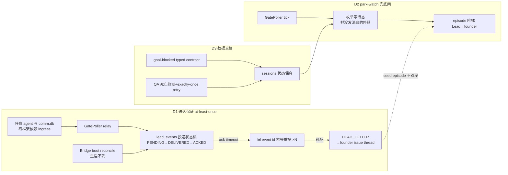

# FLY-1279 runner park 在门口无人知会 — 实施计划 v2

Issue: FLY-1279 (https://linear.app/geoforge3d/issue/FLY-1279/fix-runner-park-在门口无人知会-founder-审批门-goal-blocked-qa-静默死掉都缺主动通知lead)
日期: 2026-07-14
基于: research.md + founder 直令(2026-07-14 夜,经 Tadashi 转达:核心重定位为 agent-agnostic 消息送达保证)。v1 的 Codex design review R1+R2 结论全部保留(typed terminal contract、CAS retry、resume 吞 flag 修正、gate 交叉验证、per-kind escalation policy、通知唯一 owner、exactly-once launch claim)。

## 0. 概要(v2 重排)

**founder 输入(最高优先)**:1279 的核心不是「等待态巡检/通知」,是【**agent-agnostic 的送达保证**】。Claude 有原生机制(teammate-message)把消息主动传给 Lead,Codex 没有——要保证「任何 agent 任何时候需要 Lead 都能把信息送达」,且对未来任意 agent 后端成立。

| 交付物 | 内容 | 来源 |
|--------|------|------|
| **D1(第一交付物)** | **送达保证**:runner→Lead 消息 ①持久落盘(Bridge 重启不丢) ②推送后要求 Lead ACK(已处理确认,非已读) ③超时未 ACK 自动重投 ④重投 N 次不达→死信升级 founder(issue thread) | founder 直令 |
| D2 | park-watch **语义兜底网**(抓「没发消息但在等」的停顿;gate_row_missing/gate_unreachable 保留;主通道职责移交 D1) | 原 B1 降级 |
| D3 | QA 死亡检测+回踢(D3a)/ goal-blocked 传真(D3b) | 原 B2+B3 不变 |



实施为一个 PR、按 **D1→D3→D2** 顺序的 commit 组(D1 独立;D3 是 D2 的数据前提;若体量失控拆分线即 D1/D3/D2)。

## 1. 目标 / 非目标

**目标**(v2 排序):
1. **送达保证(D1)**:任何 agent(Claude/Codex/未来任意后端)经 comm.db 发给 Lead 的「需 Lead 行动」消息,Bridge 重启不丢、Lead 未 ACK 自动重投、重投耗尽死信升级 founder——链路上不存在静默丢失点。
2. runner park 在 founder 审批门 → Lead ≤N1 收到;再 ≤N2 无处理证据 → founder 收到(D2)。
3. QA session 死 → Lead 告警 + 自动 clean-retry;耗尽 → 事故可见并升级;implement 不再永等(D3)。
4. goal 自标 blocked → 状态/原因保真,Lead 被通知(D3)。
5. gate 行丢失(1262/1264 形态)→ **D1 H2 不变量修复(主,VD2 release gate)** + D2 事故态检测兜底(R5-6:boot reconcile 只管投递状态续投,不是丢行的恢复手段)。
6. 真机重演 7-14 夜场景 → 无 3-4h 静默。

**非目标**:不改 RunDispatcher detached-promise 结构;不改 QA-held 对健康 QA 的压制哲学;不做 fix-cycle 缺陷清单(FLY-1225);不改 badge;不动 FLY-1041 ship 卡片;不改 milestone-report-policy main-only 过滤;**不重写 ingress/egress 链路形状**(现有 commdb→GatePoller→LeadRuntime 保留为主通道,D1 只升级其保证级别)。

## 2. D1 — agent-agnostic 送达保证(at-least-once)

### 2.1 现有链路定位(保留为主通道)

```
任意 agent ──(flywheel-comm CLI 写 CommDB messages,SQLite,零框架依赖)──► per-project comm.db
    ✔ ingress 已 agent-agnostic:能跑 CLI 就能写
Bridge GatePoller(3s)读 pending ──► relayToLead ──► appendLeadEvent(StateStore lead_events,durable)
    ──► LeadRuntime.deliver(per-Lead backend:MailboxLeadRuntime→Claude teammate-message 打断式注入;
        CommDBLeadRuntime→Codex instruction)──► markLeadEventDelivered / recordDeliveryFailure
    ✔ 最后一跳已是主动打断式、backend 可插
```

问题不是形状,是**保证级别 = best-effort**。四个洞(全部有 7-14 夜语料):

| # | 洞 | 现状 |
|---|----|------|
| H1 | delivered ≠ consumed | 「delivered」=写进 mailbox/指令,无 Lead ACK 概念(FLY-109 只为 Lead-resume 场景做过 delivered_at+ack tool,非普遍协议) |
| H2 | Bridge 重启窗口 gate 从 comm.db 消失 | 1262/1264 两例;根因待取证(嫌疑:TTL 清理时序 / hygiene 误清 / 写入-投递竞态) |
| H3 | 重投耗尽后静默 | 仅 GUARDRAIL_EVENT_TYPES 重投(HeartbeatService,上限 5),耗尽无死信无升级 |
| H4 | 非 guardrail 事件失败不重投 | 一次 deliver 失败即止 |

### 2.2 投递状态模型:logical event 与 delivery attempt 分离(R4-1)

**两层持久状态**(lead_events 为 logical-event 账本 + 新 attempt 层;better-sqlite3 WAL,幂等迁移):

- **logical event**(lead_events 扩展列):`ack_required INTEGER`、`ack_policy TEXT`(question_response | explicit_receipt | founder_surface_confirmed)、`ack_protocol_version INTEGER`、`ack_deadline_at`、`acked_at`、`dead_lettered_at`、`ack_token_valid_until TEXT`、`ack_token_consumed_at TEXT`、`routing_snapshot TEXT`(issue/**project/commdb 路径**/thread/**owning lead**,enqueue 时固化——R4-8+R6-2)。
- **ACK token 生命周期**(R6-1+R7-1):token **不落库明文**——带 domain separation 的规范化派生:`token = HMAC(delivery_secret, canonical({purpose:'lead-event-ack', eventSeq, ackOwnerLeadId, ownerEpoch}))`(canonical=长度安全编码,如 JSON canonical form;字段名即 ackOwnerLeadId——R10-2)。新列 `ack_owner_epoch INTEGER NOT NULL DEFAULT 0`,**每次 ownership transfer 原子 +1**——A→B→A 轮回后 epoch 已变,A 的原 token 不会复活(R7-1:单纯 lead_id 派生做不到这一点)。**ownership transfer 的数据库操作定死**(R8-2):不动 `lead_id`(它是 `UNIQUE(lead_id,event_id)` 去重身份键,永不变)——新增**独立可变列 `ack_owner_lead_id TEXT`**(初始=lead_id)承载当前 owner;当前授权态 = `ack_owner_lead_id + ack_owner_epoch`。transfer = 单事务{更新 ack_owner_lead_id、epoch+1、退休旧 owner 的未完成 attempts(retired_at)、给新 owner 分配一个稳定 attempt_no 的 reminder}。身份键不动 → 同一 logical event 永远只有一行,不存在 target-owner 行冲突。receipt 消费按 **ack_owner_lead_id** 查(routing_snapshot 只定位 project/CommDB + 审计 fallback——R8-2)。测试:transfer-vs-ACK、transfer-vs-finalization、transfer-vs-reminder 分配。失效规则:ACK 消费即失效(`ack_token_consumed_at`);dead-letter 后保留**有界 late-ACK 窗口**(`ack_token_valid_until = dead_lettered_at + FLYWHEEL_ACK_LATE_WINDOW_MS`,默认 24h)内仍接受 → episode 标 resolved-late;窗口过后拒收。测试:A→B→A replay 拒收、ACK-vs-transfer 竞态、并发 transfer、(lead_id,event_id) 唯一性冲突在 transfer 中的解决(R7-1)。
- **delivery_secret 操作合同**(R7-3+R8-3,首装/缺失/rotation 互斥可执行):
  - 路径 `FLYWHEEL_DELIVERY_SECRET_PATH`(默认 ~/.flywheel/delivery-secret),0600、owner/mode/symlink 校验;secret 文件带 `secret_id` 头,StateStore 持久记录 active secret_id 作**初始化 marker**。
  - **首装 vs 删除可区分**(R8-3):只有显式 init/provisioning 步骤(Bridge 首次 boot 的 provisioning 路径,O_EXCL 创建)可创建首 key 并落 marker;marker 已存在而文件缺失/corrupt → **fail-loud 暂停 ACK-cohort 工作**(不影响 ACK-exempt legacy 投递;`FLYWHEEL_DELIVERY_ACK=0` 模式无 secret 依赖),Lead alert 走**非递归 ACK-exempt 路径**,绝不重建。
  - **跨存储 crash 协议**(R9-3:secret 文件与 StateStore marker 无法单操作原子安装):**版本化 secret 文件**(`delivery-secret.<secret_id>`)+ StateStore 状态机 `PREPARED → ACTIVE`。顺序:写新版本文件(fsync)→ marker 置 PREPARED(记 new secret_id)→ rename/激活 → marker 置 ACTIVE。**commit(ACTIVE)之前旧 key 一直有效**;旧 token 停止验证的确切时刻 = marker 切 ACTIVE。boot 对账枚举全部文件/marker 组合:crash-after-file-create(无 marker→删孤儿文件)、crash-after-PREPARED(旧仍 ACTIVE→重走或回滚)、crash-after-marker-switch(fanout 未完→按幂等键补发)、crash-during-reminder-fanout(幂等键 `(event_seq, secret_id)` 保证不重复)。
  - **rotation = 线性化操作**(R8-3):暂停新 claims → 按上述协议安装新 secret → 旧 secret 的 finalizer 因 `secret_id_at_claim` fence 失效 → 每个 eligible 在途 ACK-required 行恰发一个新 token reminder(reason=secret_rotation,不消耗预算);DEAD_LETTER_PENDING/late-窗口内行同样 re-derive(窗口时长不变)。
  - 测试:first-boot、deleted-secret、并发 ACK/rotation、crash-mid-rotation、OFF-mode 不受影响、告警不递归。token 材料在 receipt/audit/error 日志中一律脱敏。
- **delivery attempt**(新表,DDL 定死——R5-1):

```sql
CREATE TABLE IF NOT EXISTS lead_event_delivery_attempts (
  attempt_id TEXT PRIMARY KEY,
  event_seq INTEGER NOT NULL REFERENCES lead_events(seq),
  attempt_no INTEGER NOT NULL,
  kind TEXT NOT NULL CHECK(kind IN ('initial','reminder')),   -- 不可变用途(R6-3):crash 重试不是 kind,
  reason TEXT NOT NULL CHECK(reason IN ('initial','ack_timeout','owner_transfer','secret_rotation')),
  counts_toward_redelivery INTEGER NOT NULL CHECK(counts_toward_redelivery IN (0,1)),
  -- per-reason 定值(写死,不靠 caller 纪律——R10-2):initial=0, ack_timeout=1,
  -- owner_transfer=0, secret_rotation=0(no-ACK 预算只数 ack_timeout,修 off-by-one——R10-1)
  claim_token TEXT NOT NULL,
  owner_epoch_at_claim INTEGER NOT NULL,                       -- R9-1:finalize fence 用
  secret_id_at_claim TEXT NOT NULL,
  reclaim_count INTEGER NOT NULL DEFAULT 0, last_reclaimed_at TEXT,
  lease_expires_at TEXT NOT NULL,
  claimed_at TEXT NOT NULL, pushed_at TEXT, finalized_at TEXT,
  outcome TEXT CHECK(outcome IN ('pushed','failed')),          -- 审计真相不被覆盖(R6-3)
  retired_at TEXT,                                             -- ACK/transfer 退休走独立时间戳,不动 outcome
  UNIQUE(event_seq, attempt_no)
)
```

  - **finalizer fence**(R9-1):所有 attempt finalizer 一律 `WHERE claim_token=? AND finalized_at IS NULL AND retired_at IS NULL`;logical row 更新额外以 claim 时捕获的 `owner_epoch_at_claim`/`secret_id_at_claim` 对照行当前值 fence——transfer/rotation **先** advance epoch/secret 并 retire 旧 attempts、**后**分配替代 reminder,晚归的旧 push finalizer 必败(既不改 attempt 也不改 logical deadline/状态)。adversarial 测试:push 后暂停 transport → transfer/rotation → 释放旧 finalizer → 断言零状态变化。
  - **两个独立有限预算**(R9-2+R10-1):(a) **no-ACK 预算** = 只数 confirmed `reason='ack_timeout' ∧ outcome='pushed'` attempts,上限 `FLYWHEEL_DELIVERY_MAX_REDELIVER`(initial 不计——N 个 reminder 全额可用,修 off-by-one);(b) **传输失败预算** = 数 definite `outcome='failed'` attempts(initial 与 reminder 皆计,含 missing runtime/routing),上限 `FLYWHEEL_DELIVERY_MAX_TRANSPORT_FAILURES`(默认 5,独立 env);uncertain crash 是同 attempt reclaim,resolve 前不计任何预算。**任一预算耗尽 → DEAD_LETTER_PENDING**(保留 R4 的 PENDING 传输耗尽边;无限重试路径消灭)。**预算矩阵定死**(R11-1):no-ACK 预算 = `reason='ack_timeout' ∧ outcome='pushed'`;传输失败预算 = `outcome='failed'` 的**全部 reason**(含 owner_transfer/secret_rotation——transfer/rotation 后 runtime 坏死同样有限次后死信,不豁免);系统动作 reason **只**豁免 no-ACK 预算(成功 push 不计 no-ACK)。**末次 reminder 的完整 ACK 窗口**(R11-1):第 N 个成功 ack_timeout reminder 之后,死信只在该 reminder 的新 `ack_deadline_at` 过期时发生(不提前);传输预算耗尽可立即死信。新 owner 的 ACK deadline 在其 reminder confirmed push 后才重置。测试:initial+恰 N 个 reminder、N 次 initial/reminder/transfer/rotation 传输失败、missing runtime、混合 fail/push/timeout 序列、N-1/N 边界反复 rotation/transfer、**末次 reminder 的 deadline 前/时/后 ACK 边界**;rotation reminder 幂等键 `(event_seq, secret_id)`(R9-3)。

  - **统一投递原语**(R6-3 关键):新 `deliverLeadEventAttempt()` 服务——**所有** ACK-cohort 事件的立即推送(GatePoller relay、session 事件投递等现有多条 `appendLeadEvent→runtime.deliver` 直连路径)与 Heartbeat 重试**都必须经它**(内含 claim-before-await);**sentinel 测试禁止 ACK-required 事件出现在任何直接 runtime.deliver 路径上**——漏一条直连路径就绕过全部保证。非 ACK 事件维持现状直连。

  - **分配原子性**:`UNIQUE(event_seq, attempt_no)` + INSERT-or-fail——两个 Heartbeat cycle 抢同一 reminder 轮次时只有一个成功(R5-1)。
  - **lease/reclaim**:`lease_expires_at`(默认 2×ackTimeout)过后其他 worker 可 reclaim:CAS 替换 `claim_token`(旧 token 的 finalize 从此必败);uncertain crash 的 adopt = 同 attempt_id + 新 claim_token 续推。
  - **finalize 事务**:单事务内 CAS attempt(**canonical finalizer 谓词,全文唯一定义,处处引用**——R10-2:`WHERE claim_token=? AND finalized_at IS NULL AND retired_at IS NULL`,且 logical row 侧以 `owner_epoch_at_claim`/`secret_id_at_claim` 对照当前值 fence)+ 更新 logical row(`delivered_at`/`ack_deadline_at`),要么都成要么都不成。**contract sentinel 测试**:代码中任何弱于 canonical 谓词的 finalizer(缺 retired_at 或缺 epoch/secret fence)判失败。
  - **cohort 判定**(R5-1 修正):按持久化的 `ack_required=1 ∧ ack_protocol_version IS NOT NULL` 选行(**不是**非空 deadline——PENDING 行首推成功前没有 deadline,那样会把初投失败漏出机制);非空 deadline 只用于 DELIVERED-due 查询。
  - **legacy 列**:lead_events 既有 attempt 计数列保留给 ACK-exempt 行(现状路径);D1 cohort 行以 attempt 表为唯一真相(旧列只读镜像,不双写决策)。
  - **首个 await 之前**先 durable claim;uncertain crash 的 reclaim = **同 attempt_id、同不可变 kind、同 attempt_no**,只换 claim_token 并 `reclaim_count+1`(R7-2:kind 永不变——崩溃的 reminder 依然是 reminder attempt N,不重复打断 Lead);**故意的 ACK-timeout reminder 才分配新 attempt_id**(kind=reminder,内容仍带同 logical event id)——「crash 重试不打扰、reminder 必须打扰」的机制分界(R4-2)。

```
enqueue(ack_required 按 policy registry 定,routing_snapshot 固化)
PENDING ──attempt(claim→push 成功)──► DELIVERED(ack_deadline = now + ackTimeout)
PENDING ──传输 attempts 耗尽──► DEAD_LETTER_PENDING          ← H3 的初投耗尽同样死信(R4-1)
DELIVERED ──ACK(机器证据或显式收据)──► ACKED(终态;ACK 永远赢过晚到的 finalizer)
DELIVERED ──deadline 过 ∧ reminder 轮次 < N──► 新 attempt_id reminder(刷新 deadline)
DELIVERED ──deadline 过 ∧ 轮次 >= N──► DEAD_LETTER_PENDING
DEAD_LETTER_PENDING ──(经 detection-escalation episode,founder issue-thread post **confirmed**)──► 写 dead_lettered_at
```

- 所有 finalize 一律用 canonical finalizer 谓词(定义见 2.2 finalize 事务,含 retired_at 与 epoch/secret fence);logical row 终态另加 `acked_at IS NULL AND dead_lettered_at IS NULL` 守卫。
- **late-ACK after confirmed page**:允许,状态记 acked_at(episode 标 resolved-late),不撤回已发 page,不再有后续动作。
- 参数:`FLYWHEEL_DELIVERY_ACK_TIMEOUT_MS`(默认 5min)、`FLYWHEEL_DELIVERY_MAX_REDELIVER`(默认 5)。

### 2.3 ACK 通道:backend-neutral 收据 + 机器证据优先(R4-2/R4-3)

**现状核实**(R4-2):`flywheel_inbox_ack(message_id)` ack 的是 CommDB instruction 的 read_at;Claude 默认走 MailboxLeadRuntime(无 CommDB message id);`LeadEventEnvelope` 无 event_id;mailbox 的 sidecar dedup 会吞同 ID 重投。因此:

- **backend-neutral ACK 收据——机制定死(R5-2):v1 唯一机制 = validated CommDB receipt,经 GatePoller 消费**。理由:与 ingress 同一 agent-agnostic 性质(能跑 CLI 就能 ACK),零新 HTTP 面。具体合同:
  - **receipt schema 与路由**(R6-2/R7-4/R9-4):**公共 handle = lead_events 的 `seq`**(全局唯一,随 envelope 与渲染文本携带——R9-4:`event_id` 只在配上 immutable lead_id 时才唯一,不能单独作 handle);payload `{event_seq, ack_token}`。**lookup by seq → timing-safe 比对 HMAC**(按行当前 `ack_owner_lead_id + ack_owner_epoch + active secret_id` 重派生;派生 tuple 字段名即 `ackOwnerLeadId`,不再叫 leadId)。测试:两个不同 immutable Lead 拥有相同 event_id 值时 receipt 不歧义。写入命令 `flywheel-comm ack-event <event_seq> --project <name> --token-stdin`——**token 经 stdin 传入**;**MCP tool 路径直接传参**(工具调用不经 shell,无 history 面,是 Claude Lead 主路径)。**CLI 渲染指令 = 两步交互形式**(R8-4:heredoc 是命令文本的一部分,常见 shell 会把 body 连 token 一起写进 history——不承诺单块复制粘贴 history-safe):第一步起命令,第二步向运行中进程的 stdin 供 token(或受保护 fd/文件)。集成测试:在受支持的 Lead shell 上跑完文档流程后检查 history 无 token。routing_snapshot 只用于定位 project/CommDB 与审计 fallback(R9-4:**不作 receipt lookup 依据**——lookup 唯一路径是 seq)。
  - **授权合同 = bearer-only(诚实合同——R8-1)**:CommDB 的 `from_agent`/`FLYWHEEL_LEAD_ID` 是 caller 可控的,**不是**认证身份(仓库明文如此)——因此授权唯一依据是**持有当前 token**(HMAC 按当前 owner+epoch 派生,持有即授权);`from_agent` 仅作 advisory 审计元数据。wrong-Lead 防护改写为 wrong-token 拒收(旧 owner 的 bearer 因 epoch 失效);真正的 per-Lead 认证边界留给 FLY-246 类 follow-up,本票不承诺做不到的身份验证。
  - **授权 = per-event bearer capability**:token 按 2.2 的 HMAC 派生(不落库明文、owner/epoch/secret 版本变更自动轮换);GatePoller 校验 = 按 seq 取行 → timing-safe 重派生比对(R9-4:无 owner 身份输入,bearer 即授权);ACK 消费/终态+late 窗口规则见 2.2。
  - **消费**(R6-2):GatePoller tick 扫 ack_receipt 行 → 幂等 CAS `acked_at`(`WHERE acked_at IS NULL`)→ 退休该 logical event 的所有 attempts(写 `retired_at`,outcome 不动);**receipt 行无论有效/无效都标 consumed+审计**(无效 token 的行不会被无限重拒重日志)。
  - **Claude Lead tool**(R6-2:旧 `flywheel_inbox_ack(message_id)` 作用于 CommDB instruction 行,mailbox 投递的事件没有 message_id,**升级底层做不到**):新增明确命名的 **event-ACK tool**(`flywheel_inbox_ack_event {event_seq, project, token}`——R10-2 与公共 handle 一致),旧 message-ACK tool 原样保留给 FLY-109 场景;**Codex/任意 Lead**:直接 CLI。规则文件落点:`lead-rules-base` 新 ack 义务节 + codex lead contract 同步。
  - **拒收测试**(R5-2/R8-1 改写为 bearer 语义):wrong token(含旧 owner 的过期 bearer)、unknown seq、malformed receipt、expired/replayed token、A→B→A reassignment 后旧 token 拒收。
- **CommDB 指令渲染**用既有 caller-stable `dedupeId`/`insertInstructionWithId` seam(reminder=新 dedupeId 才再打断,crash retry=同 dedupeId)。
- **机器证据优先(auto-ACK)**:`gate_question`/`runner_question` 的 durable response(`getResponse(question_id)`)本身即处理证据——policy=question_response,**Lead 答了门就自动 ACK,不要求补工具调用**(否则答了门忘了 ack 会误死信误 page——R4-3 的 false-dead-letter 陷阱)。显式收据(explicit_receipt)只留给无机器证据的事件类。
- **ACK policy registry**(R4-3):新 `ACK_REQUIRED_EVENT_TYPES`/policy 注册表(**不是**现有 GUARDRAIL_EVENT_TYPES——核实后它不含 gate_question/runner_question/session_failed,且含有自己 escalation 语义的 detection 事件)。初始清单(v1):gate_question(approve_to_ship 类以 confirmed ship 卡片为 founder_surface_confirmed 证据,brainstorm 类以 confirmed 转发同理;其余以 question_response)、runner_question(question_response)、runner_park_notice、gate_timed_out、**session_failed(含 failureKind=goal_blocked——注意是 session_failed 事件带 blocked failure kind,不存在独立的 blocked 事件类型,R5-6)**(explicit_receipt)。`ack_required`/`ack_policy`/`protocol_version` **enqueue 时持久化到行上**;`FLYWHEEL_DELIVERY_ACK_TYPES` 是 enqueue-time policy,绝不重释历史行。
- **合同**:新 agent 后端只需(可选)实现收据写入;不实现 ACK 的后端自动退化为「reminder×N→死信升级」,保证不静默。合同测试:mailbox 与 commdb 同一 logical event 走完全程等价;**scheduled reminder 在 mailbox 上真的产生新打断,crash 重试同 attempt 不产生**(VD4 扩展)。

### 2.4 重投载体硬化 + 与既有 escalation owner 整合(R4-5/R4-6)

- **载体** = HeartbeatService 既有 `retryUndeliveredGuardrailEvents` cadence(零新 timer),但执行器硬化:①改**全局 bounded due-row 查询**(StateStore 直查,不按当前 config lead 扫——已被移除/改名的 Lead 的 durable 行也必须被访问,routing_snapshot 兜 owner 解析);②行级原子 claim(2.2 attempt 协议)先于投递;③missing runtime/routing = **失败 attempt**(计入耗尽可死信),不再静默 continue;④whole-pass single-flight 或完全依赖行级 lease。
- **与既有两个 delivery-failure owner 的归并**(R4-6):FN4 `delivery_failed_reconcile`(未投递耗尽/逾期)与 `delivery_unconsumed`(已投递未读 CommDB instruction)——**D1 状态机成为唯一 owner**:FN4 的输入面(未投递耗尽)并入 2.2 的 PENDING→DEAD_LETTER_PENDING 边;delivery_unconsumed 对 ACK-required 行为 D1 的 DELIVERED-未-ACK 所吸收(非 ACK 行保持现状)。落法:这两个 detector 对 D1 管辖的行**排除**(检测器输入过滤),避免双 page;全通道 total-output 测试(LeadRuntime+LeadAlertNotifier+detection+issue-thread)。
- **死信专属 escalation policy `delivery:dead_letter`**(R5-4——generic detection 流程对死信是错的:它会 Lead-first append+再等 grace+可能走 fleet lane,而 D1 到死信时已重投过 Lead N 次、要的是立即 founder leg):无 Lead-first append、**零额外 grace**、fleet sink 禁用、generic terminal/progress recovery 禁用、只有该 logical event 的 ACK 能取消。`DEAD_LETTER_PENDING` 与 logical event 原子创建/关联。
- **ACK vs founder-post 线性化**(R5-4):post 前先写 durable **page claim**(CAS)——ACK 在 claim 之前到达 → 取消死信;在 claim 之后 → late-ACK,记录但不撤回。`dead_lettered_at` 仍只在 confirmed post 后写。
- **issue-thread 路由不可用时**(R5-4):general-channel Lead alert fallback **不算 confirmed founder page**——fallback 自身去重、episode 保持 pending 等 issue-thread 重试;绝不重复告警、绝不假标死信完成。
- **founder-page ownership 账本扩到全部既有 owner**(R5-5——不止 D1↔D2):FLY-605 brainstorm 10min 转发、FLY-1041 ship 卡片、FLY-637 lead-pending page、FLY-725 milestone page 都可能对同一事实先/后产生 confirmed founder 通知。**canonical key 按 fact-episode 粒度**(R6-5:issueId+类别太粗——同 issue 的第二个 brainstorm 门、后来的 blocked、恢复后复发的 park 会被旧 key 永久压制):gate/ask → **question id**;goal-blocked → **execId+终态 failure fingerprint**;park → **D2 episode seq**。同一 occurrence 的所有 owner 映射同一 key,真正的新 occurrence 拿新 key。**只有 positively posted 的结果**写共享 confirmed ledger——FLY-605/725 的既有「done」marker 可能代表永久失败/重试预算耗尽/baseline seeding,**必须检查 outcome 才算证据**(R6-5)。page claim 带 lease/reclaim + stable sink event id(crash after claim before post 不 strand episode)。测试:recovery-then-recurrence(新 key 可再报)、failed-marker-must-not-suppress。
- **ACK 机器证据扩展**(R5-5 决策):`question_response` 不是唯一机器证据——**approve_to_ship gate 的 confirmed ship 卡片 = 该 gate_question「Lead-leg 已处理」的 auto-ACK**(该门要 Lead 做的事就是呈给 founder,卡片 confirmed 即完成;founder 未答不等于未送达);同理 FLY-605 brainstorm 的 confirmed founder 转发也是 Lead-leg 处理证据。policy registry 增 `founder_surface_confirmed` 证据类型。
- **D1↔D2 page ownership 双向确认**(R4-6):共享上述同一 confirmed-founder-page ledger(同事实一个 key)——D1 死信 post **confirmed 之后**才 seed D2 episode 为 FOUNDER_PAGED(post 失败不误压 D2);反向:D2 已有 confirmed page 时 D1 收敛不二次 page。
- **total-output 测试扩面**(R5-5):goal-blocked / brainstorm 门 / 审批门三场景,统计 **FLY-605+1041+637+725+D1+D2+fleet+LeadAlertNotifier+issue-thread 全部 sink** 的输出总和恰为承诺数。

### 2.5 持久化不变量与 H2(R4-7:H2 修复 = VD2 的 release gate,非可选)

**核实**(R4-7):GatePoller 常规轮询本来就会 relay 无投递记录的 pending row——boot 扫描增益有限;真正的洞是 **row 被删除或过期后,常规轮询与 boot 扫描都看不见**(getPendingQuestions 要求 expires_at>now)。因此:

- **不变量(D1 的核心交付)**:「未答的 action-required ingress row,在存在匹配的 durable delivery receipt(lead_events 行)之前,**不得过期、不得被删除**」;有 receipt 后未处理的行为由 2.2 状态机接管。
- **同库落法(R5-3——跨库读不可行:CommDB 读写构造器就会调 purgeExpired、含 Bridge 外调用方;resolveGate 走 runner CLI 路径,无 lead_events 访问)**:
  - messages 行加**同库保护元数据**(R7-2 统一词表,全文唯一状态列):`relay_state TEXT NOT NULL DEFAULT 'open' CHECK(relay_state IN ('open','protected','terminal_disposed'))` + `logical_event_id TEXT`;legacy 行迁移默认 open;pending 枚举/purge/response/hygiene/两开关模式全部使用同一词表与谓词。
  - **安全跨库顺序**:Bridge 先幂等 append lead_events 行(含**完整 immutable payload**,非摘要——R5-3:摘要重建不了消息与响应路由),再标 CommDB 行 protected;crash 在两步之间 → 行仍处 open 态、受本地保护规则兜底且可安全重放。
  - **本地保护规则**:`purgeExpired` 对「未答 ∧ action-required(question 类)」行一律跳过(无论 protected 与否——本地可判,不需跨库);expired-but-unanswered 行保持**可枚举**(getPendingQuestions 的 `expires_at>now` 过滤对 protected/unanswered 行改为续期语义,或加并集分支)。
  - **阻塞 gate 的可答性**(R5-3):父行保留到 **response 落库或机器证明的终态处置**为止(不是仅到 enqueue/投递)——否则投递成功后 flywheel-comm respond 因父行消失而失败。terminal-gate eviction(relayToLead :1375)与 zombie hygiene 同样只在有 response 或终态处置证据时才动行。
- **CommDB 迁移与 boot 顺序**(R6-4):`ack_receipt` 类型要求重建 `messages.type` CHECK 约束 + 更新 TS Message union;`relay_state`/`logical_event_id` 列迁移先于任何引用查询。**GatePoller 以只读打开 CommDB 且 openReadonly 有意跳过迁移** → Bridge boot 必须在开始轮询前对每个 project comm.db 做一次显式 **read-write 迁移**;迁移失败 = fail-loud(该 project 不进入轮询 + Lead alert),绝不带旧 schema 查询。测试:旧 schema DB、read-only-first boot、重复 RW open。
- **有界 retention 生命周期**(R6-4:保护规则不能让未答 ask 永生):messages 行本地可判状态 `open → protected → terminal_disposed`。进入 terminal_disposed 的条件(任一,全部同库可判或由 Bridge 写回):①response 落库;②机器证明的 runner/gate 终态处置;③**confirmed dead-letter 且 late-ACK 窗口已过**(Bridge 写回 disposition 标记)。terminal_disposed 后常规 TTL 清理恢复。阻塞 gate 保持可答直到 ①或②;非阻塞 ask 在 ③ 后有界清理。pending 查询谓词精确化:`(未答 ∧ action-required ∧ 状态≠terminal_disposed)`,protected 行过期语义为续期。测试:长期未答 ask 走完 escalation 后被有界清理。
- **H2 根因取证 = M1 第一任务且是 VD2 的 release gate**:重演 1262/1264 定位 row 消失机制(嫌疑路径即上述四条+写入-投递竞态),修复后 VD2 才算过。
- boot reconcile 保留(DELIVERED-未-ACK 续投 + attempt 对账),但**不再声称**是 H2 的行为级兜底。

### 2.6 开关与安全 cutover(R4-4+R5-6)

- `FLYWHEEL_DELIVERY_ACK`(default **ON**)。**cohort marker**:ACK 语义只作用于 append 时带 `ack_required=1 ∧ ack_protocol_version` 的行(R5-1 修正:不以非空 deadline 为 cohort 条件);**迁移把全部历史行 backfill 为 ACK-exempt**(杜绝重投/死信风暴);`=0` 期间新行同样 ACK-exempt 且禁用 due-row 扫描、ACK mutation、D1 死信创建——ON→OFF→ON 不重释任何旧行。迁移测试:历史 delivered/undelivered 行 + 三态切换。
- **H2 保护独立开关**(R5-6:H2 是数据保全,不随 ACK 关):`FLYWHEEL_COMMDB_PROTECTION`(default **ON**)控制 2.5 的清理路径豁免与保护元数据;`FLYWHEEL_DELIVERY_ACK=0 ∧ FLYWHEEL_COMMDB_PROTECTION=1` 是合法组合(gate 不丢但无 ACK 环),边界测试锁死;VD5 的「字节现状」承诺相应精确到 ACK 链路(两开关都 =0 才是全字节现状)。
- 全部新 env(`FLYWHEEL_DELIVERY_ACK`/`_ACK_TIMEOUT_MS`/`_MAX_REDELIVER`/`FLYWHEEL_DELIVERY_MAX_TRANSPORT_FAILURES`(默认 5——R11-1)/`_ACK_TYPES`/`FLYWHEEL_ACK_LATE_WINDOW_MS`(默认 24h)/`FLYWHEEL_DELIVERY_SECRET_PATH`/`FLYWHEEL_COMMDB_PROTECTION`)进 feature-flag registry + drift/restart/开关/到期边界测试(R5-6+R7-4)。
- v1 **ingress 合同明确列举**(R4-8):gate(brainstorm/question/approve_to_ship/自定义 checkpoint)与 ask 两类 CommDB question 流(=GatePoller 现有 relay 面);其他消息类型后续版本扩。「任何 agent 任何 action-required 消息」在 v1 = 这两类。
- dead-letter 的 issue/thread 路由用 enqueue 时的 routing_snapshot;session 被 prune/重派导致不可解析时,fallback = project generalChannel 的 Lead alert + snapshot 内容(**non-silent**,与 FN4 的静默 skip 相反——R4-8)。

### 2.7 测试

- attempt 协议 adversarial(R4-1):overlapping Heartbeat cycles、ACK-during-deliver、crash-after-claim、crash-after-push、crash-before-confirmed-post、late-ACK after page。
- ACK 管道(R4-2):reminder 新 attempt 在 mailbox 真打断/crash 重试同 attempt 不打断;ACK 退休全部 attempts;授权绑定。
- policy registry(R4-3):per-kind 真处理(答门→auto-ACK 不死信)与 false-dead-letter 防护。
- cutover(R4-4):历史行 backfill、三态切换、cohort 过滤。
- 载体硬化(R4-5):config 移除的 Lead 行仍被访问;missing runtime=失败 attempt。
- owner 归并(R4-6):FN4/delivery_unconsumed 对 D1 行排除;全通道 total-output;D1↔D2 双向单 page。
- H2(R4-7):VD2 crash 矩阵(lead_events append 前/后、push 后、TTL/hygiene 跑过、expired-but-unanswered)。
- R6 新增合同测试(R6-6):token late 窗口/reassignment 轮换;multi-project Lead receipt 路由 + 真 mailbox 事件 ACK;old-schema DB boot 迁移(read-only-first/重复 RW open/迁移失败 fail-loud);canonical-key recurrence(恢复后复发可再报)+ failed-marker-must-not-suppress;page-claim crash 恢复(claim 后 post 前崩溃不 strand);deliverLeadEventAttempt sentinel(禁 ACK-required 事件直连 runtime.deliver);长期未答 ask 的有界清理。

## 3. D3a — goal-blocked 传真(typed terminal contract)

(=v1 §2,全文不变——契约定义、CodexTmuxAdapter 改动、Blueprint 绕过 DecisionLayer 改写、双 sink 一致、milestone policy 不动、FLY-1257 接缝、测试。)

### 3.1 契约定义

```ts
type TerminalFailureKind = "goal_blocked" | "worktree_takeover_failed";
interface TerminalFailureInfo { failureKind: TerminalFailureKind; failureReason: string }
```
`AdapterExecutionResult`/`BlueprintResult`/`session_failed` payload 增可选 `failure` 字段;未知/缺失 kind → 逐字节回落 `failed`。

### 3.2 改动

| # | 文件 | 改动 |
|---|------|------|
| 3a | CodexTmuxAdapter(goal 终态,~:691-733) | blocked → `failure={goal_blocked, reason}`;CommDB status 写 blocked(不再 timeout);usage/budget 不变 |
| 3b | Blueprint 终态路径 | goal_blocked 绕过 DecisionLayer 改写(有 commits 也走 emitFailed 透传 failure);fallback 同 |
| 3c | ExecutionEventEmitter.emitFailed + TeamLeadClient | payload 透传 failure |
| 3d | 双 sink(event-route session_failed 分支 + DirectEventSink.emitFailed) | goal_blocked → StateStore status=blocked、last_error=reason;双 sink contract test |
| 3e | milestone patrol | **不改**(main-only 保留);所有 role 的 Lead 通知走 session_failed guardrail(D1 ACK 环内)+ D2 blocked parkKind 兜底 |

FLY-1257 接缝:只处理到达终态的 blocked,两 merge 顺序都安全,不 import 1257 模块;usage/budget/timeout contract test。
测试:有 commit + goal blocked → 仍 emitFailed(blocked);双 sink 等价;reverse-compat。

## 4. D3b — QA 死亡检测 + 回踢(CAS 状态机,exactly-once)

(=v1 §3,全文不变。)

### 4.1 record 状态机(auto_qa_record 表)

新列:`auto_retry_count`、`retry_intent_at`、`retry_attempt_id`(durable launch claim)。新状态 `retry_pending`、`retry_starting`(hold-active)。

```
running --(死亡检测 CAS: qa_execution_id==dead ∧ running ∧ count=0)--> retry_pending(count=1)
retry_pending --(sweep 取启动权 CAS,首个 await 前)--> retry_starting(retry_attempt_id 落库)
retry_starting --(respawn 成功 CAS)--> running(绑新 qaid)
retry_starting --(确定失败)--> stuck
retry_starting --(崩溃对账:按 attempt id 收敛;活 successor→adopt;确无→原 attempt id re-drive,绝不发新 id)
running --(死亡 ∧ count>=1)--> stuck(「重试用尽」)
```

- `findAutoQaOwnershipByQaExec`(hold-active+historical 全集)与 running-only CAS 分离;重复 hook no-op 绝不落三段式。
- 快速路径(session_failed hook,ownership 命中→CAS+Lead 告警+seed episode,不 spawn)+ 周期 sweep(`sweepOrphanedQaRecords`,GatePoller 独立 maintenance callback,**不受 D2 开关控**,boot+周期共享 single-flight)。
- respawn 序列:`hasInflightForRole===false` 硬门 → CAS retry_starting(首个 await 前)→ spawnQa(返回可判定 launch outcome,dispatch 带 attempt id 供 adopt)→ 成功 CAS running / 确定失败 stuck。
- worktree 清理:qaContext 禁 resume(见 4.2)后 respawn 走 Blueprint fresh-worktree 路径(FLY-99 removeIfExists 天然发生),coordinator 不碰 WorktreeManager。

### 4.2 auto-QA 永不走 takeover(dispatcher)

qaContext 存在 → 完全跳过 resume 计算与 progressResume 注入;`shareParentBranch` nullish 语义 + auto-QA 调用处显式 false;三段式/普通 resume 不变;fly887 takeover 测试全绿为闸。

### 4.3 三段式 takeover 专属告警

Blueprint takeover 失败 payload 带 `failure={worktree_takeover_failed, dirty|head_mismatch}`;三段式场景发 `three_stage_takeover_failed` Lead 告警(ALERT_EVENT_TYPES+kind-contract+lead-alert.sh 三处契约);与泛化 session_failed 投递共 dedup key 不双报。

### 4.4 测试

CAS 全分支/inflight 时序/launch-committed-后崩溃 adopt 同 execId/sweep 幂等/三段式分流。

## 5. D2 — park-watch(语义兜底网,降级自 v1 B1)

**职责收窄(v2)**:D1 承担消息级送达与死信升级后,D2 只抓「**没发消息但在等**」的停顿——goal-blocked 后的静默、QA 死亡的 hold 悬空、declared park 超长、审批窗口无人动、以及 D1 状态机本身失效的 gate 形态。founder 升级场景大幅收窄(多数「Lead 不动」场景会先被 D1 死信抓住)。

(机制=v1 §4 全文保留,要点:)

- **枚举**(GatePoller `onParkWatchTick`,20 tick,single-flight):`listParkWatchSessions()`(新 API,含 blocked)∪ pending questions ∪ `listActiveDeclaredStates()`(新 API)∪ auto_qa_record hold-active 全集(running/retry_pending/retry_starting/stuck/awaiting_retest;retry_starting 期间不 CLEAR)。partial inventory 不 CLEAR。
- **互斥优先级**:先 `reviewHoldReason`;held session 绝不产出通用 gate_wait_founder/awaiting_review episode;每 session 恰一 parkKind。
- **gate_row_missing/gate_unreachable 强判定**(保留,Lead 点名):真实 qid only;单次完整 CommDB read 交叉 getResponse+getMessageById+pending;读失败=unknown;连续 2 次 durable 观察(observeParkCondition 原子 counter)→ N1。与 zombie-gate hygiene/founder-reply watchdog 共 dedup key。
- **QA hold 分类**:spawn-pending(registration grace 10min)/qa_hold_healthy(N3=2h 仅 Lead)/qa_hold_orphaned(**Lead-only**)/qa_recovery_exhausted(QA 事故唯一 founder 路径)。
- **episode/投递**:复用 detection-escalation machinery + park:* per-kind policy(禁 generic terminal recovery——park:blocked 不被 OUTCOME auto-resolve;ACK 不停 founder 表;排除 fleet sink);v1 无 nudge 无聚合(有界 per-tick cap 5);Lead=runner_park_notice guardrail(**进 D1 ACK 环**),founder=issue thread confirmed-posted。
- **通知唯一 owner 矩阵**(v1 §4.5a 保留 + v2 新增一行):

| 事实 | Lead owner | founder owner | 去重 |
|---|---|---|---|
| goal-blocked | session_failed guardrail(D1 环) | main=milestone;phase=D2 N2 | hook seed episode LEAD_NOTIFIED;milestone marker=founder 证据 |
| QA 首死 | D3b alertLeadPipelineError | 无 | seed qa_hold_orphaned |
| QA 重试用尽 | D3b「用尽」告警 | D2 N2(QA recovery exhausted) | seed qa_recovery_exhausted,N2 从 receipt 起算 |
| takeover 三段式 | three_stage_takeover_failed | 无 | 与 session_failed 共 dedup key |
| **D1 死信** | (D1 已 Lead 重投 N 次) | **D1 死信 page** | **共享 confirmed-founder-page ledger/episode key(R4-6 双向):D1 post confirmed 后才标 FOUNDER_PAGED;D2 先 confirmed 则 D1 收敛不二次 page** |
| 其余 park kinds | D2 runner_park_notice | D2 issue-thread page | episode append+claim |

- **阈值表/开关矩阵**:=v1 §4.5/4.7(`FLYWHEEL_PARK_WATCH` default ON 只控 D2;与 FLY-927 四组合;`onQaReconcileTick` 独立常开)。

## 6. 验收(QA phase 剧本,529 Room 真机;VD=D1 置顶)

| # | 场景 | 预期 |
|---|------|------|
| VD1 | runner 开 gate,Lead 进程被杀后重启 | 消息不丢:Lead 重启后收到重投(同 event id),ACK 后停止重投 |
| VD2 | Bridge 在 gate 创建后立即重启(重演 1262)——**H2 修复为本条 release gate**;crash 矩阵:lead_events append 前/后、transport push 后、TTL/hygiene 跑过、expired-but-unanswered | 不变量成立:无 receipt 的 action-required row 不过期不被删;重启后被投递;runner 收到答案 |
| VD3 | Lead 持续不 ACK(模拟卡死) | ackTimeout×N 重投后 DEAD_LETTER → founder 在 issue thread 收到死信升级 + Lead alert 镜像 |
| VD4 | Codex Lead 后端同场景 | 与 Claude 后端行为等价(合同测试);不实现 ACK 的后端退化为死信升级,不静默 |
| VD5 | FLYWHEEL_DELIVERY_ACK=0 | ACK 链路(due 扫描/mutation/死信)字节现状;`∧ FLYWHEEL_COMMDB_PROTECTION=0` 才是全字节现状(两开关边界各有测试——R5-6) |
| V1 | implement 到审批门,Lead 不动 | ≤N1 Lead 收 runner_park_notice(D1 环内,未 ACK 会重投);再 ≤N2 founder issue thread;零 alert-channel |
| V2 | 杀死/注入 takeover_failed 的 auto-QA | Lead 告警;sweep clean-retry;再杀→stuck+用尽告警→qa_recovery_exhausted 升级 founder;implement 不永等 |
| V3 | goal-blocked(含有 commit 变体) | status=blocked+真实 reason 不被 decision 覆盖;Lead 收通知(phase role 也收);main=milestone page |
| V4 | Bridge 重启窗口建 gate | **D1 H2 不变量保住行 + 保护元数据 + 投递恢复(主)**;D2 gate_row_missing 连续 2 次观察→N1(兜底);正常答门零误报 |
| V5 | 健康 QA 1h / spawn 中 | 零通知;>2h 仅 Lead N3;registration grace 内不判 orphan |
| V6 | 开关矩阵(R6-6 四组合) | ①ACK=1∧PROTECTION=1(默认):全量 D1;②ACK=0∧PROTECTION=1:protected-best-effort(gate 不丢,无 ACK 环);③ACK=1∧PROTECTION=0:ACK 环开但无 CommDB 保全(不推荐,合法);④双 0:全字节 legacy。另 PARK_WATCH=0→D2 零增量而 D1/D3 仍工作;PARK_WATCH=0∧CHECKPOINT_WATCHDOG=1→旧 patrol 可用 |
| V7 | 风暴:同一 park 放置 2×N2;恢复后复发 | 全通道总和 Lead 通知恰 1 源、founder page 恰 1 次;恢复→resolve→复发=新 episode;Bridge 重启不重发不丢 |

## 7. 风险与回滚

| 风险 | 缓解 |
|------|------|
| ACK 协议给 Lead 增加负担/漏 ack 导致重投噪音 | 机器证据优先(答门=auto-ACK,零额外动作);显式收据只留无证据类;reminder 有限轮次;ship 后首 24h 观察 |
| H2 取证不确定 | H2 修复是 VD2 release gate(非可选);不变量「无 receipt 不得过期/删除」不依赖取证结论,取证定位具体修哪条清理路径 |
| 历史行重投风暴(cutover) | cohort marker + 历史行 backfill ACK-exempt;三态切换测试 |
| default-ON 首夜噪音(D2) | episode 去重+有界 cap+无 nudge;单 env 回滚 |
| gate_row_missing 误报 | 交叉验证+unknown+连续 2 次观察 |
| qa orphan 误报 | spawn-pending+registration grace,事实交叉不猜时长 |
| dispatcher 改动误伤 | qaContext 分支隔离;fly887 全绿为闸 |
| StateStore 迁移 | **native better-sqlite3 WAL**(本分支现状,R4-8 核实;save()/flush() 已是 no-op):幂等 CREATE/ADD COLUMN,遵循现有迁移模式 |
| 回滚 | D1 ACK 环:FLYWHEEL_DELIVERY_ACK=0;D1 CommDB 保全:FLYWHEEL_COMMDB_PROTECTION=0(双 0=全 legacy——R6-6);D2:FLYWHEEL_PARK_WATCH=0;D3:revert PR(残留行/列无害) |

## 8. 里程碑(v2 重排)

1. **M1:D1 送达保证**——H2 取证+不变量修复(VD2 release gate,第一任务)→ attempt 表+claim/lease 协议 → ACK policy registry+backend-neutral 收据(auto-ACK by response + 显式收据)→ 重投 pass 硬化 → FN4/delivery_unconsumed owner 归并 → 死信升级(confirmed-posted,共享 page ledger)→ cutover backfill → VD1-VD5 测试。
2. M2:D3a goal-blocked typed contract + 双 sink + 测试。
3. M3:D3b QA CAS 状态机+双路径检测+exactly-once respawn+dispatcher 修正 + 测试。
4. M4:D2 park-watch 观察层+detection-escalation 扩展(park:* policy+observeParkCondition)+新查询 API+接线 + 测试。
5. M5:集成场景+adversarial+开关矩阵+reverse-compat sentinel+lint 全套。
6. M6:PR + Codex code review → 独立 QA(VD1-5+V1-7 真机)→ founder gate。
