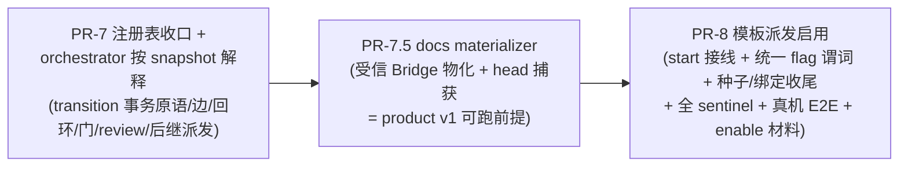

# FLY-1307 子单D：注册表迁移 + orchestrator 按 snapshot 解释 + 模板派发启用 — 实施计划

Issue: FLY-1307 (https://linear.app/geoforge3d/issue/FLY-1307/build-dag-模板引擎-子单d原-收尾注册表迁移-orchestrator-按-snapshot-解释-模板派发启用)
日期: 2026-07-16
基于: research.md
Status: **Codex APPROVED**（design review 5 轮：R1 7H → R2 4H+1M → R3 2H+1M →
R4 1H+1M → R5 APPROVED 零阻塞；全采纳零 reject，逐轮记录见 §7 与同文件夹
codex-rescue-design-feedback-*.md）→ implement

> **权威声明**：上游 spec = engineering/doc/FLY-1135-layer1-dag-templates/plan.md（v1.35，
> Codex APPROVED 4 轮）。本计划只做 **PR-7 / PR-7.5 / PR-8 的切片与验收映射**，一切语义
> 冲突以伞单 plan 为准，不重开设计。brainstorm gate（Tadashi）裁定已折入：
> materializer 独立成 PR-7.5；**D 关单 = 三片全落地**；回头边四要素逐字 v1.35；
> enable 决策呈 Annie ship gate；claims_read 硬前置闭合前保持 off。

## 0. 总验收（D 关单标准）

1. **伞单 §0 全项收口**：①红测保持绿（E1，不改弱断言）；②一份 YAML + 注册表声明 eng
   三段式，**编排行为**（交接/回环/门）与今天逐字等价（reverse-compat 等价 harness）；
   ③PRD S1–S16 全数成立（claims 载体形态）；④default-off：不启用模板 + 不迁移的旧路径
   行为一字不变。
2. **三片全落**：PR-7（registry 收口 + snapshot 解释）+ PR-7.5（materializer）+
   PR-8（派发启用收尾）全部 merge；不许只落一半报完成（gate 纪律 a）。
3. **每 PR**：Codex code review + 全量测试；PR-8 附一次真机 E2E。
4. **PR-8 验收硬 gate 在 source outbox 上**：断言 CommDB workflow_source_event /
   turn_source_history + projector 对账，不许投影降级冒充（伞单 §2.4b R3#2；
   加固语义见 §2.2-8 与 §4.3）。
5. 生产零行为变化：不翻任何 flag；enable 材料呈 Annie（含 default-enable 偏好 +
   claims_read 硬前置说明）。

## 1. 切片总览

依赖方向（R2#2 单向化）：PR-7 是解释引擎（7.5/8 都踩它），review subject 只依赖 PR-7
自己定义的 MaterializedHeadAuthority **接口**（fake 可测，unavailable fail-closed）；
PR-7.5 交付该接口的 durable provider + git 副作用（product v1 链 review 正向路径自此
可跑）；PR-8 是收尾（接线 + sentinel 全家桶）。依赖严格单向，无环。

## 2. PR-7 — 注册表全职责迁移 + orchestrator 按 snapshot 解释

### 2.1 注册表收口（双真相源窗口关闭）

- **真相方向**：node-type-registry.ts 成为节点类型语义（isPhaseRole / badge /
  preserveCompletionRole / capabilities）唯一真相；three-stage-phases.ts 的
  PHASE_THREAD_BADGE / isThreeStagePhaseRole / resolveCompletionSessionRole 改为**从
  registry 派生**（导入方向反转：registry 不再 import three-stage-phases——今天
  registry.ts:1 从 three-stage-phases 拿 badge，收口后 badge 字面量住 registry，
  three-stage-phases 派生导出，全部既有导出签名不变 → 10+ 消费方零 churn）。
- **dispatch 真相不动**：resolvePhaseDispatch / DEFAULT_PHASE_DISPATCH / 双向 kill-switch
  留在 three-stage-phases.ts（FLY-1224 语义，registry 不承载 vendor/model 默认值——
  enrolled run 的三元组在 snapshot 里钉住，非 enrolled 走 resolvePhaseDispatch）。
- **sentinel 升级（范围按 R2#5 收窄）**：1281 的 reverse-compat sentinel（断言两边值相等）
  升级为派生恒等断言 + drift 测试——**只**盯 badge / isPhaseRole / completion-role 的重复
  实现与 forbidden import 方向；**显式豁免** DEFAULT_PHASE_DISPATCH / resolvePhaseDispatch
  的 design/implement/qa role keys（dispatch 表必须留在 three-stage-phases.ts）。全部
  消费方行为字节回归（badge 渲染 / phase 判定 / completion-role 保留三组快照）。

### 2.2 orchestrator enrolled 分支（按 snapshot 解释；legacy 字节不变）

**0. engine ownership 判别（R1#3 定稿）**：引擎接管 ≠ claims 读迁移。既有
workflow_run.claims_read_enrolled 只表示「ship-eligibility 走 claims 读」，legacy
admitWorkflowExecution 也会置它、legacy shadow run 可以无 snapshot —— **不能**作 belt
early-return 键。新增**显式 engine-dispatch ownership 标记**（workflow_run 幂等
ADD COLUMN engine_owned INTEGER NOT NULL DEFAULT 0——定稿即此列，无备选形态）：**只**在
start reservation + typed snapshot 物化的同一事务内置 1（引擎创建的 run 之外没有任何
写点）；claims_read_enrolled 语义原样。phase-orchestrator belt 的**全部入口**
（onPhaseComplete / onQaResult / reconcileOnStartup / reconcileQaLoss /
reconcileTurnBelt）对 engine_owned run early-return；三类在飞部署分类测试
（legacy / claims-read-only / engine v1/v2 各 design/implement/qa）。

**1. 统一 transition 事务原语（R1#1 定稿）**：新增
**StateStore.commitWorkflowTransitionTx** —— 把「节点终局事实 + 选边 + 推进」收进
**一个 StateStore 事务**（伞单 §2.2 提交事务原文的引擎侧成员）：
以稳定 transition UID（从 (run_id, node_id, attempt, decision_kind) 确定性派生）CAS；
事务内：验 typed run + 当前 node/attempt + snapshot 合法出边集合 → 写 completion 收据
**或** claim（+核销凭证）→ 选择**唯一**合法 edge → loop 计数/attempt 推进 →
run_event（node_completed/claim_written + edge_traversed/loop_iteration/gate_opened）→
workflow_run_node/current_node_id 投影 → **durable dispatch intent**
（side_effect_ledger kind=dispatch 行，预留后继 execution_id）。
外部 launch 只消费已持久化 intent（C 的 launch_owner fence + fenced-commit 原样）；
advanceWorkflowRun / 启动 reconcile 只**重放**已定 transition/outbox，绝不重新决定边。
既有 submitWorkflowDecisionByCredential / commitEnrolledCompletion 对**非 engine_owned**
run 字节不变；engine_owned run 的提交走本原语（内部复用其校验与写入构件）。
测试：decision/completion 各 crash 点 + 双 driver barrier ⇒ 恰一 edge、恰一 successor
intent、重放收敛。

**2. 通用 decision canonicalization seam（R1#2 定稿——/workflow/decision 现状是 QA 专用**：
双 role=qa 校验、subject=PR head、producer 固定 implement、predicate 固定
qa_passed/qa_failed、成功直调 onQaResult，**不是「只接线」**）：
新 seam 从 credential→execution_binding→snapshot 钉住节点**服务端派生**
family/predicate（绝不信 caller）：qa 节点 = PR head authority + 实际 code producer
（既有构件）；review 节点 = **MaterializedHeadAuthority port**（见下）返回的当前
materialized head + output producer。两者都进 §2.2-1 的同一事务原语。engine_owned
决策成功后**不得**再调 onQaResult（belt 由 engine 接管）；legacy QA 分支请求/响应
字节兼容。
**MaterializedHeadAuthority port（R2#2 定稿——消除 PR-7↔7.5 反向依赖）**：PR-7 只定义
接口（(run,node) → { head, outputId, attempt } | materialized_head_unavailable）+
**unavailable ⇒ fail-closed 拒**；PR-7 的 review 单测（family/predicate/同厂商/
transition）全部用 fake provider；**durable provider（materialization receipt 读侧）与
真 head / stale head / response-loss 集成测试归 PR-7.5**。product v1 的正向 E2E 归
PR-7.5/PR-8，PR-7 不认领。
PR-7 测试：review pass/fail（fake head）· 同厂商双层拒 · 伪造 client head ·
unavailable fail-closed · response-loss replay。

**3. 选边语义**：按钉住 typed snapshot（parseWorkflowRunSnapshot，全消费方经 parser）
取当前节点合法出边；条件封闭枚举（design_done/implement_done/qa_pass/node_done/
review_pass + loop_when: qa_fail/review_fail）；非法转移 fail-closed。

**4. 回头边（gate 纪律 b：四要素逐字 v1.35）**：loop_when 命中 ⇒ loop_iteration event +
目标节点 attempt=max+1 重新 admission（新 decision capability，旧票吊销——C 既有
attempt 规则）；max_iterations 超限 ⇒ on_limit 动作（escalate 给 Lead/founder，
fail-closed 不静默继续）。phase-orchestrator 今天的 QA-FAIL belt 守卫
（recordFixRound/epoch/countImplementPhases 上限）**逐字迁移**为该边的解释语义。

**5. 前进边与派发**：dispatch intent → run-dispatcher 既有 pre-bound seam（预绑
execution + launch_owner fence + fenced-commit）→ Blueprint。派发三元组一律取 snapshot
钉住的 dispatch{vendor,model,effort}（不许旁路 FLY-1224 resolver 语义；vendor→executor
走 VENDOR_TO_EXECUTOR）。后继 StartRequest 保留 legacy 三段式等价的
sessionRole/shared-branch/startPoint/TURN/park-wake/label-bypass 组装（等价 harness 盯）。

**6. admission 放宽（C→D 唯一口径变化）**：admitGeneralizedWorkflowExecution 的
「fresh 仅起点节点」放宽为「起点节点 ∨ 引擎 transition 产生的合法后继」——后继 admission
只接受**引擎内部 GeneralizedExecutionContext**（HTTP 触发拒）；attempt 规则不变；
review 节点 admission 解锁（predicate family=review_verdict 凭证）；
qa_verdict∧produces_output 组合仍拒。

**7. gate 终点 + ship_claims USE-time 门（R1#7 + R2#4 定稿）**：进入 gate 节点 ⇒
gate_opened event + 融入既有 founder 批准面（approve 卡）。新增 **engine-owned run
专属的 terminal/ship precondition**，两件事钉死：
- **predicate→authority 封闭映射表**（解析绝不跨 predicate 混认——design_review_approved
  与 codex_approved 同属 review_verdict family，必须 exact-predicate 匹配）：

  | ship_claims 项 | node/decision | attempt | exact predicate | subject authority |
  |---|---|---|---|---|
  | qa_passed | qa 节点 / qa_verdict | 当前 attempt | qa_passed | PR head（既有 authority）|
  | design_review_approved | review 节点 / review_verdict | 当前 attempt | design_review_approved | 当前 materialized head（MaterializedHeadAuthority）|
  | founder_approved | run 级 founder challenge | — | founder_approved | 与上一行**同一** authoritative head（product v1 = materialized head；eng = PR head）|

  逐项 USE-time 解析按伞单 §2.1 算法（最高 attempt/server_seq，未过期、无 revocation、
  无冲突、pass）；缺失/fail/冲突/revoked/stale head ⇒ hold。
- **唯一 composite seam + 终局写点封闭表（R3#2 定稿——以实际 symbol 为键，实现期
  只许在此表上做增删并同步测试，不许留「实现时再枚举」）**：不散落新门——扩展既有
  merge-ship-gate.computeAuthoritativeShipDecision（已是权威合成点）：legacy 判定
  原样 + engine_owned run 的 additive ship_claims 结果。终局写点分类表：

  | caller（symbol） | 分类 | engine_owned run 上的行为 |
  |---|---|---|
  | DirectEventSink / event-route / W2 / marker-reconciler（computeAuthoritativeShipDecision 既有调用方）| ship terminal | 走扩展后 seam，ship_claims 不满足 ⇒ hold |
  | external-merge-reconcile.handleParked（经 seam）| ship terminal | 走扩展后 seam |
  | external-merge-reconcile.handleCompletedUnfinalized → finalize()（**completed-recovery 路径**：三头相等 + trusted founder response 后**直接** runPostShipFinalization/markIssueDone，今天不走 seam）| ship terminal（R4#1 定稿）| composite seam 内钉 **engine-owned completed-recovery 模式**：legacy path-2 的 headMatch + trusted-approval 判定**原样字节不变**；engine_owned run 额外以**当前 authoritative head 在 Done USE-time 重验完整 ship_claims**——缺失/revoked/冲突/stale ⇒ 不调 post-ship/不 Done/不归档。**禁止**对 completed row 重跑 status-bound verifyApproval（它硬要求 approved_to_ship，恒拒）。反例三组：claim 后撤销 / head stale / claim 缺失均不 Done；合法当前 claims 才恢复；legacy completed-recovery 快照字节不变 |
  | merge-ship-gate.finalizeRecoveredMerge（直写 completed）| ship terminal | 必须先过 seam；绕行 = 反例测试 |
  | close-runner.closeRunnerInner 的 applyTransition(...,'completed') | **housekeeping 豁免（显式）**：只清理 runner session，**绝不** terminalize workflow run / 触发 Linear Done | 反例测试：engine_owned run 上 close runner ⇒ run 状态与 Done 均不动 |
  | done-running-reconciler.reconcileDoneRunning（running→completed）| housekeeping 豁免（同上）| 同上 |
  | stale-blocker-guard.finalizeStaleBlocker（parked→completed）| housekeeping 豁免（同上）| 同上 |
  | Linear-Done / issue finalization 调用点（post-ship-finalization 面）| ship terminal | 必须先过 seam |
  | product v1 run 级终局（无 PR）：founder decision source event → projector → advance 的 run terminal CAS | ship terminal（**唯一**入口，不存在别的）| 走 seam |

  每行配逐 caller 绕行反例测试（不只测 resolver 本身）；实现期发现表外新写点 =
  设计缺陷，回表补行再动代码。legacy evaluateShipEligibility 读路径字节不变，
  force_legacy 语义不动。
测试：product v1 无 QA 链 · review revocation/rematerialization 后 gate 拒 · founder
stale head 拒 · 同 family 异 predicate 不互认 · 每个终局 caller 的绕行反例 ·
eng v1 QA+founder 组合矩阵。

**8. TURN 权威与 run 归属（R1#6 定稿）**：现状 grantTurn 的 source event/history
target_run_id 固定 null、projector 拒非 null 且只写 receipt 不追加 run event ——
只证「有 TURN source」不证「归属此 run」。**engine-owned TURN**：source payload/history
写 target_run_id（引擎交接时由 server 从 new-holder execution binding 派生并校验
project/issue/run 一致）；projector 对带 run 归属的 source 在 receipt 同一事务追加
稳定 UID 的 run TURN event。**legacy grantTurn 的 null payload 字节不变**（回放兼容）。

**9. 启动对账升级**：stranded collector 对 engine_owned run 从「识别 + hold」升级为
「按收据/claims/transition 重建推进点 → 重放 advance」；对账绝不双派 writer
（launch_owner fence 判别），绝不搁浅 open node（伞单 §2.4b）。

### 2.3 PR-7 验收

- **eng 等价 harness（伞单 §0-2 的落点）**：测试内建 engine_owned v1 eng run（三档种子
  任一），驱动 design→implement→qa→founder_gate 全链 + qa_fail 回环 + max 超限 escalate，
  逐事件比对今天 phase-orchestrator belt 的行为快照（交接顺序/回环轮数/门行为逐字等价；
  厂商阵容 = 有意差异不比对）。
- E1 红测保持绿（断言原文）；E2-E6 全绿保持；1281 全部 OFF sentinel + byte-compat 快照不动。
- 新增矩阵：非法转移拒 · 后继 admission 仅引擎上下文可达（HTTP 拒）· transition 事务
  crash 点 × 双 driver barrier（恰一 edge/恰一 intent）· loop 四要素（命中/出环/超限
  escalate）· review 执行正负（fake head：跨厂商通过/同厂商双层拒/伪造 head/
  unavailable fail-closed/replay；真 head/stale head 集成测试归 PR-7.5）·
  ship_claims USE-time 门全格 · belt early-return 三类在飞部署分类 · TURN run 归属正负 ·
  gate_opened 幂等 · advance 崩溃恢复重放收敛。
- 全量测试 + Codex code review。

### 2.4 v1 typed snapshot（R1#3 的 v1 合同，PR-7 交付、PR-8 消费）

parseWorkflowRunSnapshot 现状**只认 v2**。定义 **typed snapshot 版本化 union**：
WorkflowRunSnapshotV1（由 v1 manifest 物化：节点钉 registry capabilities +
dispatch{vendor,model,effort}（v1 种子节点已带三元组）+ edges/loops/terminal_gate/
ship_claims 语义原文）与 V2 共用严格 parser 入口（按 schema_version 分派，未知拒）；
admission / GeneralizedExecutionContext / completion / transition 对两版本走同一
typed 通道。v1 物化沿用 C 的 reservation/re-drive 状态机与 buildWorkflowRunSnapshotV2
的结构化形态（新增 v1 builder），validate 往返测试。

## 3. PR-7.5 — docs materializer（gate 裁定独立切片）

伞单 §5-Q2 ①-⑤ 原文为 spec，压缩为五个工作项：

1. **docs-output 输入语法（R1#5 + R2#3 定稿）**：**外壳决策 = 保持 manifest 层
   output.schema='json_v1' 不动**（WorkflowOutputContract / snapshot parser / seed /
   submitWorkflowNodeOutput 四处封闭契约零触碰），docs 结构用 **payload 内部
   discriminator**（payload.kind='docs_v1'）承载，materializer 消费时校验。docs_v1
   payload：操作枚举（write/delete）× 相对路径（拒绝绝对/../symlink 语义）× UTF-8 内容 ×
   每文件与总量大小上限 × 文件数上限 × 重复路径拒；**repo/ref 服务端派生**（Bridge 从
   project/issue 派生，runner 永不指定）。**注意 write/delete 是相对 base 的 delta**：
   head 确定性 = f(base_head, canonical payload bytes)，不是 f(payload) 单值——所以
   base_head 必须进持久证据（下条），「同 output 重放 = 同 head no-op」限定在同
   base_head 之上。
2. **物化原语**：受信 Bridge materializer（Bridge 进程内，runner 永不直写 docs 分支）：
   输入 = accepted Produce output（workflow_node_output_current 指针 + attempt/execution
   与 binding 一致）；校验链 = docs_v1 schema + path allowlist + 规范化序列化 +
   拒 symlink/路径逃逸；物化 + push → **服务端捕获物化 head** 供 claim subject。
3. **ledger 状态机 + 持久证据形状（R1#5 + R2#3 定稿）**：
   - **状态词汇：复用既有** intent_recorded→launch_committed→started|abandoned（不做
     生产 SQLite CHECK/table rebuild migration）——materialize 语义映射：intent_recorded=
     物化意图 + 输入已钉；launch_committed=commit 已被采用；started=push 已确认（终态）；
     abandoned=显式放弃。ledger 行 execution_id 列 = **确定性 materialization effect id**
     （'mat:' 前缀 namespace，绝不与真实 execution 撞）；实现时**具名断言**既有
     execution-attribution 查询全部按 kind='dispatch' 过滤（加回归测试），不受污染。
   - **持久证据 = 新 append-only 表 workflow_materialization_receipt，分阶段不可变
     证据行（R3#1 定稿——单行 append-only 无法既在 intent 钉输入又在 push 后补证据）**：
     每行 = (effect_id, **stage**) 一条不可变证据，stage ∈ {intent_pinned,
     commit_adopted, push_confirmed}，**UNIQUE(effect_id, stage)** + append-only
     trigger + 逐 stage 必填列约束：intent_pinned 行必填 (run,node,attempt) +
     output_id + output_digest + 服务端派生 repo/ref + **base_head**；commit_adopted
     行必填 tree/commit head；push_confirmed 行必填 remote head（= commit head 断言）。
     **与 ledger 状态转移的同事务边界**：allocate = ledger intent_recorded 行 +
     intent_pinned 证据行**同一 StateStore 事务**；adopt = commit_adopted 证据行 +
     ledger launch_committed 同事务；remote equality 确认后 = push_confirmed 证据行 +
     ledger started 同事务（消灭「started 但 authority unavailable」与「authority 可见
     但 ledger 未终局」两个半写态）。**MaterializedHeadAuthority 只读 push_confirmed
     行**，且必须与 workflow_node_output_current 的当前 attempt/output 匹配（不匹配 ⇒
     unavailable fail-closed）。
   - **crash adoption 契约**：commit 用确定性可寻回标识（deterministic ref +
     commit trailer 带 effect id/digest）；「git commit 后、DB 前崩溃」的恢复 = 从
     intent_pinned 行取回被钉 output/base → 按 ref/trailer 寻回已产生 commit → 校验
     base_head + tree + digest 一致 → **原子采用**为 commit_adopted + launch_committed
     （绝不重建第二个 commit）。fence identity = (run,node,attempt,output_digest,
     base_head) 确定性派生。反例测试：push-before-DB · receipt-before-state（应由
     同事务边界结构性消除）· restart-at-intent · restart-at-launch_committed。
   - **reconciler kind 隔离（R3#3 + R4#2）**：现状 mutation API（allocate/transition）
     硬编码 dispatch，但 generic list（listWorkflowSideEffects）、non-terminal
     reconcile 查询（listNonTerminalWorkflowSideEffects，shadow-writer 消费）与
     **三个 attribution 方法（listWorkflowRunAttributedFixRounds /
     isExecutionAttributedToWorkflowRun / hasWorkflowRunAttributedShipClaim）的
     ledger 子查询都不分 kind**——PR-7.5 前置项：legacy dispatch reconciler 查询收窄到
     kind='dispatch'；materialize reconciler 独占 kind='materialize'；上述三个
     attribution 子查询补 kind='dispatch'；**混合两 kind 的回归测试**证明两个
     reconciler 互不读取/转移对方的行、且 attribution 绝不把 'mat:' effect id 当
     runner execution。dispatch 行/索引/trigger 零触碰。
   - 新增 materialize 专用 allocate/transition/reconcile API（不改既有 dispatch API
     签名）。
4. **顺序契约**：accepted output → 恰一个物化 head → 对该 head 的 design_review_approved
   claim → 对**同一 head** 的 founder claim；任何 rematerialization 作废旧 review claim
   （写 revocation）+ 起新 attempt；docs 分支 TURN 独占（与既有 TURN 语义对齐）。
5. **测试四类**（伞单钉死）+ schema 负测：伪造 output / 旧 attempt output 不能覆盖 /
   materializer crash（各状态 kill，重放收敛恰一 head）/ 并发 materializer（fence 恰一
   赢家）/ docs_v1 全部拒绝格（路径逃逸/超限/重复/非 UTF-8）。

验收：product v1 链在隔离环境可走到 review 节点有合法 subject（= MaterializedHeadAuthority
durable provider 上线，PR-7 的 fake 换真）；真 head / stale head / response-loss 集成
测试在本 PR；S11-S16 相关格补齐；全量测试 + Codex code review。

## 4. PR-8 — 模板派发启用（收尾）

### 4.1 start 接线 + 统一启用杆（R1#4 定稿）

- **新 flag（本计划唯一新增杆）**：`FLYWHEEL_WORKFLOW_TEMPLATE_DISPATCH`
  （registry 条目 workflow_template_dispatch，governance_gate，default-off，
  feature-flags-drift 同步）。**统一组合谓词**：任何 start-time 模板派发 =
  **template_dispatch ∧ claims_write ∧ claims_read**；v2 额外 ∧ generalized_templates。
  **候选先行、缺旗分型（R2#1 定稿——v2 缺旗绝不 legacy 降级，保 1281 已批 fail-closed
  门序）**，真值表：

  | 候选解析结果 | flag 状态 | 行为 |
  |---|---|---|
  | 无候选 | 任意 | 精确 legacy 路径（字节不变）|
  | v1 候选 | template_dispatch OFF | 精确 legacy 路径（= D 之前的字节行为；v1 候选本就不接 start 线）|
  | v1 候选 | template_dispatch ON 但 claims_write/claims_read 缺 | **fail-closed 拒 + 零副作用**（派发已被显式请求，不许静默跑 legacy 冒充）|
  | v2 候选 | 缺任一必需 flag（template_dispatch/claims_write/claims_read/generalized）| **fail-closed 拒 + 零副作用**（1281 既有语义收严，绝不降级成另一套 workflow）|
  | 已 engine_owned 的 run 事后缺任一必需 flag | — | **hold 不回落 belt** |

  谓词接入**四个 mutation seam 复检**（candidate selection / materialize / admission /
  successor consume）。claims_read 生产硬前置未闭 ⇒ **enable 被传递性挡住 = 有意设计**，
  PR-8 只交杆不拉杆。既有 v2 route/readSites 纳入 flag registry drift 断言。
- **eng v1 接线位置**：three-stage entry 决策层（resolveThreeStageEntry 同层）：谓词
  全 ON 且四级选择（lead→binding→default→裸 session，1281 已落选择器）命中 eng v1
  模板 ⇒ 物化 engine_owned run（§2.4 v1 typed snapshot + C 的 reservation/re-drive）→
  起点节点引擎派发；未命中/OFF ⇒ 今天的三段式路径字节不变。
- per-run override（Q1=A）沿用 applyWorkflowOverride + 复验，能力字段结构上不可覆盖。

### 4.2 种子与绑定收尾

- 6 种子导入幂等核对（content-hash；绝不静默 repoint founder 改过的模板）+
  ensureDefaultWorkflowBindings 覆盖 eng 三档默认绑定；boot 导入 flag 感知回归。

### 4.3 全 sentinel + 硬 gate + 真机 E2E

- **sentinel 矩阵**：PRD §13 S1-S16 逐条映射到已落测试或本 PR 新增（映射表进 PR 描述）；
  伞单 §2.5 E1-E6 复跑；default-off 字节兼容 sentinel（OFF ⇒ entry/物化/派发/boot 全跳，
  与基线字节一致）；**flag 矩阵 v1/v2 × 每根必需 flag 单独 OFF，逐格按 §4.1 真值表
  分别断言「legacy 字节一致」或「fail-closed 拒」两种期望**（R2#1：不许只断言零副作用，
  必须区分降级与拒绝），拒绝格同时断言零 run/reservation/claim/dispatch 副作用。
- **source outbox 硬 gate（伞单 R3#2 + R1#6 加固）**：验收测试驱动 engine_owned ship
  全链，断言四层：① CommDB workflow_source_event + turn_source_history 权威行在且
  **带 target_run_id run 归属**；② projector receipt/cursor 对账一致；③ 对应 run TURN
  event 已追加（稳定 UID）；④ poison/deadletter 行**不计成功**。**显式断言测试没有走
  StateStore 投影捷径**（投影只读断言辅助，不作合规证据）。
- **真机 E2E**（scripts/qa-fly-1307-template-dispatch-e2e.mjs，以 1281 E2E 为底板扩）：
  隔离 teamlead.db + CommDB，全 flag ON：种子导入 → eng v1 选择/物化 → 起点派发 →
  design→implement→qa 交接 → qa_fail 回环一轮 → qa_pass → gate 开 → founder claim →
  ship_claims USE-time 门放行判定 → Bridge 重启 replay 收敛；v2 面附 product v1 链
  （output → 物化 → review → founder 同 head）走到终局；OFF 对照全拒。
  证据先于任何 gate 呈报。
- **enable 决策材料**：一页给 Annie（哪根杆/组合谓词/claims_read 硬前置现状/她的
  default-enable 偏好参照/回退 = force_legacy + flag off），随 ship gate 呈。

## 5. 风险与对策

1. **phase-orchestrator 是活主路径**（2052 行，生产三段式全走它）→ enrolled 分支加法式
   接入，belt 全入口按 engine_owned 判别 early-return（§2.2-0），legacy 快照断言逐面；
   等价 harness 逐事件比对；kill = flag 全 default-off。
2. **双驱竞态**（engine_owned run 误同时被 belt 与引擎驱动）→ 判别单一化 = engine_owned
   标记（唯一写点在物化事务内）；测试：同一完成事件绝不产生两次派发；decision 路由对
   engine_owned 不再调 onQaResult。
3. **transition 原语是新主事务**（写面最宽）→ 内部复用 B/C 既有校验构件（凭证核销/
   收据/投影），只新增「选边 + intent」两写；crash 矩阵 + barrier 双 driver 全格。
4. **v1 snapshot 是新物化路径**（C 只做了 v2）→ §2.4 版本化 union + validate 往返 +
   等价 harness 兜底。
5. **PR 体积失控** → gate 已裁三片；PR-7 内部若仍超审阅极限，允许把「registry 收口」
   先行拆成 PR-7a（纯派生反转 + sentinel，零行为变化）——切法呈 code review 时说明。
6. **doc drift** → 全部锚点按符号/语义（伞单风险 4 原文），不锚行号。

## 6. 显式不做

伞单 §3.3 全项 + exploration §6：FLY-1306 零耦合 · 不翻生产 flag · claims_read 硬前置
（peer-credential broker / fresh-spawn E2E）另单 · UI（FLY-1038）· 高层编排（FLY-1043）·
node-inject/fork · 任意具名节点类型 · legacy ship-eligibility 读路径语义不动。

## 7. Design review 记录

- R1（Codex，xhigh）：CHANGES REQUESTED，7 HIGH 全采纳——①transition 单事务原语
  commitWorkflowTransitionTx（§2.2-1）；②/workflow/decision 是 QA 专用，改立通用
  canonicalization seam（§2.2-2）；③engine_owned 显式标记与 claims_read_enrolled 解耦 +
  v1 typed snapshot union（§2.2-0/§2.4）；④统一 flag 谓词覆盖 v1+v2 四 seam（§4.1）；
  ⑤docs_v1 输入语法 + ledger 复用既有状态词汇决策（§3）；⑥TURN run 归属 + projector
  run event（§2.2-8）；⑦ship_claims USE-time 终局门（§2.2-7）。附带纠正 research.md
  两处审计误差（side_effect_ledger 落地状态、/decision 选边假设）。
- R2（Codex，xhigh）：CHANGES REQUESTED，4 HIGH + 1 MEDIUM 全采纳——①缺旗行为真值表：
  v2 候选缺任一必需 flag = fail-closed 拒非 legacy 降级，flag 矩阵分「legacy/拒」两种
  期望（§4.1/§4.3）；②MaterializedHeadAuthority port 单向化 PR-7→7.5 依赖（PR-7 接口 +
  fake + unavailable fail-closed，PR-7.5 durable provider + 集成测试与正向 E2E）
  （§1/§2.2-2/§3）；③materializer 持久证据 = workflow_materialization_receipt 表
  （含 base_head/tree head/push head）+ 'mat:' effect id + crash adoption（ref/trailer
  寻回已产 commit 原子采用）+ json_v1 外壳不动 docs_v1 进 payload discriminator（§3）；
  ④ship_claims predicate→authority 封闭映射表 + composite seam =
  computeAuthoritativeShipDecision 扩展 + 全终局 caller 枚举逐一绕行反例 + product v1
  终局驱动点具名（§2.2-7）；⑤文档一致性清理（research A.2/B.3 重写、engine_owned 列
  定稿无备选、registry drift sentinel 豁免 dispatch 表 role keys）。
- R3（Codex，xhigh）：CHANGES REQUESTED，2 HIGH + 1 MEDIUM 全采纳——①receipt 改**分阶段
  不可变证据行**（stage ∈ intent_pinned/commit_adopted/push_confirmed + UNIQUE(effect_id,
  stage) + 逐 stage 必填列 + 与 ledger 转移同事务边界 + authority 只读 push_confirmed
  且与 output_current 匹配 + 四组 crash 反例）（§3）；②终局写点落成**封闭 caller 表**
  （computeAuthoritativeShipDecision 既有调用方 + finalizeRecoveredMerge = ship
  terminal；closeRunnerInner / reconcileDoneRunning / finalizeStaleBlocker = 显式
  housekeeping 豁免只清 session 绝不 terminalize run/Done；product v1 唯一终局入口具名；
  逐 caller 绕行反例）（§2.2-7）；③research ledger 审计精确化（generic 查询不分 kind）+
  dispatch/materialize reconciler kind 隔离 + 混合 kind 回归测试（§3/research）。
- R4（Codex，xhigh）：CHANGES REQUESTED，1 HIGH + 1 MEDIUM 全采纳——①external-merge
  拆成 handleParked（经 seam）与 handleCompletedUnfinalized→finalize（completed-recovery
  直通 Done）两行；seam 内钉 engine-owned completed-recovery 模式（legacy path-2
  headMatch+trusted-approval 字节不变；engine_owned 在 Done USE-time 以当前 authoritative
  head 重验完整 ship_claims；禁止对 completed row 重跑 status-bound verifyApproval；
  path-2 反例三组）（§2.2-7）；②attribution 三方法具名 + research 措辞精确化（mutation
  API 才硬编码 dispatch；attribution 子查询不分 kind）+ 'mat:' id 不当 execution 的
  回归断言（§3/research）。
