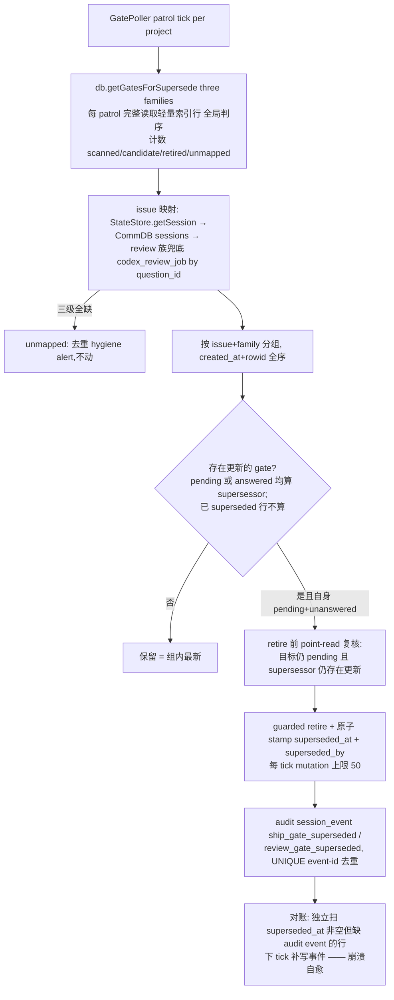

# FLY-1314 gate 卫生:auto-supersede + 单活跃 gate 不变式 — 实施计划
Issue: FLY-1314 (https://linear.app/geoforge3d/issue/FLY-1314/infra-gate-卫生head-变更后旧-gate-不自动-supersede-同-issue-多-gate-并存-founder)
日期: 2026-07-16
基于: research.md(Codex design review R1 反馈已并入,见 §8)

## 0. 目标与不变式

**I1(单活跃 gate,post-patrol 收敛不变式;R3-3 精确化)**:每个 patrol 收敛后,一个 issue 的**可归属** gate 中至多 1 个 open `approve_to_ship` + 1 个 open `review_design` + 1 个 open `review_code`。收敛延迟:正常 1 个 patrol tick;worst case = `ceil(candidates/mutation上限)` ticks(mutation 上限默认 50/tick)。patrol 间隙的短暂并存是明示代价(见下),不是不变式违例。
**前置产品规则(显式声明)**:一个 Linear issue 同一时刻只有一个活跃 workflow/PR 管线(现行「一 issue 一 worker」+ 三段式单带)。多 PR 并行同 issue 的键控泛化(subject/run 级)归 FLY-1229。
**I2(founder 可绑定,按 Codex R1-6 收窄)**:review gate 永不进入 founder 回复绑定候选集;**仅当剩余 founder-answerable 候选恰为 1 时**自动绑定;≥2 仍一律拒猜走 ambiguous handoff。issue-thread 全局唯一候选的强保证属 FLY-1229(checkpoint authority/precedence)。
**I3(terminal 路由畅通)**:superseded gate 掉出所有 pending 谓词,不阻塞 `complete --route blocked` 等 terminal 路由(complete.ts 守卫零改动)。
**I4(安全承重点,Tadashi 钦定;Codex R1-1 证实现状不成立,本单补齐;R2-2 精确化)**:**retire/stamp 实际成功的 gate 永远不能变成 ship 授权**——包括「retire 之后迟到写入的受信 response」。retire 与受信写的竞态是**二分可串行化结果**:retire 先赢 ⇒ stamp + 拒写 + verify 拒绝;受信写先赢 ⇒ response 成立、retire 因 answered no-op、`superseded_at` 保持 NULL——那是**真实批准**,受 I5 保护,verify 照常放行。「newer gate 出现即令已抢先回答的旧 gate 失效」是 issue-level authority 语义,与 I5 冲突,显式不做(归 FLY-1229)。由两层结构保证(§3.5),配对抗测试。
**I5(历史不可改写)**:已 answered 的 gate 永不被 supersede 改写(guarded retire 原语 WHERE 双保险)。
**I6(owner 可观测终态,Codex R1-2)**:被 supersede 的 gate owner 不产生 `park:gate_unreachable` 误报、不收到「重建 gate」的错误建议;其搁浅态被显式分类为 superseded(**识别而不唤醒**——不 wake 保持 Tadashi 决策 a,防双 actor)。

**明示代价**:Bridge sweeper 触发 ⇒ 新旧 gate 短暂并存——正常 1 个 patrol tick 内收敛,worst case `ceil(candidates/mutation上限)` ticks(与 I1 同一口径,R4-2);founder 消息撞窗 → 歧义一次(现状行为),收敛后不复发。

## 1. 交付切片与顺序

| 序 | PR | 内容 | 改动面(修正后) |
|---|---|---|---|
| 1 | PR-1 | 供给侧:CommDB `superseded_at`+`superseded_by` disposition + issue 级 newest-wins supersede sweeper + I4 双层加固 + founder 候选集排除 review gate + WAKE 文案去断言 + owner 观测终态 + 1309 回归 | `flywheel-comm/src/db.ts`(两列 ADD COLUMN 迁移 + 读 helper + retire 变体 + insertResponse 根部分流 + founder-source 原子写补 superseded 校验);`commands/verify-approval.ts`;`commands/respond.ts`(拒写结果处理);新 `bridge/issue-gate-supersede.ts`;`bridge/gate-poller.ts`;`bridge/founder-reply-deliverer.ts`;`bridge/approval-signal/write-gate-response.ts`(拒写结果贯穿);`bridge/park-watch.ts`;`bridge/detection-escalation-sinks.ts`(新分类标题);`StateStore.ts`(`getCodexReviewJobByQuestionId` + question_id 索引);`HeartbeatService.ts`(timeout 识别 + no-alert stamp) |
| 2 | PR-2 | 素材 #4:TURN belt 的 external-merge 终局回收(并入 external-merge-reconcile 周期 patrol + CAS) | `bridge/external-merge-reconcile.ts`;`phase-orchestrator.ts`(spare 条款注释指路);`flywheel-comm/src/db.ts`(`deleteTurnIfCurrent` CAS helper) |
| 3 | PR-3 | 素材 #3:RE-TEST 重驱的 exact-range head-delta 闸 | `phase-orchestrator.ts`(重驱收口 + 不可变 verdict-head 映射写入 + deps 接口);`DirectEventSink.ts` + `event-route.ts`(completion 上下文贯穿 onPhaseComplete/handoff);`StateStore.ts` + `bridge/plugin.ts`(qaVerdicts closure 接线扩展,R4-3);新 exact-range delta 判定(git ancestry/compare) |
| 4 | PR-4 | 素材 #8:ship-ready 的 CI 入口守卫 | `flywheel-comm/src/ship-ci-guard.ts`;`commands/gate.ts`(开 approve gate 前即时检查);`commands/verify-approval.ts`(最终授权前重新检查,不复用旧结果) |

**顺序约束(Codex R1-9,放弃「相互独立」措辞)**:PR-1 先行且独立;PR-2/PR-3 均动 `phase-orchestrator.ts` 同一 lifecycle 区域,且与在途 FLY-1307 PR-7.5 冲突面重叠——**等 1307 PR-7.5 落地后 rebase 再动工**,PR-2 → PR-3 串行,每片 merge 前重跑本片对抗测试。

kill-switch(全默认 ON;**per-switch 精确语义,R5-1**——不作笼统「=0 逐字节回滚」承诺):
- `FLYWHEEL_ISSUE_GATE_SUPERSEDE=0` = **只停新 mutation**(不再 sweep/retire/stamp;candidate 事件也停)。**已 stamp 的 `superseded_at` disposition 永久有效**:verify-approval 的 `gate_superseded` 拒绝与 response writer 的 open-only 校验**不受此开关控制**——否则关开关即重新授权已 retire 的 binding,I4 被回滚击穿。真要「全量回滚」= 显式承认 I4 失效 + stamped 行迁移/隔离方案,本单不提供、也绝不静默忽略 stamp。既有 `FLYWHEEL_SHIP_GATE_RETIRE=0` 同理:停新 approve 族 retire,不使耐久 stamp 失效。
- `=observe`:只发 candidate 事件,零 gate/CommDB disposition mutation(§7 rollout 用)。
- `FLYWHEEL_FOUNDER_REVIEW_GATE_EXCLUDE=0` / `FLYWHEEL_TURN_BELT_MERGED_RECLAIM=0` / `FLYWHEEL_RETEST_HEAD_DELTA_GUARD=0`:各自机制无新副作用,行为回到该机制引入前(这三者无耐久 disposition,可作真字节回退)。

## 2. 范围声明(Tadashi 四点边界,逐条)

| 素材 | 声明 | 归属/理由 |
|---|---|---|
| #6 review RECORD 旧 head APPROVED 冒充新 PR 凭证 | **OUT** | record lookup 的 (issue, PR, exact head) 严格键控 = FLY-1229「Authority 底座」正业,与 gate 生命周期正交;过渡防线 = runner fail-closed 纪律(1307 现场已验证)。**行动项:FLY-1229 body 补引用素材 #6 的验收(ship 阶段 Lead 落)** |
| #3 spurious RE-TEST | **IN = PR-3** | 修在重驱收口(choke point),上游一切触发源(重复终态、qa-result 重发、marker replay)同闸拦截 → 「qa-result 收据永不作为触发器」结构性成立 |
| #4 external merge 后 TURN 不释放 | **IN = PR-2** | FLY-921 spare 条款的「PR 已 MERGED」终局出口,寄宿在有周期 cadence 的 external-merge-reconcile(Codex R1-3) |
| #5 闲聊被误标「回复你的 ship gate」 | **部分 IN(PR-1)** | 结构面:I1+I2 收窄误挂面;文案面:WAKE 文本去断言。「gate 只接受落进 gate 的应答」授权收口 = FLY-1229 ①(R8/R9) |
| #7 手动拉起 QA 且 `chat_thread_role=main`,导致 orchestrator acceptance / FLY-859 重放不认 | **OUT(declaration-only,零机制变化)** | 拆两半:①dispatch 面 stamp `chat_thread_role` / fail-loud 拒裸 phase-role → FLY-1293;②③触发/过滤键复合化 evidence-based → FLY-1229(同 #6)。本单交界:PR-2 belt 回收不依赖 role 标签;PR-3 前驱按 execId+verdictEventId 链且歧义 fail-open,所以错标 QA 最多多一次 retest。 |
| #8 `mergeable=MERGEABLE` 但 CI checks 失败仍被判 ship-ready | **IN(PR-4)** | single-active-gate 的入口轴:开 `approve_to_ship` 前与 `verify-approval` 最终授权前分别即时证明 `mergeStateStatus` 非 `UNSTABLE/DIRTY` 且 required checks 全 pass;任一查询失败/缺失/非 pass → fail-closed `ci_not_green`(`CI not green`)。#8 管 gate 该不该开,#5/#6 管 gate 绑到谁。 |
| FLY-1229 吸收 or sibling | **sibling** | 1314 = 即时止血(sweeper 级、两列 nullable ADD COLUMN、零 CLI 破坏);1229 = 授权平台(run barrier / ship_subject / 单一 authority / 卡状态机),落地后本不变式被其泛化、sweeper 降级 defense-in-depth。镜像 FLY-1251「止血 / 平台 defer」先例 |

关联:FLY-1211(raw-sha churn)——head 漂移恢复 lap 变「开新 gate → 旧 gate 自动 supersede」一步收敛,1307 形态根治。

## 3. PR-1 设计

### 3.1 CommDB disposition 列(唯一 schema 改动)

`messages` 加 nullable 列 `superseded_at DATETIME` + `superseded_by TEXT`(既有 ALTER-if-missing 迁移模式,同 `checkpoint` 列先例;R2-5:两列**同一 UPDATE 原子写入**,崩溃后 reconcile 能恢复当时真实获胜的 qid,而不是用「当前最新」改写历史因果)。**语义:`superseded_at` 非 NULL = 该 gate 被 supersede 收掉,永不可成为授权**。与「正常 answered/resolved」严格区分(后者恒 NULL)——这是 I4/I6 的可判定根基(R1-1:不能拿 `relay_state='terminal_disposed'` 判,正常已答 gate 也会进该态)。park-watch 文案的 `supersededBy qid` 从该列读,来源稳定。

retire 写入变体:`retireShipGate` / `retireQuestionGuarded` 增加可选 `{ supersededBy: string }`——供本单 supersede 路径原子 stamp 两列 + 保持既有全部 WHERE 双保险;不带该参数的既有调用方(zombie-hygiene、FLY-1041 路径等)字节不变。FLY-1041 event-route/sweeper 的同 session retire 也顺手带上 stamp(同一语义,审计更完整;三写入方 event-id 去重不变)。

### 3.2 supersede sweeper(bridge/issue-gate-supersede.ts)

要点(含 Codex R1-7/R1-8、R2-1/R2-5 修正):
- **读全量、写有界(R2-1,选项 a)**:每 patrol **完整读取**三 family 的窄行(id/from_agent/checkpoint/created_at/rowid/answered/pending,index-assisted:`idx_messages_checkpoint` 只索引 checkpoint、非 covering(R4-4/R5-2),配 `superseded_at IS NULL` 过滤;gate 行量级 = 每 project 数十,全读廉价),issue 映射后**全局**判序——不存在「同 issue 两 gate 被 cursor 拆进不同 batch 永不相遇」。只有 **mutation** 有界(默认 50 retire/tick,env 可调);候选超上限时按最老优先退火,I1 收敛延迟 = `ceil(candidates/50)` ticks(正常 ≤1)。**每次 retire 前 point-read 复核**目标仍 pending、supersessor 仍存在且更新。
- **审计耐久性**:不搬 zombie 三段式 intent 账本——`superseded_at/superseded_by` 两列即耐久 disposition;audit event id 由 qid 确定性派生(`ship-gate-superseded-<qid>` / `review-gate-superseded-<qid>`),**retire 后崩溃 → 下 tick 对账补写**;对账用**独立查询**(`superseded_at IS NOT NULL` 且缺事件),不与候选查询(`IS NULL`)共用过滤(R2-1);补写事件的 supersededBy 取自持久列 = 原始因果,不用「当前最新」推断(R2-5)。
- **observe 模式事件隔离(R2-5)**:`=observe` 只发 `gate_supersede_candidate` 事件(id 前缀 `gate-supersede-candidate-<qid>`)或纯 log,**绝不预占** enforce 的 outcome event id——否则切 enforce 后 UNIQUE 去重会让真 mutation 审计永远缺席。
- **扫描成本**:不假设 TTL 限窗(protection 模式下 expired-unanswered 行可长存,db.ts:524-595);全读仅取 index-assisted 的窄行;计数进 log。
- **issue 映射链**:StateStore session → CommDB session → (review 族)durable `codex_review_job` 表 by question_id。**注意实表事实(R2-6d)**:表名单数、`issue_id` nullable、现无 question-id accessor——新增确定性 `getCodexReviewJobByQuestionId` + question_id 索引;null issue / 多匹配 → fail-open 不动 + 去重 alert。三级全缺 → **不动 + 去重 hygiene alert**(I1 显式收窄为「可归属 gate」;不再错误声称归 zombie 管——zombie 对 review 族无条件豁免)。
- **新旧判定** = (created_at, rowid) 同 DB 全序;rowid 仅作同秒 tie-breaker 使用、不当持久业务序号(Codex R1 措辞修正);同秒对抗测试保留。
- 与既有机制分工:FLY-1041 同 session fast-path 保留先跑;zombie-hygiene 管 session 死;mergedGateGuard 管 merged;本 sweeper 管 issue 内新旧。全部幂等 + UNIQUE 去重,交错安全。

### 3.3 founder 候选集排除 + WAKE 文案(不变)

`founderReplyDeliverPass` 在 `kind==='report'` 排除后加 `isReviewGateCheckpoint` 排除(kill-switch 独立);relayToLead / pending CLI / liveness 不动。`SHIP_WAKE_TEXT` 去断言:「Annie 在 issue thread 发了一条消息(未绑定到任何 gate,可能与你的 gate 无关):…这条不是授权——ship 前必须跑 verify-approval。」

### 3.4 superseded owner 的观测终态(I6,Codex R1-2;识别而不唤醒)

不 wake(保持 Tadashi 决策 a)。改为让全部消费面**识别 superseded**:
- `park-watch.ts`:`terminal_disposed + no response` 的分类分裂——`superseded_at` 非 NULL → 新分类 `park:gate_superseded`,Lead 建议文案 =「该 lap 已被同 issue 更新的 gate 取代(supersededBy = `superseded_by` 列,来源稳定),旧 runner 待 issue 终态清理收尸;**不要**重建/重绑旧 gate」;NULL → 维持既有 `park:gate_unreachable`。**wiring 补齐(R2-6c)**:新分类加入 `detection-escalation-sinks.ts` 可读标题映射 + park-watch reconcile 的 `requiresCommEvidence` 集合(park-watch.ts:348-357)——否则 CommDB 暂不可读时该 episode 会被错误 ACK resolved。
- `HeartbeatService` awaiting_review timeout 路径:bound gate 已 superseded → 跳过升级告警,写一次性 info event(`awaiting_review_superseded_noalert`)**并 stamp `gate_timeout_notified_at`(或等价 no-alert stamp)**——否则 `getAwaitingReviewTimedOut`(StateStore.ts:4106-4131)每 tick 重选该 session 形成永久重读热循环(R2-6b)。
- gate-marker 文件不由 Bridge 改写(runner 侧 wake mirror,非 authority);Codex adapter 的 awaiting_gate 分类不受影响(owner 保持 parked 直到 issue 终态清理——现状生命周期,新增的是**诚实观测**而非新 actor)。
- R1-2 提的「定向 terminalize / cancellation wake」记为 follow-up 选项,若真机观察发现搁浅时长不可接受再单开(不进本单,避免第二可写 actor)。

### 3.5 I4 双层加固(Codex R1-1,承重)

1. **verify-approval 显式拒绝 superseded binding**:`verify-approval.ts` 对 bound question 增加 `superseded_at IS NULL` 校验——非 NULL → 拒绝,理由 `gate_superseded`(即使 response 存在、head 匹配、review 证据齐全)。
2. **approve_to_ship 的 response 写入在 `CommDB.insertResponse` 根部分流,且拒写结果显式贯穿全部调用方(R2-6a + R3-1)**:
   - writer 按**实际 question 的 checkpoint**(point-read,不信调用方)分流——`approve_to_ship` 一律走 open-only 原子 SQL(expected owner/checkpoint + `resolved_at IS NULL` + `superseded_at IS NULL` + answerable + unanswered),其余 checkpoint 字节不变;
   - **拒写契约(R3-1)**:`insertResponse` 现返回 `void`(db.ts:839-870),改为返回 discriminated result(`{written:true} | {written:false, reason}`),并贯穿 `GateResponseDb` 接口 → `write-gate-response.ts` shared fallback(:431-444,现无条件跑 post-write hook + 返回 `written:true`)→ `commands/respond.ts` emergency bypass(:103-142,现写成功审计 + 立即 wake)。**拒写时:不跑 post-write hook、不报 `written`、不写 bypass 成功审计、不 wake runner**——杜绝「无 response 却有成功副作用」的分裂态;
   - **founder-source 受信原子写同步补齐(R3-1)**:trusted approval 走的是独立 `insertFounderApprovalResponseWithSource`(write-gate-response.ts:400-423;guarded SQL 在 db.ts:1007-1063),其 WHERE 同样加 `superseded_at IS NULL`;
   - 三条生产写入形态(trusted source writer / shared fallback / emergency bypass)各自加「retire 先赢」回归测试,断言**既无 response 也无任何 post-write 副作用**。

**对抗测试(硬项;R2-2 修正为二分可串行化结果)**:
- retire 先赢 → stamp 成功 → 迟到受信 response 拒写 → verify 拒绝(`gate_superseded`);
- 受信写先赢 → response 成立 → retire 因 answered no-op、`superseded_at` 保持 NULL → verify **照常放行**(真实批准,I5);
- 两序并发交错各自收敛到上述二分之一,**不存在第三种终态**(尤其不存在「answered 且 superseded」);
- 绕过 writer 强行注入 response 到已 stamp 的 gate → verify 仍拒(层 1 兜层 2);
- 正常 answered gate(superseded_at NULL)→ verify-approval 行为字节不变(reverse-compat)。

### 3.6 PR-1 测试清单

1. **FLY-1309 回归重演(硬项)**:2 跨 execution approve + 1 被更新 answered round 取代的 stale review → sweeper 后唯一 open approve;founder 候选集 = 1(单字母可绑);`getPendingGatesByRunner(implement)` 空(I3)。
2. §3.5 全部对抗测试(I4)。
3. answered gate 不可改写(I5);同秒 rowid 判序;unmapped 三级缺失 → 不动 + 去重 alert;审计崩溃对账:stamp 后缺 event → 下 tick 补,且**补写的 supersededBy = 持久列原始值**——构造「stamp(by q2)→崩溃→q3 出现→对账」场景证明因果不被 q3 改写(R2-5);retire 前 point-read 复核生效(候选在读取后被答掉 → 不 retire);mutation 上限退火:候选 > 50 → 分多 tick 收敛、最终一致(R2-1);Bridge restart 于扫描中途 → 无重复 retire、无漏(全读+幂等,R2-1)。
4. park-watch 分类分裂(superseded vs unreachable)+ timeout 跳过升级(I6)。
5. deliverer:剩余候选=1 绑定;review gate 永不进 matching;两个 founder-answerable 候选仍 ambiguous(拒猜保留)。
6. coordinator 迟到 respond 对 retired 旧轮 → no-op(insertResponseIfGateOpen 契约,coordinator.ts:1278-1349)。
7. reverse-compat / rollback sentinel(R5-1 per-switch 精确语义):`FLYWHEEL_ISSUE_GATE_SUPERSEDE=0` → 零新 sweep/retire/stamp/candidate;`FLYWHEEL_SHIP_GATE_RETIRE=0` → approve 族不再新 retire、review 族照常;**enforce→已 stamp→flip 到 0 的对抗测试(硬项):迟到受信 response 仍被拒写、verify-approval 对已 stamp binding 仍返回 `gate_superseded`**——耐久 disposition 不随开关失效;排除/回收/闸三开关 `=0` → 各自机制引入前行为;`=observe` → 只发 `gate_supersede_candidate`,**零 gate/CommDB disposition mutation**(R5-2 措辞),且 observe→enforce 切换后 enforce 的 outcome event 正常落(id 不被 observe 预占,R2-5)。
8. respond.ts emergency bypass 回归:bypass 路径对 approve_to_ship 同样被根部 open-only 分流拦截(R2-6a);`getCodexReviewJobByQuestionId` 确定性 + null-issue/多匹配 fail-open(R2-6d)。

## 4. PR-2 设计(素材 #4;Codex R1-3/R1-4 重构)

**寄宿点改为 `external-merge-reconcile.ts`**(有周期 patrol cadence + 既有 gh 预算/轮转所有权;reconcileTurnBelt 只在 boot + terminal event 触发,原方案 30min 后无人再看——R1-3)。

**候选来源改造(R2-3,关键)**:到龄的 `three_stage_turn` 行本身成为 **first-class candidate source**——现有 reconciler 只从 stale parked / 最近 completed session 组候选,而「thread 已 archive / 已有 finalization claim / 无 pr_number / 超 7 天窗」的 session 会在 gh 调用前被过滤,`all.length===0` 直接跳过 project(external-merge-reconcile.ts:427-466);孤儿带恰恰常伴随这些形态(1307 现场)。belt 候选与 parked/completed 候选按 `(issueId, prNumber)` 去重后**进同一个 budget/rotation**;一次 MERGED probe 的结果同时喂现有 finalization 路径与 belt CAS。

belt 候选的回收条件(全部满足):
1. `three_stage_turn` 行龄 > `FLYWHEEL_TURN_BELT_MERGED_RECLAIM_AGE_MS`(默认 30min);
2. holder session 终态(completed/failed)且 **ghost-probe 纪律**判死:仅当 row 有 persisted tmux target 且 `probeGhostTmux` 明确 `dead_pin/absent` 才继续;`alive/indeterminate/无 target` 一律不动(R1-4,沿用 phase-orchestrator.ts:1812-1838 语义);
3. PR 号按**可信推导序**取:holder session 证据 → 该 issue 的 implement/QA/landing 证据;缺失或互相冲突 → 不动 + 计数(R2-3);
4. 该 PR 被本 pass 证明 **MERGED**——**与 finalization path-1/2 校验是否通过无关**(belt 回收不是授权动作,正是「校验不过 → finalize 不跑 → 带子僵死」的补口)。

→ **CAS 回收**:新 CommDB helper `deleteTurnIfCurrent(issueId, expectedHolder, expectedEpoch): boolean`——probe 后重读 row,holder/epoch 未前移才删(R1-4:gh probe 最长 10s,期间 TURN 可能已 re-grant;无条件 `deleteTurn` 会误删新带)。成功 → session_event `turn_belt_reclaimed_external_merge`(payload 记录实际删除的 issueId/holder/epoch/prNumber/mergeOid)+ 普通 log,**不走 failClosed 告警**。CAS 失败 → 无事发生。

**探测缓存事实更正(R2-3)**:现模块只有 rotation/budget,**没有**负结果缓存——新增「非 MERGED 结果的 in-memory TTL 负缓存」作为**新状态**(TTL 默认 10min)并单独测试,不称「沿用既有」。**kill-switch 层级**:`FLYWHEEL_EXTERNAL_MERGE_RECONCILE=0` 是父级(整个 pass 含 belt 步骤全关);`FLYWHEEL_TURN_BELT_MERGED_RECLAIM=0` 只关 belt 步骤。

**测试**:merged+holder 死+CAS 命中 → 回收+event;**belt-only 候选**(session 全部被 claim/archive/窗口过滤排除)仍可回收(R2-3 硬场景);open/unknown/closed-unmerged → 不动;`indeterminate`/live-ghost/无 persisted target → 不动;PR 号缺失/冲突 → 不动+计数;probe 期间 epoch 前移 → CAS 拒删;首 pass 未到龄 → 后续 patrol 到龄自动回收;负缓存 TTL 生效;两级 flag 各自 =0 → 对应字节现状。真机:重演 1307 形态 → belt 自动回收,同 issue 新切片不再被僵尸带挡。

## 5. PR-3 设计(素材 #3;Codex R1-5 重构)

**位置**:phase-orchestrator implement→QA 重驱收口(wake `kind:'retest'` :1740-1800 + spawn 分支)。
**前驱 verdict head 的锁定(R2-4 + R3-2 修正)**:现有 `three_stage_verdict` 是 **mutable** 的 session_params(新 round 覆盖 event_id、清 headSha/fixExecId,phase-orchestrator.ts:1141-1172/1229-1243,且无 round 字段),不能当多轮 predecessor ledger;且 keep-alive 复用同一 implement execution,`fixExecId` 无法区分「round N+1 之后重放的 round N completion」。设计如下:

- **写入时序(crash-safe;R3-2:各字段在现流程不同时点才可知)**:不可变映射事件 `three-stage-verdict-head-<verdictEventId>`(session_event,UNIQUE 幂等)在 **round + verdictHead 都已知的时点**写入——即现流程取得 round(:1452)与捕获 head(:1476-1486)之后、发起 fix wake/spawn **之前**;payload `{issueId, qaExecId, verdictEventId, round, verdictHead}`(**不含** fixExecId——它此刻未知且对前驱选择无用,见下)。崩溃窗口:事件已写而 wake 未发 → 重入路径按 UNIQUE 幂等重写、正常继续;事件未写而 verdict intent 已 patch → accessor 查无映射 → fail-open retest(诚实降级)。
- **前驱选择(R3-2 + R4-1 修正:落库序 ≠ 逻辑序,不做历史轮身份推断)**:两条 ingestion 路径的事件契约决定了「事件序」不可当逻辑 completion 身份——`DirectEventSink.emitCompleted` 每次生成随机新 event id(DirectEventSink.ts:467-495,`EventEnvelope` 无耐久 completion id),迟到的语义重放会落在 round N+1 **之后**;HTTP 路径同 id 会在 `onPhaseComplete` 前被去重拒收(event-route.ts:651-665)。因此采用**最小安全设计**:前驱查找**仅当** completion 拥有**无歧义的当前 workflow/QA 前驱**时使用——fix-round 链查询按**已验证的当前 QA/workflow 前驱**(qaExecId + verdictEventId 链)限定 scope,**不以 issue_id 独查**(防同 issue 先前 workflow 的历史轮污染);Direct/新 id 的多轮重放、跨 workflow/QA 不匹配、任何歧义 → **一律 fail-open retest**。不承诺「重放的 round N completion 精确恢复 round N 前驱」——FLY-1252 的实际事故形态(同 head qa-result 重发、期间无新轮)有无歧义前驱,照常被抑制;真歧义宁可多跑一次 QA。若未来要求精确 round-N 恢复,需要发工单时下发 stable fix-round/completion token 并贯穿 runner completion payload 与两 emitter——显式记为 out-of-scope 扩展。`DirectEventSink.ts`/`event-route.ts` 的贯穿改动仅传递「本次 completion 的即时上下文」,不重建历史序。startup/reconcile 等**无 completion 上下文**的调用路径 → 显式 fail-open retest(文档化)。
- 找不到映射 / 链断 / 前驱歧义 → 一律 fail-open 照常 retest。
**判定序**:
1. 取前驱 verdictHead;取不到 → 照常重驱(fail-open,宁多跑不漏跑);
2. `currentHead == verdictHead` → 抑制:不 grantTurn、不 wake/spawn;event `qa_retest_suppressed`(reason `no_head_delta`);
3. head 前移 → **exact-range 判定 `verdictHead..currentHead`**(新helper,git ancestry 校验 + 该区间产品文件 delta;**不复用** `ship-relevant-diff.ts`——它只会分类 PR base→head 整段,旧区间含代码时永远 ship-relevant,无法表达「verdict 之后 docs-only」,R1-5);non-ancestor/force-push/任何 unknown → 视为有 delta 照常重驱;区间产品 delta 空 → 抑制(reason `docs_only_delta`);
4. 照常重驱时,retest wake 文案改为事实陈述 head 区间(去掉「implement 推了修复」无条件断言)。
**测试**:同 head 重复终态/qa-result 重发(无新轮,前驱无歧义)→ 零重驱(FLY-1252 回归,主场景);旧区间含 code、新区间 docs-only → 抑制(证明 exact-range 而非 PR-base 判定);mixed delta → 重驱;non-ancestor/force-push → 重驱;**同 fixExecId 多轮 replay 经两条 ingestion sink(DirectEventSink + event-route)各自验证:round N+1 之后重放 round N completion = 前驱歧义 → fail-open retest(不错误抑制、不取错 head)**(R4-1 修正后的硬场景);跨 workflow 同 issue 历史轮不污染当前前驱(scope 按 qaExecId/verdictEventId 链);映射写入前后崩溃窗口(事件已写 wake 未发 / intent 已 patch 事件未写)→ 各自收敛正确;无 completion 上下文的 startup/reconcile 路径 → fail-open;accessor 缺失/链断 → fail-open;flag=0 → 字节现状。验收剧本含 Annie 给的 QA 行为基线(turn 确权 → head-delta 取证 → re-affirm 不标 fix-verified)。

## 5.1 PR-4 设计(素材 #8:CI checks-green 入口守卫)

同一份同步 `probeShipCiGreen` 原语由两个承重点调用,但**每次都重新查询 GitHub**,不缓存、不复用 gate-open 时的旧绿灯:

1. `gate(checkpoint='approve_to_ship')` 在写 CommDB question **之前**检查当前 worktree 所属 PR;失败直接抛 `CI not green`,且该错误位于 gate 的 fail-open timeout catch 外,所以任何 timeout 配置都不能降级为开 gate。
2. `verifyApproval` 在 binding、founder attribution、status/head、cross-family code review 全部通过后,用 StateStore 持久的 `pr_number + worktree_path + pr_head_sha` 再查一次;失败返回 `approved:false, reason:'ci_not_green'`,永不成为 ship authority。

检查由两条独立 GitHub CLI 证据组成:`gh pr view --json headRefOid,mergeStateStatus` 要求 full head 与预期一致、`mergeStateStatus` 非 `UNSTABLE/DIRTY/UNKNOWN`;`gh pr checks --required --json bucket,name,state` 要求至少一个 required check 且每项 `bucket='pass'`。GitHub 不可用、JSON 异常、head 漂移、required checks 为空/失败/pending/cancel/skipping 均 fail-closed。测试固定 PR#621 的事故形态(`MERGEABLE` 但 Build & Test fail)在两个入口都被拒,同时 non-ship checkpoint 不受影响。

## 6. 风险与缓解(修订)

| # | 风险 | 缓解 |
|---|---|---|
| R1 | newest-wins 误杀正当旧 gate | founder 授权被 I4 双层硬闸;supersede 只影响「谁有资格被答」;审计 + disposition 列全留痕可回溯 |
| R2 | 并存窗口歧义一次 | 明示接受;正常下 tick 收敛,worst case `ceil(candidates/mutation上限)` ticks(R3-3 精确措辞) |
| R3 | superseded owner 搁浅 | I6:park-watch/timeout 诚实分类,无误报无错误建议;owner 归 issue 终态清理(现状生命周期);定向 terminalize 留 follow-up 选项 |
| R4 | 与 FLY-1307 PR-7.5 冲突 | PR-2/PR-3 顺序化:等 1307 落地后 rebase;PR-3 冲突面含 DirectEventSink/event-route(R3-2 贯穿改动);每片重跑对抗套件 |
| R5 | sweeper 扫描放大 | index-assisted 窄行读(`idx_messages_checkpoint` 只索引 checkpoint、非 covering,R4-4;数十行量级不构成瓶颈,实测需要时再加 covering index)+ **写有界**(mutation 上限/tick)+ 计数观测;不依赖 TTL 限窗假设 |
| R6 | PR-2 gh 探测配额/竞态 | 共享 external-merge-reconcile 预算/轮转/负缓存;ghost-probe 纪律 + CAS 删除 |
| R7 | 迟到受信 response 与 retire 竞态 | I4 层 2 open-only 原子写 + 层 1 verify 拒绝;两序交错对抗测试 |

## 7. 部署与验收

- **生效**:Bridge 侧为主 + flywheel-comm(db 迁移/verify-approval)→ merge 后一次 Bridge 重启(并入批量重启窗口);ADD COLUMN 迁移向后兼容,CLI gate/complete 零改动。
- **rollout(Codex R1-8)**:候选集排除(3.3)直接 ON;supersede mutation 首启以 `FLYWHEEL_ISSUE_GATE_SUPERSEDE=observe` 跑 ≥1 个 patrol 周期(只出 audit/计数,零 retire),Lead 核对 scanned/candidate 计数与候选清单无误后移除 env → 默认 enforce。runbook 写进 PR 描述。
- **验收(硬项)**:① 单测/集成 + 全仓 lint/CI 绿;② FLY-1309 三 gate 回归(§3.6-1);③ I4 对抗全过(§3.5);④ 独立 QA 真机(FLY-1211 硬门):重演 1309 → observe 计数正确 → enforce 收敛 → founder 单字母绑定唯一 gate;重演 1307 belt → 自动回收;重演 1252 same-head → 零重驱;⑤ reverse-compat / rollback:按 §3.6-7 的 per-switch 精确语义验证(含 enforce→stamp→flip-to-0 的 I4 存活对抗)。
- **out-of-scope 行动项**:FLY-1229 body 补素材 #6 引用(Lead);superseded-owner 定向 terminalize follow-up(观察后定)。

## 8. Design review 记录

- Codex R1(xhigh,2026-07-16):CHANGES REQUESTED,5 HIGH + 4 MEDIUM,全部采纳——I4 现状缺口(→§3.5 双层)、owner 搁浅误报(→§3.4 识别不唤醒)、PR-2 无周期触发+竞态(→§4 寄宿 external-merge-reconcile + ghost-probe + CAS)、PR-3 classifier 区间错配(→§5 exact-range + durable 前驱)、I2 措辞收窄、orphan review gate 漏口(→映射链 + 收窄不变式)、审计耐久/扫描有界(→disposition 对账 + observe rollout)、切片顺序化。
- Codex R2(xhigh,2026-07-16):CHANGES REQUESTED,4 HIGH + 2 MEDIUM,全部采纳——读全量/写有界替代 batch 分组(→§3.2,消灭跨 batch 永不相遇 + point-read 复核 + 独立对账 cursor)、I4 竞态改二分可串行化结果不与 I5 冲突(→§0 I4 + §3.5 测试)、belt 候选升 first-class source(→§4,belt-only 场景 + PR 号推导序 + 负缓存声明为新状态 + flag 层级)、`three_stage_verdict` mutable 不能当 ledger(→§5 新不可变 `three-stage-verdict-head-<verdictEventId>` 事件)、`superseded_by` 列原子写 + observe 事件隔离(→§3.1/§3.2)、消费面 wiring 契约(→§3.4/§3.5:insertResponse 根部分流、gate_timeout_notified_at stamp、escalation-sinks + requiresCommEvidence、`codex_review_job` 实表事实 + 新 accessor/index)。
- Codex R3(xhigh,2026-07-16):CHANGES REQUESTED,2 HIGH + 2 MEDIUM,全部采纳——拒写结果契约贯穿三条生产写入形态 + founder-source 原子写补 superseded 校验(→§3.5-2)、PR-3 映射写入时序 crash-safe 化 + completion 上下文贯穿两 sink(→§5)、I1 改 post-patrol 收敛不变式 + worst-case 措辞统一(→§0/§6-R2)、清单/风险文本对齐(→§1/§2/§6-R4/R5)。R3 同时确认:newest-wins 在单活跃 workflow 前置下无合法共存反例;(created_at, rowid) 全序 sound;I6 与 Lead 裁定一致;PR-2 架构可行。
- Codex R4(xhigh,2026-07-16):CHANGES REQUESTED,1 HIGH + 2 MEDIUM + 1 LOW,全部采纳——落库序 ≠ 逻辑 completion 身份(DirectEventSink 随机新 id / HTTP 同 id 去重拒收)→ 前驱查找改最小安全设计:仅无歧义当前 workflow/QA 前驱时使用、scope 按 qaExecId/verdictEventId 链不按裸 issue_id、一切歧义 fail-open retest、精确 round-N 恢复(需 stable token 贯穿 emitter)显式 out-of-scope(→§5);「≤1 tick」残留措辞统一(→§0);PR-3 清单补 StateStore/plugin qaVerdicts 接线(→§1);index 措辞改 index-assisted 非 covering(→§6-R5)。R4 同时确认:拒写契约、founder-source 补校验、映射写点、I1 口径、PR-2 全部 sound。
- Codex R5(xhigh,2026-07-16):CHANGES REQUESTED,1 HIGH + 1 LOW,全部采纳——kill-switch「=0 字节回滚」承诺与 I4 永久 disposition 矛盾 → `FLYWHEEL_ISSUE_GATE_SUPERSEDE=0` 定义为只停新 mutation、已 stamp disposition 不随开关失效、verify/writer 校验不受开关控制、加 enforce→stamp→flip-to-0 对抗测试、全量回滚显式声明不提供(→§1 kill-switch 段/§3.6-7/§7-⑤);两处残留措辞(index-assisted、observe 零 disposition mutation)修正(→§3.2/§3.6-7)。R5 同时确认:PR-3 最小安全设计可实现、两 sink 测试断言与真实传输契约一致、PR-1/PR-2 全面 sound。
- Codex R6(xhigh,2026-07-16):**APPROVED — ready to implement**。仅 1 条非阻断 LOW(§3.2 扫描成本句残留旧措辞)已就地修正。R6 确认:回滚安全边界正确、I4 两分结果端到端完整、newest-wins 无合法共存反例、PR-2/PR-3 与现行架构契约一致、切片顺序恰当。
