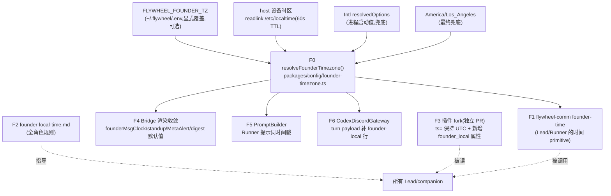

# FLY-1319 founder 本地时区 — 实施计划

Issue: FLY-1319 (https://linear.app/geoforge3d/issue/FLY-1319/infra-founder-本地时区-让所有-lead-知道-annie-的-local-time非-utc理想自动跟设备)
日期: 2026-07-16
基于: research.md

版本:ship 时取空号(仿 FLY-529 惯例)。范围:纯 infra(Bridge/Lead 配置 + 时间渲染),无 product PRD。

## 0. 目标一句话

把「Annie 的当前本地时区」变成系统的单一真配置(默认自动跟她的设备),让所有 agent 显示/推理时间都用它 —— 「劝她睡觉/推明天」类 UTC 误判结构性消失。

## 1. 架构总览

关键洞察(gate 已确认):Bridge/Lead/Runner 全跑在 Annie 的 Mac 上,**host 设备 = founder 设备** → 「自动跟设备」= 默认读 host 时区;env 显式覆盖是逃生口(她带手机 travel 但 Mac 留家 / 未来远程部署)。多机部署的设备上报通道 = FLY-1005 后 follow-up,不在本单。

## 2. 交付物(两个 repo)

### PR-A:本仓(flywheel)

#### A1. F0 — `packages/config/src/founder-timezone.ts`(新文件)
- **API 形态(Codex R1 #7 钉死)**:`createFounderTimezoneResolver(io)` 纯构造 + 模块级 default singleton 两层。可注入 IO 面:`{ env, readlinkSync, nowMs, intlTimezone, warn }` —— TTL 测试用 `nowMs`、Intl fallback/校验用 `intlTimezone` seam、invalid-env warn-once 用 `warn` seam;**cache 只缓存 host probe(readlink 结果)**,env 每次现读,避免注入 IO 与模块级 cache 互相污染。
- `resolveFounderTimezone(): string` — 解析顺序 env → readlink(60s TTL)→ Intl → `"America/Los_Angeles"`;每级候选都过 `Intl.DateTimeFormat(undefined, { timeZone: tz })` 有效性校验,非法降级下一级(env 非法额外 warn 一次)。
- `formatFounderLocal(date: Date, tz?: string): string` — 统一渲染 `2026-07-16 19:23 PDT`;`founderLocalIso(date, tz?)` 给 ISO-with-offset(形态 `2026-07-16T19:23:05-07:00`);`founderOffsetMinutes(date, tz?)` 符号约定 = 东正西负(LA `-420`,Kolkata `+330`)。**格式函数接受显式 Date + tz snapshot** —— 消费者一次请求内取一次 snapshot,禁止跨行为多次 resolve(防跨 TTL 撕裂)。所有 F4/F5/F6 消费此函数,禁止各自手搓格式。
- `index.ts` 导出。
- 登记 env:`feature-flags-drift.test.ts` 加 `FLYWHEEL_FOUNDER_TZ: "config value: founder local timezone override (FLY-1319)"`。

#### A2. F1 — `flywheel-comm founder-time`(新子命令)
- `packages/flywheel-comm/src/commands/founder-time.ts` + `index.ts` switch case + help 文本(完全仿现有命令模式)。
- 默认输出一行:`2026-07-16 19:23 PDT — America/Los_Angeles (UTC-07:00)`;`--json` 输出 `{iso, tz, abbrev, offsetMinutes}`(offsetMinutes 符号 = 东正西负)。
- CLI 每次新进程 → **设备时区**永远现读(auto 路径无缓存坑);注意 env override 来自调用方 shell 环境(pane env),不是每次重读 .env —— 见 §4 部署矩阵 (b)。

#### A3. F2 — `packages/teamlead/lead-rules-base/founder-local-time.md`(新规则,~25 行)
内容要点(短、硬):
1. Discord 消息 `ts=` 是 **UTC 机器戳**,不是 founder 的时间;带 `founder_local=` 属性时以它为准。
2. 推理 founder 的作息(几点了/该不该推明天/要不要劝休息)之前,**必须**先跑 `node .../flywheel-comm/dist/index.js founder-time`(给出完整命令);绝不凭 UTC 直觉。
3. 一切 founder-facing 的时间表述用 founder local + 明确时区标注。
4. 她 travel 时设备时区变 → founder-time 自动跟;若有人工覆盖需求,改 `~/.flywheel/.env` 的 `FLYWHEEL_FOUNDER_TZ` —— **并说明 override 生效需要 Bridge + Lead 重启**(env 启动时注入;设备时区自动跟随则无需重启)。
装载同步(companion + cos + dept **三个角色都装** —— Belle/Mufasa 最常聊作息):
- `lead-rules-bundle.sh` `compute_lead_rule_bundle()` 三分支;
- `claude-lead.sh` inline 装载块(companion :2176 区 / dept :2193 区 / cos :2346 区);
- parity test `lead-rules-bundle.test.ts` 同步断言;
- **Codex Mufasa 非-bundle 启动路径(Codex R2 #1)**:生产 launcher `run-codex-lead-mufasa-tui-fullaccess.sh` 走 `assemble_full_access_governance`(source lead-rules-bundle.sh,:100-102)→ bundle 改了自动跟;但 `run-codex-lead-mufasa-tui.sh:129` / `run-codex-lead-mufasa.sh:42`(headless rollback)/ `run-codex-lead-mufasa-writecapable.sh:70` 三个 launcher **手工拼** `FLYWHEEL_LEAD_SYSTEM_PROMPT_FILES`(identity + companion-safety-contract),绕过 bundle —— 三处的默认列表都要追加 `founder-local-time.md`(codex runtime 读显式列表 codex-lead-runtime.ts:625-629/:983-994,跳过不可读文件 = byte-compat 安全);
- **装载证明测试**:launcher dry-run / `readBaseInstructions` 断言 —— 生产 fullaccess 路径 + rollback TUI 路径的最终 baseInstructions 都含规则正文(不是只测文件名 parity);
- 规则文本同时写明 Mufasa 侧 `[sent ...]` 前缀语义(F6)。

#### A4. F4 — Bridge 渲染收敛
| 位置 | 改法 |
|---|---|
| `deferred-approval.ts:130` founderMsgClock | `timeZone: resolveFounderTimezone()`(输出格式不变) |
| `standup-service.ts:62-66` pacificDateString | 同上(函数名顺手改 founderDateString,调用点同步) |
| `MetaAlertNotifier.ts:161` | UTC ISO 前缀 → `formatFounderLocal()` 带 tz 标注 |
| `scripts/lead-alert.sh:363` | shell helper(校验规格见下) → `TZ=<tz> date '+%H:%M %Z'` |
| `plugin.ts:3523` completion digest tz 默认值 | 改为 **timezone provider**(见下),显式 `FLYWHEEL_DIGEST_TZ` 仍赢且固定 |
| `claude-lead.sh:1407-1448` pane env allowlist | **加 `-e "FLYWHEEL_FOUNDER_TZ=${FLYWHEEL_FOUNDER_TZ:-}"`**(Codex R1 #1:tmux new-window -e 不继承 launcher env,不加则人工覆盖永远进不了 Lead pane 和它拉起的 MCP fork) |

- **DigestService 时区动态化(Codex R1 #3)**:`plugin.ts:3522-3527` 现在启动时构造一次、`digest-service.ts:341+` 永久快照 `opts.tz` → travel 后到死不变。改法:`DigestServiceOptions.tz` 变 `tz: string | (() => string)`(provider),每次 render 请求入口解析**一次** snapshot,同一 snapshot 同时传 `defaultDay` 与 `aggregate`(防一次请求跨 TTL 时 day 与过滤时区不一致);显式 `FLYWHEEL_DIGEST_TZ` 传常量字符串 = 行为与现状全同。
- **明确回退(Codex R1 #2)**:`plugin.ts:9425`(token digest-expect)**不改**。`notify-digest-expect.ts:63` 有硬契约「tz MUST match CLI 的 TOKEN_USAGE_TIMEZONE 语义」,而 token-usage CLI/scanner 本单不碰(research §1.5)—— 单改 9425 会让 watchdog 和报表按不同 civil day 计算,产生误报/漏报。token 报表链整体迁移 = follow-up(§7)。
- **lead-alert.sh shell helper 校验规格(Codex R1 #6)**:macOS 上 `TZ=Not/AZone date` 静默输出 UTC 且 exit 0,不能只信退出码。规格:候选 IANA 名必须 ①无路径穿越(拒 `..`/绝对路径)②存在于 zoneinfo root(`/var/db/timezone/zoneinfo` 或 `/usr/share/zoneinfo`)才可用;env 候选非法 → stderr 告警 + 降级 readlink 候选(同样校验);`/etc/localtime` 非 symlink(copy 式)→ 不设 TZ 用 host `date`(= Intl 等价回退);最终显式 LA。hermetic shell 测试覆盖 invalid env / mac / linux / relative symlink / copy 式 localtime。

#### A5. F5 — `PromptBuilder.ts:768/:960/:981`
三处裸 `toLocaleString()` → `formatFounderLocal()`(带时区标注)。

#### A6. F6 — `CodexDiscordGateway.ts:179`
`payload: msg.content` → 前缀一行 founder-local 时间 + 原文。已核实 dedup(msg.id)、mention-gate、roundtable thread-name 派生都读 `msg.content` 原值,不受影响。

**时间语义钉死(Codex R1 #5,全系统统一)**:所有 `founder_local` 类标注 = **消息 instant,用「当前解析到的 founder 时区」渲染**(named semantics:message instant on her current wall clock)。不声称、也不可能还原「她发送当时所在的时区」(Discord 历史无此信息)。落点:
- F6 前缀取**消息发送 instant**,非处理时刻:`DiscordInboundMessage` 加可选 `timestampMs`(RestPoll 从 Discord raw `timestamp` 字段填充;缺失回退 snowflake id 推导 —— deferred-approval 已有 `snowflakeToMs` 同款逻辑;两者皆缺 → **省略前缀**,fail-safe 不打错时间)。这样 RestPoll 启动 drain 的 downtime backlog(RestPollDiscordInboundSource.ts:132-139)不会被标成「恢复时的现在」。
- 前缀格式 `[sent 2026-07-16 19:23 PDT — founder 当前时区渲染]`,措辞明示 sent-instant 语义。
- 测试:downtime replay(旧 instant + 新 now)标注 = 旧 instant;travel 后(注入 tz 翻转)旧消息按新时区渲染。

#### A7. 测试(research §8 + Codex R1 展开)
- resolver 全矩阵单测(env 优先/非法回退/mac+linux+relative readlink fixture/失败逐级降级/TTL 用注入 nowMs 推进、无 sleep/Intl 校验拒坏值/warn-once)。
- formatFounderLocal / founderLocalIso / founderOffsetMinutes:DST 切换**前后两个 instant**(3 月 / 11 月)、非整点 offset(Asia/Kolkata `+330`)、午夜 `00:xx`、offset 符号(LA `-420`)。
- founder-time CLI:注入固定 now + env 对照;输出格式 + --json。
- **两层 byte-compat(Codex R1 #7,不依赖 CI 主机真实时区)**:① fake host(readlink 注入 LA)+ unset env → resolver 返回 LA;② 消费者(founderMsgClock / standup 日期头)注入 LA → 输出与改前**逐字节一致**。
- **DigestService 动态时区(Codex R1 #3)**:同一进程内 fake readlink 从 LA 切 Tokyo,跨 TTL 后下一次 render 翻转;单次 render 内 day 与过滤时区取同一 snapshot;显式 FLYWHEEL_DIGEST_TZ 时永不翻转。
- **launch-plan dry-run(Codex R1 #1)**:companion / cos / dept 三角色的真实 launch-plan 输出断言 pane env 含 `FLYWHEEL_FOUNDER_TZ`(非只做 filename parity)。
- **lead-alert.sh hermetic shell 测试(Codex R1 #6)**:invalid env 告警降级 / mac / linux / relative symlink / copy 式 /etc/localtime → host date 回退 / `HH:MM %Z` 输出。
- F6:payload 前缀存在(sent-instant 语义)+ downtime replay 用旧 instant + timestampMs 与 snowflake 双缺时省略前缀 + mention-gate/dedup/thread-name 现有测试全绿。
- parity test 扩展 + feature-flags drift 登记。
- 全仓 lint + 受影响 package 测试套件。

### PR-B:插件 fork repo(claude-plugins-official)

#### B1. F3 保守方案(gate 裁定 ①:additive,ts= 不动)
- `external_plugins/discord/server.ts:884` meta 加 `founder_local`(= 消息 instant 按当前 founder 时区渲染,同 A6 语义);
- `:675` fetch_messages 历史前缀补 founder-local(UTC ISO 保留);history 文案措辞 = 「message instant rendered in the currently resolved founder timezone」,**不得**声称是历史 send-time zone(Codex R1 #5);
- `:458` 区 instructions 写明双语义:「ts 是 UTC 机器戳;founder_local 是该消息 instant 在 founder 当前时区下的墙钟 —— 推理她的时间一律用 founder_local」;
- **可测 seam(Codex R1 #4)**:server.ts 模块加载即读 token/可能 process.exit、`:893-899` 直连 Discord,直接 import 测不了。抽无副作用模块:fork 内新 `founder-timezone.ts`(resolver+formatter)+ `buildInboundMeta()` / `formatHistoryRow()` 纯函数,server.ts 只调用;fork package.json 加 `test` script(bun test);
- **fork resolver 与 F0 同序(Codex R2 #2)**:env → readlink(60s TTL,常驻进程必须)→ **Intl fallback(同样过 IANA 校验)** → LA —— 与 F0 完全同一顺序;否则 copy 式 /etc/localtime 或 readlink 不可用时 fork 会错回 LA 而 F1/F6 给出正确 host 时区,founder_local 跨面分叉;
- fork 侧测试(真断言,非静态 grep):invalid env 回退 / mac+linux+relative readlink / **readlink 失败但 Intl=Tokyo → 取 Tokyo** / TTL / live meta 含 founder_local / history 双时间语义 / **原 ts= UTC ISO 字符串逐字节不变**(mutate ts= 被 gate 明令禁止 —— 本 PR 不 mutate)。

## 3. 实施顺序(TDD,三段式 implement 阶段执行)

1. **M1** A1 resolver + A7 resolver/format 测试(RED→GREEN)
2. **M2** A2 founder-time CLI + 测试
3. **M3** A4 Bridge 渲染 + byte-compat sentinel + A5 PromptBuilder
4. **M4** A6 Codex payload + 回归测试
5. **M5** A3 规则文件 + 全部装载点:shared bundle 三分支 + claude-lead.sh inline 三区 + **三个 Mufasa 手工 launcher(tui / headless rollback / writecapable)默认列表** + parity test + **Mufasa loading-proof 测试**(fullaccess 与 rollback TUI 两路径 baseInstructions 含规则正文)
6. **M6** PR-B fork 改动 + fork 测试(独立 PR,同窗提交)
7. **M7** 全仓 lint + suites → PR-A/PR-B 创建 → Codex code review

每步后更新 progress.md(--set-chunk M<n>=done)。

## 4. 部署与生效矩阵(gate 裁定 ②:merge ≠ live,必须写明)

**两类运行时变化要分开说(Codex R1 #1)**:
- **(a) 设备时区变化(Annie travel,默认 auto 路径)**:动态消费者(F1 CLI、F3 fork resolver、F6、DigestService provider、lead-alert.sh)经 readlink TTL 在 ≤60s 内自动跟随,**无需任何重启** —— 这是本单的核心承诺,Bridge/Lead 重启只为部署新代码,不是 travel 后的日常动作。
- **(b) `~/.flywheel/.env` 新增/修改 `FLYWHEEL_FOUNDER_TZ` override**:env 在进程启动时注入(launcher wrapper source .env → claude-lead.sh pane allowlist 显式传入),改 .env **不会**刷新在跑的 Bridge / Lead / MCP —— 需要 Bridge + 受影响 Lead 重启才吃到;一次性人工 CLI 调用可在新 shell 里先 source .env。此事实写进 F2 规则文本。

| 改动 | 生效条件 | 窗口 |
|---|---|---|
| F0 resolver + F1 CLI + lead-alert.sh | 生产 main pull + pnpm build,**无需重启**(CLI/脚本每次新进程) | merge 后即可 |
| F4 + F5(Bridge 进程内) | **Bridge 重启** | 挂批量重启窗口 |
| F2 规则(Lead 启动时读)+ claude-lead.sh env allowlist | **全部 Claude Lead + companion 重启** | 同一批量重启窗口 |
| F3 fork(MCP 进程随 Lead 会话) | fork checkout pull + **Lead 重启** | 同窗;fork pull 先于 Lead 重启 |
| F6(Codex Lead 进程内) | **Mufasa(Codex Lead)重启** | 同窗 |

- 落地挂**批量重启窗口**(FLY-576/589 教训),重启由 Lead 统一调度,本单不单独触发全队重启。
- 无独立 kill-switch:改动为 additive 渲染 + 默认值收敛,byte-compat sentinel 钉住「不设 env 且 host=LA = 现状逐字节」;env 未设时行为等价现状(host 本就在 LA)。真逃生口 = 设 `FLYWHEEL_FOUNDER_TZ=America/Los_Angeles`(强制回 LA 固定值,等价旧硬编码)。

## 5. 验收(QA 阶段输入)

1. **代码级**:A7 全绿 + CI 绿 + fork 测试绿。
2. **真机(重启窗后)**:
   - `flywheel-comm founder-time` 输出 == host `date` 同分钟、带 PDT 标注;
   - 注入 `FLYWHEEL_FOUNDER_TZ=Asia/Tokyo` 对照:founder-time / founderMsgClock 单测注入版全部翻转(阳性对照,证明尺子活的);
   - 重启后任一 Claude Lead pane:inbound 消息可见 `founder_local=` 属性;问 Lead「我现在几点」→ 答 founder local(非 UTC);
   - Mufasa:turn 内可见 `[sent <时间> <TZ> ...]` 前缀行(与 A6 钉死的 marker 同一把尺子;journal payload 查证,并断言前缀后原始 msg.content 逐字节不变)。
3. **行为级(事故复现路径)**:晚间(UTC 已翻日)向 Lead 发消息,确认其对「现在几点/今天是几号」的表述 = PDT 墙钟,无「半夜/推明天」误判。
4. 验收对照表见 exploration.md §6。

## 6. 风险与已知边界

| 风险 | 处置 |
|---|---|
| readlink 在某些环境不可用/非 symlink | 逐级降级(Intl → LA),resolver 永不抛 |
| 规则文件加载后 context 增量 | 规则 ~25 行,远低于现有单文件均值;companion 分支首次加第二个文件,parity test 钉住 |
| fork 与本仓解析实现漂移 | 双方都是「env → readlink → Intl → LA」同序小实现(B1 已钉);fork 测试断言相同解析顺序;长期收敛(如 fork 读共享 helper)记 follow-up |
| 她 Mac 没开自动时区、人也travel了 | 文档化:env 覆盖是明确逃生口(F2 规则里写了改法);Lead 可提醒她 |
| 多机部署(FLY-1005)后 host ≠ 她设备 | 明确 follow-up:设备 agent 上报 TZ → 写 FLYWHEEL_FOUNDER_TZ;本单结构(单一 resolver)已为它留好插口 |
| token-usage 报表时区 | v1 明确不碰(research §1.5:不依赖 config、有显式标注、日切桶连续性);如她长期换时区再单开 issue |

## 7. Follow-ups(不阻塞本单)

- FLY-1005 多机:founder 设备 TZ 上报通道(设备 agent → Bridge → env/config)。
- fork 与本仓 tz 解析实现共享化(当前双份自含小实现)。
- token-usage 报表时区迁移(若需要)。
