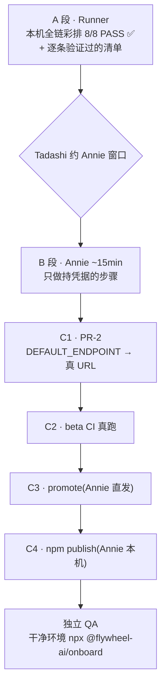

# FLY-1323 激活 npm 分发层 — 实施计划

Issue: FLY-1323 (https://linear.app/geoforge3d/issue/FLY-1323/激活-fly-1062-npm-分发层一次性初始化-建-bucket-部署-worker-灌-token-发首个-payload-npm)
日期: 2026-07-16
基于: exploration.md, research.md

---

## 1. 计划要点

这单**几乎没有代码**。FLY-1062 的机器件全在,本机全链真跑 8/8 PASS(research §1)。
缺的只是「一次真发布」,而真发布的每一步都要 Annie 的凭据。

所以计划的重心不是「写什么」,是**把 Annie 的 15 分钟压到不用试错**,以及**把顺序钉死**。

PR-1 的代码改动 = **§2.1 的三道 fail-closed 闸**(不是纯文档;原计划如此,审计后修正)。
剩下**唯一一处待改**在 PR-2:`DEFAULT_ENDPOINT` 占位符 → 真 URL。它**必须**等 B 段拿到真 workers.dev
地址才能写(research §5),所以它天然是第二个 PR。

## 2. 交付物

| PR | 内容 | 时机 |
|---|---|---|
| **PR-1(本 PR)** | 四份文档 + **三道 fail-closed 闸**(见 §2.1) | 现在 → review → merge(**Annie 窗口之前**) |
| **PR-2(代码,一行)** | `DEFAULT_ENDPOINT` = 真 URL + 壳版本 bump | B 段拿到真 URL 之后 |

### 2.1 为什么三道闸进 PR-1 而不是 PR-2

原计划是「PR-1 纯文档」。审计 Tadashi 拍的**首发直发**方案时发现:**它悄悄丢掉了 broker 自带的 fail-closed**,
而且我自己写的清单里还造了一道**假闸**(一个不存在的 `--sha256` flag,被静默忽略 —— 读起来像绑定,实际什么都没绑)。

Tadashi 拍板:**这三道闸是这次发布的安全前提,属于 1323,不是 scope creep**
(原话:「直发可以省重启,但不该顺带把安全省了」)。
它们**不需要真 URL**,所以能、也应该在 Annie 窗口**之前**落地:

| 闸 | 修的洞 | 真机证据 |
|---|---|---|
| `commit --expected-sha256` **必填** fail-closed + 拒未知 flag / 位置参数 / 短选项 / 等号形式 / 悬空 / 重复 | 直发没有 broker 把批准绑到 sha256;而清单里那个 `--sha256` 是假控制 | pipeline **29/29**(P6a–k + P7a/b);不匹配/未知/位置/短选项/等号/悬空/重复/缺失/格式/TOCTOU 全部真机验过拒 |
| `prepublishOnly` 钩子 | `npm publish` **零 script = 零闸**;占位符的闸在 shell-prepare/preflight,直发路径根本不经过 | 裸 `npm publish --dry-run` 真机 **exit 1、永不到 "Publishing to"** |
| preflight registry **fail-closed** + pin npmjs(默认 + scoped) | 任何 `npm view` 失败都被当「版本没被占」→ 假 PASS;scoped registry 还能把首包发到别处 | 默认 registry 正反双向真机验过;**scoped 那道没能真机验(沙箱拦了)→ 交独立 QA** |

**Codex design review 三轮**,每轮都抓到真洞(含**我修 bug 时新引入的同款 bug**:等号形式绕过绑定)。
这类 bug 有个统一形状:**控制看起来在,实际读不到 / 作用在别处**。

**PR-1 不含新脚本。** 我考虑过写一个 activation-status 检查脚本,砍了:
清单里嵌 `curl`/`gh` 几条只读命令就够,新脚本 = 新代码 = 要测要 review,
为一次性动作造常驻工具是过度工程。**Design simple, execute thorough.**

## 3. 三段

### A 段(我,已完成)

- [x] 三条硬事实独立复核(全成立)
- [x] 额外查出:repo secret `FW_BETA_PUBLISH_TOKEN` 也缺(issue 只提了 variable)
- [x] 全链彩排真跑 **8/8 PASS**(真 serve-node + FsBucket,服务路径零 stub)
- [x] wrangler 4.111.0 经 npx 可用;`r2 bucket create` / `secret put` 两条命令**实测存在**
- [x] R2 绑卡要求**证实**;npm org 风险**用 babel/angular 反例证据降级**
- [ ] `annie-activation-checklist.md`(本 PR 产出)
- [ ] design review → PR-1

### B 段(Annie,~15min;凭据全在她手里,我一行不碰)

严格按 `annie-activation-checklist.md`。顺序被 research §7 的铁律锁死。

**第 0 条 = 两个预检**(放最顶上,Tadashi 要求):
1. **R2 要绑付款方式**(免费额度也要)——她的钱,她知情后决定(注:早先「立刻扣 $5」是社区帖 anecdote,清单 §0a 已按她账号页实测更正为 Total Due Now $0.00)
2. **建 npm org `flywheel`** —— 建不了 = 包名要改 = 产品决定 → 升 Annie

**这两条可能把 15 分钟拉长,清单里明写。**

### C 段(我 + 她两次确认)

C1 PR-2 → C2 beta CI → C3 promote → C4 `npm publish` → 独立 QA。

## 4. 发布形态(Tadashi 已拍:混合)

- **首发 = Annie 直发**(她在场、2FA 在手、**零重启**)。
  **如实记为对 broker 设计形态(runbook §7)的一次性偏差** —— 不粉饰成「就该这样」。
- **broker = recurring 正式形态**,挂**下一个批量重启窗口**(`FLYWHEEL_PUBLISH_BROKER=1` + token env 随批量重启注入)。
- **不为本单单独触发 Tier-3**(现有 attended 陪走 + 1182 常开在飞;重启窗口 Tadashi 统一排)。
- 二发起走 broker → 一次验证两形态,正好落在验收里「定期发版走 CI 自动路径」那条。

## 5. 风险

| 风险 | 处置 |
|---|---|
| **R2 绑卡**(非「立刻扣 $5」——见 §0a 更正,免费额度内 $0.00) | 清单第 0 条预检,她知情决定。过不了 = 全停,**不硬闯** |
| **npm org `flywheel` 建不了** | 包名 = 产品决定 → **升 Annie**,我不自选替代名 |
| 多账号 → wrangler 交互式选择器卡住她 | 清单给 `CLOUDFLARE_ACCOUNT_ID` 取法 + 部署前显式 export(research §3.3) |
| 碰坏 GeoForge3D 在用的 CF 资源 | **硬边界**:只新增 R2 bucket + Worker;绝不碰 Pages `custom-map-studio` / `memoscaped.com` DNS+Email Routing。清单显式写「不要点这些」 |
| 忘配 repo secret → beta CI 变红 | 清单两条命令并列(variable + secret),**不是一条**。(更正:我原写「静默发不出」——**错的**,`payload-release.mjs` 明确 die+exit 1) |
| **占位符没修就发壳(直发路径无闸)** | ✅ **已补结构性闸(2026-07-17 更正)**:本 PR 给 `onboard-shell/package.json` 加了 `prepublishOnly` 钩子,裸 `npm publish` 现在会自动跑 `shell-publish-preflight.sh --founder-local`(占位符树 exit 1)。**不再只是人执行的补偿,是结构性的** —— G6a/G6b/G7 + shell-pack P4d 钉住。清单 10a 仍显式再跑一次 preflight 作双保险 |
| 首发直发 → broker 路径其实没验过 | 诚实记在案;二发走 broker 时**必须真验**,不能因为「首发通了」就默认 broker 也通 |

## 6. 验收

**干净、无私仓权限环境:`npx @flywheel-ai/onboard` 一条命令走通下载 + 安装引导。**
(FLY-1322 摩擦 #1/#2 的关闭判据。)

**由独立 QA 跑,我不自验** —— 实现者自验 = 自证(Tadashi 已确认)。

QA 要能拿到:一个真 license key(C 段 §6 签发)+ 一台没有 flywheel 私仓权限的干净环境。

## 7. 明确不做

- 不碰 payload retention 自动化(FLY-1143)
- 不碰 withdraw broker 化(FLY-1143)
- 不为本单单独开 Tier-3 重启(Tadashi 已拍)
- 不写 activation-status 脚本(§2)
- 不代 Annie 操作任何凭据面
