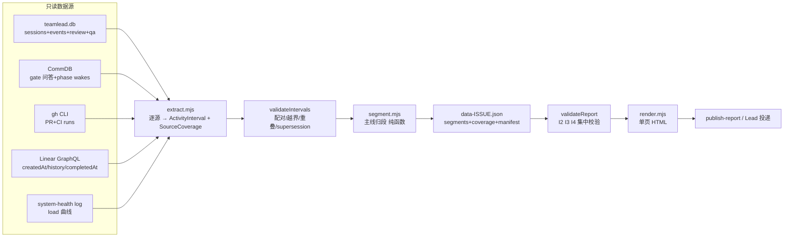

# FLY-1327 issue 周期时间分解 — 实施计划

Issue: FLY-1327 (https://linear.app/geoforge3d/issue/FLY-1327/分析-issue-周期时间分解-时间都花在哪-机制优化建议annie-直令)
日期: 2026-07-16
基于: research.md

> 修订记录:R1(2026-07-17)按 Codex design review 全量修订 —— 区间化数据模型(#1)、人工 gate 语义收窄 + supersession(#2)、failed review 计时更正(#3)、as-of 快照合同(#4)、逐源覆盖度与 validateReport(#5)、逐源时区契约 + overlay 区间化(#6)、逐标签边界规则表(#7)、汇总删失与不可加性(#8)、CI 接线与发布合同测试(#9)。R2 —— session_failed 移出 infra 信号(#1)、unmeasurable 显式标签 + required 源失败=no_verdict(#2)、结论口径与甜点并发门槛冻结(#3)、.backup 一致快照(#4)、test glob 与 CI step 位置修正(#5)。R3 —— infra 触发收敛为纯指纹聚类、deployment_events 降为旁证(#1)、IssueReport 判别联合 + SourceCoverage.authoritative_kind(#2)、manifest 两层拆分 + comparator 测试(#3)、R2/R3 契约全部落成具名 RED fixture(#4)。R4 —— 快照两段 CLI 合同(生产 .backup / 副本 immutable=1 读)(#1)、canonical hash 改为裁剪规范化后 extract payload + comparator 双向(#2)、阈值运算符 ≥ 三点边界 + 并发固定文案常量 + research 三处措辞对齐(#3)。R5/R6 —— I1 定版为「无逻辑写入」(主 .db 字节 + dump digest 不变;WAL -shm/-wal 协调结构排除,只读 .backup 必触碰 -shm 为 SQLite 固有行为)。**Codex design review R6 APPROVED(2026-07-17,6 轮)**。

## 0. 范围与不变量

**做**:可复跑分析脚本 + 4 个样本 issue 的墙钟分解 + 单页互动 HTML 报告 + 优化建议清单 + 投递给 Annie。
**不做**:常驻 dashboard(作为建议清单候选项让 Annie 勾选)、修改任何生产机制、写入任何生产 DB。

硬不变量(实现与 QA 都要断言;校验集中在 `validateReport()`,对中间 JSON 跑,不是只对 HTML 字符串):
- I1 **只读 = 无逻辑写入**(语义定版,Codex R5):不产生任何行/表/schema 变更 —— 断言对象是**主 .db 文件字节不变 + 逻辑内容摘要(dump digest)不变**。WAL 的 `-shm`/`-wal` 协调结构**排除在断言外**:任何 WAL 读者(包括只读 .backup)都会触碰共享内存协调区,这是 SQLite 读路径固有行为,不构成逻辑写入(Codex 5/5 fixture 实测)。GitHub / Linear 只做查询。
- I2 **段和=墙钟**:每 issue Σ段时长 ≡ min(T_end, as_of) − T0,误差 0。
- I3 **不编数**:测不到/没覆盖 → `unmeasurable`(绝不降级成 `idle_gap`);进行中 → `in_flight` 且不进已完成占比;绝无估算值冒充实测。
- I4 **可溯源**:每段 evidence 非空且用稳定复合键;`idle_gap` 用两侧边界记录 + 覆盖证明作 evidence。
- I5 **时区**:内部一律 epoch-ms / ISO-8601 带 Z;展示用 IANA `America/Los_Angeles`(PST/PDT 随日期);逐源 parse 契约见 §2.4。

## 1. 架构



文件布局(全部新增,零生产代码改动):

```
scripts/cycle-time/
├── cycle-time-report.mjs        # CLI 入口:--issues --as-of --out [--project flywheel]
├── lib/extract.mjs              # 5 源抽取 → ActivityInterval[] + SourceCoverage[]
├── lib/segment.mjs              # 归段纯函数(核心,重点测试)
├── lib/validate.mjs             # validateIntervals + validateReport(I2/I3/I4)
├── lib/render.mjs               # JSON → HTML(自含 CSS/JS,无外部依赖)
└── __tests__/*.test.mjs         # node:test
engineering/doc/FLY-1327-cycle-time-breakdown/
├── output/data-<ISSUE>.json     # 数据快照 + manifest(commit,可审计)
├── output/cycle-time-report.html
└── qa-evidence/
```

## 2. 数据模型与契约

### 2.1 区间模型(取代点事件)

```
ActivityInterval {
  source, kind,                  // 例:review_round / qa_run / ci_run / gate_question / session_stage / wake_queue / incident
  start_ms, end_ms | null,       // null = 截至 as-of 未闭合(in_flight)
  state,                         // ok | failed | superseded | open
  issue, execId?, evidence: EvidenceRef[]
}
SourceCoverage {
  source, authoritative_kind,       // source × kind 复合键(如 teamlead×review、commdb×gate)
  status: ok | partial | failed,    // failed=源不可用;partial=可用但覆盖有缺口;
                                    // 「查到 0 条但源健康」= ok + covered 全程(空≠失败)
  covered: [ {start_ms,end_ms} ],
  note
}
IssueReport = AnalyzedReport | NoVerdictReport   // 显式判别联合(Codex R3 #2)
NoVerdictReport { issue, as_of, failed_sources: [{source,kind}], notes }
  // I2/I4 对 NoVerdictReport 不适用;不进任何 aggregate;
  // validateReport 对两个分支各有独立校验路径。
EvidenceRef {                     // 稳定复合键 + 可发布最小摘要
  source, key,                    // 例:teamlead.codex_review_job:request_id=…
                                   //    gh_run:databaseId=…;commdb:message_id=…
  summary                          // 不含敏感内容的一行摘要
}
Segment { start_ms, end_ms, label, sublabel?, in_flight, evidence[] }
  // label 枚举 = §3 八标签 + 显式 `unmeasurable`:
  // unmeasurable 段照常参与 I2 墙钟求和,但从一切标签占比分母中排除,
  // 且绝不与 idle_gap 混同(I3)。
Overlay { kind: night | load_saturated | load_unknown, intervals: [{start_ms,end_ms}] }
                                   // overlay 独立存区间;汇总给 overlap_ms / unknown_ms,
                                   // 不在 Segment 上放整段 bool
```

每个源写明确的 point→interval 状态机(如 review job:created_at 开 → terminal updated_at 关;session:started_at 开 → terminal_at/as-of 关)。`validateIntervals` 拒绝:未配对 start/end、区间越出 [T0, as_of]、同 kind 非法重叠;supersession(见 2.3)在此阶段闭合。segment() 只消费**已验证**的区间。

### 2.2 时间口径

- T0 = Linear issue createdAt;T_end = Linear completedAt(Annie 的 Backlog→Done 口径);未 Done → as-of 截断。
- **review 轮时长 = created_at → terminal updated_at**(failed 轮同样计时,outcome=failed);`updated_at → responded_at` 差值单列「投递/唤醒延迟」指标,不并入 review 运行段(research.md §1.3 更正)。仅 terminal updated_at 缺失才 unmeasurable。

### 2.3 人工 gate 语义与 supersession(Codex R1 #2)

- `gate_waiting_human` **只含** checkpoint ∈ {brainstorm, 有效 approve_to_ship} 的 CommDB question。`review_code`/`review_design` 问答不是人工 gate(自动 review 的传输层),review 区间以 codex_review_job 为准。
- gate 区间关闭规则(先到先关):response 落地 / 该 session terminal / pr_head 变更使 approve 失效 / 同 checkpoint 新 question 开启(旧的标 superseded)。晚到 response(真机例:FLY-1309 question 14:50、session terminal 21:59、response 次日 05:23)不得回填延长 gate 段 —— 必须写回归 fixture。

### 2.4 逐源 parse 契约(Codex R1 #6)

| 源 | 原始格式 | 解析 |
|----|----------|------|
| teamlead.db / CommDB 文本时间戳 | `YYYY-MM-DD HH:MM:SS[.SSS]`,UTC 无 Z | 显式按 UTC 解析(拼 `Z`),禁止裸 `new Date(str)` |
| runner_phase_wakes | **epoch 毫秒整数** | 直接用 |
| gh / Linear | ISO-8601 带 Z | 标准解析 |
| system-health log | 本地时间(America/Los_Angeles),60s 桶 | 按 IANA 时区换 epoch;缺桶 = `load_unknown` overlay,不是"未饱和" |

overlay 边界(夜间 23:00/08:00 换算、60s 桶边界、DST、缺桶)各写测试。

### 2.5 覆盖度与 fail-closed 策略(Codex R1 #5 / R2 #2)

- **required 源 = Linear、teamlead.db、CommDB、gh** —— 任一 status=failed → 该 issue **no_verdict**(报告显示「数据源不可用」,不出任何分段结论)。理由:分类源失败时无法从其他权威证据定位「哪些窗口本来是 gate/CI」,局部降级存在循环依赖,不诚实;整单 no_verdict 是唯一可执行的诚实策略。
- **optional 源 = system-health** —— failed → load overlay 全程 `load_unknown`,不影响主线归段。
- 任何不在相关 SourceCoverage.covered 内的原子区间 → label=`unmeasurable`(参与 I2、排除于占比,§2.1),绝不归 `idle_gap`。coverage 按 source × authoritative-kind 记录(如 teamlead×review、commdb×gate)。

## 3. 归段规则(逐标签可执行边界,Codex R1 #7)

优先级(高→低)与判定,exploration §4 gate 已批,细化如下:

| 标签 | 开/关边界 | sublabel |
|------|-----------|----------|
| infra_incident | 开:**唯一触发 = 指纹聚类**(方案 A,Codex R3 #1):同项目 ≥3 个 session 在同一 60s 窗内非正常 terminal 且 last_error 指纹一致;**聚类查询范围 = teamlead.db 该项目全部 sessions**(不限于 4 个样本 issue)。deployment_events 是部署台账(StateStore.ts:1679-1698),**不是**重启/health 证据,最多作同窗旁证,绝不单独触发。**单个 session_failed 不是 infra 信号**(DirectEventSink 对普通 failed/blocked 也发它)—— 单个失败留在其原活动标签并记 outcome=failed。关:恢复锚点(该项目新 session started);无锚点时只有事故尾部标 unmeasurable,不得把直到下一 session 的整段抬成 infra | clustered_failure |
| gate_waiting_human | §2.3 | brainstorm / approve_to_ship;PDT 时段夜间只做 overlay 标注 |
| rework_loop | 开:CHANGES_REQUESTED verdict 或 qa_result=FAIL 或 three_stage_fix_round;关:下一次同类 review/QA 开启 | review_fix / qa_fix |
| qa_running | auto_qa_record started→completed;或 qa session active | |
| review_running | codex_review_job created→terminal updated_at | design / code / delivery_latency(updated→responded 只进指标表不占主线) |
| ci_waiting | 绑定当前 PR + 当前 head SHA 的 required checks run:createdAt→completedAt/updatedAt;head 被 supersede 时截断;旧 head/非 required workflow 不算 | |
| working | design/implement session active 且 stage ∈ {onboard,brainstorm,research,plan,implement,test} | design / implement |
| idle_gap | 以上全无且覆盖完整 | **backlog_or_dispatch_wait**(T0→首个 session)/ **phase_handoff**(上 phase terminal→下 phase started)/ **park_wake**(checkpoint_park_* / runner_phase_wakes queued→started) |

同一原子区间多标签命中时取表中最高优先级;并行活动进 evidence 附注。

**甜点并发数的并发定义**:并发 = 「active-work session 数」(design/implement/qa 且非 awaiting_review/design_done/parked 的 running 态);parked/等审 session 单独一条曲线作对照,绝不混入计算并发。两曲线与 load 同轴展示。

## 4. 实施步骤(TDD,每步先测后码)

### Step 1 — 契约 + validate + segment(纯函数)
- 先定版 §2 的 ActivityInterval/SourceCoverage/EvidenceRef 契约与各源状态机,fixture 先行。
- RED 用例(≥24,具名 fixture,含 R2/R3 全部诚实性契约的回归门):①并行 review+CI 归 review ②人工 gate 未答 as-of 截断 ③晚到 response 不回填(FLY-1309 形)④failed review 轮计时+outcome=failed ⑤指纹聚类成立→infra_incident;无恢复锚点→仅尾部 unmeasurable ⑥**单个 session_failed 不得成 infra** ⑦**同窗数量不足 / 指纹不一致不得成 infra** ⑧**聚类必须命中输入 issue 之外的同项目 session(跨单查询)** ⑨覆盖缺口→unmeasurable 非 idle ⑩**required 源 failed→NoVerdictReport;optional health failed→仅 load_unknown** ⑪**partial coverage→局部 unmeasurable;空结果但源健康→ok 不降级** ⑫idle 三 sublabel 分流 ⑬未配对/越界/重叠被 validateIntervals 拒绝 ⑭supersession(head 变更关 gate;新 question 替换旧)⑮I2 段和断言(AnalyzedReport 分支)⑯优先级两两冲突全序 ⑰overlay 夜间/DST/缺桶边界 ⑱**verdict 边界:coverage 79.9%/80.0%/80.1%、qualifying issue 1/2、mechanism 占比 29.9%/30.0%/30.1%(运算符 ≥,below/equal/above 三点)** ⑲**pooled 与 median 不同向→inconclusive** ⑳**并发图输出恒等于常量 CONCURRENCY_INSUFFICIENT_MSG 全串,断言不含方向性数字** ㉑**canonical bytes 与 scratch 路径/执行时刻无关 + post-as-of 增长不变字节 / pre-as-of 迟到记录必变(comparator 双向测试)**。这些是 R1-R3 修订的回归门,不留给实现者自行补齐;verdict/validateReport 以纯函数测试,不只测 HTML 文本。
- GREEN:`validateIntervals` → `segment(intervals, t0, asOf, opts)` → `validateReport`。
- 负向断言突变验证:故意破坏 fixture(删段/降级 unmeasurable→idle)→ 对应断言必须变红。

### Step 2 — extract.mjs 五源抽取
- SQLite 经 `sqlite3 -readonly` CLI(execFile,JSON 输出);gh/Linear 带重试,失败即按 §2.5 fail-closed 落 SourceCoverage,绝不静默补 0。
- **一致快照(Codex R2 #4 / R4 #1,两段 CLI 合同分开写死)**:单连接 ≠ 一致快照。①生产源只用 `sqlite3 -readonly "file:<prod>?mode=ro" ".backup '<scratch>/snap-<name>.db'"` 冻结(WAL 下 .backup 原子一致);②**副本查询必须用 `sqlite3 "file:<snapshot>?mode=ro&immutable=1"`** —— backup 副本保留 WAL journal mode 但无 -wal/-shm sidecar,普通 `-readonly <path>` 稳定 SQLITE_CANTOPEN(14)(Codex 真机 fixture 实测)。真实 CLI fixture:WAL 源→backup→immutable 读,断言查询成功 + **源主 .db 文件字节不变 + 逻辑 dump digest 不变**(`-shm`/`-wal` 协调结构按 I1 定版明确排除,fixture 注释写明原因);另模拟「两次查询之间并发提交」证明结果来自同一快照。
- **manifest 两层拆分(Codex R3 #3 / R4 #2)**:canonical manifest(参与逐字节比对、随产物 commit)只含:固定 as-of、schema/query 版本、逻辑 source id、**「按 as-of 裁剪 + 字段规范化 + 稳定排序后的 source extract payload」的 content hash**(不是整库 backup/原始 API 响应的 hash —— 那个会被 as-of 之后的正常数据增长改变,Codex 真机双 backup 实测 SHA 不同而裁剪后 payload 相同)、排序规范版本;raw backup/API 响应 hash、scratch 路径、执行时刻只进 **QA run log**(不参与比对)。comparator fixture 两向断言:①首跑后向源里加 **post-as-of** 记录再跑 → canonical manifest + analytics bytes 逐字节一致;②加 **pre-as-of 迟到记录** → hash/bytes 必须变化且响亮提示。
- **as-of 快照合同(Codex R1 #4)**:CLI 启动把 `--as-of now` 解析**一次**为固定 UTC ISO 时刻写入 manifest;所有源统一裁剪到该时刻(as-of 后才 terminal 的 session/review/CI/Linear 记录按 as-of 时状态处理;GitHub run 在 as-of 未完成的,不用事后 conclusion 回填);teamlead/CommDB 各在单一只读连接内完成本源全部查询;产物固定排序与序列化,manifest 记 schema 版本 + 各源查询摘要。QA 用 manifest 里的精确 as-of 重跑,逐字节比对。
- 测试:临时 fixture SQLite + 录制 gh/Linear JSON;不碰生产 DB、不联网。

### Step 3 — render.mjs 单页 HTML
- Apple 浅色规范(#f5f5f7 底、白卡片、系统字体、960px、mobile viewport)。图表规范就地写死(实现时如有 dataviz skill 可加载对照,但**本 plan 内规范自足**):时间轴为纯 HTML/CSS 横向 stacked bar;段色板 = 分类色、同标签恒色、饱和度适中;overlay 用底纹/斑纹不占色板;所有文本类数据经 HTML escape;禁止内联事件属性(无 onclick=),交互 JS 集中在单个 `<script nonce="__CSP_NONCE__">` 块(publish-report registry 的 opt-in nonce 合同,report-registry.ts:51-67);总产物 < 512 KiB(publish-report 上限);localStorage key 带 `fly1327-` 前缀隔离;复制按钮带移动端 fallback(execCommand 兜底)。
- 布局:1) 一句话结论(措辞模板 + 人工核校,限定「这四个样本中」)2) 汇总视图 3) 每 issue 时间轴(点击段展开 evidence)+ 返工计数卡 4) 并发-load 对照 5) 互动建议清单(建/不建 + 评论 + 导出)6) 方法学附录(规则表、无法测量清单、manifest、覆盖度表)。
- **汇总诚实规则(Codex R1 #8)**:同时给 pooled 与 per-issue 归一两种占比视图;closed-only 分母与含删失(censored)时长分开展示;每 issue 列「可分类覆盖率」;被排除的 in_flight/unmeasurable 量显式列出。建议清单每条「预期节省」= 独立 counterfactual,给上下界,页面明示**不可相加**。
- **结论口径冻结(Codex R2 #3,实施前不得再改)**:
  - 标签→类别映射(固定):working→`value_work`;review_running / qa_running / ci_waiting→`necessary_process`;idle_gap(全部 sublabel)+ infra_incident→`mechanism_waste`;rework_loop→`execution_waste`;gate_waiting_human→`human_wait`(exogenous);unmeasurable→`unknown`。night / load overlay = **解释变量**,不作机制证据。
  - 出结论门槛:仅 closed 且可分类覆盖率 ≥80% 的 issue 参与判定;参与 issue <2 → 整体 `inconclusive`。
  - 三态判定(pooled 与 per-issue 中位数**同时**满足才成立):mechanism_waste 占比 > execution_waste 且 mechanism_waste **≥30%**(运算符冻结为 ≥;边界测试打 29.9% / 30.0% / 30.1% 三点)→ 「这四个样本中,慢主要在机制」;反向同理 → 「慢主要在执行」;其余 → 「混合/数据不足以裁决」+ 原始数字。
  - **甜点并发数(预先冻结)**:每并发档需 ≥60 覆盖分钟 且 ≥2 个独立 issue 贡献才可定量;本次单日 4 样本几乎必然不满足 → 该图**预先限定为描述性观察**,输出为固定字符串常量 `CONCURRENCY_INSUFFICIENT_MSG = "样本不足以定量,建议持续采集"`(实现与测试共用同一常量);不输出方向性数字。

### Step 4 — 真实数据跑批
- `node scripts/cycle-time/cycle-time-report.mjs --issues FLY-1309,FLY-1307,FLY-1319,FLY-1252 --as-of now --out engineering/doc/FLY-1327-cycle-time-breakdown/output/`
- 产物 JSON+manifest+HTML commit。人工抽查 ≥3 段回原始记录,记录进 qa-evidence。

### Step 5 — 交付
- 首选 issue 明示的 `flywheel-comm publish-report` 进本 issue thread;被禁/失败则 HTML+首屏截图经 `flywheel-comm ask --report` 交 Lead 投递。
- 勾选结果由 Lead 转化为后续 issue,本 issue 不自动建单。

## 5. 测试与 CI 接线(Codex R1 #9)

- 测试框架 `node:test`(仓库根级 .mjs 先例一致)。根 package.json 加 `"test:cycle-time": "node --test scripts/cycle-time/__tests__/*.test.mjs"`(显式 glob —— 目录形式在本仓 Node 实测 MODULE_NOT_FOUND,与 ci.yml:307 现有显式 glob 先例一致;在仓库要求的 Node 22 上验证)。CI:step 放进 `.github/workflows/ci.yml` **现有 `apt-get install sqlite3` step(ci.yml:67-72)之后**,step 内先 `sqlite3 --version` preflight 再跑测试;plan 实施时写明确切 job/step 位置。
- render 测试覆盖发布合同:完整 head、escape、无内联事件、恰一个 `nonce="__CSP_NONCE__"` script、<512KiB、localStorage key 前缀、复制 fallback 存在。
- 独立 QA 清单:① manifest as-of 重跑逐字节复现 ② 随机 ≥5 段回查原始记录 ③ 已发布 URL 真 CSP 下交互可用 + 去 nonce 突变对照 ④ unmeasurable/in_flight 出现在已知不可测处 ⑤ 覆盖度表与 SourceCoverage 一致。
- `pnpm lint` 全仓干净;新测试不依赖生产环境。

## 6. 风险与对策

| 风险 | 对策 |
|------|------|
| Bridge 间歇不可达 | 脚本不依赖 Bridge;stage 上报重试;交付走 Lead fallback |
| 样本 issue 实施时仍未收口 | as-of manifest + in_flight 标注(gate 已批) |
| gh/Linear 限流/凭据失效 | 带重试;失败 fail-closed 落 SourceCoverage(§2.5) |
| 归段规则争议 | 规则表+证据+覆盖度全公开可复核;规则参数化可重跑 |
| 并发/负载单日样本不足 | 「样本不足以定量」+ 持续监测建议项 |

## 7. 里程碑

1. M1:契约 + validate + segment 全部单测绿(TDD 核心)。
2. M2:extract + render 完成,合成数据端到端出 HTML,CI step 接线绿。
3. M3:真实数据跑批,4 issue 快照+manifest+报告 commit,溯源自检完成。
4. M4:PR + Codex code review(xhigh)通过,独立 QA PASS。
5. M5:交付 Annie,附一句话结论。
