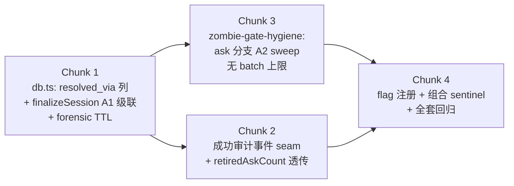

# FLY-1328 runner close 不清未答 ask — 实施计划

Issue: FLY-1328 (https://linear.app/geoforge3d/issue/FLY-1328/fix-生命周期收尾漏了一格runner-close-不清它名下的未答-ask-pending-队列长期堆尸信噪比归零fly-1185)
日期: 2026-07-17
基于: research.md

## 0. 目标与验收

**目标**:runner teardown 后,它名下未答的普通 ask(checkpoint-less question,
含 DONE report)被 cascade retire(A1)或周期 sweep retire(A2),标
`resolved_via`;Lead 的 pending 队列只剩还能有用地回答的问题。

**验收(全部满足)**:
1. 单测:A1/A2 谓词矩阵 + kill-switch 反向兼容 sentinel(突变验证 + 组合矩阵,
   见 Chunk 4)全绿;
2. 真机:生产形态 comm.db 样本上,**单轮** sweep 清掉全部「owner CommDB 行已删 +
   UUID from_agent + age>30min」的尸体(部署时点存量,brainstorm 时实测
   178/181;无 batch 上限),非 UUID 残留与 30min 内新 ask 留下;
3. 真机:close 场景级联生效;**投递合同(诚实版)**:在 GatePoller 对该 Lead
   的 relay 健康(circuit 闭合、StateStore 可写)的前提下,close 前最后一刻的
   `ask --report` 的 runner_question 事件仍到达 Lead(grace 15min >> tick ~3s)。
   **已记录例外**:per-lead circuit 长开(>15min)或 StateStore 长故障期间,
   晚到的 ask 可能在未 relay 前被 retire——此为接受的时间窗风险,不承诺绝对
   零丢失(Codex R1 #6);附 relay-failure 场景测试证明我们不虚报 zero-loss;
4. `FLYWHEEL_ASK_HYGIENE=0` 时与今日行为**逐字段**一致(含 gate 行的
   `resolved_via` 保持 NULL——该赋值受 ask flag 守卫);
5. 取证两层可验证:retire 后的 ask 行在 protection ON 下带 `resolved_via` 存活
   **1 小时 forensic TTL**(retire → 新 CommDB open → 行仍在;TTL 过后 purge);
   day-scale 审计事件按 **ask-disposition 合同**写(Codex R2 #1):仅当
   `askHygieneEnabled` 且 outcome=finalized 且 `retiredAskCount > 0` 时写
   恰一条幂等事件——flag=0 或零 ask 的 finalize **不产生**任何新事件
   (事件集合与今日一致);
6. 全仓 lint + CI 绿;Codex code review APPROVED;独立 QA PASS。

**明确不做**(见 research.md §2 负面清单):gate retire 语义(除受 flag 守卫的
`resolved_via` 标记外零改动)、review gate 豁免、Z2-for-ask、pending 读面、
purge 谓词、respond/check 命令,全不碰。

## 1. 改动总览(4 个 chunk,TDD:每个先红测)



## 2. Chunk 1 — CommDB:`resolved_via` 列 + A1 级联(packages/flywheel-comm)

### 2.1 迁移(Codex R1 #2 修订:顺序是合同的一部分)

- `resolved_via TEXT`(nullable)进 canonical `SCHEMA`(db.ts:12 的
  CREATE TABLE messages)+ `Message` 类型;
- ADD COLUMN 探测块放在 **`migrateMessageTypeConstraint()`(db.ts:381)调用
  之后**——旧库(pre-FLY-1279,无 ack_receipt 约束)会先 rebuild 再补列,
  列不会被 rebuild 的固定列清单丢掉。rebuild 的 CREATE/INSERT/SELECT 列清单
  **不改**(理论边界:「已有 resolved_via 且无 ack_receipt」的库在当前迁移
  顺序下不可能产生——同一次 open 内 rebuild 先于 ADD;在计划中记录该前提);
- duplicate-column 吞错照旧(并发 open 竞态)。

### 2.2 A1 级联 + forensic TTL(Codex R1 #1 修订)

`finalizeSession` 事务内、gate UPDATE 之后,加第二条 UPDATE:

```sql
UPDATE messages AS q SET
  resolved_at = datetime('now'),
  read_at     = COALESCE(read_at, datetime('now')),
  expires_at  = <TTL>,                     -- 见下
  relay_state = 'terminal_disposed',
  resolved_via = 'owner_closed'
WHERE q.from_agent = ?
  AND q.type = 'question'
  AND q.checkpoint IS NULL
  AND q.resolved_at IS NULL
  AND q.relay_state != 'terminal_disposed'
  AND q.created_at <= datetime('now', '-15 minutes')   -- grace 常量
  AND NOT EXISTS (
    SELECT 1 FROM messages r WHERE r.parent_id = q.id AND r.type = 'response'
  )
```

- **`<TTL>`**:protection ON(`FLYWHEEL_COMMDB_PROTECTION !== "0"`)→
  `datetime('now', '+1 hour')`(forensic TTL:pending 过滤在 protection 下只看
  relay_state,行立刻离开 pending,但 purge 前保留 1 小时供小时级查案);
  protection OFF → `datetime('now')`(legacy pending 过滤是 expires_at>now,
  必须立即过期才能离开 pending——字节保持 legacy 语义);
- 整条 UPDATE 受 `askHygieneEnabled()` 守卫(flag=0 → 不执行,字节回退);
- 既有 gate UPDATE 的 `resolved_via = 'owner_closed'` 赋值**同样受 ask flag
  守卫**(Codex R1 #3:flag=0 时 gate 行逐字段与今日一致;实现上 gate UPDATE
  的 SET 子句按 flag 拼装该字段,WHERE 谓词零改动);
- `FinalizeSessionResult` 加 **required** `retiredAskCount: number`
  (Codex R2 #3:该类型只有 `CommDB.finalizeSession` 一个权威 producer,
  required 让 TypeScript 为调用图提供 exhaustiveness guard;flag=0 时返回 0
  ——DB 行为字节回退,但 authority result 诚实报数;同步更新
  db.fly1238.test.ts 的 exact-object 断言);`retiredQuestionCount` 语义
  不变(= gate 数);
- 常量:`ASK_CASCADE_GRACE_SQL = '-15 minutes'`、
  `ASK_FORENSIC_TTL_SQL = '+1 hour'`,带注释(15min 杀「落库→首次 relay tick」
  竞态;+1h 为 protection 下的取证窗口)。

### 2.3 Chunk 1 红测(新建 `src/__tests__/db.fly1328.test.ts`)

- T1 迁移:**pre-FLY-1279 fixture**(手工建无 ack_receipt 约束、无 resolved_via、
  含真实 message 数据的旧形态库)open 后:ack_receipt 约束在、原数据在、
  resolved_via 列在;近代库(有 ack_receipt 无 resolved_via)同验;重复 open
  幂等;两 opener 并发竞态(duplicate-column 路径);
- T2 级联-清(protection ON):register exec-a → checkpoint-less ask(created_at
  回拨 16min)→ finalizeSession → terminal_disposed + resolved_via='owner_closed'
  + retiredAskCount=1 + **expires_at ≈ now+1h**;`kind='report'` 同样清;
- T2b forensic TTL:T2 之后**再 open 一次 CommDB**(触发 purgeExpired)→ 行仍在
  (带 resolved_via);把 expires_at 回拨过期 → 再 open → 行被 purge;
- T3 grace-留:created_at 5min 前的 ask 不动;
- T4 答过的免:有 response child 的 ask 原样;
- T5 gate 不受影响:brainstorm gate 照旧 retire(且 flag ON 时带 resolved_via),
  review_design gate 照旧幸存——FLY-1238/1257 的**既有 gate 语义断言不变**
  (exact-object 断言按 required `retiredAskCount` 字段更新,Codex R3 note-2);
- T6 kill-switch 突变验证:同 fixture 先 flag 缺省证明 ask 被清 + gate 行带
  resolved_via;再 flag=0 证明 ask 原样 + gate 照清但 **resolved_via 为 NULL**
  + 其余字段与今日逐字段一致;
- T7 别人的 ask 不误伤;
- T8 protection OFF 模式:T2/T3 重跑,断言 OFF 下 expires_at=now(立即离开
  legacy pending)。

## 3. Chunk 2 — 成功审计事件 seam + 计数透传(packages/teamlead)

(Codex R1 #1/#5 + R2 #1 修订:不是「三处纯管道」;close 事件在 finalize
**之前**写,不能塞 count;成功审计今天不存在;且 CommDB wrapper 没有
store/issueId/source 上下文——审计必须落在 StateStore 侧既有 seam 上。)

### 3.1 Producer/Consumer 地图(实测核对过的完整清单,Codex R2 #1)

`finalizeCommDbSession` wrapper 的调用点(全部经由其后的
`store.recordCommDbFinalizeOutcome` 记账):close-runner.ts(三条成功分支)、
lifecycle-closeout.ts、post-merge.ts:149、crash-reaper.ts:319、
actions.ts:1411、stale-blocker-guard.ts:208、statestore-ghost-reconcile.ts:217
及 plugin.ts 的注入点;此外 `pruneDeadTerminalCommDbSessions`(经
onFinalizeOutcome 回调拿 store)与 **`reconcileCommDbRunningAgainstFsm`**
(commdb-fsm-reconcile,直调 `db.finalizeSession`)。实现前用
grep 复核清单仍然齐全(新调用点可能在本票窗口期出现)。

### 3.2 实现(审计 seam = StateStore 侧,不动 CommDB wrapper 签名)

- `FinalizeCommDbResult` 加 **required** `retiredAskCount: number`
  (Codex R2 #3:finalized 透传真值,failed/no_db 显式 0;本类型的全部
  构造分支都在本票可控范围,required 让漏改成为编译错);
- **审计写入点 = 扩展 `StateStore.recordCommDbFinalizeOutcome`**(加可选
  `audit?: {retiredGateCount, retiredAskCount, source}` 参数;或紧邻新建
  `recordCommDbFinalizeOutcomeWithAudit`,实现时取侵入面小者)——它是
  今天所有 finalize 调用点已经在调、且天然持有 store/issueId/projectName
  上下文的唯一 seam(Codex R2 #1);`pruneDeadTerminalCommDbSessions` 经
  onFinalizeOutcome、`reconcileCommDbRunningAgainstFsm` 在直调处接同一方法;
- **事件合同(ask-disposition,非 per-finalize)**:仅当 `askHygieneEnabled()`
  且 outcome=finalized 且 `retiredAskCount > 0` 时写恰一条幂等事件
  event_type `commdb_ask_disposed`,event_id `commdb-ask-disposed-<executionId>`,
  payload `{retiredGateCount, retiredAskCount, resolvedVia:'owner_closed',
  source}`;failed/no_db/零 ask/flag=0 一律不写(既有 failure ledger 照旧)。
  **不重排**既有 `lead_close_runner*` 事件的时序与语义;
- `CloseRunnerResult.retiredAskCount?`(optional,面向众多旧呼叫方的加法
  兼容)照旧透传,close 事件 payload **不塞** finalize count。

### 3.3 Chunk 2 红测

- finalized / failed(rollback)/ no_db / direct-reconcile(经
  `reconcileCommDbRunningAgainstFsm`)四类路径:count 透传正确;
- 事件合同矩阵:retiredAskCount>0 + flag ON → 恰一条(幂等:重复 finalize
  不加行);**ASK=0 的成功 finalize → 零新事件**;**ASK=ON 但
  retiredAskCount=0 → 零新事件(不伪造 owner_closed disposition)**
  (Codex R2 #1 两条 sentinel);
- close-runner 三条成功分支 + boot prune onFinalizeOutcome 均走到审计 seam。

## 4. Chunk 3 — A2 sweep:zombie hygiene ask 分支(packages/teamlead)

### 4.1 调度与守卫(Codex R1 #3/#4 修订)

- gate-poller.ts `zombieGateHygienePass` 的 early-return 改为**三能力全 OFF
  才 return**:`!zombieGateResolveEnabled() && !watchdogOn &&
  !askHygieneEnabled()`;候选集去掉 `q.checkpoint != null` 过滤(eviction
  两个排除集移进 gate 分支内部条件);**watchdog sweep bookkeeping
  (`beginUnreachableSweep`/`endUnreachableSweep`)只在
  zombie 或 watchdog 至少一个开启时执行**——ASK-only 模式只跑 ask
  dispatch/reconcile,不得顺带清 watchdog 的 in-memory unreachable episode
  (Codex R2 #4;该内部状态纳入组合测试断言,不只断言无事件);
- `askHygieneEnabled(env)` 为**共享导出**(flywheel-comm 导出,db.ts 与
  teamlead 同源引用;registry readSites 登记两处);
- ask 分支在**任何副作用之前**(intent 写入、StateStore getSession、reconcile)
  先查 ask flag;flag=0 → ask 路径零副作用,gate Z1/Z2 各自维持原 flag 行为;
- **无 batch 上限**(Codex R1 #4:撤回我自加的 50/轮——它违背 Tadashi 批准的
  「首轮清空存量」验收;主 relay 本就每 tick 对全部 pending 做 getSession,
  178 次一次性触碰不构成新增负担。谓词按 cheap-first 排序:UUID → CommDB 行
  → age → StateStore。真机验证单轮耗时,若实测暴露问题再带着数据找 Tadashi
  改验收,不预防性限流)。

### 4.2 ask 分支谓词(顺序即实现)

1. `q.checkpoint == null` 且 `askHygieneEnabled()`;
2. `from_agent` UUID 形(fail-closed);
3. CommDB `getSession(from_agent)` 为空(teardown 证据;行在 → continue,
   FLY-161 completed-alive/parked 保证);
4. StateStore session 缺失 或 `isStateStoreIrreversibleTerminalForZombie`
   (活 session + 行没了 = Z2 形态 → continue,不 retire、不
   noteUnreachableRunner);
5. age guard:canonical SQLite UTC 且早于 now-30min(格式非法 → fail-open 跳过);
6. 三相审计 + `retireQuestionGuarded(q.id, {expectedFromAgent,
   requireUnanswered: true, resolvedVia: 'owner_closed_sweep',
   retention: 'ask_forensic'})`——**forensic TTL 绑定在显式
   `retention:'ask_forensic'` 选项上,不绑定原语本身**(Codex R2 #2:
   该原语同时是既有 zombie gate Z1 的 mutation primitive;opts 不传时
   expires_at 必须保持 `datetime('now')`、其余 SET/WHERE 逐字不变,
   既有 gate 的 purge 时序零改动)。传 retention 时按 §2.2 protection 分档;
   对照测试:protection ON 下同 DB retire 一个 ask + 一个 zombie gate,
   reopen 后 ask 在 1h forensic 窗口内、gate 已按旧行为 purge——注意
   SQLite 秒级边界(purge 谓词是 expires_at **<** now,同秒 reopen 等值行
   不会被 purge):先断言 gate expiry ≈ now,再把其 expiry 回拨 ≥1s(或用
   可控时钟)后 reopen,避免正确实现偶发红测(Codex R3 note-3);
   事件 type:`ask_hygiene_retire_intent` / `ask_hygiene_retired`,payload 带
   `resolvedVia/kind/ageHours`;dangling-intent reconcile 参数化复用
   (`reconcileDanglingIntents` 提 (intentType, outcomeType, idPrefix) 参数,
   两组 type 各扫各的;若参数化侵入面大则 ask 版独立小函数,code review 定夺)。

### 4.3 「行消失=teardown」guardrail(Codex R1 #7)

- 该前提目前是调用图事实而非 DB 层不变量:`deleteSession` /
  `deleteSessionAndRunnerPhaseLifecycle` 仍公开。本票加防护:两方法 doc
  comment 标注「proven-teardown 专用;新增调用点会使 A2 误清活 runner 的 ask,
  破坏 FLY-161」+ **静态 call-site sentinel 测试**(grep 断言仓内非测试调用点
  清单与今日一致,新增调用点必须显式改此测试);`unregisterPendingSession`
  只删 `:pending` 行的 SQL 谓词不放宽。

### 4.4 Chunk 3 红测(新建 `bridge/__tests__/ask-hygiene.test.ts`)

- M1 全满足 → retire + intent/outcome 两事件 + resolvedVia='owner_closed_sweep'
  + expires_at 按 protection 分档;
- M2 StateStore 终态 → 同 M1;
- M3 CommDB 行在 → 留;
- M4 StateStore 活 + 行无 → 留且不 noteUnreachableRunner;
- M5 非 UUID('runner'、'qa-fly1239-78754')→ 留;
- M6 age 29min → 留;created_at 非 canonical → 留;
- M7 并发 answer 赢 → skipped_answered,history 原样;
- M8 **大候选集单轮收敛**:200 个合格候选一轮全清(替代原 batch 测试);
- M9 flag 组合矩阵(见 Chunk 4);
- M10 gate 分支回归:既有 zombie 测试全绿零改;
- M11 集成:StateStore=completed + CommDB 行在 + tmux/parked 活 → ask 不动
  (FLY-161 保证的正面证据,Codex R1 #7);
- M12 relay-failure 场景(Codex R1 #6):circuit-open 模拟下 fresh ask 未 relay
  → close 级联因 grace 幸存 → circuit 恢复后 relay 成功 → 下轮 sweep(过 age)
  才清——证明投递合同按验收 #3 的诚实措辞成立。

## 5. Chunk 4 — flag 注册 + 组合 sentinel + 收尾

- registry.ts 注册 `FLYWHEEL_ASK_HYGIENE`(default_on/bool/true,readSites =
  flywheel-comm db.ts + teamlead zombie-gate-hygiene.ts + gate-poller.ts;
  drift 测试同步);
- **组合 sentinel**(Codex R1 #3):`ASK × ZOMBIE × WATCHDOG` 关键组合——
  ASK=0+两旧 flag ON(ask 行、gate 行全字段、事件集合、watchdog 行为 = 基线);
  ASK=ON+两旧 flag OFF(ask 分支照跑,gate Z1 连 intent 都不写,Z2 静默);
  全 OFF(pass 整体 early-return,零副作用)。每条负向断言配突变对照;
- 全仓 `pnpm lint` + 受影响包全套 vitest + CI;
- 真机自证(implement 阶段):
  1. 生产 comm.db 副本 + 隔离 env 跑一轮 `runZombieGateHygiene` → 存量按预期
     **单轮**清(方向:~178 清 / 非 UUID 留 / 太新的留),记录单轮耗时;
  2. 隔离 comm.db 完整 close:register → ask(回拨过 grace)→ finalizeSession
     → pending 消失 + resolved_via 对 + forensic TTL 生效 + 成功审计事件在;
  3. DONE report 投递合同:ask --report → 立即 finalizeSession(grace 内幸存)
     → 模拟 GatePoller relay → lead_events 有 runner_question → 过 age 后
     sweep 清;
- 独立 QA(FLY-1211 硬门,由 Lead 派)。

## 6. 风险与对策

| 风险 | 对策 |
|---|---|
| close 抢在首次 relay 前吃掉 DONE report | A1 grace 15min + A2 age 30min;**诚实合同**:健康 relay 下零丢失;circuit 长开/StateStore 长故障为已记录例外(验收 #3,M12 场景测试) |
| 误清 completed-alive / parked(破 FLY-161) | teardown 证据 = CommDB 行已删;行在 → 永不候选(M3/M11) |
| 误清活 runner(StateStore 活但行丢) | 双证:StateStore 活 → 留(M4) |
| 非 runner 身份误伤 | UUID guard fail-closed(M5) |
| `resolved_via` 被 purge 秒删,取证落空 | protection ON 下 forensic TTL +1h(T2b);day-scale = `commdb_ask_disposed` 幂等事件 |
| 迁移在 pre-FLY-1279 库上丢列 | ADD 置于 rebuild 之后 + SCHEMA/类型同步 + T1 老库 fixture |
| 迁移竞态(并发 open) | duplicate-column 吞错(既有模式)+ T1 竞态用例 |
| flag=0 非逐字段兼容 | gate 的 resolved_via 赋值受 ask flag 守卫;组合 sentinel + 突变对照 |
| ask 分支被旧 flag early-return 吞掉 | 三能力全 OFF 才 return;组合矩阵覆盖 |
| 首轮 178 候选的 StateStore 触碰 | 无上限单轮清(与主 relay 每 tick 的既有触碰同量级);真机记录耗时,实测异常再议 |
| 未来新增 raw deleteSession 调用点破坏前提 | §4.3 doc 标注 + 静态 call-site sentinel |
| 新代码 + 旧 dist 共存同一 DB | 加列对旧代码透明;回滚 = flag=0 无需回码 |
| zombie gate 路径回归 | gate 分支逻辑原样 + M10 既有测试零改全绿 |

## 7. 部署与回滚

- 随批量重启窗口一次 Bridge 重启生效(flywheel-comm dist + Bridge 同进程);
- 存量清理零操作:重启后**第一轮** patrol pass(~60s)清掉全部合格尸体;
- 回滚:`FLYWHEEL_ASK_HYGIENE=0` + Bridge 重启(无需回码);resolved_via 列
  留存无害(nullable,旧代码不读)。

## 8. 与邻票分工

- **FLY-1329**(session FSM):它管 session 状态机,本票管 ask 卫生,不重叠;
- **FLY-1314**(gate 卫生/授权链):gate 侧归它,本票 checkpoint IS NULL 一侧;
- **FLY-1049 族**:活 runner 的 wake 路由修复(Z2 形态)明确让渡。

## 9. 评审修订记录

- R1(Codex,2026-07-17,CHANGES REQUESTED,7 项全采纳):#1 forensic TTL
  分档 + 幂等成功事件;#2 迁移改 rebuild 后 ADD +
  SCHEMA/类型同步 + pre-1279 fixture;#3 gate resolved_via 受 flag 守卫 +
  patrol 三能力 early-return + 组合 sentinel;#4 撤回 batch limit(回归
  已批准的首轮清空合同);#5 审计 seam 列 producer/consumer,
  close 事件不塞 finalize count;#6 投递合同诚实化(健康 relay 零丢失 +
  已记录例外 + M12);#7 teardown 前提文档化 + 静态 call-site sentinel + M11。
- R2(Codex,2026-07-17,CHANGES REQUESTED,4 项全采纳):#1 审计事件改
  **ask-disposition 合同**(仅 flag ON + finalized + retiredAskCount>0 写
  `commdb_ask_disposed`;seam = 扩展 `recordCommDbFinalizeOutcome`,不动
  CommDB wrapper 签名;§3.1 call-site 清单补全 + 函数名订正为
  `reconcileCommDbRunningAgainstFsm`;两条新 sentinel);#2 forensic TTL
  绑显式 `retention:'ask_forensic'` 选项,`retireQuestionGuarded` 默认路径
  逐字不变(gate purge 时序零改动 + ask/gate 对照测试);#3
  `FinalizeSessionResult`/`FinalizeCommDbResult` 的 retiredAskCount 改
  required(单一权威 producer,编译期防漏接),仅 `CloseRunnerResult` 留
  optional;#4 watchdog sweep bookkeeping 仅在旧能力开启时执行,
  ASK-only 不清 unreachable episode。
