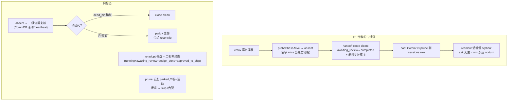
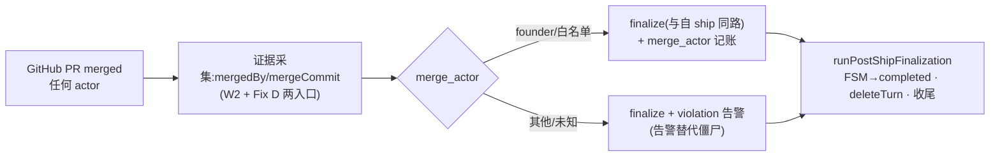

# FLY-1329 session 生命周期底座收口 — 探索

Issue: FLY-1329 (https://linear.app/geoforge3d/issue/FLY-1329/infra-session-生命周期底座收口-重启收尾路径不得杀-park-aliveexecutor-merge-必须)
日期: 2026-07-16
基于: 无

## 0. 一句话

Annie 确认的唯一设计是「implement 开 gate 后 park-alive 不退、QA 开 ship gate」;今晚(2026-07-16 夜)五个缺陷证明底座在三处系统性违反它:**活着的 park-alive session 被当尸体收尾**、**executor-merge 后 FSM 永远滞留 awaiting_review**、**approve gate 能在 QA 存在前浮出**。本单只修 session 生命周期底座,不碰 gate 卫生(FLY-1314)、归零合同(FLY-1328)、coordinator/land(FLY-1293)。

## 1. 事故实证链(全部一手证据,非推测)

> 证据源:StateStore `~/.flywheel/teamlead.db` 的 `session_events` 审计账本、CommDB `~/.flywheel/comm/flywheel/comm.db`、生产 Bridge 日志 `/tmp/flywheel-bridge.log`、prod head `3d862dea`(#604)源码。下文行号以 FLY-1329 分支(main 02db0327 同源)为准,prod head 行为已逐段比对确认一致。

### D1 — park-alive implement 被杀:真凶不是重启,是 handoff 的假死判定

issue 假设「04:57 重启收尾杀 park-alive」。审计账本推翻了时序——**杀在重启前 10 分钟,凶手是 phase 编排器自己**:

```
04:47:23  stage_changed        {"stage":"approve"}                       (532c634b 开 approve gate)
04:47:31  state_transition     running→awaiting_review  trigger=session_completed
04:47:31  state_transition     awaiting_review→completed trigger=fly638_close_runner_done
04:47:31  lead_close_runner_finalized {reason:"three-stage implement handoff", executorType:"phase"}
04:48:00  worktree_cleanup_done {branchDeleted:true}                     (共享分支 B 被删!)
04:48:01  QA 370c37e1 spawn
04:57:07  (Bridge 重启) terminal_at 回填
之后      boot「FLY-638 CommDB prune: scanned=2 pruned=2」→ CommDB sessions row 消失
          runner_declared_states 的 parked 行还在;resident 继续发 ask → 全部 orphan
```

击杀链逐环(prod head 源码确认):

1. `PhaseOrchestrator.handoff()`(phase-orchestrator.ts:1640 起):keep-alive **是 ON 的**(`FLYWHEEL_THREE_STAGE_KEEPALIVE` 默认 ON,生产未关)。走到了 keep-alive 分支:`probePhaseAlive(prev)` → `absent` → **close-clean**(「dead_pin / absent → the process is gone: close-clean」)。
2. `probePhaseAlive`(plugin.ts:7496)= 拿 CommDB `tmux_window` 名字去 `probeRunnerProcessLiveness`(tmux-lookup.ts:371)。**窗名解析不到 → `absent` → 被当成死亡证明**。而日志证明窗名早已漂移:capture-pane 连续报 `tmux window not found: runner-flywheel:FLY-1319-implement-codex-…`,attach cross-wire 显示同一注册窗顶着 FLY-1322/FLY-1323 的标题(FLY-923 证据行)。Codex resident 进程一直活着(close 后仍持续发 ask)。**「按名字找不到」≠「进程死了」**——这正是 memory 里 529-room 的老教训(窗改名 → 按 CommDB 名杀窗杀空气)。
3. close 链还顺手删了三段式共享分支 B(`worktree_cleanup_done branchDeleted:true`)——ship 前任何 handoff 都不该动共享分支。
4. 重启的贡献是**补刀而非首刀**:
   - **re-adopt 只认 `status='running'`**:`seedReconnecting`(HeartbeatService.ts:1437)与 `reconcileMonitorLossReadopt`(:904,经 StateStore `getOrphanSessions` 的 `WHERE status='running'`,StateStore.ts:4462)。park 中的 implement 状态是 `awaiting_review`(HANDOFF_STATUS.implement,phase-orchestrator.ts:507)→ **结构性不可见**。issue 说「只重收养了 QA 漏了 implement」,不是 role 过滤,是 status 过滤的伪装:QA 是 active phase(`running`)所以能收养。
   - StateStore 一旦(被错误地)terminal,boot 的 CommDB 清理(`reconcileCommDbRunningAgainstFsm`/`pruneDeadTerminalCommDbSessions`,同样用坏窗名验尸)删掉 sessions row → `flywheel-comm turn` 第一步 `db.getSession(execId)` 就 miss → **永远 no-turn**(turn.ts:37-41)。`runner_declared_states` 的 parked 行无人对账,成为孤儿。

> 附:532c634b 的 parked 声明是 04:56:37 才写入的(reason 是事后修复语境)。原始 park 语义在 handoff 时由 Bridge 侧 `parkPhaseRunner`(plugin.ts:7833)承担——本应走这条,被假 `absent` 劫走。

### D2 — executor-merge 不触发 finalize:看到了 merge,但故意不收口,且无后续路径

- 自 ship 收口的唯一门:`isPostApproveShipComplete`(post-ship-finalization.ts:68)硬性要求 `landing_status.status==="merged"` + ship-eligible;消费点有三(DirectEventSink:1003 / event-route:1584 / event-route:1938 W2)。executor-merge(founder 在 GitHub 直接 merge)时 Runner 不会再发 `stage set completed`,landing 信号缺失。
- **但 W2 与 Fix D 其实都看到了 merge**。生产日志铁证(FLY-1283):
  ```
  [event-route W2] FLY-869 merge_without_approval — 1c416918 merged head=185b02f1 NOT ship-eligible; parked (no finalize).
  ```
  外部 merge 收敛扫描器 `external-merge-reconcile.ts`(FLY-945 Fix D)也活着在跑(`16 candidates, checking 3 this pass`),其 `handleParked` 同样要过 ship-eligibility 门。
- 所以真实缺口是:**merged 已是 GitHub 上的既成事实,而 FSM 用「滞留 awaiting_review」来表达「这个 merge 没走批准」**。滞留 = 僵尸 = park-watch(park-watch.ts:223 起)差点为已 ship 的单 page Annie(HL 压 false_positive)。另有前提性漏洞:Fix D 候选过滤要求 `pr_number` 非空(external-merge-reconcile.ts:440/457)+ 30min TTL + 每 project 每 pass 3 个 gh 预算——eb4ac939(FLY-1252)/1476385e(FLY-1307)的 `pr_number` 均为空,连候选都进不了。
- 全库无 `merge_actor` 概念;`land-status.json` 的 `mergeCommitSha` 在 W2 明确 payload-only 丢弃(event-route.ts:2011)。

### D3 — close_runner(done=true) 够不着 session-gone 僵尸

`closeRunner`(close-runner.ts:218)第一步 `store.getSession(execId)` 失败即返回 `session_not_found`;`finalizeDone`(FLY-638)也耦合在成功的 session 查找 + tmux 语境上。没有「仅凭 FSM 行 + merge 证据收口」的纯 FSM-side 路径。已有先例可循:`stale-blocker-guard.finalizeStaleBlocker`(stale-blocker-guard.ts:199)对 merged/closed PR 做过无活 session 的 `applyTransition→completed`。FSM 边 `awaiting_review→completed`、`approved_to_ship→completed` 本来就合法(workflow-fsm.ts:146-174)——缺的从来只是触发器。

### D4 — auto-QA spawn race:hold 是「可蒸发的谓词」,不是硬序

- QA-first 的现有实现 = 四个 founder 面共用的 `reviewHoldReason`(auto-qa-held.ts:124-193;消费点 gate-poller.ts:861 / event-route.ts:2527 / DirectEventSink.ts:981 / HeartbeatService.ts:719)。三个放行窗口:
  1. session 非 `awaiting_review` → 直接不 hold(:139)——gate --no-block 与 complete 之间的窗口;
  2. **无 auto_qa_record 时**落到 FLY-1251 diff-snapshot 兜底,`ship_relevant===0`(docs-only)→ **fail-open 放行**(:185);snapshot 陈旧/误分类即漏;
  3. record 要等 `claimAutoQaRecord`(auto-qa-coordinator.ts:647)——在 codex-hold(:503-506)或多个 await 之后,与 GatePoller 扫 CommDB gate 的时钟完全独立。1319 的 04:47 开 gate / 04:48 QA spawn 正落在这个窗口。
- approve_to_ship gate row 是 **runner 写 CommDB**(gate.ts),Bridge 管不住它「开」,只能管住它「浮出 founder 面」。FLY-1314 的探索已论证过 gate-open-time 原子守卫不可行(CLI 读不到 StateStore QA 态),选了 Bridge 侧路线——QA-first 应同样落在 Bridge 侧 hold。

### D5 — complete 落库 vs turn 探针滞后:双库分歧 + turn 不看死活

- fbe23871(FLY-1252 qa):StateStore 05:34 completed;CommDB sessions row **至今仍 `running`**;`three_stage_turn` holder 至今仍是它(epoch 8)。后继 a5910ea6 拿不到 turn。
- 机制:`turnStatus`(turn.ts:36-53)只比对 holder_exec_id,**从不看 session 状态**;`reconcileOneTurn` 对 completed 的 qa holder 明确豁免(phase-orchestrator.ts:2007-2009,注释假设「post-ship finalization 马上会删 TURN」)——但**非 merge 的完成**(no_code / stranded-pass)永远走不到 post-ship-finalization.ts:396 的 `deleteTurn`。`session_completed` 只写 StateStore,CommDB sessions.status 无人更新(CommDB 的 status CHECK 集合也表达不了大部分终态,离场只能靠 DELETE)。

## 2. 设计原则(收口的「宪法」)

1. **杀活人的代价 ≫ 留尸体的代价**。任何破坏性生命周期动作(close/finalize/prune/deleteTurn)对「可能活着」必须 fail-closed:park / alert / 留给 reconcile,绝不 terminal。尸体自有 reconciler 收,晚收几分钟无害。
2. **「按名字找不到」不是死亡证明**。`absent`(窗名解析 miss)在 macOS + cmux 改名的生产现实下是常态噪声(FLY-923/1272/1282 三案在册),只配触发「换证据再查」,不配触发 close。
3. **FSM 必须收敛,合规用审计表达**。merged 是 GitHub 既成事实;违规 merge 用 `merge_actor` 记账 + 告警表达,不用「永久滞留 awaiting_review」表达(滞留只会让 watchdog 去骚扰 Annie)。
4. **一个 finalize 路径**。自 ship、executor-merge、手动收口全部汇入 `runPostShipFinalization`——不长第二套收尾逻辑。
5. **founder 面由 Bridge hold,不指望 runner 不开 gate**。QA-first 是 hold 谓词的 fail-closed 化,不是 CLI 禁令。

## 3. 方案选项与推荐

### D1 → 方案 A「park-biased handoff + 全角色 re-adopt + prune 防线」(推荐)

- **A1 handoff 判死改判活**:keep-alive ON 时 `handoff()` 对上一 phase 的分支改为——`alive`→park(不变);`indeterminate`→fail-closed 留 reconcile(不变);**`absent`→不再 close-finalize**:降级为「park + 发 lifecycle 告警 + 留给 reconcile 用更强证据复核」。只有 `dead_pin`(窗在、pane 全尸)保留 close-clean(那是真正的死亡证明)。
- **A2 二级活性证据**:probe 得到 `absent` 时,用与窗名无关的证据复核:CommDB 近期活动(messages/ask 时间戳、heartbeat_at 新鲜度)→ 有活动迹象改判 `indeterminate`。不追求完美进程级识别(那是 FLY-1272/1282 的题),只封「名字 miss 秒杀」这一刀。
- **A3 re-adopt 覆盖所有非终态**:`seedReconnecting`/`reconcileMonitorLossReadopt` 的候选从 `status='running'` 扩到 `running ∪ awaiting_review ∪ design_done ∪ approved_to_ship`(即 park-alive 全形态);重建监控;probe 失败 alert-only,绝不顺手 terminal。
- **A4 prune 防线**:CommDB 删除路径(fsm-reconcile / prune)在删除前检查 `runner_declared_states` 未过期 parked + 近期活动——命中则 skip + 状态矛盾告警(StateStore terminal 但声明 park 且在动 = 上游出过错,人看)。
- **A5 共享分支保护**:keep-alive ON 时,handoff 的任何 close 分支不得删 branch B / 共享 worktree;teardown 只属于 ship finalization(FLY-887 row g 本意)。
- 弃选 B「只修 re-adopt」:治标——re-adopt 再全,handoff 假死照样先杀一刀。弃选 C「进程级 exec-id 探活大改」:正确但重,是 FLY-1272/1282 的根治题,本单用 A2 的便宜证据层达到「不误杀」即可。

### D2 → 方案 B「Fix D 升级为权威 executor-merge finalizer + merge_actor 记账」(推荐)

- 候选面:去掉 `pr_number` 硬前提(缺失时按 branch 推导 `gh pr list --head`,或从 review binding 读),TTL/预算保留(它们只是节流,不是正确性)。
- 证据:`gh pr view --json mergedAt,mergeCommit,mergedBy` → **`merge_actor`** 与 mergeCommitSha 一起写入 `session_params`(沿用 fly208 evidence-marker 模式,不加列)+ 审计事件 `external_merge_finalized`。
- 语义修正(核心刀):merged 证据成立时 **一律 finalize**(与自 ship 同路 `runPostShipFinalization`),ship-eligibility 不再阻止收敛——
  - `merge_actor` ∈ founder/白名单 → 正常收口,merge_without_approval 降级为记账;
  - 其他/未知 actor → 照样收口,但发 violation 告警(FLY-869 的保护精神保留:**告警替代僵尸**)。
- W2 的 `merge_without_approval — parked (no finalize)` 分支同步改走该路径。
- 弃选「新建独立 reconciler」:Fix D 已有 dedupe(`external-merge-finalized-${execId}`)、预算、patrol 接线,重造只会双写。

### D3 → 方案 C「session-independent finalize 最小路径」(推荐)

- `closeRunner` 增加(或并列新命令)`--fsm-only` 形态:仅要求 StateStore 行 + 终局证据(PR merged / issue Done / Lead 明示),跑 `applyTransition→completed` + `runPostShipFinalization`(tmux/CommDB/worktree 全部容忍缺失、best-effort)。作为 Lead 手动兜底面;自动面由 D2 的 reconciler 覆盖 merged 僵尸。
- research 阶段需钉死一个事实:FLY-1283 形态(StateStore 行在、session 没了)下 `close_runner` 报 "No session found" 的精确抛出点(close-runner.ts:222 的 store.getSession 理应命中——怀疑实际报错来自 tmux/CommDB 目标解析层或 project 参数不匹配,须复现确认后再定刀口)。

### D4 → 方案 E「hold 谓词 fail-closed + GatePoller 收紧」(推荐,agent 共识 + FLY-1314 路线一致)

- `reviewHoldReason` 无 record 分支改为以 **不可变 `qa_required` 快照**为键:`qa_required IS NULL`(coordinator 还没决策)→ hold;`=1` 且无同 head passed record → hold;`=0` → 放行。docs-only 放行只能来自 coordinator 的显式决策,不再来自 diff-snapshot 兜底。
- GatePoller approve_to_ship 分支:session 仍 `running` 或 `qa_required IS NULL` → 不 relay(封 :139 的窗口)。
- 三段式下 gate 由谁开不动(runner 行为 + FLY-1314 的 gate 卫生管);本单保证的是「QA 存在且非 FAIL 前,founder 永远看不到 approve gate」= 验收里的「或开了立即被 hold」分支。

### D5 → 方案 F「complete 双写 CommDB + turn 看终态」(推荐,最小两刀)

- `flywheel-comm complete` 成功后同时 `markSessionTerminalStatus` 更新 CommDB sessions row(status/ended_at)——CLI 本来就持 CommDB 句柄,单一事实即时可见。
- `turnStatus` 增加:holder 的 session row 已终态 → 返回 no-turn(holder 已收工)。
- `reconcileOneTurn` 的 completed-qa 豁免放宽(completed holder 无 finalization claim → 删 TURN),**与 FLY-1314 PR-2 的 `deleteTurnIfCurrent` CAS 原语协调**:若 PR-2 先合入则复用,不重造。

## 4. 击杀链与目标态(图)





## 5. 边界与协调

- **FLY-1314(PR #627,在途)**:gate supersede/绑定/CI 守卫 + merge-gated TURN 回收。文件重叠:gate-poller.ts、db.ts、phase-orchestrator.ts、HeartbeatService.ts。本单 **不做** gate 去重/supersede;D4 改的 auto-qa-held.ts 不在其变更集;D5 的 TURN 放宽与其 PR-2 明确协调(后合者 rebase,原语复用)。plan 里作为显式排序项。
- **FLY-1328**(归零合同 ask/pending 格)、**FLY-1293**(coordinator/land 收口):不碰。
- **部署卫生旁注**:事故时生产 Bridge 跑在 `3d862dea`(落后 main 99 commits,boot 日志自报 STALE CHECKOUT)。本设计以 main 为基线;prod head 与 main 在本单相关路径上行为一致(已逐段比对),不影响结论,但 ship 时须按惯例 pull+restart。
- 进程级 liveness 根治(exec-id → pane 反查)、cmux 命名收敛:FLY-1272/1282 方向,本单只做 A2 的证据层。

## 6. 验收对照(issue → 方案)

| issue 验收 | 承接方案 |
|---|---|
| 重启不得把活 park-alive 转 completed / 丢 CommDB row;re-adopt 覆盖所有 role | A1+A2(不误杀)、A3(全角色=全非终态 re-adopt)、A4(prune 防线) |
| executor-merge → FSM finalize(与自 ship 同路),merge_actor 记账 | B(Fix D 升级 + W2 同改 + session_params 记账) |
| FSM-side finalize 工具(session-gone 僵尸可收口) | C(--fsm-only 手动面)+ B(自动面) |
| QA-first 硬序 | E(hold fail-closed + GatePoller 收紧) |
| 回归:重演 1319/1283 形态 | 集成测试:①park-alive implement + 窗名漂移 + handoff → 必须 park 不得 close;②awaiting_review + PR merged(无 landing 信号)→ 必须 finalize + merge_actor;fixture 按生产形态,负向断言配突变验证 |
| complete vs turn 滞后(低优) | F(双写 + turn 看终态) |

## 7. 开放问题(research 阶段解决)

1. D3 "No session found" 的精确抛出点(§3-C 的存疑)——复现 FLY-1283 形态定刀口。
2. main(02db0327)相对 prod head 在 probe/handoff/prune 路径是否已有行为差异(99 commits 逐一排除,预期无)。
3. A2 的「近期活动」阈值与数据源定稿(messages 时间戳 vs heartbeat_at,多久算活)。
4. E 的 `qa_required IS NULL` fail-closed 对 **非三段式老路径**(role=main)的回归面——docs-only 项目不能被永久 hold(coordinator 必须保证对每个 awaiting_review 都落一次 qa_required 决策,含 required=0)。
5. FLY-1314 PR #627 的合入时点 → plan 的 PR 排序与 rebase 策略。
