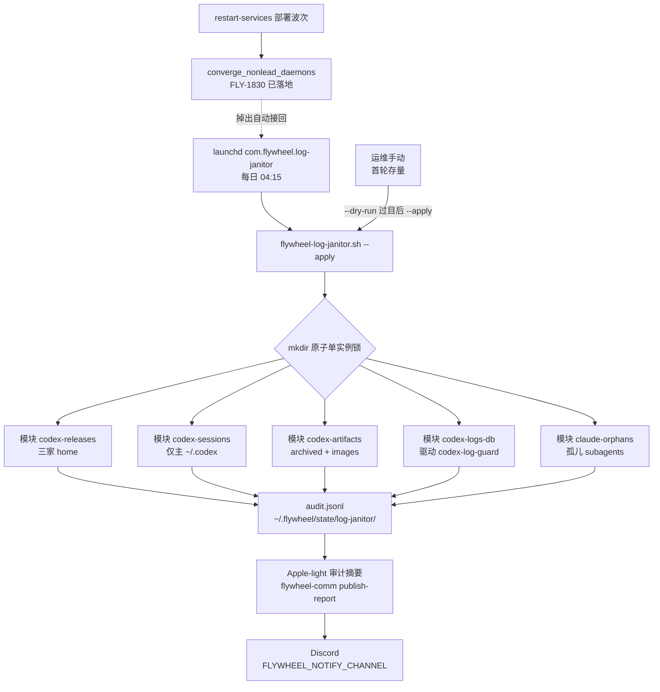

# FLY-1330 定期日志 janitor — 实施计划
Issue: FLY-1330 (https://linear.app/geoforge3d/issue/FLY-1330/infra-定期日志-janitor-codexclaude-历史会话滚动清理实测已积-22gb)
日期: 2026-08-18
基于: 无

## 0. TL;DR

新增 `scripts/flywheel-log-janitor.sh`(纯 bash)+ `com.flywheel.log-janitor` launchd 每日定时,按 age 滚动清理 Codex/Claude 历史会话与产物。四个要点:

1. **主战场是 Codex 侧**,且最大单项不是 issue 原文写的 sessions,而是 8 月以来新积攒的 **Codex standalone 多版本二进制**(`packages/standalone/releases`,mufasa+infra-bot 共 ~9.7G,17+20 个历史版本)——只删**严格老于 `current`** 的旧版本(留一个回滚垫;新于 current 的与 24h 内新写的一律不碰,防与自升级下载并发),零 resume 风险。
2. **Codex Lead home(`~/.codex-mufasa`、`~/.codex-infra-bot`)的 sessions 一律不清**:mufasa 记忆 thread `019eaf5d` 的 rollout mtime 已 4 天未动(实测 Aug 14),age 判定会误伤;而这两家 sessions 合计 <220M,收益极小、风险极高。只清主 `~/.codex` 的 sessions(3.3G >30d)。
3. **Claude 转录不自己删**:实测证明 Claude Code 内置 `cleanupPeriodDays`(默认 30 天)已在工作(`~/.claude/projects` >30d 只剩 13 个 subagents 漏网文件)。janitor 只做两件事:把该配置显式固化进 `settings.json`,以及清理内置清理的系统性盲区(parent 转录已删、subagents 目录残留的孤儿文件)。
4. **logs_2.sqlite 不重造,接上已有工具**:`scripts/codex-log-guard.sh`(FLY-697)已交付 TRACE-drop trigger + VACUUM + monitor,但实测**从未装上**(三家 DB trigger 为空、monitor log 不存在、无 launchd)。janitor 每日 tick 驱动它的 monitor,并在 DB 空闲时 fail-closed 地 remediate——把「交付了没装上」补上,而不是再造一个。

安装完整性:plist 装进 `~/Library/LaunchAgents/com.flywheel.log-janitor.plist` 后,**FLY-1830 已落地的 `converge_nonlead_daemons`**(restart-services 部署波次末尾,roster = 全部 non-Lead `com.flywheel.*.plist`)会在每次部署自动把掉出的 job 接回来——无需新建任何 reconcile 机制,这就是捞回评论要求的「安装完整性通道」在当前 main 上的实际形态。

预期首轮回收 ~12-13G(releases ~8-9G + 主 codex sessions/archived/images ~4.2G),之后每日滚动维持稳态。

## 1. 现状实测(2026-08-18,du/find 实测,非 issue 原文的 7-16 数字)

| 位置 | 大小 | 构成 / age 分布 | 可清性 |
|---|---|---|---|
| `~/.codex` | 7.2G | sessions 3.6G(5635 文件,>30d 5084 个=3.3G)· `_cleanup-20260818-172132/` 1.5G(FLY-1887 回滚归档,**明令保留**)· archived_sessions 500M(>30d 0.37G)· generated_images 441M(>30d 0.46G)· plugins 341M · profiles 227M(多账号,不碰)· log/ 125M(xiaohongshu-mcp.log 108M 活文件) | sessions/archived/images 按 age 清 |
| `~/.codex-mufasa` | 5.1G | **packages/standalone/releases 4.4G(17 个版本,current=0.148.0)** · logs_2.sqlite 422M(被 pid 7856 常驻持有)· sessions 87M · archived 41M | 只清 releases;sessions 不碰 |
| `~/.codex-infra-bot` | 6.0G | **packages/standalone/releases 5.3G(20 个版本)** · logs_2.sqlite 384M(被 pid 7821 持有;表内仅 1321 行=典型死页)· sessions 125M | 只清 releases;sessions 不碰 |
| `~/.claude/projects` | 7.0G(jsonl 计 7.4G) | 2186 个 jsonl;>14d 2.7G;**>30d 仅 13 个文件**(全在 `*/subagents/` 下=内置清理盲区)。单文件 top:eng-lead 活跃会话 1.5GB、product-lead 569M——活跃 Lead 长寿会话是 Claude 侧体积主体,任何 age 清理都碰不到(也不该碰) | 内置清理已工作;只补孤儿 subagents |
| `~/.claude/channels` | 379M | per-Lead Discord 目录:`inbox/`、`chat-receipt-spool/`、`access.json`——**活 mailbox 数据结构**,>30d 的 659 个 inbox 文件是否已消费要查 mailbox 账,不归本单 | **不碰**(honest boundary) |
| `~/.flywheel/codex-homes` | **29G** | 443 个 per-runner CODEX_HOME(FLY-123 起 runner codex 会话落在各自 home),其中 125 个 >30d;现有清理只有 adapter 内退休时的 rmSync,崩溃即成孤儿——**全机真正的最大积攒源**(交叉评审 R1 实测补充) | **本单不碰**(issue 硬边界:不碰 `~/.flywheel`);见 §2 非目标与 §14 follow-up |

关键行为事实(本机实测):
- **Codex rollout 按创建日入目录**(`sessions/YYYY/MM/DD/rollout-<ts>-<threadId>.jsonl`),活 thread 躺在老日期目录里(mufasa `019eaf5d` 在 `2026/06/09/`)——**判定必须用文件 mtime,绝不能用路径日期**。
- **codex 常驻进程持有当前 rollout 的 fd**(lsof 实测 fd 35u)→ lsof 防线对 Codex 侧**有效**。
- **claude 进程不持转录 fd**(对本会话转录 lsof 零命中,写入是 open-append-close)→ lsof 防线对 Claude 转录**无效**——这是「Claude 转录交给内置清理、janitor 不自己删」的第二个理由。
- codex-log-guard 部署状态:mufasa/infra-bot 的 logs_2.sqlite 均无 trigger;`~/Library/Logs/flywheel/codex-log-guard.log` 不存在;launchd 无接入。
- 主 `~/.codex/logs_2.sqlite` 已在 8-18 抢修时整体搬入 `_cleanup-20260818-172132/`,codex 会重建;上游写放大 bug 修复已含在本机 0.148.0(FLY-1887 注明)。

## 2. 目标与非目标

**目标**
- G1 每日定时按 age/版本滚动清理,稳态下**本单范围内的目录**不再单调积攒(全机收敛还差 `~/.flywheel/codex-homes` 一块,见非目标与 §14 follow-up——不假装本单管全机)。
- G2 首轮存量清理 ~12-13G(dry-run 报告 → 人工过目 → apply,同一脚本)。
- G3 硬安全边界:活跃/park-alive 会话的转录一律不碰;dry-run 先行;每次清理写审计。
- G4 保留期可配(env 覆盖,header 列表)。
- G5 janitor 自身不成为新的「交付了没装上」:plist 落在 FLY-1830 converge 的 roster 内;每 tick 写审计 heartbeat 供未来 census(FLY-1814)读取。

**非目标(honest boundary)**
- 不碰 `~/.flywheel` 任何数据(runner-state/comm/state 是活数据;`~/.flywheel/logs/*` 的轮转归 FLY-1887 P1)。审计日志写入 `~/.flywheel/state/log-janitor/` 是新增自有状态,不属于"清理 ~/.flywheel"。
- **`~/.flywheel/codex-homes`(实测 29G,443 个 per-runner CODEX_HOME,125 个 >30d)不在本单**:它在 issue 硬边界之内(~/.flywheel),且孤儿回收需要 runner 生命周期终态语义(FLY-1759 worktree teardown 一族),超出"按 age 清转录"的授权——按「授权内做不到→上报别自扩权」处理:实测数字上报 Tadashi,建 follow-up 单(§14)。它是全机真正的最大积攒源,不点名就等于骗 G1。
- 不清 `~/.claude/channels`(活 mailbox 结构;>30d 的 0.34G 残留需 mailbox 账本判定,如要做归 mailbox 族 follow-up)。
- 不清 Codex Lead home 的 sessions/archived_sessions(<220M 收益 vs 记忆 thread 误删风险)。
- 不解决活跃 Lead 长寿会话转录膨胀(eng-lead 单文件 1.5GB)——那由 Lead /clear 换代节律决定,属会话生命周期问题,与 FLY-1716 一族相关,本单只在文档里点名。
- 不做写入侧限流/降频(cmux-sync 写盘审计归 FLY-1887 P1)。
- 不做全机 launchd census/reconcile(FLY-1814 正在独立 design;本单只消费 FLY-1830 已有的 converge)。
- 不碰 `~/.codex/_cleanup-20260818-*` 与 `~/LaunchAgents-backup-*`(FLY-1887 明令保留的回滚路径,其善后删除归 FLY-1887)。
- 不碰 profiles/、auth.json、config.toml*、memories/state/queue/goals sqlite(活状态)。
- `~/.codex/log/xiaohongshu-mcp.log`(108M,活 fd)v1 不轮转:活进程日志轮转的安全形态(copytruncate 且要求 O_APPEND)与本单删除型清理是两类机制,并且它属于「flywheel 自装服务的日志轮转」,与 FLY-1887 P1 同族,交那边统一做,避免两单各造半个轮转器。

## 3. 设计总览

- 语言:纯 bash(`set -uo pipefail`),依赖 jq / sqlite3 / lsof(均为本机既有/系统自带)+ `mkdir` 原子锁(零依赖;**macOS 无 `flock` 命令**,见 §5)。
- 形态:单脚本 + 模块函数,每个模块独立 enable 开关与保留参数;`--dry-run`(只报告)/`--apply`(真删);`--module <name>` 可单跑。
- 定时:`StartCalendarInterval` 每日 04:15(错开 updater 00:00/12:00 与 skills-update);`RunAtLoad false`(部署风暴时不凑热闹;睡眠错过的 tick 在唤醒时合并补跑、关机才顺延,清理任务天然幂等)。

## 4. 清理模块规格

### 4.1 `codex_releases` — standalone 旧版本(最大收益)

- 范围:`$HOME/.codex`、`$HOME/.codex-mufasa`、`$HOME/.codex-infra-bot` 三家的 `packages/standalone/releases/*`(主 `~/.codex` 当前无此目录,存在才处理)。
- 保留/删除规则(交叉评审 R1 F3 收紧,防与 codex 自升级下载并发):
  - 只有**版本号严格老于 `current` 目标版本**的目录才是候选;**新于 current 的一律不碰**(可能是升级器正在落的新版本)。
  - 候选中保留最新的一个(回滚垫),其余删除;即最终保留 = current + 老于 current 中的次新。
  - **mtime < 24h 的目录一律不碰**(下载/解压进行中)。
  - `install.lock` 等非版本目录文件一律不碰。
- 安全:
  - `current` 不存在或 realpath 解析失败 → **整个 home 跳过**并审计 `skip: current-unresolvable`(fail-closed)。
  - 删除前逐目录断言:realpath 以 `<home>/packages/standalone/releases/` 开头,且 ≠ current 目标(双重校验)。
  - 删除前对候选树执行 `lsof -F n +D`;存在任一活 fd、`lsof` 缺失或探测结果不可判 → 整棵 release 跳过。避免 `current` 已换代但旧 Lead 仍从旧 tree 启 helper 时被抽走二进制。
  - 版本排序用 `sort -V`;无法解析版本名的目录跳过并审计。
- 预期回收:~8-9G。

### 4.2 `codex_sessions` — 仅主 `~/.codex` 的历史 rollout

- 范围:`$HOME/.codex/sessions/**/*.jsonl`(Lead home **不在范围内**,硬编码排除)。
- 三防线,全部满足才删:
  1. **age**:文件 mtime > `RETENTION_CODEX_SESSIONS`(默认 30 天)。
  2. **lsof**(主承重防线):`command -v lsof` 前置检查,缺失 → **整个模块本 tick 跳过**(fail-closed)。候选文件经 `xargs`(天然按 ARG_MAX 分批)喂 `lsof -F n --`,按 `-F n` 输出解析持有集合;**退出码只用来鉴别执行是否正常**(交叉评审 R2 R-2 收口):仅退出码 ∈ {0,1,123}(lsof/xargs 的「有/无匹配」正常语义)时才信任输出,126/127/被信号杀等其他退出 → **整个模块本 tick 跳过**——park-alive 且超期未写的 fd-held rollout **只有这一道防线挡得住**(mtime/re-stat 都拦不住),这里绝不能把「跑挂了」误读成「无人持有」。被持有的剔除。lsof 对 Codex 有效性已实测(常驻进程持 rollout fd)。
  3. **账本核对(保护性冗余,非承重柱)**:从文件名提取 threadId(`rollout-<ts>-<threadId>.jsonl` 尾段 uuid),对照 `~/.flywheel/state/codex-sessions/*/session.json` 的 `threadId`;命中者以 executionId 查 `~/.flywheel/teamlead.db` sessions 表 `status`(只读;终态判定用 `ZOMBIE_IRREVERSIBLE_TERMINAL_STATUSES` 语义:completed/failed/terminated/blocked/rejected/deferred/shelved)。execution 非终态、**session.json 存在但 db 无对应行**、或查询失败 → 该 threadId 保护;teamlead.db 无法打开 → **整个模块本 tick 跳过**(fail-closed)。**诚实定位**(交叉评审 R1 F5 实测):FLY-123 起 runner codex 会话落在 per-runner CODEX_HOME,416 个 ledger threadId 仅 1 个命中主 home——主 home 的 rollout 基本是人工/rescue 会话,承重的是防线 1+2;防线 3 以一条查询的成本防未来路由变化,只挡删不放行,保留。
- **TOCTOU 收口**:每个文件 `rm` 前 re-stat 一次 mtime,仍超保留期才删(防扫描中途 codex resume 老 thread;交叉评审 R1 F6)。
- 不清空目录:空目录可能刚由活 session 建出;仅删除已审计的精确文件候选,避免 apply-only 的级联目录 mutation。
- 预期回收:~3.3G。

### 4.3 `codex_artifacts` — archived_sessions + generated_images

- 范围:三家 home 的 `archived_sessions/`(注意:**仅主 `~/.codex` 的**;Lead home 的 archived_sessions 与 sessions 同理不碰)与三家的 `generated_images/`(纯产物、无 resume 语义,三家都清)。
- 规则:mtime > `RETENTION_CODEX_ARTIFACTS`(默认 30 天)+ lsof 防线(同 4.2 防线 2)。
- 预期回收:~0.9G。

### 4.4 `codex_logs_db` — 驱动 codex-log-guard(不重造)

- 每个 **apply tick** 对三家 `logs_2.sqlite` 各跑一次 `CODEX_LOG_DB=<db> codex-log-guard.sh monitor`(size log + 超 256M 阈值 meta-alert);dry-run 只走无写的 `status`,不产生日志或告警副作用。
- 每 tick 尝试 `remediate`(install-trigger + VACUUM):codex-log-guard 自带 fail-closed(lsof 证明 DB 空闲才动,否则拒绝)——常驻 Lead 的 DB 平时永远 busy,审计记 skip;主 `~/.codex` 无常驻进程,重建出的新 DB 会在空闲窗口被装上 trigger,从源头掐掉 TRACE 写放大。**skip 原因不能取自 remediate 退出码**(busy/missing/no-table 均 exit 1 不可区分;交叉评审 R1 F14)——janitor 先跑只读 `status` 解析输出,把具体原因写进审计。
- Lead home 的 VACUUM 机会 = Lead 停机窗口(重启波次/手动),janitor 提供 `--module codex_logs_db` 子命令供运维在窗口内手动跑;**不**为此改 restart-services(避免与重启族改动纠缠,列为可选 follow-up)。
- 阈值告警走 codex-log-guard 既有 meta-alert 通道,janitor 不再造告警。

### 4.5 `claude_orphans` — Claude 侧收敛

两个动作,都不碰活转录:

1. **固化内置清理**:`~/.claude/settings.json` 显式写 `"cleanupPeriodDays": 30`(与当前默认一致,行为零变化;把隐式依赖变成显式配置,防上游改默认)。**此步放在 `install-log-janitor.sh` 一次性执行,不进每日 tick**(交叉评审 R1 F10:这是唯一白名单根之外的写,且与 Claude Code 自身写 settings.json 存在 lost-update 竞态——挪到人工在场的安装窗口,把竞态窗口压到一次)。写法:已有该键则不动;jq read-modify-write + tmp + mv,写后回读校验,失败只警告不阻断安装。保留期若未来要收紧(14d 可多回收 ~2.7G),是一行配置的 founder 决策,本单不替她决定。
2. **孤儿 subagents 清理**:`~/.claude/projects/*/<session-uuid>/subagents/*.jsonl` 中,同级 `<session-uuid>.jsonl` 主转录**已不存在**(= 内置清理已判定该会话超期收走)且自身 mtime > `RETENTION_CLAUDE_ORPHANS`(默认 30 天)的 → 删除;目录本身保留。当前仅 13 个文件 ~7M,价值在堵住持续性漏斗而非首轮体量。

## 5. 安全硬规则(全局,凌驾于所有模块)

- **路径白名单**:所有删除必须发生在四个根内:三家 codex home + `~/.claude/projects`。每次 `rm` 前断言目标 realpath 前缀命中白名单根(symlink 逃逸防护);目录只删空目录。
- **排除清单**(白名单内的二次拦截):`_cleanup-*`、`profiles/`、`auth.json`、`config.toml*`、`*.sqlite*`(除经 codex-log-guard 的路径)、`packages/standalone/current`、`bin/`、`plugins/`、`cache/`。
- **fail-closed 总则**:任何探测(lsof/sqlite/realpath/jq)失败,处置只能是 skip + 审计,绝不降级为删除;审计编码/追加失败直接终止,每次 destructive mutation 前先写 `delete-intent`;单文件删除失败记审计继续(不中断其余)。
- **单实例**:**不用 `flock`——生产 Mac 上没有这个命令**(交叉评审 R1 BLOCKING 实测;`flock` 只在 ubuntu CI 上有,cmux-sync 也只在 `command -v` 探测后才用;仓库正规先例是 `scripts/flywheel-config-lock.sh` 的 python3-fcntl)。janitor 选 **`mkdir` 原子锁**(零依赖、bash 可移植):`mkdir "$STATE_DIR/lock.d"` 成功即持锁,锁内写 `pid` 文件;拿不到时读 pid 做 stale 检测(`kill -0` 持锁进程已死 → 清锁重试一次,仍失败才退出);**锁目录在而 pid 文件缺失/不可读 → 视为持锁中直接退出,不清锁**(fail-closed);退出记审计 `skip: lock-held`。
- **dry-run 先行的运行时门**(交叉评审 R2 R-3 + code review R1/R3):只有无 `--module` 的完整 `--dry-run` 成功写完 summary 后才原子落 schema-v2 `full-dry-run-ok` receipt;receipt 绑定 janitor 脚本 SHA-256、Codex homes、三项 retention、release keep、disabled modules、Claude root、账本路径与报告 channel/project/env/CLI/timeout。`--apply` 要求配置精确匹配该独立 receipt,不再 grep 可轮转的 audit;模块试跑、换参数试跑或脚本升级后沿用旧 receipt 都不能放行。`--force` 保留逃生口。与 §6 的安装门合起来,「先试跑」在**首删**与**装定时**两端都是机器约束。
- **dry-run 语义**:`--dry-run` 走完全部判定逻辑,审计记 `would-delete`,除 audit + full-scope receipt 外不写目标状态;尤其不调用会写日志/发 alert 的 codex-log-guard `monitor`,settings.json 固化也跳过。首轮存量必须先 dry-run(见 §9 安装顺序保证)。
- **报告必须留痕并投递,但不能反向卡住清理**:每次无 `--module` 的完整 `--apply` 完成后,先把本轮审计 manifest 原子写成独立的 `$STATE_DIR/pending-reports/<run-id>.html`,再按 oldest-first 投递。投递失败/超时则命令非零且 HTML 留队,但下一 tick 仍先执行本轮清理、生成本轮报告,再继续 drain 队列——Bridge/Discord outage 不会让磁盘治理永久停摆。每 tick 最多投递 7 份,避免在锁内无界追债。

## 6. 调度与安装完整性(FLY-1814 教训的落实)

- plist:`scripts/com.flywheel.log-janitor.plist`(repo 内模板),`ProgramArguments = bash <production-repo>/scripts/flywheel-log-janitor.sh --apply`,`StartCalendarInterval 04:15`,`StandardOutPath/StandardErrorPath → ~/Library/Logs/flywheel/log-janitor.{out,err}.log`。PATH 显式包含 `~/.npm-global/bin` 与 `~/.local/bin`,让 `publish-report` 的 ProofShot 依赖在 launchd 环境可发现。睡眠语义(交叉评审 R1 F12 校准):机器 04:15 在睡,错过的 tick 会在**唤醒时合并补跑一次**;只有关机才顺延到下次日程——两种情形都无损(任务幂等)。
- 安装:`scripts/install-log-janitor.sh` 幂等;目标 repo 固定为显式 `FLYWHEEL_REPO` 或默认 `~/Dev/flywheel`,且安装前校验 production janitor 可执行、production `flywheel-comm/dist/index.js` 已构建,避免把 issue worktree 路径固化进 launchd。安装器以**`cp` 真文件**落到 `~/Library/LaunchAgents/`——converge 明确拒绝 symlink plist(`converge-nonlead-daemons.sh:227`),装成 symlink 会掉出自愈罩——再 `launchctl bootout`(容错)→ `bootstrap` → `launchctl print` 回读确认 loaded;同时执行 §4.5 的 settings.json 一次性固化。
- **dry-run 先行的结构门**(交叉评审 R1 F11 + code review R3):只有无 `--module`、无 `--force` 的完整 `--apply` 清理完成且报告队列 drain 成功后才在 STATE_DIR 写 `first-apply-ok` marker;forced/module-only apply 不能解锁安装。install 脚本检测 marker 不存在则**拒绝安装**(提示先跑 dry-run→apply;安装器自身 `--force` 是单独的逃生口)——把「先试跑过目再装定时」从人工纪律变成机器约束。
- **掉出自愈**:label 是 non-Lead 的 `com.flywheel.*` → 自动落入 FLY-1830 `converge_nonlead_daemons`(`scripts/lib/converge-nonlead-daemons.sh`,挂在 `restart-services.sh:2716` 部署波次末尾)的 roster,每次部署自动接回。**不新建任何 reconcile 机制**;测试里加一条结构断言(见 §10)钉住这个依赖。
- 与 FLY-1814 的接口:该单正在独立 design 全机 census(发现「掉出」的巡检侧)。janitor 每 tick 的审计 summary 行自带 UTC 时间戳,即天然 heartbeat,census 未来可直接消费;本单不为它新增任何机制。

## 7. 审计与可观测

- 审计文件:`~/.flywheel/state/log-janitor/audit.jsonl`,append-only,`jq -nc --arg` 构造;`jq` 缺失、编码失败或 append 失败均 fail-close。apply 在 `rm`/VACUUM 前先落 write-ahead `delete-intent`,即使后续进程异常也留下目标与原因。
- 行 schema:`{ts, run_id, mode: dry-run|apply, module, action: delete-intent|delete|would-delete|skip, path, bytes, reason}`;每 tick 末尾一条 `{action:"summary", freed_bytes, deleted_count, deleted_file_count, candidate_bytes, candidate_count, skipped_count, per_module:{...}}`。`deleted_count` 是删除/DB 处置动作数,`deleted_file_count` 只统计真实文件(旧 release tree 按树内 regular file 计数,DB remediation 不伪装成文件);dry-run 的 deleted/freed 固定为 0,候选体积单列。
- 审计自身滚动:超 10MB 时 `mv audit.jsonl audit.jsonl.1`(单代;先例 `setup-quota-monitor.sh:294` 含 symlink/regular-file 前置检查)——janitor 不能自己变成新积攒源。
- **Founder 清理报告(2026-08-19 增量要求)**:每次完整 apply 从本轮 summary 生成 Apple-style light HTML,通过既有 `flywheel-comm publish-report` 投递到共享 `FLYWHEEL_NOTIFY_CHANNEL`。报告明确列出:清理文件数、释放 bytes/GiB、最老/最新删除项 mtime、防线拦下数,以及每模块 delete/skip/freed bytes;无文件型删除时最老/最新明确写“无文件型删除”,不会渲染 Unix epoch。`FLYWHEEL_JANITOR_REPORT_CHANNEL` 显式覆盖共享 channel,显式空值可在测试/应急中禁用。
- 每轮报告先原子入 `$STATE_DIR/pending-reports/<run-id>.html`;成功后审计 `report-delivered` 并删除对应文件。投递失败审计 `report-delivery-failed-rc-*`,超时单列 `report-delivery-timeout`,当轮命令非零且不写首次 apply marker,但后续清理不因旧欠账被阻塞。队列 oldest-first、每 tick 最多 drain 7 份;单次 `publish-report` 默认 120 秒超时,TERM 后 5 秒 KILL。Bridge URL/token 从进程 env 优先,否则仅在隔离 subshell 读取 `~/.flywheel/.env`;网络子进程经 `env -i` 只接收 HOME/PATH/TMPDIR/LANG 与 Bridge/report 所需白名单变量,optional 变量仅在非空时传递(否则保留 `publish-report` 的 `~/.flywheel/reports` canonical 默认),不把整份 `.env`、token argv 或审计。
- 这份报告是“发生了清理、清了什么”的完成通知,不是异常告警替代品;logs_2 超阈值仍由 codex-log-guard meta-alert 覆盖,FLY-1814 census 仍负责掉出巡检。

## 8. 配置参数(env 覆盖,header 列表;默认用 `${VAR:-default}`,channel 为允许显式空值禁用而用 `${VAR-default}`)

| env | 默认 | 说明 |
|---|---|---|
| `FLYWHEEL_JANITOR_RETENTION_CODEX_SESSIONS_DAYS` | 30 | 主 codex rollout 保留期 |
| `FLYWHEEL_JANITOR_RETENTION_CODEX_ARTIFACTS_DAYS` | 30 | archived_sessions / generated_images |
| `FLYWHEEL_JANITOR_RETENTION_CLAUDE_ORPHANS_DAYS` | 30 | 孤儿 subagents |
| `FLYWHEEL_JANITOR_KEEP_RELEASES` | 2 | 保留 = current + 老于 current 中最新的 N-1 个;新于 current 的不计入也不碰 |
| `FLYWHEEL_JANITOR_CODEX_HOMES` | `~/.codex:~/.codex-mufasa:~/.codex-infra-bot` | 冒号分隔;测试注入用。**第一项 = main home**(§4.2 sessions 与 §4.3 archived_sessions 只作用于它;交叉评审 R1 F7 显式化) |
| `FLYWHEEL_JANITOR_STATE_DIR` | `~/.flywheel/state/log-janitor` | 锁 + 审计 |
| `FLYWHEEL_JANITOR_TEAMLEAD_DB` | `~/.flywheel/teamlead.db` | 防线 3 只读查询 |
| `FLYWHEEL_JANITOR_DISABLE_MODULES` | 空 | 逗号分隔模块名,应急关闭 |
| `FLYWHEEL_JANITOR_REPORT_CHANNEL` | 未设置时读取 `FLYWHEEL_NOTIFY_CHANNEL` | 完整 apply 后的 Discord 报告 channel;显式空值禁用 |
| `FLYWHEEL_JANITOR_REPORT_PROJECT` | `flywheel` | `publish-report --project` |
| `FLYWHEEL_JANITOR_ENV_FILE` | `~/.flywheel/.env` | 仅投递子进程读取的 Bridge URL/token 配置 |
| `FLYWHEEL_JANITOR_COMM_CLI` | `<repo>/packages/flywheel-comm/dist/index.js` | `publish-report` 入口;必须为绝对、普通非 symlink 文件 |
| `FLYWHEEL_JANITOR_PUBLISH_TIMEOUT_SECONDS` | 120 | 单份报告投递硬超时;必须 ≥1 |
| `FLYWHEEL_REPO` | `~/Dev/flywheel` | 安装器写进 plist 的生产 repo;必须为绝对、非 symlink 目录 |

保留期语义:issue 建议 14-30 天,全部默认取保守上限 30;调参是配置行为,不需要改代码。

## 9. 首轮存量清理流程(无一次性专用代码)

1. 实现合入、生产 `git pull` 后:运维(Tadashi 或指派 runner)跑 `flywheel-log-janitor.sh --dry-run`,拿到 would-delete 全清单 + 预计回收字节数(审计文件即报告)。
2. 摘要贴给 Tadashi 过目(参照仓库「破坏性动作先 journal/过目」惯例);确认后跑 `--apply`。
3. `--apply` 删除完成后自动把本轮审计摘要入 durable queue 并投递到 founder Discord channel;只有报告队列 drain 成功才算本次完整 apply 成功。失败时报告留队且命令非零,但修复投递链前的后续每日 tick 仍继续清理并追加独立报告;恢复后每 tick oldest-first 补投最多 7 份。
4. `--apply` 成功、审计确认后,才跑 `install-log-janitor.sh` 装定时——**安装顺序本身保证「dry-run 先行」硬边界**。
5. 首轮预期:releases ~8-9G + sessions ~3.3G + artifacts ~0.9G ≈ **12-13G**。(注:issue 标题的 22G 是 7-16 口径;8-18 抢修已搬走 1.5G 进 `_cleanup`,Claude 侧 7G 主体是活跃 Lead 会话与 30d 内转录,本就不该清——能清的就是这 12-13G,数字要对 founder 讲诚实。)

## 10. 测试策略(TDD,红先行)

`scripts/__tests__/flywheel-log-janitor.test.sh`,抄 `converge-nonlead-daemons.test.sh` harness(PASS/FAIL 计数 + `mktemp -d` 沙箱 + trap cleanup;`FLYWHEEL_JANITOR_CODEX_HOMES`/`STATE_DIR`/`TEAMLEAD_DB` 全部注入假目录,**绝不触真 home**):

- fixture 树:老/新 rollout(mtime 用 `touch -t` 造)、current symlink + 多版本 releases(**含新于 current 的目录与 mtime<24h 的目录,断言均不删**)、孤儿/非孤儿 subagents、`_cleanup-*` 目录、假 teamlead.db(sqlite3 造 sessions 表:终态行 + running 行 + **session.json 有而 db 无行的第三态,断言 protect**)、假 codex-sessions/session.json。
- 断言组:
  1. dry-run 的 would-delete 集合 == 随后 apply 的实删集合(逐路径)。
  2. 白名单外/排除清单内路径永不出现在删除集合(含 symlink 逃逸 case:sessions 内 symlink 指向白名单外)。
  3. lsof 防线:后台进程 `tail -f` 持住老 rollout 或 old release tree 内文件 → 不删;kill 后 → 删——**这组必须跑真实 lsof**(mock 只测 seam 会假绿;memory 规则 mock 需 real 补位)。`command -v` 缺失(PATH 注入空目录)→ 断言整模块 skip;解析基于 `-F n` 输出;**fake-lsof 强制 exit 127 + 空输出 → 断言整模块 skip 而非删除**(R2 R-2 的反向 case,此条可用 seam)。
  3b. 单实例锁:mkdir 锁被持有 → 退出;stale 锁(pid 已死)→ 清锁重试成功。
  4. 防线 3:running execution 的 threadId 对应 rollout 不删;终态的删;db 文件缺失 → 模块 skip。
  5. releases:current 目标与「老于 current 中最新」保留;新于 current 的目录与 mtime<24h 的目录不碰;其余删;current 悬空 → 整 home skip。
  6. Lead home 的 sessions/archived 即使全超期也零触碰(负向断言)。
  7. 审计行 schema:每次删除先有 `delete-intent`、成功后有 `delete`,summary 行字段齐全;审计 encoder/append 失败时目标仍保留;audit >10MB 轮转且不影响 full-dry-run receipt。
  8. 结构断言(抄 converge `:415` 模式):grep 断言 plist label 是 `com.flywheel.log-janitor`(non-Lead、`com.flywheel.` 前缀,即落在 converge roster 内)、`RunAtLoad false`、脚本以 `--apply` 被调用;install 脚本用 `cp` 非 `ln -s`(F13);install 无 marker 时拒装、`--force` 可越过(F11)。
  9. 用生产 `/bin/bash` 3.2 跑「全部模块均无候选」的完整 dry-run,断言正常写 summary + receipt;所有空数组展开路径均有 length guard。
  10. 完整 apply 通过 fake `node` 断言调用 `flywheel-comm publish-report --channel <resolved FLYWHEEL_NOTIFY_CHANNEL>`,并检查 HTML 含文件数/GiB/最老最新/skip/per-module;零删除报告不含 1970。fake `.env` 的非白名单 secret 绝不能到 node 子进程;hang 超过配置秒数被杀并审计 timeout;投递失败时每轮独立 pending 保留、下一轮清理仍继续,恢复后 oldest-first drain。
- CI 接线:suite 加入 `.github/workflows/ci.yml` shell 测试 literal 列表(否则 `ci-shell-suite-enumeration.test.sh` 会红)。lsof 在 ubuntu runner 可用;launchctl 不真调(结构断言替代)。
- 全仓门:`pnpm lint` + `pnpm -r build` + `pnpm test:packages:run`(本单零 packages 代码,预期只有既有基线项)。

## 11. 交付物与实现顺序

1. `scripts/__tests__/flywheel-log-janitor.test.sh`(RED)
2. `scripts/flywheel-log-janitor.sh`(GREEN:模块函数 + 三防线 + 审计 + dry-run/apply)
3. `scripts/com.flywheel.log-janitor.plist` + `scripts/install-log-janitor.sh`
4. ci.yml literal 列表 + 本文件夹 `progress.md` 维护
5. PR(含 CLAUDE.md 里程碑行);codex code review 循环
6. ship 后运维序列(§9)——由 Lead 安排执行节点,含首轮 dry-run 报告回 Tadashi与 apply 后 founder Discord 清理报告

## 12. 被拒方案与理由

| 方案 | 拒因 |
|---|---|
| TypeScript/Node 实现 | 控制面清理属 shell 层惯例;launchd 04:15 直跑 bash 无 node 运行时依赖;测试 harness 先例充分 |
| staged-trash 两段删(先挪 trash 保 7 天) | 复杂度不换安全:30d 保守期 + 三防线 + dry-run 首轮已覆盖;Annie 简单性定案「修结构别加报警器」 |
| 清 Codex Lead home 的 sessions | 收益 <220M,而 mufasa 记忆 thread rollout mtime 可老化(实测 4 天未写),age 判定结构性不安全 |
| 自己删 Claude 转录(绕过内置清理) | 内置 cleanupPeriodDays 已工作且被长期信任;claude 不持转录 fd,lsof 防线失效,自删的安全性反而更差;双清理器并存会互相踩 |
| cleanupPeriodDays 调到 14(多回收 2.7G) | 砍 resume 窗口 + park-alive 转录 14 天不写入的场景真实存在;2.7G 不值;留成一行配置的 founder 决策 |
| 清 `~/.claude/channels` >30d inbox | 活 mailbox 结构,已消费与否要查账,误删=吃消息;0.34G 不值得冒险 |
| 常驻 Lead 的 logs_2.sqlite 在线 VACUUM | SQLite 活库 VACUUM 需独占;codex-log-guard 的 fail-closed 拒绝是对的,顺着它走(busy 即 skip) |
| 为 VACUUM 改 restart-services 加停机钩子 | 与重启族(FLY-1634/1671/1729 等)改动纠缠;monitor+手动窗口已够,列可选 follow-up |
| cron 替代 launchd | 平台惯例 launchd;且只有 launchd 才被 FLY-1830 converge 覆盖 |
| 新建 launchd census/reconcile | FLY-1830 已有 converge;census 归 FLY-1814(并行 design 中),重复建设 |

## 13. 风险与回滚

- 删除不可逆:靠 30d 保守期 + 三防线 + dry-run 首轮 + 全量审计(删了什么有账)。
- 误删爆炸半径:白名单 + 排除清单双层;测试含 symlink 逃逸负向断言。
- janitor 自身故障:mkdir 原子锁单实例;任何异常 fail-closed 为 skip;launchd 每日重试,漏 tick 无损。
- Discord/Bridge 暂时不可达:当轮删除可能已完成,但每轮 HTML 报告独立原子留档且命令非零;后续完整 tick 继续清理并在锁内有界补投,形成 at-least-once 完成通知,不会把报告平面故障放大成磁盘清理停摆。极端的“外部已投递、成功审计追加失败”可能造成重投,接受重复而不接受静默丢失。
- TOCTOU 残余窗口:lsof 检查与 `rm` 之间理论上仍可有进程新开老文件——`rm` 前 re-stat mtime 把窗口缩到毫秒级但非零,接受(30 天保守期下,窗口内恰好 resume 一个 30 天没动的 thread 的概率工程上为零;记入已知残余而非假装消除)。
- 回滚:`launchctl bootout gui/$UID/com.flywheel.log-janitor` + 删 plist = 完全停用;脚本无常驻状态(锁 + 审计可留档)。
- 时序风险:FLY-1814 若重构 converge 通道,本单只依赖「plist 在 roster 内」这一最小接口,plan 已在 §6 显式声明,冲突面极小。

## 14. 相邻 issue 边界

| issue | 关系 |
|---|---|
| FLY-1329 | session 收尾(tmux/生命周期),与本单(磁盘转录)无重叠——issue 原文已声明 |
| FLY-1887 | 宿主机宕机善后:codex 硬超时、`~/.flywheel/logs` 轮转、cmux-sync 写盘审计、`_cleanup-*` 归档善后——全部不在本单;本单只保证不碰它的回滚归档 |
| FLY-1814 | launchd 掉出发现(census)——并行 design 中;本单消费 FLY-1830 converge,提供审计 heartbeat,不重复建设 |
| FLY-1830 | 已合入的 non-Lead converge——本单安装完整性的直接依赖(结构断言钉住) |
| FLY-697 | codex-log-guard 交付方——本单是它的「装上」动作 |
| **follow-up(待建单)** | `~/.flywheel/codex-homes` 29G/443 个 per-runner CODEX_HOME 的孤儿回收——需 runner 终态语义(FLY-1759 族),交叉评审 R1 实测发现,由 Tadashi 裁量建单 |

## 15. 评审记录

- **R1(2026-08-18,独立上下文 Claude 交叉评审;Codex 全号额度打满至 23:24Z,Tadashi 轮级裁定 sanctioned skip + 交叉评审硬要求)**:CHANGES REQUESTED,14 findings(1 BLOCKING + 4 MAJOR + 6 MINOR + 3 NIT),全文 `/tmp/claude-cross-design-review-fly1330-round1.md`。**全部采纳**,要点:F1 flock 不存在于生产 Mac→mkdir 原子锁;F2 补测 `~/.flywheel/codex-homes` 29G(诚实边界+follow-up);F3 releases 并发安全收紧;F4 lsof 改按 `-F n` 输出解析(R2 进一步收口:退出码仅作执行正常性鉴别,仅 {0,1,123} 可信);F5 防线 3 诚实降级为保护性冗余;F10 settings.json 固化挪 install;F11 dry-run 结构门;其余小项均已折入对应小节。
- **R2(2026-08-19)**:CHANGES REQUESTED(仅行级残余),全文 `/tmp/claude-cross-design-review-fly1330-round2.md`。12/14 确认忠实折入;残余三条全部采纳:R-1 清 flock 旧文三处(§3 依赖清单/§3 图/§13);R-2 lsof 判定从「绝不按退出码」收口为「仅 {0,1,123} 信任输出,其余模块 skip」+ 测试加 exit 127 反向 case;R-3 `--apply` 运行时加「审计中须有既往 dry-run summary」门(`--force` 逃生),首删与装定时两端均机器约束。6 条 NIT(TL;DR releases 新规同步、睡眠语义旧文、断言组 5 文字、pid 文件缺失 fail-closed、TOCTOU 残余窗口入 §13、KEEP_RELEASES 语义)全部折入。
- **R3(2026-08-19)**:**APPROVED**,全文 `/tmp/claude-cross-design-review-fly1330-round3.md`。R2 全部残余逐条对照实文确认落地,flock 全文 re-grep 复核无矛盾;三轮累计 23 条 findings(14+3+6)全部收口。3 条非阻塞 advisory 转实现阶段(不改 plan):A-1 测试 §10-3b 补「锁目录在而 pid 缺失→按持锁退出」断言;A-2 §10-8 补 R-3 运行时门断言;A-3 §5 dry-run 语义中 settings.json 一句为遗迹表述(仍为真)。
- **Code review R1(2026-08-19)**:`CHANGES_REQUESTED`,1 HIGH + 5 MEDIUM + 3 LOW。全部实质 finding 均纳入实现:TDD 复现 macOS `/bin/bash` 3.2 空数组崩溃;full-scope receipt 与 audit rotation 解耦;删除前 write-ahead audit 且 jq/append fail-close;release tree 加真实 `lsof +D` 活体回归;移除 sessions/Claude 的 apply-only 级联空目录删除;dry-run 不再调用 monitor;终态枚举加 TypeScript parity 守卫;open-path canonicalization 从 candidate×line 收为单次预处理。回归由 18 项扩为 22 项。
- **Code review R2(2026-08-19)**:`APPROVED`(12 条 non-blocking advisory)。R1 唯一 HIGH“信号 trap 释放锁后继续执行”已用 public seam 的 SIGTERM RED 测试复现并修复:INT/TERM 分别退出 130/143,锁只由 EXIT trap 释放;回归扩为 23 项。Founder 随后追加 Discord 完成报告判据,因此 PR head 再增 TDD relay/spool 契约(25/25),并对新 head 发 R3。
- **Code review R3(2026-08-19)**:`APPROVED`(question `01aad6b9-38b3-4c23-9d90-46c560a1e107`,12 条 non-blocking advisory)。硬门通过后仍采纳其中会影响生产正确性的建议并追加 RED 回归:零删除 epoch、报告故障阻断后续清理、整份 `.env` 泄给网络子进程、channel 配置双源漂移、锁内投递无界、receipt 不绑定脚本/报告配置、module/force marker 越权、launchd PATH 缺 ProofShot、installer 把 worktree 当生产根。实现收口为 per-run queue + bounded timeout/drain + `env -i` 白名单 + shared notify channel + schema-v2 hash receipt + production-root install;回归仍为 25 项但扩大覆盖。由于这些修复改变 PR head,发 R4 exact-head review。
- **Fresh CI/local forensic correction(2026-08-19)**:R4 head 的 `Unit (light)` 真实抓到 `FLYWHEEL_JANITOR_REPORT_CHANNEL` 以 setness 分支读取却未进 flag-governance 账。定向 drift test 本地复现 RED 后,把它登记为 `NON_FLAG_ALLOWLIST` tri-state config value(未设继承共享 channel、空值禁用、非空覆盖),不是 rollout flag;`feature-flags-drift` + `flag-truth` 30/30 转绿。随后测试执行遗留的两个 repo-root run-id HTML 又证明 `env -i` 把空 `FLYWHEEL_REPORTS_DIR` 传成了 cwd;新增 fake-node 环境断言使报告两例从 25/25 精确 RED 到 23/25,改为仅传非空 optional vars 后恢复 25/25 且零 repo-root artifact。两项修复共同 supersede R4 head,因此最终 head 重新发 R5 exact-head review。
- 评审形态说明:Codex 全号额度打满(2026-08-19 窗口),Tadashi 轮级裁定 sanctioned skip(`.flywheel/runs/<exec>/codex/skip.json`)+ 独立上下文 Claude 交叉评审为强制补偿控制;本记录即该补偿控制的收口证据。实现阶段的 code review 照常回 Codex。
