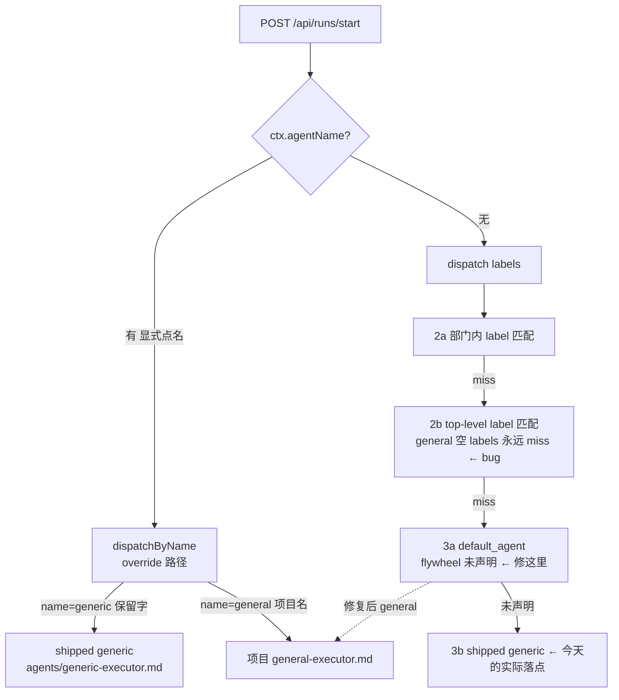

# FLY-1335 空 labels 永不匹配 → general catch-all 失效 — 调研

Issue: FLY-1335 (https://linear.app/geoforge3d/issue/FLY-1335/bug-agentdispatcherlabelsmatch-空数组永不匹配-config-里-general-catch-all)
日期: 2026-07-18
基于: exploration.md

## 调研目标

exploration.md 已锁定方案 B+C-lite(Lead gate 确认,红线:其他项目零行为变化、测试盯死)。
本篇解决落地所需的全部技术事实:改哪、怎么改、测试放哪、有什么先例、哪些点会翻车。

## 1. 派发链路完整图(实读验证)

- 生产唯一构造点:`run-infra.ts:862` `new AgentDispatcher(agentsConfig ?? {}, defaultAgentName, flywheelRepoRoot)`,
  其中 `defaultAgentName = flywheelConfig?.default_agent`(run-infra.ts:780)。
- retry(actions.ts:1087 RetryDispatcher)与 Lead override(run-dispatcher.ts:1065)共用
  `runtime.agentDispatcher` 同一实例 → config 修复天然覆盖全部派发入口,无第二处接线。
- `labelsMatch` 仅被 dispatch() 的 2a/2b 调用(AgentDispatcher.ts:226/241),无其他消费方。

## 2. Step 3a 机制现状(修复的承载面)

- `AgentDispatcher.ts:252-264`:`default_agent` 声明且存在 → `matchMethod:"default"`,
  `department = parsedDept(agent_file) ?? undefined`(general 是 top-level → `undefined`)。
- `ConfigLoader.ts:827-838`:`default_agent` 必须有 `agents` 段且名字存在,否则 load 抛错
  (config 写错名 → 项目 run 基建 fail-closed,不会静默)。
- 现成测试 3 条(AgentDispatcher.test.ts:214-253):命中 default / 未声明 → shipped-generic /
  指向未知名 → shipped-generic。机制本身不需要新代码。

## 3. 真 config 合同测试 — 仓内先例

**FLY-1059 `packages/edge-worker/src/__tests__/designer-agent-dispatch.test.ts`** 就是同款:

- 真 `ConfigLoader((p) => readFile(p, "utf-8"))` 加载 `REPO_ROOT/.flywheel/config.yaml`
  (REPO_ROOT 经 `fileURLToPath(import.meta.url)` 上跳 4 级解析,无 fixture);
- 真 `AgentDispatcher` 驱动断言,注释明言 "catches drift the same way Blueprint's dispatch does"。

**关键 nuance(踩坑点)**:designer 测试构造 `new AgentDispatcher(agents, undefined, REPO_ROOT)`
——第二参硬编码 `undefined`。FLY-1335 的合同测试**必须**镜像 run-infra 接线传
`config.default_agent`,否则测试测不到 Step 3a,变成「fixture 没开启被断言机制」的空绿测
(MEMORY 红线教训)。现有 designer/pm-prototype 测试硬编码 undefined 不受本次 config
变更影响(它们只断言 label 命中路径)——恰证明旧测试字节兼容。

放置:新文件 `packages/edge-worker/src/__tests__/general-catchall-dispatch.test.ts`,
同 REPO_ROOT 解析模式。不用 scripts/__tests__ shell 形态(FLY-880 那套针对 prompt 文本
合同;这里断言的是 ConfigLoader+Dispatcher 运行时行为,vitest 直驱更真)。

## 4. C-lite 警告 — 仓内先例与实现位置

**FLY-159 先例(ConfigLoader.ts:226)**:checkpoint timeout 低于 floor 时
`console.warn("[ConfigLoader] ...")` 不 throw——注释明言 "don't throw — preserve boot
continuity"。C-lite 完全复用此形态。

实现位置:agents 逐条校验循环在前(ConfigLoader.ts:~780-825),`default_agent` 存在性
校验在后(:827-838)。警告需要知道 default_agent,故放在 **default_agent 校验之后**追加
一个小循环:对每个 `match.labels.length === 0` 且 `name !== default_agent` 的 agent 发
一条 warn。文案要点:空 labels = 只能被显式 agentName 派发;想要 label 未命中兜底请声明
`default_agent: <name>`。

警告是纯日志:对带 name-only agent 的其他项目只多一行 boot log,零行为变化(红线满足)。

## 5. 翻车点核对(逐条排除)

| 风险 | 核对结果 |
|------|----------|
| `general-executor.md` frontmatter `model: sonnet` 会不会把 implement 拖上 Sonnet | 不会。FLY-880 QA 已 CONFIRMED frontmatter `model:`/`skills:`/`permissionMode:` 均 inert(Blueprint 只取正文) |
| 与 RESERVED `"generic"` 撞名 | 不撞。`dispatchByName("general")` 走项目 map;`"generic"`/`"qa"` 保留字路径不动 |
| 三段式行为变化 | 无。three_stage 入口由 pipeline config + channel 决定,与命中哪个 agent 无关;label-miss issue 今天走 shipped generic 也进三段式 |
| 其他读真 config.yaml 的测试被 `default_agent: general` 新键打红 | designer/pm-prototype 测试第二参硬编码 undefined,只断言 label 路径;ConfigLoader 对 `default_agent` 是既有合法键。plan 阶段全套跑一遍兜底 |
| owningDept=undefined / "multiple" 的 issue | 同样受益:2a 跳过 → 2b miss → 3a → general(catch-all 语义正确覆盖) |
| 硬禁空 labels 的诱惑 | 已否决:run-infra.ts:800-802 非 ENOENT 错误 rethrow → 存量项目 config 含 name-only agent 会 fail-closed 打崩;升级硬错误 = 审计全部生产项目 config 后的 follow-up |
| ConfigLoader 警告被测试环境刷屏 | 只对空 labels 非 default 的 agent 触发;修复后 flywheel 真 config 零触发(general 即 default_agent)。合同测试顺带断言真 config 加载不产生该警告 |

## 6. 实现清单(交给 plan)

1. `.flywheel/config.yaml`:顶层加 `default_agent: general`(agents 块后);重写 general
   条目注释(删掉「or no executor label matches」谎言,如实写:name-only + 经 default_agent 兜底)。
2. `packages/config/src/ConfigLoader.ts`:default_agent 校验后追加 C-lite warn 循环。
3. `packages/config/src/types.ts`:`match.labels` 补「空数组 = name-only,兜底用
   default_agent」;`default_agent` 注释已基本准确,微调即可。
4. 新测试 `packages/edge-worker/src/__tests__/general-catchall-dispatch.test.ts`(真 config):
   - `config.default_agent === "general"` 且 `agents.general` 存在;
   - 未命中 label(如 `["ops"]`,owningDept="engineering")→ `general` / `"default"` / `"project"`;
   - 空 label 数组 issue → 同上;
   - 命中 label(如 `["bug"]`)仍 → `engineer` / `"label"`(无 shadow 回归);
   - `dispatchByName("general")` → 项目 general / `"override"`;
   - `dispatchByName("generic")` → shipped-generic(保留字路径不回归);
   - 真 config 加载零 C-lite 警告。
5. ConfigLoader 测试(fixture):空 labels 非 default → warn 一条;空 labels 是 default →
   零 warn;warn 不影响返回 config(load 成功)。
6. 全套:`pnpm lint` + 相关包 vitest 全绿(现有 AgentDispatcher 43 测试 + ConfigLoader 套件字节兼容)。

## 7. 与 FLY-1326 的衔接(排程约束落点)

本单结论:flywheel 上 shipped generic 的到达路径收窄为「显式 agentName:"generic"」一条;
零 config 项目的 3b 绝对兜底不变。FLY-1326 B/C 臂(改写 generic-executor.md 受众描述)
以此为前提开工,两单不并行动同一文件/路径(HL 2026-07-17 01:24 PDT 对齐)。
