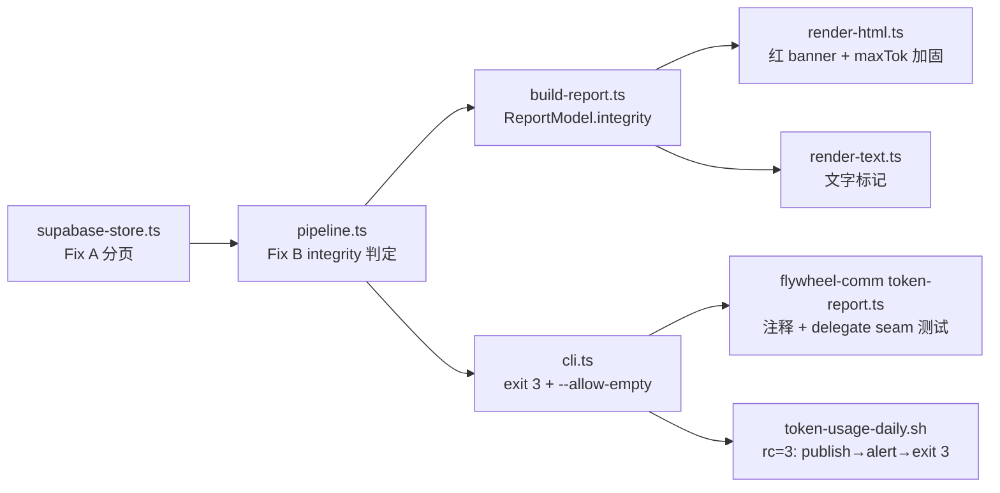

# FLY-1348 每日 Token 报告回归 — 实施计划
Issue: FLY-1348 (https://linear.app/geoforge3d/issue/FLY-1348/bug-每日-token-报告回归-分项目块未渲染-柱状图比例失真annie-直报hl-已复核实锤)
日期: 2026-07-17
基于: research.md

> 版本:ship 时取空号(暂定 v1.58.0)。本计划由 Implement 段在**本分支**(flywheel-FLY-1348)执行,TDD 红→绿,全程不改架构、不动写路径。
> 根因(exploration.md 四路实证):`SupabaseUsageStore.queryDaily` 无分页,PostgREST 默认单次 1000 行封顶 + `day` 升序 → 读窗口超限后最新天被静默截断。数据在库无损,无需回填。
> Brainstorm gate:Tadashi 已批(方向 Fix A/B/C + maxTok 加固 + 四不动项,2026-07-17)。Codex design review R1 五项 findings 全采纳(C2 对账不变量 / C3 total 基准 / MAX_ROWS 保险丝 / 脚本三合同 / delegate seam 测试)。

## 改动全景(7 个源文件 + 测试)

不动:`trendBars` 算法、写路径(`replaceDaily`/RPC)、local-sqlite-store、scanner/aggregator/classifier、`CipherSyncService`(observation 单列 follow-up)。

## Task 1 — Fix A 截断复现测试(RED)

文件:`packages/token-usage/src/__tests__/store.test.ts`

1. 扩展现有 mock builder:支持 `.range(from, to)` 记录 + 数据集切片,并模拟服务端 cap(单次最多返 `min(请求 range 大小, cap)` 行;不带 range 时返 `cap` 行)。
2. 新测试(先红):
   - 「1252 行窗口截断复现」:cap=1000、造 1252 行(day 升序跨多天)→ 断言 queryDaily 返回**全部 1252 行**且与源集逐行相等(无重/漏/乱序)。旧实现只得 1000 → 红。
   - 「服务端 cap 小于页大小 · 生产规模」:cap=10、**1252 行** → 返回全部 1252 行(~126 次请求;验证步进=实际返回行数、0 行即止,对任意 cap 与生产规模正确 — Codex R1#3:小数据集测试证不了这一点)。
   - 「保险丝」:mock 病态地永远返满页 → 累计行数超 `MAX_ROWS` 时抛错(消息含已读行数与上限,不静默)。
3. 现有 filter-chain 测试改为断言完整 order 链(`day`,`scope`,`dim_key`)。

验证:`pnpm --filter flywheel-token-usage test` — 新测试红、其余绿。

## Task 2 — Fix A 分页实现(GREEN)

文件:`packages/token-usage/src/store/supabase-store.ts`

`queryDaily` 重写为分页循环(按此语义,不必逐字):

- `PAGE = 1000`(请求页大小,与 Supabase 默认 db-max-rows 对齐;实际步进用返回行数,与真 cap 解耦);
- 保险丝 = **`MAX_ROWS = 100_000`(按累计行数,不按页数)**:病态/无限响应时抛错拒绝静默截断;页数由 `MAX_ROWS / 实际 cap` 隐式界定,任意小 cap 下完整读取不受影响(Codex R1#3:MAX_PAGES=100 在 cap=10 时 1252 行窗口只读到 1000 行就误触发 — 弃用页数保险丝);
- 循环:既有 gte/lte/eq 过滤原样 + `.order("day").order("scope").order("dim_key")` + `.range(from, from + PAGE - 1)`;`error` → throw;batch 空 → break;`from += batch.length`(步进 = 实际返回,任意服务端 cap 下无重无漏 — `.range` 为 0-based 双端含);
- `SupabaseLike.from` 结构类型补 `range` 签名。

验证:Task 1 全绿;全包测试绿。

## Task 3 — Fix B 自检测试(RED)

自检语义(Codex R1#1/#2 修订后,全部基于聚合器可证明的行不变量):

- **`latestDataDay` = `max(rows.filter(scope=total).day)` ?? null** — 与页面 trend 同源(trend 只读 total 行,`build-report.ts:184-200`),banner 永不和图表矛盾;
- **C1**:`rows` 中无 `day=reportDay, scope=total` 行 → 当日数据缺失;
- **C2(对账不变量)**:reportDay total 行存在时,`sum(当日 scope=project 行 totalTokens) + sum(当日 scope=lead 行 totalTokens) !== total.totalTokens`(整数精确相等)→ 归因不完整。聚合器保证健康日恒等(runner/main/sandbox/other 进 project 行、Lead 进 lead 行、total=全体之和,`aggregator.ts:131-146`);截断/丢行必然破坏等式。旧定义「project 行全 0」在纯 Lead 活动的健康日会误报、在残留一条 project 行时漏报 — 弃用;
- **C3**:`latestDataDay === null || latestDataDay < reportDay` → 数据陈旧(trend freshness,与 C1 可同时命中、banner 分别报)。

测试:

1. `__tests__/build-report.test.ts`(integrity 计算落 buildReportModel,纯函数):
   - C1:窗口有旧天 total、无 reportDay total 行 → `{ ok:false, failures:['C1','C3'], latestDataDay:'<旧天>' }`;
   - **C1+C3 与非-total 行共存**:reportDay 有 project/lead/model 行但无 total 行 → 仍报 C1+C3 且 `latestDataDay` = 上一条 total 的日期(不是 reportDay — Codex R1#2 的关键场景);
   - C2:total=100、project 行=60、lead 行=30(和≠100)→ failures 含 'C2';
   - **Lead-only 健康日**:total=100、无 project 行、lead 行和=100 → `ok:true`(旧定义的误报场景);
   - **project-only 健康日**:total=100、project 行和=100、无 lead 行 → `ok:true`;
   - 完整健康数据 → `ok:true`。
2. `__tests__/render-html.test.ts`:
   - integrity 失败 model → HTML 含红 banner(断言含「数据完整性自检未过」「最新数据日=」与两个日期、红色样式类);ok → 不含;
   - **柱高线性断言(HL 验收 2 固化)**:构造已知 tokens 的 trend → 解析 `trendBars` 输出的 `<rect ... height="H">`,断言 `H_i / H_max ≈ tokens_i / tokens_max`(±1%)。
3. `__tests__/cli.test.ts`:残缺数据 → `main()` 返回 3 **且 HTML 已写出**(先写文件后判退出码);`--allow-empty` 或 `TOKEN_USAGE_ALLOW_EMPTY=1` → 返回 0,banner 仍在;健康数据 → 0;`report-day`/`aggregate` 不受影响。

## Task 4 — Fix B 实现(GREEN)

1. `report/build-report.ts`:`ReportModel` 增 `integrity: { ok: boolean; failures: ("C1"|"C2"|"C3")[]; latestDataDay: string | null }`;在 `buildReportModel` 末尾按 Task 3 语义计算(注意:在 pipeline 的 local-fallback pending-day 并入**之后**才进 buildReportModel,天然正确)。
2. `report/render-html.ts`:`integrity.ok === false` → `<body>` 顶部红 banner:`⚠️ 数据完整性自检未过:数据陈旧/缺失 —— 最新数据日=<latestDataDay ?? '无'>,报告日=<reportDay>(<failures 人话>)`;新样式 `.alert-red`(红左边框 #ff3b30 + 浅红底,复用 .warn 布局)。
3. `report/render-text.ts`:同步一行 `INTEGRITY FAIL(C…): 最新数据日=… 报告日=…` 文字标记。
4. `report/render-html.ts:324`:`maxTok` 改 `Math.max(...m.projects.map(p => p.tokens), 1)`(健壮性加固,行为无差异 — build-report 已按 tokens 降序)。
5. `cli.ts`:`daily`/`report` 在 `integrity.ok === false` 且未 `--allow-empty`/`TOKEN_USAGE_ALLOW_EMPTY=1` 时,**在写出 HTML/json 之后**返回 3;stderr 打一行 `[token-usage] INTEGRITY FAIL: ...`。
6. `packages/flywheel-comm/src/commands/token-report.ts`:头注释补退出码 3 与 `--allow-empty` 语义(delegate 本身不改 — `runTokenReport` 已把非零码写 `process.exitCode`)。

验证:Task 3 全绿;全包测试绿。

## Task 5 — 脚本 rc=3 语义 + 脚本测试 + delegate seam

文件:`scripts/token-usage-daily.sh`、`scripts/__tests__/token-usage-daily-failloud.test.sh`、`packages/flywheel-comm/src/commands/__tests__/token-report.test.ts`(新)

1. 脚本改造(Codex R1#4 三合同):
   - `fail_loud()` 拆出**只发 alert、不退出**的 `raise_alert()` helper;`fail_loud` = `raise_alert` + `exit`(现行为不变);
   - `token-report daily` 退出码三分支:`rc==0` → 现行为(publish);**`rc==3` → 照常进 publish 段**(founder 看到带红 banner 的报告,不是没报告),publish 成功后 `raise_alert`(`notify_digest_failed`,body 注明 `step=integrity-check`,best-effort `|| true`),最后 `exit 3`;其它非零 → 现行为(`fail_loud` 立即退出、不 publish);
   - **rc=3 后 publish 又失败** → 走现有 publish `fail_loud`,**以 publish 的非零码退出**(不许用 3 掩盖「报告根本没送达」);
   - `TOKEN_USAGE_ALLOW_EMPTY` 加入 `_PROCESS_WINS` 快照列表 + 脚本头部 Env 注释(process-env-wins 约定不破);
   - bash 3.2 兼容(生产 macOS /bin/bash,不引入 4.x 特性)。
2. 脚本测试扩展(stub node):rc=3 → 仍 publish、alert 在 publish 之后、最终 exit 3;**组合 `daily=3 + publish=4`** → exit 4(publish 失败合同);rc=1 → 现行为不变(不 publish);rc=0 回归。
3. **delegate seam 测试**(Codex R1#5:shell harness 的 fake node 绕过了真 delegate):`flywheel-comm` 包新增 `token-report.test.ts` — mock `flywheel-token-usage` 的 `runTokenReportCli` 返回 3 → 断言 `runTokenReport` 后 `process.exitCode === 3`(0 → 不设)。**`process.exitCode` 是测试进程全局态(Codex R2#2):`beforeEach` 保存原值、`afterEach` 恢复**,防污染后续用例/防 Vitest 自身以 3 退出;QA 段另有 built-subprocess 实测(Task 6.2④)。

验证:`bash scripts/__tests__/token-usage-daily-failloud.test.sh` + channel 测试回归 + `pnpm --filter flywheel-comm test`。

## Task 6 — 全量验证 + 交付

1. `pnpm --filter flywheel-token-usage test`、`pnpm --filter flywheel-comm test` + 受影响包构建 `pnpm -r build`;`pnpm lint` 全仓(push 前硬门)。
2. 真机只读复现(生产 Supabase,**只用 report 命令,绝不跑 daily/aggregate 防写库**;读期间不做任何手工聚合写 — 见风险表):
   ① `node packages/flywheel-comm/dist/index.js token-report report --date 2026-07-16 --out /tmp/qa-1348.html` → 当日总量非 0(库里 40 行支撑)、分项目卡完整、trend 到 07-16、无红 banner;
   ② 修前同命令产出残图(红基线已由 exploration E1-E6 留档);
   ③ 柱高抽查:同页 SVG rect height vs tooltip tokens 线性;
   ④ **真 delegate 传播实测**(可直接执行的捕获形态,兼容 `set -e` — Codex R2#2):
   `rc=0; node packages/flywheel-comm/dist/index.js token-report report --date 2027-01-01 --out /tmp/qa-1348-empty.html || rc=$?; test "$rc" -eq 3` → 再 `grep 数据完整性自检未过 /tmp/qa-1348-empty.html`(红 banner 真在页面里);
   `--allow-empty` 对照:同命令加 flag → `test "$rc" -eq 0` **且** banner 仍在 HTML 中(穿过 flywheel-comm 构建产物,非 stub)。
3. commit 规范:`fix(FLY-1348): paginate token-usage Supabase reads + integrity fail-loud`;PR 挂 Linear;Codex code review(xhigh)照常;auto-QA 会另起独立 QA session。
4. QA 段验收映射(给 QA runner 的合同):
   - HL 验收 1(分项目对账):QA 用 Supabase REST 独立拉 2026-07-16 的 40 行,对账页面分项目卡数字;
   - HL 验收 2(柱高线性):真页 SVG rect height vs tooltip tokens 线性抽查(±1%)+ 单测已固化;
   - HL 验收 3(自检):Task 6.2④ + 红 banner 内容含「最新数据日」;
   - 终验:merge + 生产 `git pull && pnpm -r build`(排 Lead 批量窗口;不需 Bridge 重启)→ **次日 00:30 真实报告完整 → HL 收**。

## 风险与回滚

| 风险 | 缓解 |
|---|---|
| 分页循环边界(空窗口/单页/小 cap/生产规模) | Task 1 覆盖 cap=1000×1252、cap=10×1252、空数据;步进=实际返回行数对所有 cap 成立;保险丝按 MAX_ROWS 不按页数 |
| offset 分页 page tear | 生产调度假设下可接受:同一脚本先完成原子逐日写再读,mkdir 单写锁;**约束:读窗口期间不得并发手工 aggregate 写**(QA 流程已写明只用 report 命令)。不为此上 keyset(收益为零的复杂度) |
| rc=3 与 `set -euo pipefail` 交互 | 沿用现有 `rc=0; cmd || rc=$?` 捕获模式;脚本测试断言四分支(0/3/3+publish 失败/其它) |
| rc=3 掩盖 publish 失败 | 显式合同:publish 失败以 publish 码退出;组合测试 daily=3+publish=4 固化 |
| `.env` 覆盖 `TOKEN_USAGE_ALLOW_EMPTY` | 加入 `_PROCESS_WINS`;沿用脚本既有 process-env-wins 机制 |
| 生产 dist 未重建导致「修了没生效」 | 交付清单显式含 pull+build;次日真实报告为终验,FLY-925 receipt(`--expected-date`)链路不动 |
| 报告页体积(28 天全量行内存组装) | 行数 ~1300,内存/体积无虞;MAX_ROWS=100_000 防病态增长 |
| 自检误报(真·零用量天 / 纯 Lead 日) | C2 用对账不变量而非「project 行全 0」,纯 Lead/纯 project 健康日测试固化不误报;真·零用量天红 banner + alert 是**正确**行为;QA/沙箱走 `--allow-empty` |

## 完成定义(design 段)

- [x] exploration.md(根因四路实证)
- [x] research.md(方案对比 + 测试设计 + 部署路径)
- [x] plan.md(本文件,R1 五项 findings 已折入)
- [ ] Codex design review APPROVED
- [ ] 三文档 + progress.md commit 到本分支并 push → `complete --route phase_design_complete`
