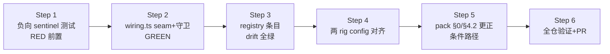

# FLY-1353 voice-rig 测量基建修缮 — 实施计划

Issue: FLY-1353 (https://linear.app/geoforge3d/issue/FLY-1353/voice-rig-测量基建修缮-presence-qa-seam窄布尔-e2e-脚本跟上-config-化-pack-42-更正hl-测量)
日期: 2026-07-17
基于: research.md(同文件夹)

> 给 Implement 阶段(同分支)的执行合同。三件事一单修完(Lead 已确认);三条
> guardrail 不变:**窄布尔**(不做通用 hook,FLY-1323 前车)、**registry 带真实
> readSites**(FLY-1329 教训)、**fail-closed**(unset = 字节级零行为)。
> 不碰生产 presence 语义;不接 /eleven;不动 HuddleBridgeConfig loader。

## 0. 总览

改动面:`wiring.ts` 一处 + `registry.ts` 一条 + 两个 e2e 脚本 config 字面量 +
测试若干 + pack 文档两段(条件路径)。生产运行时零行为变化。

## 1. Step 1 — 测试先行(RED)

文件:`packages/voice-bridge/src/__tests__/assistant-wiring.test.ts`
(fixture `CONFIG` 已含全字段;env 经 `opts.env` 注入;autostart 测试 L533-565 为模板)。

**两个测试输入面的事实(Codex R1 #1 / R2 #3,写死进用例)**:
① `makeFakes()` 把 `voiceChannelHumanCount` 固定为 `async () => 1` —— **生命周期
用例(sentinel / 正向 / 窄解析)**必须显式覆写 `f.deps.voiceChannelHumanCount =
async () => 0` 并等 seed 落定(`vi.waitFor` 等到 `humanCount seeded=0` 日志),
否则「无人」场景根本没构造出来。**守卫用例不等 seed**:守卫在 wire-time 就
reject,occupancy seed(`wiring.ts:172-189`)根本不会启动 —— 守卫用例只断言
reject 本身;
② wiring 的 effective bridgeUrl 只来自 `opts.env`(`FLYWHEEL_BRIDGE_URL ?? BRIDGE_URL
?? "http://127.0.0.1:9876"`,`wiring.ts:129-130`),**`config.bridgeUrl` 不参与** ——
守卫用例必须走 env,正向用例必须钉 `http://127.0.0.1:9877` 否则会撞上自己的守卫。

新增 describe「presence QA seam (FLY-1353)」:

1. **sentinel(负向,先写先跑)**:humanCount seed=0 + env 无 override +
   `FLYWHEEL_BRIDGE_URL=http://127.0.0.1:9877` + autostart 开一轮 + 无 join 事件
   → session 不进 live(conversation 收不到 OPENING 控制提示 / tiv 无「listening」
   status)。在改 wiring **之前**跑一次确认 GREEN(它锚定现状),并临时把断言反向
   验证它真的在测 gating(突变验证,防空绿 —— 完成后恢复)。
2. **正向**:同 1 但加 `FLYWHEEL_VOICE_QA_PRESENCE_OVERRIDE: "1"` → 进 live
   (OPENING 控制提示送达),**并断言两条日志**:boot 的「override armed」+
   `founderPresent` 的「QA OVERRIDE — humanCount ignored」(日志诚实性是合同的
   一部分)。Step 2 前 RED。
3. **窄解析**:override 为 `"0"` / `"true"` / `""` → 与 sentinel 同行为(仍不
   进 live)。Step 2 前 GREEN(与 1 同理),Step 2 后仍 GREEN。
4. **生产守卫(staged-identity allowlist,多条负向;不等 seed)**:override="1"
   时以下 env 形态全部在 wire-time reject(message 匹配 `/QA-only seam/`),
   Step 2 前 RED:
   - `FLYWHEEL_BRIDGE_URL=http://127.0.0.1:9876`(生产端口)
   - `BRIDGE_URL=http://127.0.0.1:9876`(alias 面)
   - `FLYWHEEL_BRIDGE_URL=https://bridge.internal.example`(非 loopback)
   - `FLYWHEEL_BRIDGE_URL=http://127.0.0.1`(无显式端口)
   - `FLYWHEEL_BRIDGE_URL=http://127.0.0.1:43210`(loopback 任意端口 ≠ staged 身份,
     R2 #1)
   - `FLYWHEEL_BRIDGE_URL=https://localhost:8443`(协议+端口都不对)
   - `FLYWHEEL_BRIDGE_URL=ftp://127.0.0.1:9877`(非 http 协议)
   而 `http://127.0.0.1:9877`(正向用例)通过 —— allowlist 只放行有据的 staged
   Bridge 形态(见 Step 2)。

验证命令:`pnpm --filter flywheel-voice-bridge test -- assistant-wiring`

## 2. Step 2 — wiring.ts seam(GREEN)

文件:`packages/voice-bridge/src/assistant/wiring.ts`,`wireAssistantMode()`。
三处,精确形态见 research §1.1(逐字模板):

- L135 附近(env 校验区之后):`const qaPresenceOverride = env.FLYWHEEL_VOICE_QA_PRESENCE_OVERRIDE === "1";`
  + armed 时 boot 日志一条;
- 同处:**staged-identity allowlist 守卫(Codex R1 #2 + R2 #1,取代 :9876
  黑名单)**—— armed 时用 `new URL(bridgeUrl)` 解析 effective URL(解析失败即拒),
  要求 **`u.protocol === "http:"` 且 hostname ∈ {`127.0.0.1`, `localhost`,
  `::1`/`[::1]`} 且 `u.port === "9877"`**;不满足一律 throw(`/QA-only seam/`)。
  「loopback + 任意非 9876 端口」仍只是 denylist 换皮(`127.0.0.1:43210` /
  `https://localhost:8443` 全都会漏)—— 9877 是仓内唯一有出处的 staged Bridge
  端口(`e2e/staged-bridge.mjs` 默认 + 两 rig `??=` 默认 + FLY-1047 安全合同
  assert 9877);将来若真出现第二个 staged 端口,改这一行常量并补出处,而不是
  预留宽口。
  **边界如实声明**:该检查位于 `wireAssistantMode`,在 `runVoiceBridge` 已起
  health server、登录 bots、Note-taker 进 VC 之后(`cli.ts:188-270`)—— 属
  fail-stop(daemon boot 失败,走 runVoiceBridge 既有 catch/teardown),**不是**
  零外部接触的 preflight;换取的是 seam 保持单一读点(registry readSites 单条,
  不为提前检查加第二个 env 读点)。
- L361-367 `founderPresent` 闭包:armed 短路返 true,日志显式标
  `QA OVERRIDE — humanCount ignored`(测量证据诚实性)。

**不改**:humanCount 机制、onFounderJoin/onFounderLeave、AssistantSession、
GeminiCommand、eleven wiring。

验证:Step 1 四条全 GREEN + 既有 presence/connect 套件
(`qa-fly967-round3-presence` / `qa-fly967-round5-connect` / `assistant-session`)
原样全绿。

## 3. Step 3 — registry 条目

文件:`packages/config/src/feature-flags/registry.ts`。新条目
`voice_qa_presence_override` —— 逐字段模板见 research §2.1(envVar
`FLYWHEEL_VOICE_QA_PRESENCE_OVERRIDE`,opt_in/bool/default false,readSites =
wiring.ts `wireAssistantMode` env-param object_construction,toggleable
readonly + QA-only note)。

验证:`pnpm --filter flywheel-config test` —— `feature-flags-drift.test.ts`
(forward+reverse)与 `feature-flags-registry.test.ts` 全绿。reverse 方向会真读
wiring.ts 验证 env var 名存在(research §2.2)。

## 4. Step 4 — 两 rig config 对齐(共享 builder + 可证验证)

文件:`packages/voice-bridge/e2e/gemini-staged.mjs`(config 字面量 L51-65)、
`packages/voice-bridge/e2e/gemini-voice-loop.mjs`(L111-135)、新增
`packages/voice-bridge/e2e/lib/rig-config.mjs`。

**改法(Codex R1 #3:两处字面量抽成共享 builder,让「字段真进了 config」可单测)**:

- 新增 `e2e/lib/rig-config.mjs` 导出 `buildStagedConfig(env)`:接管两 rig 的
  config 构造(既有字段照旧 + 补齐以下 7 个 boot-read 字段),两 rig 改为
  `buildStagedConfig(process.env)` 再按各自差异覆写(voice-loop 的
  `allowUserIds: [injectorId]` 等)。
- 补齐字段(两 rig 相同):
  - `bridgeUrl: env.FLYWHEEL_BRIDGE_URL`(rig 已 `??= :9877` + 9876 拒跑守卫)
  - `apiToken` / `geminiApiKey`:既有 need() 返回值捕获复用
  - `geminiModel: env.FLYWHEEL_HUDDLE_GEMINI_MODEL ?? "gemini-3.1-flash-live-preview"`
    (镜像 loader 默认,注释标明镜像关系)
  - `founderUserId: env.DISCORD_OWNER_USER_ID ?? ""`
  - `bargeInMinRms: 0` —— **刻意的 measurement-rig override,不是 loader parity**
    (Codex R1 #5:loader 默认是 700;0 是 EarsReceiver 收到 undefined 时的
    off 语义)。选 0 = 保留两 rig 字段缺失时代的有效行为:噪声门关死,合成探针
    绝不被 RMS 门吃掉。注释按此措辞写死,防未来被当 loader 对齐改掉。
  - `bargeInHoldoffMs: 1000`(与 loader 默认一致)
  **不补** claudeBin/brainTimeoutMs 等(非 rig 路径)。
- 两 rig 在 AUTOSTART 附近加 `process.env.FLYWHEEL_VOICE_QA_PRESENCE_OVERRIDE ??= "1";`
  (可覆盖默认 —— HL 负向对照显式置 "0";注释按 research §3.2 模板)。

**验证(替换 R1 前的假绿干跑 —— `need("STAGED_GUILD_ID")` 在 config 构造之前,
「死在 env 校验」修前也成立,证明不了任何事)**:
新增 `packages/voice-bridge/src/__tests__/rig-config.test.ts`,import
`../../e2e/lib/rig-config.mjs`,喂 stub env → 断言返回对象的全部 boot-read 字段
(`bridgeUrl/apiToken/geminiApiKey/geminiModel/founderUserId/bargeInMinRms/
bargeInHoldoffMs` + 既有必填)逐一存在且等于 stub 值 —— 直接证明字段真进了传给
`runVoiceBridge` 的对象。真机全链仍由 HL measurement run 验(负向对照先行)。

## 5. Step 5 — pack 文档更正(条件路径)

目标文件:`engineering/doc/FLY-1347-voice-measurement-pack/voice-measurement-pack.md`。
两段替换文本逐字见 research §4(§4.2 injector pool-05→pool-06 + 自撞失败形态
备注;§0 /gemini 行加 seam 条件与负向对照要求)。

**排序合同(Codex R1 #4:pack-correction.md 式 fallback 违背「三件事一单修完」,
已废弃;design 阶段已向 Lead 发非阻塞 ask 推动排序)**:

- **硬前置(可执行合同,Codex R2 #4:先刷新 remote ref,精确到命令)**:
  1. `git fetch origin main`(失败 → 停,不继续);
  2. `git cat-file -e origin/main:engineering/doc/FLY-1347-voice-measurement-pack/voice-measurement-pack.md`
     (exit 0 = pack 已真进 main;非 0 → 走下面的「停下问 Lead」分支);
  3. `git merge origin/main`(冲突/失败 → 停,解决后再继续);
  4. 确认工作树中该文件存在,然后直接改 pack 两段。
- pack 仍不在 main → **停在本 step**,`flywheel-comm ask` 请 Lead 二选一:
  (a) 先 merge FLY-1347(纯 docs 分支,推荐),回来继续;
  (b) 明确重新批准拆单口径(pack 更正移出本单),同步改 issue/验收表述。
  在 Lead 答复前先把 Step 1-4 + Step 6 的测试/lint 全部做完(pack 是最后一块),
  **不得**以 pack-correction.md 静默替代,也**不**复制 pack 文件夹进本分支(必撞冲突)。

## 6. Step 6 — 全仓验证 + PR

1. `pnpm -r lint`(push 前全仓 lint 纪律)。
2. 受影响包全测:`pnpm --filter flywheel-voice-bridge test`、
   `pnpm --filter flywheel-config test`(注意 `pnpm -r test` 首失败即 bail,
   不能证明目标包跑过 —— 用 filter 逐包)。
3. commit(feat: FLY-1353 …)+ push;`gh pr create`,PR body 带 Linear issue 段。
4. `stage set pr_created` → Codex code review 流程;之后按 APPROVE GATE 走
   (`gate approve_to_ship --no-block` + `complete --route needs_review`)。

## 7. 验收清单(对 issue 逐条)

| Issue 验收 | 本计划的证据 |
|-----------|--------------|
| presence seam,unset 零行为 | Step 1 sentinel(humanCount seed=0 真构造)+ 窄解析测试;既有 presence 套件原样绿 |
| seam 可让 headless 进 live | Step 1 正向测试(含两条 override 日志断言);HL 真机 measurement run(负向对照先行:=0 复现停 invoked,=1 跑全链) |
| 不做通用 hook | diff 层面只有一个布尔 const + 两个分支 + 一个 allowlist 守卫 |
| registry 真实 readSites,CI 不红 | Step 3 drift forward+reverse 全绿 |
| rig 不再 crash | Step 4 共享 builder 单测:boot-read 字段逐一进 config 对象 |
| pack §4.2/§0 更正 | Step 5 硬前置(FLY-1347 上 main 后本 PR 内改到位;拆单须 Lead 明确重批) |
| 不碰生产 presence 语义 | unset 路径 diff 审计 + allowlist 守卫(armed 只许 `http://` loopback `:9877` 的 staged 形态) |

## 8. 风险

- **FLY-1347 merge 时点**(唯一外部依赖):Step 5 硬前置 + design 阶段已发 Lead
  ask 预热排序;最坏情况 implement 在 Step 5 等 Lead 拍(其余 step 先做完)。
- **Gemini Live 真连接行为**:seam 只改 presence 判定,连接链路不动;若 HL 真机
  发现 live 后声学链仍有别的坑,属新发现另立单(本单 scope 到「结构性解锁」为止)。
- **flag 误进生产 .env**:allowlist boot 拒启守卫(fail-stop,边界已如实声明)+
  registry note + 描述三重防线。
