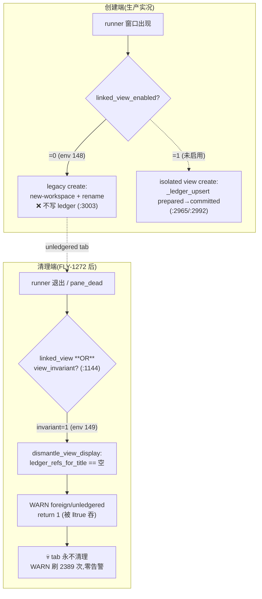

# FLY-1364 cmux 死 tab 不清理 — 探索

Issue: FLY-1364 (https://linear.app/geoforge3d/issue/FLY-1364/bug-cmux-死-tab-不清理-cleanup-mutator-被单写锁lease-unverifiable挡死log-已退出-579)
日期: 2026-07-18
基于: 无

## TL;DR — 根因修正

Issue 的假设(「cleanup mutator 被单写锁 lease unverifiable 挡死」)**不成立**。实证根因:

> **create/cleanup 授权不对称**:生产 flag 半开半关(`FLYWHEEL_CMUX_LINKED_VIEW=0` + `FLYWHEEL_CMUX_VIEW_INVARIANT=1`,`~/.flywheel/.env:148-149`)。创建端走 legacy 路径**不写** view ledger;清理端(FLY-1272 引入)**只认** ledger 授权。账本(`~/.flywheel/state/cmux-view-ledger`)**根本不存在** → 每个 tab 生下来就注定死后清不掉 → `foreign/unledgered … manual resolution required` 刷了 **2389 次**,死 tab 堆积。

「lease unverifiable, exiting」那条 log(579 次历史累计 / 当前 log 窗口 80 次)是**新 watcher 启动尝试的正常单实例去重退出**,与清理失败无关。`packages/teamlead/src/bridge/repo-mutation-lock.ts`(Bridge 进程内 async mutex)与本 bug 无关。

## 证据链(全部 2026-07-18 实测,只读)

### E1 — 活 watcher 的清理每周期都真正在跑,且每次被 ledger 授权挡回

`/tmp/flywheel-cmux-watcher.log`(当前窗口自 08:29 起):

```
[cmux-sync 10:33:44] Conservative cleanup: cmux-FLY-1338-implement-codex-G-cycle-time-CI-CI (stale for 354s)
[cmux-sync 10:33:44] WARN: foreign/unledgered same-title workspace collision for FLY-1338-implement-codex-G-cycle-time-CI-CI; manual resolution required
[cmux-sync 10:28:13] Event cleanup: 'FLY-1356-implement-codex-G-Eng-skill-framework-mod' (exited 62s ago)
[cmux-sync 10:28:14] WARN: foreign/unledgered same-title workspace collision for FLY-1356-implement-codex-G-Eng-skill-framework-mod; manual resolution required
```

- `foreign/unledgered` WARN:**2389 次**(grep -c)。每一条都是一次到达 `dismantle_view_display()` 后被拒的真实清理尝试。
- `lease unverifiable, exiting`:80 次(当前窗口),时间零散(间隔 10~45 分钟),形态 = unsupervised autostart 的启动去重退出(`acquire_watcher_lock`,`flywheel-cmux-sync.sh:4186`)。**清理路径从来没有走到这条消息。**

### E2 — mutator lease 健康,单 watcher 正常持锁

- `pgrep -f flywheel-cmux-sync` = 1(pid 58560,elapsed 23:46h)。
- `/tmp/flywheel-cmux-watcher.lock/owner` = `58560|Fri Jul 17 10:55:49 2026|watch|…`(格式合法,owner 活着,incarnation 匹配)→ lease 完全可验证,`acquire_mutator_lease` 对新来者返回的是「busy(1)」不是「unverifiable(2)」。

### E3 — 账本不存在

- `~/.flywheel/state/cmux-view-ledger`:**文件不存在**。`ledger_refs_for_title()` 对任何 title 返回空 → `dismantle_view_display()`(`flywheel-cmux-sync.sh:2688-2699`)一律判 foreign 并 `return 1`(被调用方 `|| true` 吞掉,零告警)。
- log 窗口内 `cannot persist prepared ledger` = 0 次,`GC committed ledger` = 0 次 → 不是「写失败」,是**根本没人写**。

### E4 — 为什么没人写:create 走的是 legacy 分支

死 tab `FLY-1356-implement` 的创建时序:

```
[cmux-sync 10:27:12] Creating workspace for: FLY-1356-implement-codex-G-Eng-skill-framework-mod (@1784) from session runner-flywheel
[cmux-sync 10:27:12] WARN: cmux-FLY-1356-implement-… not ready (session/select-window) — deferring create for FLY-1356-implement-…
```

`not ready (session/select-window)` 这条措辞只存在于 `create_workspace_for_window()` 的 **`linked_view_enabled=false` else 分支**(`flywheel-cmux-sync.sh:2893-2897`;true 分支的措辞是 `failed isolated topology ready gate`)→ 生产确实在 legacy create 模式下运行。该模式的 rename 分支(`:3003-3005`)**不含任何 `_ledger_upsert` 调用**。

### E5 — flag 半开半关(根因的配置形态)

`~/.flywheel/.env`:

```
148: FLYWHEEL_CMUX_LINKED_VIEW=0      ← 某次 rollback 关掉了 isolated-view 创建
149: FLYWHEEL_CMUX_VIEW_INVARIANT=1   ← FLY-1272 的保护开关(默认 1)
```

清理入口 `cleanup_workspace_for()`(`:1144`,git blame → FLY-1272,2026-07-16)的 gate 是 **`linked_view_enabled || view_invariant_enabled`** → 只要 VIEW_INVARIANT=1,清理就走「必须 ledger 授权」的 `dismantle_view_display`,与 create 侧的模式判断(只看 LINKED_VIEW)**不对称**。同一 gate 形态还出现在 `:566/:597/:726/:786/:2611/:3171/:3214`(ghost reaper、dedup、orphan-pin reaper、reconcile 等)。

时间线吻合:FLY-1272 于 7-16 合入 → 昨晚(7-17)Tadashi 诊断出 cmux 清理回归 → 今晨(7-18)Annie 看到死 tab 堆积。

## 根因机制图



## 三个子问题(本 issue 的完整 scope,含 Lead 交接补充)

### P1(主症状)· 死 tab 不清 — 授权不对称

如上。安全初衷本身是对的:FLY-1272 的立场「**title 永远不是 authority**」防的是同名碰撞误杀(founder 手开的同名 workspace / 1342 dual-session 碰撞)。缺陷在于:**fail-closed 没有配套的收敛路径**,在授权物料(ledger)结构性缺失的形态下退化成 fail-forever + 静默。

### P2 · 误导性诊断信号 — 一条 log 混两种语义

`cmux mutator already running or lease unverifiable, exiting` 把「正常去重退出(busy)」和「验证失败(unverifiable)」压进一条消息,579 次累计直接把 Cass 和本 issue 引向错误根因。真正的 unverifiable(`_read_mutator_owner` rc=2 malformed)是 fail-closed(`refusing to steal`)且无自愈、无告警——但**当下并未发生**(E2)。stale-lease 收割(owner 死/incarnation 不匹配 → reap)已存在且工作正常。

### P3(Lead 交接)· tmux-server-rescue per-socket 锁争用 — FLY-1365 上游

另一把锁:`scripts/lib/tmux-server-rescue.sh` 的 per-tmux-socket kernel flock(`~/.flywheel/locks/tmux-<hash>.lockf`)。Bridge log 实测 19 次:

```
[CodexTmuxAdapter] runner-tui-window: guarded session ensure attempt N held (status=5): {"action":"hold_lock_unavailable","evidence":{"reason":"acquire_timeout"}}
```

所有 guarded tmux 操作(ensure / inspect / spawn / claude-lead.sh / sync-flywheel-hooks)串行在同一把锁上;长持锁操作在高 load 下饿死 ensure(`flock -w` 超时)→ 曾把建6 implement 全堵,并是 #633 同步链卡死 main loop → watchdog 自杀的上游诱因(FLY-1365 forensics)。cmux-sync 自身**不**走 rescue 锁(仅注释提及)。bridge log 无时间戳、owner metadata 无持锁时长 → **当前无法事后定位长持锁方,这本身就是要修的可见性缺陷**。

边界(写进 plan):FLY-1365 = 调用侧(ensure 异步化 + 可见性,不再卡 main loop);FLY-1364 = 锁自身(持锁方 instrumentation + 争用收敛 + 告警)。

## 修法候选

约束(Annie/Cass/Tadashi 三方红线):
- ⚠️ 不手动盲清任何锁/账本;不引入 title-only 盲杀。
- 所有新清理授权必须是**证据链 + 两遍确认 + 审计 log**(复用 `view_mismatch_confirmed` latch 模式)。
- 修复要能清掉**存量**死 tab(收敛),不只堵新增。

| # | 方案 | 说明 | 定位 |
|---|------|------|------|
| **A 收养(adopt)** | `dismantle_view_display` 遇 unledgered 时不再直接拒:走**证据链收养** — workspace 的 attach 目标指向 `cmux-<title>` 视图会话(或视图会话已消失且源窗口 pane_dead/不存在)+ 两遍确认 latch → 补写 committed 行 → 走现有 `close_ledger_workspace_ref` 正路。真 foreign(证据不满足)仍拒。 | **主修**:一条路径同时收敛存量与增量 |
| **B create 侧记账** | legacy create 分支(`:3003`)补 `_ledger_upsert prepared→committed`,账本恢复为全量事实源。 | 必做,堵新生 unledgered |
| **C 对称性回退** | `:1144` 等 gate 从 `linked_view ‖ view_invariant` 改回只看 `linked_view` → legacy close。 | **不推荐单独做**:重新引入 title-only close,正是 FLY-1272 要防的;仅作为讨论项 |
| **D 静默失败可见性** | foreign/unledgered 拒清:去重聚合 + 上浮 #flywheel-alerts(「manual resolution required」要真的到人眼);拒清计数进 audit。 | 必做 |
| **E log 消歧义** | `:4186` 拆分 already-running vs unverifiable 两条消息;rc=2 malformed 场景加告警。 | 低成本必做(P2) |
| **F generation 孤儿** | cmux 重启换 generation 后,ledger stale-generation 行:ref 仍在当前 cmux → 证据链 re-adopt;ref 已消失 → GC。 | 与 A 共用收养逻辑 |
| **G rescue 锁可见性+收敛** | owner metadata 加持锁时长/verb;超时持锁告警;acquire_timeout 事件带上「当前 owner 是谁」。hold budget/公平性视 research 结论定。 | P3,与 1365 划界 |

**推荐组合:A + B + D + E + F + G(诊断层),不做 C。**

## 待 research 确认的开放问题

1. cmux workspaces JSON 是否暴露 attach command / 关联 session 字段(A 的证据链数据源;若无,证据链退化为「视图会话侧证据 + 源窗口死证据」)。
2. FLY-1272 的 dual-session 同名碰撞(FLY-1342-design 那条 WARN)在收养证据链下如何判:同 title 两个 ref,一个有证据一个没有 → 只收养有证据的;两个都有 → ?(需定 tie-break,倾向按 ref 新旧 + 视图会话匹配)。
3. `LINKED_VIEW=0` 是谁/何时 rollback 的、能否直接重新开 1(若能,B 变成「顺手」而 A 仍需处理存量)。
4. rescue 锁长持锁方:加 instrumentation 前无法定位;plan 里定 instrumentation 先行、结构收敛(budget/拆锁)后行的两步走。
5. 存量死 tab 的一次性收敛:靠 A 的常规周期自然清,还是提供 operator 一次性 `--adopt-sweep`;倾向前者(零新入口)。
