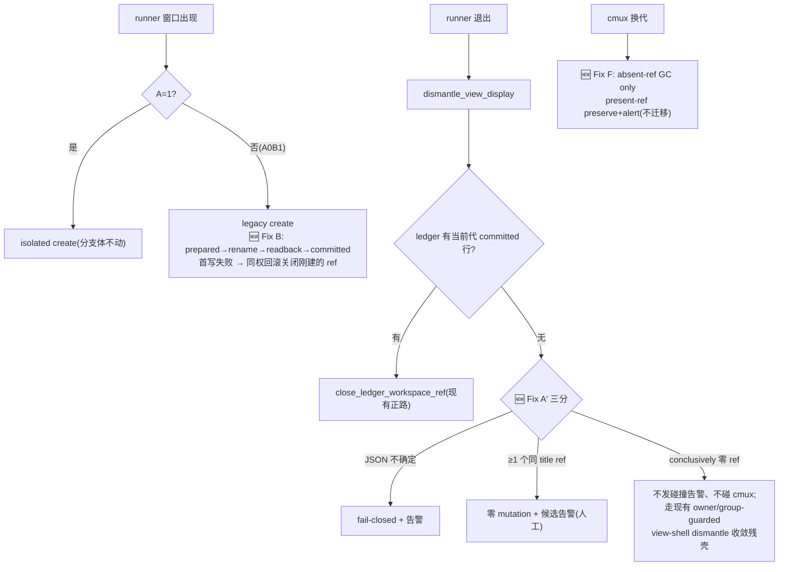

# FLY-1364 cmux sync 整体修复 — 实施计划

Issue: FLY-1364 (https://linear.app/geoforge3d/issue/FLY-1364/修复cmux-总修-cmux-sync-整体修好-单写锁-fail-safe-反向根因-死条目不清-重派窗口不补条目-attach-不自愈)
日期: 2026-07-22(R6 founder-approved amend;保留 R5 六项并补齐 2026-07-21 扩单)
基于: research.md

> **R6 控制条款**:§0–§6 保留 R5 的实证、六项实现主体与安全合同;凡与本文件 §7 冲突者,以 §7 为准。尤其替换四个旧边界:「malformed lease 永久 fail-close」「周期 sync 不做 attach heal」「A0B1 保持 grouped view」「存量 unledgered 只能人工关闭」。R6 不放宽 FLY-1272(sole-holder view 不得被 Bridge 杀)或 FLY-825(create-vs-create dedup)。

## 0. 背景与边界

**修什么**:A0B1 生产态(`FLYWHEEL_CMUX_LINKED_VIEW=0` + `FLYWHEEL_CMUX_VIEW_INVARIANT=1`)下 create 不记账 × cleanup 只认账 → 死 tab 永不清(exploration 实证:账本文件不存在、拒清 WARN 2389 次)。附带修:拒清静默无告警(D)、lease log 语义混淆(E)、generation 换代孤儿账本卫生(F)、rescue 锁争用不可定位(G,instrumentation 先行)。

**核心设计立场(R1 修正,R2 确认保持)**:本单**不新增任何对 unledgered workspace 的自动 close 授权**,后续轮次也不重新引入 adoption。
- **增量**:Fix B 让每个新 tab 在 create 时拿到 exact-ref 收据(ledger 行)→ cleanup 走现有正路。
- **存量**(当下 3-5 个死 tab):**人工关闭**(安全步骤已交 Lead,id 960f33e7);Fix A′ 的 conclusively-zero-refs 分支(§2.2)负责收敛人工关闭后残留的 view session。
- **将来的 unledgered 残余**:拒清 + 富证据候选告警,人工处置。
- 验收条款偏差已知会 Lead(ask a47fddac)。

**不修(scope 边界)**:
- 不改 FLY-1272 安全模型;A=1 分支体零改动(共享 writer 语义变化见 §2.1#4 的如实声明);A0B0 完整 legacy 合同不变。
- 不重开 A=1;不做 rescue 锁结构收敛(G 数据落地后另开 issue);不修 ensure 调用侧(FLY-1365 域)。
- **`packages/claude-runner/src/codex-daemon-runtime.ts` 明确不在本单 scope**。⚠️ FLY-1365 plan §6「1364 正在改 ensureDead SURVIVED 分支」**已过期**,需在其 implement 开工前更新(入设计报告;两 PR 描述互链 scope 版本)。

**改动面(R2 #1/#2 重列)**:
- shell:`scripts/flywheel-cmux-sync.sh`、`scripts/lib/tmux-server-rescue.sh`、**新增共享告警库 `scripts/lib/flywheel-alert-lib.sh`**(cmux-sync 与 rescue 是不同进程,不能共享函数——两者 source 同一库)、`scripts/flywheel-cmux-install.sh`(部署面扩展,见 §5)、`scripts/test-cmux-sync.sh`(主 harness)+ `scripts/__tests__/tmux-server-rescue*.test.sh`。
- TypeScript(teamlead,全部加法性):alert kind 注册全套面——kind union、`KIND_CONTRACTS`(owner/arc;`KindContract` **无 route 字段**,route 由 `bridge/infra-event-router.ts` 独立决定)、`TICKET_KINDS`/`INFORMATIONAL_KINDS` TS+shell 双镜像、`LeadWatchdog.ts` `titleFor/bodyFor` exhaustive switch 新 case(`noImplicitReturns`)、router 显式路由、shell allowlist,及各自测试。
- **本单是 Bridge-impacting PR**(teamlead 改动经 restart-services classifier 判定,`restart-services.sh:551-558`)——不再声称「无需 Bridge 重启」;部署顺序见 §5。
- 与 1365 重叠评估:shell 零重叠;teamlead 加法性条目,后 merge 方 rebase;rescue evidence JSON 只加不改(合同进验收)。

## 1. 修复后的目标流



## 2. 工作项

### 2.1 Fix B — legacy create 记账(主修:堵新增)

文件:`scripts/flywheel-cmux-sync.sh` `create_workspace_for_window()` + ledger helper。

1. `:2836-2842` 的 `cmux_generation` 获取条件扩为 `linked_view_enabled || view_invariant_enabled`(读不到 → refuse create,WARN 措辞复用)。
2. `:3003` legacy rename 分支在 `view_invariant_enabled` 时镜像 A=1 记账合同(`:2958-2995`):generation 三点一致 + 恰一 ref diff → prepared → rename → 读回确认恰一 → committed;中段失败同 A=1 合同 WARN + prepared 行留给 reconcile。
3. **首写失败合同**:prepared upsert 失败时 workspace 已建但零收据——**同权回滚**:对本次 diff 出的 `new_ref`(未命名、恰一、亚秒龄,所有权由本次 create 的 refs_before/after diff 证明)执行专用 guarded 回滚 close(guard 重验:generation 未变 + ref 存在 + 仍未命名);回滚失败 → 保留 + Fix D 精确告警(generation+ref)。杜绝静默新增 unledgered tab。
4. **ledger writer 并发模型(R2 #4 冻结)**:**global mutator lease 是唯一 writer exclusion 授权**:
   - upsert/remove 收敛为**单一事务 helper**(同一把 inner lock + 同一套 owner 记录);
   - 每次 ledger RMW 前做 **runtime held-lease assertion**(`MUTATOR_LEASE_NONCE` 非空且 `$WATCHER_LOCK_DIR/owner` 与自身 pid/incarnation/nonce 匹配——复用 `assert_or_reuse_owned_lease` 形态);断言失败 → 拒写 + WARN(防未来新 caller / 误直调);
   - inner mkdir lock 保留为 belt-and-suspenders,owner 记录(pid+start)在 mkdir 后立即落盘;acquire 失败时:**当前进程已通过 held-lease assertion(= 系统内不可能有第二个合法 writer)→ 允许回收任何残留 inner lock**(missing/malformed/dead-owner 一律回收 + audit log)——回收授权来自全局独占 lease,不是盲清;**无有效 lease 时永不回收**(负测);
   - 覆盖 crash 注入测试:SIGKILL at mkdir-后-owner-前 / owner tmp write / owner mv / ledger tmp write / ledger mv / release 各点 → 下一持 lease 者可恢复。
5. **A=1 如实声明(R2 #4)**:A=1 分支体零改动,但共享 ledger helper 语义变化(lease assertion + 事务化)对 A=1 生效——验收措辞为「A=1 的 authority/topology/可观测行为不变」+ 共享 writer 失败/恢复回归测试,不再声称字节兼容。
6. flag 四组合:A1B1/A1B0 行为哨兵;A0B1 记账生效;A0B0 不记账、行为不变。测试断言**状态迁移序列**(prepared 出现 → 被 committed 按 ref 替换,终态恰一行)。

### 2.2 Fix A′ — 拒清三分(R2 #5)

文件:`scripts/flywheel-cmux-sync.sh` `dismantle_view_display()`(`:2695-2699`)。ledger 无当前代 committed 行时:

1. **JSON 不确定**(get_cmux_workspaces_json 失败)→ fail-closed return 1 + Fix D 告警(uncertain 标注)。
2. **conclusively ≥1 个同 title ref** → **零 mutation**(不写 ledger、不 close 任何 cmux/tmux 对象)+ 富证据候选告警:title、ref 列表、`cmux-T` 视图会话存在性与 owner/group 观测、同名源窗口有无、STALE_STATE 痕迹——人工一眼定性。
3. **conclusively 零同 title ref**(人工已关 tab / tab 本就不存在)→ **不发碰撞告警、不做任何 cmux close**,继续执行**现有** `:2705` 起的 owner/group-guarded view-shell dismantle(escrow/unlink 机制原样)——收敛残留的 `cmux-<title>` display session,使 `cleanup_stale_workspaces()`(`:3031-3048`)不再重入。guard 不满足(owner/group 证据缺)→ 保留 + WARN(现状合同)。
- E2E:人工关 tab 后下一 tick view session 收敛且不再报 collision;foreign ref 场景前后 workspace/ledger/tmux 全零 mutation。

### 2.3 Fix E — lease log 消歧义(不变)

`acquire_watcher_lock`(`:4186`)与 `run_mutator_once`(`:4093`)按 rc 拆分:rc=1 → `already running (owner pid=<p> mode=<m>)`(无告警);rc=2 → `lease MALFORMED … manual inspection required` + Fix D 告警。不改锁语义、不改 stale-reap。

### 2.4 Fix D — 告警管道接线(R2 #2 冻结合同)

**共享库**:新建 `scripts/lib/flywheel-alert-lib.sh`,提供 `flywheel_alert <kind> <severity> <title> <body> <signature>`;`flywheel-cmux-sync.sh` 与 `tmux-server-rescue.sh` 各自 source。**source 语义 = 显式 optional/fail-open(R3 #2)**:库文件缺失(部署中间态)→ stderr 一条 WARN + 安装 no-op `flywheel_alert`,宿主脚本 stdout/JSON/rc **完全不变**——依赖缺失绝不中断 cleanup/rescue 本体(`set -e/-u` 安全)。**两层路径语义分开**:library 的 source 路径 = repo-relative(`$SCRIPT_DIR`)→ deployed-relative(受测两态);`FLYWHEEL_CMUX_ALERT_BIN`/`FLYWHEEL_TMUX_RESCUE_ALERT_BIN` env 覆盖的是**告警可执行体**(lead-alert.sh,QA 隔离用),不是库的 source 路径。库内部调 `lead-alert.sh --project flywheel --lead flywheel-eng-lead --kind … --severity … --title … --body … --signature …`(identity 冻结为现行 converge 默认值,`converge-flywheel-bin.sh:42`)。**meta-alert 面保留**:`lead-alert.sh` 的 meta-alert 依赖按 `$0` 推导 sibling(`lead-alert.sh:220-229`)——部署时 `meta-alert.sh` 一并链入 bin sibling(§5),否则既有 failure surface 会被静默丢弃。告警失败仅 log WARN,绝不阻断清理/rescue 路径。

**kind 冻结(R3 #1:全部用现行 schema 的 literal 值;route 由 `infra-event-router.ts` 独立决定,`KindContract` 无 route 字段)**:
| kind | 覆盖事件 | `KIND_CONTRACTS` literal | lifecycle 归属 |
|------|---------|--------------------------|----------------|
| `cmux_cleanup` | 拒清候选(A′①②)、lease malformed(E)、ledger 异常(inner-lock 连续拒写、首写失败残留)、stale-gen preserve(F) | `owner: "claude"`, `arc: "human_by_design"` | `TICKET_KINDS` + router 显式路由 |
| `cmux_flag_state` | A0B1 半开 transition | `owner: "claude"`, `arc: "human_by_design"`(exhaustive Record 仍要求) | `INFORMATIONAL_KINDS` TS+shell 双镜像,不进 ticket lifecycle |
| `tmux_rescue_hold` | rescue 长持锁 episode | `owner: "claude"`, `arc: "human_by_design"` | `TICKET_KINDS` + router 显式路由 |

不扩展 `KindOwner` union(现行 `claude|codex|cross_by_provider|founder_direct`,`kind-contract.ts:46-50`)。注册面全套(§0 文件矩阵):union、`KIND_CONTRACTS`(owner/arc)、`TICKET_KINDS`/`INFORMATIONAL_KINDS` 双镜像、`LeadWatchdog.ts` titleFor/bodyFor 新 case、`infra-event-router.ts` route、shell allowlist、**三个 exact contract object 的逐字测试**。

**episode 身份(逐类,含 R2 #2 补的 F-preserve)**:
| 事件 | signature | 再报语义 |
|------|-----------|---------|
| 拒清候选 | generation+title+refs集合哈希+拒因 | refs/generation 变化 = 新 episode |
| lease malformed | owner 文件内容哈希 | 内容变化再报 |
| ledger inner-lock 连续拒写 | lock owner pid+start | owner 变化再报 |
| 首写失败残留 | generation+ref | 精确一次 |
| stale-gen preserve(F) | 旧generation+当前generation+ref+observed state | 观测态变化再报 |
| rescue 长持锁 | **sockhash+verb+caller+episode_counter**(counter 单调,进 --signature 字节串——同 A0B1 模式,否则 claims.db 永久判 duplicate) | sustained 抑制,恢复后 counter+1 = 真·新 eventId 再报;并发合同与上界测试见 §2.6#4 |
| A0B1 半开 | 组合值+**单调 episode counter** | 见下 |

**A0B1 latch = 持久状态机文件**(不删除):记录 `last_state + counter`;watcher 启动读取——state 未变(仍半开)→ 不再报;离开半开 → 更新 state(文件保留);重入半开 → counter+1 → signature 带新 counter → claims 视为新事件再报。同时满足「restart 不重报 / 真离开再进要重报」。

### 2.5 Fix F — generation 孤儿:只做卫生(不变,补 episode 表)

`reconcile_prepared_ledger()`:重构 `:2415-2416` 提前返回,当前代 pass 与 stale pass 独立执行;stale 行:ref conclusively absent → GC + log;ref 存在(任何 title 态)→ preserve + `cmux_cleanup` 告警(签名见 2.4 表),**绝不迁移/rename/升级授权**;JSON 失败 → 本 pass 跳过。负测四条(无当前代行仍执行 / 跨代 ref 复用同 title 不迁移 / 旧 prepared 命中当前 unnamed foreign ref 不 rename / pass 中换代 fail-closed)。

### 2.6 Fix G — rescue 锁 instrumentation(R2 #3 计时与风暴修正)

文件:`scripts/lib/tmux-server-rescue.sh`(+ alert 库)。evidence/owner 格式只加不改:

1. **token/caller/verb** 由外层 `_tmux_rescue_run_with_lock` 在进入 backend 前生成并经 env 传入(caller = 显式 `FLYWHEEL_TMUX_RESCUE_CALLER` 或外层捕获,不信内层 wrapper PPID);nested `_tmux_socket_recover_locked` 不得重写本 token 的任何字段。
2. **`acquiredAt` 由 backend child 在取得 kernel 锁后的第一条受控动作记录**:进入临界区即原子写 token-scoped **acquisition sidecar**(含 acquiredAt/verb/caller)——等锁时间绝不计入 hold(R2 #3:`flock -w` 的 wait 在此之前)。owner 元数据同点追加 `verb=/acquiredAt=/caller=` 行(写一次)。
3. **hold 计算与告警在锁释放后**:外层等 backend 退出(= kernel 锁已释放)读 sidecar;正常退出以 **child 在锁内写的 hold/decision 为准**,超 `FLYWHEEL_TMUX_RESCUE_HOLD_WARN_SEC`(默认 5)且 `should_alert=1` → 经 alert 库发 `tmux_rescue_hold`(告警耗时零计入持锁)。**异常退出三态(R4 #1 冻结,fail-closed notification 方案)**:
   - acquisition sidecar 未写 → wait-only/不可归因:仅本地诊断,不告警、不动 episode state;
   - **acquisition sidecar 已写、decision sidecar 缺失**(SIGKILL 于临界区中段)→ **仅写本地 audit**(acquiredAt、外层观测的 end、verb/caller、`decision_missing_due_to_abnormal_exit`),**不发 Discord、不更新 episode state**——外层无合法 counter 也不做无锁 RMW;下一个正常持锁者按现有 state machine 继续判定 episode;
   - decision sidecar 已写 → 按 decision 执行(外层观测 end 只服务于上一条 abnormal 分支的 audit)。
   释放后清 sidecar。
4. **风暴防护(R3 #3 冻结)**:持久 episode 记录 = `last_state + normal_streak + episode_counter + cooldown_until`(per sockhash+verb+caller);**Discord signature = sockhash+verb+caller+episode_counter**——恢复(连续 N 次正常)关 episode,下次长持锁 counter+1 → 新 eventId,claims 不再永久吞。**并发合同**:episode 状态判定与原子更新由 backend child 在**仍持有该 socket kernel 锁时**完成(写入 decision sidecar:`should_alert + episode_counter`;这是小型本地文件写,不含任何网络 I/O)——kernel 锁本身序列化了并发 contender 的 RMW;外层在锁释放后只消费 decision sidecar 做 Discord I/O,不做无锁 read-modify-write。per-acquisition 明细只进本地 audit log。测试:同 episode M 次只报一次;N 次正常后关闭;再发用递增 counter 产生新 eventId;**多真实并发 contender 下告警仍 ≤ 上界**(串行注入抓不到的 race)。
5. **timeout owner 附带**(`:822`):仅当 owner 文件 regular、尺寸受限、字段合法、pid+startIdentity 匹配进程表时才加 `"owner":{…,"heldSec":…}`;否则省略 + 本地诊断。JSON 统一转义。stdout JSON 与 rc 逐字不变。
6. 测试:ensure→nested recover 保留外层 token/verb/acquiredAt;wait≫hold 场景不误报(等 4.9s 持 0.2s → 不告警);stale owner 省略;三 backend caller 传递;告警期间竞争者可获锁;**SIGKILL 三态精确断言**——尤其「acquisition 已写、decision 缺失」态同时断言 eventId/counter 不变、state file 不变、告警数为零、audit 行存在、stdout JSON 与 rc 不变;evidence 旧字段原位。

### 2.7 半开态防呆(不变)

watcher 启动 flag 自检:A0B1 → `cmux_flag_state` 告警(latch 语义 §2.4);不拒启。

## 3. 测试计划

harness:`scripts/test-cmux-sync.sh`(主)+ `scripts/__tests__/tmux-server-rescue*.test.sh` + teamlead kind 合同测试(union/KIND_CONTRACTS/informational 双镜像/LeadWatchdog exhaustive/router/allowlist)。

- 哨兵:A1B1/A1B0 create+cleanup 行为不变;A0B0 全程行为不变(含不记账);rescue evidence 旧字段原位;`INFORMATIONAL_KINDS` TS/shell 镜像一致性。
- Fix B:状态迁移序列;首写失败两分支(回滚成功/失败告警)+ 回滚 guard 负测;**held-lease assertion**(无 lease 拒写;lease 在手回收残留 inner lock;无 lease 永不回收)+ crash 注入矩阵(§2.1#4);A=1 共享 writer 失败/恢复回归。**突变验证**:注释 upsert/assertion 断言转红。
- Fix A′:三分各态;②态零 mutation 断言(workspaces JSON/ledger/tmux 会话前后零差异);③态 view-shell 收敛 + 不再报 collision;读取失败 fail-closed。
- Fix E:rc=1/rc=2 分流;rc=2 告警。
- Fix F:四负测 + absent-GC 正测 + preserve 告警签名。
- Fix D:argv 逐字;七类 episode 签名;A0B1 counter latch(restart 不重报/重入再报);告警失败不阻断;三 kind 全注册面测试。
- Fix G:§2.6#6 全列 + 告警上界。

**能力级真机 E2E**(分级):
1. **隔离段**(独立 LOCK_DIR/VIEW_LEDGER/STALE_STATE/latch/sidecar/ALERT_QUEUE_DIR + 测试 tmux server + 529 Room bridge 装新 dist):①A0B1 新建 runner tab → 收据落账 → 窗死 → 数分钟自动清掉(主断言);②unledgered 死 tab → 拒清 + `cmux_cleanup` 告警**隔离 Discord 实收** + 零触碰;③人工关 tab → 下一 tick 残壳 view session 收敛、无 collision 告警;④同 title 双 ref → 拒清告警;⑤stale-gen absent-GC / present-preserve+alert;⑥A0B1 半开告警 + latch 重入语义;⑦首写失败注入 → 回滚或精确告警;⑧rescue 长持锁注入 → 锁释放后告警、wait≫hold 不误报、风暴上界。
2. **生产段**(watcher swap-in,FLY-873 纪律;swap 前快照:workspaces JSON 全量 refs/titles/selected + ledger 若存在):新建 runner tab 全生命周期自动收敛;活 tab 零触碰;≥10 分钟无振荡;存量由操作员手动关闭(可能已完成)→ 断言稳态(不复活、残壳收敛、无新 unledgered 累积)。
3. 断言全对行为;负向断言配突变对照。

## 4. 验收

- ✅ 增量:A0B1 新死 tab 数分钟自动清零(E2E ①)。
- ✅ 拒清告警 Discord 实发实收(E2E ②;生产通道自 §5 部署完成起生效)。
- ✅ foreign/歧义 tab 零触碰(E2E ②④ + 零 mutation 断言);人工关闭后的残壳收敛(E2E ③)。
- ⚠️ 存量清零 = 人工步骤(id 960f33e7)+ 稳态断言(E2E 生产段);偏差已知会 Lead(a47fddac)。
- ✅ rescue:acquire_timeout 自带可信 owner 归因;hold 不含 wait;告警不自放大且有上界。

## 5. 交付与部署(R2 #1:consumer-before-producer 冻结)

**一个 PR**(三段式同分支),commit 按 2.1→2.7 分立;CI + `pnpm lint`;Codex code review(xhigh);auto-QA 独立 session 按 §3。

**部署顺序(R3 #2 冻结为可执行步骤;本单是 Bridge-impacting PR)**:
0. **依赖先行(inert)**:merge 后先把 `scripts/lib/flywheel-alert-lib.sh`、`lead-alert.sh`、**`meta-alert.sh`(sibling 依赖,`lead-alert.sh:220-229` 按 `$0` 推导)** 链入 `~/.flywheel/bin` sibling(纯 symlink,零行为触发)。同时,rescue/cmux-sync 对库的 source 本身就是 optional/fail-open(§2.4)——**双保险**:即使顺序异常,新 rescue 在库缺失窗口内也只 WARN 不断体(回归测试:Bridge sync 后、installer 前调用 rescue 各 verb → stdout/JSON/rc 不变)。
1. **Consumer 部署**:`pnpm build` 新 teamlead dist → Bridge 重启(走现行批量 Tier-3 窗口/restart-services 分类流程;`syncFlywheelHooks` 随 boot 收敛 `tmux-server-rescue` 到 bin)→ 健康检查 + **fail-closed 校验**:`tmux-server-rescue`/alert 库/lead-alert/meta-alert 的目标与 sha 全部一致;**校验不过不得进入下一步**(Bridge runtime sync 是 soft-fail,health 不等于收敛,必须显式验)。
2. **cmux producer 面收敛(只链不重启)**:扩展后的 `flywheel-cmux-install.sh` 以 **`FLYWHEEL_CMUX_INSTALL_SKIP_LAUNCHCTL=1`(现有 env)或新增受测 `--link-only` 模式**执行——只矫正 symlink(现状实证:`~/.flywheel/bin/flywheel-cmux-sync` 是普通文件非 symlink),**绝不 bootout/bootstrap watcher**(回归:本步前后 watcher PID 与 lease owner 不变;现有 installer 默认会 `:111-127` 重启,必须显式关)。
3. **快照**:workspace JSON 全量 refs/titles/selected + ledger(若存在)+ lease owner 备份(FLY-873 record-before-mutation)。
4. **Producer 换代**:watcher exit(`wait_for_watcher_exit`)+ launchd/autostart 起新代 → 验证生产 alert 与 rescue 路径。
5. **降级窗口语义(如实)**:顺序异常时 unknown kind 仅致该条告警拒收/deadletter、库缺失仅 WARN——清理与 rescue 本体零影响(告警是旁路)。
6. **回滚(对称)**:旧 dist build + Bridge 重启;shell 目标回退 + `--link-only` 收敛;watcher 换代。本单唯一新增破坏性动作 = create 首写失败对亚秒龄未命名 ref 的回滚 close(blast radius ≈ 零);无存量自动 close 需要撤销;新增 ledger 行对旧代码无害。

## 6. 风险

| 风险 | 等级 | 处置 |
|------|------|------|
| 部署顺序错位(producer 先行) | 低 | §5 冻结顺序 + 降级窗口只丢告警不伤清理 + sha 校验 |
| create 回滚 close 打错对象 | 极低 | 专用 guard + 亚秒龄 + diff 所有权 + 负测 |
| ledger inner-lock crash window | 低 | held-lease assertion + lease-授权回收 + crash 注入矩阵(§2.1#4) |
| 告警风暴 | 低 | 三 kind 分立 + 七类 episode 签名 + rescue cooldown + 上界测试 |
| kind 注册遗漏面 | 低 | §0 矩阵列全(watchdog exhaustive/router/双镜像)+ 合同测试 |
| 与 1365 rebase 冲突 | 低 | shell 零重叠;teamlead 加法性 + 后 merge rebase 约定 |
| A=1 共享 writer 回归 | 低 | 行为级哨兵 + 失败/恢复回归(不再虚称字节兼容) |
| 存量残壳/unledgered 无人处置 | 低 | A′③ 自动收残壳;②告警带全证据人工一键 |

## 7. 2026-07-22 founder-approved amend(R6)

### 7.1 当前分支审计与 amend 边界

R5 六项(Fix B/A′/E/D/F/G)实现主体与已通过的 QA 回归全部保留。amend 在同一 PR #671 收口,不拆单。当前审计另确认:

1. PR #671 相对新 `origin/main` 已冲突;冲突面集中在 alert kind / watchdog / alert shell。design review 通过后先 rebase,以 `git range-diff <old-base>..<old-head> <new-base>..<new-head>` 审核语义增量,不把 main 新增的 #675/#672 行为回滚。
2. QA 欠账 A/B 已在分支落地:rescue 长持锁判定已有 fake-clock 注入,CI 已无条件串入 cmux/rescue/install shell suites;rebase 后仍要重跑并核对 workflow 没被冲突解法削弱。最终 head 仍需一次 Codex xhigh code review。
3. 现代码仍存在四个经 founder 扩单否决的边界:`acquire_mutator_lease()` 遇 malformed owner 直接 rc=2;`sync_additive()` 刻意不调 `self_heal_sweep_all`;A0B1 创建 grouped session 且 `repair_view_invariants()` 会把 independent view 回滚成 grouped;新模式的 orphan reaper 要求既有 committed ledger,所以存量死 tab 永远不会进入自动清理。
4. 能力级 E2E 现只有隔离锁/重复 watcher/exact-ledger close 三例,不等于真实 A0B1 watcher 生命周期、周期 attach heal、view sole-holder 寿命或 Discord 实发实收。

### 7.2 方案比较与裁定

#### 方案 A(采用):沿用单 mutator lease,补「可证明重建」+ strict view 语义 + 有界周期 heal + 两阶段存量收养

- 优点:复用现有 reap mutex、exact-ref ledger、view WAL、告警与 conservative grace;改动集中且能保留 R5 已验证主体。
- 代价:lease 重建必须引入 tri-state process census;存量收养需要单独持久候选状态与逐 ref 再验证。
- 安全边界:任何进程表/JSON/tmux inventory/generation 不确定都不 mutation;只有证据完整的 exact ref 才能被收养与关闭。

#### 方案 B(不采用):把目录 lease 改成长期 kernel `flock`

- 优点:内核在进程死后自动释放,理论上最简洁。
- 不采用原因:当前生产有 launchd、旧 watcher 与手动 `--once` 混跑;一次性切锁命名空间会产生旧/新两套 writer authority 的迁移窗口,反而可能双写。该结构性迁移可另单做,不作为本 amend 前提。

#### 方案 C(不采用):title-only 清理 + 每 15s 无条件 respawn

- 优点:表面症状消失最快。
- 不采用原因:title 不是所有权证明,会破坏 founder workspace;高频 respawn 会碰活 client 并制造终端抖动。R6 仍坚持 exact-ref、zero-client 与周期上界。

### 7.3 R6-1 — malformed/unverifiable lease 安全重建后续跑

文件:`scripts/flywheel-cmux-sync.sh`、`scripts/test-cmux-sync.sh`、`scripts/__tests__/fly1364-live-e2e.test.sh`。

把 lease 判定从二态扩为三态:

- `busy`:owner 的 pid+incarnation 匹配,或任何 fallback candidate 是活的 cmux mutator/watcher。保留 lease,当前 contender 退出/等待。
- `rebuildable`:owner 格式坏或 incarnation 无法从该记录验证,但在 reap mutex 内完成两次一致的进程 census,所有候选 pid 均已死或可证明 command 不是 `flywheel-cmux-sync[.sh]` mutator,且 census/`ps` 命令本身均成功。把旧目录原子 rename 为同目录 quarantine,创建并 fsync/rename 新 owner,删除 quarantine,返回 success,本周期继续跑 mutation。
- `uncertain`:`ps`/incarnation/candidate 解析任何一步失败、活 pid 的 command 无法读、两次 census 不一致,或 quarantine/create/readback 失败。零 steal、零 mutation,保留原物并发 `cmux_cleanup` 告警。

候选 pid 来源必须取并集:bounded raw owner 首字段、legacy `pid` 文件、进程表中 command 同时命中 `flywheel-cmux-sync` 或 `flywheel-cmux-sync.sh` 且带 mutator verb(`--watch|--once|--refresh|--reap|--qa-teardown`)的进程;process census 排除当前 contender `$$`,否则 `--once` 会把自己误判成活 owner。窄进程名不得作为唯一证据。所有 observe→rename→mkdir→owner readback 在 `WATCHER_REAP_MUTEX` 内;进入 mutex 后重新读取 owner hash,若与外层观察不同则整轮重试。有效活 owner 永不被 malformed 分支覆盖。

TDD 顺序:

1. 在 `scripts/test-cmux-sync.sh` 先加红测:malformed owner+无活 mutator → 本次 `--once` 重建并执行 body;dead pid stale owner → harvest;活 watcher+坏 incarnation/坏字段 → contender 不重建;process census 失败/两次漂移 → fail-closed+alert;quarantine/crash 各窗口 → 下一个 contender 只能有一个 winner。
2. 最小实现 tri-state helper 与 audit log,再让 `acquire_mutator_lease()`、supervised watcher、`probe_mutator_lease()` 共用同一判定;不得留下 watcher 自己一套 legacy steal 逻辑。
3. 双 watcher 真进程测试同时启动两个 `--watch`,断言单一 lease owner、单一 mutation 序列、loser 可观测退出/等待;进程名覆盖无 `.sh` 与有 `.sh` 两态。

### 7.4 R6-2 — view 寿命绑被看窗口,而非 spawn 分组

文件:`scripts/flywheel-cmux-sync.sh`、`scripts/test-cmux-sync.sh`、`packages/teamlead/src/bridge/tmux-lookup.ts`、`packages/teamlead/src/__tests__/tmux-lookup.attach.test.ts`。

引入单一语义 helper `strict_view_enabled = FLYWHEEL_CMUX_STRICT_VIEW(default 1) && (linked_view_enabled || view_invariant_enabled)`:

- A1B1/A1B0/A0B1 都用已有 independent exact-one-window + WAL + `@flywheel_cmux_owner` 创建/修复路径;只有 A0B0 保持 legacy grouped session。
- A0B1 不再允许 `repair_view_invariants()` 把 independent view 回滚成 grouped;它与 A=1 走同一 strict topology 校验。被看的 window 可由 independent view 成为 sole holder,spawn 它的 source runner/session/group 退出不得连带销毁 view。
- Bridge 的 `killCmuxLinkedSession()` 保护条件同步改为 effective `strict_view_enabled` 即 skip name-kill;否则 producer 已创建 sole-holder view 时 consumer 会违反 FLY-1272。consumer-before-producer 启用顺序保持 §5:先部署/重启 Bridge 保护,再换代 cmux watcher。
- FLY-825 不变:create 前后 exact ref diff、WAL canonical claim 与全局 mutator lease 继续承担 create-vs-create dedup;不得新增 title-only replace。
- **运行时回滚**(design advisory `a0b1-killswitch-rollback-semantics`):若 strict independent path 回归,先只给 watcher 设 `FLYWHEEL_CMUX_STRICT_VIEW=0`,保持 Bridge 的保护为 on;producer 下一 invariant pass把 A0B1 收敛回 R5 grouped+exact-ledger topology,显式验证已无 independent sole-holder 后,才给 Bridge 设同值并重启 consumer以恢复 legacy name-kill。启用 strict 时反向执行(Bridge guard先 on、producer 后 on)。回滚测试断言 A0B1 仍记账/cleanup,仅 topology 回到 grouped。紧急时还可按 §5 对称回退旧 dist+shell。不得先关闭 consumer guard,避免 Bridge 在 producer 收敛前误杀 sole-holder。

红测覆盖四 flag 组合、A0B1 independent snapshot、关 source session 后 view/window 仍存、关无关 1385 分组不影响 1393-QA view、Bridge 在 A0B1 下绝不发 `kill-session`、A0B0 仍按 legacy 合同清理。

### 7.5 R6-3 — kill-attach 周期自愈

文件:`scripts/flywheel-cmux-sync.sh`、`scripts/test-cmux-sync.sh`、`scripts/__tests__/fly1364-live-e2e.test.sh`。

收回 R5「只在事件边界 heal」的窄化:`sync_additive()` 每 60s additive tick 在 topology refresh/create 成功后调用一次 `self_heal_sweep_all`。现有 ref-scoped primitive 的 safety gate 保持:

- tmux/cmux inventory 不确定 → skip;
- view session 不存在 → 交 invariant repair,不盲建;
- client count >0 → 只校正 live window/refresh,不 respawn;
- client count conclusively 为 0 且 workspace exact ref/strict view 匹配 → `respawn-pane` exact attach command,read-screen 验证;
- 同一 tick 不重复 heal,失败只告警/下周期重试,不让 watcher 退出。

把现有 anti-polling 断言改成红测:杀掉 attach client/留下 `[exited]` 后,第一个 60s additive tick 复活;活 client 零 respawn;JSON/client-count 失败零 mutation;连续失败不重入并有上界。watch loop 15s tick 不新增 heal,因此负载上界仍是一分钟一次全量 sweep。

### 7.6 R6-4 — 存量死 tab 自动收养与 raw-attach ghost 收敛

文件:`scripts/flywheel-cmux-sync.sh`、`scripts/test-cmux-sync.sh`;新增 fixture 状态放 `scripts/__tests__/fixtures/fly1364/`。

R6 允许的不是 title-only close,而是「候选观察 → exact-ref 收养 → 既有 guarded close」:

1. **候选规范化**:普通 title 必须过 `is_managed_runner_title`;raw title 只接受完整 canonical attach grammar `env -u TMUX tmux attach -t '=cmux-<managed-title>'`(允许已知 shell quoting 形式,拒绝任意命令/额外 token),规范化出 managed title。ref 必须严格 `workspace:[0-9]+`。实现前先对当前 `cmux --json list-workspaces` 做只读采样,把真实未 rename workspace 的 title 字段脱敏后提交为 fixture;只有真实输出证明 title 确实承载 create command才启用 raw parser,否则该分支 fail-closed preserve+alert,不得用合成 fixture冒充能力完成。
2. **唯一且无活 backing**:同 generation 下规范化 title 只允许一个 ref;严格 tmux inventory 两次均无 source window。若 `cmux-<title>` view 尚在,必须由 owner marker/WAL 证明 Flywheel-owned,并且其 exact watched window/pane 已 dead;sole-holder window 仍 live 时不是候选,哪怕 spawn source/group 已消失也必须保留。foreign/ambiguous view同样保留。
3. **持久两阶段 grace**:新增独立 `ADOPTION_STATE`(不得复用会被 drain 的 `STALE_STATE`),key=`generation+ref+raw-title-hash+normalized-title+topology-fingerprint`;连续两次 additive pass 且跨过 `CONSERVATIVE_CLEANUP_SECONDS` 才进入 adopt。任一证据变化即重置。
4. **收养与关闭同 lease 原子序列**:在持有 verified mutator lease 时,重读 generation/JSON/tmux inventory;仍完全匹配才 `_ledger_upsert committed` 绑定 exact ref 与**当前 cmux JSON 的原始 title**(raw-attach 也不改写 title),随后只调用 `close_ledger_workspace_ref`。close 失败保留 ledger 以便下轮重试;成功同时清 ledger/adoption row。若规范化 title 对应一个已证明 owned+dead 的 strict view,cmux exact-ref close 成功后才调用/refactor 现有 owner-guarded escrow/dismantle primitive 收敛 view;不得在账本授权前借 title 先杀 view。没有 exact committed row 的 workspace close chokepoint仍拒绝 mutation。
5. **歧义告警**:同 title 多 ref、foreign view、raw command 不合 grammar、任何 inventory 失败都零触碰并发 `cmux_cleanup`;signature 含 generation+exact refs+reason,证据变化才形成新 episode。
6. **进程内去重**(design advisory `cmux-cleanup-alert-no-inproc-latch`):`_alert_cmux_cleanup` 维护当前 watcher generation 内的 bounded exact-signature set;同 signature 本进程只调用一次 `lead-alert.sh`,generation/refs/reason 变化才重报。跨重启仍由 claims.db 去重;set 达上限时 fail-safe 保留最早记录并仅本地 WARN,不得让告警 bookkeeping 阻断 cleanup。

这样既让 1385/1402 的存量死条目与 workspace:143 型 raw attach ghost 自动收敛,又保留 founder tab/同名碰撞的 fail-closed 边界。A0B0 legacy orphan reaper合同不改;A/B 新模式只新增上述受账本约束的收养入口。

### 7.7 四个实况 fixture 与能力级 E2E

#### 确定性 fixture(提交到仓库)

在 `scripts/__tests__/fixtures/fly1364/` 为每场景提交 cmux JSON、tmux inventory、ledger/adoption 初态与期望终态,由 `scripts/test-cmux-sync.sh` 读取,禁止只在测试体内手拼:

- `fly-1385-absorbed-stale`:runner 分组已收编,3 个 workspace/linked residue;期望 exact-ref 收养后 conservative cleanup,foreign control 不动。
- `fly-1393-redispatch`:旧 source 消失后新 QA window id 出现;期望 60s 内建条目/committed ledger,且关闭 1385 分组不影响 1393 view。
- `fly-1404-attach-exited`:workspace+strict view 在,client=0/裸 shell;期望下一 additive tick respawn exact attach 并验证 screen。
- `fly-1402-closed-ghost`:已结案的 managed title 与 canonical raw-attach title混合;期望各自唯一 ref 收敛,同名/非 canonical control 拒清告警。

fixture harness 同时做 mutation tests:移除 ledger exact-ref check、zero-client gate、第二次观察或 Bridge A0B1 skip 任一处,对应测试必须转红。

#### 真机 capability E2E(实现完成且 code review 通过后)

扩展 `scripts/__tests__/fly1364-live-e2e.test.sh`,全程使用唯一 test tmux socket/session、独立 `WATCHER_LOCK_DIR/VIEW_LEDGER/ADOPTION_STATE/STALE_STATE/alert queue/claims`,逐项记录 before/after ref 与 pid,`trap` 精确清理:

1. **A0B1 全生命周期**:启动真实 watcher→新建 runner window→轮询≤60s 得 workspace+committed exact-ref→让被看的 runner pane/window真实退出(不是只关 spawn group)→跨 conservative 窗口轮询 workspace/ref/view 全消失。不得用直接调用 cleanup helper 代替 watcher。
2. **拒清 Discord 实发实收**:注入 ambiguous/foreign 候选触发 `cmux_cleanup`;走 FLY-529 QA Room 隔离 alert channel真实 POST,记录返回 message id,再用 Discord GET 按 id 复取并逐字核 kind/title/signature;同时断言候选 workspace 未动。token/config 只从既有 secret/env 读取,证据文件不得落 token。
3. **lease rebuild**:写 malformed global owner并确认无活 mutator,启动 `--once`/watcher,断言 owner 被重建且同周期 additive marker发生;再放一个活的第二 mutator,断言绝不 steal。
4. **attach heal**:真实杀 attach client/制造 exited pane,不手调 heal helper,轮询≤60s 看到新 attach client与目标 screen。
5. **双 watcher**:并发注入两实例,稳定后只有一个 owner/一条 create ledger 序列,停止 winner 后 loser/launchd 可按合同接管但任意时刻不双写。
6. **view 寿命**:A0B1 创建 independent view后关闭 spawn source group/无关 1385 group,view 与被看 window 仍存在;显式结束被看 execution后才由 cleanup 收敛。

实发 Discord 属有外部副作用的 QA 动作,只发到隔离 channel并在标题带 `[QA FLY-1364]`;不删消息,把 message id/GET 校验写入 `qa-fix-evidence.md`。任何真机 precondition 缺失都必须明确失败,不得以 hermetic curl stub 冒充实发实收。

### 7.8 QA 欠账、CI 与最终硬门

1. **负载无关计时**:`scripts/__tests__/tmux-server-rescue-instrumentation.test.sh` 的 long/normal 判定只使用 `_tmux_rescue_now`/fake hold 注入,不以 wall-clock timing band 判成败。wait-excluded 用 deterministic acquisition/decision timestamps断言;若保留真实 sleep 仅验证阻塞语义,不参与阈值分类。
2. **CI 回归门**:`.github/workflows/ci.yml` 的 required FLY-1364 step 无条件、无 `continue-on-error`、按顺序运行七条命令:`scripts/test-cmux-sync.sh`、rescue base/lock/instrumentation/real-tmux 四套、install link-only、autostart flags。另一个 required hook integration step 使用私有 temp root 下的 exact `tmux -S` socket。`ci-structure.test.sh` 锁定七命令集合/顺序、embedded/standalone/live 三个 harness 的 exact private-socket 合同,以及 real-rescue harness 的 portable temp root 与 Darwin-only normalization 合同。
3. **本地全量**:`/bin/bash scripts/test-cmux-sync.sh`;exact-`-S` hook integration;rescue base/lock/instrumentation/real-tmux 四套;install link-only;autostart flags;相关 Vitest kind/router/tmux-lookup/LeadWatchdog/config;`pnpm typecheck`;tracked-source Biome;`pnpm build`;新增 live E2E。每项保存 fresh output 摘要到 `qa-fix-evidence.md`;裸 `pnpm lint` 若只命中 git-excluded runner artifacts,必须同时记录并以 tracked-source 检查证明候选源码为绿。
4. **code review**:最终 rebase+实现 head 运行 Codex xhigh code review(plan §5硬门);CHANGES 必须修后新开 review gate,APPROVED advisories按合同报告 Lead。
5. **独立 QA/founder gate**:push PR #671、CI 全绿后 `complete --route needs_review` 并 park;独立 QA runner全量重测本节与 §7.7,implement runner不自判 founder gate。

### 7.9 实现提交顺序与 rebase 纪律

design review APPROVED 后按以下 TDD/提交边界执行:

1. 记录 old base/head/patch-id,将分支 rebase 到新 `origin/main`;逐个语义解冲突,跑 `range-diff`,先提交/记录 conflict resolution evidence。
2. `test(cmux): specify safe lease rebuild` → `fix(cmux): rebuild only conclusively stale leases`。
3. `test(cmux): specify A0B1 independent view lifetime` → producer strict-view + Bridge consumer protection实现;consumer change先部署。
4. `test(cmux): specify periodic attach heal` → 一分钟 bounded sweep实现。
5. `test(cmux): add four incident fixtures` → exact-ref two-stage stock adoption/raw ghost实现。
6. QA debt/CI若 rebase 后有缺口,单独测试提交修复;不得为了绿灯放宽断言。
7. 跑 §7.8 全量、xhigh review、push `--force-with-lease`(rebase必需且只限本 pinned branch),确认 PR patch只含 R5+R6预期增量。

### 7.10 rollout 收口 — 一次性 recycle pre-deploy tab

结构化 review 指出的限制成立:§7.6 不会、也不得为「仍有 live source 的 pre-deploy workspace」凭空铸造 receipt；那会重新打开同名碰撞面。部署不能因此把旧 tab 留给 Annie 手工发现。rollout 在 §5 producer 换代时增加一个显式 operator 步骤：

1. §5#3 的只读快照同时生成并人工复核一个 manifest，路径固定为 `/tmp/fly1364-predeploy-managed-refs`，内容仅为当次快照中 Flywheel-managed tab 的 exact `workspace:[0-9]+` ref，每行一个；不得从换代后的动态 inventory 重新猜 title。
2. 旧 watcher 已经 `--wait-for-watcher-exit`、新 consumer/脚本已部署但新 watcher 尚未 bootstrap 时，执行下面这一条命令。它只消费已复核的 exact-ref manifest，先关闭 pre-deploy tab，再由新 binary 的 `--once` 为仍有 live backing 的窗口重建 workspace + committed receipt；已死 source 不会复活。

```bash
CMUX_SOCKET_PATH="${CMUX_SOCKET_PATH:-/tmp/cmux.sock}" FLY1364_RECYCLE_MANIFEST=/tmp/fly1364-predeploy-managed-refs /bin/bash -euo pipefail -c 'while IFS= read -r ref; do [[ "$ref" =~ ^workspace:[0-9]+$ ]] || { echo "invalid FLY-1364 recycle ref: $ref" >&2; exit 2; }; cmux --socket "$CMUX_SOCKET_PATH" close-workspace --workspace "$ref"; done < "$FLY1364_RECYCLE_MANIFEST"; "$HOME/.flywheel/bin/flywheel-cmux-sync" --once'
```

3. 命令成功后才 bootstrap 新 watcher；随后对比快照，硬验收为：已死的 pre-deploy refs 全部不存在；仍 live 的 managed window 各有一个新 workspace 和当前 generation 的 committed exact-ref receipt；foreign/personal tab 不在 manifest、零触碰；再观察至少 10 分钟无 duplicate、无 unledgered 累积。任一步失败则保持 watcher 停止，按 §5#6 回滚，不得跳过 recycle。
4. 这是有明确 exact-ref 清单的部署操作员动作，不是 watcher 新增的 title-based authority。长期运行时仍严格保持 §7.6 的两阶段、无 live backing、exact-ref receipt 边界。

### 7.11 最终 review 记账

- `gpt-5.6-sol` xhigh 已对 amend 全量 head `e6328a8d` 给出 APPROVED；Lead 随后确认 `school` profile 容量恢复，撤销临时 deferred 裁定。最终候选必须固定 `school`，以 `gpt-5.6-sol` + `xhigh` 补审 `e6328a8d..HEAD`；不能用本 runner 的 `gpt-5.5` 结果冒充硬门。
- 本次交付以 exact-head required CI、上述 Codex xhigh delta 和跨厂商结构化 code review 为三条放行硬门；任何 finding 必须修复并对新 head 重新 review。独立 QA/founder gate仍按 §7.8#5 执行。
