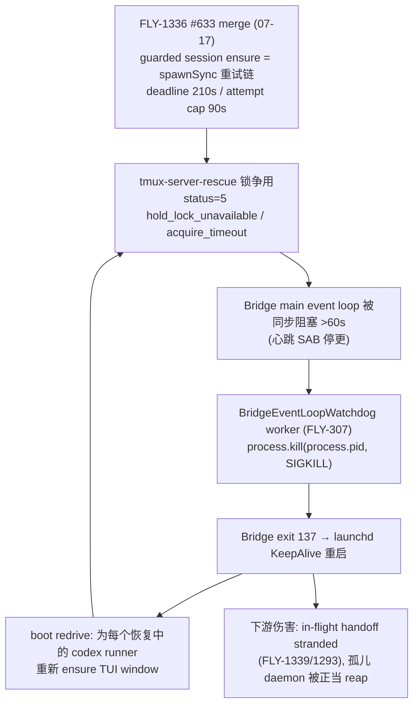

# FLY-1365 codex 组 SIGKILL 误伤 Bridge — 调研

Issue: FLY-1365 (URL 不可得,只写 issue 号)
日期: 2026-07-18
基于: exploration.md

本文档是 2026-07-18 事故（生产 Bridge exit 137 + 3 runner 受损）的完整取证记录与代码审计，
也是对 issue 原始根因叙事的更正。所有证据均为本机一手采集（log 原文、活体 ps、launchctl、
watchdog forensic log），可复核。

## 1. 真实死因链（已证明）



crash 循环的节奏 ≈ 启动耗时 + 60s stall + ≤5s watchdog check ≈ 2min10s，与实测重启间隔
（09:45:59 → 09:48:09 → 09:50:17 → 09:52:28）逐一吻合。

## 2. 证据清单

### 2.1 watchdog forensic log ↔ 每次重启逐条对时（决定性证据）

`~/.flywheel/bridge-watchdog.log`（`bridge_event_loop_stall` 条目）对
`/tmp/flywheel-bridge.log` 的 `[bridge-wrapper] Starting Bridge` 行（PDT = UTC-7）：

| watchdog stall (UTC) | stall 时长 | wrapper 重启 (PDT) | 备注 |
|---|---|---|---|
| 2026-07-17T08:38:42.640Z | 61.5s | 01:38:44 | escalation 995683 所在负载风暴 |
| 2026-07-17T16:39:14.901Z | 61.8s | 09:39:15 | **issue 引用的「09:39:15」其实是 07-17** |
| 2026-07-17T20:26:09.501Z | 62.3s | 13:26:10 | |
| 2026-07-18T16:36:40.910Z | 64.3s | 09:36:42 | **Annie 事故那次** |
| 2026-07-18T16:48:08.281Z | 62.6s | 09:48:09 | crash 循环 |
| 2026-07-18T16:50:16.563Z | 64.6s | 09:50:17 | crash 循环 |
| 2026-07-18T16:52:27.745Z | 64.5s | 09:52:28 | crash 循环 |

该 log 自 2026-06-27 起共 34 条 stall —— **watchdog 自杀是 Bridge「莫名 exit 137」的
长期主因**，不是 07-18 才出现的新现象；07-18 的新变量是 FLY-1336 的同步重试链让 stall
变得必然且成环。

`launchctl list` 佐证：`28163  137  com.flywheel.bridge`（job 上次退出码 137 = SIGKILL）。
排除外部凶手：07-18 无 JetsamEvent（最后一条是 07-17 18:12）、无 node crash report、
非 OOM（issue 已记录 47% free）。SIGKILL 来自进程自身的 watchdog worker（其设计即为
`process.kill(process.pid, "SIGKILL")`，见 `BridgeEventLoopWatchdog.ts:101`）。

### 2.2 死前签名：每一代 crash 的最后日志完全一致

07-18 四次 crash，死前最后几行都是（且**只**是）：

```
[CodexTmuxAdapter] runner-tui-window: guarded session ensure attempt 1 held (status=5): {"action":"hold_lock_unavailable","evidence":{"reason":"acquire_timeout"}}
[CodexTmuxAdapter] runner-tui-window: guarded session ensure attempt 2 held (status=5): ...
[CodexTmuxAdapter] runner-tui-window: guarded session ensure attempt 3 held (status=5): ...
（日志戛然而止 → [bridge-wrapper] Starting Bridge）
```

09:36:42 那代死前 4 个 attempt；09:45:59 那代 3 个；09:48:09 那代出现
`attempt 1, attempt 2, attempt 1` —— 两个 ensure 调用背靠背，同步阻塞是累加的。

### 2.3 escalation 与 Bridge 死亡的时间关系（否证因果）

log 里 `escalating to a group SIGKILL` 全量共 **16 次**（grep 计数）。逐条对重启行号：

- 与重启**毫无邻近关系**的：13 次（如行 331164-353902 一簇后 1.7 万行内无重启；
  最后一次 escalation 在行 1316771，其后 26.9 万行才有下一次重启）。
- 「紧跟重启」的 2 次强相关案例，时间差实测：
  - 行 995683（07-17）：escalation 后 Bridge 继续正常写日志 **~3.5 分钟**
    （08:35:09Z → 08:38:44Z 重启，期间有 session_started、Discord 调用等常规活动）；
  - 行 1119414（07-17）：escalation（~16:34:07Z，同段 EventFilter 时间戳）后继续
    **~5 分钟**（16:39:15Z 重启）。
- **07-18 09:36:42 事故 crash 前 ~31 万行日志内没有任何 escalation 行**
  （1316771 → 1626430 之间为空）。

`kill -9` 打中自己组 = 毫秒级即死、日志立断。「escalation 后还活 3-5 分钟」与
「事故当天根本没有 escalation」两条合起来，排除 escalation 是死因；它与 crash 的
共现只是同一负载风暴的并发症状（escalation 常伴 `goal run setup_failed:
request "turn/start" timed out` —— 同样是高负载表征）。

**误诊成因**：bridge log 的普通行不带时间戳，只有零星 JSON 行有 —— 两天的
`09:3x` 时刻在 grep 视图里无法区分，issue 把 07-17 的 escalation+重启对
（16:34→16:39Z）与 07-18 的重启（16:36:42Z）拼成了一条因果链。

### 2.4 进程组拓扑（活体实测，否证「同组」前提）

`ps -axo pid,pgid,ppid` 关键行：

```
28163 28163     1   npm exec tsx scripts/run-bridge.ts     ← launchd job 头，组长
30339 28163 28163   node tsx cli.mjs run-bridge.ts
30576 28163 30339   node …/run-bridge.ts                   ← Bridge 本体, pgid=28163（祖父的组）
 1265  1265 30576   bash flywheel-codex-with-fallback app-server …  ← daemon shim，detached 自领组
 1427  1265  1265   codex app-server --remote-control …    ← 真 daemon，在 shim 的组里
```

- daemon 由 `defaultSpawnFn` 以 `detached: true` 生成（`codex-daemon-runtime.ts:654`），
  自领进程组（组 = shim + app-server，别无他人）→ `killTree` 的
  `process.kill(-child.pid)` 结构上只能打到这个组。
- Bridge 死后 daemon 存活（ps 里大量 `ppid=1` 的孤儿 shim/app-server 组），
  「runner 进程被组杀连坐」不成立。
- reap 路径（`codex-daemon-runtime.ts:400-427`）要求两个独立 OS 事实
  （lsof 说 pid H 持有本 exec 私有 socket + ps 说 H 属于持久化的组）同时成立才杀，
  fail-closed，pid 复用不可满足。

### 2.5 阻塞源代码事实

- `codex-runner-tui-window.ts` 自述「this whole module is sync (a chain of spawnSync)」
  （`:272`），同步睡眠用 `Atomics.wait`（`:277`）。
- `defaultEnsureSession`（`:215-238`）：`FLYWHEEL_TMUX_ENSURE_DEADLINE_MS` 默认
  **210_000ms**，`FLYWHEEL_TMUX_ENSURE_ATTEMPT_TIMEOUT_MS` 默认 **90_000ms**，
  重试间 `sleep(min(1s, remaining))`。
- 调用点在 Bridge 进程内的 `CodexTmuxAdapter`（`:543` onThreadReady、`:752` fallback），
  boot redrive 对每个恢复中的 codex runner 都会走到。
- `tmux-server-rescue`（`~/.flywheel/bin/`，FLY-1285/FLY-1336 产物）`ensure` 子命令
  在守护锁 acquire 超时时输出 `{"action":"hold_lock_unavailable","evidence":
  {"reason":"acquire_timeout"}}` 并以 status 5 退出（脚本 `:822`）；其内部
  total budget 默认 60s 且按负载因子放大（最大 ×4）—— 单次 attempt 就可能吃满
  90s cap。
- 时间线：`git log -- codex-runner-tui-window.ts` → FLY-1336 加固
  （88a01487e，#633）**2026-07-17 merge**，事故前一天。

### 2.6 watchdog 设计事实

`BridgeEventLoopWatchdog.ts`（FLY-307）：main 线程每 1s 把 `Date.now()` 写进
SharedArrayBuffer；worker 线程每 5s 检查，心跳落后 >60s（`FLYWHEEL_BRIDGE_WATCHDOG_STALL_MS`）
即 append forensic 行到 `~/.flywheel/bridge-watchdog.log` 然后
`process.kill(process.pid, "SIGKILL")`。只杀自身进程，不杀组。
`FLYWHEEL_BRIDGE_WATCHDOG=0` 为 ops 逃生口。
**缺口**：forensic 行只有 stall 时长，没有「卡在哪」；无重启后归因（没人读这个 log —— 本次
误诊即因此）。

## 3. 审计发现的真缺陷清单

| # | 缺陷 | 严重度 | 是否本次死因 |
|---|---|---|---|
| D1 | guarded ensure 同步预算(210s/90s) 与 watchdog 阈值(60s) 结构性冲突，跑在 main loop 上 | P0 | **是** |
| D2 | watchdog 自杀无归因、无告警；bridge log 普通行无时间戳 → 自伤事故不可见/误诊 | P0 | 放大器 |
| D3 | `defaultKillGroup` guard 只挡 pid/ppid，挡不住 Bridge 真实 pgid（祖父 npm 领导的组）| P1 | 否（无触发路径，纵深防御） |
| D4 | `ensureDead` settle 2s 在 load 60+ 下太紧 → escalation churn（16 次全属此类） | P2 | 否 |

## 4. 相关 issue 边界

- FLY-1336：tmux rescue 饱和负载加固（本单修它的**执行位置**——不该在 main loop 同步跑；
  不动它的 rescue 语义。锁争用为何持续 ~20min 未在本单深挖，D2 落地后可观测）。
- FLY-1339 / FLY-1293：blink 后 implement handoff stranded / boot-reconcile boot-only
  —— 下游恢复问题，独立轨道。
- FLY-307：watchdog 本体，保留原设计（阈值不动），只加 breadcrumb + 归因出口。
- FLY-176 / FLY-239：历史上的 kill 误伤类 bug（pattern kill），与本次无关，但说明
  「kill 类代码必须结构性自保护」是本仓反复付学费的题 → D3 值得焊死。
