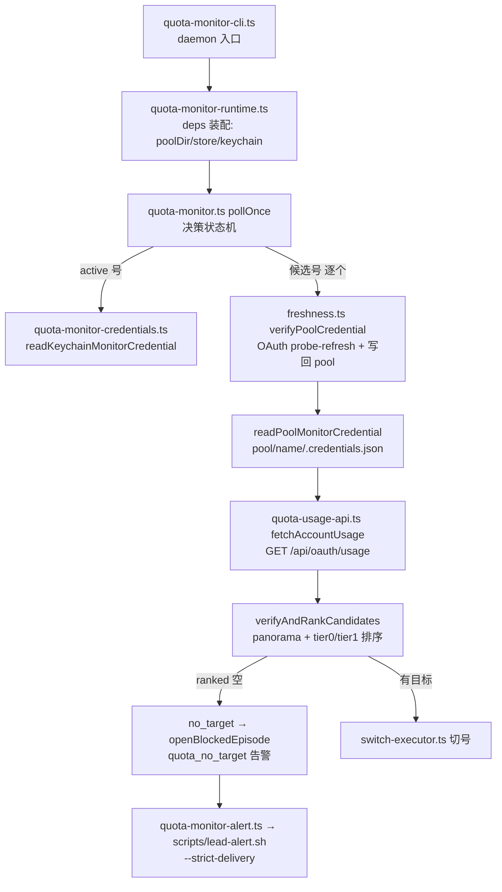

# FLY-1366 账号自愈探针失效 — 调研

Issue: FLY-1366 (https://linear.app/geoforge3d/issue/FLY-1366/bughigh-账号自愈切换失效panorama-探针-44-全失败usage-malformed3-freshness-stale-no)
日期: 2026-07-18
基于: exploration.md

## 1. 探针链路代码地图(packages/teamlead/src/account-heal/)

候选号探针顺序(`verifyAndRankCandidates`,quota-monitor.ts:457-639):not_in_pool/not_in_store/auth_unusable/switch_cooldown/model_bench → **freshness probe-refresh**(refresh=true → `verifyCandidate`,拒绝即 `freshness_stale`)→ 读回刷新后凭据 → **usage 探测**(`fetchUsage`,失败即 `usage_${error}`)→ 100% 判 exhausted → 按 trigger5hPct 分 tier0/tier1。class 映射(quota-monitor.ts:392-411):`usage_malformed`/`freshness_stale` → **unverifiable**(不可切,仅 degraded 兜底可用,而 degradedSwitch 默认 false 且生产 config 未设)。

## 2. R1 实证:usage 校验拒绝闲置账号

**校验器**(quota-usage-api.ts:39-56):`isQuotaWindow` 要求 `utilization` 有限数 ≥0 **且** `resets_at` 为可 `Date.parse` 的 string;`five_hour`/`seven_day` 任一不过 → `malformed`。

**真机探测**(2026-07-18 ~11:15 PDT,用 daemon 10:59 刚刷回 pool 的有效 token,只读,无 refresh):

| 号 | HTTP | five_hour | seven_day | 校验结果 |
|---|---|---|---|---|
| school | 200 | `utilization:0, resets_at:null` | `utilization:88, resets_at:"2026-07-20T15:59:59Z"` | **malformed**(five_hour null) |
| business | 200 | `utilization:0, resets_at:null` | `utilization:4, resets_at:"2026-07-23T02:00Z"` | **malformed**(同上) |
| personal1 | 200 | `utilization:17, resets_at:"2026-07-18T23:00Z"` | `utilization:25, resets_at:"2026-07-22T07:00Z"` | 通过(Annie 已切来在用,窗口激活) |

**API 语义:无活跃 5h 窗口(闲置)→ `resets_at: null`**。payload 还有 limits/spend 等字段,`five_hour.limit_dollars` 等皆 null——null 是该 API 的常规形态,校验器对 null 的零容忍是错误假设。personal1 的对照(用起来就通过)+ 事故时 4/4 全灭、今天它有窗口 → 反证链闭合。上游盲区:FLY-1256 research.md:22-23 的样本是活跃号(两窗口都有值);FLY-1182 沿用。

## 3. R2 实证:personal freshness_stale

freshness.ts `verifyPoolCredential`:读 pool `.credentials.json` → POST `console.anthropic.com/v1/oauth/token`(refresh_token grant)→ 成功即写回 rotated 凭据再放行;任何拒绝/异常 → `{fresh:"stale", reason}` fail-closed。**personal 的 pool 凭据 expiresAt=2026-07-17T10:48Z(已过期 >24h)**,其余三号每轮决策都被刷新到未来 8h(07-18 17:59Z 刷 → expiresAt 07-19 01:59Z)→ personal 的 refresh 每轮被拒,family 已死(典型成因:手动 claude /login 在别处 rotate 了 family,pool 副本未回存)。

观测性缺口(代码级确认):
- `readCandidateCredential`(quota-monitor.ts:291-312)只把 `verdict.fresh==="stale"` 折叠成裸 reason 字符串 `"freshness_stale"`,`verdict.reason`(如「refresh refused (HTTP 403)」)被丢弃;
- store `refreshTokenInvalid`(account-store.ts:53,isAuthUnusable 成分)唯一 writer 是 quota-pool-rebuild.ts:1047(置 false);freshness 拒绝无落库、无专项告警路径。

## 4. R3 实证:告警链路

quota-monitor-alert.ts:`quota_no_target` 路由 `{mention:true, severe:true}`(L57)→ `lead-alert.sh --strict-delivery`,mention 取 `FLYWHEEL_QUOTA_ALERT_MENTION_USER`(L157),severe 双投取 `FLYWHEEL_QUOTA_ALERT_SEVERE_CHANNEL_ID`(L165)。**daemon 实际 env(ps eww 88615 核对)两者皆未设**;告警落 `FLYWHEEL_UNIFIED_ALERT_CHANNEL_ID=1518793447165661254`(#flywheel-alerts)无 mention。log 佐证:事故窗口 `delivery=[{"kind":"quota_no_target","primary":"sent"}]` ×2(17:19 / 17:59,中间被 episodeRealertMinutes=30 去重)——实发成立、实收缺 mention。founder 可见的 `FLYWHEEL_FOUNDER_USER_ID=1138241636057481306` 已在 daemon env,可作 fallback。

## 5. F1 波及面全量清单(resets_at / resetsAt 消费点)

| 位置 | 现状 | null 后果 / 需要的处理 |
|---|---|---|
| quota-usage-api.ts:6-14 `QuotaWindow`/`ValidatedUsagePayload` | `resets_at: string` | 类型改 `string \| null`;`isQuotaWindow` 允许 null |
| quota-usage-api.ts:112-124 ok 构造 | `resetsAt: payload.*.resets_at` | 类型跟随 `string \| null`,透传 |
| quota-monitor.ts:180-185 `toObservation` | 直接投影 | 透传 null(类型改) |
| quota-monitor.ts:242-247 `operativeResetAt` | 返回 string | 返回 `string \| null`;调用点 L1679-1687(`resetAt as string` 进 SwitchInput)加守卫:trigger 触发时 active 号窗口必活,null=合同违例 → log `usage_reset_missing` + finish("error"),**不造假时间戳、不改 SwitchInput 类型** |
| quota-monitor.ts:600 `resetMs = Date.parse(sevenD.resetsAt)` | null→NaN 毒化排序 | `null → Number.NEGATIVE_INFINITY`(周窗未开=最早可用=排最前) |
| quota-monitor.ts:1770-1776 `reviveEpoch.expiresAt = Date.parse(resetAt as string)` | **第二个强转消费点**(切换成功后写 revive epoch),null→NaN 污染 epoch | 与 SwitchInput 共用同一前置守卫后用收窄变量,消灭 `as string`(Codex R1 #3) |
| quota-monitor.ts:589-598 exhausted 判定 | 只看 pct | 不动(pct 语义不变) |
| quota-guard-cli.ts:459-460 人读文案 | 字符串插值;仅在任一窗口 pct≥100 时被调用 | exhausted+null = 合同异常 → 文案「reset unavailable」,**保持 fail-closed exit 32**;健康闲置 null(pct 0)不进此路径,补 exit 0 测试 |
| quota-guard-cli.ts:608-609 投影 | 同 toObservation | 透传 |
| account-store.ts:90-96 `AccountQuotaObservation` | `fiveHResetAt/sevenDResetAt: string` | 改 `string \| null` |
| account-store.ts:385-423 `validFutureReset`/`applyObservation` | `Date.parse(string)` | 守卫已依赖 NaN 判定,`Date.parse(x ?? "")` 即兼容;quotaExhaustedUntil 仅在 pct≥100 且 reset 可解析时落值,闲置号(pct 0)不受影响 |
| account-ledger.ts(parseRateLimits) | statusline stdin 源,epoch 秒 | **不同数据源,不动** |
| statusline cache(writeStatuslineCache(usage.raw)) | 只写 active 号 raw | **切到闲置号后下一轮 cache 会写入 null**(「active 窗口常开」不成立——Codex R1 #7 纠正);本机 statusline 消费端 `jq ... // empty` 已验证 null-safe,plan C3 加 round-trip 测试固化契约 |

`SuccessfulUsage` 符号只存在于 quota-monitor.ts;state 持久化的是标量时间戳字段,**不**持久化整份 usage;raw payload 的真实传播点是 runtime 的 statusline cache writer(`writeStatuslineCache(usage.raw)`,见上行)。波及面收口:**4 个 src 文件 + 类型传播**。

## 6. 测试现状与缺口

- `quota-usage-api.test.ts`:已有 malformed/网络/401/429 分支;**缺**:inactive-window fixture(用本次真抓 payload,含 null 与全量杂字段)→ 必须从红变绿。
- `quota-monitor.test.ts` + `quota-monitor-test-helpers.ts`(usage(five,seven,…) helper 构造 resets_at):**缺**:候选号闲置(five_hour null)时 panorama=qualified、进 tier0、切换成功的 e2e;sevenD null 排序案例。
- null 补充覆盖归属:守卫场景在 quota-monitor.test.ts、store 投影在 account-store 相关测试、statusline cache null round-trip 在 runtime 侧——**不在** quota-monitor-state.test.ts(state 不存整份 usage)。
- 突变纪律(memory 教训):新增负向断言(如「不再出现 usage_malformed」)必须配阳性对照(旧校验下同 fixture 确实红)。

## 7. 部署与运维链路(ship 段依据)

- launchd `com.flywheel.quota-monitor`:**loaded job 的 plist(≠ ~/Library 磁盘上现存副本)把 wrapper(FLY-1182 副本)+ `FLYWHEEL_DIR`/`FLYWHEEL_QUOTA_MONITOR_BIN`/`FLYWHEEL_QUOTA_MONITOR_DIST`/`FLYWHEEL_CLAUDE_PROFILE_BIN` 四键经 EnvironmentVariables 硬钉在 FLY-1182**(`launchctl print` 实证;同 engineering/doc/FLY-1182-quota-switch-ignition/evidence/candidate-quota-monitor.plist);wrapper 会在 source `~/.flywheel/.env` 后**恢复** launchd 预注入的 `FLYWHEEL_(QUOTA|CLAUDE)_*`(wrapper.sh:11-38),`kickstart` 只重启不重载 plist → **「改 .env + kickstart」不能部署到 main,必须 bootout + bootstrap 主仓 plist**(Codex R1 #1;可复用 scripts/setup-quota-monitor.sh:287-346 流程)。wrapper 有 crash-streak fail-loud;健康证据看 `~/.flywheel/quota-monitor.health.json`(PID/processStartTime/runtimeTreeSha256/outcome)。
- 生产现状(2026-07-18 11:1x PDT):daemon 每 10min `identity_conflict`(.active=shopping vs keychain=personal1,Annie 11:00 手切)→ panorama 停转。**pre-QA 运维步骤(gate 补充 A):不是只改 .active** —— 需按 plan §3 的采认事务:先 `flywheel-claude-profile verify <label> --source keychain` 验真 Keychain token 对 anchor(只读,verdict=match 才继续),再同一 accounts lock 内 .active + `syncActiveAccountInStore` 双写并锁内重验三方见证;runner 执行、留证、锁内可回滚、提交后只 roll-forward。
- `~/.flywheel/quota-monitor.json`:trigger5hPct 90 / accelerated 10min / order 含全 5 号 / 无 degradedSwitch 键(默认 false,不动)。
- store `~/.flywheel/claude-accounts.json`:generation 5,备选号标记全干净,shopping 正确标 exhausted until 19:49Z。

## 8. Follow-ups(不进本单)

1. degradedSwitch 兜底是否开启(FLY-1182 决策域,Annie/Lead 决策);
2. freshness 连续拒绝 N 次 → 自动落 refreshTokenInvalid + 专项 re-login 告警(候选资格判定变化);
3. identity_conflict 手动切号后自动收敛(FLY-865 域;本次以运维对齐处理);
4. personal 号复活(运维:重登 + claude-profile save personal)。
