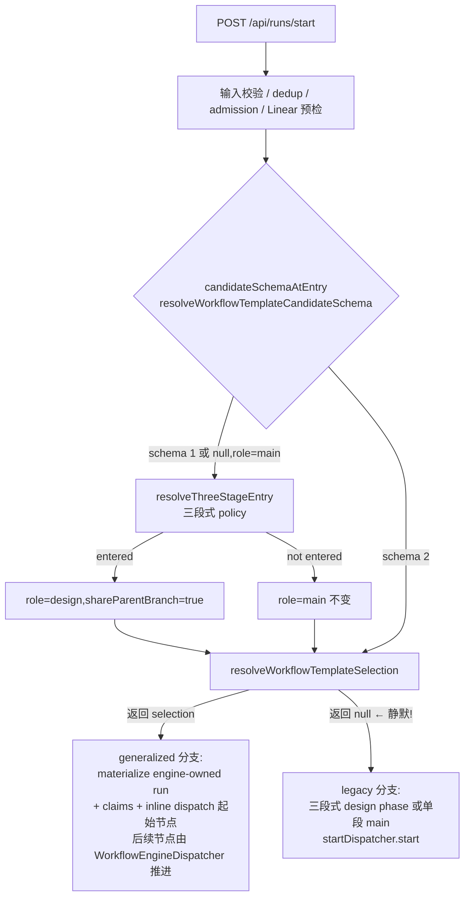

# FLY-1372 DAG 派单入口接线 — 探索

Issue: FLY-1372 (https://linear.app/geoforge3d/issue/FLY-1372/dag-接线派单入口-dag-引擎runsstart-加-dag-路由分支新单送进-workflowenginedispatcher)
日期: 2026-07-18
基于: 无

## 1. 问题定义

DAG 引擎(`WorkflowEngineDispatcher`)、模板(`tpl_eng_heavy/light/trivial`)、4 个 flag 全部建好,
但派单入口 `/api/runs/start`(`packages/teamlead/src/bridge/runs-route.ts`)没有任何分支把一张
**普通新单**送进 DAG 引擎。2026-07-18 晚实证:4 个 DAG flag 全 ON、Bridge 从 main 跑、flag 在
进程 env,fresh dispatch(FLY-802)仍走 legacy 三段式,`workflow_claims` 0 行。

Annie 拍板:接线,让新单真正跑 DAG。灰度只对 flywheel 项目;flag OFF 字节不变;不删 legacy 代码。

## 2. 现状审计(代码 + 生产库铁证)

### 2.1 路由树现状(runs-route.ts POST /start)



### 2.2 静默降级 legacy 的确切根因

`workflow-template-selection.ts` 对 schema-v1 候选的两道闸(131-134 行):

```ts
if (schemaVersion === 1) {
    if (input.allowSchemaV1Dispatch !== true) return null;   // 只有三段式 entry 才置 true
    if (!input.idempotencyKey?.trim()) return null;          // Lead 派单从不传这个字段
}
```

两道闸任一不满足 → **静默 `return null`** → 走 legacy。生产事实:

| 事实 | 证据 |
|------|------|
| 每个项目已有 `*` → `tpl_eng_heavy` binding | `~/.flywheel/teamlead.db` `workflow_category_binding`(seed = `system:bundled-default`, 2026-07-16) |
| 模板已发布,schema v1,节点 design→implement→qa | `workflow_template_revision`:design=claude/fable, implement=codex/gpt-5.6-sol/xhigh, qa=claude/opus |
| 4 flag 全 ON 时 predicate 通过 | `workflowTemplateDispatchBlockReason(1, env)` 只查 dispatch+claims_write+claims_read |
| FLY-802 走了三段式 + `workflow_claims` 0 行 | 三段式 entry 置了 `allowSchemaV1Dispatch=true`,但 **idempotencyKey 缺失** → null → legacy 三段式 |

结论:**不是 flag 不通、不是 binding 缺失,是 v1 选择函数把"Lead 没传 idempotencyKey"当成
"留在 legacy"的信号静默降级**。这正是 issue 说的"路由树没有分支通向 DAG"的机制形态。

### 2.3 已有的 DAG 执行面(不用新建)

- 入口物化:`resolveWorkflowTemplateSelection` → `store.materializeWorkflowRun`(engine_owned、
  claims 路径、start reservation、per-category binding 选择)。
- 起始节点派发:runs-route 的 generalized 分支(826-1132 行)inline dispatch,launch-owner
  单写者闸防双跑;`WorkflowEngineDispatcher`(1s reconcile)消费后续 dispatch outbox 行。
- 权威收口:claims-backed ship eligibility(claims_read flag)。

### 2.4 周边约束

- `/api/runs` 挂 `tokenAuthMiddleware(apiToken, geminiAgentToken)`;Lead 派单带 master
  `apiToken` → `requestAuthKind="master"`;gemini-agent 用 scoped token。
- selection 对进入 DAG 的请求要求 master auth(非 master 直接 throw)。
- ConfigLoader 校验 `pipeline` 块:只类型检查已知键,**未知键忽略** → 老代码读带新键的
  config.yaml 安全(部署窗口无风险)。
- `loadPipelineConfigByProject` 每次请求从 canonical root 现读 config.yaml(改配置不用重启;
  改代码要重启 Bridge)。
- flywheel `.flywheel/config.yaml` 已有 `pipeline.three_stage: true` + `three_stage_channels`。

## 3. 方案选项

### 选项 A(推荐):runs-route 加「问题⓪」分支 + config 键 `pipeline.dag`

在三段式 entry 决策**之前**判定 DAG 入口:

```
dagEntry = role === "main"
        && requestAuthKind === "master"
        && pipelineConfig.dag === true                       ← 项目级灰度名单(config 驱动)
        && !labels.includes("no-three-stage")                ← 单级逃生口(见假设 A1)
        && candidateSchema != null
        && workflowTemplateDispatchBlockReason(candidateSchema, env) === undefined  ← 复用 fail-closed 谓词
```

dagEntry 成立 → **跳过三段式 entry 块**,直接进已有 generalized 选择/派发路径,补两件事:
1. `allowSchemaV1Dispatch: true`(DAG run 自含 design→implement→qa 节点,不需要三段式 policy 改写角色);
2. Lead 未传 `idempotencyKey` 时合成一个(随机,重试保护交给 active-run reconciliation hold)。

dagEntry 成立但选出不了候选/物化失败 → **409 机器可读错误,绝不静默回 legacy**(今晚事故的
病根就是静默降级,不能再造一个)。

灰度名单 = 新 config 键 `pipeline.dag: true`(ConfigLoader 校验 boolean,absent=off 字节兼容),
本 PR 同时在 flywheel `.flywheel/config.yaml` 落 `dag: true`;GeoForge3D 等项目不加键零影响。

- 优点:复用全部已有执行面(选择/物化/claims/引擎/launch 闸),diff 集中在 runs-route 一处 +
  config 层两小块;回退 = 关任一 DAG flag 或删 config 键,无需回滚代码。
- 缺点:runs-route 又多一个分支(但它本来就是路由决策的家,"问题⓪"语义就该在这)。

### 选项 B:改 `resolveWorkflowTemplateSelection` 放宽 v1 闸(enrolled 项目自动补 key)

把项目名单判断塞进 selection 函数内部。缺点:selection 是纯函数、被 route 和引擎共用,塞进
HTTP 层的 auth/项目灰度语义会污染它的职责边界;fail-closed 语义也变得难断言。**不推荐**。

### 选项 C:Lead 侧改派单参数(教 Lead 传 idempotencyKey + taskCategory)

不改 Bridge,改 Lead 规则让它带参数。缺点:行为靠提示词不靠机制,恰是 FLY-1372 要根治的
"看起来全 ON 实际走 legacy";且所有派单方(cron/scheduler/手工 curl)都要跟着改。**不推荐**。

## 4. 推荐

**选项 A**。理由:机制级接线、复用已验证执行面、回退面干净、diff 面最小。

## 5. 关键假设(brainstorm gate 呈报)

- **A1 `no-three-stage` label 同时豁免 DAG 入口**:v1 DAG 模板就是三段式的引擎实现
  (design→implement→qa 三节点);该 label 的意图是"这单单段直跑"。若不豁免,挂了
  label 的单(如 FLY-1372 本单)会被 DAG 拆成三段,违背 label 语义。豁免后这类单落
  legacy 单段,行为与今天一致。
- **A2 config 键名 `pipeline.dag`**:与 `pipeline.three_stage` 同块、同 loader、同
  canonical-root 信任链;不新建顶层块。
- **A3 非 master auth 不进 DAG**:gemini-agent(scoped token)与 tokenless 请求照旧走
  legacy,保 QA 工具路径零回归;selection 的 master-auth 不变量也不用动。
- **A4 idempotencyKey 合成为每请求随机**(`dag-auto-<uuid>`):确定性 per-issue key 会
  让二次 fresh 派单永远撞上旧 reservation 的缓存响应;随机 + `getActiveWorkflowRunForIssue`
  hold(409)已防双跑。
- **A5 role !== "main" 不进 DAG**:auto-QA(`qa` role)与三段式 phase handoff 派发照旧。
- **A6 显式 `designBackend` 与 DAG 入口互斥**:模板已钉每节点 vendor/model,静默忽略显式
  参数违反 loud-failure 铁律 → 400 `DESIGN_BACKEND_NOT_APPLICABLE`(新 reason `dag_dispatch`)。
- **A7 DAG 分支补 parked-phase 防撞**:`getActivePhaseSessionForIssue` 非空 → 409(旧单
  park 着的三段式 phase 会话不能与新 DAG run 撞同一 issue)。

## 6. 风险

| 风险 | 缓解 |
|------|------|
| enrolled + flags ON 但物化路径有隐 bug → 派单 409 卡住 | 回退 = 关 1 个 flag 或删 config 键,立即整体退回 legacy(无代码回滚);错误码机器可读,Lead 一眼可诊 |
| 部署窗口(config.yaml 先落、Bridge 未重启) | 老代码忽略未知 `pipeline.dag` 键(已验证 ConfigLoader 行为);merge → 一次重启完成切换 |
| DAG run 与 legacy 三段式会话撞单 | A7 的 409 防撞 + `getActiveWorkflowRunForIssue` hold |
| v2 模板未来接入 | 谓词按候选 schema 调用(schema 2 自动多查 generalized flag),分支代码零改动 |
