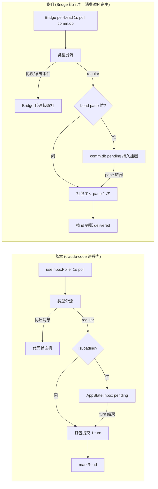

# FLY-1373 消息系统消费循环照抄 — 探索

Issue: FLY-1373 (https://linear.app/geoforge3d/issue/FLY-1373/消息系统-照抄-claude-code-消费循环-lead-收件全链路根治1s轮询销账语义忙时挂起批量投递类型分流)
日期: 2026-07-19
基于: 无

---

## 1. 背景与问题

2026-07-18 深夜 Lead 丢消息/延答事故复盘后,Annie 直令:**读 claude-code 的 Agent-team 实现,「完全模仿他去做」**。

考古结论(commit 铁证,已在本 worktree 验证):`0632f5d1a`(GEO-206, 2026-03-22)把 Runner↔Lead 通信从 claude-code 原生文件信箱搬进自建 SQLite comm.db —— **信箱(存储)搬了,但消费循环那半边没搬**:

- 蓝本消费侧 = 1s 硬轮询 + 类型化分流 + 忙时挂起 + 批量投递 + **处理完才销账**;
- 我们只有「投递即销账 / 靠事件触发 + 慢轮询兜底」的半套,丢消息与延答成为结构性风险;
- 之后 4 个月的 watchdog 层(FLY-10→83→159→195→208→1048→1282→1365…)全是围绕这个缺口打的补丁,补丁自身又产生假警报(FLY-193/218/220 全是治 watchdog 误报的单)。

**本单 = 抄完原厂设计的消费循环那半边 + 反向禁用补丁层(先禁后删)。**

## 2. 蓝本解剖(第一手精读,行号为 /Users/xiaorongli/Dev/claude-code 当前源码实测)

### 2.1 `src/hooks/useInboxPoller.ts`(970 行)— 消费循环主体

| 机制 | 行号 | 内容 |
|------|------|------|
| 1s 硬轮询 | L107, L952-954 | `INBOX_POLL_INTERVAL_MS = 1000`;`shouldPoll = enabled && !!agentName` gating,`useInterval(poll, shouldPoll ? 1000 : null)` |
| 挂载即首拉 | L956-968 | mount 时立即 poll 一次(ref 防重),不等第一个 tick |
| 每轮拉全部未读 | L139-152 | `readUnreadMessages(agentName, teamName)`,空则直接 return |
| 安全校验 | L156-196 | plan-approval response **只认 `msg.from === 'team-lead'`**,其他来源记日志忽略(防伪造批准) |
| 类型化分流 | L204-248 | 逐条判型分 10 桶:permission req/resp、sandbox req/resp、shutdown req/approval、team-permission-update、mode-set、plan-approval-req、**regularMessages**。只有 regularMessages 进模型,其余全走代码状态机 |
| 幂等消费 | L338-345 | permission request 入 ToolUseConfirmQueue 前按 `toolUseID` 去重 —— 注释明说:**markRead 失败会导致下轮重读同一条,消费者必须幂等** |
| 纯协议轮也销账 | L802-808 | 本轮只有协议消息、无 regular 消息时,处理完同样 markRead |
| 忙/闲分支 | L843-858 | 闲(`!isLoading && !focusedInputDialog`)→ 全部 regular 消息打包成**一个** turn 立即提交;提交被拒(query 已在跑)→ 转入 pending 队列;忙 → 挂 pending 收件箱 |
| **防丢的灵魂** | L860-864 | 原文注释:「Mark messages as read only after they have been successfully delivered or reliably queued … if we crash before this point, the messages will be re-read on the next poll cycle instead of being silently dropped」—— **投递成功或可靠入队之后才销账;崩溃则下轮重读,绝不静默丢** |
| turn 结束批量投递 | L876-950 | idle effect:所有 pending 消息格式化为一个批量 turn 提交;**提交成功才按 id 清除**,失败保留重试;已在 turn 中作为 attachment 投递过的(`processed`)只做清理 |
| 投递格式 | L810-820 | 每条包 `<teammate-message teammate_id="..." color summary>` XML 标签,`\n\n` 连接 |

### 2.2 `src/utils/messageQueueManager.ts`(548 行)— 统一命令队列

| 机制 | 行号 | 内容 |
|------|------|------|
| 单队列设计 | L40-51 | **所有**命令(用户输入、任务通知、orphaned permission)进同一个 module 级队列,React 与非 React 消费者共用 |
| 优先级入队 | L128-149 | `enqueue` 默认 `'next'`(用户输入);`enqueuePendingNotification` 默认 `'later'`(系统通知)——**用户永不被系统消息饿死** |
| 优先级出队 | L151-193 | `now(0) > next(1) > later(2)`,同级 FIFO;支持 filter 谓词;`peek`(L219-238)同规则 |
| 辅助语义 | L244-328, L428-484 | `dequeueAllMatching` / `remove` / `clear`;`popAllEditable`:用户可把可编辑命令拉回输入框,系统通知(raw XML)永不漏进输入框 |

### 2.3 `src/utils/teammateMailbox.ts`(1184 行)— 信箱读写/标读语义

| 机制 | 行号 | 内容 |
|------|------|------|
| 存储形态 | L1-8, L56-66 | 每 agent 一个 JSON 文件 `~/.claude/teams/{team}/inboxes/{agent}.json`(**我们不抄这层,保 comm.db**) |
| 消息结构 | L43-50 | `{from, text, timestamp, read, color?, summary?}` — 单布尔 `read` 位 |
| 写入 | L134-192 | lockfile 串行化(重试退避 L35-41),create-if-missing,append `read:false` |
| 读未读 | L115-125 | 全量读 + `filter(!read)` |
| 全量标读 | L279-342 | lock → 重读 → **全部**置 `read:true` → 写回 |
| 谓词标读 | L1101-1142 | `markMessagesAsReadByPredicate` — 只标匹配的,其他保持未读 |
| 协议消息判定 | L1073-1095 | `isStructuredProtocolMessage`:10 种 JSON `type` 枚举 |

### 2.4 issue 描述与源码的出入核对(以源码为准)

逐处对照后,issue 引用的行号与语义**全部吻合**(L107 / L139-152 / L216-248≈L204-248 / L843-858 / L876-950 / L860-864 / L128-149 / L151-193),无实质出入。一个值得记录的蓝本细节:

> **蓝本的 `markMessagesAsRead` 是全量标读**(L318 `for (const m of messages) m.read = true`)——理论上存在「readUnreadMessages 返回后、markRead 前新到达的消息被顺带标读」的极小窗口。蓝本自己也提供了按谓词标读(L1101)。我们落 SQLite 时**应按消息 id 精确销账**(`WHERE id IN (...)`),严格优于蓝本、语义意图一致。这不算「照抄打折」,是存储层换 SQLite 后的自然强化。

## 3. 我们与蓝本的结构差异 — 消费循环落在哪一层?

蓝本的消费循环跑在 **claude-code 进程内部**(React hook,直接知道自己 `isLoading` 与否、直接 `onSubmitMessage` 进自己的 turn 循环)。我们的 Lead **本身就是** claude-code session(tmux pane),但消息在 comm.db 里,claude-code 进程对它一无所知。角色映射:

关键对应关系(候选方案,research 阶段验证细节):

| 蓝本概念 | 我们的对应物 | 备注 |
|----------|--------------|------|
| `useInboxPoller` 宿主进程 | **Bridge**(Node 常驻进程) | Lead 的 claude-code 进程我们改不了,Bridge 是唯一能跑 1s 循环的自有运行时 |
| `readUnreadMessages` | comm.db `SELECT ... WHERE 未销账` | WAL + 索引,单消费者微秒级 |
| `isLoading`(忙检测) | **live-region idle 识别器**(FLY-193 已建,生产验证过) | 现成资产:锚定 pane 底部渲染区判闲/忙 |
| `onSubmitMessage`(提交 turn) | tmux 注入 pane(现有 wake/send 通道) | 提交失败(注入失败)→ 保留队列重试,同蓝本 L846-853 |
| `AppState.inbox` pending(内存) | comm.db 持久 pending 状态 | **强于蓝本**:Bridge 崩溃 pending 不丢 |
| `markMessagesAsRead` | comm.db 按 id 置销账列 | 投递成功后才置位 |
| `messageQueueManager` 优先级 | comm.db priority 列 + 出队 SQL 排序 | founder > gate/提问 > 报告 > 遥测 |
| 类型分流的「协议消息」 | Bridge 事件(session_completed、gate、ack…) | 走 Bridge 代码状态机,不进 Lead 模型 |

## 4. 已拍板项(Annie 直令,不再讨论)

1. **存储不抄**:保留 comm.db(SQLite WAL)。抄的是「循环/语义」,不是「存储」。
2. **1s 轮询负载**:定案「不会压垮 DB,差几个数量级」——本地 WAL、带索引小表、单消费者,1 Hz 读对 SQLite 完全无感;蓝本同样是 1s 拉文件。
3. **空闲自适应节奏**:活跃态(有 live session 或 pending>0)= 1s;空闲态(零 session + 队列空)= 30-60s 慢心跳;**门铃(push)到达 = 立即唤一次拉**。
4. **开关策略两层相反**:照抄部分(信箱 pull 全套)**不做 feature flag,直接替换打开**;现有 watchdog 整套 = **反向 flag 默认 DISABLE**(先禁后删);唯一保留 = 消费循环心跳(循环 X 分钟没跑 → 报 founder,一行报警)。
5. **双重身份**:本单必须作为 **DAG pilot** 在 FLY-1372 引擎上跑(`workflow_claims` 写进行 + DAG 节点窗口)。
6. **一并折入**:comm.db deadline 列(队列原生 SLA);gate 类 API 层拒绝 Lead-ack(founder 绑定保护)。

## 5. 照抄清单 → 设计要点展开

1. **1s 硬轮询进运行时**(+ 自适应节奏):Bridge 内 per-Lead 消费循环;活跃 1s / 空闲 30-60s / push 即唤。
2. **处理完才销账**(at-least-once):新销账语义列;投递成功或可靠入队(持久 pending)后才置位;Bridge 崩溃重启 → 未销账全量重读重投。**Bridge 事件同入持久账本**(所有 producer 写 comm.db 统一队列,不再有内存态事件裸奔)。消费侧幂等(蓝本 L338-345 同款按 id 去重)。
3. **忙时挂起收件箱**:pane 忙(live-region 判定)→ 消息持久挂起,不注入、不销账为「已消费」。
4. **批量打包投递**:pane 转闲 → pending 全量按优先级打包为一次注入(蓝本「一个 turn」);逐条注入 n 次是事故源(打断/交错)。
5. **类型化分流**:协议/系统事件走 Bridge 代码状态机,只有需要 Lead 判断的消息进 pane;安全校验同款(批准类只认绑定来源——我们对应 founder 绑定,gate API 层拒 Lead-ack)。
6. **优先级落库**:priority 列,founder > gate/提问 > 报告 > 遥测;同级 FIFO;高优先级永不被低优先级饿死(蓝本 now/next/later 的推广)。

## 6. 待 research 阶段回答的问题

1. comm.db 现有 schema 与销账/投递语义现状(delivered_at、ack、mailbox 双写)→ 新列怎么加、迁移怎么做、哪些旧列退役。
2. 现有 GatePoller/投递路径全图 → 新消费循环替换哪些代码路径、保留哪些(送 Discord 的出站路径不在本单)。
3. watchdog 全清单(FLY-10/83/92/159/172/195/208/270/1048/1282/1365…)→ 反向 flag 的圈定范围、每个的禁用安全性。
4. 忙检测复用 live-region 识别器的接口形态;注入通道(tmux send)现状与失败语义。
5. gate respond API 的 founder 绑定校验现状 → Lead-ack 拒绝加在哪一层。
6. 门铃(push 唤醒)现状:mailbox wake(FLY-142/168)能否直接当门铃用。
7. DAG pilot 验收:workflow_claims 证据怎么留。
