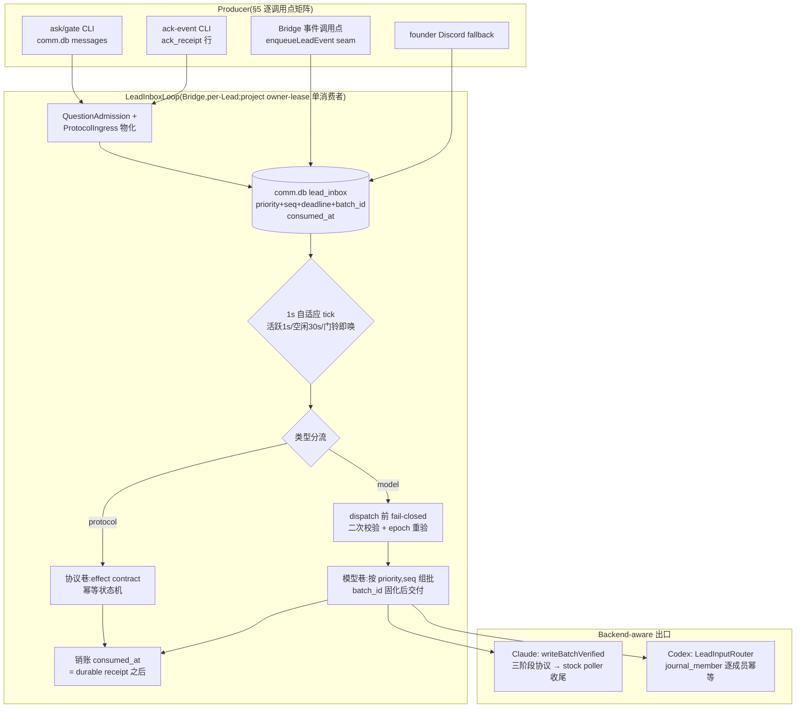

# FLY-1373 消息系统消费循环照抄 — 实施计划

Issue: FLY-1373 (https://linear.app/geoforge3d/issue/FLY-1373/消息系统-照抄-claude-code-消费循环-lead-收件全链路根治1s轮询销账语义忙时挂起批量投递类型分流)
日期: 2026-07-19
基于: research.md

**Status**: codex-approved(Codex design review 8 轮 APPROVED,R1-R7 共 28 条反馈全部采纳)
**Version**: v1.5x.0(暂定,ship 时取空号)

---

## 0. 一句话方案

在 Bridge 内为每个 Lead 建一条**蓝本同构的消费循环**(`LeadInboxLoop`),以 comm.db 新表 `lead_inbox` 为**唯一持久投递账本**:1s 自适应轮询 → 准入物化(question + protocol ingress)→ 类型分流 → 优先级排序 → **原子批量** durable 交付(per-backend adapter)→ **durable 交付确认后才销账**;Claude Lead 终端跳交给 stock `useInboxPoller`(蓝本本体,已在生产)收尾。旧投递 watchdog 按 **alert-lane 粒度**套反向 flag 默认 DISABLE,只留 per-Lead 消费循环心跳报警。

### 蓝本 → 实现映射总图



## 1. 蓝本 6 件 → 落点清单(逐处对照)

| # | 蓝本(行号见 exploration §2) | 我们的落点 | 与蓝本的偏差(均为强化,语义同) |
|---|---|---|---|
| 1 | 1s 硬轮询 + shouldPoll gating + 挂载首拉(useInboxPoller L107/L952-968) | `LeadInboxLoop` per-Lead tick:活跃 1000ms,空闲 30s,门铃即唤;Bridge boot 完成 owner lease 接管 + reconcile 后即首拉 | 自适应节奏是 Annie 拍板的附加(蓝本恒 1s) |
| 2 | 处理完才销账(L860-864 灵魂注释) | `consumed_at` 列;**durable 交付 receipt 后**置位(Claude=三阶段原子批量写;Codex=journal_member 逐成员 accept);崩溃→未销账行下轮重读重投 | 按 id 精确销账;幂等消费=蓝本 L338-345 的 toolUseID 去重 → 我们用 canonical delivery id + legacy alias(§3.5) |
| 3 | 忙时挂起(L843-858 busy→AppState.inbox pending) | Claude 终端跳由 stock poller 原生忙挂起;Codex 由 `LeadInputRouter` busy 串行排队;Bridge 层 pending=未销账行(**持久**) | 蓝本 pending 在内存,我们崩溃零丢 |
| 4 | turn 结束批量打包为一个 turn(L876-950;蓝本只保证「某次 poll 读到的 unread 快照」合为一 turn) | `writeBatchVerified` 三阶段协议(§3.4):一次 inbox lock 内 all-or-nothing 追加整批 → stock poller 单次 poll 必见整批 → 单 turn;Codex 侧一批 = 一次 submit(journal_member 保逐成员账) | 逐条独立写不能保证单 turn(R1#2);单条大 payload 幂等键漂移(不做);batch 成员集在交付前**固化**(R2#3) |
| 5 | 类型化分流(L204-248 十桶;安全校验 L156-196 只认 team-lead) | `msg_class` protocol/model + 分流表(§4)+ protocol effect contract(§4.1);批准类只认 founder 绑定,API 层拒 Lead-ack(§6) | 分流原则逐字照抄:协议走代码,只有 regular 进模型 |
| 6 | 优先级 now>next>later + 同级 FIFO + 用户不饿死(messageQueueManager L128-193) | `priority INTEGER`(0=founder,1=gate/提问,2=报告,3=遥测)+ `seq AUTOINCREMENT` 同级 FIFO;founder 永远先出队;`ask --report`(kind='report')映射 P2 | 蓝本 3 级我们 4 级;FIFO 用单调 seq;v1 不做 P3 折叠(R1#4) |

## 2. Schema 与迁移(comm.db,additive)

### 2.1 `lead_inbox` + owner lease + per-Lead heartbeat

```sql
CREATE TABLE IF NOT EXISTS lead_inbox (
  seq          INTEGER PRIMARY KEY AUTOINCREMENT,
  id           TEXT NOT NULL UNIQUE,      -- canonical delivery id,**含 namespace+Lead 域**(R3#1;§3.5):
                                          -- 'question:<leadId>:<qid>' / 'lead_event:<leadId>:<eventId>' / 'ack:<leadId>:<receiptMsgId>'
                                          -- (lead_events 真实唯一键是 (lead_id,event_id),两个 Lead 可共用同一 eventId——裸 eventId 全表 UNIQUE 会吃掉第二个 Lead 的合法行)
  to_lead      TEXT NOT NULL,
  source       TEXT NOT NULL,             -- cli_question|ack_receipt|bridge_event|guardrail|founder_relay
  type         TEXT NOT NULL,
  msg_class    TEXT NOT NULL CHECK (msg_class IN ('protocol','model')),
  priority     INTEGER NOT NULL CHECK (priority BETWEEN 0 AND 3),
  content      TEXT NOT NULL,
  ref_message_id TEXT,                    -- 关联 messages 行(question/ack 类)
  legacy_alias TEXT,                      -- cutover reconcile 命中的旧版 sidecar key(探测集合见 §3.5,含全部历史 attempt)
  batch_id     TEXT,                      -- 交付批次(提交前固化,immutable;R2#3)
  created_at   TEXT NOT NULL DEFAULT (strftime('%Y-%m-%dT%H:%M:%fZ','now')),
  deadline_at  TEXT,                      -- 严格 UTC ISO;enqueue 同事务从来源复制
  attempts     INTEGER NOT NULL DEFAULT 0,
  last_error   TEXT,
  claimed_by   TEXT,                      -- owner epoch
  claim_expires_at TEXT,                  -- 行级 claim 过期(R2#2)
  disposition  TEXT,                      -- delivered|revoked_superseded|revoked_answered|migrated|quarantined
  delivered_at TEXT,
  consumed_at  TEXT
);
CREATE UNIQUE INDEX IF NOT EXISTS idx_lead_inbox_ref ON lead_inbox(ref_message_id) WHERE ref_message_id IS NOT NULL;
CREATE INDEX IF NOT EXISTS idx_lead_inbox_pending ON lead_inbox(to_lead, priority, seq) WHERE consumed_at IS NULL;

-- owner lease(project 级单行)与 loop 健康(per-Lead)分表 —— cardinality 不同(R2#6)
CREATE TABLE IF NOT EXISTS loop_owner (
  singleton        INTEGER PRIMARY KEY CHECK (singleton = 1),
  owner_epoch      TEXT NOT NULL,
  lease_expires_at TEXT NOT NULL,
  renewed_at       TEXT
);
CREATE TABLE IF NOT EXISTS loop_heartbeat (
  lead_id          TEXT PRIMARY KEY,
  last_started_at  TEXT,        -- tick 进入
  last_success_at  TEXT,        -- tick 全流程成功;失败 tick 不刷新
  stall_episode_at TEXT         -- durable episode latch
);
```

### 2.2 `messages.deadline_at` 与 rebuild 陷阱(R1#6)

`messages` 加 `deadline_at TEXT`,**四处同步**:① fresh `SCHEMA`(db.ts:18-40)② `applyMigrations` 幂等 ADD ③ **`migrateMessageTypeConstraint()` 重建 DDL + SELECT 拷贝清单**(db.ts:553-607,漏加 = 旧库升级静默丢列)④ `types.ts` `Message` 接口。迁移顺序测试三路径(新库直建 / 先 ADD 后 rebuild / 先 rebuild 后 ADD)+ 并发 opener 幂等。

### 2.3 为什么不落 StateStore

lead_events 在 sql.js(FLY-663 病灶);comm.db 是 better-sqlite3 WAL。`lead_events` 保留为审计镜像;**`lead_events.delivered_at` 只由 loop 在真实 adapter receipt 后统一标记**,任何 caller 不得在「仅入队」时标记(queued ≠ delivered,R2#4)。

## 3. LeadInboxLoop(新组件,`packages/teamlead/src/bridge/lead-inbox-loop.ts`)

### 3.1 节奏(照抄件 1)

```
state: active | idle
active := 项目有非终态 session || pending 行 > 0 || 距上次门铃 < 60s
tick 间隔: active → 1000ms;idle → 30_000ms
门铃 nudge(): 立即 tick 并转 active 观察窗;丢门铃绝不丢消息
Bridge boot: owner lease 接管 → 原子禁 legacy → reconcile → 首拉(§3.5)
重入护栏: tick 内 if(running) return
```

门铃:进程内 producer enqueue 后调 `loop.nudge()`;CLI(ask/gate/ack-event)写库后 best-effort `POST /api/lead-inbox/nudge`(200ms 超时)。**CLI 的 nudge 与 `--deadline` 参数面是实际改动项**(S1)。

每 tick:per-Lead 进入时 stamp `loop_heartbeat[lead].last_started_at`;该 Lead 全流程成功才 stamp `last_success_at`。

### 3.2 tick 主体(照抄件 2/5/6)

```
0. lease: 校验/续租 owner lease(§3.5);非本 epoch → 不 dispatch
1. ingest:
   a. QuestionAdmission(§3.3):messages pending questions → 物化(幂等)
   b. ProtocolIngress(R2#5;R3#4 定案为 legacy ACK drain):getPendingAckReceipts →
      以 'ack:<leadId>:<receiptMsgId>' 物化 protocol 行(仅存量与在途;新事件不再产生 ACK,§4.1)
2. fetch: SELECT * WHERE to_lead=? AND consumed_at IS NULL
   AND (claimed_by IS NULL OR claimed_by=epoch OR claim_expires_at < now)
   ORDER BY priority, seq;单事务 claim(置 claimed_by+claim_expires_at)
3. 分流(§4):protocol → effect contract 状态机 → effect durable 成功即 consumed_at;
   失败 attempts++ 留队;超限 → **quarantine 终态**(R4#3):原子置
   `consumed_at + disposition=quarantined` + 恰一条 P2 告知行 —— 隔离即退出
   可消费集合,不再被 tick 重试/重复报警;人工 requeue = 显式新行(带原 id 引用)
4. model 巷:dispatch 前逐行 fail-closed 二次校验(§3.3)+ owner epoch 重验 →
   通过者按 priority,seq 组批 → batch_id 固化(immutable,重试复用同 membership;
   新到行进下一批)→ backend adapter 交付(§3.4)→ durable receipt →
   **跨库提交固定顺序(R5#2)**:① adapter receipt ② 持久 `markLeadEventDelivered`
   /StateStore save ③ 最后 comm.db 单事务写 queue `delivered_at+consumed_at`。
   StateStore 写失败 → queue 保持 pending,重试由 canonical target id 去重
   (comm.db 与 sql.js StateStore 无法同事务;先销账后标 StateStore 会造成
   「已销账但 lead_events 永久 undelivered」漂移——顺序反过来则重试自愈)
   → 交付失败 → attempts++/last_error 整批留队,下轮同 batch 重投
5. 无 pending → return
```

崩溃语义(验收①):任何时点 kill -9 → 未销账行在库(claim 过期可被新 epoch 回收)→ 重启 reconcile + 首拉重投;已交付未销账的行由 canonical id / journal_member / Phase-A refs 去重。

### 3.3 QuestionAdmission:准入物化 + dispatch 二次校验(R1#1)

**不许拿原始 pending query 当已授权投递物。** 共享模块 `question-admission.ts` 从 GatePoller 抽出,物化前保留全部准入不变量:orphan 拒绝(gate-poller.ts:833-895)、superseded ship-gate 清理、QA-held `approve_to_ship` 暂停、active-session + `matchesLead`(:1659-1697)、`content_ref`/chat-thread/`appendLeadEvent`/`markQuestionProtected`。

**dispatch 前二次校验(fail-closed)**:组批前按来源 question 当前状态重验——已回答/superseded/hold/绑定失效 → 不投递,`disposition=revoked_*` 后销账。GatePoller 原准入代码改调共享模块;其 relay 出口移除(§3.6)。

### 3.4 Backend-aware 原子批量交付(R1#2/#3;R2#3/#7)

出口抽象 `LeadDeliveryAdapter { deliverBatch(batch): DurableAcceptReceipt }`,按 `lead.backend` 选择(修 `createLeadRuntime` 只看全局 env 的现状,plugin.ts:713-785)。

**Claude adapter — `writeBatchVerified` 三阶段 on-disk 协议(R2#7)**(agent-team-transport;不污染 stock 主文件 schema):

- **Phase A(pending 固化)**:sidecar pending 持久化 `batch_id + 每成员 delivery_id + 确定性唯一 mainEntryRef(timestamp/from,预生成不重造)+ content fingerprint + order`。**retry 复用 Phase A refs,绝不重新生成 timestamp**。
- **Phase B(原子写)**:一次 inbox lock 内判定:全部 exact refs 不存在 → 原子追加整批(按 priority,seq 顺序);全部已存在 → 不写(重试场景);**partial → fail-close + quarantine 终态**(同 §3.2:原子 consumed_at+disposition,恰一次报警,不反复重试)。
- **Phase C(批量 finalize)**:sidecar 批量 finalize(mainEntryRef 写实)。
- 恢复判定:崩在 A 后 → 按 refs 探测主文件走 B 的三分支;崩在 B 后 C 前 → refs 全存在 → 直接 C。**确认一律按成员 ref,禁 `(from,content)` 全文件退化匹配**(修 ClaudeCodeAdapter.ts:145-195 现缺陷)。
- 必测:并发 reader 插两写之间 / Phase A 后崩溃 / 主文件写后 finalize 前崩溃 / 相同正文不同 id + lock ordering 与 duplicate-content 行为显式断言。

**Codex adapter — 跨进程 ingress + journal 逐成员幂等(R2#3;R3#2)**:生产 Codex Lead 是独立 windowed TUI 进程(FLY-398 硬规则),`LeadInputRouter` 在**它**进程内局部构造(codex-lead-tui-runtime.ts:578-591),`submit()` 除写 journal 还要进进程内 queue + 起 pump——Bridge 不能直调,跨进程裸写 journal.db 活进程也不会 pump。**Ingress 定案 = TUI 进程持有的认证 Unix socket endpoint `submitBatch`**(与 FLY-245 broker / FLY-1269 daemon-socket 既有模式一致):
- Bridge adapter 把 frozen batch(batch_id + 成员 delivery_id 列表 + payload)发到该 socket;TUI 进程内**事务性** `submitBatch()`:一条 turn entry + `journal_member(entry_id, delivery_id UNIQUE)` 全体成员行(新子表;现 `LeadJournal.accept` 单 `idempotency_key` UNIQUE 表达不了逐成员账),然后入 queue 起 pump。
- receipt 三态:`accepted_new` / `accepted_duplicate_same_membership`(journal commit 后 response 丢失 → 重发同 batch → 按 journal_member 判重返回此态;两者均可销账)/ `membership_conflict`(fail-close 报警)。
- lead binding 固定在 socket 握手(leadId + owner epoch);超时/进程不在线 → 行留队(该 Lead fail-close + 心跳报警),绝不写 Claude mailbox 假装 delivered。
- 必测(两个真实进程):disconnect 留队 / commit-before-reply crash → 重发得 duplicate 态不重投 / TUI restart 后 `recover()` 与 queue 状态一致 / `[A,B]` 提交后崩溃、C 到达 → C 进下一批不丢不重。

### 3.5 Cutover:owner lease + canonical id / legacy alias(R1#5;R2#1/#2)

- **canonical delivery id(namespace+Lead 域)+ legacy alias migration(R2#1;R3#1/#3)**:id 形态 `question:<leadId>:<qid>` / `lead_event:<leadId>:<eventId>` / `ack:<leadId>:<receiptId>`——lead_events 唯一键是 `(lead_id,event_id)`,两个 Lead 可共用 eventId,裸 eventId 全表 UNIQUE 会静默吃掉第二个 Lead 的行;传给 Claude sidecar / Codex journal_member 的最终 delivery_id 同样带 Lead+domain。旧 `MailboxLeadRuntime` 真实 sidecar key 是 `${leadId}-${deliveryAttemptId}` / `${leadId}-${seq}-${executionId}`(mailbox-lead-runtime.ts:87-105,181-187)。boot reconcile:
  1. **delivery-intent 判定(矩阵导出的完整谓词,R4#1)**:谓词从 §5 每个历史 `appendLeadEvent + transport handoff` 调用点导出——**不止 guardrail**:普通 lifecycle(session_completed 等,event-route.ts:2601-2640)、action_executed(actions.ts:167-185)、artifact、ship-approval、报告/QA/Codex review、guardrail 集合、question relay 全在内。`DirectEventSink` 动态 eventType 无法安全穷举 → **受控 fallback = 默认物化**(fail-safe 朝投递;alias 探测防重投,最坏多一条信息行),仅显式 **audit-only 排除表**(account-switch/rescue 等无 handoff 调用点的 kind,plugin.ts:8523-8533,8697-8705)不物化。谓词与排除表以 §5 矩阵审计结论冻结进 migration 代码。
  2. 对 allowlist 内 `delivered_at IS NULL` 的在途行(**不只 question**)按 namespace id 幂等物化;
  3. **探测集合完整枚举 + pending 分支(R5#1)**:每行按 `lead_event_delivery_attempts(event_seq,attempt_no)`(StateStore.ts:1756-1779)枚举**全部**历史 `${leadId}-${attemptId}` alias + `${leadId}-${seq}-${executionId}` 无-attempt fallback,逐一探测 sidecar:
     - **finalized 命中** → 旧版已投递 → **同 §3.2 跨库顺序(R6#1)**:先 StateStore `markLeadEventDelivered`+save,**最后** comm.db 单事务 delivered_at+consumed(disposition=migrated),alias 记入 `legacy_alias`。`migrated` 的歧义用 `delivered_at` 区分:**migrated+delivered_at 非空 = alias 已投递**(restart 可据此 backfill StateStore);**migrated+delivered_at 空 = question 已回答未投递**(纯终态,不 backfill);
     - **pending 命中**(旧 codec 主文件 rename 后、finalize 前崩溃——stock poller 可能已读到甚至消费):pending record 带 `pendingAt + payloadFingerprint`,旧 main timestamp = `new Date(pendingAt).toISOString()`(ClaudeMailboxCodec.ts:56-69,121-150)→ inbox lock 下以 reconstructed `{from:'bridge', timestamp}` + expected payload/fingerprint **精确**探测主文件(`read:true` 也算已落盘):精确命中 → **同款跨库顺序(R7#1)**:sidecar repair/finalize → StateStore mark+save → **最后** comm.db 单事务 `delivered_at+consumed_at+disposition=migrated`(StateStore 失败 → queue 保持 pending);明确不存在 → 留队走新 canonical 投递;矛盾/多义 → quarantine 终态;
     - **全未命中** → 留队重投;
  4. 已有 response 的 question → consumed(disposition=migrated)。
  5. **consumed queue row 的唯一判定表(R5#2;R7#1 统一)**:同 canonical id 已有 consumed 行时——`disposition=delivered` **或** `disposition=migrated AND delivered_at IS NOT NULL` → 幂等 backfill StateStore `markLeadEventDelivered`;`migrated AND delivered_at IS NULL` / `revoked_*` / `quarantined` → 终态,不 backfill 不物化。
  必测:question 型 + lifecycle 型 crash window(不二次投递,含非 guardrail 的 `session_completed` 与 `action_executed`)/ **pending-sidecar 两例**(旧主文件写成、finalize 前崩:question 型 + lifecycle 型,R5#1)/ 后续 attempt alias 命中不重投 / audit-only 排除表不物化、动态类型默认物化 / 两 Lead 同 eventId 各投一次 / **跨库 crash-injection**(Claude/Codex 各:receipt 后、StateStore commit 前后、comm.db consume 前后;**另加 finalized-alias 与 pending-alias repair 两路径同款注入**,R5#2/R6#1)/ **retirement 不变量**(`legacy=1`、secret rotation、owner transfer 均不 redrive;late receipt 不解除;**retired+expired ingress 不 dispose question;retired+pending dead-letter 不 claim/page**,R5#3/R6#2)。
- **owner lease(可接管,R2#2)**:`loop_owner` 行 = `owner_epoch + lease_expires_at + renewed_at`;same-owner renew,或 lease 过期后 CAS takeover(单事务);行级 claim 带 `claim_expires_at`,takeover 后回收过期 claim。**每次 protocol effect / transport handoff 前重验当前 epoch**(fencing);已进入外部 handoff 的竞态由 canonical id / journal_member / Phase-A refs 目标侧收口。必测三方场景:claim 后 crash / 新 owner 接管 / 旧 owner 复活(fencing 拒绝)。
- **启动顺序(R4#2/R6#1 修正)**:CAS 取得 owner → 原子禁用 legacy relay/retry + 关新 ACK 产生 → `LegacyAckDrain` → reconcile 完整状态机(**先**处理本节步 5 的已存在 consumed evidence/backfill,**再**物化 undelivered 行走步 1-4)→ 首拉。

### 3.6 Legacy 路径处置(直接替换,无 flag)

- GatePoller `relayToLead` 投递出口删除;准入逻辑抽入 §3.3。GatePoller 保留为幸存搭车客宿主(founder-reply deliver、checkpoint-park、milestone patrol、zombie-gate hygiene),tick 3s 不变。
- HeartbeatService `retryUndeliveredGuardrailEvents` 5min 重投腿、`LeadEventDeliveryCoordinator` ACK 扫描腿:挂反向 flag(legacy=1 才跑)。**关闭顺序以 §3.5/§4.1 状态机为准**(owner → 关新 ACK → `LegacyAckDrain` + reconcile → 首拉;R5#3 修正 —— 不再是「ProtocolIngress 先跑够」这种模糊前置)。
- **统一入队 seam(R2#4)**:不复用 `DeliveryResult{delivered:boolean}` 承担 enqueue 语义——新增显式 `RuntimeRegistry.enqueueLeadEvent(): DurableQueueReceipt`;各调用点改调它并**删除 caller 侧过早 markLeadEventDelivered / recordDeliveryFailure**(逐点处理,§5 矩阵);`lead_events.delivered_at` 只由 loop 在 adapter receipt 后统一标。静态边界:lint 禁绕过 seam 直调 `runtime.deliver` / 滥用 `getRawForLead`(豁免:adapter 内部、`sendBootstrap` 显式例外——bootstrap 是 session 创建期一次性注入,非事件投递,保持直通并在矩阵中登记)。

## 4. 类型分流表(照抄件 5)

| type | msg_class | priority | 处置 |
|---|---|---|---|
| founder 相关(founder_relay/批准结果通知) | model | **0** | 转述/通知进模型巷 |
| gate_question / runner_question | model | 1 | 渲染现有 HookPayload 文本(Lead 侧格式零感知) |
| ack_receipt 消费(**legacy drain**,R3#4) | protocol | 1 | effect contract(§4.1);仅存量/在途,新事件不再产生 |
| session_completed / qa_result / codex_review_result / DONE 报告 / `ask --report` | model | 2 | 渲染现有事件文本 |
| progress / 遥测 / misroute advisory | model | 3 | 逐条投递(v1 不折叠) |

**founder approval 落库明确不迁入 queue(R2#5 二选一)**:reaction/text/dashboard 批准保持现有**同步事务** trusted-writer 路径(`insertFounderApprovalResponseWithSource`,comm.db 内事务,久经生产);v1 protocol queue type 只有 `ack_receipt`。批准完成后仅 enqueue 一条 P0 **通知**行(model 巷)告知 Lead。安全校验照抄(蓝本 L156-196):协议巷任何批准/放行语义先过 `isTrustedApprovalAttribution`,不通过 → 不执行 + P2 告知。

### 4.1 Protocol effect contract(R1#4)

每个 protocol type 五要素:稳定 event id(=canonical delivery id)/ 验证(来源+绑定)/ 幂等 effect(重放安全)/ 崩溃恢复(comm.db 内 effect 与销账**同事务**;跨 StateStore effect 目标侧幂等 ledger,重放先查)/ poison(attempts 超限 → quarantined + 告知)。

**ACK 生命周期定案 = legacy cutover drain(R3#4 二选一;R4#2 状态机修正)**。理由:ACK 层存在的理由是「投递不可验证」;新循环的 durable verified 交付 + 幂等键结构性取代它——它属于被退役的补丁层。可执行状态机(与 §3.5 启动顺序同一):

1. **owner fencing 后,先关「新 ACK 产生」**:新 enqueue/批量 adapter 路径本就不含旧 interceptor 的 initial token/attempt enrichment(plugin.ts:4259-4270);`deliveryAckEnabled()` 对新路径无效化——新事件零 `ack_required`、零 token/instruction、零 ACK 绑定。
2. **一次性 `LegacyAckDrain`(新组件,非 Coordinator.reconcile)**:现 `reconcile()` 不能复用——flag OFF 时早退、ON 时还会走旧 transport redelivery/dead-letter(lead-event-delivery.ts:113-166)。`LegacyAckDrain` 以 cutover high-water(owner 接管时刻)为界,只做:消化存量 receipt + machine-evidence auto-ACK(question-response / founder-surface,:320-357 逻辑),**绝不调用 `deliverAttempt`**。
3. **剩余 open 行持久终态 + retirement invariant(R5#3)**:StateStore 迁移加 `ack_retired_at`/`ack_retired_reason`(现 schema 无,StateStore.ts:1720-1746);无 receipt 无 evidence 的存量行标 retired(reason=cutover)。**不变量:所有 active ACK selector/mutator 必须加 `ack_retired_at IS NULL` 条件**——source-complete 清单(审计范围延伸到 StateStore.ts:8827,R6#2):`listOpenAckLeadEvents`/`listLateAckLeadEvents`/**`listExpiredAckIngressRows`+`markLeadEventIngressDisposed`**(:8389-8410,后者经 Coordinator `disposeExpiredIngressRows()` 还会改 comm.db question)/secret-rotation requeue/owner transfer/attempt claim & finalize/ACK & dead-letter 更新/**`claimLeadEventDeadLetterPage`+`markLeadEventDeadLetterConfirmed`**(:8785-8827)逐一改;retire 事务同时退休未完成 attempt、清 pending reason/claim **及 `dead_letter_pending_at`/`page_claim_*`**;row mapper/TS type/migration 同步。ProtocolIngress 对 already-retired receipt = 显式 read-before-update 返回幂等成功,不重写 ACK 状态。**late receipt 只记录/消费,绝不解除 retirement。**
4. **然后**才启动新 loop 首拉;Coordinator 扫描腿随 legacy flag OFF 不再跑。
5. 在途 receipt 此后由 ProtocolIngress 消化:`markLeadEventAcked` 幂等(StateStore 已 acked/已 retired = 成功),comm.db 同事务消费 receipt+queue 行;invalid/expired token → quarantine 终态。

**`legacy=1` 的如实语义(R4#2)**:只恢复旧 cohort 的 Coordinator scanner/redelivery——**不**恢复新事件的完整 ACK(新路径没有 token enrichment 接线;若未来真要给新事件恢复 ACK,需另行设计 batch adapter 的 token/attempt/finalize 接线,不在本单)。
必测:新事件零 ACK 痕迹 / 存量 receipt drain 幂等 / retired 后 late receipt no-op / StateStore acked 后 comm.db consume 前 crash 重放安全。

## 5. Producer 逐调用点矩阵(R1#4;R2#4;source-complete)

| 调用点 | 现状 | 处置 |
|---|---|---|
| `ask.ts:36` / `gate.ts:125` | GatePoller 扫 | CLI 写面零改动;QuestionAdmission 物化;CLI 加 nudge + `--deadline` |
| `ack-event.ts:10-20`(ack_receipt 行) | Coordinator 扫 | ProtocolIngress 物化(§3.2 步 1b);CLI 加 nudge |
| `gate-poller.ts:1744-1785`(question relay) | appendLeadEvent + deliver | 出口删除;准入抽共享模块 |
| `HeartbeatService.ts:2968,3100` | 直接 deliver | 改 `enqueueLeadEvent` seam;5min 重投腿挂 legacy flag |
| `DirectEventSink.ts:1354-1371`(deliver 后无条件标 delivered) | 直接 deliver + 过早 mark | 改 seam;**删除 caller 侧 mark** |
| `bridge/actions.ts:184` / `bridge/event-route.ts:2626` / `bridge/ship-approval-route.ts:217` | 直接 deliver | 改 seam |
| `RunnerIdleWatchdog` / stuck / detection / artifact / plugin 内其余 deliver 调用点 | 直接 deliver | 实施时以 `rg "\.deliver\(|getRawForLead" packages/teamlead` **全量枚举**,逐点归类改 seam / 显式例外登记;grep-zero 收口 |
| `plugin.ts:3280-3311` `sendBootstrap` | 绕过 registry wrapper | **显式例外**:session 创建期一次性注入,保持直通,登记在案 |
| `founder-reply-deliverer.ts` | 写 response/wake | pass 保留;需通知 Lead 的部分 enqueue P0 |
| `lead-event-delivery.ts:250-289`(ACK 扫描) | Coordinator 扫 | 迁入 ProtocolIngress;扫描腿挂 legacy flag(先新后关) |

## 6. gate 类 API 层拒 Lead-ack(折入项,验收④;R1#8)

- 新建 canonical approval-intent classifier(`packages/flywheel-comm/src/approval-intent.ts`):覆盖结构化 `{"approved": true}`、router 私有 `isApprovalAnswer()`/`approvalIntentWarning()` 正则并集、明确 negative/changes-requested。router/respond 私有判定改调它(原计划所引 `hasApprovalIntent` 不存在——已勘误)。
- **router**(gate-response-router.ts):在任何 evaluator/pass-through 分支**之前**——founder 绑定 checkpoint + classifier 判批准语义 + attribution 非 trusted-founder → **403 `lead_ack_rejected`** fail-close。
- **respond.ts**:同一拒绝放在 bridge 路由**与 `FLYWHEEL_COMM_BYPASS_BRIDGE=1` emergency bypass 之前**。
- trusted founder writer 路径不变;Lead 纯评论/changes_requested 放行。
- 矩阵测试:已有 response 幂等重试 / audit_only+enforce+bypass / 纯评论放行 / Lead 批准语义 403。

## 7. 反向 flag:按 alert-lane 粒度,默认 DISABLE(R1#7)

- 注册 `legacy_delivery_watchdogs`(kill_switch,opt_in,env `FLYWHEEL_LEGACY_DELIVERY_WATCHDOGS`,默认 OFF;`=1` 回开;读时机 `bridge_boot`)。粒度 = lane/callback(boot-captured gate),**不 = 组件构造**。
- **圈内(OFF)**:LeadWatchdog `pane_hash_stuck`/`pane_error_stalled` 冻结巷;gate-timeout 通知;RunnerIdleWatchdog `runner_idle_detected` + StuckRunnerDetector;FLY-1048 检测簇;misroute patrol;lead-pending escalation;delivery-ack/redeliver/dead-letter + Coordinator 扫描腿;founder-reply-watchdog;HeartbeatService guardrail 5min 重投腿。
- **圈外(保留,定案)**:LeadWatchdog blocked-keyword 巷(账号健康/AutoRepair 输入)及 `onPollComplete` 全部搭车任务(lease reconcile/identity scan/fleet sensors/AlertHub reconcile);BridgeEventLoopWatchdog;crash-reaper/zombie/server-loss/stale-close/viewer-reaper;account-switch;checkpoint-park;cmux pane-died hook。
- OFF sentinel 双向:圈内 alert kind 不运行 **且** 圈外 callback 正向仍运行。先禁后删(24h soak 后另开删码单)。

## 8. 消费循环心跳(唯一保留的新报警;R2#6)

- `loop_heartbeat` **per-Lead**(PK=lead_id,§2.1)——project 级单行会被健康 Lead 刷新遮住失败 Lead(尤其 codex fail-close 期)。
- checker 挂 HeartbeatService 现有 tick,**逐 Lead 判断**:`now - last_success_at > FLYWHEEL_INBOX_LOOP_STALL_MIN`(默认 10min > checker cadence 5min + jitter)→ 一行 founder 报警 `inbox_loop_stalled`(带 lead_id);`stall_episode_at` durable latch;启动 grace 5min。
- deadline 巡检同座:unconsumed 且 `deadline_at` 过期 → 同行报警带计数(P0 超期单独点名)。
- 必测:同项目一 Lead 健康 + 一 Lead fail-close → 失败 Lead 仍报警。

## 9. 实施切片(单 PR,分阶段 commit;TDD)

1. **S1 schema + 队列 + CLI 面**:migration(§2 全部,含 rebuild 四处同步)+ `LeadInboxQueue`(enqueue/fetch/claim/markConsumed/quarantine,全幂等)+ CLI nudge & `--deadline`。
2. **S2 传输原语**:`writeBatchVerified` 三阶段协议 + Codex `journal_member` + adapter 抽象 + 全部崩溃/并发测试。
3. **S3 消费循环**:`LeadInboxLoop` + `question-admission.ts` 抽取 + ProtocolIngress + `enqueueLeadEvent` seam + §5 矩阵逐点改线 + owner lease/cutover reconcile + GatePoller relay 摘除。
4. **S4 折入件**:approval-intent classifier + router/respond 403 + deadline 巡检 + per-Lead 心跳。
5. **S5 反向 flag**:registry 注册 + lane 级 gate + 双向 OFF sentinel。
6. **S6 验收**:单测 + 集成(真 comm.db + 真信箱文件 + 假 Lead)+ 529 Room 真机独立 QA。

## 10. 测试与验收对照

| 验收(issue 原文) | 验证方式 |
|---|---|
| ① kill -9 中途 → 重启零丢全重投 | 集成:注入 N 行→SIGKILL→重启→信箱恰 N 条 + 全销账;加测 old→new crash window ×2(question/lifecycle)、双 Bridge lease 竞争、claim-crash-takeover-复活三方;**finalized/pending 两组 alias-repair 的 commit-boundary 注入 + §3.5 步 5 判定表逐态断言**(delivered、migrated±delivered_at、revoked、quarantined 各自 backfill/终态行为,R7#1) |
| ② 50 条并发 → 按优先级批量一条不沉 | 集成:4 优先级 50 条→单 turn 可见(Phase B 原子)+ 顺序=priority,seq + 全销账;并发 reader 插写间 |
| ③ watchdog OFF 24h 无假警报无漏消费 | 生产 soak(claims.db/alert 账本);pre-ship 529 Room 短时版 + 双向 sentinel |
| ④ founder gate Lead-ack → API 拒 | §6 矩阵(403 / bypass 前拒 / 纯评论放行 / 幂等重试) |
| ⑤ 空闲退避真生效 | 集成:零 session+空队列→30s;门铃→立即 tick |
| ⑥ pilot:本单在 DAG 上跑 | `workflow_claims` 本 issue 行 + DAG 节点窗口(ship 报告附证) |

单测/集成另含:排序/物化幂等/准入不变量/二次校验 revoke/销账时序/`[A,B]`崩溃后 C 到达/membership_conflict/Phase A-B-C 各崩溃点恢复/protocol effect 重放/poison/节奏机/per-Lead 心跳(失败 tick 不刷 success;一健康一失败)/**两 Lead 同 eventId 各投一次**/**后续 attempt alias 命中不重投**/**audit-only 不物化**/**Codex socket 双真进程三场景**(disconnect、commit-before-reply、restart recovery)/**ACK drain 四场景**(新事件零 ACK、存量幂等、retired 后 late receipt no-op、跨库 crash 顺序)/**quarantine 终态**(多 tick 不再执行 effect/transport、不重复告知;显式 requeue 才恢复)。

## 11. 风险与边界

1. **双消费窗口**:可接管 owner lease + fencing(§3.5)结构性收口;目标侧(refs/journal_member/canonical id)兜外部 handoff 竞态。
2. **codex Lead**:adapter 未落地前 fail-close(留队 + per-Lead 报警),绝不误销账。
3. **传输层复杂度**:`writeBatchVerified` 三阶段协议是最重新件;各崩溃点测试为硬门;若实现期发现 codec 不可安全扩展 → 升级 Lead 决策(question gate),不降级为逐条写。
4. **comm.db 并发**:WAL+busy_timeout 覆盖写锁;双消费由 lease 收口。
5. **信箱文件体积**:现状已存在,不在本单治理;soak 异常另建单。
6. **issue id 勘误(回报 Lead)**:issue 所引 FLY-1282「消费回执」在代码实为 FLY-1048 A6 + FLY-637-ext;蓝本行号全部核实一致。
7. **blocked-keyword 巷圈外为本计划定案**(R1#7);Annie 若要字面「整套 OFF」可在 design_review gate 推翻——影响 = 账号自愈退化为人工。
8. **founder approval 不迁 queue 为本计划定案**(R2#5):保持同步事务 trusted-writer;若未来要统一,另开单。
9. **ACK 层退役为本计划定案**(R3#4;R4#2):新事件零 ACK,存量 `LegacyAckDrain` 有界清算 + `ack_retired_*` 持久终态;`legacy=1` **只**恢复旧 cohort scanner,不恢复新事件 ACK(如实语义;新事件 ACK 需另行设计,不在本单)。
10. **Codex ingress 是新 IPC 面**(R3#2):TUI 持有的认证 unix socket;实现期若 TUI 进程模型阻碍(如 generation 切换期 socket 漂移),升级 Lead 决策,不降级为跨进程裸写 journal。
