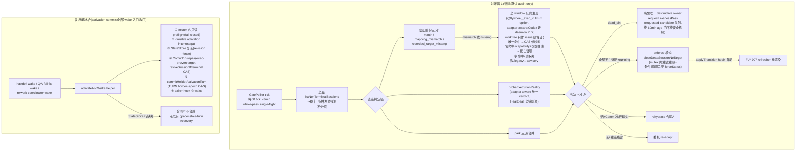

# FLY-1374 状态真相双对账器 — 实施计划

Issue: FLY-1374 (https://linear.app/geoforge3d/issue/FLY-1374/状态真相-discord-显示与-session-现实对齐-双对账器进程db-dbdiscord-幂等重渲染)
日期: 2026-07-23
基于: research.md

**Status**: codex-approved(Codex design review **9 轮 APPROVED**,R1-R8 共 33 项反馈全部采纳,零 reject;R9 留 3 条非阻塞实施注记,见 §7)
**Version**: v1.5x.0(暂定,ship 时取空号)

---

## 0. 一句话方案

新建 **SessionRealityReconciler**(GatePoller 搭车,~3min 全量核对进程现实 → sessions 表):**先当审计员再当执法者** —— 默认 audit-only 落死亡证明与漂移证据,enforce 模式(env 切换,真机 soak 后再默认)才执行校正;destructive 动作只有一条自有 lane(全局死亡证明后的 absent 收口,复用 crash-reaper 抽出的完整 close 序列),dead_pin 一律唤醒唯一 destructive owner(Heartbeat 活性链)提前跑;WAKE 复用分支补 **rehydrateHolder**(A/B 双合同,收口全部 wake 入口)治复用病族;对账器 2 不重建,FLY-907 refresher 上落 D1/D2/D4 定点补洞(D5/D7 先 inventory 后修,D6 降级审计 + 独立后续)。

## 1. 组件 1:SessionRealityReconciler(新文件)

`packages/teamlead/src/bridge/session-reality-reconciler.ts`,依赖全注入,模式照抄 `issue-display-refresher.ts`。

### 1.1 接线与运行模式

- GatePoller config 新增 `onSessionRealityReconcileTick` + `sessionRealityEveryNTicks`(默认 60 ≈3min;`FLYWHEEL_SESSION_REALITY_TICKS` 覆盖,0=禁用),`gate-poller.ts` 按既有 `(tickCount-1)%N` 模式加 try/catch 隔离分支,与 display sweep 相位错开。
- **GatePoller callback 是 fire-and-forget → reconciler 自带 whole-pass single-flight**(`if (running) return`,上轮未完不叠加)+ 每轮硬预算(默认 20s,超时留到下轮续)。
- **三态运行模式** `FLYWHEEL_SESSION_REALITY_MODE = off | audit | enforce`,**默认 `audit`**:
  - `off`:不注册回调。**OFF sentinel**:GatePoller 行为与现状逐字一致。
  - `audit`(默认首发):跑完整判定链,落证据(死亡证明/映射漂移/advisory),**零校正动作**。真机 soak 用它统计 stale-mapping / unknown 分布与假阳率。
  - `enforce`:audit 全部 + 执行 §1.4 校正。生产切 enforce = soak 证据(审计账本零假死亡证明)后单独一步(§5 PR-3)。验收 ①⑥ 在验收环境以 enforce 跑。

### 1.2 扫描(不分页,R1#5 简化)

每轮取 `listNonTerminalSessions()` **全量**(生产 ~40 行,现查询无 cursor/limit,保持原样),小并发池(默认 4)探测;不新增 keyset API,不存在跳行/重复问题。若未来全量超预算,先由每轮硬预算截断 + 下轮从未探测集续(进程内集合,不需要持久游标)。

### 1.3 判定链(每候选,全部直连;R1#1 + R2#1 重构)

**身份公理(R2#1)**:三段式 design/implement/qa 共享**同一个物理 worktree**(`turn.ts:5-9` 自证)→ worktree 只能证明 **issue/workspace 身份**,永远不能证明 **execution 身份**;worktree cwd 只作 issue 级佐证记入审计,不参与 match 判定。

**身份合同 = adapter-aware + durable marker(R3#1 重构;env 不能做全 fleet 身份:Codex daemon 不在 founder TUI pane 树里,dead_pin 尸体的进程已退出读不到 env)**:

- **新 durable marker(本单新增,spawn 时写)**:TmuxAdapter 家族(claude/kimi/antigravity)创建窗口后立刻 `tmux set-option -w -t <win> @flywheel_exec_id <execId>`(window user option,**进程死了 option 还在**,恰好覆盖 dead_pin 尸体的身份问题);CodexTmuxAdapter 同样给 founder TUI 窗口打 option,且其身份主证据 = `session.json` 的 daemon PID/control socket + daemon 进程自身身份(TUI pane 只是 display 佐证)。
- **capability = typed committed state,非 spawn 声明(R4#1)**:CommDB 列 `marker_capability ∈ NULL | 'tmux_window_option_v1' | 'codex_daemon_v1'`(幂等 ADD COLUMN)。**promotion 时机 = 证据发布成功之后**:tmux 家族 = set-option 后按 exact window **read-back 验证**成功 → 同一 registration 事务 CAS promote;Codex = daemon PID + exec identity + control-socket state **原子发布成功**后才 promote(现状:CommDB 注册在 daemon 起来**之前**、session.json best-effort 写失败 run continues —— promotion 绝不能发生在这些 gap 里)。promotion 失败 / 证据文件不可读或损坏 → 保持 NULL = `unknown`。**只有 capability 已提交的会话才允许「零 marker = 死亡证明」**;legacy/NULL/未知 adapter 一律 `unknown`,不得经 soak 自动获得 destructive 授权。**legacy 存量收口(R6#3 + R7#3;全链 suppression 下 legacy 死行不会「自然汰换」)**:PR-1 起维护 identity-unknown inventory 指标(`legacy_identity_unknown` backlog),**左侧权威 = StateStore 非终态 session 全集**(不是 CommDB NULL 行 —— CommDB 行整个缺失的 holder 与 finalize 残留会让 NULL 口径漏报归零),逐一分类:`commdb_row_missing` / `capability_null` / `generation_starting_stuck` / `evidence_missing_or_corrupt` / `unknown_adapter`。禁止自动升级/自动关闭;正常完成路径自然退出,其余走**显式人工/受控证据 drain**(每条排除项列 execution id/原因/owner/处置)。验收⑦报告 capability coverage 与**未解决 identity-unknown 全集**;生产「零漂移」声明须等该全集归零或逐条明确排除。sentinel:StateStore-only 非终态行必须出现在 backlog。
- **Codex 死亡判定三态显式化 + generation fence(R4#1 + R5#1)**:Codex evidence 定义为 **generation-scoped 状态** `{generation, publication_state: starting|ready, daemon_pid, exec_id, socket_path}` —— 同一 execution 内 daemon 可重启(现状:`onDaemonPid` 只写内存,`session.json` 到 `onThreadReady` 才重写;旧 daemon 退了、新 daemon 未 ready 的窗口里磁盘上还是「可解析旧 PID + capability 已提交」,恰好凑成假死亡合取)。合同:每次 teardown/restart **先**原子发布下一 generation 的 `starting`(发布失败 → 不得杀掉仍健康的旧 daemon,或必须先 CAS-demote capability);新 daemon exact PID identity + socket initialize 成功后原子发布 `ready`。**「当前 generation」的 durable authority = CommDB 四元组(R6#1 + R7#1;mutable session.json 的 read/merge/rename 防 torn write 防不了 stale writer,裸 generation CAS 又绑不住「哪个 publisher 的哪份 payload」)**:CommDB session 行加 **`(marker_generation, marker_publication_state, marker_publication_id, marker_evidence_digest)`** 四列,**单调 CAS**:`CAS ready(g) → starting(g+1)` 时分配唯一 publication ID;evidence 按 `generation+publicationId` 路径**一次性**写入(不复用路径);`CAS starting(g+1) → ready(g+1)` 以同一 publication ID 为条件,**原子**存入 evidence digest 并 promote capability。禁止任何向较小 generation 的回写;**废弃的 `starting` generation 的恢复 = 单调推进到新 generation/publication ID,绝不接管/补完弃写者的 generation**。probe:要求 exact 四元组一致 + evidence 重算 digest 匹配;任何 non-ready / generation mismatch / CAS miss / 缺文件 / digest 不符 = `unknown`;`alive` = exact PID identity 或健康 socket 任一成立;**`dead` 的合取 = capability 已提交 + 四元组与 evidence 完全一致且 state=ready + 该 PID 身份已消失 + socket 明确不存在 + 无同 exec replacement daemon 证据**。capability promotion 只发生在某 generation ready CAS 内;`starting` publish 失败且旧 daemon 已自然死亡 → CAS-demote capability。必测:首次 registration gap、内部 restart 各边界 reconcile tick、Bridge crash 后只留 `starting` 的恢复(推进新 generation 不接管)、**对抗测试:ready 后 stale 文件回写(digest 不符→unknown)、同 generation 重复 callback、abandoned-starting takeover、capability/digest 原子性** —— 旧 writer 永远不能回退 current generation 或产出死亡证明。
- **secrets 纪律**:任何进程 env/命令行原始输出只在内存精确匹配,**禁止进 audit/log**(内含 token)。
- 必测(R4#1):在「注册后、option read-back 前」与「Codex 注册后、session.json publish 前/publish 失败」两个窗口插入 reconcile tick,断言**永不**产出死亡证明。

判定链:

0. **每轮一致性快照**:开扫时构建**一次**全 pane inventory(`tmux list-panes -a -F '#{pane_id} #{pane_pid} #{session_name}:#{window_index}'` + 每 window 的 `@flywheel_exec_id` option 批量读取),本轮全部候选共用;不允许各候选自行重扫。
1. **窗口身份三分**(新原语,进 `tmux-lookup.ts`):`classifyRecordedWindow(execId, tmuxWindow, adapterType)`:
   - 记录窗口存在且 `@flywheel_exec_id === execId`(或 Codex:daemon 进程身份证明)→ `match`;
   - 记录窗口存在、option 可读且是**别的** execId(含共享 worktree 兄弟 phase)→ `mapping_mismatch`(只证明「窗口不是它的」,**不证明它死了**);
   - 记录窗口不存在 → `recorded_target_missing`;
   - option 读取失败 / legacy 无 capability / adapter 未知 → `unknown`(fail-safe 不动手)。
2. **反向发现**(mismatch/missing 时,死亡判定的必经路):在本轮快照的**全部** window 上按 `@flywheel_exec_id` option 反查(Codex 候选另查 daemon PID 存活):
   - **唯一命中** → runner 活在别的窗口 → **修映射 R6**:CommDB `tmux_window` **CAS 更新**(条件=本轮观察到的旧值,防覆盖 runner 并发自注册;audit 模式只记录),绝不终态化;
   - **零命中 + 候选是 capability 会话 + 本轮仪器自检通过 + 快照内全 window option 读取无一失败 +(Codex:daemon PID 亦不存活)** → 「全局正向死亡证明」;
   - **多命中 / 任一读取失败 / 仪器自检失败 / legacy 会话** → 只 advisory,不构成证明,也不修映射。
   - 仪器自检:开扫前 `tmux list-panes -a` 非空 + 对 Bridge 自建的 sentinel option 读回冒烟;失败 → 本轮全部 `unknown`(FLY-1369「先自检仪器」)。
   - **必测**:A 过期 target 指到兄弟 B 窗口(判 mismatch 非 match)/ 仅 B 活(A 零命中不误修)/ A、B 同活(各归各)/ 自注册与 R6 并发 CAS / 无 exec 证明不修不 finalize 不唤 owner / **Codex daemon 活 + TUI pane 无 marker(不得判死)/ Codex daemon 活 + TUI 窗口整个没了(不得判死)/ dead_pin 尸体经 option 仍可认领身份 / legacy 无 capability 会话恒 unknown**。
3. `probeRunnerProcessLiveness(tmuxWindow)`(现成 4 态,仅对 `match` 窗口有意义;`indeterminate` 视活,GEO-374 纪律)。
4. park 三源合并:`ship_parked` / CommDB declared `parked` / `three_stage_turn.holder_exec_id`(CommDB 新只读查询)任一命中 → 安静合法。
5. CPU delta 本版不作判据(只留未来 advisory)。

### 1.4 判定 → 动作表(enforce 模式;audit 模式全部降级为记录)

| # | 判定 | 动作 | 说明 |
|---|---|---|---|
| R1 | `match` + `dead_pin` + running | **不自己动手**:记证据 + `heartbeatService.requestLivenessPass(execId)`(**requested-candidate 合同**,R2#2,见下)| 唯一 destructive owner 提前跑;不存在第二个收割者 |
| R2 | 全局死亡证明 + running | 先查 complete-failed marker(有 → 委托 marker-reconciler 重放);无 → `closeDeadSessionNoTarget(execId)`(§1.5) | 对账器唯一 destructive lane;absent 类今天要等 60min orphan 龄,是主要提速点 |
| R3 | 死亡证明 + `awaiting_review`/`approved_to_ship`/`design_done` | 不动 status(gate/批准语义归 FLY-1448);episode 级 advisory(指纹 `(execId,kind)`) | 只报 |
| R4 | 活(match+alive)+ 「⚠️重连中」/monitoring_lost 残留 | 委托 monitor-loss re-adopt(HeartbeatService 抽 `readoptSession(execId)` 入口,逻辑零改) | |
| R5 | 活 + CommDB sessions 行缺失 | `rehydrateHolder` 合同 A(§2) | |
| R6 | mapping 修复(反向发现唯一命中) | 更新 CommDB `tmux_window` + 审计行 | 非 destructive,enforce 即做 |
| R7 | park 合法安静 / unknown / indeterminate / 多命中 | 无动作(unknown 连续 3 episode → 一次 advisory) | fail-safe |

**requestLivenessPass 合同(R2#2 + R3#4;现状核实:FLY-1282 单飞只跳过无 pending-rerun,crash-reaper 候选走 `getOrphanSessions(60min)` 门槛 + crash grace clamp ≥阈值;且 crash-reaper 的 cmux/window kill 失败与 CommDB finalize 失败**刻意保持 running 靠下一轮重试**(`crash-reaper.ts:277-303,316-337`))**:
- `requestLivenessPass(execId)` = **exec 级 requested-candidate 队列**:请求入队;pass 正在跑 → 置 pending-rerun latch,`finally` 后再跑一轮;
- 活性链消费 requested candidate 时**绕过 age 候选门**(heartbeat 陈旧龄 / crash grace 60min clamp),但**完整执行**其余机制:suppression、server-loss 判定、marker 探测、mutex、身份复核、destructive 前重探;
- **owner 返回 per-exec outcome,按 outcome 决定去留(R3#4)**:`terminalized` / `CAS_lost_to_newer_state` / 明确移交他 owner → ack + 出队;`cleanup_pending`(kill/finalize 失败待重试)/ probe/identity `unknown` / mutex 冲突/错误 → **保留 requested intent**,带有界 backoff 重排,由 pending-rerun 再消费 —— crash-reaper 的 retryable-failure 语义不被队列清除吃掉;
- **episode 去重只压重复 audit/alert,不压未完成的 destructive intent**;
- 必测:cmux-kill-fail→success / window-kill-fail→success / finalize-fail→重试 / pass in-flight 时新请求(latch 生效)四条时序。
- 该合同若实现期发现不可行,**删除 R1 的 ≤5min 声明**并如实降级验收①路径(不许留虚账)。

**写入纪律(R1#2 + R2#4 重构)**:
- destructive 写(R2 lane)在**per-issue lifecycle mutex**(statestore-ghost-reconcile 同款)内:重读 session 行 → **重探活**(死亡证明在 mutex 内复核)→ 条件写。
- **不暴露 partial store writer**:新增顶层 **`applyTransitionIfStatus(executionId, expectedStatus, to, meta)`**(applyTransition 的 sibling,同文件):FSM 从 expectedStatus 出发校验;StateStore 层在**单事务**内做 expected-status 谓词 + `persistTransition` 的**全部**既有字段维护(`terminal_at`、`awaiting_review_entered_at`、`lifecycle_revision`、`last_activity_at`/`last_error` 等 —— StateStore.ts:3907-3919 明示每个新状态写路径必须维护 `terminal_at`,否则 revival 后 asks 被静默清退);**仅当谓词命中**才 drain FSM directives/audit 并触发共享 transition/display hook;谓词 miss = 零副作用返回。
- **无 `forceStatus`**:谓词 miss = 在途事件赢了,弃权本轮。
- 每 `(execId, 判定类)` 每 episode 一次动作(进程内 latch + 审计行判重);每次动作落 `session_reality_corrected` 审计行(lead_events 审计镜像,不投递)。
- 必测:`terminal_at`/revision/forensics 字段/FSM audit/display hook exactly-once/谓词 miss 零副作用。

### 1.5 `closeDeadSessionNoTarget`(从 crash-reaper 抽共享原语;R1#6 + R2#5)

**shared core / caller-specific 显式二分**(crash-reaper `:316-395` 全序列核对后拆分):
- **shared core**(两个调用方共用):① 物理 teardown(R2 的 absent 场景无窗可拆,跳过);② **finalize + tombstone 同事务(R7#2)**:`finalizeCommDbSession` 在**同一 CommDB 事务**内落不可变 **`session_finalize_receipt`**(close 操作 id、期望 StateStore status/revision、已提交 marker 四元组与 evidence digest、teardown/finalize outcome、拒绝更新 registration/generation 的元数据)—— finalize-first 会删掉身份权威所在的行,没有 tombstone 的话「finalize 提交后、StateStore 写前」崩溃 = StateStore 永远 running 而探针只能 indeterminate,全链 suppression 反而把 close 卡死;finalize 失败 → 不终态化 StateStore,保留可重试;③ StateStore `applyTransitionIfStatus → terminated`;④ TURN:holder 的 TURN **不清**,只记 advisory;⑤ 审计行。
- **崩溃恢复 = CommDB 线性化 close-claim 仲裁(R8#1;Bridge 本地 mutex 罩不住 adapter 侧直连 CommDB 的 `registerSession` 无条件 upsert —— 恢复的「读 CommDB 判 receipt 有效 → 写 StateStore」两库之间,重启的 adapter 可能注册进一个活 execution)**:close 恢复与 `registerSession`、marker generation 发布共用**同一 CommDB 内单事务仲裁协议**——receipt 作纯证据,另设按 close 操作 id 键控的 **close-claim 状态**:恢复先 `CAS pending → state_transitioning`(条件=期望 registration/generation 四元组仍是当前);`registerSession`/generation 推进在**自己的事务**内要么 (a) 以更新的 **durable admission/launch generation**(不是时间戳)证明自己更新并**原子 supersede** pending close,要么 (b) close claim 活跃期间 fail/hold;**只有赢得 claim 的 close 才许做 expected-revision StateStore transition**,完成后 settle claim。必测交错:注册发生在 claim 前 / claim 后 / CommDB 复读后 StateStore CAS 前 / StateStore CAS 后。
- **post-close 步进账 = 不可变证据 + append-only 进度分离(R8#2;「receipt 内改 outcome」违反不可变,且现有 effect 全是吞错/void 的 fire-and-forget,没法落真话)**:`session_finalize_receipt` 保持 append-only 纯证据;另设不可变 **`session_finalize_step_receipt(close_id, step, idempotency_key, outcome, evidence)`** 行。每个 effect 改成 at-least-once 幂等合同:QA-loss reconciliation 改为 awaited 且返回显式 outcome,close 操作 id 穿透到其 durable dispatch/source-event guard;archive 返回显式 `applied | already_satisfied | held | retryable_failure` 并复用 D4 的 durable mutation intent;事件 id 从 close 操作 id 确定性派生;计数从 durable outcome 派生或显式标注 best-effort。必测:每个外部/跨模块 effect 前后紧邻的崩溃,含「effect 成功但 outcome 没写上」—— replay 既不丢动作也不产生第二次 QA respawn / Discord mutation。
- **caller-specific post-close(两个调用方各自显式执行,逐项落 step receipt)**:QA session 终态 → `onQaPhaseTerminated` orchestrator 回调(否则 implement 被留在 stranded);thread 归档触发;`runner_crash_reaped`(crash-reaper)/ `session_reality_corrected`(R2)事件与计数。
- **行为等价 sentinel(非字节)**:完整成功 / CAS-lost / finalize-failed 之外,**加 R7#2 崩溃切口**:finalize 提交后 StateStore 写前、StateStore 写后 QA 回调前、各 post-close 动作之间、CAS 输给更新 lifecycle、更新 registration 冲突 —— 每个切口真重启收敛。
CommDB sync 面:`terminal-commdb-sync` 只认 `failed/blocked`(已核实)—— R2 不走它,走本序列 finalize-first(带 tombstone),无缺口。

### 1.6 与既有机制关系(修订)

- **共享真相原语 `probeExecutionReality(session, observedTarget)`(R4#2 + R5#2:覆盖 Heartbeat 整链,不只 crash-reaper)**:§1.3 的 adapter-aware 身份+活性判定抽成**唯一**共享 primitive,返回统一 verdict type;消费方 = 对账器、**Heartbeat 活性链全链(`reconcileMonitorLoss`/`probeSessionLiveness` → crash-reaper 全部候选 → `reapOrphans`)**、prune veto、R6、owner destructive 前重探。理由:链序 = monitor-loss → crash-reaper → reapOrphans,只改 crash-reaper 会被同 tick 下一步 `reapOrphans` 对同一 stale-heartbeat running 行直接 `→ failed` 反向覆盖(live-Codex 误杀只是换了位置)。verdict 消费规则:`alive` → re-adopt(刷 heartbeat);`indeterminate`(含 legacy/NULL capability、读错误)→ 本轮 suppression 不放行;只有 adapter-aware 的真实 `dead/dead_pin` 才释放给 destructive owner —— **`reapOrphans` 不得 force-fail daemon-alive 行**。`probeRunnerProcessLiveness` 降级为 TmuxAdapter 家族的内部 process probe。必测:**整条 `HeartbeatService.check()`** 回归(不只 crash-reaper):60min stale 的 Codex daemon-alive/TUI-dead 不转 failed 不 close;NULL capability / probe error 同;对照组 = capability 已提交且 daemon 确死的必须仍进 owner;TmuxAdapter 家族行为等价。
- crash-reaper:**仍是 dead_pin 唯一 destructive owner**(R1 只唤不抢);close 序列抽共享,其调用路径以**行为等价 sentinel**保护(§1.5;TmuxAdapter 家族路径行为不变,Codex 路径按 verdict 修正是本单的刻意变更,单独断言)。
- reapOrphans / monitor-loss:**cadence、owner、status 语义保留,但 liveness reader 改为共享 `probeExecutionReality`**(R6#3 口径统一,与上一条一致);ghost-reconcile / commdb-fsm / zombie-scan / stale patrols / idle watchdog:全部不动;reapOrphans 兜底保留(在新 verdict 下)。

## 2. 复用再水合:A/B 双合同(R1#3 重构)

落点 `packages/teamlead/src/bridge/holder-rehydrate.ts`。

### 2.0 wake 入口收口(先于一切;R2#3 修订)

现有 `grantTurn → wake` 至少三处:主 handoff wake(`phase-orchestrator.ts:1900-1952`)、QA-fail fix wake(`:1574-1606`)、generalized rework wake(`workflow-rework-coordinator.ts:365-476`)。抽统一 helper `activateAndWake(target, hooks)`。

**TURN grant = activation commit(R3#2 重排;`turn.ts:33-50` 自证:turn 自检不等 wake,CommDB 行 + TURN holder 匹配即返 `yours` —— grant 在 setup 完成前授出就是本单要消除的竞态本身)**:

顺序(R5#3 修正:先锁内只读 preflight,再落 intent,再 mutation)= ① **canonical per-issue lifecycle mutex 内只读 preflight**(读 StateStore status+`lifecycle_revision`/wake cause/当前 TURN holder+epoch/`probeExecutionReality` fresh verdict;不可复活态或 target 非 alive → fail-closed,不写 intent 不 grant 不 wake,advisory + 既有 recovery)→ ② **持久化 `holder_activation_intent`** → ③ 条件 StateStore 复活(§2.1 矩阵)→ ④ CommDB repair/revival(§2.1-3)→ ⑤ **`commitHolderActivationTurn`(commit 点)** → ⑥ `afterGrantBeforeWake` caller hook(rework coordinator 的 turn projection + delivery-state 持久化,`:440-476`)→ ⑦ wake。

**跨库崩溃恢复 = durable saga + authority CAS(R4#3 + R5#3;StateStore 与 CommDB 无法跨库原子)**:
- `holder_activation_intent`(CommDB)持久化:activation id、caller/cause、original `status` **和 `lifecycle_revision`**、**期望旧 TURN holder+epoch**、discoveredTmuxTarget、step,以及每次 saga-owned 复活写后的新 revision;每步完成 CAS 推进 step。
- **commit 是数据库 CAS 不是 preflight 检查**:新增 CommDB 单事务 `commitHolderActivationTurn` —— 校验 intent 仍在可提交 step **且当前 TURN 精确等于期望 holder+epoch**(或已是同 activation 的幂等 replay)才复用既有 source-event grant 并把 intent 置 committed;TURN mismatch(turn-belt/fresh-spawn 在 preflight 后授出了更新的 TURN)→ 返回 explicit conflict/handoff,**绝不 grant 绝不 wake**。
- **StateStore 侧 receipt 与状态写同事务(R6#2;跨库崩溃后「current ≠ original」无法归因是本 activation 的写还是新事件 —— 猜哪边都错)**:新增 StateStore 表 `holder_activation_transition_receipt(activation_id, step, execution_id, canonical_digest, from_status/revision, to_status/revision, outcome)`,由窄权限 `applyHolderActivationTransition` 使用:先查 exact activation+step receipt(存在且 digest 一致 → 幂等返回已提交 after-revision;冲突 → poison/hold);无 receipt → **单个 StateStore 事务**内校验 expected status+revision → 完整 `persistTransition` 字段维护 → 写 receipt(先例:`commitWorkflowLoopReentryRequest` 的 mutation+immutable receipt 同事务模式,StateStore.ts:24316-24413)。`awaiting_review → ship_parked → running` 两条边各自独立 step receipt;rollback 也有 receipt。**CommDB intent 只投影 receipt 的 after-revision**;投影丢失可从 receipt 重放,绝不靠 revision 差值猜。
- **rollback 有 revision fence**:仅当 StateStore revision 仍等于 saga-owned revision(以 receipt 为证)才条件回滚到 original status;revision mismatch 且无本 saga receipt = 新事件赢,旧 saga 不得回滚,转 handoff/held 并留审计结论。
- **未完成 intent 的消费者 = 既有 GatePoller/turn-belt 回调**(零新 timer):同 canonical issue mutex 内按 step 幂等 roll-forward 同一 activation(**绝不重复 grant**)直至 committed,或按上述 fence 回敛。
- activation setup/commit/recovery 与 R2 close、admission **共用同一把 canonical per-issue lifecycle mutex**;commit 前锁内重读 StateStore、TURN 并重跑 `probeExecutionReality`,只有 fresh `alive` 才提交。
- setup 失败的准确表述:**无 writer authority(未 commit),部分写由 durable saga 收敛**。
- 必测:③ 后、④ 后、⑤ 前三点崩溃+重启收敛(原 parked 态或完整 activated 态,无 running-without-TURN 残留)/ **StateStore revival commit 后、CommDB intent advance 前崩溃 → 从 receipt 精确续跑,不重复 FSM audit/display hook** / rollback commit 后、intent settle 前崩溃同 / 同 activation 重入不重复 grant / **turn-belt 或 fresh-spawn 在 preflight 后先 grant → 旧 activation commit 必须 conflict** / 复活后新 lifecycle event 写入 → rollback 被 revision fence 拒 / R2 close 与 activation 并发(mutex 序)/ target 在 setup 后 grant 前死亡(锁内重探拦截)/ grant 事务提交后崩溃再重放(幂等)。
- **awaiting_review 窄授权的证据来源修正**:不要求目标 preflight 前已持 TURN(首次 QA→implement handoff 时不可能);授权 = caller 的 **durable wake cause**(qa_fail/rework,来自 gate/verdict 记录)+ 期望 issue/旧 TURN 对得上,grant 后再以新 holder/epoch 确认闭环。
- **必测**:parked runner 在 activation 各步间主动轮询 `turn status` 的并发测试 —— setup 全部成功前**永远**得不到 `yours`。
- **结构测试**:枚举仓内全部 `grantTurn` 调用点,**whitelist fresh-spawn 类 grant**(dispatcher pre-launch seam 等),非白名单调用点必须经 helper —— 不做「grep 归零」一刀切。

### 2.1 合同 A —— StateStore 行在场的 CommDB repair/revival

前置:StateStore session 行存在且非终态,且授权证据齐备(§2.0 activation 语义)。
1. **CommDB 行 repair(R3#3 修正 —— target 不许从 StateStore 猜)**:`registerSession` 必填 `tmuxWindow`,而 StateStore `tmux_session` 生产实测 1423 行 0 非空(`phase-orchestrator.fly1329-park-alive.test.ts:103-106`),不是可信来源。合同 A 因此**必须**接收 exec-proven 的 `discoveredTmuxTarget`:由 §1.3 的 adapter-aware discovery(marker option / Codex daemon)解析,reconciler(R5)与 wake helper 走**同一 resolver**;**无唯一 target → hold + advisory,不重建**。
   - 行缺失 → 事务性 INSERT(带 discoveredTmuxTarget + `resolveLeadForIssue`);R6 修映射时撞 row-missing 的 CAS miss → 显式交给这条 insert path;
   - 行存在但终态残留 → **不走 delete+insert**(`deleteSession` 是 proven-teardown-only 模块合同,带 call-site sentinel,`db.ts:5631-5650`;row absence 会授权 ask sweep 清活 runner):新增窄权限 `reviveSessionIfTerminal(executionId, expectedStatus, observedTarget, fields)` —— 单事务 CAS `UPDATE status='running', ended_at=NULL, tmux_window=?, ...`,保行保 metadata;CAS miss(状态被并发改)→ 弃权;
   - 必测:target discovery unknown 时 hold / 与 runner 自注册并发 / terminal-status race / ask-wake metadata 保留。
2. **StateStore 状态复活(逐态矩阵;R2#3 修订 —— 不许唤醒一个写不了 progress 的 runner)**:

现实约束(已核实):`getAlivePhaseSession` 会选中 `awaiting_review/approved_to_ship/design_done`(`plugin.ts:9336-9347`);QA-fail 路径明确以 `awaiting_review` 的 implement 为 wake 目标(`phase-orchestrator.ts:1574-1606`);而 `progress` 硬性要求 `status==='running'`(`progress.ts:112-127`)。**只修 CommDB 不复活状态 = runner 拿着 TURN 仍被 progress 门拒,病没治**。

| holder 现态 | 处置 | 依据 |
|---|---|---|
| `running` | 不动 | 已合法 |
| `ship_parked` | `→ running`(既有边) | FSM :138 |
| `design_done` | `→ running`(**本单唯一新增 FSM 边**,trigger=`wake_rework`;sentinel 钉死其余边逐字不变) | rework wake 需要 |
| `awaiting_review` | **窄授权复合复活**:授权 = caller 的 **durable wake cause ∈ {qa_fail, rework}** + 期望 issue/旧 TURN 通过 preflight(**不要求 target 预持 TURN**),grant 后由新 holder/epoch 确认闭环(§2.0)→ 走既有合法复合边 `awaiting_review → ship_parked → running`(同一 rehydrate 窗口内,trigger=`wake_rework`);无此授权 → fail-closed 不 grant 不 wake | R2#3 选项一 + R4#5 措辞统一;审计行记 cause+TURN 证明 |
| `approved_to_ship` | **明确 hold:不复活、不 grant、不 wake**(批准链 authority,归 FLY-1448) | 边界,fail-closed |

   注:`getAlivePhaseSession` 的 ALIVE 集本单**不改**(wake 目标选择语义不动);被选中者若落入「不可复活」行,由 §2.0 的 pre-grant fail-closed 拦截。实现首日核对 FLY-1448 落地情况:若其已把 wake 前状态收回 `running`,本矩阵的 awaiting_review 行按其实际代码重核并收缩。
3. 前任残留(同 issue+role 旧 running 行):不在 rehydrate 内处理,由对账器 R2/reapOrphans 正常终态化后 progress 门自然放行。

### 2.2 合同 B —— StateStore 行缺失

**不合成**(TURN 不是可信重建源,且处在 pre-grant→session_started 既有竞态窗内):保留现有 `TURN_GRANT_GRACE_MS` + stale-turn recovery 原路径,rehydrate 直接返回 `no_source`,advisory 一次。`reconcileOneTurn` 的 row-missing 分支维持现状(其语义就是 StateStore 行缺失,已核实)。

### 2.3 配套

- **prune 双保险**(`commdb-session-prune.ts`):① TURN-holder veto(holder execId 绝不 finalize);② finalize 依据的窗口先 `classifyRecordedWindow`,`mapping_mismatch`/`unknown` 时不得以该窗口死活为据(fail-safe 保行)。
- **nudge 401 自愈**(`packages/flywheel-comm/src/lead-inbox-nudge.ts`;R2#8 修正:现无 config 常量,他处都是手拼 `join(homedir(),".flywheel",".env")`):新增**可注入的共享 call-time token resolver**(`dotenvPath` 参数,默认 `~/.flywheel/.env`,解析逻辑单处不复制);401/403 → resolver 重读 `TEAMLEAD_API_TOKEN` 重试**一次**;仍失败保持现状 warn + 计数。测试用临时 dotenv 文件(假 Bridge 401→200),不触真实 home。

## 3. 对账器 2 补洞(修订版)

| # | 改动 | 要点 |
|---|---|---|
| D1 | 单 session badge 终态补全:`rejected/deferred/shelved/timeout` → blocked 语义,`approved` → completed | `issue-display.ts`;全 status×stage 组合 sentinel 表;三段式 `PHASE_BLOCKED_STATUSES` 不动 |
| D2 | wake_failed episode 化:receipt-patrol 终态 target → dispose 积压 wake(记审计)而非 escalate;指纹 `sha256(execId+kind)`;`runner-wake.ts` event_id 去 `Date.now()` | 实现前核对 FLY-1448 落地范围,撞则收缩 |
| D3 | 终态单外部改名不自愈 = 接受边界(文档) | 无代码 |
| D4 | **只修实际缺口**(R1#7 + R2#6 + R3#5 + R4#4):`done-thread-archiver.ts:291-298` 单键 active check 改 FLY-270 别名集(reconcile sweep 已 alias+fail-closed,不动)。un-archive 自愈与 archive sink **共用同一把 per-thread lock**(既有 `threadArchiveLocks`)。**write-ahead intent(R4#4,mutation 之前落,不是失败后补记)**:任何 Discord unarchive mutation 前先持久化 `thread_archive_mutation_intent`(thread、期望 authority/revision、operation、state=prepared)→ 外部 PATCH 成功推进 applied → 按 fresh authority 清 `archived_at` 或补偿 re-archive → Discord 终态确认 + 本地写完成后 settle 删 intent。**startup/既有 sweep 把 pending intents 并入候选集**(现状 `getUnarchivedIssueChatThreads` 看不见 archived_at 已设的行 —— 没有 intent,PATCH 后本地写前崩溃 = thread 永久开放),fresh GET 后幂等 roll-forward/补偿;404/403 也以明确终态 settle intent。锁内状态机:fresh 非终态 authority 复核 → PATCH → post-PATCH 复读 authority:仍非终态 → 清 `archived_at`;翻终态 → 锁内非递归补偿 re-archive,补偿失败(5xx/timeout/unknown)→ 清/标失效 `archived_at`,intent 保持待收敛 + 一次 advisory。测试:每个 await 边界 terminal flip / 补偿 5xx / timeout-unknown / **PATCH 后本地写前真 kill+重启收敛** | 验收⑤ |
| D5 | **inventory 先行**:PR-1 附带 `rg` 全量 Discord message POST 调用点清单(文档化,含每点是否走 `splitDiscordMessage`);归并修复以清单为合同进 PR-2;`remainingText` 失败尾接一次重试 + 告警 | 不再是实现期探索 |
| D6 | **降级为审计**(R1#4 采纳):本单只做 dual-open 检测 advisory(同 lead 同外部 msgId 的 `chat:` 与 `founder_msg:` 同时 pending → 记录+告警一次);**跨命名空间结算不做** —— 两道 evidence 合同不同(`discord_explicit_reply` vs `lead_routed` family 原子性),盲联动会吞 founder 指令。结算/单一 ingress ownership 设计 → **独立后续 issue**(交付物含建单) | 数据丢失风险回避 |
| D7 | **样本先行**:PR-1 附带真实被拦样本 inventory(misroute archive / Discord 史,当晚 5+ 例)定位执法点;钝化合同(顶层分支「token 在首行/首 N=40 字符才拒」或按执法点实况定)以样本为验收进 PR-2;plugin fork 涉及则登记 fork PR | 不凭猜改 |

## 4. 测试与验收

### 4.1 TDD 层

- 判定链:窗口三分类 × 反向发现四出口(唯一/零/多/失败)真 tmux 集成测试(起 sleep-in-cwd 窗口;symlink worktree、路径前缀碰撞 `/a/b` vs `/a/bc`、进程树 churn、多命中各一例)+ mock 边界。
- R1-R7 逐行(注入假 probe/store);audit 模式零动作断言;enforce 谓词写竞态(并发改 status → `getRowsModified()===0` 弃权);whole-pass single-flight;每轮预算截断续扫。
- `closeDeadSessionNoTarget`(镜像 §1.5 全合同,R8#3):finalize 失败不终态化可重试 / TURN holder 不清 TURN / **finalize+tombstone 同事务** / **close-claim 仲裁四交错**(注册在 claim 前/后/复读后 CAS 前/CAS 后)/ **step-receipt effect 前后崩溃 + effect 成功 outcome 未写** / 行为等价 sentinel(完整成功、CAS-lost、finalize-failed + finalize 提交后 StateStore 写前、StateStore 写后 QA 回调前、各 post-close 动作之间、CAS 输给更新 lifecycle、更新 registration 冲突)。
- 四元组对抗测试(镜像 §1.3,R8#3):ready 后 stale 文件回写 / 同 generation 重复 callback / abandoned-starting takeover / capability-digest 原子性。
- rehydrate:A 合同逐态矩阵(**含 awaiting_review 窄授权复合复活 + 无授权 fail-closed;approved_to_ship 恒 hold 不 grant 不 wake**)/ B 合同 no_source / `reviveSessionIfTerminal` CAS(不走 delete)/ activation 顺序各步失败语义 / 三 wake 入口全走 helper 的白名单结构断言 / FSM 新边 + 其余边逐字 sentinel / parked runner 各步轮询 turn 的并发测试。
- prune veto ×2;nudge 401 重读重试(假 Bridge 401→200);D1 组合表;D2 dispose+指纹;D4 状态机各分支(含 archived_at 清除、403 locked 不重试);D6 dual-open 检测。
- 三模式 sentinel:`off` 逐字现状;`audit` **零 correction/mapping/lifecycle 写,但 audit evidence 写 exactly-once**(R4#5);`enforce` 全动作。

### 4.2 真机验收(能力级;①⑥ 以 enforce 模式跑)

| 验收 | 方法 |
|---|---|
| ① kill runner → ≤5min 终态+标题 | enforce 下 kill -9 进程树:dead_pin 路径(R1 唤 owner)与 absent 路径(kill 后拆窗)各测一次,计时 |
| ② 改错标题 → 下轮纠正 | 手动 PATCH 错 badge → layer-2 轮转纠正(现有能力回归) |
| ③ 抽查 10 open thread 零脱节 | 逐 thread 对照进程实况 |
| ④ 他单号正常消息零误拦 | D7 样本合同回放 + 真发 |
| ⑤ 重启不锁活单 | 重启 Bridge → 非终态 issue thread 全部可写;人为造已 archive 活单 → 自愈 un-archive |
| ⑥ 复用 holder 三通 | 真 DAG park → 派新活:turn/progress/信箱三通,零人工修 DB(529 房优先,不行则真机受控 issue) |
| ⑦ audit soak + enforce canary(**防真空通过**,R2#7 + R3#6) | **两份证据,PR-3 gate 同时引用**:(a) 生产 **audit** soak ≥24h,**以最终候选 cadence 跑**(cadence 改动作为 soak 前独立的 audit-only 配置变更先落地,PR-3 保持一行翻转)+ 受控 oracle 最低样本合同:真 kill 正例、recorded_target_missing、共享 worktree A→B stale mapping(必须 mismatch 不 match、不误修)、探测失败/churn(必须 advisory);wrong-repair 单独计,later-heartbeat 矛盾数统计;正/负例各达约定数全过 + 零假死亡证明。(b) **受控隔离 enforce canary**(529 房/受控 issue)采集真实 detection→owner-close 延迟 —— audit 模式零动作,close 延迟只能从 canary 来。报告附 pass duration、budget skips、single-flight 合并数、检出→close 的 **p95/max**(max 必须含 budget-deferred、in-flight rerun、retryable cleanup 样本,不许只报首个成功样本)+ **capability coverage 与未解决 identity-unknown 全集/排除清单**(R8#3,§1.3 legacy 收口的 gate 落点) |

## 5. 实施切片(3 PR,R1#8 采纳)

1. **PR-1「探针 + 审计 + 显示定点」**:窗口三分类 + 反向发现 + 仪器自检;reconciler(`off/audit/enforce` 三模,默认 audit,enforce 仅 env)+ R1-R7 + close 原语抽取 + requestLivenessPass;D1/D2/D4;D5/D7 inventory 文档;D6 检测 advisory + 后续建单。
2. **PR-2「再水合 + 收口」**:`activateAndWake` helper 收口三入口(activation commit 顺序)+ rehydrate A/B + FSM 新边 + prune 双保险 + nudge 401 自愈;D5/D7 按 inventory 合同修复(fork 涉及则并行 fork PR 登记)。
3. **PR-3「enforce 默认化」**:验收⑦的两份证据(最终 cadence 的 audit soak + 隔离 enforce canary)附上 → 默认模式 `audit`→`enforce` **一行翻转**(cadence 调整已在 soak 前作为独立 audit-only 配置变更落地,不混入本 PR)。证据不达标就不翻,如实报告。
每 PR 独立过全仓 gates + Codex code review;验收 ①⑥ 在 PR-2 后以 enforce 环境跑。**plan 一致性清单(R3#7 + R8#3)**:实现前逐节核对「复活矩阵 / activation 顺序 / **close-saga 步序与 claim 语义(§1.5)** / sentinel 术语(行为等价,非字节)/ helper 名(activateAndWake)」在总图、§1、§2、§4 测试清单、§6 边界五处口径一致 —— 唯一真相 = §2.1 矩阵、§2.0 顺序、**§1.5 close 合同**。

## 6. 风险与边界

1. **误杀防线(最坏情况承诺)**:destructive 仅 R2 一条 lane,需「全局正向死亡证明 + mutex 内复核 + 谓词写」三重;mismatch/missing/unknown/多命中/仪器故障全部 fail-safe 朝不动手;audit-only 首发让证据先于执法。最坏误判 = 少修/晚修,**不存在误杀活会话路径**。
2. **FSM 变更半径**:仅 `design_done → running` 一条边;sentinel 钉死全表其余逐字不变;Codex code review 重点。
3. **FLY-1448 并行**:R3 只报不动、awaiting_review 仅窄授权(qa_fail/rework)复合复活、approved_to_ship 恒 hold、D2 边界表已列;实现首日核对其 PR 范围。
4. **FLY-1446(cmux)**:不碰。
5. **SLA 诚实账(R2#2 修订)**:audit 默认下生产不满足验收①(设计如此)。enforce 后按**最坏调度**记账:R2 路径最坏 = 恰错过一轮(cadence)+ 当轮收口;R1 路径最坏 = 恰错过一轮 + requested-candidate 消费。**PR-3 前把 cadence 调到留余量满足最坏 ≤5min**(如 40 tick=2min → 最坏 ≈ 2+2+收口 <5min),以验收⑦的 p95/max 实测为准 —— 不是超标后再调参;requested-candidate 合同不可行则删 ≤5min 声明如实降级。
6. **诚实边界**:终态 thread 外部改名不自愈(D3);D6 结算不在本单(建单交接);token 不进 env 的彻底根治不在本单;CPU delta 只观测。

## 7. Codex R9 非阻塞实施注记(实现期必办,不阻批准)

1. **close claim 崩溃重入钉死**:同一 `close_id` 可幂等 resume 已处于 `state_transitioning` 的 claim;StateStore 未决期间**不许任何 wall-clock lease 过期重新放开 registration**。测试:claim CAS 后立刻 kill → 重启 resume 同 close id → registration 保持 held 直至 transition/settle。
2. **D4 intent 口径对齐**:`thread_archive_mutation_intent.operation ∈ {archive, unarchive}`(避免 close 复用时长出第二种 intent 格式);outcome 枚举写明哪些是终态 no-op、哪些可重试(`held` 现有歧义要消);close 的 step receipt 引用 D4 intent id。
3. **admission-generation 全调用点结构守卫**:inventory 生产上全部 `registerSession` / marker-generation 发布调用点(adapter 直连的两处已知),claim 冲突写必须携带/解析 durable admission generation;结构测试防未来 writer 绕过 close 仲裁;**无 close claim 时 registration 字节兼容**,有 claim 时未证明的 writer fail/hold。
