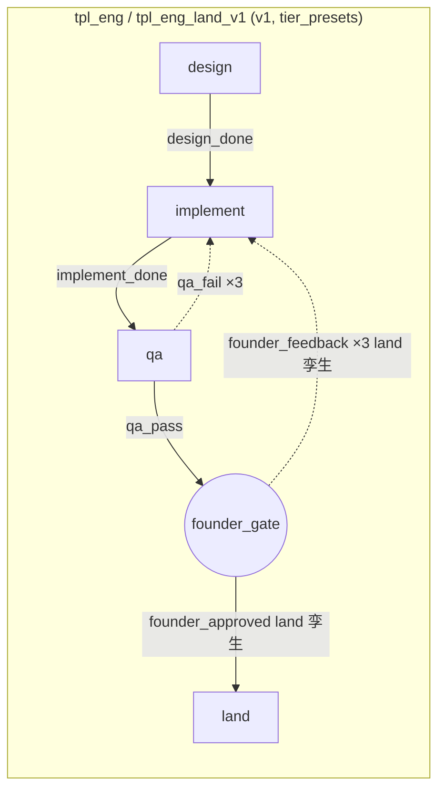
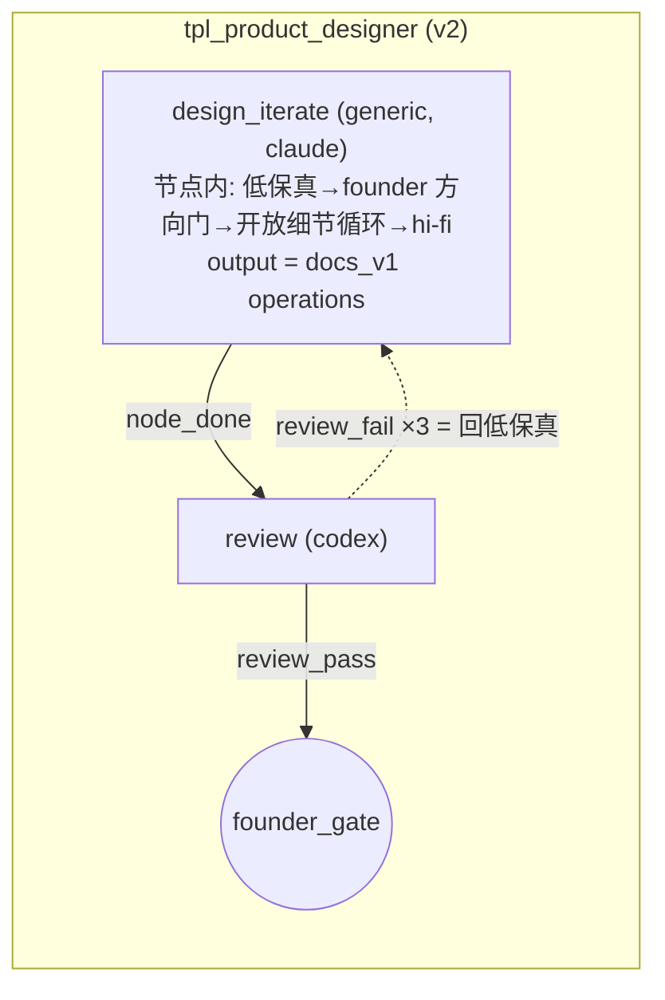
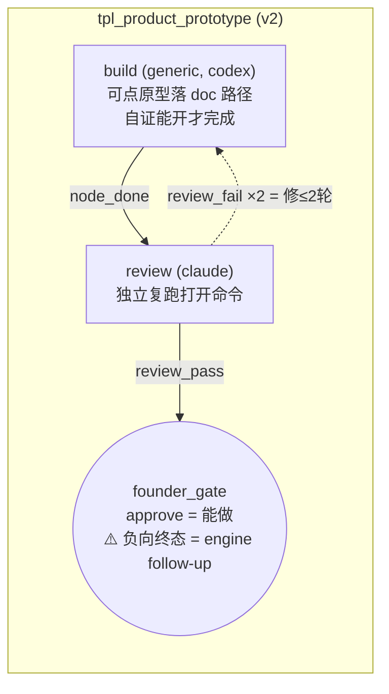

# FLY-1380 种 work-kind 模板(只建不迁) — 实施计划

Issue: FLY-1380 (https://linear.app/geoforge3d/issue/FLY-1380/dagbuild-种-work-kind-binding1396-prd-落地-派发按活的类型选模板不再一律-tpl-eng-heavy)
日期: 2026-07-22
基于: research.md

**Status**: **codex-approved**(R4 APPROVED,2026-07-22;R1 7 项 + R2 3 项 + R3 1 项共 11 项全采纳、零 waive;thread `019f8ad9-01c9-77d1-a11a-6e59bc87c7c1`)

## 0. 一句话

把 §3.2 映射表需要的模板 identity **创建 + 发布(dormant)**:合并三档工程模板为带 `tier_presets` 的 `tpl_eng`(+ land 孪生)、按 §7 获批合同新建 `tpl_product_designer` / `tpl_product_prototype`、以 `tpl_generic` 替换 tpl_ops_light,并解除 **import 层**的 generalized flag 门让 v2 模板能在生产「发布但不路由」;同时补 FLY-1407 D9a 移交的 `retired_at` 写入面(含 bind 侧 fresh-eligible 守卫)—— **全程零 binding 写入,warm/重启零 binding 行/零 binding audit**。

## 1. 范围与非目标

**做**:seed YAML ×5(+bundle 清单与其消费者清理)、import 层 flag 门解除(仅 2 处)、shipped executor ×2、`StateStore.retireWorkflowTemplate` + `bindWorkflowCategory` fresh-eligible 守卫(含 audit CHECK 迁移)、dormancy/物化/admission 测试矩阵、feature-flag registry 描述更新。

**不做**:任何 binding 写入 / cutover / `pipeline.work_kind` 翻转 / generalized flag 翻转;selection、runs-route、dispatch 谓词(`workflowTemplateDispatchBlockReason`)不动;`.flywheel/agents/` 下 pm-executor / prototype-executor 不动(§5.3 压 founder 门,cutover 原子单元第三件);revision 提交与 publish 路由的 flag 守卫(`StateStore.ts:13244/:13430`)不动;**不给 v2 terminal gate 造负向终态、不扩 docs materializer 的路径能力**(两者是显式登记的 engine follow-up,见 §5 交接合同 3/4)。

**⚠️ 两处对 PRD 字面清单的加项(请 design review 显式把关)**:

1. **`tpl_eng_land_v1` 孪生**(exploration D6):FLY-1375 land 流程按「每个 eng 模板一个 land 孪生」建;没有它,cutover 后 land 选项只剩注定退休的旧 identity。
2. **从 bundle 移除并删除 `tpl_ops_light.yaml` / `tpl_research_light.yaml`**(exploration D5):生产从未安装,移除 = PRD「替换不是新增/研究并入通用」的机制化;flag-on 环境已装的 DB 行留给 §3.3 retire 时序。消费者清理见 P2(R1#6)。

## 2. 模板形状(SSOT 图)







## 3. 交付物

### P1 · seed YAML(`packages/teamlead/src/workflow-seeds/`)

**两条 v2 硬合同(R1#1,全部新 v2 seed 必须满足,进 P6 测试)**:

- **每个非 gate 节点必须带 `effort`** —— v2 validator 不强制,但 snapshot 物化强制 pinned vendor/model/effort(`workflow-run-snapshot.ts:224-276`),缺了 = 首次选择在 materialize 抛错;
- **review 节点与其直接上游 producer 必须跨 vendor** —— admission 对同 vendor 返回 `same_vendor_review`(`StateStore.ts:15852-15881`,有既有回归钉住);producer 还必须 `produces_output`(`review_output_producer_required`)。

**`tpl_eng.yaml`**(schema 1,`name: Engineering (tiered)`,`project_scope: global`):节点/边/loop 与 tpl_eng_heavy 同拓扑,但 base 取「无 effort 公共底座」(override 只能设不能清 effort,research §5):

```yaml
nodes:
  - { id: design,    type: design,    vendor: claude, model: claude-fable-5,  handoff_pointer: { worktree: true, design_doc: true } }
  - { id: implement, type: implement, vendor: codex,  model: gpt-5.6-sol,     handoff_pointer: { worktree: true, design_doc: true } }
  - { id: qa,        type: qa,        vendor: claude, model: claude-opus-4-8, handoff_pointer: { worktree: true, design_doc: true } }
  - { id: founder_gate, type: gate }
# edges/loops/terminal_gate/ship_claims 逐字同 tpl_eng_heavy(qa_retry max 3)
tier_presets:
  heavy:
    reason: "eng heavy tier — xhigh implement"
    nodes: { implement: { effort: xhigh } }
  light:
    reason: "eng light tier — codex design"
    nodes: { design: { vendor: codex, model: gpt-5.6-sol } }
  trivial:
    reason: "eng trivial tier — codex design + fable QA"
    nodes:
      design: { vendor: codex, model: gpt-5.6-sol }
      qa: { model: claude-fable-5 }
```

(v1 三段节点的 effort/vendor 语义走既有 three-stage 机制,不受上面 v2 snapshot 合同约束 —— 三套旧 seed 本就如此。)

**等价复现承诺(R1#7 收紧口径,测试断言)**:对三档各自 `applyWorkflowOverride(base, preset)` 之后的**完整 effective manifest**(nodes+edges+loops+terminal_gate+ship_claims;`tier_presets` 已被 apply 删除,`workflow-template.ts:1163`)deep-equal 对应旧 seed 的 manifest。**不宣称** selection digest / snapshot / provenance 字节相同 —— identity、tier、category provenance 本就按新机制正常变化;兼容目标是 **applied manifest 与派发配置等价**。tier 缺省 = heavy(selection `input.tier ?? DEFAULT_ENG_TIER`),base 永不裸跑。

**`tpl_eng_land_v1.yaml`**:同 base + `manifest_variant: land_v1` + land 节点 + `approval_gate`/`terminal_node`/`founder_feedback` loop 逐字同 tpl_eng_heavy_land_v1 + **同一份 tier_presets**;同款完整-manifest 等价断言对 tpl_eng_heavy_land_v1。

**`tpl_product_designer.yaml`**(schema 2,`name: Product designer flow`):

```yaml
nodes:
  - id: design_iterate
    type: generic
    vendor: claude
    model: claude-fable-5
    effort: high
    agent_file: agents/designer-executor.md
    produces_output: true
    output: { schema: json_v1, max_bytes: 262144 }
  - { id: review, type: review, vendor: codex, model: gpt-5.6-sol, effort: xhigh }
  - { id: founder_gate, type: gate }
edges: design_iterate→review (node_done); review→founder_gate (review_pass)
loops: review_kickback: review→design_iterate, review_fail/review_pass, max_iterations 3, escalate
ship_claims: [design_review_approved, founder_approved]
```

producer=claude / review=codex:跨 vendor 满足 admission invariant,且「codex 审 claude 的设计产物」与本仓 design-review 文化一致。

**`tpl_product_prototype.yaml`**(schema 2,`name: Product prototype flow`):build(generic,codex/gpt-5.6-sol,**effort high**,`agent_file: agents/prototype-executor.md`,produces_output 同上)→ review(claude/claude-opus-4-8,**effort high**;review_kickback **max_iterations 2** = §7「修 ≤2 轮」,引擎语义已核:第 3 次失败才 held/escalate,`StateStore.ts:18526-18578`)→ founder_gate;ship_claims 同上。build=codex / review=claude 跨 vendor ✓。

**`tpl_generic.yaml`**(schema 2,`name: Generic single-session task`):manifest **逐字同 tpl_ops_light**(execute generic codex/gpt-5.6-sol low → founder_gate),仅换 template_id/name —— 重定义即重命名,模型旋钮是 cutover 前的产品决定,本单不夹带。

### P2 · bundle 清单与消费者清理(`workflow-template.ts:1266-1278`)

- 移除 `tpl_research_light.yaml`、`tpl_ops_light.yaml`(文件删除);末尾追加 5 个新 seed;重写清单注释(顺序对追加稳定)。
- **消费者逐一处置(R1#6 + R2#2,映射写死,不留给实现时选)**:
  - `workflow-template.test.ts` / `StateStore.workflow-templates.test.ts`:断言迁到 `tpl_generic`(或新 seed),期望集更新;
  - `scripts/qa-fly-1307-template-dispatch-e2e.mjs:692`(v2 sentinel,无 output 依赖)→ **`tpl_generic`**;
  - `scripts/qa-fly-1281-generalized-template-e2e.mjs` **分场景映射(R2#2:不可统一换 tpl_generic —— 它无 produces_output)**:
    - ops/no-output 场景 → `tpl_generic`;
    - output credential / missing-output 409 / 补交完成 / restart reconcile 场景(`:389-400,464-493`)→ **脚本内导入+发布一个专用 output-producing 测试 seed**(单 producer→gate,direct-to-gate,不塞多节点产品 flow);
    - flag-off 场景(`:519-533` 原断言「bundled v2 未安装」,与 P3 正面冲突)→ **重写**为:`tpl_generic` 已安装已发布,但 start 因 `generalized_disabled` 409,零 run/零 spawn;
    - 既有 marker/replay 断言全保留;仅当某子场景已有被点名的等价 real-machine 验证时才允许退役该子场景,**不许整脚本 fail-fast 代替迁移**;
  - 历史 design/QA 文档(记录旧事实)不改史料。

### P3 · import 层 flag 门解除(恰 2 处,其余照旧)

1. `importBundledWorkflowSeeds`(`workflow-template.ts:1310-1319`):删除 v2 skip 分支(连同 log);
2. `StateStore.importWorkflowTemplateSeed`(`StateStore.ts:13490-13492`):删除 v2 throw。

**不动**:`workflowTemplateDispatchBlockReason`(v2 admission/selection/successor 仍被 flag 挡)、revision 提交(`:13244`)、publish(`:13430`)。

**dormant 的精确定义(R1#7,验收按此口径,不说过头)**:

- 安装后**不会被 boot 默认集、category binding、或任何自动路径路由到**(无 binding 行);
- 生产现状(dispatch on + generalized **off**):**显式 `templateId` 直选同样被共享谓词挡住**(`generalized_disabled`);
- generalized **on** 之后:显式 `templateId + 非空 selectionReason` **可以**选中它们 —— 这是 PRD 本就允许的 lead-override 路径,**不算破坏 dormant**;「不被自动路由」的口径只由 binding 缺席保证。
- ⇒ P6 矩阵:flag off/on × ordinary category selection / direct templateId,四格断言按上面口径。

3. `config/src/feature-flags/registry.ts` `workflow_generalized_templates` 条目:描述/note 更新为「gates v2 admission/selection/runtime submission;**不再 gates bundled seed install**(FLY-1380 起 v2 seed 无条件安装发布、靠 binding 缺席 + flag 保持 dormant)」—— §5.5 第 5 例纪律。

### P4 · shipped executor(flywheel repo 根 `agents/`,各 <40k 字符)

**output 合同(R1#2,两份 executor 共用,写死)**:`produces_output` 节点的 output 会被 `WorkflowDocsMaterializer` 消费(`StateStore.ts:21067-21118`),payload 必须是 exact-key **`{kind:"docs_v1", operations:[{op:"write"|"delete", path, ...}]}`**(`workflow-docs-output.ts:92-158`),路径仅限 doc allowlist(`doc/`、`docs/`、`<pkg>/doc/`);review 节点拿到的是 **materialize 后的 git head**,不是原始 payload(`workflow-engine-dispatcher.ts:1117-1142`)。⇒ 两个 executor 的全部待审产物(mockup HTML、原型页面、打开命令、证据记录)**必须作为 docs_v1 write operations 落进本 issue 的 doc 文件夹**,让 reviewer checkout 即见。

**founder 投递合同(R2#1 + R3#1,designer 每一轮硬性,两段协议)**:founder 只看 hosted URL,**绝不交本地路径**(`packages/teamlead/lead-rules-base/founder-html-delivery.md` 全队铁律);节点类型是 `generic`,不会命中 design-node 的任何自动 HTML 可见性接线;且 **`publish-report --publish-only` 只返回 URL,不截图不投递**(`publish-report.ts:209-246` 固定 `screenshot:null`/`delivered:false`,有逐字段测试钉住)⇒ 协议分两段、以可观察回执衔接:

- **① Runner 段**:每轮 mockup `flywheel-comm publish-report --publish-only`(绝不带 --channel),校验返回 `url != null && publishOnly:true`,**只拿 URL**;把 URL + 标题 + artifact 标识经 `flywheel-comm ask` 交 Lead,请 Lead 做官方投递;
- **② Lead 段**:Lead 走 `founder-html-delivery`(full-page visual + 官方卡片,Lead 是唯一 founder 投递面);
- **③ 可观察回执**:Runner 用 `flywheel-comm check <question_id>` 轮询,**读到 Lead 的肯定投递回执后**才开对应 question gate;失败/超时 → blocked/escalate,**绝不把 `--publish-only` 的 `screenshot:null`/`delivered:false` 当投递成功**;gate 本身超时同样 fail-closed(升级重问,绝不自判)。

产品交互形状照 `.flywheel/agents/engineering/designer-executor.md:78-93` 先例;命令语义按上面的真实 CLI 行为写,不沿用先例文字里的合并表述。

**`agents/designer-executor.md`** —— 骨架沿 `agents/generic-executor.md`(pipeline preamble/stage 上报/escalation 同款),§7 合同段:

1. **低保真先行**:先产 2-3 个方向的低保真 mockup(HTML,落 doc 路径),不许直接 hi-fi;
2. **方向门(硬)**:低保真按上面投递合同发布并经 Lead 交 founder,`flywheel-comm gate question` 阻塞等方向确认;**超时/无回复 ≠ 批准**;
3. **开放细节循环**:方向定后每轮产更新 mockup,**每轮都走同一投递合同**,**只认 founder 显式「定了」**为终止;
4. **hi-fi 产出** + output = docs_v1 operations(mockup/hi-fi HTML + 一页说明 + founder 确认记录 + 各轮 hosted URL 清单,全部 doc 路径);
5. review_fail 回本节点 = 从最便宜一步重新收敛。

**`agents/prototype-executor.md`**:

1. 搭**可点/可开**的最小原型:自包含 HTML/JS 页面(或等价 doc-可载体),落 doc 路径;打开命令(如 `open <doc 路径>`)+ 前置条件写进说明页;
2. **自证能开才许完成**:实际打开/渲染一次并把证据(输出摘要/proofshot 指针)写进说明页;review 节点在 materialized head 上**独立复跑打开命令**是第二道;
3. output = docs_v1 operations(原型文件 + 说明页 + 证据记录);
4. **判定归 founder gate;executor 不揣测结论**。

**⚠️ 两条诚实边界(随 executor 文案与 plan 一起写死,不假装能力存在)**:

- **「真跑」类原型(需要 server/依赖安装/doc 路径之外的源码)当前 materializer 装不下** —— §7 的「能点」v1 全覆盖;「能真跑(超出 doc 路径)」= 具名 engine follow-up(§5 交接合同 4),在它落地前 executor 明确拒接该形态并升级 Lead;
- **「不能做」负向终态在 v2 gate 状态机上不存在**(R1#3,源码核过:只有 `founder_approval` 写 claim 并 completed,`StateStore.ts:19704-19743`;负向 `founder_feedback` source 仅 v1-land 合法,v2 抛 `run state` 后被 projector dead-letter,`StateStore.ts:19615-19636` + `founder-approval-projector.ts:68-71`;dashboard reject/shelve 只动 session FSM 不终结 engine run,`actions.ts:1931-1960`)。⇒ **本单不宣称 reject/shelve 是合法终态**;executor 文案只承诺 approve=能做;负向终态 = §5 交接合同 3 的 cutover 前置。

与 flywheel 项目 `.flywheel/agents/engineering/` 下的 `designer-executor.md`(label 路由 A/B/C 方向设计 agent)、`product-designer-executor.md`(FLY-880 PM agent)、`prototype-executor.md`(label 路由原型 agent)**都是不同的东西** —— 那些是 flywheel 项目私有的 legacy 单 session 角色,本单两份是全局 DAG 节点 executor;文件头部互相注明,防后来者合并。

### P5 · retire 写入面 + bind 守卫(`StateStore`)

```ts
retireWorkflowTemplate(input: { templateId: string; actor: string; reason: string }):
  | { status: "retired" }
  | { status: "already_retired" }
  | { status: "not_found" }
  | { status: "refused_bound"; refs: Array<{ project: string; taskCategory: string }> }
```

- 输入卫生:actor/reason **trim 后强制非空**;
- fail-closed:模板不存在 → not_found;**任何项目任何 binding 行(exact 或 `*`)引用 → refused_bound + refs(按 project, taskCategory 确定性排序)**;
- **异常态优先暴露不隐藏**:已 retired 但仍有 binding 引用(旧库异常)→ 返回 `refused_bound`(invariant 破损显式可见),不用 `already_retired` 盖过;
- 幂等:已 retired 且零 refs → no-op;
- 成功:**单事务**内完成存在性/refs 检查 + `retired_at = datetime('now')` + audit 行(action `template_retire`,detail `{reason}`);
- 不做 unretire;本单零 caller(D9a seam,执行属 cutover 单)。

**`bindWorkflowCategory` fresh-eligible 守卫(R1#4,封「retire 后再 bind」)**:现守卫只查模板存在与 scope(`StateStore.ts:13591-13633`),binding 路径的 selection 也不查 retired(只有 templateId 直选查,`workflow-template-selection.ts:88-93`)⇒ 补:bind 目标必须 **published(`current_published_revision` 非空)且 `retired_at IS NULL`**,否则 throw。对现有唯一 caller(`ensureDefaultWorkflowBindings`,目标全是已发布未退休 v1)字节无感;测试断言「retire 后 bind 被拒且零 binding/零 audit 残留」。

**audit CHECK 迁移(R1#4 + R2#3 加固)**:`workflow_template_audit` 挂着**三个** append-only trigger —— `workflow_template_audit_no_update`、`workflow_template_audit_no_delete`(`StateStore.ts:2816-2831` 循环建)与 `workflow_template_audit_no_replace`(`:2850-2857`,禁显式复用 id)—— 及 index `idx_workflow_template_audit_template`(`:2860-2862`);DROP/RENAME 全丢 ⇒ 迁移(sqlite_master 检测 CHECK 缺 `template_retire` 才跑;先例 `workflow_claims` 重建,`StateStore.ts:12711-12778`)必须**重建后按名显式重建这三个 trigger + index**。测试断言:两次开库不重复重建;旧 rows/id 保留;CHECK 含新旧动作全集;UPDATE/DELETE 仍被拒;**`INSERT OR REPLACE` / 重复显式 id 仍被 `no_replace` 拒且原 row 不变**;index/三 trigger 均存在。

### P6 · 测试矩阵(TDD,先红后绿)

| 测试 | 断言 |
|---|---|
| validator + bundle | 5 份新 seed 全过 validator;bundle 清单 = 期望集(旧两件不在) |
| tier 等价复现 | 三档 + land 孪生:applied **完整 manifest** deep-equal 对应旧 seed(口径见 P1) |
| **v2 物化真跑(R1#1/#5)** | 对**全部 v2 seed**(designer/prototype/generic/product_v1)在临时 canonicalRoot(放好 agent 文件)上真跑 `buildWorkflowRunSnapshotV2` 成功 —— 钉住 effort 齐全 + agent_file 可读;designer/prototype 额外走 producer admission→完成→**review admission 成功**(钉住 cross-vendor + produces_output) |
| **output→review 链路(R1#2)** | executor 合同形状的 docs_v1 payload:submit → docs materialize 出 head → review dispatch 拿到 head,断言 head checkout 内存在原型/说明页与打开命令;非 docs_v1 形状 payload 断言按现状被判 permanent failure(反例钉合同) |
| dormancy 哨兵 | `DEFAULT_ENGINEERING_WORKFLOW_BINDINGS` 类别集 ∩ `WORK_KIND_CATEGORIES`(import 自 `work-kind.ts`)= ∅;生产形状 fixture(项目已有恰一行 `*→tpl_eng_heavy`)warm → binding 行/审计零增量;既有「默认三行 + 二次 warm 零 audit」测试保留 |
| import ungate + dormant 矩阵 | flag-off 安装并发布全部 v2 seed;重复 import 全 `unchanged`;**off/on × category/direct 四格**(口径见 P3);v2 已安装 + flag off + 仅 wildcard v1 binding ⇒ candidate 解析与安装前逐字相同;`workflowTemplateDispatchBlockReason(2, off) === "generalized_disabled"` 显式一条 |
| retire + bind 守卫 | 四种返回态;refused_bound refs 排序;异常态(retired 仍 bound)→ refused_bound;**retire 后 bind 被拒零残留**;retired 后 templateId fresh 选择 409;audit 迁移五条断言(见 P5) |
| executor 文件卫生 + 合同守卫(R2#1+R3#1) | 两文件存在、非空、<40k,且被 v2 物化真跑测试实际消费(不只 stat);**contract guard**(FLY-880 模式):designer-executor 必须含「**publish-only URL → 交 Lead → founder-html-delivery → 可观察回执(check)→ 才开 gate**」的顺序锚点 + 「禁把 publish-only 的 screenshot:null/delivered:false 当投递成功」+「超时≠批准」;prototype-executor 必须含「自证能开、docs_v1、判定归 founder gate、不揣测结论」锚点 |

### P7 · 文档与 ship note

- ship note:**部署后首次重启一次性安装 v2 模板(模板表 burst)**;验收命令 = 重启前后 `workflow_category_binding` **排序后逻辑行集与 audit 计数**逐一相等(生产 DB 现状验,不比文件字节)+ `workflow_template` 新增 = 预期 6 identity(tpl_eng、tpl_eng_land_v1、tpl_product_designer、tpl_product_prototype、tpl_generic、tpl_product_v1)。

## 4. 验收映射(issue 验收 → 本单/下游)

| issue 验收项 | 归属 |
|---|---|
| work-kind=prd → PRD 模板 / code → tpl_eng | **cutover 单**(需 binding+开关);本单交付可绑的已发布模板 + 等价复现测试 |
| 缺 work-kind 且 v2-routed → fail-loud | **FLY-1407 已落**(founder correction:absent = generic 软兜底 + 提醒,非法值 fail-loud —— 表述以此为准);本单不触 |
| warm/重启不写 live binding(生产 DB 现状验) | **本单**:P6 哨兵 + P7 逻辑行集对比 |
| 迁移回归 fixture(wildcard-only 项目 keyless legacy start 成功) | **迁移 PR 前置**(§6.3);本单附邻近回归(P6 import 行) |

## 5. 交接合同(写给 cutover 单,防掉缝)

1. binding 迁移 + activation gate + §6.3 回归 fixture(**dormant v2 binding 在场 + 开关 off**)——未建,cutover 单负责;
2. **per-project preflight:agent_file 集从目标 manifest 派生,不硬编码**(R1#5)—— 遍历五个目标模板全部 generic 节点收集去重 `agent_file`(当前集 = `agents/generic-executor.md`、`agents/designer-executor.md`、`agents/prototype-executor.md`),逐项目校验存在/可读/非空/不越界/≤40k;`readAgent` 只认目标项目 canonicalRoot、**无 flywheel 安装目录回退**(`workflow-run-snapshot.ts:99-120`)⇒ 本单只落 flywheel repo,其它项目 repo 铺文件是各自 cutover 的前置;
3. **`prototype` 类别的 cutover 追加两条 hard precondition(并列,缺一不得绑定)**:
   - **(a) v2 terminal gate 的负向终态**(「不能做」= 合法终结)——现状不可表达(P4 源码核);需 engine follow-up(有理由的 negative terminal decision:holder/source/claim/run completion/UX)或产品对语义的显式修订;
   - **(b) founder 试用投递(R2#1)**——materializer 只 push/confirm head 不投递 artifact(`workflow-docs-materializer.ts:276-294`),terminal gate 卡片只有 issue+head SHA+approve 文案(`gate-materializer.ts:82-95`),founder 无从「试」⇒ 需具备「已 materialize 且 review-pass 的 exact head 中的 artifact,以 founder 可访问 URL/visual/打开指引投递、且投递收据与该 head/artifact digest 绑定」的能力;
   - 验收须钉顺序:**reviewed head → founder delivery receipt(绑同一 head/digest)→ founder decision**,并分别驱动「能做/不能做」两终态,断言 run terminal、holder/source 无残留、零 deadletter;**不得**用 head SHA 或本机 `open <path>` 代替投递;
4. **「真跑」类原型的 materializer 能力**(doc allowlist 之外的产物)= 另一条具名 engine follow-up;在此之前 prototype 模板只承诺「可点」形态;
5. retire 执行 = 调 `retireWorkflowTemplate`;**建议 retire 集 = 旧 5 identity + 3 个旧 land 变体**(后半是对 PRD §3.3 的加项建议,记录待拍);
6. §5.3 `no-three-stage` A 案仍待 Annie;`.flywheel` 两个 prompt 资产属 cutover 原子单元第三件(§8-D 四拍另有 launcher/哨兵前置)。

## 6. 实施顺序

1. 测试先行:validator/tier 等价/dormancy 哨兵(红)→ P1/P2 seeds + 消费者清理(绿);
2. v2 物化真跑 + output→review 链路测试(红)→ P4 executor 文件(绿);
3. import ungate + dormant 矩阵测试(红)→ P3(绿);
4. retire/bind 守卫 + 迁移测试(红)→ P5(绿);
5. P7 registry 描述 + 文档;全仓 `pnpm lint` + teamlead 套件(机器态 flake 按 main HEAD 对照口径)。

## 7. 风险

| 风险 | 处置 |
|---|---|
| 首次重启模板表 burst 被误读为「静默激活」 | ship note 写明 + 验收口径锚定 binding 逻辑行集(§5.5-2 禁的是 binding audit row) |
| bundle 移除两条目遗留僵尸消费者 | P2 逐文件处置清单(含两个 QA e2e 脚本) |
| registry 描述漂移(假控制面) | P3-3 与代码同 PR 落 |
| designer 开放循环 = 节点会话可能长时间阻塞在 founder 门 | §7 获批合同本身如此;executor 写死「超时≠批准、升级不自判」,由 Lead relay 兜节奏 |
| 新 v2 模板「能装不能跑」 | P6 物化真跑 + admission + output→review 链路测试整链钉死(R1 三个 blocker 的结构性防复发) |
