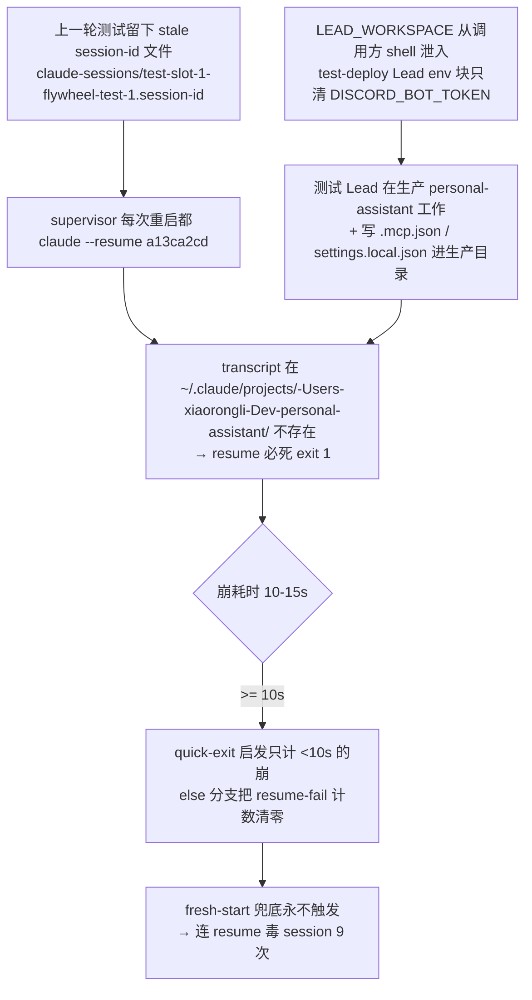

# FLY-1389 529房测试房修缮批 — 探索

Issue: FLY-1389 (https://linear.app/geoforge3d/issue/FLY-1389/infra529房-测试房修缮批-lead-lease-超时旋钮-no-lead-模式-全局-symlink-稳定路径守则)
日期: 2026-07-20
基于: 无

## 1. 背景与来源

FLY-1356 三臂 E2E(2026-07-20)过程中,QA runner 在 529 测试房实证撞出一批**基建缺陷**,与 FLY-1356 本体无关。按 Annie 的 consolidate 原则并成一张修缮批。529 房是 FLY-1356 上线的硬前提。

设计期间 Lead(Tadashi)给出 4 条更正 + 1 条 P0 收尾项(brainstorm gate 两轮,第二轮批准),其中最关键的数据更正:**「冷 Lead 8 分钟启动」是未验证旧笔记 — 真实观测 = 成功 0 次、启动即崩 9 次**。本单的核心问题从「为什么慢」变成「为什么崩」。

## 2. 实证清单(全部有当场证据)

| # | 实证 | 证据 |
|---|------|------|
| 1 | test-deploy Lead lease 120s 超时,Lead 从未 ready | `scripts/test-deploy.sh` Step 2(60×2s)+ Step 2b extra-lead(120s);`/tmp/flywheel-test-slot-1/lead.log` |
| 2 | 测试 Lead 启动即崩,连崩 9 次,0 成功 | `lead.log` 09:02–09:10:每次 `claude --resume` 后 10-15s exit 1(见 §3 根因) |
| 3 | 全局 `~/.flywheel/bin/agent-team-transport` symlink 曾指向 FLY-1335 worktree dist → worktree 清理即断链 → 新起 Lead FATAL | Lead 已手工重指主仓;FLY-1117 取证日志中多次出现 `[sync-bin] replaced stale symlink → <worktree>` |
| 4 | `tmux-server-rescue` 链接同样断链(第 5 实证) | Lead 2026-07-20 手工修复 |
| 5 | matt-skills marketplace 注册指向 worktree | `~/.claude/plugins/known_marketplaces.json:42-47` → `Dev/flywheel/worktrees/fly1356-qa529/vendor/matt-skills` |
| 6 | 本 runner 的 worktree `~/Dev/flywheel-FLY-1389` 被清理波误删(设计进行中) | 本 session 实况;Lead 确认误删并重建 — 「临时路径被别人清」这一风险类的又一实证 |
| 7 | LEAD_WORKSPACE 泄漏:测试 Lead 工作在生产 `~/Dev/personal-assistant`(Belle 的 workspace)并写入 `.mcp.json` + `.claude/settings.local.json` | `lead.log` 09:01:57 `Using LEAD_WORKSPACE override`;两文件 09:01 时间戳,内容为 test-slot-1 值 |

## 3. 崩因诊断(设计期现场取证,三层)

1. **直接崩因**:`~/.flywheel/claude-sessions/test-slot-1-flywheel-test-1.session-id` 存 stale session `a13ca2cd`,对应 transcript 文件不存在 → `claude --resume` 确定性失败(exit 1,~10-15s)。
2. **放大器(supervisor 逻辑缺陷)**:`claude-lead.sh:3013-3028` 的 resume-failure 启发只在 `DURATION < 10` 时计数;实测每次崩耗 10-15s → 走 else 分支把 `RESUME_FAIL_COUNT` **清零** → 删 session-id 走 fresh 的兜底永不触发。确定性失败被当成 transient。
3. **环境污染**:`LEAD_WORKSPACE=/Users/xiaorongli/Dev/personal-assistant` 从调用方 shell 泄入(`claude-lead.sh:466` 用 `LEAD_WORKSPACE:-默认` 且 test-deploy.sh 的 Lead env 块不清它)。后果双重:(a) 测试 Lead 的 transcript 落在 personal-assistant 的 project slug 下,与 session-id 文件的历史状态错位,参与制造 resume 失败;(b) 测试写生产 workspace = 与 symlink 问题同类的隔离违规。

旁证:24KB `test-identity.md`(疑点 1)非直接崩因 — 崩在 resume 路径,append-system-prompt 尚未参与;fresh 启动路径由真机复跑验收覆盖。

## 4. 根因归类:三类结构性缺陷

1. **stale 状态复活**:session-id / lease / lock 等全局状态跨测试轮存活,复活后毒化新一轮(实证 2)。
2. **临时路径写入全局**:安装/启动路径用「脚本自身所在目录」推导根路径并写进全局配置(symlink target、marketplace path、converge 源)— 谁在临时目录跑一次,全局就永久记住临时地址(实证 3/4/5)。Lead 定性:根因在**安装步骤**不在重启。
3. **环境泄漏**:测试进程继承调用方 shell 的生产 env(LEAD_WORKSPACE),打穿测试/生产隔离(实证 7)。

## 5. 方案选型(gate 两轮收敛)

### 5.1 写入时防线 vs 检测修复(Lead 更正 ②)
第一版设计以「检测断链后重指主仓 + alert」为主。Lead 否决为主修:Annie 的红线是**「一开始就不许指错」**,检测后修复 = 她拒绝的补丁层形态。收敛为:
- **主修 = 写入时 canonical 守卫**:`syncFlywheelCliBin()` / `converge-flywheel-bin.sh` 在写**全局默认 bin** 前判定 repoRoot 是否临时形态,是则拒写 + 响亮报错;
- **检测修复降级为兜底层**(防线之外的第二道,处理历史遗留与绕过防线的写入)。

### 5.2 worktree 判定:`.git` 是文件 vs 命名约定
命名约定(路径含 `/worktrees/`、`<repo>-<ISSUE>` 形态)有假阴性(任意目录名的 clone)与假阳性风险。选用**精确判据**:
- linked git worktree 的 `.git` 是**文件**(gitdir 指针),主 checkout 的 `.git` 是**目录** — 不依赖任何命名约定;
- 叠加 tmp 形态路径(`/tmp`、`/private/tmp`、`/var/folders`)覆盖非 git 临时目录。
- 显式 env 逃生口(opt-in)保留刻意场景。

### 5.3 检测挂载点
`converge-flywheel-bin.sh`(FLY-954)已挂载在:每次 Lead start(非致命)+ update-flywheel.sh 每日 sweep + restart-services.sh pre-kickstart(fail-loud)。path-hygiene 自检与断链兜底扩进这套现成挂载,不新增周期负载。

### 5.4 slot 隔离:env seam 已存在
`sync-flywheel-hooks.ts` 已有 `FLYWHEEL_BIN_DIR` / `FLYWHEEL_HOOKS_DIR` env seam(注释明写 "for test slots"),但 test-deploy.sh 从未接线 — slot Bridge 一直在写全局 bin。修复是纯脚本接线,零 TS 改动。注意:canonical 守卫仍必须做 — 2026-07-20 03:50 的污染源是**非-slot** 的 worktree Bridge,env seam 护不到它。

### 5.5 lease 旋钮 + --no-lead 的定位调整
数据更正后,旋钮不再是主修(Lead 起不来不是慢是崩),但两路仍做:
- 旋钮(`--lead-ready-timeout` + env):共享机器高负载下冷启动确实可能超 120s,独立成立;
- `--no-lead`:跳过 Lead 供纯 Bridge/API 类 QA 提速去依赖。已核实 Bridge 对未注册 Lead 是软处理(`plugin.ts` 30s 重试注册,不 crash),结构上可行。

### 5.6 评估项结论(Lead 已同意)
- **房内 auto-QA**:`qa_multilead_config_yaml` 生成的房内 config 无 `qa:` 块 = auto-QA 默认关。现状合理(529 房的 QA 由 suite 驱动,不需要 auto-QA 自旋),**不改**。
- **token 口径**:`packages/token-usage/src/classifier.ts:54` 把含 `flywheel-test-slot` 的 cwd 归 `sandbox` 桶(aggregator 有 surface 不隐藏)。FLY-1356 QA 的 transcript 直读配方可行,**不改代码**,配方写进 qa-framework 文档。

## 6. P0 收尾项执行记录(gate#2 追加,已完成)

personal-assistant 残留审计+清理(2026-07-20 10:17):
- 该目录**非 git 仓** → 逐文件核。测试写入恰两个文件:`.mcp.json`(1100B,内容全为 test-slot-1 值:BRIDGE_URL :19871、test token、fly1356-qa529 worktree 路径)+ `.claude/settings.local.json`(41B),均 09:01 时间戳。
- 全深度扫描 08:30 后无其他写入。
- 处置:证据副本留 scratchpad 后删除两文件。安全依据:Belle supervisor(PID 805,00:40 起,早于污染)运行中会话加载的是她自己启动时写的配置;`claude-lead.sh` 启动序列必先原子重写这两个文件再起 claude,任何经 supervisor 的重启自动重生成正确值。
- 附带发现:test-slot-1/2/3 的 manifests(`~/.flywheel/manifests/`)也带 personal-assistant 引用 — 泄漏影响过多个 slot;teardown 补清 manifest 进 plan。

## 7. 边界(不在本单)

- delivery-secret 失配 marker 修复 — 已列 ship 重启 checklist,Lead 在停机窗口执行。
- 巡检误报三件套 — 并入 FLY-1386/1388 族。
- 24KB identity 瘦身 — 非崩因,不动(fresh 路径由真机验收覆盖,若复跑暴露新问题另立单)。

## 8. 验收(升级版,gate#2 锁定)

1. 真机复跑一次 529 部署全程无手工绕(崩因修复后 Lead 能起;或 --no-lead 路径)。
2. 故意造断链 → provision/启动路径喊出来(alert)而非静默 FATAL。
3. **新判据(Annie 承诺机器化)**:在任意目录跑安装/部署脚本,全局配置里不允许出现临时目录路径 — `check-global-path-hygiene.sh` 自动检查。
