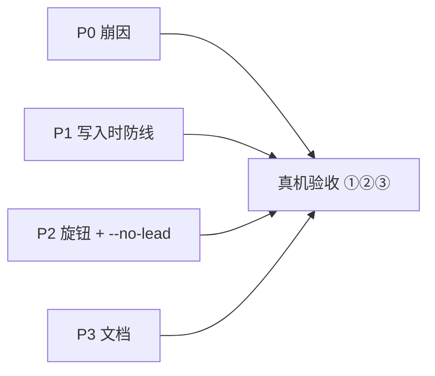

# FLY-1389 529房测试房修缮批 — 实施计划

Issue: FLY-1389 (https://linear.app/geoforge3d/issue/FLY-1389/infra529房-测试房修缮批-lead-lease-超时旋钮-no-lead-模式-全局-symlink-稳定路径守则)
日期: 2026-07-20
基于: research.md(v2,含 Codex R1 事实修正)

## 0. 总览与兼容承诺

单 PR 交付,四块按依赖排序:P0 崩因 → P1 写入时防线 → P2 旋钮/--no-lead → P3 文档。全程 TDD。

**接口兼容承诺(精确表述,替代「逐字不变」)**:不设新 env/flag 时,所有脚本的 CLI 接口、输出契约(含 `restart-services.sh` 依赖的 converger stdout 机器格式)、生产主仓路径上的部署行为保持兼容。**有意的默认行为变化**(全部是 bug 的行为面):
- P0-c:resume 崩溃计数窗口 10s → 60s(确定性 resume 失败 3 次后 fresh,原为永不);
- P0-d:test-deploy 起 Lead 前无条件删本 slot stale session-id(原为保留并 resume);
- P1-b:从 temp/worktree root 向**全局** bin 装订 → 拒写 + 非零/errors(原为照写 — 即事故本身);
- P0-a/P2:测试房 Lead env 不再继承调用方 `LEAD_WORKSPACE` 等(原为泄漏)。

## P0 · Lead 崩因修复

### P0-a Lead env sanitize(主 + extra 逐字指定)
- 主 Lead env 块(`test-deploy.sh:1049`):`env -u DISCORD_BOT_TOKEN` 扩为 `-u DISCORD_BOT_TOKEN -u LEAD_WORKSPACE -u CLAUDE_CONFIG_DIR -u FLYWHEEL_LEAD_MODEL -u FLYWHEEL_LEAD_EFFORT`,并**显式**设 `LEAD_WORKSPACE="${SLOT_DIR}/lead-workspace"`。
- extra Lead(campaign,`:1322-1337`)逐字指定 `LEAD_WORKSPACE="${XDIR}/lead-workspace"`;campaign manifest(`:1227-1230`)`leadWorkspace` 字段同步为该值,abort cleanup / owner teardown / 相关测试**消费同一字段**(不允许 manifest 与实际路径分叉)。
- 测试(hermetic,仿 multilead A1-A3):caller 注入恶意 `LEAD_WORKSPACE` → main + extra 两路断言均落 slot/XDIR 路径;不注入 → 兼容对照。

### P0-b resume 预检 = 诊断日志,不删除(Codex R1 #7 采纳备选)
- resume 分支(`claude-lead.sh:2895-2899`)起 claude 前:计算期望 transcript 路径(`${CLAUDE_CONFIG_DIR:-$HOME/.claude}/projects/<slug(workspace physical abs path)>/<uuid>.jsonl`)并 **log 存在性一行**(uuid 严格 UUID 校验失败也仅记日志)。**不做删除动作** — slug 规则是 Claude Code 内部约定,无稳定 contract,误判会把生产活 session 强制 fresh,比现状更破坏。删除权归 P0-c(生产兜底)与 P0-d(测试房)。
- 测试:hermetic — absent/present transcript 两场景断言日志形态;断言无删除副作用。

### P0-c resume-fail 计数器修复(生产兜底主刀)
- `claude-lead.sh:3017` 判据 `DURATION < 10` → `DURATION < 60`(与 CRASH_COUNT 60s 健康线对齐);`RESUME_FAIL_THRESHOLD=3` 不变 → 确定性 resume 失败最坏 3 次(约 3 分钟含 backoff)后删 session-id 走 fresh。日志文案随之更正。
- **test seam(Codex R1 #9)**:把崩溃处理判定抽成 sourceable 纯函数(新 `packages/teamlead/scripts/lib/resume-recovery.sh`,输入 IS_RESUME/DURATION/EXIT/计数 → 输出动作与新计数,claude-lead.sh source 之),新 `claude-lead-resume-recovery.test.sh` 以假 duration 驱动 absent/present/三连崩序列,**零真实 sleep**。突变验证:恢复 `<10` 判据,三连 10-15s 崩场景必须变红。

### P0-d deploy 前置删 stale session-id(测试房 fresh 语义)
- test-deploy.sh Step 1 前(主)与 extra-lead 启动前:`rm -f ~/.flywheel/claude-sessions/<proj>-<agent>.session-id`。
- (manifest 清理 HEAD 已有:`test-teardown.sh:486-497`,不列工作。)
- 测试:hermetic — 预置 stale 文件 → 干跑至 Step 1 前 → 已删。

## P1 · 全局路径写入时防线

### P1-0 共享判据库(新 `scripts/lib/path-hygiene.sh` + TS 纯函数)
单一真相的两个宿主(bash/TS 各一,测试互相对齐):
- `is_temp_or_worktree_root <dir>`:canonical 化(physical realpath)后 —
  (a) 前缀命中 `{/tmp, /private/tmp, /var/folders, /private/var/folders}`(macOS `/var`→`/private/var` 实测,research §7c)→ temp;
  (b) `<dir>/.git` 存在且是**文件**(linked worktree 判据,只对 root 用)→ temp;
  (c) 其余放行(主 checkout、packaged `.flywheel-prebuilt`、fleet 自定义 root)。
- `is_global_bin_dir <dir>`:**resolved identity 对比** — canonical(dir) == canonical(`$HOME/.flywheel/bin`)(Codex R1 #2:不看值从哪来;`FLYWHEEL_BIN_DIR=$HOME/.flywheel/bin` 或 symlink alias 一样算全局)。
- **allow-missing canonicalization 契约(Codex R2 #2,BLOCKER 修法)**:目标目录在 clean host 上可能尚不存在,裸 `realpath`/`realpathSync` 会失败;若把失败当「非全局」会恰好放过守卫要拦的第一次安装。规范:解析**最长已存在祖先**的 physical realpath,normalize 后拼回缺失后缀,再做边界安全的 identity/前缀对比;其余解析错误一律 **fail-closed**(当全局处理→触发守卫)。
- 测试:bash + TS 双侧 — worktree(.git 文件)/主 checkout(.git 目录)/tmp 三前缀/`/private/var/folders`/exact-global override/symlink alias 反例矩阵;**clean-host 场景**:`$HOME` 存在但 `.flywheel/bin` 不存在 — temp/worktree root 必须非零且**不创建 `.flywheel`**,可信主 root 可正常创建安装;macOS 真机各验一次谓词本身(FLY-1285)。

### P1-a slot Bridge 隔离接线
- test-deploy.sh Step 3 两个 Bridge env 分支加 `FLYWHEEL_BIN_DIR="${SLOT_DIR}/bin"` + `FLYWHEEL_HOOKS_DIR="${SLOT_DIR}/hooks"`(seam 已存在,零 TS 改动)。
- 测试:hermetic env 断言;真机证据并入验收①。

### P1-b canonical 写入守卫(writer 全集覆盖)
覆盖口径 = **所有全局持久化面**(`~/.flywheel` 生效态、`~/.claude` settings/plugins、LaunchAgents 等),不只 `~/.flywheel/bin` 字面(Codex R2 #1)。已确认 writer 五个(research §7b),各接同一判据:
1. **`syncFlywheelCliBin()`**:`is_global_bin_dir(binDir) && is_temp_or_worktree_root(repoRoot)` → 整批拒写,逐 bin 记 `result.errors`(reason 全文)+ ERROR 日志;逃生口 `FLYWHEEL_SYNC_BIN_ALLOW_TEMP_ROOT=1`。binDir 非全局(slot 隔离)不拦。
2. **`converge-flywheel-bin.sh`**:头部判据命中且 STATE_DIR/bin 为全局 → **零写入(不建目录不改文件)+ ONE alert + stderr 说明 + 最终 `rc=1`**(pre-kickstart fail-loud 契约必须非零;人类日志全走 stderr,保 `restart-services.sh:1068-1094` stdout 机器契约);逃生口 `FLYWHEEL_CONVERGE_ALLOW_TEMP_ROOT=1`。
3. **`flywheel-cmux-install.sh`**:`ln -sf` 前同判据拒绝 + 非零退出。
4. **`scripts/install-hooks.sh`**(R2+R3 BLOCKER):现把执行 checkout 的绝对路径写进全局 `~/.claude/settings.json` hook command。注意 HEAD 的 `sync-flywheel-hooks.ts:24-27,49-50` **刻意只部署 inbox-check.sh、不部署 flywheel-session-end.sh** — 稳定副本没有现成 deploy owner,光改 settings 指向会注册一个缺失/陈旧文件。修(install-hooks.sh 自任 deploy owner,顺序硬性):
   (i) temp/worktree source 判据**先于任何全局改动**,命中 → 拒绝(非零 + 指引),零全局写入;
   (ii) 合法 source → **原子 copy + chmod 0755** `flywheel-session-end.sh` 至 `~/.flywheel/hooks/`(temp-write + rename,同 syncFlywheelHooks 手法);
   (iii) 然后才 merge settings.json:command 指向稳定路径,且**替换**同一 SessionEnd hook 的 legacy checkout-path 条目(不允许坏条目与新条目并存);
   测试:trusted clean-install / 内容更新 + 幂等重跑 / legacy 条目迁移 / exec-mode / worktree-refusal 零全局改动 五场景,终态断言 settings 恰一条稳定 command 且无 checkout 路径。
5. **`scripts/provision-fleet-host.sh`**:默认(生效全局)目的地时接判据;显式假 `--home` 的 hermetic 用法**保留放行**(判定基于 resolved 目的地是否为生效全局,非调用形态)。
- implement 期 inventory 复核**按持久化面口径**(而非单一 grep):`~/.flywheel`、`~/.claude`、`~/Library/LaunchAgents` 三面各 grep 一轮;新发现 writer 一律接 `lib/path-hygiene.sh`;PR 列明盘点结论(含「核过不接」名单与理由)。
- hooks 内容拷贝侧(`syncFlywheelHooks`)v1 不拦(无断链形态 + slot 已隔离),记 §5 已知边界。
- 测试:TS — fake worktree 拒写 / `.git` 目录照写 / binDir 覆盖不拦 / 逃生口放行;bash — converge 零写入 + rc=1 + alert、cmux-install 拒绝、install-hooks worktree-source 拒绝、provisioner 默认目的地拒绝 + 假 `--home` 放行(突变验证:摘守卫断言反转)。

### P1-c 断链自检 + 兜底修复(仅在可信 root 下运行)
- `converge-flywheel-bin.sh` 新增 symlink 健康段,覆盖 `agent-team-transport`、`tmux-server-rescue`、`flywheel-cmux-sync`、`flywheel-cmux-autostart`:
  - **前置条件:self-derived REPO_ROOT 已通过 P1-0 判据**(Codex R1 #3:worktree root 下不存在可信「主仓源」,严禁在被拒 root 下做任何 repair;不引入 repo-root env seam);
  - 断链(canonical target 不存在)或 target 属 temp/worktree(判定算法见 P1-d)→ 本 root 对应源存在且 sane → 原子重指 + ONE alert;源缺 → alert only 不修;
  - 健康 → 静默。修复失败计入 converger `rc=1`。
- 验收②(故意断链 → 喊出来)由此覆盖。
- 测试:hermetic 五场景(断链修复 / worktree-target 修复 / 健康静默 / 源缺 alert-only / 被拒 root 下不 repair)。

### P1-d check-global-path-hygiene.sh(验收判据机器化,只读)
- 扫描对象与算法(Codex R1 #4):
  1. `~/.flywheel/bin/*` 每个 symlink:`readlink` → relative 先按 link dirname 展开 → canonical;**broken link 直接违规**;存在的 target 从其所在目录**向上找 owning repo root**(首个含 `.git` 的祖先),对 root 用 `.git`-文件判据;再叠加 canonical temp 前缀。
  2. `~/.claude/plugins/known_marketplaces.json`:**`.source.path` 与 `.installLocation` 两字段独立扫描**(jq;解析失败 **fail-closed** 计违规)。
  3. `~/.claude/settings.json` 各 hook 条目的 command 路径(install-hooks 违规的第二道网,R2 #1):command 指向 temp/worktree 形态路径 → 违规。
- 命中 → 逐条列出 + `exit 1`;干净 → `exit 0`。`--alert` 开关走 lead-alert.sh(挂载用;手跑默认只打印)。
- 挂载:converge 末尾(**rc OR 进 converger 退出码**,日志 stderr)+ test-deploy preflight(warn 不阻断,写 log 供 QA 判 — 防生产旧账锁死测试房;converge 侧才是硬声响)。
- 测试:hermetic fixture 八场景:干净0 / 断链1 / worktree-target1 / 仅 `.source.path` 污染1 / 仅 `.installLocation` 污染1 / relative-symlink 展开 / settings.json worktree hook command 1 / **路径不含 `/worktrees/` 的 linked worktree**(本 checkout 形态;阳性对照内建)。

### P1-e marketplace 受管入口 + matt-skills 修指
- 新薄脚本 `scripts/register-local-marketplace.sh <name> <source-dir>`,**路径安全 + 事务契约**(Codex R2 #3):
  - `name` 严格文法 `[a-z0-9][a-z0-9-]{0,63}`(拒 `../outside` 类穿越);
  - source 必须是**已存在的 canonical 目录**(realpath 后校验);
  - 目的地 containment:canonical(目的地) 必须落在 canonical(`~/.flywheel/marketplaces`) 之下;目的地已存在且为 symlink → 拒绝(不允许经 symlink 逃逸);
  - **staged copy + rollback-safe promote**(R3 BLOCKER:目的地已存在时 `mv staging dest` 会把 staging **嵌进**旧目录而非替换 — Codex 真机验证过;这不是原子替换,按 backup→promote→rollback 事务实现并如实称 rollback-safe):
    ① 拷到同父目录 `.staging-<name>.<pid>` 并校验完整;
    ② 目的地已存在 → `mv dest dest.backup-<pid>`;
    ③ `mv staging dest`(此刻目的地不存在,mv 即 rename);
    ④ 成功 → 删 backup;③ 失败 → `mv backup 回 dest` 回滚,清 staging;
    任一失败终态:目的地解析为**完整旧树或完整新树**,绝不出现嵌套 staging 或半拷贝;重跑 = 替换(幂等)。
  - 全部校验/promote 成功后才执行 `claude plugin marketplace add <stable-path>`。
  - 测试:traversal 拒绝 / 目的地 symlink 拒绝 / partial-copy 失败清理 / 幂等重跑 / **②③④ 各步间注入失败,断言终态为完整旧树或完整新树** 五组。
- 守则:本地 directory marketplace 注册**只走此入口**,禁止把调用目录直接交给 marketplace add(写进 P3 守则文档)。
- matt-skills 修指(运维,implement 期执行):经上述入口迁移(或 1356 已 merge 时指主仓 `vendor/matt-skills`)→ 修指后 P1-d 全局 `exit 0`(修指前对该恶例 `exit 1` = 天然阳性对照)。

## P2 · lease 旋钮 + --no-lead

### P2-a --lead-ready-timeout
- flag `--lead-ready-timeout <sec>` + env `FLYWHEEL_TEST_LEAD_READY_TIMEOUT_SEC`,flag 优先;在昂贵 preflight **前** resolve:严格正整数、上限 3600,非法值(非数字/0/负/小数/缺值)→ 即刻报错退出;默认 120。
- 主/extra 共用同一 helper:迭代数 = `ceil(timeout/2)`(2s poll),报错文案用解析后的实际秒数。
- 测试:precedence(flag>env)、invalid 矩阵、1/3/300 边界、`--no-lead` 组合(照常解析不使用)、默认 120 兼容对照。

### P2-b --no-lead(完整分支,Codex R1 #5 + R2 #4)
- `NO_LEAD=1` 时跳过的不止 Step 1/1b/2:**identity + shared-rules staging 段(`:820-980` — identity 到 :961,rules staging 到 :980)整体入分支**(逐项核对无 Bridge 依赖后移入;确有 Bridge 依赖的项留在共享路径并在 PR 注明);campaign `--extra-lead` 互斥校验(参数期报错);
- 变量初始化:分支前初始化 `LEAD_BG_PID="" LEAD_LOG="" LEAD_PID_FILE=""`;Bridge failure path(`:1462-1475`)与输出 JSON(`:1508-1544`)统一走 guard(空值安全);JSON 增 `"noLead": true`,lead 字段空串。
- 测试:**真跑级 hermetic** — fake HOME(无 GeoForge3D identity)下跑到 Bridge `/health` 应答,断言无 Lead PID/无 tmux 窗/JSON 空字段/teardown 成功;互斥校验报错;默认路径兼容对照。**rules 段跳过必须可证伪**(R2 #4:fake-HOME 下该段只 warn,/health 通过证明不了跳过):把 rules 来源指向一个**存在的 sentinel 目录**(经该段现用的来源变量/路径注入),断言 `--no-lead` 下 sentinel 未被读取/staging/记日志 — 对现行无条件执行的代码此断言必红。
- 定位:纯 Bridge/API/DB 类 QA;需要 Discord Lead 行为的 suite 不用它。

## P3 · 文档落点(不改代码)

- `packages/qa-framework/README.md`:「529 房 token 口径」(sandbox 桶设计意图 + transcript 直读配方步骤)+「auto-QA 测试房默认关」说明。
- `doc/engineer/implementation/global-bin-symlink-discipline.md`:守则成文 — 全局 bin 链接一律指主仓;任何全局装订 writer 必须过 `lib/path-hygiene.sh` 判据;本地 marketplace 只走 `register-local-marketplace.sh`;违规处置流程(hygiene 输出 → 经受管入口重指)。

## 4. 真机验收(implement 收尾统一跑)

| # | 场景 | 判定 |
|---|------|------|
| ① | 529 复跑 `test-deploy.sh 1`(P0 后)冷启动 | Lead ready(lease 活)、bridge.log 出现、全程无手工绕;全局 `~/.flywheel/bin` 链接未被 slot 部署改写;`--no-lead` 另跑一次 Bridge-only 冒烟 |
| ② | 断链注入(agent-team-transport → 不存在路径)→ Lead start 或 converge | 重指主仓 + alert(claims.db 可查),非静默 FATAL |
| ③ | 从本 worktree(路径不含 /worktrees/)起 Bridge(不设逃生口)| sync-bin 拒写 + ERROR;matt-skills 修指前 hygiene `exit 1`(阳性对照)、修指后全局 `exit 0`;从 `$TMPDIR`(/var/folders canonical 形态)跑 converge → rc=1 + 零写入 |

## 5. 风险与已知边界

1. `.git`-文件判据对 submodule 成立 — 本仓无该部署形态;报错文案带判定依据 + 逃生口。
2. Bridge 侧 hooks 内容拷贝不拦(v1)— 无断链形态、slot 已隔离;converge 侧 wrapper 拷贝已被 P1-b#2 守卫。
3. resume 预检不做删除(P0-b 降级为诊断)— 生产兜底靠 P0-c 三连崩收敛(≈3 分钟),测试房靠 P0-d 即刻 fresh;slug contract 风险归零。
4. hygiene 的 test-deploy preflight 挂载 warn 不阻断 — converge 挂载才是硬声响通道(rc=1)。
5. writer inventory 若在 implement 期发现新全局 writer,一律接判据;拒接需在 PR 列明理由。

## 6. 边界(不在本单,重申)

delivery-secret marker(ship checklist,Lead 执行)/ 巡检误报三件套(FLY-1386/1388 族)/ 24KB identity 瘦身(非崩因)。

## 7. 交付物清单

| 类型 | 文件 |
|------|------|
| 新 | `scripts/lib/path-hygiene.sh`(P1-0 bash 判据库) |
| 新 | `scripts/check-global-path-hygiene.sh`(P1-d) |
| 新 | `scripts/register-local-marketplace.sh`(P1-e) |
| 新 | `packages/teamlead/scripts/lib/resume-recovery.sh`(P0-c test seam) |
| 新 | `doc/engineer/implementation/global-bin-symlink-discipline.md`(P3) |
| 改 | `scripts/test-deploy.sh`(P0-a/P0-d/P1-a/P2-a/P2-b) |
| 改 | `packages/teamlead/scripts/claude-lead.sh`(P0-b 日志 / P0-c source seam) |
| 改 | `packages/teamlead/src/bridge/sync-flywheel-hooks.ts`(P1-0 TS 判据 + P1-b#1) |
| 改 | `scripts/converge-flywheel-bin.sh`(P1-b#2 / P1-c / P1-d 挂载) |
| 改 | `scripts/flywheel-cmux-install.sh`(P1-b#3) |
| 改 | `scripts/install-hooks.sh`(P1-b#4:拒 temp/worktree source + 稳定路径注册) |
| 改 | `scripts/provision-fleet-host.sh`(P1-b#5:默认全局目的地接判据) |
| 改 | `packages/qa-framework/README.md`(P3) |
| 测 | `scripts/__tests__/`:test-deploy(sanitize/no-lead/timeout/前置删)、converge(守卫/断链/hygiene-OR)、hygiene 八场景、path-hygiene 判据矩阵(含 clean-host)、install-hooks 五场景、marketplace 事务五组(含失败注入)、`claude-lead-resume-recovery.test.sh`;`sync-flywheel-hooks.test.ts` 守卫段 |
| 运维 | matt-skills 修指(P1-e)+ writer inventory 盘点结论(PR 内列明) |
