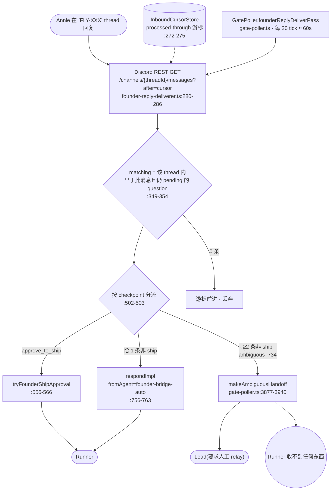
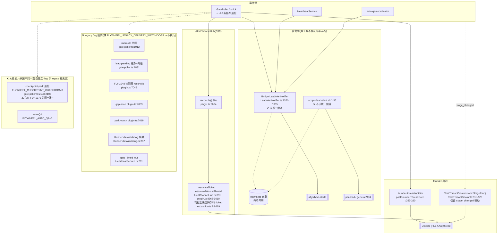

# FLY-1391 现状架构图 — end-to-end 技术级(真组件 / 真表 / 真队列)

Issue: FLY-1391 (https://linear.app/geoforge3d/issue/FLY-1391/audit消息全貌-message通知架构全图-谁发给谁哪些送-lead哪些送-runner哪些根本没送annie-直令不打地鼠先看全貌)
日期: 2026-07-20
基于: research.md

> **这张图不画抽象框。** 每个节点都是一个真实存在的组件、表或队列,带 `file:line` 锚点,可以直接跳过去核。
> 配套:目标态见 `architecture-target.md`,watchdog 最小清单见 `watchdog-minimum-set.md`。

## 0. 读图前必须知道的三件事

1. **两个数据库,不是一个。**
   - `comm.db`(每项目一个)—— `messages` 表(runner↔lead 问答)、`lead_inbox` 表(FLY-1373 投递账本)。
   - `~/.flywheel/teamlead.db`(StateStore,sql.js)—— `sessions`、`lead_events`、`codex_review_record`、`alert_threads` 等。
   查错库会读出空结果并误判「没有」。

2. **Flywheel 从不往 Claude Runner 的终端里推字。** 所有 wake 都是**写一个 JSON 文件**,由 runner 自己的 poller 读
   (`packages/agent-team-transport/src/types.ts:305-308` 的三种 wakeMode)。唯一真正推 pane 的是
   `packages/terminal-mcp/src/index.ts:415` 的 send-keys,Lead 手动驱动。
   ⇒ **「唤醒成功」= 文件写入返回 ok,不验证接收**(`packages/flywheel-comm/src/commands/send.ts:117-124`)。

3. **本图标注的开/关是 2026-07-20 活 Bridge 进程的真实 env**(方法与阳性对照见 `research.md §1.1`),
   不是代码默认值。重启后可能变。

---

## 1. 主干:Runner 出站 → Lead 收件箱

```mermaid
flowchart TB
  subgraph RUNNER["Runner 进程(tmux)"]
    CLI["flywheel-comm CLI"]
  end

  subgraph CDB[("comm.db(每项目)")]
    MSG[("messages 表<br/>type=question<br/>checkpoint / kind")]
    LIQ[("lead_inbox 表<br/>FLY-1373 投递账本<br/>priority 0..3")]
  end

  subgraph BRIDGE["Bridge 进程"]
    ADM["QuestionAdmission<br/>question-admission.ts:47-188"]
    LOOP["LeadInboxLoop<br/>lead-inbox-loop.ts:125-232<br/>活跃 1s / 空闲 30s"]
    ADP["投递适配器<br/>lead-delivery-adapter.ts:39-110"]
    ER["event-route.ts<br/>POST /events 入口"]
    LE[("StateStore lead_events<br/>teamlead.db")]
  end

  subgraph LEADP["Lead 进程"]
    MBOX[["mailbox 文件<br/>teams/&lt;lead&gt;/inboxes/&lt;lead&gt;.json<br/>path-helpers.ts:102"]]
    SOCK[["unix socket<br/>codex Lead"]]
    LEAD(["Lead 模型"])
  end

  CLI -->|"ask / gate<br/>insertQuestion<br/>ask.ts:38-48 · gate.ts:129-134"| MSG
  CLI -->|"complete / stage / notify<br/>POST /events"| ER
  MSG --> ADM
  ADM -->|admit| LIQ
  ADM -.->|"7 种 revoked_*<br/>:60-83 · :165-188"| DROP1((静默驳回))
  ER --> LE
  ER -->|"appendLeadEvent +<br/>dispatchLeadEvent<br/>event-route.ts:2625-2653"| LIQ
  ER -.->|"invalid route → HTTP 200<br/>event-route.ts:1071-1080"| DROP2((丢弃·带成功回执))
  LIQ --> LOOP
  LOOP --> ADP
  ADP -->|"Claude Lead<br/>writeMailboxBatch :39-72"| MBOX
  ADP -->|"Codex Lead :74-110"| SOCK
  MBOX -->|"stock useInboxPoller(非 Flywheel 代码)"| LEAD
  SOCK --> LEAD
```

### 1.1 关键锚点

| 组件 | file:line | 说明 |
|------|-----------|------|
| `ask` 落库 | `packages/flywheel-comm/src/commands/ask.ts:38-48` | `insertQuestion`,checkpoint=NULL,`--report` 时 kind='report' |
| `gate` 落库 | `packages/flywheel-comm/src/commands/gate.ts:129-134` | checkpoint 非空;`--no-block` 于 `:165-190` |
| checkpoint **不校验** | `packages/flywheel-comm/src/index.ts:1599-1602` | 自由字符串,非 enum |
| 准入 | `packages/teamlead/src/bridge/question-admission.ts:47-188` | eventType 判定 `:93-95`,入队 `:144-156` |
| **report 降优先级** | `question-admission.ts:150` | `kind==='report' ? 2 : 1` |
| 优先级函数 | `packages/teamlead/src/bridge/lead-event-queue.ts:17-43` | P0 founder / P1 gate·question·approval·review / P2 report·completed·artifact·action / P3 其余 |
| 消费循环 | `packages/teamlead/src/bridge/lead-inbox-loop.ts:125-232` | 排序 `ORDER BY priority, seq` |
| 投递适配器 | `packages/teamlead/src/bridge/lead-delivery-adapter.ts:39-110` | claude=mailbox 文件 / codex=unix socket |
| mailbox 路径 | `packages/agent-team-transport/src/path-helpers.ts:102` | `teams/<lead>/inboxes/<lead>.json` |
| 提交顺序 | `lead-inbox-loop.ts:286-299` | 适配器回执 → 审计镜像 → 消费销账 |

### 1.2 `lead_inbox` 的真实语义(**最容易被误读的一处**)

schema:`packages/flywheel-comm/src/lead-inbox-queue.ts:59-85`。表里**有** `delivered_at` 和 `consumed_at`
两列 —— 看起来像「已送达 / 已消费」两级。**它们不是两级。**

独立复核确认:`delivered_at` **只在** `markConsumed` 里、与 `consumed_at` 在**同一条 UPDATE**
中被设置(`:455-464`);全仓**没有任何代码路径**只设 `delivered_at` 而不设 `consumed_at`。

⇒ **`consumed_at` 的真实含义是「Bridge 处理完这一行了」,不是「Lead 消费了这条消息」。**

而 `delivered_at` 背后的那个 accept 回执,按后端各是什么:

| 后端 | 回执实际证明了什么 | file:line |
|------|------------------|-----------|
| Claude Lead | **往 mailbox JSON 追加了一次文件写** | `lead-delivery-adapter.ts:50-72` |
| Codex Lead | 接收进程**收下了字节**(比文件写强一档,仍非模型) | `:91-114` |

提交顺序的注释写得很明白(`lead-inbox-loop.ts:255-256`):
「adapter receipt → audit mirror → queue consume」——**这是传输层的回执,不是 Lead 的。**

⇒ **现状不存在任何「Lead 的模型真的动过」的证据。**(曾经存在过,见 §1.4。)

### 1.3 这一段的已知缺口

- **`revoked_orphan` 零日志**(`question-admission.ts:169-170` → `:91`):`from_agent` 无会话的 ask 无声消失。
- **重投不复检**(`lead-inbox-loop.ts:196`):`revalidateModel` 仅在 `attempts===0` 跑。
- **`runner_lead_pending_escalation` 落 P3**:名字里没有 gate/question,升级事件排在普通 completed 之后。
- **model 通道没有重试上限** —— protocol 通道有 `maxProtocolAttempts=3`(`lead-inbox-loop.ts:84-87`),
  model 通道只递增 `attempts`(`lead-inbox-queue.ts:663-679`)、**没有任何地方把它当上限读** ⇒ 永久失败的批次永远重试。
- **`recordDeliveryFailure` 不记退避时间戳**(`StateStore.ts:10027-10032`):`attempts` 是纯计数器,
  重试节奏完全由 tick 频率决定 —— **没有真正的指数退避**。
- **超上限的 `lead_events` 行静默停止,不进死信**:`getUndeliveredGuardrailEvents` 用
  `delivery_attempts < maxAttempts` 过滤(`StateStore.ts:10035-10063`),超限后只是**不再被选中**。
  ⚠️ 在日志里,「不再被选中」和「已经成功了」长得一模一样。

### 1.4 曾经存在、已被退役的「模型级回执」(目标态的重要输入)

FLY-1373 之前**确实有**一条能证明 Lead 模型读了消息的回执链:

| 环节 | file:line |
|------|-----------|
| CommDB `type='ack_receipt'` | `packages/flywheel-comm/src/db.ts:26`(FLY-1279 迁移 `:570-589`) |
| 写入 `insertAckReceipt` | `db.ts:1147-1168` |
| **作者是 Lead 的模型**,经 MCP 工具 `flywheel_inbox_ack_event` | `packages/inbox-mcp/src/index.ts:131-143` → `delivery.ts:113-140` |
| 授权 = per-event bearer token | `bridge/lead-event-delivery.ts`(`deriveLeadEventAckToken` / `tokenMatches`) |

**关键性质**:令牌来自消息体 ⇒ 一条 `acked_at` 非空的行,**证明模型确实读到了那条消息的内容** ——
这不是荣誉制度。

**退役方式**:`LegacyAckDrain`(`bridge/legacy-ack-drain.ts:1`)→ `retireOpenLeadEventAcks`
(`StateStore.ts:8377-8415`),此后所有 ACK 查询带 `AND ack_retired_at IS NULL`(11 处)。
替代物是传输层 accept 回执(§1.2),**不是模型层回执**。

⇒ **emit 路径没被删** —— MCP 工具与 `insertAckReceipt` 都还在,目标态可在其上重建
(见 `architecture-target.md §2.2`)。该工具是否仍对运行中的 Lead 广播:**unverified**。

---

## 2. founder 入站:Discord thread 回复怎么回到系统



**这张图就是 Annie 拍「回归主管唯一枢纽」的直接理由**:

- ship 门批准与「恰好一条匹配」**直达 Runner,完全绕过 Lead**(`:556-566`、`:756-763`)。
- **只有系统自己搞不定(歧义)时才走 Lead** —— 即 Lead 是**异常兜底**,不是枢纽。
- 与 `doc/architecture/product-experience-spec.md §2.4`(「Lead 是唯一沟通渠道」)冲突;规格未同步。

### 2.1 ambiguous 分支的精确语义(容易读错)

`founder-reply-deliverer.ts:731-751` + `gate-poller.ts:3877-3940`:

- **消息本身可靠送到 Lead** —— `appendLeadEvent` + `dispatchLeadEvent`,失败则**游标不前进**、下轮重试(FLY-605 加固 `:3890-3899`)。
- 放弃的是**「送给哪个 Runner」**。载荷原文(`:3901-3904`)就是「请人工 relay 给对应 runner」。
- **Annie 得不到任何信号**说她这句被搁置了(歧义分支不打回执反应)。
- 有界重试耗尽 → `recordFailure` 返回 `deadLettered:true`(`:415-426`)→ 游标**允许越过她的消息**。

---

## 3. founder 出站 + 告警巷 + 巡检(含开关真值)



### 3.1 开关真值(2026-07-20 活进程)

| Flag | 值 | 后果 |
|------|-----|------|
| `FLYWHEEL_LEGACY_DELIVERY_WATCHDOGS` | **缺失** | 上图 **OFF 区(legacy 圈内)**整块不执行 —— 判定 `legacy-delivery-watchdog-policy.ts:6-10`,boot 捕获 `plugin.ts:3715`。⚠️ **不含 checkpoint-park**(见 OFF2 与 `research.md §1.3`) |
| `FLYWHEEL_CHECKPOINT_WATCHDOG` | `0` | checkpoint-park 巡检关(`gate-poller.ts:2103-2105`) |
| `FLYWHEEL_AUTO_QA` | `0` | auto-QA 关 |
| `FLYWHEEL_ZOMBIE_GATE_RESOLVE` | `0` | 僵尸门清理关 |
| `FLYWHEEL_DETECTION_GAP_SCAN` | `1` | ⚠️ **惰性** —— tick 未接线(`plugin.ts:7039`) |
| `FLYWHEEL_STUCK_FOUNDER_PAGE` | `1` | ⚠️ **不可达** —— 没有东西喂它(`stuck-escalation.ts:480`) |
| `FLYWHEEL_FOUNDER_THREAD_NOTIFY` / `_MILESTONE_NOTIFY` | 未设 | 默认 **ON**(`!== "0"`,`gate-poller.ts:2385` / `:2691`) |
| `FLYWHEEL_UNIFIED_ALERT_CHANNEL_ID` | 已设 | Bridge 侧生效;**shell 侧不认** |

⚠️ **「flag 显示 1」≠「功能在跑」** —— 这是本图最容易被误读的地方,查 env 会得出错误结论。

---

## 4. 现状的结构性特征(供目标态对照)

| # | 现状特征 | 证据 | 目标态要改成什么 |
|---|---------|------|-----------------|
| C-1 | founder 回复**直达 Runner**,Lead 只兜歧义 | `:556-566`、`:756-763` | 一律先到 Lead |
| C-2 | 「送达」= **文件写入返回 ok**,不验证接收 | `send.ts:117-124` | 两级收据:已送达 / 已处理 |
| C-3 | **无「已处理」概念** —— 系统无法知道 Lead 的模型是否真的动过 | 见 `architecture-target.md §2` | 处理回执 |
| C-4 | 丢件靠**巡检捞回**,而巡检**关着** | `gate-poller.ts:1012` + `plugin.ts:3715` | 无收据 → 标记 + 重发(消息语义内建) |
| C-5 | 催办判据来自**持久行**,不读活状态 | `ticket-escalation.ts:88-119` | 结构性消失:有收据就不催 |
| C-6 | checkpoint 是**自由字符串**,typo 静默降级 | `index.ts:1599-1602` | enum + 校验 |
| C-7 | 无效 route → **HTTP 200 成功回执** | `event-route.ts:1071-1080` | 显式 nack |
| C-8 | 告警**两个写入者**,频道会分叉 | `lead-alert.sh:1-36` | 单一出口 |

---

## 5. 本图的边界

- 覆盖 D1–D7 七域主干,**不是全仓 sender 普查**。已知未覆盖:`disposition-receipt.ts`、
  `runner-ready-to-close-notifier.ts`、standup、roundtable 入站、digest(见 `exploration.md §3`)。
- 开关值是**时点快照**,重启后需重读。
- 未做真机 E2E;本图是静态调用路径 + 运行时 env 读取。
