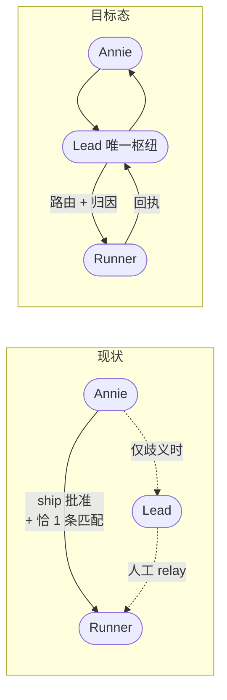
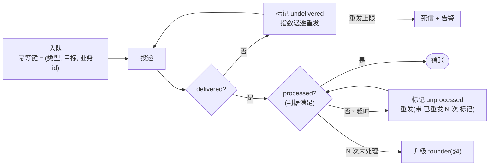

# FLY-1391 目标态架构 — 主管唯一枢纽 + 两级收据 + MQ 保送语义

Issue: FLY-1391 (https://linear.app/geoforge3d/issue/FLY-1391/audit消息全貌-message通知架构全图-谁发给谁哪些送-lead哪些送-runner哪些根本没送annie-直令不打地鼠先看全貌)
日期: 2026-07-20
基于: architecture-current.md · research.md

> **本文是设计,不是实施计划。** 它把 Annie 拍的模型画成可实现的形状,并明确指出哪些地方**会有人反对、为什么**。
> 配套:现状见 `architecture-current.md`,必须保留的 watchdog 见 `watchdog-minimum-set.md`。

## 0. Annie 拍的模型(逐字对照本文哪一节实现它)

| 她拍的 | 本文 |
|--------|------|
| 所有 founder 回复与关键通知**一律先到 Lead**(主管唯一枢纽)→ Lead 路由 | §1 |
| 每条重要投递带 **已送达 / 已处理** 收据 | §2 |
| 无收据 → **标记 + 重发** | §3 |
| **N 次未处理 → 升级 founder**(两级规则) | §4 |
| **MQ 式保送语义** | §5 |
| 目标 = watchdog 面**最小化** + **不轰炸** | §6(+ `watchdog-minimum-set.md`) |

---

## 1. 主管唯一枢纽

### 1.1 现状 vs 目标



**改的是路由,不是权限。** ship 批准的**授权语义不变** —— 仍然只有 founder 能授权,
仍然必须过 `verify-approval`,Lead 仍然**不能**代批(现有 `approval-intent` 403 拒绝保留)。
Lead 在这里的角色是**投递枢纽 + 归因裁决者**,不是审批者。

### 1.2 这条改动真正解决的问题

现状里 Lead 只在**系统搞不定时**才出现(歧义分支)。这有三个后果:

1. **归因失败没有兜底** —— 系统猜不出她答的是哪个门,就变成人工 relay,而她不知道。
2. **Lead 对 issue 上发生了什么掌握不全** —— 大部分 founder 交互它根本没看见。
3. **升级链断裂** —— Lead 不在链路上,就没法承担「N 次未处理 → 升级」里的那个 N。

目标态里,**归因是 Lead 的一次显式路由决策**,而不是 Bridge 的一次字符串匹配赌博。

### 1.3 必须诚实说的代价

| 代价 | 说明 | 缓解 |
|------|------|------|
| **多一跳延迟** | ship 批准从「Annie → Runner」变成「Annie → Lead → Runner」 | ⚠️ **影响未知 —— 没测过,本文不给量级判断**。设计上路由走协议层不进模型(§2.5),但那是理由不是数据(§7) |
| **Lead 成为新单点** | 它挂了,所有 founder 交互停摆 | ⚠️ **只有检测,没有缓解** —— 见下方警告 |
| **Lead 上下文压力** | 更多消息进 Lead | 协议层消息**不进模型上下文**(§2.4);只有需要判断的才进 |

⚠️ **Codex 复核纠正了我一处措辞,而且是要害**:初稿说单点由 W-1/W-2 两个 watchdog「兜」。
**watchdog 只能检测故障,不能缓解它** —— 探到 Lead 死了,founder→Runner 这条路**依然是断的**。

更糟的是一个已核实的现状事实:**投递循环的健康检查跑在 Bridge 自己的 heartbeat tick 里** ⇒
**Bridge 整体死亡时,它不会告警**(自指问题在现状实现里没有被解决)。

⇒ **真要接受「唯一枢纽」,必须同时给出三样,否则这个设计不完整:**
1. **独立 failure domain 的 supervisor**(不在 Bridge 进程内)+ 自动重启;
2. **备用路由**或 founder authority 的 **break-glass 路径** —— 枢纽挂了 Annie 仍能直达;
3. 明确「枢纽不可用期间」的降级语义(排队等待?还是回落直连?)。

**在这三样落地之前,「唯一枢纽」是一个已知会在 Lead 挂掉时断开 founder 通路的设计。**
这不是反对它 —— 是说这个代价必须由 Annie 明确接受,且缓解要一起做,不能只做路由改动。

⇒ **「唯一枢纽」在可靠性上是负债,不是资产。**换来的是**归因正确**和**升级链完整**。
这个取舍值不值,是 Annie 的决定;本文只把两边摆清楚。

---

## 2. 两级收据

### 2.1 定义

| 级别 | 含义 | 谁产生 | 失败意味着 |
|------|------|--------|-----------|
| **已送达 delivered** | 消息已**持久落到**接收方的收件箱 | 传输层(Bridge) | 传输坏了 |
| **已处理 processed** | 接收方**真的动了** | 见 §2.2 | 人/模型没接住 |

现状只有第一级,而且它的语义还偏弱 —— `send.ts:117-124` 明说「唤醒成功 = 文件写入返回 ok,不验证接收」。

### 2.2 关键设计:「已处理」的三档强度 —— 而且**第二档已经存在过,被 FLY-1373 退役了**

> ⚠️ 本节初稿写成了二分法(「自报 = 荣誉制度,不要;推导 = 好」)。查证后**这个二分是错的**,
> 因为它漏掉了中间那一档 —— 而中间那一档**代码里已经建过、现在还留着可用的原语**。

| 档 | 机制 | 它**真正**证明了什么 | 能不能当「已处理」 |
|----|------|------------------|-----------------|
| **① 副作用推导** | 系统观察到「你要的那件事发生了」 | **业务结果发生了** | ✅ **只有这一档可以** |
| **② 带令牌的 ACK** | 消息体里带 per-event token,回执必须带对令牌 | **持有者读到了这条消息** —— 仅此而已 | ❌ 只能当「**已读/已接收**」 |
| **③ 裸自报** | 调个命令说「我处理了」 | 什么都没证明 | ❌ 荣誉制度 |

> ⚠️ **第②档的强度经 Codex 复核下调了一级,这个更正很重要。**
> 初稿写它「伪造不了、不是荣誉制度」——**作为「已读」的证明,这话对;作为「已处理」的证明,这话错。**
> 令牌只证明**持有者拿到了令牌**;一个**有权限的 Lead 完全可以提前 ACK、或者 ACK 完什么也不干**。
> ⇒ **第②档在本设计里被重新定位为 read/accept receipt,不得充当 processed receipt。**
> 「已处理」**只能**来自与业务结果强绑定的 evidence(第①档)。

**第③档的下场已经有实证**:FLY-827 的 `codex_review_record` 有 `codex_thread_id` 列但**没人填** ——
对 head 漂移是硬的,对 Runner 是荣誉制度。**本设计不采用第③档。**

**第②档不是假设,是被退役的既有实现**(独立复核证据):
- 传输:CommDB `type='ack_receipt'`(`packages/flywheel-comm/src/db.ts:26`,FLY-1279 迁移 `:570-589`)
- 写入:`CommDB.insertAckReceipt(fromAgent, eventSeq, ackToken)`(`db.ts:1147-1168`)
- **作者是 Lead 的模型** —— 经 MCP 工具 `flywheel_inbox_ack_event`
  (`packages/inbox-mcp/src/index.ts:131-143` → `delivery.ts:113-140` → `:139`)
- 授权:per-event bearer token `deriveLeadEventAckToken` / `tokenMatches`
  (`packages/teamlead/src/bridge/lead-event-delivery.ts`),键为 `(eventSeq, ackOwnerLeadId, ownerEpoch)` + 轮换密钥
- **因为令牌来自消息体,一条 `acked_at` 非空的行,证明模型确实读到了那条消息的内容。**

**它是怎么没的**:`LegacyAckDrain`(`packages/teamlead/src/bridge/legacy-ack-drain.ts:1`,
FLY-1373 一次性退役)→ `retireOpenLeadEventAcks`(`StateStore.ts:8377-8415`),
此后所有 ACK 查询都带 `AND ack_retired_at IS NULL`(`:8422` 等 11 处)⇒ 状态机对旧行失效。
**替代物是传输层 accept 回执,不是模型层回执。**

⇒ **目标态怎么用它**:第②档**原语还在**(emit 路径没被删),想要「已读」这一级的话
**不必从零造,在它之上重建即可**。但它**只能填「已读」这一格,填不了「已处理」**。
(该工具是否仍对运行中的 Lead 广播 —— **unverified**,需核 Lead 的 MCP 配置;
所以「装回去就能用」也**不是**已验证的结论。)

**「已处理」的唯一来源是第①档**:每类消息定义它的「处理完成」等价于哪个可观察状态变化,由系统自己判定 ——
**且必须满足 §2.4 的三条原子性要求**。

| 消息类型 | 「已处理」判据(可观察) | 无需自报 |
|---------|----------------------|---------|
| gate question | comm.db 里出现该 questionId 的 response 行 | ✅ |
| founder 回复(路由) | 该回复被绑定到某个 questionId,或被显式标记为「无需路由」 | ✅ |
| runner 报告 / `ask --report` | Lead 产生了一条引用该 message id 的出站动作(回复 / relay / 建单) | ✅ |
| 卡住/失败通知 | 对应 session 状态转移 **且 actor 绑定到该 Lead**(§2.4 归属歧义) | ⚠️ 需绑 actor |
| 纯遥测(P3) | **不要求处理收据** —— 只要 delivered | — |

**没有可观察副作用的消息,不退回显式 ack —— 而是根本不要求「已处理」。**
它们是 FYI,delivered(或加一级「已读」)就够了。
⇒ **「找不到 evidence」的正确处理是把这类消息降级成不要求 processed,不是拿一个弱信号顶上。**

⇒ 由此得到一个很强的性质:**「未处理」= 「你要的那件事没发生」**。
这正是现状那一堆 watchdog 在巡逻的东西。**把它变成队列的属性,巡逻就不必存在**(§6)。

### 2.3 收据表的形状(建议)

在 `lead_inbox`(已存在,FLY-1373 建的投递账本,schema 见
`packages/flywheel-comm/src/lead-inbox-queue.ts:59-85`)上加语义,而不是新建一套。

⚠️ **先纠正一个现状事实,否则这张表会被误读**:`lead_inbox` **已经有** `delivered_at` 和 `consumed_at`
两列,看起来像两级 —— **但它们不是两级**。独立复核确认:`delivered_at` **只在** `markConsumed`
里与 `consumed_at` 同一条 UPDATE 中被设置(`lead-inbox-queue.ts:455-464`),
全仓**没有任何代码路径**只设 `delivered_at` 而不设 `consumed_at`。

⇒ **`consumed_at` 的真实语义是「Bridge 处理完这一行了」,不是「Lead 消费了」。**
现状的两列是**同一个事件的两个字段**,不是投递与处理的两级。

建议的加列:

```
lead_inbox
  ...(现有列:seq / id / to_lead / msg_class / priority / content
       / ref_message_id / batch_id / attempts / claimed_by / disposition
       / delivered_at / consumed_at ...)
  processed_at        TEXT   -- 新:判据满足的时刻(§2.2 第①档)
  processed_evidence  TEXT   -- 新:哪条 response / 哪个 event 证明的 + 产生它的 actor 与 epoch
                             --    ⚠️ ack_receipt 不算 —— 它只证明「已读」(§2.2 第②档)
  read_at             TEXT   -- 新(可选):第②档「已读」回执,与 processed 分开记
  escalated_at        TEXT   -- 新:升级到 founder 的时刻(§4),用于「只升级一次」
```

**`processed_evidence` 是这套设计能不能被信任的关键** —— 它让「已处理」**可复核**,
而不是又一个「参数名当事实」(见 `research.md` 方法论第 1 条)。
**没有 evidence 的 processed 应当被视为无效**,这条要写进实现的不变式。

### 2.4 ⚠️ 「已处理」判据的**原子性** —— Codex 复核抓出的最大漏洞

初稿写了「processed 从副作用推导」,**但没说副作用和 evidence 怎么原子地一起提交**。这是个真洞:

**崩溃窗口**:Bridge 做完副作用(回复 / relay / 建单)、**还没写 evidence 就崩** ⇒
重启后这条消息看起来「未处理」⇒ 重发 ⇒ **副作用做第二遍**。
反过来先写 evidence 再做副作用,则崩溃后变成「标着已处理、其实没做」——**永久误判**。

**归属歧义**:更隐蔽的一条 —— 「session 状态转移」这类 evidence
**可能由别的 actor 造成**(另一个 runner、founder 自己、巡检)。
拿它当「这个 Lead 处理了这条消息」的证据是**错的**。

⇒ **目标态必须写死三条,缺一不可:**

1. **evidence 必须绑 actor 与 fence** —— 记录是**谁**、在**哪个 owner epoch** 产生的,
   不能只记「状态变了」。现有 `lead_inbox` 已有 `claimed_by` / owner-epoch fencing 可以借。
2. **副作用必须幂等,或走 transactional outbox** —— 二选一,不能都不做:
   - 幂等:副作用带幂等键,重放安全 ⇒ 允许「先做后记」;
   - outbox:副作用与 evidence 在**同一事务**里落库,由独立投递器执行 ⇒ 允许「一起提交」。
3. **逐消息类型定义 evidence 是什么** —— §2.2 那张表列的是**方向**,不是合同。
   每一类必须写清:哪条记录、由谁写、怎么保证不是别人造成的。**没定义清楚的类型,不许要求 processed 收据。**

⇒ **在这三条落地之前,「processed」这个字段不该被当成可信信号。**
本文其余部分凡是依赖 processed 的推论(§3 重发、§4 升级、§6 watchdog 收缩),
**都以这三条为前提**。

### 2.5 协议层 vs 模型层(控制上下文成本)

FLY-1373 已经引入了 `msg_class`(protocol / model)的区分。目标态沿用并强化:

- **协议层**消息(路由指令、收据、状态同步)由**代码状态机**处理,**不进 Lead 的模型上下文**。
- **模型层**消息(需要判断的:歧义归因、要不要打扰 founder)才进模型。

⇒ 「主管唯一枢纽」不等于「所有东西都烧 Lead 的 token」。**大部分枢纽工作是协议层的。**

---

## 3. 无收据 → 标记 + 重发



**两条独立的重试轴,不要混**:

- **未送达**重发 = 传输问题,快重试(秒级),上限低,超限进死信 **并告警**(传输坏了是基础设施事件)。
- **未处理**重发 = 人/模型没接住,慢重试(分钟级),**重发时必须带「这是第 N 次」** ——
  否则 Lead 看到的是一条一模一样的新消息,无从判断。

⚠️ **重发必须幂等。** 幂等键建议 `(类型, 目标, 业务id)`,而不是消息内容哈希 ——
内容哈希会被时间戳/序号搅动,正是 FLY-218/220 刷屏的根因(内容变 → eventId 变 → 绕过去重)。
现状 `lead_inbox` 已有可用基础:`id` UNIQUE + `ref_message_id` 上的 UNIQUE 偏索引
(`lead-inbox-queue.ts:60, 81-82`),沿用即可。

### 3.1 现状重试层的三个真实缺口(目标态必须补,独立复核确认)

| 缺口 | 证据 | 目标态要求 |
|------|------|-----------|
| **model 通道没有重试上限** —— 永久失败的批次会**永远重试**下去 | `lead-inbox-loop.ts` model 通道只调 `recordFailure` 递增 `attempts`(`lead-inbox-queue.ts:663-679`),**没有任何地方把 attempts 当上限读**;protocol 通道有 `maxProtocolAttempts=3`(`lead-inbox-loop.ts:84-87`),model 通道没有 | 两条通道都必须有上限 + 死信 |
| **`recordDeliveryFailure` 不记退避时间戳** —— `attempts` 是纯计数器,重试节奏完全由 tick 频率决定,**没有真正的指数退避** | `StateStore.ts:10027-10032` | 退避必须持久化,不能靠轮询频率 |
| **超上限的 `lead_events` 行「静默停止」,不进死信** | `getUndeliveredGuardrailEvents` 用 `delivery_attempts < maxAttempts` 过滤(`StateStore.ts:10035-10063`);超限后行**只是不再被选中** | 超限 = 进死信 **且告警**,不是消失 |

⚠️ 第三条尤其要注意:**「不再被选中」在日志里看起来和「已经成功了」一模一样。**
这正是本单反复出现的那个病根 —— 拿「查不到」冒充「没问题」。

---

## 4. N 次未处理 → 升级 founder(Annie 的两级规则)

### 4.1 两级 = 她当天拍的「处理不了」二分

`exploration.md §5.1` 记的口径:

- **需 founder 决策的** → **零缓冲**,不进 N 次循环,直接到她。
- **Lead 能动手的** → **30 分钟止损窗**,窗内 Lead 自己解决;解决不了才升级。

⇒ **N 不是一个全局常数,是按消息类别定的。**

| 类别 | 缓冲 | 升级条件 |
|------|------|---------|
| 需 founder 决策(ship 批准、产品方向) | 0 | 立即呈现给 founder;Lead 只做**投递与归因**,不做拦截 |
| Lead 能动手(卡住的 runner、丢件、review 未收敛) | 30 min | 窗口内无 `processed_at` → 升级 |
| 纯遥测 | — | **永不升级**(delivered 即终态) |

### 4.2 升级本身必须是「一次」

现状 FLY-1048 的 detection-escalation 已经把这件事做对了(虽然生产上关着):
每个 episode **只升级一次**,升级前先 Lead-first、有 grace、有 fleet 聚合、有 CLEARING 静音。
**目标态不要重新发明它,应该复用它的状态机**,只把触发源从「巡检检测」换成「收据超时」。

⇒ 这是本设计里**唯一一处我建议直接复用现有实现**的地方(`detection-escalation.ts`)。

---

## 5. MQ 式保送语义(明确到可实现)

| 语义 | 取值 | 理由 |
|------|------|------|
| 投递保证 | **at-least-once** | exactly-once 在跨进程 + LLM 消费方下不可实现;FLY-1099 已明确记录 founder POST 是 at-least-once |
| 去重 | **消费端幂等**(幂等键,§3) | 与 at-least-once 配套 |
| 顺序 | **见下方 §5.1** —— 初稿写的「同一 (目标, 业务id) 内有序」**不是可实现的合同** | 全局有序会让一条卡住的消息阻塞所有人(FLY-1099:游标被钉 32+ 小时,head-of-line 阻塞整条 thread) |
| 优先级 | 保留 P0–P3,但**修掉现状的错配** | `runner_lead_pending_escalation` 现在落 P3(`lead-event-queue.ts:17-43`);优先级应由**消息类型显式声明**,不靠名字子串匹配 |
| 持久性 | 入队即持久,**销账必须在「已处理」确认之后** | ⚠️ **现状不是这样** —— FLY-1373 的提交顺序(`lead-inbox-loop.ts:286-299`)是「**传输层 accept 回执** → 审计镜像 → 销账」,销账跟的是**传输**不是**处理**(见 `architecture-current.md §1.2`)。**那个顺序的形状可以沿用,但触发销账的条件必须从 accept 改成 processed** |
| 死信 | 必须有,且**死信本身要告警** | 死信是「消息永久失败」,这是基础设施事件 |

### 5.1 顺序合同(初稿这一条被 Codex 复核判为不可实现,重写)

**初稿的问题**:写「同一 `(目标, 业务id)` 内有序」——
如果业务 id 对每条消息都是唯一的,这个分组里**永远只有一条消息**,合同**是空的**;
而且 **P0–P3 优先级会重排同一业务流**(一条 P0 会插到同流的 P2 前面),两者直接打架。

**可实现的合同必须写清三件事**:

| 要素 | 要求 |
|------|------|
| **stream key** | 明确定义「什么算同一条流」——建议 `(issue_id, 目标 lead)`,**不是** per-message id |
| **单调序号** | 流内单调递增 seq;消费方据此检测 gap |
| **优先级 vs FIFO 谁赢** | **必须明写**。建议:**流内 FIFO 优先,优先级只决定流与流之间的调度顺序** —— 否则一条 P0 插队会让同一 issue 的上下文乱序 |

⚠️ **优先级不能靠名字匹配。** 现状 `priorityForLeadEvent` 用 `includes("gate")` 之类的子串判定
(`lead-event-queue.ts:17-43`),于是一个叫 `runner_lead_pending_escalation` 的**升级**事件掉进 P3。
这是 `research.md` 方法论第 1 条(不认命名、认真实语义)在代码里的又一个实例。

---

## 6. 为什么这套设计能让 watchdog 面**结构性**缩小

不是「关掉几个」,是**它们巡逻的对象变成了队列的一等属性**:

| 现状 watchdog | 它在巡逻什么 | 目标态里被什么取代 |
|--------------|-------------|------------------|
| misroute 捞回(`gate-poller.ts:1012`) | 发到不存在收件人的消息 | **入队时拒绝未知收件人** —— 黑洞不再可能存在 |
| lead-pending 催办(`gate-poller.ts:1881`) | Lead 压着门不答 | `processed_at` 超时 → §3/§4,队列自己知道 |
| checkpoint-park 巡检 | founder 门没人管 | 同上 |
| 陈旧门驱逐 | 门过期了还挂着 | 已答 → 判据满足 → 自动销账 |
| AlertChannelHub T2 按年龄升级 | 工单躺太久 | 收据驱动的升级(§4),**不看年龄看状态** |
| delivery-ack / redeliver / dead-letter 巡检腿 | 投递有没有成 | 队列内建(§3) |

**「催已过的门」这个 bug 在目标态里不可能存在 —— 但这句有前提**:必须先满足 §2.4 的三条原子性要求。
理由是催办的触发条件变成「无处理收据」,而门被答了就等于收据满足;
**若 evidence 与副作用不是原子提交,「收据满足」本身就不可信,这个「不可能」也就不成立。**
⇒ 前提达成后,**这是结构性消失,不是调参数压住**。(现状那条的根因见
`plan.md` G-15:一个 fail-closed 的恢复检查喂给了一个 fail-open 的升级决策。)

**但 watchdog 不能归零** —— 理由和最小清单见 `watchdog-minimum-set.md`。
一句话预告:**死进程发不出消息,也发不出「我没处理」的信号;收据机制对死亡天然失明。**

---

## 7. 已知反对意见(先摆出来,别等评审才发现)

| 反对 | 我的回应 |
|------|---------|
| 「Lead 成唯一枢纽 = 单点故障」 | 属实,见 §1.3。这是**用可靠性换正确性**,需要 Annie 明确接受。⚠️ **W-1/W-2 只能检测,不能缓解** —— 必须另配独立 supervisor + break-glass 路径,见 §1.3 的三条 |
| 「LLM 给不出可靠的处理收据」 | **同意,所以本文不要它** —— §2.2「已处理」**只**来自副作用推导;带令牌 ACK 只能当「已读」,裸自报**完全不用**(**没有「最后退路」这回事**) |
| 「多一跳会让 ship 变慢」 | **不知道 —— 没测过。**设计上路由走协议层不进模型(§2.5),但这是预期不是数据。**实施时必须实测**,本文不给量级承诺 |
| 「这是不是在重写 FLY-1373?」 | 不是。§2.3 明确在 `lead_inbox` 上加列,§4.2 明确复用 `detection-escalation` 状态机。**新增的是语义,不是第二套基建** |
| 「现状 flag 一开不就好了?」 | 开回来只是恢复**巡逻**,巡逻的判据缺陷(G-15)和轰炸风险(FLY-193/218/220 治过的)一起回来。见 `plan.md` D-2 三个选项 |

---

## 8. 本文的边界

- **这是设计,不是实施计划。**没有拆任务、没有排期、没有估工。
- §2.3 的表结构是**建议形状**,不是最终 schema;实施时应由 owner 定稿。
- **多一跳对 ship 批准延迟的实际影响:未测量。**本文**不给任何量级判断**(既不说可忽略,也不说显著)。
  设计上协议层路由不进模型上下文,**这只是一个尚未验证的预期理由,不是结论** —— 实施时必须实测。
- 本文**不替 Annie 决定方向二**(她说要看实现级图再聊),只把实现级事实与取舍摆清楚。
