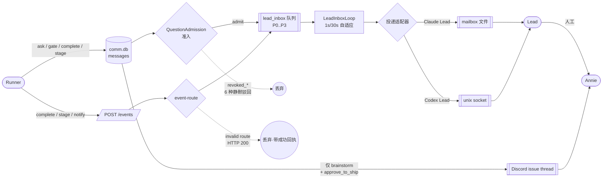
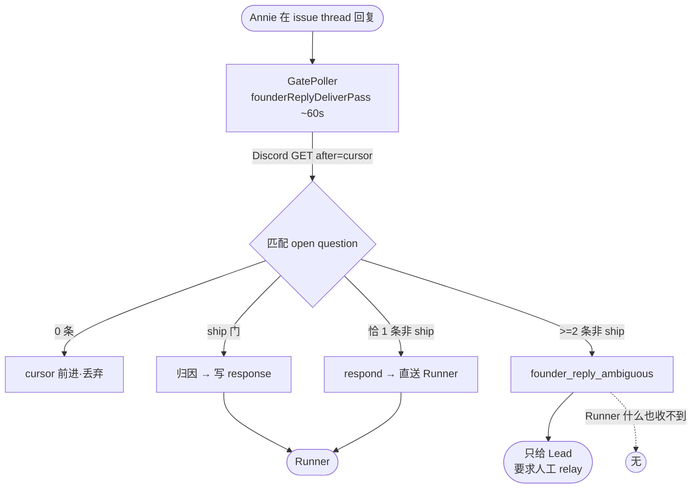

# FLY-1391 消息/通知架构全貌 — 调研(证据卷)

Issue: FLY-1391 (https://linear.app/geoforge3d/issue/FLY-1391/audit消息全貌-message通知架构全图-谁发给谁哪些送-lead哪些送-runner哪些根本没送annie-直令不打地鼠先看全貌)
日期: 2026-07-20
基于: exploration.md

> 本文是证据卷。裁定与整顿选项在 plan.md。凡本文标 `unverified` 的,plan.md 不得给出确定裁定。

## 0. 引用 provenance(核对前必读)

**本文所有 `file:line` 引用均指向 `main`**(工作树 `flywheel-FLY-1391`,基线 commit `9fa91cf6f`)。
与 FLY-1390 不同,本单**没有**指向未合并分支的引用 —— 审计对象是"生产上正在跑的",分支上的未合并改动
不在范围内。

两类引用需要区分,阅读时不要混:

| 类型 | 含义 | 核对方式 |
|------|------|---------|
| **代码事实** | 源码里写着什么 | `git show 9fa91cf6f:<path>` 或直接读工作树 |
| **运行事实** | 活 Bridge 进程当时的真实 env | `ps eww <bridge-pid>`,快照时间 2026-07-20 |

**运行事实会随重启改变。** 本文 §1 的 flag 快照是 2026-07-20 当日活进程的状态;
下一次 Bridge 重启若加了 env,结论即失效。plan.md 的裁定对此有显式标注。

---

## 1. 最重的发现:生产上一大片通知/巡检层是**关着的**

这一节回答 Annie 的第三问「哪些甚至没送」。它不是代码缺陷 —— 代码写得好好的 —— 它是**运行配置**问题,
所以此前每一张单读代码都读不出来。

### 1.1 证据:活 Bridge 进程的 env 快照

方法:`ps eww <pid>`(pid 53921,`node … scripts/run-bridge.ts`)。

**阳性对照先行**(证明尺子没坏):同一管道对该进程读出 `PATH=`/`HOME=` 共 2 项基线变量、
`FLYWHEEL_*` 共 **59** 项。尺子确认可用。

据此,以下断言才成立:

| Flag | 活进程值 | 后果 |
|------|---------|------|
| `FLYWHEEL_LEGACY_DELIVERY_WATCHDOGS` | **缺失** | `legacy_delivery_watchdogs` 圈内的巷全部关闭(圈内/圈外清单见 §1.3) |
| `FLYWHEEL_CHECKPOINT_WATCHDOG` | `0` | checkpoint-park 巡检关闭(第二个催办族 + 它的 founder 页) |
| `FLYWHEEL_AUTO_QA` | `0` | auto-QA(FLY-579)关闭 |
| `FLYWHEEL_ZOMBIE_GATE_RESOLVE` | `0` | FLY-1099 的僵尸门清理关闭 |
| `FLYWHEEL_WATCHDOG_JUDGE` | `0` | 看门狗判定层关闭 |
| `FLYWHEEL_WORKFLOW_FORCE_LEGACY` | `1` | 强制 legacy 派单 |
| `FLYWHEEL_AUTO_REPAIR` | `1` | 自动修复 bot **开着** |
| `FLYWHEEL_ALERT_TICKETS` / `_THREADS` / `_ROUTING` | `1` | 告警工单/线程/路由 **开着** |
| `FLYWHEEL_STUCK_FOUNDER_PAGE` | `1` | 卡住页 founder 通知 **开着** |
| `FLYWHEEL_DETECTION_GAP_SCAN` | `1` | 检测缺口扫描 **开着** |
| `FLYWHEEL_UNIFIED_ALERT_CHANNEL_ID` | 已设 | Bridge 侧统一告警频道生效(shell 侧不认,见 §6.2) |

### 1.2 `legacy_delivery_watchdogs` 的关停半径

flag 定义 —— `packages/config/src/feature-flags/registry.ts:105-118`:
`polarity: "opt_in"`,`default: false`。

判定函数 —— `packages/teamlead/src/bridge/legacy-delivery-watchdog-policy.ts:6-10`:

```ts
export function legacyDeliveryWatchdogsEnabled(env = process.env): boolean {
	return env.FLYWHEEL_LEGACY_DELIVERY_WATCHDOGS === "1";
}
```

Bridge 启动时读一次并向下传 —— `plugin.ts:3715` → GatePoller(`:7013`)、
LeadWatchdog / RunnerIdleWatchdog(`:9397`、`:9634`)。

**⇒ env 缺失 ⇒ 该布尔为 `false` ⇒ 以下路径在生产上不执行:**

| 关闭的路径 | 判据 file:line | 这条路径本来要干什么 |
|-----------|---------------|-------------------|
| misroute(黑洞收件箱)巡检 | `gate-poller.ts:1012` | 捞回 Runner 误发给 `"team-lead"` 的报告(见 §7) |
| lead-pending 催办 + 升级到 Annie | `gate-poller.ts:1881` | Lead 长时间不答 blocking question → 催 Lead → 三轮后页 Annie |
| lead-pending 清理 | `gate-poller.ts:3594` | — |
| GatePoller 其余 legacy 巷 | `gate-poller.ts:606`、`:1054`、`:1133` | — |
| RunnerIdleWatchdog 发射 | `RunnerIdleWatchdog.ts:257` | runner 闲置检测 → 告 Lead |
| LeadWatchdog 部分巷 | `LeadWatchdog.ts:519`、`:562` | — |
| HeartbeatService 部分巷 | `HeartbeatService.ts:596`、`:701` | — |

注:`gate-poller.ts:529-531` 的本地判定是 `this.config.legacyDeliveryWatchdogsEnabled !== false`
—— 即 GatePoller **自身**默认为开;真正关掉它的是 plugin.ts 显式传进来的 `false`。
读代码时只看 `:529` 会得到相反结论,必须跟到 `plugin.ts:3715` 才看得到真值。这是本条容易读反的地方。

### 1.2b 平衡事实:founder 面的**收信线是开着的**

不能只报坏消息。同一把尺子(`ps eww` 同一进程)核过:

| Flag | 判据 | 活进程 | 结论 |
|------|------|--------|------|
| `FLYWHEEL_FOUNDER_THREAD_NOTIFY` | `gate-poller.ts:2385` `!== "0"` | **未设** | 默认 **ON** —— gate 卡片正常投 thread |
| `FLYWHEEL_FOUNDER_MILESTONE_NOTIFY` | `gate-poller.ts:2691` `!== "0"` | **未设** | 默认 **ON** —— 里程碑正常投 |

(同一条 grep 命中了 `FLYWHEEL_FOUNDER_USER_ID=…` —— 阳性对照,证明 `^FLYWHEEL_FOUNDER` 这个模式
确实能在该进程里匹配到东西,所以另两个"未设"是真未设,不是模式写错。)

⇒ **精确结论:关掉的不是"给 Annie 发消息",是"没人发时去查为什么没发"里的**一部分**。**

用 exploration.md §5.2 的框架说:**收信线的主路径已接线且默认开启;查岗线被关掉了若干条子巷。**

⚠️ **措辞纪律(经 Codex 复核收紧两处,原文两处都过度断言)**:

1. **不能说"整条查岗线关着"。**仍在跑的查岗类组件至少包括:AlertHub reconcile(§11.1 证明它不但在跑,
   还是 F3 最可能的来源)、auto-QA reconcile、disposition receipts、issue-display 刷新、
   HeartbeatService 的 liveness/maintenance 腿。准确说法是
   **「`legacy_delivery_watchdogs` 圈内的若干查岗子巷关闭」**。
   —— 说"整条关着"会与本文 §11.1 自相矛盾,那正是本单方法论要防的。
2. **不能说收信线"是好的/健康"。**本单**没做端到端测试**;静态接线 + default-on 只能证明
   **「主路径已接线且默认开启」**,证明不了它端到端健康。本文自己列出的 G-5(黑洞)、
   G-6(checkpoint typo)、G-7(假成功)都是收信线上的真缺陷。

这解释了为什么问题难被发现:**日常一切看起来正常**,只有在某条主干消息掉了、或某个人压着不动时,
本该兜住的那层不在。

### 1.3 这意味着什么 —— **不是"没人知道",是"圈画在哪儿"**

> ⚠️ **本节经 Codex 设计复核更正过一次。**初稿写的是「FLY-1373 顺手关掉了查岗线,没人知道、未被记录」。
> **这个说法是错的**,而且错得不轻 —— 它把一个**明确的设计决策**说成了**无人察觉的副作用**。

事实是:FLY-1373 的 `plan.md §7` **逐条列了关停清单**,分「圈内(OFF)」与「圈外(保留,定案)」:

- **圈内(明确 OFF)**:LeadWatchdog 冻结巷;**gate-timeout 通知**;RunnerIdleWatchdog + StuckRunnerDetector;
  **FLY-1048 检测簇**;**misroute patrol**;**lead-pending escalation**;delivery-ack/redeliver/dead-letter;
  founder-reply-watchdog;HeartbeatService guardrail 5min 重投腿。
- **圈外(明确保留)**:LeadWatchdog blocked-keyword 巷;`onPollComplete` 的全部搭车任务
  (**含 AlertHub reconcile**);BridgeEventLoopWatchdog;crash-reaper/zombie/stale-close;
  account-switch;**checkpoint-park**;cmux pane-died hook。

⇒ **每一条我在 §1.2 列出的关停,都在 1373 的圈内清单里,是有意为之、白纸黑字。**

**所以真正的问题不是「有人偷偷关了东西」,而是:**

> **这个圈画在了正确的位置吗?**

这才是值得 Annie 拍的问题,而且证据指向一个具体的不对称:

| | 圈内(关) | 圈外(留) |
|---|---|---|
| **misroute 捞回**(捞回丢件) | ❌ 关 | |
| **lead-pending 升级**(人压着不答) | ❌ 关 | |
| **FLY-1048 检测簇**(统一升级流) | ❌ 关 | |
| **AlertHub reconcile** | | ✅ 留 |

**留下的那一条(AlertHub reconcile),恰恰是判据有缺陷的那一条**(§11.1:按持久行的经过时间升级,
不读活状态)—— 而关掉的那几条里,有专门负责捞回丢件和"人压着不答"的。

⇒ 净效果:**吵的那条留着,兜底的那几条关了。**这不是谁的疏忽,是圈的边界按
「新消费循环取代了什么」画的,**而不是按「谁在兜底、谁在吵」画的**。
按 exploration.md §5.2 的框架说 —— 圈是按**收信线**的替代关系画的,但它同时切过了**查岗线**。

另需注意:**checkpoint-park 在 1373 的圈外(保留)**,它在生产上关着是因为**另一个独立 flag**
`FLYWHEEL_CHECKPOINT_WATCHDOG=0`(§1.1),与 1373 无关。两件事不要混为一谈。

---

## 2. 全貌图

### 2.1 主干:一条消息的四种命运



**四种命运**:① 到 Lead(主干)② 到 founder thread(仅两种 checkpoint)③ 静默驳回 ④ 带成功回执丢弃。

### 2.2 反向:founder 回复怎么回到系统



**F1 的答案在这张图里**:ship 门和"恰好一条"都**直送 Runner,完全绕过 Lead**
(`founder-reply-deliverer.ts:756-763`)。只有**歧义**才走 Lead。
这不是 bug,是当前设计 —— 但它与 `product-experience-spec.md §2.4`
写的「Lead 是唯一沟通渠道、Annie 从不直接对 Runner 说话」**明确冲突**。规格与实现已经分叉。

---

## 3. D1 · Runner 出站(逐条四栏)

| 路径 | 落库/线 | 送 Lead? | 送 founder? | 唤醒谁 | 生产默认 |
|------|--------|---------|------------|-------|---------|
| `ask` | `messages` ckpt=NULL | ✅ mailbox | ❌ `gate-poller.ts:2439` | Lead | ✅ |
| `ask --report` | `messages` kind=`report` | ✅ 但 **priority 2** `question-admission.ts:150` | ❌ 且被排除出回复归因 `gate-poller.ts:3107` | Lead | ✅ |
| `gate brainstorm` | `messages` ckpt | ✅ | ✅ 10 分钟宽限后 | Lead + Runner | ✅ |
| `gate approve_to_ship` | `messages` ckpt | ✅ 除非 QA-hold | ✅ 15 秒 ship 卡 | Lead + Runner | ✅ |
| `gate question` | `messages` ckpt | ✅ | ⚠️ 仅经升级 —— **关着** `gate-poller.ts:1881` | Lead + Runner | 部分 |
| `gate <其它字符串>` | `messages` ckpt | ✅ | ❌ | Lead + Runner | ✅ |
| `complete --route *` | `POST session_completed` | ✅ 除非 QA-hold | ❌ 直接;仅里程碑巡检 | Lead | ✅(4 次重试) |
| `stage set *` | `POST stage_changed` | ✅ | ✅ **thread 标题** | Lead | ✅ |
| `progress` | **仅 git commit** | ❌ | ❌ | 无 | ✅(社交意义上 no-op) |
| `SendMessage to:"team-lead"` | 孤儿 JSON 文件 | ❌ | ❌ | 无 | 巡检**关着** |

### 3.1 `progress` 是写完就没人看的

`packages/flywheel-comm/src/commands/progress.ts:182-211`:原子写 `progress.md` + `git add` + `git commit`。
**不发 Bridge 事件、不写 comm.db、不写 mailbox。**

仓库内无任何 `packages/teamlead` 侧的读取者;`parseProgress` 在本文件内被 import 只是为了合并旧文件
(`progress.ts:36-40, 172-174`)。它自陈的用途是**给重启后的自己看**(`:5-7`)。

⇒ 对 Lead 和 founder 而言,`progress` 是**纯写入**。这不一定是缺陷(它本来就是断点续跑的账本),
但如果有人以为"runner 一直在报 progress = Lead 知道它在干嘛",那是错的。

重派后的 runner 是否真的被提示去读它:**unverified**(属 Blueprint/prompt 范畴,未核)。

### 3.2 `checkpoint` 是不校验的自由字符串

`packages/flywheel-comm/src/index.ts:1599-1602` 只要求非空。
`brainstorm` / `question` / `approve_to_ship` 是**下游字符串比较约定**,不是 enum。

而 founder 可见性硬过滤在 `gate-poller.ts:2439`:
`if (cp !== "brainstorm" && cp !== "approve_to_ship") return;`

⇒ **一个拼写错误(如 `aprove_to_ship`)会把一道 ship 门静默降级成"只有 Lead 看得见"**,
没有任何告警。严重度见 plan.md G-6。

### 3.3 `complete` 的无效 route:带成功回执的丢弃

`event-route.ts:1071-1080`:route 非法或缺失 → `console.warn` + `res.json({ok:true, warning:"invalid route skipped"})`
—— **HTTP 200,FSM 不动**。发送方的重试循环看到 2xx 就停。

⚠️ **归属更正(Codex 复核 HIGH-5,初稿把这条错安在 `flywheel-comm complete` 头上)**:
官方 CLI **到不了这个分支** —— `complete.ts:97-106` 在 POST **之前**就已拒绝缺失/非法 route
(`--route is required` / `Invalid --route: …` 双 `process.exit(1)`)。所以 `complete.ts:41-43, 252-283`
的 4 次重试**不可能**发出这种 payload。

⇒ **这条缺陷成立,但受害者不是官方 CLI**,而是:
① 其它/旧的 emitter(直接构造 `session_completed` 的代码路径);
② 任何直接打 `/events` 的调用方(含重放、reconciler、手工 curl)。

**保留为缺陷的理由**:它是一个**带 2xx 成功回执的静默丢弃**,对任何非-CLI 发送方都成立。

⚠️ **二次更正(Codex R2#5)**:我在一次更正里把 `complete-marker-reconciler` 举为实际受害者 ——
**这也是错的**。该 reconciler 在非法 route 时会在 POST **之前** quarantine 并返回
(`complete-marker-reconciler.ts:497`),同样到不了这个分支。
⇒ **目前没有已核实的实际受害者**;这是一条**防御性分支上的真实缺陷,但受害面未证**。
严重度按此评(plan.md 已由 S1 降为 S2)。这是本单第二次在同一条上过度断言 ——
第一次错在归给 CLI,第二次错在急着找一个替代受害者。

同样形状(且同样只对非-CLI 发送方成立):`no_code` / `pr_handoff` / `phase_design_complete`
从非 `running` 会话发出(`event-route.ts:1088-1103`)。

---

## 4. D2 · Lead→Runner 与唤醒

### 4.1 载荷层事实:Flywheel **从不**往 Claude Runner 的终端里推字

三种 wake 模式 —— `packages/agent-team-transport/src/types.ts:305-308`:

| wakeMode | 后端 | 谁真正注入 |
|----------|------|-----------|
| `builtin-receiver` | claude-code | claude-code 自己的 `useInboxPoller`(**非 Flywheel 代码**) |
| `external-watcher` | codex | `CodexMailboxWatcher` + tmux send-keys |
| (无) | antigravity / kimi | 没有人 |

⇒ 对 Claude runner,"唤醒成功"= **JSON 文件写入返回 ok**,不验证接收
(`packages/flywheel-comm/src/commands/send.ts:117-124`)。这是绝大多数看门狗存在的理由 —— 它们在补这个缝。

唯一真正推进 pane 的是 `terminal-mcp` 的 send-keys(`packages/terminal-mcp/src/index.ts:415`),
Lead 手动驱动,是文档化的兜底(`runner-wake.ts:11-13`)。

### 4.2 收不到消息的后端(transport = `none`)

`packages/teamlead/src/bridge/role-adapter-resolver.ts:49-56`:
`antigravity-tmux` → `"none"`,`kimi-tmux` → `"none"`。

三道独立守卫,各自诚实失败:`runner-wake.ts:120-140`(记 `runner_wake_no_transport`)、
`send.ts:92-101`(CommDB 留行,`delivered_at` 故意不设)、`auto-qa-effects.ts:637-645`。

⇒ 发给它们的消息**持久留档、永不投递**。设计上这些 runner 走 `pr_handoff` 终态,由 founder 手动 ship,
所以正常不可达。

⚠️ **三个字段编码同一个概念**:守卫 1 读 `adapter_type`,守卫 2 读 `vendor`,守卫 3 又读 `adapter_type`。
是否有写入期不变式保证 `vendor === EXECUTOR_TO_TRANSPORT[adapter_type]`:**unverified**。
若三者失配,唤醒可能路由错误。

### 4.3 PostToolUse hook 在默认配置下是 no-op

`scripts/hooks/inbox-check.sh:47-54` 的哨兵短路,依据
`~/.flywheel/runner-state/<execId>/mailbox-active`(由 `TmuxAdapter.ts:369-371` 写)。

legacy CommDB 轮询段(`:61-117`)只在 `FLYWHEEL_COMM_BACKEND=commdb` 或
`FLYWHEEL_DISABLE_MAILBOX_SENTINEL=1` 时才跑。

⇒ Blueprint 告诉 Runner「在任务边界跑 `flywheel-comm inbox` 当安全网」—— 而在默认 mailbox 模式下,
**hook 侧的那张网是关着的**;Runner 手动跑 `inbox` 命令是另一个独立面(`commands/inbox.ts:14`),仍有效。

### 4.4 无标记的 `--no-block` 门会永久搁浅 Runner

`gate.ts:165-176`:`--no-block` 注册后立即返回,**仅当 `FLYWHEEL_GATE_MARKER_DIR` 已设**才写门标记。
`respond` 的推送依赖该标记(`respond.ts:201, 242`)。

⇒ 门注册时该环境变量未设 ⇒ 轮询循环已退出 + 推送无标记可依 ⇒ **两条路都断,Runner 永远等下去**。
代码自陈了这个风险:`gate.ts:163`「a silently missing marker would strand the runner forever」。

---

## 5. D3 · Bridge→Lead 队列

### 5.1 优先级表

`packages/teamlead/src/bridge/lead-event-queue.ts:17-43`:

- **P0** —— 类型名含 `founder`,或恰为 `ship_approval_request` / `approve_to_ship`
- **P1** —— 含 `gate` / `question` / `approval` / `review`
- **P2** —— 含 `report` / `completed` / `artifact` / `action`
- **P3** —— 其余

⚠️ **`runner_lead_pending_escalation` 落 P3(最低)** —— 它的名字里既没有 `gate` 也没有 `question`。
一条"Lead 压着 blocking 门不答"的升级事件,排在普通 `completed` / `report` 的 P2 流量**后面**。
(该路径本身在生产上关着,见 §1.2 —— 但若日后打开,这个优先级是错的。)

### 5.2 六种静默驳回

`question-admission.ts:60-83`、`:165-186`。行被**带 disposition 消费掉,不投递**:
`revoked_missing` / `revoked_superseded` / `revoked_answered` / `revoked_orphan` /
`revoked_terminal_session` / `revoked_lead_scope` / `revoked_qa_hold`。

其中最安静的是 **`revoked_orphan`**(`question-admission.ts:169-170` → `admitQuestion` 于 `:91` 返回 false):
**一行日志都没有**。旧的 GatePoller 路径至少还 warn(`gate-poller.ts:864-869`)。

⇒ 一个 `from_agent` 在 StateStore 里查不到会话的 `ask`,消失得无声无息。

### 5.3 重投不复检

`lead-inbox-loop.ts:196`:`revalidateModel` 只在 `row.attempts === 0` 时跑。
⇒ 失败过一次的行,即使问题在此期间已被回答/撤销,重投时也照投不误。

---

## 6. D6 · 告警巷:两个互不相认的写入者

### 6.1 分工

| 写入者 | 位置 | 认统一频道? |
|--------|------|------------|
| Bridge `LeadAlertNotifier` | `packages/teamlead/src/LeadAlertNotifier.ts:1321-1335` | ✅ `FLYWHEEL_UNIFIED_ALERT_CHANNEL_ID` 优先 |
| shell `scripts/lead-alert.sh` | `scripts/lead-alert.sh:1-36` | ❌ |

两者共用同一张 `~/.flywheel/alerts/claims.db` 去重表,先写者赢。

### 6.2 已知且仍 open 的频道分叉

仓库自己的文档记着:`product/doc/FLY-915-infra-alerts-pipeline/exploration.md:17` —— shell 侧
「不认识统一频道,按 per-lead `alertChannel`→`generalChannel` 走(FLY-368 §9 明确留作 follow-up,**仍 open**)」。

⇒ 生产上 `FLYWHEEL_UNIFIED_ALERT_CHANNEL_ID` 已设(§1.1),所以 **Bridge 侧的告警进统一频道,
shell 侧的告警进别处**。shell 独有的告警种类(Bridge 从不发)因此结构性地不在统一频道里:
`tui_window_lost`、`restart_guard_bypass`、`bridge_wrapper_fail`、`bin_integrity_drift`、
`deploy_failed`/`deploy_degraded`、`quota_guard_bypassed`
(`LeadAlertNotifier.ts:135, 142, 157, 166, 225-226, 243`)。

这批恰恰是**"Bridge 死了才发得出来"**的那类 —— 最需要被看见的,反而不在她盯的频道。

---

## 7. 黑洞收件箱:`SendMessage to:"team-lead"`

这是本文单条严重度最高的发现,且是**已记录的生产事故**。

**机制**:`"team-lead"` 不是真实 agent id(真实 Lead 叫 `flywheel-eng-lead` 等)。
stock Claude Code `SendMessage` **不校验收件人**:自动创建
`<CLAUDE_CONFIG_DIR>/teams/<safeLead>/inboxes/team-lead.json` 并向发送方返回成功。
文档见 `packages/edge-worker/src/Blueprint.ts:1672-1680` 与 `hook-payload.ts:318-325`。

**已记录爆炸半径**:product-lead 的黑洞文件里积压 **184 条**报告
(`Blueprint.ts:1678-1679`,事故 `LEARN-12`,exec `433d4078`)。

**真 Lead 收件箱是 `inboxes/<safeLead>.json`**(`lead-inbox-runtime.ts:292-293`;
`path-helpers.ts:102`)—— 与黑洞**只差一个文件名**。

### 7.1 两道缓解,一道是嘴、一道关着

**缓解 1 —— prompt 级禁令**(`Blueprint.ts:1701-1703`):
「NEVER use the SendMessage tool to report to your Lead… `team-lead` is a black-hole inbox nobody reads」。
**这是提示词,不是强制。**

**缓解 2 —— misroute 巡检,生产上关着**:
`gate-poller.ts:1012` 的第一个条件就是 `this.legacyWatchdogsEnabled()`,而该值为 `false`(§1.2)。
即便打开,还需要 `config.transport` 与 `config.misrouteArchiveDir`,而 `plugin.ts:7077-7079` 在同一 flag 关闭时
把这两个都设为 `undefined`。

⇒ **默认配置下,Runner 调 `SendMessage(to:"team-lead")` 会收到成功响应,而消息谁也到不了 ——
不是 Lead、不是 founder、连归档都没有。没有任何东西检测它、计数它、暴露它。
唯一在生效的防线是那条提示词。**

---

## 8. 零人类触达的终态失败

`gate-poller.ts:3844-3866` —— `stale_approved_ship_dead`(FLY-799 stale-ship reconciler)。

**先说公平的部分**:这条不是一上来就放弃。同一个 reconciler 有 `reWake` 分支(`:3825-3843`),
会先尝试 `sendRunnerWake(..., "approval_wake")` 把搁浅的 runner 叫醒;`alertDead` 只在存活探测
(`isTmuxSessionAlive`,`:3818-3823`)判定进程已死之后才走到。所以这是**兜底分支**,不是主路径。

**但兜底分支本身是全哑的**:founder **已经批准了 ship**,runner **已死**、搁浅在批准之后 ——
唯一面向人的痕迹是 `:3845-3847` 一句 `console.warn`(文本里显式把处置推给 FLY-795 durable resume);
`insertEvent` 外面裹着裸 `catch {}`,注释写「durable dead-alert event is best-effort」。

**独立复核(本文作者亲跑)**:全仓 grep `stale_approved_ship_dead`(含 `.ts`/`.sh`/`.mjs`,排除
node_modules)—— **恰好 1 处命中,就是这个写入点**。无任何读取者。

⇒ **精确表述(经 Codex 复核收紧)**:**不是"零事件/完全静默"** —— 它确实写了一行 `console.warn`,
也确实尝试写 `session_events` 审计行。准确的指控是:

> **没有任何面向人的投递** —— 无告警、无 Lead 事件、无 thread 投递;
> 留下的两样(服务器日志 + 无人消费的审计事件)**都不会到达任何人**。

这个区别重要,因为它决定了修法:不是"加一条记录"(记录已经有了),而是**"把已有的记录接到一条人能看见的巷子上"**。

这是本次审计里唯一一条**终态失败且零人类触达**的路径:
founder 付出了决策,系统吞掉了结果,而且连"我吞掉了"都没对人说过。

严重度判断的关键不是"它多常发生"(应当罕见),而是"**它发生时,损失的是 founder 已经给出的那次批准**"
—— 而 Annie 的注意力正是这套系统里最贵的资源。

---

## 9. 其它无人消费的事件

以下 `event_type` 经 grep 全仓(排除测试)确认**只有写入点、没有读取者**:

| 事件 | 写入点 | 说明 |
|------|--------|------|
| `stale_approved_ship_dead` | `gate-poller.ts:3849-3866` | 见 §8,严重度最高 |
| `founder_reply_read_failed` | `founder-reply-deliverer.ts:288-296, 306-315` | Discord GET 失败;**部分缓解** —— 其 outcome 喂给 founder-reply-watchdog 的失败计数 |
| `founder_ship_reply_wake_skipped` | `:643-646` | cursor 会 pin 重试,但重试耗尽前无人知 |
| `founder_ship_reply_wake_failed` | `:660-663` | 同上 |
| `founder_reply_deliver_failed` | `:776-779` | `respond()` 抛非 UNIQUE 异常 |
| `founder_reply_delivered` | `:765-768` | 成功审计;**无消费者 = 没有投递率信号** |
| `founder_ack_failed` | `:720-723` | ✅/🕒/❓ 回执 PUT 失败,**明确不重试**(`:678-680`);founder 看不到回执且无人被告知 |
| `founder_thread_notify_skipped` | `founder-thread-notifier.ts:159,165,171,177` | **部分缓解** —— `gate-poller.ts:2551-2596` 读**返回值**升级,不读事件行 |
| `founder_thread_notify_failed` | `:203,212,219,227` | 同上 |
| `checkpoint_park_nudged` / `_paged` | `gate-poller.ts:2240-2248, 2286-2297` | 纯自用去重标记,无外部消费者 |

---

## 10. 三个 fixture 的代码级答案

### F1 · founder 回复直送 runner,不经 Lead

**属实,且是当前设计。** `founder-reply-deliverer.ts:502-503` 按 checkpoint 分流:
ship 门走 `tryFounderShipApproval`(`:556-566`);恰一条非 ship 走
`respondImpl({... fromAgent: "founder-bridge-auto" ...})`(`:756-763`)—— **均直达 Runner,不经 Lead**。

与 `doc/architecture/product-experience-spec.md §2.4`(「Lead 是唯一沟通渠道」)冲突。
**这不是实现偏离了规格未被发现,而是规格已经过时未被更新** —— 哪个是 Annie 现在要的,属产品决策,
本文不裁定(见 plan.md D-1)。

### F2 · `founder_reply_ambiguous` 放弃投递靠人工转

**部分属实,措辞需要修正 —— 这是本单最容易被读错的一条。**

触发:`founder-reply-deliverer.ts:734` `const ambiguous = matching.length >= 2;`
—— 该 thread 里有 ≥2 个**在她发言之前创建且仍 pending** 的问题,其中至少一个是非 ship 门。

**被放弃的不是"投递",是"路由"。** 精确说:

- 消息**确实durably 送到了 Lead** —— `makeAmbiguousHandoff`(`gate-poller.ts:3877-3940`)经
  `appendLeadEvent` + `dispatchLeadEvent`,投递失败则 cursor 不前进、下轮重试
  (FLY-605 加固,`:3890-3899`)。这条链是**可靠**的。
- 被放弃的是**送给哪个 Runner**。载荷文本(`:3901-3904`)原文就是
  「Bridge 无法确定她答的是哪个 —— 请人工 relay 给对应 runner」。
- **Runner 什么也收不到**(`respondImpl` 只在 else 分支被调,`:752-768`)。
- **Annie 得不到任何信号说她的话被搁置了** —— 歧义分支不打回执反应,除非同一批里还有 ship 门。

⇒ 严重度不在"丢件",在"**静默转人工**":系统把一个自己解决不了的路由问题,不声不响地变成了 Lead 的手工活,
而提出问题的人(Annie)不知道。

**另有一个真丢件口**:有界重试耗尽后 `recordFailure` 返回 `deadLettered: true`
(`:415-426`),cursor **允许越过她的消息**。此时会发 `founder_reply_dead_letter` 告警(所以是响的),
但原文只留 200 字符摘要(`:421`)。

### F3 · 催办 nudge 不查门态,催已经过的门

**代码级结论与现象不符,需要谨慎处理 —— 见下。**

已核的两个催办族:

1. **lead-pending 催办**(FLY-637-ext)。门态检查是**结构性**的:循环遍历
   `getPendingQuestions(dbPath, lead.agentId)`(`gate-poller.ts:844-850`),已回答的门不在 pending 集里,
   `maybeEmitLeadPendingNudge` 根本到不了。函数内部**没有**再读一次;新鲜度完全来自每 tick 的快照。
   ⇒ tick 中途被回答的门**可以**产生一次陈旧催办,但仅一次,窗口是单个 tick。
   **而且这一族在生产上整个关着**(§1.2)。
2. **checkpoint-park 巡检**。`FLYWHEEL_CHECKPOINT_WATCHDOG === "1"` 才跑(`gate-poller.ts:2103-2105`),
   生产值为 `0` —— **也关着**。

⇒ **两个已知催办族在生产上都不运行**,因此 Annie 观察到的催办**不可能**来自它们。

**归属已在 §11.1 收敛到最可能的一个:`AlertChannelHub` 的 T2 工单升级**(代码缺陷已坐实,归因仍是排除法) ——
它按持久工单行的经过时间(5 分钟)升级,**完全不读活的门态/会话态**
(`ticket-escalation.ts:88-119`、`AlertChannelHub.ts:821, 835, 891`)。

本文一度拒绝把 F3 安到 lead-pending 或 checkpoint-park 头上 —— 那两条已被证明没在跑,
按名字对号入座正是本单方法论第 1 条禁止的做法。**这个克制是对的**:最可能的来源在一个名字里
既没有 nudge 也没有 escalation-to-lead 字样的组件(`AlertChannelHub`)里。

---

## 11. 三条追加核实(F3 归属 / F4 归档弹回 / workflow_node_id)

### 11.1 F3 最可能的来源:**AlertChannelHub 的 T2 工单升级**(代码缺陷 CONFIRMED · 归因 PLAUSIBLE)

先补一个比原判更重的结构性事实:`legacyDeliveryWatchdogsOn` 的关停半径**比 §1.2 列的还大**。
它在 `plugin.ts:3715` 算出后,还被用作以下 GatePoller stage 的硬开关:

| 关掉的 tick | 判据 | 后果 |
|------------|------|------|
| `onParkWatchTick` | `plugin.ts:7019` | park-watch 死 |
| `onGapScanTick` | `plugin.ts:7039` | detection-gap-scan 死 |
| `onDetectionReconcileTick` | `plugin.ts:7049` | FLY-1048 升级流 reconcile 死 |
| `onDeliveryReconcileTick` | `plugin.ts:7016` | 投递对账死 |

⇒ **`FLYWHEEL_DETECTION_GAP_SCAN=1` 是惰性的**:该 flag 已被退役为 tick 内部固化默认开
(`plugin.ts:6707`),但**这个 tick 根本没接进 poller**。FLY-1048 的 detection-escalation reconcile
(`plugin.ts:6908`)同理。

连带死掉的还有卡住检测:`RunnerIdleWatchdog.ts:202`(`stuckDetector.checkSession`)与 `:257`(闲置发射)
都在同一个 flag 下;另一条驱动 `plugin.ts:6637` 只能从已死的 `gapScanTick` 到达。
⇒ **`stuck-escalation.ts` + `FLYWHEEL_STUCK_FOUNDER_PAGE=1` 不可达** —— flag 开着(`stuck-escalation.ts:480`),
但没有东西喂它。`HeartbeatService` 的 `gate_timed_out` 发射器(`:735`,事件 `:802`)在
`HeartbeatService.ts:701` 同一 flag 下 —— **也死了**。

**⚠️ 这是本单第二重的发现,而且比第一重更隐蔽:多个 flag 显示为 `1`(开),但它们控制的组件
根本没被接线。「flag 开着」不等于「功能在跑」。** 任何人查 env 看到 `DETECTION_GAP_SCAN=1` /
`STUCK_FOUNDER_PAGE=1` 都会得出错误结论 —— 这正是本单方法论第 1 条(不认命名、要找谁调它)的又一次应验。

**然后是 F3 最可能的来源。** 逐条核过在跑的候选,大多数其实**不会**催已过的门:

| 组件 | 活着? | 发之前复检当前状态? |
|------|-------|-------------------|
| `runner-recovery-nudge.ts` | ✅ | **是,而且是范本。**5 道闸全在调用时重读:状态 `:178`、decision_route `:186`、**pending gate 探测 `:195`(有门开着就拒发,fail-closed `:202`)**、活捕获指纹 `:223`、闲置输入框 `:230`。**它拒绝催已过的门。** |
| `AutoRepairBot`(`AUTO_REPAIR=1`) | ✅ | 完全委托上面那条;无指纹时拒绝盲发(`AutoRepairBot.ts:281`)。安全。 |
| auto-qa codex-hold 催办 | 条件开 | **是。**重读 session,要求 `status === "awaiting_review"`(`auto-qa-coordinator.ts:889`)+ `pr_head_sha` 匹配(`:890`)+ 重算 `isCodexGateSatisfied`(`:894`)。安全。 |
| gap-scan / detection-escalation / park-watch / stuck-escalation / `gate_timed_out` | ❌ 死 | n/a |
| **`AlertChannelHub` T2 工单升级** | ✅ | **否 —— 这就是答案。** |

**候选链路**:`LeadWatchdog.onPollComplete` → `alertHub.reconcile()`(`plugin.ts:9684`,30 秒节奏,
**不在** legacy flag 下)→ `reconcileTicket`(`AlertChannelHub.ts:835`)→ `escalateTicket`(`:891`)
→ `escalateToIssueThread`(`plugin.ts:8966-9010`,向 issue thread 发 @founder 页)。

**判据完全来自持久行,没有任何活状态读取** —— `ticket-escalation.ts:88-119` 的 `decideTicketEscalation`
只读 `ticket_status` / `attempt_count` / `first_seen_at`,在 `:103` 与 `:117` **仅凭年龄(5 分钟)**升级。

两个具体的洞:

1. **多数 kind 完全不做恢复检查。** `AlertChannelHub.ts:821` 对任何非 runner kind(`:770`)、
   非 fleet kind(`:787`)、非 Lead kind(`:798`)的行直接调 `reconcileTicket` —— 零新鲜度探测,纯掐表升级。
2. **恢复判定 fail-closed,升级判定 fail-open —— 方向相反。** `shouldResolveRunner`
   (`AlertChannelHub.ts:955-966`)遇到任何不确定返回 `false`(`:964` 原文
   `if (out == null) return false; // cannot tell → leave active`);而紧接着 `:782` 的
   `reconcileTicket` **照样按 5 分钟超时升级**。⇒ 一个**已经答完门、已经往下走了**的 runner,
   只要它的 pane 抓不到,**就会被升级**。

`plugin.ts:8969` 确实重读了 session —— **但只用于解析路由**(项目名、标签、thread),
从不复检 runner 是否仍卡、门是否仍开。`plugin.ts:8990-8995` 那句"已卡住 N 分钟"是拿
**陈旧的 `row.first_seen_at`** 算的,不是活证据。

⇒ **F3 最可能来源:`AlertChannelHub.reconcileTicket` → `escalateTicket` → `escalateToIssueThread`。**
它按持久行的经过时间催办,不读活门态。

⚠️ **裁定强度更正(Codex 复核 HIGH-4:初稿标 `CONFIRMED` 违反了本单自己的 unverified 规则)。**
准确的裁定分两层:

| 层 | 强度 | 依据 |
|----|------|------|
| **代码级**:该 Hub 一旦启用,就存在"按陈旧行升级、不读活状态"的缺陷 | **CONFIRMED** | `ticket-escalation.ts:88-119`;`AlertChannelHub.ts:821, 955-966`;`plugin.ts:8969, 8990-8995` |
| **归因级**:它**就是** Annie 那次催办的来源 | **PLAUSIBLE,未坐实** | Hub 存在的前置 `unifiedAlert && repairChainResolves`(`plugin.ts:8884`)中,`repairChainResolves` 属配置而非 env,**未核** |

**为什么仍列为最可能**:已核的其它在跑候选(`runner-recovery-nudge` / AutoRepairBot / auto-qa codex-hold)
**都做了活状态复检**,结构上发不出"催已过的门";而已证明没在跑的那批 —— lead-pending 与
detection 簇(legacy 圈内)、checkpoint-park(**圈外,由它自己的 `FLYWHEEL_CHECKPOINT_WATCHDOG=0` 关掉**,
见 §1.3)—— 都不可能是来源。⇒ 排除法只剩它。

**但排除法不是证据。**坐实需要一步本单没做的事:**核 `repairChainResolves` 的生产配置,
或把 Annie 那次催办的时间戳与 `alert_threads` 的 escalate 记录对上**。
⇒ plan.md 的 G-15 因此按**代码级缺陷**给"必修",**不**以"它就是那次催办"为裁定依据。

### 11.2 F4 归档 thread 被弹回(不区分人/bot = CONFIRMED · 「bot POST 触发解档」= unverified)

**在已核的投递路径中,没有一条检查 thread 的归档状态。**

⚠️ **两处措辞收紧(Codex 复核 MED-7)**:
1. 初稿写"没有**任何**投递路径检查" —— 但我核的是**三个 sender**,不是完整清单。
   **未核的 sender 至少还有**:`disposition-receipt.ts` 的 founder-thread 回执、
   `runner-ready-to-close-notifier.ts`、Standup 投递、digest 出站。⇒ 准确说法是
   **「已核的 sender 全部不检查;完整 sender 清单未做」**。方向大概率不变(无一处有检查),
   但"全部"这个词得等清单做完才配用。
2. **"bot 发言会让 Discord 自动解档"这一步,本单没有实证。**它来自
   `chat-thread-utils.ts:112-113` 的注释,而那句注释说的是 **"a user sends a message"**。
   Discord 对 **bot** POST 是否同样自动解档 —— **unverified**(需真机 E2E,本单未做)。
   Annie 观察到了解档现象,但"是 bot 那条消息导致的"是推断,不是实测。

逐条核过(以下为**已核部分**):

- `founder-thread-notifier.ts` `postFounderThreadCore`(`:253-292`)直接 POST
  `/channels/{threadId}/messages` —— **零归档检查**;四个调用方(`:185`、`:512`、`:666`、`:746`)
  只检查 `thread_id` 存在。
- `AlertChannelHub.ts:102-131` `postToThread` —— 同样无检查;被 T2 升级(`:903`、`:922`)与重试(`:873`)使用。
- `ChatThreadCreator.ts:387`、`:986`、`:1018`、`:1334` —— 消息 POST,无检查。

**归档状态确实有被检查 —— 但只在"归档"和"改名"路径,从不在"发言"路径**:
`StateStore.ts:6918-6933` `isChatThreadArchived` 用于 `done-thread-archiver.ts:107` 与
`done-thread-reconcile.ts:596`(归档一次);`ChatThreadCreator.ts:80-85` 的 `isArchivedThreadError`
(Discord code 50083)**只管改名**。

**而且这个行为在代码里被写成"有意为之"** —— `chat-thread-utils.ts:112-113` 原文:
> "If a user later sends a message in the archived thread, Discord will auto-unarchive it — by design (Annie is actively using it again)."

`StateStore.ts:6817-6818` 同调:「if Annie re-opens it … we do not fight her」。

**缝就在这里**:这套理由的前提是"**人**重新打开了它"。而归档-一次的设计随后就拒绝再归档。

⇒ **代码级缺陷(CONFIRMED,且不依赖未证前提)**:Flywheel **不区分**"人重开"与"bot 发言导致的重开"。
`chat-thread-utils.ts:112-113` 的"不跟她抢"逻辑对两者一视同仁,而归档-一次逻辑
(`done-thread-archiver.ts:107`)会把解档后的 thread 当成"已归档过"→ **不再归档**。

⇒ **完整链条(PLAUSIBLE,末端未实证)**:bot(T2 升级 / founder 页 / 里程碑)往归档 thread 发言
→ *[Discord 是否对 bot POST 自动解档 —— unverified]* → thread 回到活跃 → 永不再归档。
**中间那一步是这条链上唯一没被证明的环节**,但它一旦成立,前后两端都已被代码证实。

⇒ 与 §11.1 直接联动:**T2 升级正是最可能往已归档 thread 里发言的那个 bot** ——
它催的恰恰是"很久没动静"的老工单,而老工单的 thread 正是最可能已归档的。
F3 与 F4 不是两个独立的 bug,是**同一条链的两端**。

### 11.3 `workflow_node_id` 不是 legacy 也有值 —— **原判据被生产数据推翻,但担心的现象是真的**

Lead 的原始提醒是:`sessions.workflow_node_id` 对 legacy 阶段也存值,画图时别拿它当 DAG 判别。
**这条按代码和生产数据都不成立;但它指向的记账混淆是真的,只是在另一个字段上。**

**代码侧**:所有写入都汇入 `resolveWorkflowNodeIdForExecution`(`StateStore.ts:15559`),
第一分支即决定性 —— 无 `workflow_execution_binding` 则返回 `undefined`(`:15564-15571`),
文档注释明写「Legacy/unbound executions intentionally resolve to undefined」(`:15556-15557`)。
binding 行只在两处 DAG 准入事务里插入(`:14581`、`:14864`),且表不可变(no-UPDATE/no-DELETE 触发器
`:12377`、`:12382`)。列本身 set-once(`:3033-3039`、`:3269-3275` 抛错;三处 UPSERT 用
`CASE WHEN … IS NULL` 保护)。`phase-orchestrator.ts` 及任何三段式派发路径**无写入点**。

**生产数据侧(本文作者亲跑,只读副本 `~/.flywheel/teamlead.db`)**:

```
sessions 总数                                  1567
workflow_node_id 非空                            20
其中同时有 workflow_execution_binding 行         20   ← 20/20
阳性对照:workflow_execution_binding 总行数       26   ← 表非空,join 有机会失败但没失败
```

⇒ **`workflow_node_id != NULL` ⟺ 有 DAG binding。它是**可靠**的 DAG 判别器。**

**但同一次查询解释了误判从哪来** —— 那 20 行的 `session_role` 分布:

```
design 9 | implement 8 | qa 3
```

**全是三段式的阶段角色名。** 这与 FLY-1390 已核的事实一致:
DAG dispatcher 仍用 `isThreeStagePhaseRole(node.type)` 决定 `sessionRole`
(`workflow-engine-dispatcher.ts:449,457`)—— **DAG 复用了 phase 角色名**。

⇒ **修正后的告诫(方向对,字段错)**:不能当 DAG 判别器的是 **`session_role`**,不是 `workflow_node_id`。
看到 `session_role=design` 无法判断这是 legacy 三段式还是 DAG 节点;要判 DAG,
**就该看 `workflow_node_id` / `workflow_execution_binding`**。

本条已作为更正回报 Lead(FLY-1356 QA 的观察对象很可能正是这批 role 名)。

---

## 12. 规格 vs 实现的分叉汇总

`doc/architecture/product-experience-spec.md` 是产品侧 source of truth。已核出的分叉:

| 规格条款 | 规格出处 | 实现现状 | 证据 |
|---------|---------|---------|------|
| 「Annie 从不直接对 Runner 说话;Lead 是唯一沟通渠道」 | §2.4 line 209 | founder 回复的 ship 门与单一匹配**直送 Runner** | `founder-reply-deliverer.ts:556-566, 756-763` |
| 「需 Annie 决策 → Chat;不需要 → Forum only」双轨 | §2.3 line 178 | 实现按 **checkpoint 字符串**分流,不按"是否需要决策" | `gate-poller.ts:2439` |
| 「失败 1-3 次静默,3+ 升级到 Chat」 | §2.5 | 升级链路(lead-pending)**生产上关闭** | §1.2 |

⇒ 规格描述的是一个**以 Lead 为唯一枢纽**的系统;实现已经演化成**Bridge 直连 founder↔Runner 为主、
Lead 兜底歧义**的系统。这不是若干个 bug,是一次**架构漂移**。

⚠️ **措辞更正(Codex R2#8:此处是 plan.md 已改、research.md 漏改的陈旧孪生)**:
**不能说"未被记录"** —— `founder-reply-deliverer.ts:1-18` 明确记录了 FLY-605 的目的与 FLY-175 的硬边界,
分叉的每一步都有单可查。准确说法是:**分支设计各自有据,但没有一步把结果回写进 source-of-truth spec。**
