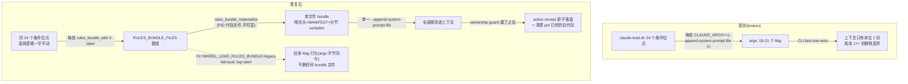

# FLY-1402 lead-rules bundle 拼接单文件修复 — 实施计划

Issue: FLY-1402 (https://linear.app/geoforge3d/issue/FLY-1402/p1装载链-lead-rules-bundle-全-fleet-静默失效-cli-append-system-prompt-file-为)
日期: 2026-07-21
基于: research.md

**Status**: codex-approved(design review 4 轮:R1 6 条 + R2 5 条 + R3 5 条全采纳,R4 APPROVED)

**R4 两条非阻断实现注意(实现期照做)**:
1. degraded nonce:编码为 filename/argv 安全的固定十六进制,与 start-hash 后缀可区分;无法证明原 lstart 时清理**宁留陈旧文件**,绝不因 suffix 与当前 lstart hash 不同就删可能仍被活 supervisor 引用的文件(该路径永不 strict-PASS,保守残留优于误删)。
2. 生产 probe 与测试 probe 用**同一解析函数**;`ps` 固定 `LC_ALL=C` + 不截断宽模式;真子进程 argv 边界测试除 CI 外在本机 macOS 的 C6 证据里跑一次;生命周期函数级 harness 配一条真实 claude-lead.sh wiring sentinel(证明生产路径确实调用 `_rules_bundle_commit_once`,不只验 helper)。
**Brainstorm gate**: 已过 — Tadashi 批准方案 A;裁定 external 统一走 bundle、legacy 逃生阀 fail-loud、canary = 代码默认 bundle ON + 首班车除 Cass 外显式 legacy opt-out。

## 0. 目标 / 非目标

**目标**:claude-lead.sh 把该 Lead 应装的全部 rules 拼接为一份 per-Lead bundle 文件(哨兵头 + 分节),用**单一** `--append-system-prompt-file` 传入,消除 CLI last-one-wins 静默丢弃;哨兵可验;装载链回归测试固化;check-rules-truth 用**独立权威源**做角色臂/模式核对。

**非目标**:
- 不改 24 处位点的**选择逻辑**(哪个角色装哪份、env 门、fail-STOP 语义逐字保留)。
- 不改 `compute_lead_rule_bundle` / codex 消费路径(codex-lead-runtime 拼接语义天然正确)。
- 不改规则文件内容本身(精简规则文本 = 独立 follow-up)。
- cos plist `FLYWHEEL_LEAD_ROLE=cos` 为手工配置修复,已由 Tadashi 完成,不进本单代码。

## 1. 装载链前后对照



## 2. 交付物 1:materializer(lead-rules-bundle.sh 新增函数)

放进 `packages/teamlead/scripts/lead-rules-bundle.sh`(已是 Lead 规则装载共享库;函数只定义不执行,codex-lead.sh 现有 source 不受影响)。bash 3.2 兼容,无新依赖。

### 2.1 函数契约(codex R1 #4 钉死)

```bash
# rules_bundle_reset — 显式初始化 RULES_BUNDLE_FILES=() / RULES_BUNDLE_LABELS=()
#   (bash 3.2 + set -u 下空数组必须显式初始化;调用点见 §3.2)
# rules_bundle_add <abs-path> <layer-label>
#   layer-label ∈ base|project|launcher。只收集,不判存在性 — 存在性/可读性/fail-STOP
#   语义留在 24 个调用点原地不动。
# rules_bundle_materialize <out-path> <role> <lead-id> <project>
#   stdout 契约:成功且非空时【只输出最终路径一行】;一切诊断(含 SHA 工具缺失
#   WARNING)一律走 stderr — stdout 被 command substitution 捕获,不得污染。
#   rc:0 成功(数组空时不写文件、stdout 空、rc 0);任一写/mv/读失败 rc 非 0,
#   且失败分支自行清理已建 temp 文件(body temp + final temp 都要),不留孤儿。
#   权限:目录 mkdir -p 后 chmod 0700,最终文件 0600(TmuxAdapter 先例;不依赖
#   调用方 umask)。
```

生成步骤:
1. 正文 temp:按数组顺序逐文件写分节 `═══ RULE SOURCE [i/n]: <label>/<basename> ═══` + 原文 verbatim + 空行(文件无结尾换行也要正确分节 — 测试覆盖)。
2. SHA = sha256(正文字节):`shasum -a 256` → 缺则 `sha256sum` → 都缺 `RULES_BUNDLE_SHA=unavailable` + stderr WARNING(降级不阻断,但 checker 对 unavailable 不算 PASS,见 §5)。
3. 头部(不参与 SHA):
   ```
   # Flywheel Lead Rules Bundle (FLY-1402)
   RULES_BUNDLE_SHA=<hex|unavailable> FILES=<n>
   ROLE=<role> LEAD_ID=<lead-id> PROJECT=<project> GENERATED_AT=<UTC ISO8601>
   MANIFEST:
     1. <label>/<basename> — <abs-path>
     ...
   PROBE: If asked to read back your rules bundle sentinel, quote the
   RULES_BUNDLE_SHA line above verbatim (the whole line, exactly).
   ```
4. 原子写:同目录 mktemp → 头+正文 → chmod 0600 → `mv` 到 out-path。

要点:SHA 只对正文;`FILES=<n>` 与 MANIFEST 行数、分节数三向一致;GENERATED_AT 不入 SHA;内容 verbatim 零转义。

### 2.2 Bundle 生命周期(codex R1 #3 + R2 #2 + R3 #1/#2/#3:真代际 + 真 commit point)

- **代际标识 = pid + supervisorStart(不可复用)**:PID 会复用,仓库现有防线(FLY-1285 `tmux-supervisor-guard.sh` 的 pid+`ps lstart`+argv;FLY-1309 lease 的 `LEAD_LEASE_SUPERVISOR_START`)从不单用 pid。**SUPERVISOR_START 在 materialize 之前计算一次**,并以 lease lib 消费的同一变量导出,使 bundle 文件名、receipt、lease 三处用**同一原串**(现状 lease 在 ≈2787 才算 — 提前到装配段,值不变)。bundle 文件名嵌代际:`${PROJECT_NAME}-${LEAD_ID}.<pid>-<start-hash>.md`;receipt 存 `pid` + `supervisorStart` 原串。checker/清理判活 = pid 存在 **且** 该 pid 当前 `ps lstart` == receipt.supervisorStart,**绝不**单用 `kill -0`。
- **lstart 不可得(R3 #3 钉死)**:镜像现有 degraded-launch 分支(2813-2819)的可用性哲学 — **不 fail-STOP**;代际改用一次性随机 nonce(`/dev/urandom` 短串)入文件名,receipt 写 `supervisorStart:null, generationNonce:<nonce>`。checker 对此类 receipt 报 `DEGRADED`(**永不 PASS**,strict 非零,打印原因)— 可用性保住,仪器诚实。
- **文件不可变**:本 supervisor 的 argv 永远指向**自己写的**代际文件;并发第二个 launcher 写自己的代际文件,输掉 guard 后由自清 trap 删掉自己未 commit 的文件退出 — **绝不碰别代际的文件**。crash-relaunch 循环重用 CLAUDE_ARGS 里同一路径,文件不可变 → 安全。
- **未 commit 自清(R3 #1:只在生产路径 arm)**:trap(EXIT)在 materialize 成功后注册、commit 时解除 — 但 **`FLYWHEEL_LEAD_DRY_RUN=1` 下不 arm**:dry-run 的 bundle 是隔离 HOME 内的可观察测试产物,launcher CI 要在 dry-run 返回后读它断言内容(测试显式断言:dry-run 返回后 bundle 路径仍存在可读);测试 HOME 由 harness 整体删除。生产 losing duplicate / lease 拒绝 / 信号退出 / 中途 fail-STOP 仍由 trap 只删**自己的**未 commit 代际。
- **commit point(receipt + 清理 + legacy 告警的唯一写点)**:不是 PID-file guard(2759-2780)胜出就算 ownership — 真正获准 launch 要过 `lead_identity_prepare_lease`(≈2820 起,可能长期 HOLD)+ tmux takeover guard + exact-process preflight。receipt(`${PROJECT_NAME}-${LEAD_ID}.active.json`,原子 temp+mv)、死代际清理、legacy 一次性告警,全部在**这些 guard 全部放行、本代确定要 launch 之后**(store-error 降级分支也在明确决定 launch 后才写)。lease HOLD 中**不**覆盖旧 receipt。dry-run 在 2656 早已退出 → 永远不写 receipt、不清理、不告警。
- **commit 幂等(R3 #3)**:commit point 落在 recovery `while` 内 ⇒ 提取 `_rules_bundle_commit_once`,以本 supervisor 代际为键、shell 级 committed 标志守卫:首次通过时原子写 receipt(**写失败 → fail-STOP 不 launch**,trap 自清)→ 成功才解除 trap、置 committed、执行死代际清理 + legacy 告警;之后每次 child crash-relaunch 迭代直接跳过(不重写 receipt、不重复清理、不重发告警)。测试:同一 supervisor 两次 launch attempt → 恰一次 receipt commit / 恰一次告警;receipt 写失败路径覆盖。
- **receipt 内容(R3 #2:双字段拆开,不再混用)**:
  ```
  {mode, bundlePath, pid, supervisorStart|generationNonce, sha, role, generatedAt,
   selectedSources: [{label,basename,path}…],   # 两种 mode 都记录:该臂选中的有序规则源清单
   appendTargets:   [path…],                    # bundle=[bundlePath];legacy=selectedSources[].path
   files: <len(selectedSources)>}
  ```
  `selectedSources` 用于角色臂不变量 / FILES / bundle header MANIFEST 三方对账;`appendTargets` **仅**用于与 live argv 的次数+值+顺序对账(§5.3)。
- **旧代际清理**:commit 之后,同前缀代际文件中「pid 不活 ∨ lstart 不匹配」的删除。legacy 模式**不删任何 bundle 文件**(原「删除既有 bundle」撤销)。
- **materialize 失败**:fail-STOP 于 commit 之前(trap 自清本代残留)→ 旧 receipt 原样;checker 靠 pid+lstart 把死代际报成 STALE,不会误报成功(§5)。

## 3. 交付物 2:claude-lead.sh 迁移

### 3.1 模式阀
`FLYWHEEL_LEAD_RULES_BUNDLE`:trim+lowercase → `legacy` → legacy;空/`bundle`/未设 → bundle(默认 ON,FLY-707);其他 → stderr WARN + bundle(宽容解析,同 normalize_comm_backend 风格)。

### 3.2 位点迁移
1. `source "${SCRIPT_DIR}/lead-rules-bundle.sh"`(现有 lib source 区,≈208-225)。
2. 模式阀解析后、**首个位点(2093)前**调用 `rules_bundle_reset`。
3. 24 处 `CLAUDE_ARGS+=(--append-system-prompt-file "$X")` → `rules_bundle_add "$X" <label>`;每处原有 `log "Appending …"` 行**原文保留**。legacy 模式下 `rules_bundle_add` 内部直接 `CLAUDE_ARGS+=(--append-system-prompt-file "$1")` — argv 与今日字节一致。

### 3.3 materialize 点(screencap 块后 ≈2532,dry-run 出口 2656 之前 — dry-run 测试必须能观察到 bundle)
```bash
if [ "$RULES_BUNDLE_MODE" = "bundle" ]; then
  if RULES_BUNDLE_FILE="$(rules_bundle_materialize "$_bundle_out" "$_bundle_role" "$LEAD_ID" "$PROJECT_NAME")"; then
    if [ -n "$RULES_BUNDLE_FILE" ]; then
      CLAUDE_ARGS+=(--append-system-prompt-file "$RULES_BUNDLE_FILE")
      log "Rules bundle: ${#RULES_BUNDLE_FILES[@]} files → ${RULES_BUNDLE_FILE} (sha ${_sha8})"
    else
      log "Rules bundle: no rule files selected — skipping flag"   # 理论路径
    fi
  else
    log "ERROR: rules bundle materialize failed — refusing to start"; exit 1
    # fail-STOP 同 agent 文件缺失级;launchd KeepAlive 重试;操作员可用 legacy 阀救急
  fi
else
  log "WARNING: running LEGACY last-one-wins mode, rules NOT bundled (FLYWHEEL_LEAD_RULES_BUNDLE=legacy)"
  # 注意:此处【只 log,不告警】— dry-run 合同是零生产副作用(claude-lead.sh:2652-2659),
  # losing duplicate 也不该告警(codex R2 #3)。告警在 §2.2 commit point 一次性发。
fi
```
- 显式 `if VAR=$(...)` 捕获 rc — `set -euo pipefail` 下裸赋值失败会在记录原因前退场(codex R1 #4)。
- `_bundle_role`:external→external、companion→companion、IS_COS_ROLE→cos、否则 dept(仅写进哨兵头,不参与选择)。
- receipt + 旧代际清理 + legacy 告警:**不在这里** — 全部在 §2.2 的 commit point(lease/tmux/preflight 全放行、确定 launch 之后)执行;dry-run 在 2656 已退出,天然零副作用。

## 4. 交付物 3:legacy 告警(codex R1 #2:全合同,不再是 allowlist 一行)

1. `scripts/lead-alert.sh` kind 白名单 + `rules_bundle_legacy`;调用形态照抄 `_companion_failstop_alert` 全参数:`--lead --project --kind rules_bundle_legacy --severity warning --title --body`(severity 枚举是 `info|warning|severe`,**不是 warn**)。
2. `LeadAlertNotifier.ts` 的 `ALERT_EVENT_TYPES` union + `kind-contract.ts` 的 `KIND_CONTRACTS` 增加 `rules_bundle_legacy`(owner: `claude`, arc: `human_by_design` — 人显式配 legacy env 才触发;Bridge startup validator 要求 union 与 contracts 同步,缺一拒启)。**不扩大** shell-only grandfather 例外(drift guard 明令)。
3. **触发时机(codex R2 #3)**:告警只在 §2.2 commit point、本代确定以 legacy 模式 launch 时发**一次**;dry-run 与 losing duplicate 零告警(pre-dry-run 阶段只有 loud log + LAUNCH_PLAN 证据)。
4. hermetic 测试分两层:C2 直接调用 `lead-alert.sh`(shim Discord 出口)断言 kind 被接受、参数完整合法;C4 launcher 生命周期测试用 alert shim 计数断言 dry-run/duplicate = 0 次、成功 legacy ownership = 1 次 — 不靠 dry-run 真发告警来证明 wiring(§6.1)。

## 5. 交付物 4:check-rules-truth.sh(codex R1 #1:独立权威源,不从 bundle header 反推)

`packages/teamlead/scripts/check-rules-truth.sh`:

```
Usage: check-rules-truth.sh --all [--expected <wave-inventory.json>]
       check-rules-truth.sh --lead <id> --project <name> [--expect-role <r>] [--expect-mode <m>]
       check-rules-truth.sh --bundle-file <path> --expect-role <role>      # hermetic 测试口
```

### 5.1 expected-role 权威(与 launcher 判定完全独立)
经 `node packages/teamlead/dist/core-room-gate-cli.js --all-leads`(FLY-944 现成接口,Bridge 一致的 projects.json 判定)逐 Lead 得 `isCoS`;external/companion 直读 projects.json lead flags。派生:external→external;companion→companion;isCoS→cos;否则 dept。这是「Cass 缺 cos 配置必须 FAIL」的判定源:launcher 错判成 dept 写出自洽 dept bundle,checker 的独立派生说 cos → 角色臂 FAIL。

**backend 适格性(codex R2 #5 + R3 #4:逐字镜像 wrapper 合同)**:该 CLI 的 `backend` 字段只看 projects.json 显式 `leads[].backend`,**不是** effective backend(优先级链见 `lead-backend.ts:43-57`)。checker 的「是否走 claude CLI 装载链」判定读 **manifest 的 `leadBackend.backendId`**(实际 launcher carrier,`flywheel-lead-wrapper.sh:106-110,177-199` 消费的同一字段),分支**逐字镜像 wrapper**:字段缺失 / null / 空串 → `claude-code`(标 `carrier=defaulted`,检查);`claude-code` → 检查;`codex-app-server` → SKIP(打印原因);**其他非空值或 manifest 文件本身缺失 → 配置 FAIL(strict 非零)** — wrapper 对未知非空 backend 是 ERROR/exit 不会启动 claude-lead.sh,checker 不得替它假定成 Claude。四个分支各一例测试;另测 projects.json 无显式 backend、manifest carrier=codex-app-server 必须 SKIP。

### 5.2 expected-mode 权威
`--expected <wave-inventory.json>`(W1 canary 班车的 opt-out 名单,操作员随重启通报生成:`[{"project":…,"leadId":…,"mode":"legacy"}]`);未列出/未提供 → 期望 bundle(fleet 默认)。不从 plist 反解析(plutil 是额外脆面;班车名单本来就是重启通报的一部分,即 SSOT)。

### 5.3 检查项与状态
- **claim 读取**:active receipt = launcher 的声明(mode + selectedSources + appendTargets,§2.2);bundle header = 内容自证。两者都是「标签」,判 PASS 必须过独立核对(expected-role / expected-mode / live argv)。
- **代际判活**:receipt 的 pid 存在**且**当前 `ps lstart` == receipt.supervisorStart 才算活;否则 `STALE`(PID 复用不会假活)。`supervisorStart:null` + generationNonce 的 receipt → `DEGRADED`(永不 PASS,§2.2)。
- **静态(mode-specific,codex R3 #2)**:
  - bundle receipt(活):bundlePath 非空、bundle 文件存在、头部可解析、重算正文 SHA == 头部 SHA(`unavailable` → WARN,永不算 PASS)、header FILES == header MANIFEST 行数 == 分节数 == len(receipt.selectedSources)、header MANIFEST 与 receipt.selectedSources 逐项一致。
  - legacy receipt(活):bundlePath 空、**不要求任何 bundle 文件**(本代也不该有);角色臂不变量改在 receipt.selectedSources 上执行。
- **角色臂不变量**(对 §5.1 的 expected-role;bundle 模式查分节,legacy 模式查 selectedSources):cos:含 cos-lead-rules.md、不含 base/department-lead-rules.md;dept:反之;companion:含 companion-safety-contract.md、不含 founder-only-authority.md;**external:恰 1 项且为 external-agent-contract.md**。header ROLE(bundle)/receipt.role ≠ expected-role 本身即 FAIL。
- **mode 判定(codex R2 #1:flag 数不是判据)**:receipt.mode 必须 == expected mode;且 live argv 的该 flag 序列(次数+值+顺序)与 **receipt.appendTargets** 一致(bundle=[bundlePath] 单项;legacy=selectedSources[].path 有序清单)。
- **argv 读取合同(codex R3 #5:macOS 无 /proc,`ps command=` 是格式化文本无参数边界)**:收窄而非虚标「精确」— 仅当全部期望 appendTargets 匹配无歧义字符集 `^[A-Za-z0-9._/-]+$`(无空白/无 shell 元字符)时,才对 `ps -o command=` 文本做带边界守卫(路径后是空白或行尾)的序列比对;任一期望路径含空白/歧义字符 → 状态 `AMBIGUOUS`(非 PASS,打印原因),**不做假精确声明**。生产路径由 PROJECT_NAME/LEAD_ID(launcher 已校验 `[a-z0-9-]`)+ 固定目录生成,必然落在无歧义字符集内 ⇒ 真实 fleet 恒可验。真子进程测试:相似前缀无空格双 target → 边界与顺序判定正确;含空格 target → AMBIGUOUS 而非误 PASS。结构化 argv helper(KERN_PROCARGS2)记为可选 follow-up,不在本单。
- **动态进程定位(codex R2 #4)**:按 Lead identity 定位 — 精确 tmux window `${PROJECT_NAME}-${LEAD_ID}` + live pane + **完整后代进程树**中**唯一**的 `claude --agent <leadId>` 进程(不凭窗口名单独判、不凭 `pane_current_command`(健康时可能只显示版本号)、同名 observer window 不算证据;0 个或多个匹配都不是 PASS)。找到 → 按上条 mode 判定;找不到 → `STATIC_ONLY`。
- **状态集**:`PASS | LEGACY_EXPECTED | STATIC_ONLY | STALE | DEGRADED | AMBIGUOUS | FAIL`;默认 exit 0 仅当无 FAIL。**`--strict` = mode-aware 期望终态**:expected bundle 必须 PASS、expected legacy 必须 LEGACY_EXPECTED;STATIC_ONLY/STALE/DEGRADED/AMBIGUOUS/SHA-unavailable 一律非零。**W1、W2 两班验收都用 `--strict`**(非 strict 只是排障巡检口)。

### 5.4 hermetic 测试(probe seam + 反例)
tmux/ps 探测走可注入 seam(env 指向 shim tmux/ps),至少覆盖:Cass 反例(dept bundle + expect cos → FAIL);SHA 篡改 → FAIL;FILES/分节/selectedSources 不一致 → FAIL;**三类 receipt schema 正例**(bundle PASS / dept legacy LEGACY_EXPECTED / external legacy LEGACY_EXPECTED — 不只测 argv 外形,codex R3 #2);单 bundle flag+正确 target → PASS;多 flag(bundle 期望)→ FAIL;dept legacy appendTargets 精确匹配 → LEGACY_EXPECTED / 不匹配 → FAIL;bundle 期望但 argv legacy 形态 → FAIL(反向漂移);无活进程 → STATIC_ONLY(strict 非零);dead pane / 0 个 / 多个 claude 后代 / 错 `--agent` / 错 bundle target → 各自非 PASS;pid 复用(pid 在但 lstart 不符)→ STALE;degraded nonce receipt → DEGRADED;空格 target → AMBIGUOUS;carrier 四分支(defaulted 检查 / claude-code 检查 / codex-app-server SKIP / 未知非空或 manifest 缺失 FAIL);真子进程 argv 边界测试(§5.3)。

## 6. 交付物 5:测试

### 6.1 新增(CI 强制面)
1. **vitest 材料化回归**(`packages/teamlead/src/__tests__/rules-bundle-materialize.test.ts`,shell-out harness 同 runBundle 模式)— **哨兵实验固化**:
   - 两个临时文件各含唯一哨兵串 → materialize → **两串都在**;ALPHA 先于 BETA;头部 SHA == 重算正文 SHA;FILES=2;MANIFEST 2 行;分节头 [1/2][2/2]。
   - 空数组 → 无文件、rc 0、stdout 空。
   - 同名不同层(base/x.md + project/x.md)→ MANIFEST 以 label 区分,两分节都在。
   - 边角(codex R1 #4):文件无结尾换行、路径含空格、stdout 纯净性(捕获值 == 路径,诊断只在 stderr)、写失败 temp 清理(只读目录注入)、bash 3.2 `set -u` 空数组。
2. **launcher 级 dry-run CI 测试**(`packages/teamlead/scripts/__tests__/fly1402-single-bundle.test.sh`,fly231 隔离-HOME 骨架)挂进 ci.yml — **覆盖全部四臂 + legacy**(codex R1 #5):
   - a. dept:LAUNCH_PLAN 该 flag **恰 1 个**;**dry-run 返回后 bundle 路径仍存在可读**(trap 不在 dry-run arm,codex R3 #1);bundle 含 department-lead-rules / founder-only-authority / cross-dept / screencap 分节;`check-rules-truth.sh --bundle-file … --expect-role dept` PASS。
   - b. cos(FLYWHEEL_LEAD_ROLE=cos):含 cos-lead-rules、不含 base dept-rules(Cass 阴性对照固化)。
   - c. companion:companion-safety-contract 为**第一个**分节且不含 founder-only-authority。
   - d. external:仅 external-agent-contract 分节(FILES=1),不含任何内部 rules 分节。
   - e. legacy(dept 形态):flag 序列与该臂选中清单同构、不写 bundle 文件、loud log 行存在、**dry-run 下告警 shim 计数 = 0**(codex R2 #3)。
   - f. **external + legacy**:恰 1 个原始 contract flag、无 bundle 文件(checker 对其判 LEGACY_EXPECTED,codex R2 #1)。
   - g. 生命周期段(尽力在 dry-run 骨架内做到,做不到的用函数级 harness):losing duplicate 不留代际文件(生产 trap 自清);lease HOLD 不覆盖旧 receipt;pid 复用(lstart 不符)清理不误删;child relaunch 复用同一代际路径;**commit 幂等**(同 supervisor 两次 launch attempt → 恰一次 receipt/告警;receipt 写失败 → fail-STOP 不 launch,codex R3 #3)。
3. **truth checker hermetic 测试**:§5.4 全矩阵(probe seam shim + Cass 反例 + SHA/FILES 篡改 + mode/manifest 匹配 + 代际判活)。
3b. **告警两层测试**(§4-4):C2 直接调用层(kind/参数合法性);C4 计数层(dry-run/duplicate=0、成功 legacy commit=1)。
4. parity 测试 `lead-rules-bundle.test.ts`:预计零改动(锚点是路径赋值行与 commdb 守卫块);实现时跑通确认。

### 6.2 存量迁移(7 个,本地测试;C5 逐个跑,命令清单进 PR)
fly231-companion-launch-plan / fly879-external-launch-plan / screencap-skill-gate / rollback-args-gate / test-fly26-rules-split(Group 3)/ test-fly205-doc-flow-lead → 断言迁为「恰 1 个 bundle flag + bundle 内容含/不含对应分节」;decommission-legacy-companion-daemon(fixture 文本)预计零改动。**故意非字节兼容 = 修 bug 本体**(gate 已确认),sentinel 更新逐个说明(LEGITIMATE RETARGET)。`pnpm -r test` 不会跑这些 standalone shell 文件(codex R1 #5)⇒ C5 的完成定义 = 以下命令逐条执行贴输出:
```
bash packages/teamlead/scripts/__tests__/fly231-companion-launch-plan.test.sh
bash packages/teamlead/scripts/__tests__/fly879-external-launch-plan.test.sh
bash packages/teamlead/scripts/__tests__/screencap-skill-gate.test.sh
bash packages/teamlead/scripts/__tests__/rollback-args-gate.test.sh
bash packages/teamlead/scripts/__tests__/decommission-legacy-companion-daemon.test.sh
bash packages/teamlead/scripts/test-fly26-rules-split.sh
bash packages/teamlead/scripts/test-fly205-doc-flow-lead.sh
```

### 6.3 全量门
`pnpm lint` + `pnpm -r build` + `pnpm -r test` 全绿;ci.yml 增 fly1402-single-bundle 行;§6.2 七条命令逐条绿。

## 7. 上线与验证(两班次可执行步骤;节奏 founder 在 ship gate 拍)

**W1 canary(Cass 先行)**:
1. merge 后生产 `git pull`(launcher 每次启动现读脚本)。
2. 给**除 flywheel-cos-lead 外**所有 Claude Lead 的 plist 加 `FLYWHEEL_LEAD_RULES_BUNDLE=legacy`;同时生成 wave-inventory.json(即 §5.2 的 expected 名单;重启通报逐个列名,可见不静默)。
3. 搭统一重启班车。验证:
   - Cass:哨兵探针 — Discord 问「read back your rules bundle sentinel」→ 逐字回 RULES_BUNDLE_SHA 行,与磁盘 bundle 头比对;cos 阳性(cos-lead-rules 特征串在)+ dept 阴性(FLY-162 Reply Discipline 标题不在)。
   - 其余 Lead:启动日志 LEGACY loud 行 + `rules_bundle_legacy` 告警各一条;行为与今日一致。
   - `check-rules-truth.sh --all --strict --expected wave-inventory.json`:Cass 必须 PASS,legacy 名单内 Lead 必须 LEGACY_EXPECTED — **W1 也用 --strict**(codex R2 #4:非 strict 下 Cass 没起来也能 exit 0,不成其为 canary gate)。
4. soak 窗(founder 拍长度)。

**W2 全量**:撤全部 legacy env → 统一重启 → 逐 Lead 哨兵探针(dept Lead 读回哨兵 + 引用 department-lead-rules 特征串 FLY-162 Reply Discipline 标题)→ `check-rules-truth.sh --all --strict` 全 PASS(STATIC_ONLY/STALE/unavailable 都不算过)。

**规则内容审计(scope 增补 A,lead-instruction ba48aae2)**:见同文件夹 `audit.md` — 17 份 base rules + Tadashi/Cass identity 样本通读,置顶 = Belle companion-safety-contract 从未生效;**激活前必须裁决项** = FLY-162 算法 vs FLY-270 派单流的 dispatch 例外(audit §3.1/3.2,建议独立小 PR 与 W1 并行);其余改/删/保留清单 + canary soak 观察点见 audit §4。审计随 ship gate 呈 founder。

## 8. 验收(能力级,对齐 issue)

1. 真机重启后任一 dept Lead 能读回哨兵 + 引用 department-lead-rules 特征串(FLY-162 Reply Discipline 标题)。
2. Cass 能读回 cos 哨兵且 dept 特征串不在(阴性对照)。
3. 自动化回归测试绿:两哨兵文件经拼接路径 → 两串必须都在(vitest,CI);launcher dry-run 四臂+legacy(ci.yml)。
4. check-rules-truth --all --strict 在 W2 班车后全 PASS。

## 9. 风险与对策

| 风险 | 对策 |
|---|---|
| bundle 拼接路径自身有 bug 导致 Lead 起不来 | materialize 失败 fail-STOP + launchd KeepAlive 重试;legacy 阀救急(fail-loud);canary 只暴露 Cass |
| 并发同 Lead launcher 破坏在用 bundle / PID 复用假活 | pid+lstart 真代际不可变文件 + receipt/清理/告警只在 lease/tmux/preflight 全放行的 commit point + trap 自清未 commit 代际(§2.2) |
| checker 信「标签」自证 → 假绿 | expected-role 走 core-room-gate 独立权威;expected-mode 走 wave inventory;mode 判定用 receipt manifest 精确比对而非 flag 计数;两班验收都 --strict;Cass 反例 + probe seam 全矩阵测试(§5) |
| legacy 告警静默失败 / 误发(dry-run、duplicate) | severity=warning 合法枚举 + kind 全合同(shell 白名单 + TS union + KIND_CONTRACTS)+ 告警只在 commit point 发一次 + 两层 hermetic 断言(§4/§6) |
| codex-backend Lead 被误检 | 适格性读 manifest leadBackend.backendId(实际 carrier),未知 carrier 显式诊断(§5.1) |
| 规则真装进去后行为变化/规则互相矛盾暴露 | 应然成本;canary + soak 观察;矛盾走独立 issue |
| 上下文成本 ↑(dept ≈143KB ≈36k tokens) | 已知成本;规则精简 follow-up |
| 存量测试迁移遗漏 | §6.2 七条命令逐条执行贴输出;CI 新增四臂+legacy 机器闸 |

## 10. 实施分块(codex R1 #6 重排:每块完成点独立可绿)

- **C1** materializer 函数 + vitest 材料化回归(TDD 先测试;含 §2.1 全部边角)
- **C2** 告警 kind 全合同:lead-alert.sh 白名单 + LeadAlertNotifier union + kind-contract KIND_CONTRACTS + hermetic alert 测试
- **C3** check-rules-truth.sh + hermetic 角色/模式/反例测试(依赖 C1 的 bundle 格式,不依赖 launcher)
- **C4** claude-lead.sh:source + 模式阀 + reset + 24 位点 + materialize 点(dry-run 可观察)+ commit point(receipt/死代际清理/legacy 告警,lease/tmux/preflight 放行后)+ trap 自清 + fly1402-single-bundle.test.sh(四臂+两种 legacy+生命周期段)+ ci.yml 挂线
- **C5** 存量 7 测试迁移,逐条执行贴输出
- **C6** 全仓 lint/build/test + codex code review + PR(sentinel 变更逐条说明 + 审计报告置顶项 + wave-inventory 模板)
