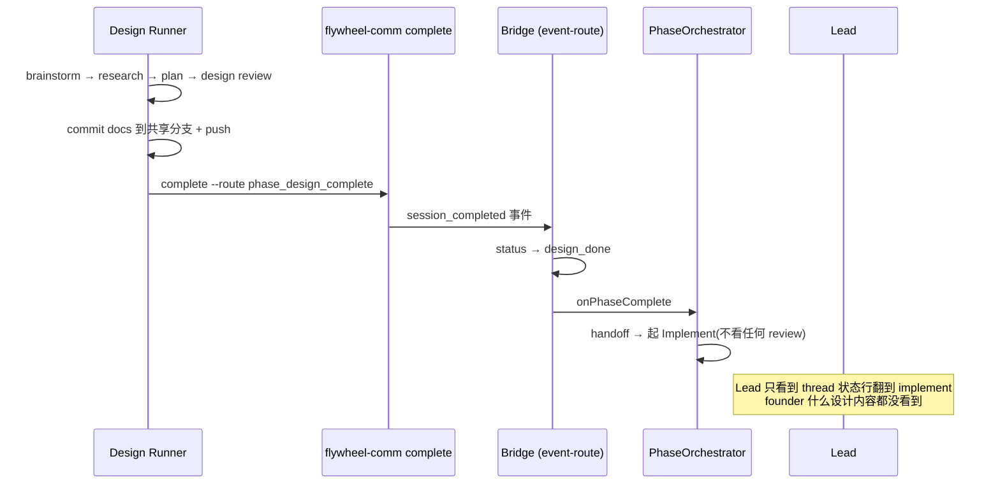

# FLY-1404 设计期可见性:design 完成必产 founder HTML — 探索

Issue: FLY-1404 (https://linear.app/geoforge3d/issue/FLY-1404/流程设计可见性-design-完成-必产-founder-设计-html图优先发-issue-thread-写进三段式-design)
日期: 2026-07-21
基于: 无

## 1. 问题(founder 原话为准)

> 「每次设计完成、开始跑 implement 的同时,设计也需要给我做一个 HTML,讲一下它的设计是怎样的,把图画好发给我 review。…做出来的东西跟我想象中不一样…每次都必须要我一层一层去问,才会发现你们做的跟我想象的完全不是一个样子…设计做完之后,你起码得马上让设计那边用 runner 给我出一个 HTML,发在相对应的 thread 里面让我看。**这不一定会拦着后续的 implement**…看完有问题我会马上给你反馈,我们就可以再去改。」

FLY-1392 当天两次「做出来 ≠ 想象中」(路由模型/收据分类),全靠 founder 一层层追问才暴露。根因:设计定型后 founder 才第一次「看见」设计。修复方向:**设计期即可视** — design 完成的瞬间,founder 在 issue thread 里看到一份图优先的设计 HTML;有问题马上反馈,返工发生在最便宜的时刻。

## 2. 现状审计(为什么今天不会自动发生)

三段式管线(Design → Implement → QA,同一分支)中 design 阶段的完整链路:

- **Design runner 的指令**是代码内建的 systemPromptLines(`packages/edge-worker/src/Blueprint.ts:1558-1565`,isDesignPhase 分支):四步 = 读代码 → 做设计 → commit docs → complete。**没有任何 founder 可视交付物的要求**。
- **`complete --route phase_design_complete`**(`packages/flywheel-comm/src/commands/complete.ts`)目前只校验「不带 --merged/--pr」。它已经用 `collectEvidence()` 从 git 收集 changedFilePaths(baseRef..HEAD)——有现成的 fail-closed 校验挂点,但今天没有校验。
- **Lead 规则**(`packages/teamlead/lead-rules-base/`,经 FLY-1402 单 bundle 装载链)没有任何一条要求 Lead 在 design 完成时核验 founder 可视物料。
- **对照组**:mockup-first designer phase(FLY-1059,`Blueprint.ts:1543-1557`)已有 runner 产 founder 视觉物料的流程先例(产出 → 交 Lead → Lead 发 thread,runner 绝不直接对 founder 发 Discord)。标准 design phase 完全没有对应物。
  > **Design review R1/R2 事实更正**:该 prompt 里「publish WITHOUT --channel and hand the URL to your Lead」的文案本身是错的 — publish-report 无 --channel 并非 publish-only,实际会 fallback 把报告投到项目 generalChannel(`reports-route.ts:368-383`)。流程先例成立,机制文案是存量 bug,本单一并修正(plan §4/§6:新增 --publish-only)。

## 3. 方向探索

### 方向 A(选定):三层协议加固,复用现有 transport、新增 admission contract

1. **Runner 层**(Blueprint design prompt):产出 5 节模板 HTML 成为 design 完成清单的硬性交付物,commit 到 issue doc 文件夹随分支走;publish-report 拿 URL 交 Lead。
2. **CLI 层**(complete.ts):`phase_design_complete` 前置校验 — diff 里必须有 issue doc 文件夹下的 .html,缺则 exit 1(校验真拦,满足验收)。
3. **Lead 层**(department-lead-rules.md):核验 HTML 已产出并投递 thread,缺则补救,不阻塞 implement。
   > **Design review R1/R3 修订**:核验时机改**机会式**(design_done 没有推送给 Lead 的 lifecycle 事件,「翻段时核验」不是真实触发面);补救对 parked design runner 是**只读**的(publish-only + report 已提交工件),真正的 repo 写入归当前 TURN 持有者。终形见 plan §5。

全部复用现有基建:collectEvidence 的 git 证据、FLY-161 ask --report 通道、founder-html-delivery skill、FLY-887 keep-alive park、FLY-921 TURN 纪律。**零新事件类型、零新表、零新服务。**

### 方向 B(否决):Bridge 侧硬闸(event-route 拒收无 HTML 证据的 phase_design_complete)

否决理由:session_completed 有三个 sister sink(event-route.ts / DirectEventSink.ts / complete-marker-reconciler.ts),Bridge 侧校验要三处同步,且「拒收已发出的完成事件」会让 runner 卡在 running 却自认为完成 — 状态撕裂比校验缺失更糟。CLI 侧 fail-fast 给 runner 即时反馈、可当场补产,层次正确。威胁模型是「健忘的 runner」不是「恶意的 runner」,CLI 层强度足够;Lead 层是第二道兜底。

> **Design review R1/R2 修订(2026-07-21)**:此否决被部分推翻。Codex 核实 marker replay 是**存量**旁路(reconciler 不看证据、原样重放,现测试甚至断言无 changed paths 的 marker 可推进 design_done),且 enrolled generalized 完成在 `commitEnrolledCompletion()` 处**早于**原设想挂点就提交事务 — CLI-only 撑不住「缺 HTML 时 design 无法 complete」这句绝对验收。最终方案(R3/R4 定形):CLI 门为主执法面(git 强校验:ACMR + HEAD 存在性),校验通过后 CLI 往 payload/marker 写 **versioned attestation**(`designHtmlEvidence {version, issueIdentifier, paths, headSha}`);Bridge 接收面(含 enrolled 前置位点)**只认严格解析后的 attestation**,绝不回看含删除项的 `changedFilePaths`(R3 证伪了 payload 路径谓词方案 — 删除-only 的旧 payload/marker 会被误认有证据);identifier 权威源 = session row 的 `issue_identifier`(event.issue_id 可为 Linear UUID,不可直接比);缺/坏 attestation:HTTP 用 **409 + 稳定 error code**(R2 证伪了 ok:true+warning — 旧 CLI 只看 response.ok,2xx 会被当成功,恰好制造撕裂;409 让旧 CLI 重试→exit 1→marker→quarantine,闭环 fail-closed),marker 一律 quarantine;DirectEventSink 无合法 attestation 载体 → 永远 fail-closed。见 plan.md §8/§13。

### 方向 C(否决):独立 design-html skill(flywheel-skills 库)

否决理由:模板只有 5 节结构 + 风格引用,inline 在 prompt 里几行讲完;跨仓 skill 增加分发时序问题(FLY-880 的 13 个 PM skill 至今未同步落地的教训)。等模板真的膨胀再抽 skill 不迟。

## 4. Brainstorm gate 裁定(Lead 已确认,2026-07-21)

| # | 决策点 | 裁定 |
|---|--------|------|
| 1 | 校验判据 | **限定 issue doc 文件夹路径下的 .html**(不是任意 .html)— 任意 .html 会被无关文件空过,反空过是本单的魂 |
| 2 | mockup-first designer phase | 同一 route 统一受校验,无豁免口(它本来就产 HTML card,天然满足) |
| 3 | Lead 规则落点 | department-lead-rules.md 加节(搭 FLY-1402 新装载链,零装载链改动) |
| 4 | 开关 | 校验默认 ON + FLYWHEEL_DESIGN_HTML_GATE=0 逃生口;**关闭态打一行显式日志** |
| 5 | founder 反馈修正流 | feedback → Lead relay 给当前 TURN 持有者(通常 implement)→ 写 design-correction.md(废除概念/保留器官/founder 原话引用)→ 增量 review 覆盖。**这正是 FLY-1392 当天实测趟通的真实路径**,照写成协议 |

## 5. HTML 模板(5 节,founder 原话件④⑤是灵魂)

1. **一句话** — 这个设计做什么(founder 十秒扫完)
2. **核心流程图** — 图优先:Mermaid/SVG 流程图、新旧对比
3. **数据/结构怎么立** — 数据模型、状态、落盘位置
4. **关键取舍与被否决的替代** — 为什么选 A 不选 B
5. **诚实边界** — 做了什么/没做什么(FLY-1392 全景图被 founder 抓出真问题的功臣,必留)

规格:项目 html-report-style(Apple 风浅色主题)。

## 6. 非阻塞语义(明确写死)

- HTML 发出 ≠ 等待批准:`complete → design_done → PhaseOrchestrator handoff → Implement 启动` 的链路**零改动**,implement 照常起跑。
- founder 反馈是异步增量:按决策 5 的修正流处理,不回滚不重跑 design 阶段。
- design runner park 存活(FLY-887 keep-alive)可被咨询,但 TURN 在 implement 手上(FLY-921),design runner 不写 worktree。
