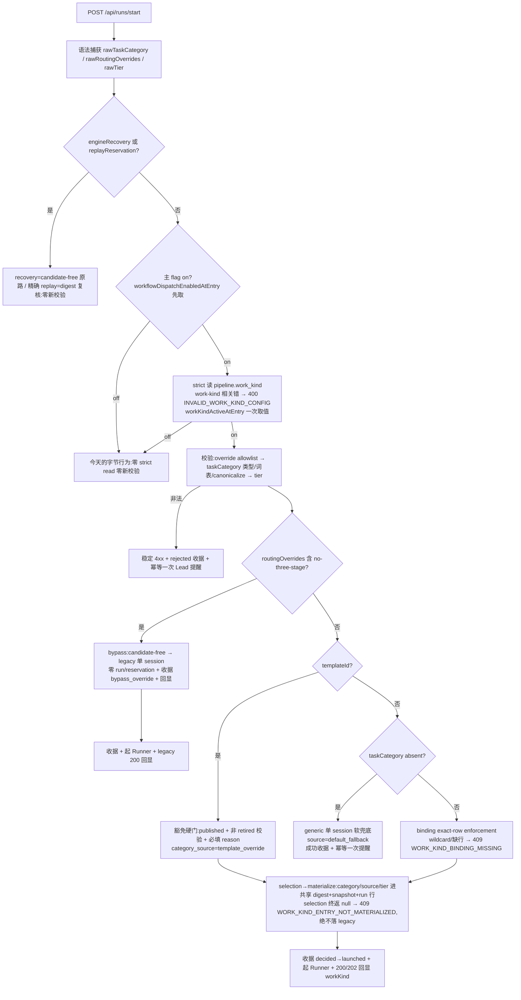

# FLY-1407 binding-migration 引擎面落地 — 实施计划
Issue: FLY-1407 (https://linear.app/geoforge3d/issue/FLY-1407/enginebinding-migration-1396-addendum-引擎面落地v2-入口三件套keylessflag-offauth)
日期: 2026-07-21
基于: research.md

**Status**: **codex-approved**(R5 APPROVED,2026-07-21;R1 8 + R2 5 + R3 5 + R4 4 共 22 项全采纳,零 waive;D11a 投递保证获 Tadashi 裁决 question `79079ec9`)

**Design correction (founder,2026-07-21,msg `1529324466717458504`)**:本计划中原 `WORK_KIND_REQUIRED` absent 硬门被 founder 三分支裁定覆盖。开关 on 域的 absent 现在**不阻断**:直接走 generic 单 session 软兜底(绝不落 eng-heavy),收据记 `category_source=default_fallback`,并以 D11 同款请求级幂等 outbox 提醒 Lead「未给类型,已兜 generic」。非法显式值仍 fail-loud。此 correction 优先于本文旧版段落与 addendum 的 required-param 原文;下文已按该裁定修正。

**Visibility correction (founder,2026-07-21,msg `1529326855444893736`)**:spawn 时的 thread **标题不加短码**;路由信息写入 thread 置顶/首条消息,同时进入 spawn 播报第一行。两面都从同一 route decision 取「work-kind/模板 + 来源(Lead 指定或 generic 兜底)」。

---

## 0. 一句话

给引擎装上 work-kind 派发的三样东西:**per-project cutover 开关**(off=今天的字节行为)、**开关 on 域内的 taskCategory 硬门+词表校验+exact-row enforcement+回显**、**no-three-stage 从「读 issue label」换成「派发时显式 routingOverrides」并留 route-decision 收据** —— 外加 derive/tier/provenance 持久化契约;全部只作用于 fresh master main 域,recovery/QA/scoped/tokenless/retry 一律不碰。

## 1. 核心决策(探索 D1-D10 + R1 修订)

| # | 决策 | 定案 | 关键理由 / 被否的替代 |
|---|---|---|---|
| D1 | cutover 开关 | **`pipeline.work_kind?: boolean`**(config.yaml,canonical root,absent/false=off);**共享 ConfigLoader 对非法 work_kind 值 lenient-drop(只丢该键,pipeline 其余字段保留,记 warning)**;`work_kind:true` 要求 `dag:true` 的 cross-field 规则**只在 flag-on 的 strict 路由侧读法 enforce**(§3.1/§3.2,R3#1) | 否 StateStore flag(第二控制面)、否 env(不 per-project)。work_kind && !dag:category=code 走 v1 DAG 入口,不 enroll dag 会让显式 category 静默落回 three-stage,违反 §5.5;共享 loader hard-fail 会把 handoff 的 three_stage 一并吞掉(R3#1) |
| D1a | **config 错误的 runtime 语义(R1#1+R2#1)** | **次序:先取 `workflowDispatchEnabledAtEntry`(纯 env 读),false ⇒ 跳过 strict read 与全部新校验,直接今天的 legacy 字节路径**(malformed work_kind + 主 flag off ⇒ 不存在今天没有的 400)。主 flag on 才 strict 解析:新读法**只解析/校验 `pipeline.work_kind` 及其 `dag` 依赖**(typed cause;与 work-kind 无关的 ConfigLoader 错误保持今天的吞错→旧路,不冒充 work-kind 错)⇒ work-kind 相关错 = 稳定 400 `INVALID_WORK_KIND_CONFIG`,零 binding 查询、零 Runner。plugin handoff 侧吞错行为不动 | R2#1:紧急回滚(flag off)最需要的时刻恰是 config 事故时刻,strict read 抢先 400 会让回滚杆失效;error domain 不收窄则无关字段错误被改写语义 |
| D1b | **新语义生效条件** | `pipeline.work_kind===true` **且** `isWorkflowTemplateDispatchEnabled(env)`,**请求入口一次取值**(`workKindActiveAtEntry`)贯穿校验/selection/收据/回显 —— 主 flag off = 紧急回滚 ⇒ 字节回到今天(含校验全关) | 只挂 per-project 开关会打破 W8 已 ship 的「flag off ⇒ 字节等同 legacy」契约(§9 验收 6);codex R1 认可此优先级 |
| D1c | **中途翻 flag 的 fail-closed(R1#4)** | `workKindActiveAtEntry`(或 v2Entry/dagEntry)判定要走 engine,而 selection 最终返 null(flag TOCTOU / binding 中途消失)⇒ **schema-v1 与 v2 对称**返回 409 `WORK_KIND_ENTRY_NOT_MATERIALIZED`(v1 侧现有 `DAG_ENTRY_NOT_MATERIALIZED` 保留原码,v2 侧新增对称守卫),**绝不写 legacy decision、绝不起 legacy Runner**;请求开始前 flag 已 off ⇒ 原字节行为 | 现状 v2Entry 后 selection null 会静默落 legacy(`:1399-1410` 只护 dagEntry)——同请求前半新语义后半旧语义,正是要消灭的中间态 |
| D2 | route-decision 收据 | 新表 `workflow_route_decision`,fresh master main + on 域每次**成路由**都写(workflow_v2 / pipeline_dag_v1 / legacy 三态 / bypass_override),**非法显式输入写 `rejected` 行**(见 D11)——legacy 与 v2 双路可观察(addendum ①.1) | 否 session_params(不可聚合、session 晚于 decision);否只扩 workflow_run(bypass 无 run 行) |
| D2a | **收据身份与状态机(R1#5)** | 不宣称 append-only。列含 `status('decided'\|'launched'\|'rejected')`;**业务唯一键**:engine 路由行 UNIQUE(idempotency_key)(合成/显式 key 都有);legacy/bypass 行 UNIQUE(execution_id)(绑 legacy launch claim 接受点,claim 输掉的请求不写行);`recordWorkflowStartResponse` 缓存命中的精确 replay **不再写新行**;launch 成功后单次 CAS `decided→launched` 并补 execution_id。**summary 分母只取 `status='launched'` 且 `category_source='task_category'`** | 无唯一键的「每次都写」会被重试/并发放大,指标不再代表 accepted decisions |
| D2b | **收据 get-or-resume 语义(R2#3+R3#4)** | store API 用具名 claim:`claimWorkflowRouteDecision()` 返回 `inserted \| resume_decided \| already_launched \| conflict`,行内存**不可变 route digest**+ reservation/run 关联并在 claim 时校验:**同 key + `decided` + digest 相同 ⇒ resume(沿 pinned recovery 续跑)**;**digest 不同 ⇒ 稳定 409**。`decided→launched` CAS 只凭 generalized `launch_committed` / legacy durable session+claim 证据。**`already_launched` 的 HTTP 终态(R3#4)**:结果携带 execution_id/run/node + route echo;**有 start-response cache ⇒ 原样 replay;无 cache(CAS 后、`recordWorkflowStartResponse` 前 crash 的窗口,`runs-route.ts:1802-1819`)⇒ 按 durable launch/session 证据重建同构 200 并回写 cache**,后续 replay 稳定。**重建仅限 generalized engine 行(R4#3)**:legacy/bypass 重试不携带上次随机 execution_id、且会先撞既有 single-active 409(`runs-route.ts:580-635`)——**保持 D3 已接受的 single-active 409 语义,不放宽 early guard、不造 legacy 200 重建**。Runner 全程只起一次 | 裸 UNIQUE 会卡死或误领(R2#3);「no-op」不定义响应会让该 key 永久无法完成 replay(R3#4);legacy 重建承诺在现有身份模型下不可达,放宽 guard 会把真 fresh 误认成 replay(R4#3) |
| D3 | bypass 幂等语义 | **接受 legacy 单-active-session 语义** + D2 收据补可见性。**零 run/reservation/pinned snapshot**(addendum ①.4/①.5);防双开 = 既有 alreadyActive 409 + active-engine-run fail-closed 守卫 | 否造 generalized idempotency——把 no-three-stage 拖进 v2 记账,①.4 明令禁止 |
| D4 | ① 的 reason/selectedBy | 收据 reason = 固定机器 reason `dispatch_override:no-three-stage`;selectedBy = `leadId ?? "unassigned"` | 必填自由文本逼 Lead 编话,零信息量 |
| D5 | tier vendor path | **(b) 扩 `applyWorkflowOverride`:node 覆盖新增 `vendor` 键,vendor+model 必须成对、按新 vendor 校验兼容、原子生效** | §3.4 preset 表跨 vendor,(a) 表达不了 |
| D6 | tier 输入合同 | `req.body.tier`,词表 `trivial\|light\|heavy`;模板声明 `tier_presets` 时 absent→默认 `heavy`;模板无 presets:present→400 `TIER_NOT_SUPPORTED`,absent→不适用。开关 off:字段忽略(=今天) | tier 不进 required 硬门 |
| D7 | 回显落点 | **HTTP 响应体**(generalized 200/202 同构 + legacy 200,on 域加 `workKind:{category,source,tier?,override?,fallback?}`)+ 收据持久化;**thread 置顶/首条 + spawn 播报首行**从同一收据渲染 route+来源,标题不动 | dagAuthority 先例(`runs-route.ts:1303-1313`)+ founder visibility correction |
| D8 | 错误码 | 稳定码族(docTier FLY-127 模子):`INVALID_TASK_CATEGORY`(not_string\|unknown_category,带 allowed)/ `WORK_KIND_BINDING_MISSING`(409) / `WORK_KIND_ENTRY_NOT_MATERIALIZED`(409) / `TEMPLATE_NOT_FRESH_ELIGIBLE`(409) / `INVALID_WORK_KIND_CONFIG` / `INVALID_ROUTING_OVERRIDE` / `ROUTING_CONFLICT_CONFIRM_REQUIRED` / `TIER_NOT_SUPPORTED` / `INVALID_TIER`;`WORK_KIND_REQUIRED` 从正常 absent 分支退役,只可保留为 generic fallback 本身不可用的配置故障码 | founder correction;否裸 `GENERALIZED_WORKFLOW_REJECTED` 复用 |
| D9 | ③ 的审计 category | templateId 路径:同请求带合法 taskCategory → 记 canonical;没带 → NULL(不造假 sentinel);`category_source=template_override` 恒记。**metrics 排除口径 = category_source 字段本身** | 分母只取 task_category 行 ⇒ 有意跨 kind override 天然排除 |
| D9a | **templateId eligibility(R1#3)** | 本单落 **enforcement seam**:`workflow_template` 加 `retired_at TEXT NULL`(幂等 ALTER,默认 NULL=eligible);direct `templateId` fresh 选择校验 `retired_at IS NULL && current_published_revision` ⇒ **retired 与 unpublished 两态都返回稳定 409 `TEMPLATE_NOT_FRESH_ELIGIBLE`**;**active pinned run/recovery 照读不受影响**(candidate-free)。retire 的**写入面**(谁在何时置 retired_at)= FLY-1380 §3.3 时序 | 不落 seam 则旧 identity 退休后仍可被 fresh override(违反 ③.0/§9.9);只写「1380 管」而引擎无处 enforce = 静默 descope |
| D10 | 冲突确认形态 | 400 `ROUTING_CONFLICT_CONFIRM_REQUIRED`(本次显式 override × 本次显式 taskCategory/templateId 同现)→ 去掉一方重发 = 显式确认(§5.4 的确认臂) | 否会话态确认协议(裸 HTTP 无处放) |
| D11 | **非法显式输入的「幂等一次提醒」(R1#6+R2#2+R3#2/3)** | 走 §5.4 提醒臂,**outbox 模式**:命中提醒臂的稳定码(见 D12 拒绝矩阵)⇒ 稳定 4xx/409 + **同一 StateStore 事务**写 `rejected` 收据行(dedup UNIQUE(project, issue_id, error_code, payload_hash))**与 durable reminder outbox 行**(business key=同 dedup 键、resolved recipient、`pending\|accepted\|dead_letter`、attempt 计数)。**runs-route 不直接调 notifier**(依赖倒挂,`plugin.ts:3520` vs `:7383`):投递由既有周期 reconcile(GatePoller piggyback,零新 timer)+ boot drain 走 `LeadAlertNotifier`。**投递保证 = 请求级幂等 + 传输级 at-least-once(D11a)**。**三条轴分开定死(R3#2)**:① recipient 轴=`AlertPayload.leadId`,fallback 链 leadId→项目 owningDept 部门 Lead→cos-lead(PRD §5.4「Cass 提醒」的 Cass=CoS,即 fallback 链终点;sender=Bridge alert 通道,与 recipient 是两回事);② kind registry 轴=新 AlertEventType 按 `KIND_CONTRACTS` 注册,**owner=`claude`**(合法 KindOwner 词表 `claude\|codex\|cross_by_provider\|founder_direct`,`kind-contract.ts:46-61`)+ 必填 `arc`;③ posture 轴=**加入 `INFORMATIONAL_KINDS`(纯提醒,不建 ticket/thread/ARC 动作)**,shell mirror/contract tests 列入改动面 | receipt 与提醒非同事务则 crash 吞提醒(R2#2);owner=人名不是合法 KindOwner、recipient 与 ticket owner 混轴会编译不过/误建 ticket(R3#2) |
| D11a | **投递保证等级(R3#3,契约解释已报 Lead 确认)** | 「幂等一次提醒」拆两层:**请求级幂等(硬保证)**=同 dedup 键(同 issue+同错误码+同 payload)只存在一行 outbox ⇒ 重复非法请求永不产生第二条提醒——这是 addendum「幂等一次」的对象;**传输级 = at-least-once**:per-attempt eventId(`outbox_key#attempt`,GatePoller 先例 `gate-poller.ts:2057-2068`)重驱直到 accepted 证据(`sent\|queued`)落库;「POST 成功后、accepted 落库前 crash」窗口可能重复投同一条提醒——**方向性取舍:宁重不丢**,提醒文本携带 dedup 键使重复可辨认。**不宣称 crash-safe 恰一次**(现有 notifier claim-before-send 模型下恰一次不可达,R3#3 实锤)。**✅ 权威已裁(R4#2 闭)**:Tadashi 经 question `79079ec9`(2026-07-21)确认「请求级幂等 + 传输 at-least-once,宁重不丢」定案、at-most-once 明确否决(理由:假恰一次更坏;收件人是 Lead/LLM,带 dedup 键的罕见重复零成本;漏发=错误静默,违 1392 无静默丢不变式;与全系统 outbox 口径一致) | 二选一必须显式选且有权威记录;E2E 两窗都验:claim 后 queue 前 crash ⇒ 重驱最终送达;POST 后 accepted 前 crash ⇒ 重复可辨认、不误标 |
| D12 | **路由/拒绝矩阵(含 founder correction)** | **非法显式输入提醒臂**(rejected 收据+outbox):`INVALID_TASK_CATEGORY`、`INVALID_ROUTING_OVERRIDE`、`INVALID_TIER`、`TIER_NOT_SUPPORTED`、`TEMPLATE_NOT_FRESH_ELIGIBLE`;**absent 软兜底提醒臂**:不返回错误,走 `generic_fallback` 单 session,成功收据 `category_source=default_fallback`,outbox code=`WORK_KIND_DEFAULT_FALLBACK`;**确认臂**:`ROUTING_CONFLICT_CONFIRM_REQUIRED`;**只稳定码、不提醒**:`WORK_KIND_BINDING_MISSING`/`INVALID_WORK_KIND_CONFIG`/`WORK_KIND_ENTRY_NOT_MATERIALIZED`;selectionReason 缺失沿用既有 `GENERALIZED_WORKFLOW_REJECTED` | founder 三分支:absent 保活、invalid 拒绝、valid 正常路由 |

## 2. 派发决策流(开关 on + 主 flag on,fresh master main 域)

残留 issue label `no-three-stage`(on 域):不进任何判定分支,只在收据记 `label_documentation_intent=1`。

## 3. 改动面(按包;R1 补齐后的完整文件清单)

### 3.1 `packages/config`(R3#1 收窄:不在共享 ConfigLoader 加任何 hard-fail)
- `PipelineConfig` 加 `work_kind?: boolean` 类型 + schema 接受该键;**对非法 work_kind 值 ConfigLoader 采取 lenient-drop(丢弃该键、保留 pipeline 其余字段、记 warning),绝不让 work_kind 的错染坏整份 pipeline 校验** —— 否则 `loadPipelineConfigByProject` 的吞错(`three-stage-config-source.ts:21-43`)会把 `three_stage:true + malformed work_kind` 的项目 handoff(`plugin.ts:7694-7708`)静默关掉,打破「默认 off 零行为变化」;
- `work_kind && !dag` 的 cross-field 规则**不进 ConfigLoader**,只在 D1a 的 strict 路由侧读法里 enforce(flag on 才触发);
- 新增 plugin/handoff 级测试:`three_stage:true + malformed work_kind + 主 flag off` ⇒ policy/handoff 结果与现版本完全相同(不只测 /start 字节)。

### 3.2 `packages/teamlead/src/bridge/three-stage-config-source.ts`(R1#1+R3#1 新增改动面)
- 新导出 strict 变体 `loadWorkKindConfigStrict(project)` → `{ok, workKind, dag} | {ok:false, cause}`:**对 `pipeline.work_kind` 及其 dag 依赖做自己的窄域解析/校验**(不依赖共享 ConfigLoader 对该键 hard-fail —— ConfigLoader 按 §3.1 是 lenient-drop),malformed work_kind / work_kind 无 dag → typed cause;无关字段的 ConfigLoader 错误维持今天的吞错→旧路;既有 `loadPipelineConfigByProject` 与全部现有 caller 字节不动;**只在主 flag on 时被调用**(D1a 次序)。

### 3.3 `packages/teamlead/src/work-kind.ts`(新,唯一词表点 ②.3)
- `WORK_KIND_CATEGORIES`、`canonicalizeWorkKind()`、`ENG_TIERS`+`DEFAULT_ENG_TIER`、`ROUTING_OVERRIDES_ALLOWLIST`、`CATEGORY_SOURCES`、`DEPT_SUGGESTED_CATEGORY`(仅收据记录);**新增 `buildWorkflowSelectionDigestBody()`(R1#2)**:唯一 digest body 构造器,off 域产旧 shape、on 域含 categorySource/tier —— selection 初算、shadow refreshed 双读、**StateStore.materializeWorkflowRun 事务内权威重算(`StateStore.ts:13551-13570`)三处共用**。

### 3.4 `packages/teamlead/src/StateStore.ts`
- 新表 `workflow_route_decision`(列 + 状态机 + 唯一键见 D2/D2a/D2b/D11;含 route digest、`label_documentation_intent`、`created_by_switch_state`、dedup 列)+ **reminder outbox 表**(D11:business key/recipient/status/attempts);
- `claimWorkflowRouteDecision()`(D2b:inserted|resume_decided|already_launched|conflict,digest 校验)/ `markRouteDecisionLaunched()`(CAS,凭 launch_committed / legacy durable 证据)/ `insertRejectedRouteDecisionWithReminder()`(**同事务**写 rejected 行+outbox 行)/ `summarizeCategorySuggestionAlignment()`(分母=launched × task_category);
- `workflow_run` 幂等 ALTER:`task_category`、`category_source`、`tier`;
- `workflow_template` 幂等 ALTER:`retired_at TEXT`(D9a seam);
- `materializeWorkflowRun` 内 digest 重算改用共享构造器(严格同 shape)。

### 3.5 `packages/teamlead/src/workflow-run-snapshot.ts`(R1#2 明列)
- snapshot body 可选字段 `task_category`/`category_source`/`tier`:builder 写入(仅 on 域 materialize)、**exact-key parser 与自验 digest**(`:278-289,450-471`)接受可选新键、旧快照(无新键)parse 与 digest 校验字节不变;新增「旧 snapshot 解析兼容」直接单测。

### 3.6 `packages/teamlead/src/workflow-template.ts`
- manifest 可选 `tier_presets`(逐 preset 过 override 校验);`applyWorkflowOverride` node 覆盖接受 `vendor`(与 model 成对、按新 vendor `compatibleModel`、gate 节点仍禁);旧用法字节不变。

### 3.7 `packages/teamlead/src/workflow-template-selection.ts`
- 入参 `workKindEnforced` / `canonicalCategory` / `tier` / `categorySource`;
- enforced + category 路径:binding 必须 exact;wildcard/缺行 → 标记错误(route→`WORK_KIND_BINDING_MISSING` 409,不物化);on 域 `*` 永不消费;enforced 时去掉 `|| "*"` 兜底;
- direct templateId:校验 `retired_at IS NULL`(D9a),否则标记错误(route→`TEMPLATE_NOT_FRESH_ELIGIBLE` 409);
- **typed 错误通道(R4#4)**:enforcement/eligibility/tier 后置失败以 `WorkKindRouteError`(携带 D12 稳定码)抛出,route 统一 reject helper 按 D12 臂分流(提醒臂先同事务写 rejected+outbox 再响应,系统/配置臂只响应),不落入既有裸 catch 吞成 `GENERALIZED_WORKFLOW_REJECTED`;
- digest 三处共用 §3.3 构造器;shadow refreshed 分支同步;
- materialize 透传 category/categorySource/tier/tierPreset。

### 3.8 `packages/teamlead/src/bridge/runs-route.ts`(核心接线)
1. body 语法捕获(docTier 段旁),不在此拒;
2. `templateCandidateInput` 前:**先取 `workflowDispatchEnabledAtEntry`(env),false ⇒ 零新逻辑直走今天路径**;true 才 strict 开关读取(D1a)→ `workKindActiveAtEntry` 一次取值(D1b);域判定 `freshMasterMain = role==="main" && auth==="master" && !engineRecovery && !replayReservation`;
3. on 域校验链(顺序写死):override allowlist/类型 → taskCategory 类型/词表/canonicalize(templateId 在场也照拒非法值)→ tier → 冲突 lint(D10);非法 ⇒ 4xx + rejected 收据 + 首次提醒(D11);
4. `noThreeStageEffective`:on 域=override;off 域=label。替换三处消费点:`freshNoThreeStageLegacy(:1100-1104)`、dagEntry 条件(`:1149`)、three-stage entry 输入(§3.9);
5. absent gate(on 域,candidate lookup 前):`!templateId && absent` → candidate-free generic 单 session,绝不查/消费 `*` 或 eng-heavy binding;成功收据 `category_source=default_fallback` + 一次提醒;
6. canonical 值喂 preflight 与 materialize(§4.6①);
7. **post-selection fail-closed(D1c)**:workKindActiveAtEntry && 预期 engine 路由 && selection null ⇒ 409 `WORK_KIND_ENTRY_NOT_MATERIALIZED`(v1 现有码保留);
8. 收据:成路由 `claimWorkflowRouteDecision()`(D2b:inserted 走新程 / resume_decided 沿 pinned 续跑 / already_launched 按 D2b 回响应——cache 原样 replay,无 cache 由 durable 证据重建同构 200 并回写(仅 generalized) / digest conflict 409);launch 证据到位后 CAS→`launched`;精确 replay(priorResponse 命中)不写行;**D12 提醒臂稳定码统一经 reject helper**:resolver 侧以 typed `WorkKindRouteError`(携带 D12 code)抛出,route 的统一 reject helper 对提醒臂 code 先调 `insertRejectedRouteDecisionWithReminder()`(同事务)再响应,系统/配置臂只响应(R4#4)——`TIER_NOT_SUPPORTED`(manifest 解析后)与 `TEMPLATE_NOT_FRESH_ELIGIBLE`(selection 内)两个后置码由此接入,不再被既有 catch 吞成裸 `GENERALIZED_WORKFLOW_REJECTED`;
9. 回显:on 域 generalized 200/202 + legacy 200 加 `workKind`;off 域字节不变;`recordWorkflowStartResponse` 缓存含回显完整体;
10. summary 端点挂**现有 runs router**:`GET /api/runs/route-decisions/summary`(**master Bearer 必须**,与 runs 路由同权;不做 loopback 特例);具名消费者=产品 Lead(Honey Lemon),节奏=并进现有周期回顾;不设硬阈值、不称「走过场率」。

### 3.9 `packages/teamlead/src/bridge/three-stage-policy.ts`(R1#7 两层齐改)
- `ThreeStagePolicyInput` **与 `ThreeStageEntryInput`(`:183-200`)同时**加可选 `noThreeStageSignal?: "label"|"dispatch_override"|"suppressed"`;`resolveThreeStageEntry` 在 `:254-259` 原样 forward;
- 未传(plugin handoff 等全部既有 caller)→ 字节不变;route fresh entry 按域传;`dispatch_override` → 新 reasonCode `no_three_stage_override` opt-out;`suppressed` → label 臂跳过;
- 测试含 route→entry→policy 集成链,非只 policy 单元。

### 3.10 `packages/teamlead/src/bridge/plugin.ts` + notifier 合同文件(R2#2 新增改动面)
- reminder outbox 投递接线:既有周期循环(GatePoller piggyback)+ boot drain 调用 `LeadAlertNotifier`(构造点 `:7383-7399` 之后可用,规避 runs-router `:3520-3541` 的依赖倒挂);
- 新 AlertEventType kind + `KIND_CONTRACTS` exhaustive 注册:**`owner:"claude", arc:"human_by_design"`**(沿现有 informational 先例,`kind-contract.ts:177-192`)+ 加入 `INFORMATIONAL_KINDS`;改动面含 `LeadAlertNotifier.ts`、`kind-contract.ts`、根目录 `scripts/lead-alert.sh` informational mirror 及其 exact-mirror tests;accepted-outcome 判定遵守 `gate-poller-lead-pending.test.ts:250-272` 的「duplicate ≠ 交付」合同。

### 3.11 不动的(负空间)
- recovery 域 / 非-main / scoped / tokenless / retry successor 零改动;
- `codex-skip`/`no-qa`/`no-vision`/founderFacingUx/QA-title 存量 label 读点零改动(catch-all);
- `ensureDefaultWorkflowBindings` 零改动(dormant 纪律=FLY-1380);
- Gemini schema / Claude Lead rules / pm·prototype-executor.md 零改动(cutover 窗);
- `getWorkflowCategoryBinding` exact→`*` 回退保留(off 域与非-v2 依赖);
- plugin handoff 侧 three-stage 配置吞错行为保留(D1a 边界)。

## 4. addendum 逐条契约 → 实现+测试映射表(验收主交付物)

> 状态:✅ship=FLY-1385 W8 已 ship(main=3fbcbb9a,代码证据);🔨本单;📤out=具名接收方。

### 上位原则 + ①

| 契约条款 | 状态 | 实现锚点 | 测试锚点 |
|---|---|---|---|
| work-kind 派发时刻显式给 | 🔨 | §3.8-3/5/6 | 六格 + §9.2/9.3 用例 |
| `no-three-stage` master fresh-main 不继承(founder gate pending) | 🔨(挂开关默认 off;Annie 点头前不翻) | §3.8-4、§3.9 | inert-label 双侧用例 |
| catch-all:其它 label 读点一律不动 | 🔨(负空间) | §3.11 | 既有测试零改动 + 无新读点断言 |
| ①.1 合法 override 生效 ⇒ 派发记录可见,legacy+v2 双路可观察 | 🔨 | D2 收据 + D7 回显 | 双路收据+回显断言 |
| **①.1-invalid 非法/冲突显式输入 ⇒ 稳定码 + 幂等一次提醒 或 显式确认** | 🔨(**覆盖面=D12 拒绝矩阵全列**:提醒臂 5 码 / 确认臂 1 码 / 两臂不进者逐个带理由;「幂等一次」=请求级幂等+at-least-once 传输,**Tadashi 已裁定,question `79079ec9`,at-most-once 否决**,D11a) | D11/D11a/D12 | 全部提醒臂码逐一测;同 dedup 键重复仅一行 outbox;冲突→改参重发成功;两个 crash 窗 E2E |
| ①.2 不得第二个并行 run | ✅ship+🔨 | alreadyActive 409 + engine-run 守卫;bypass 不建 run | 双开注入 |
| ①.3 override 只授权这一次 fresh dispatch | 🔨 | override 无持久消费点 | 二次 fresh 不带 override ⇒ 正常路由 |
| ①.4 no-three-stage 不进 v2 selection;短路先于一切 selection/materialization | ✅ship(label 形态)+🔨(override 同位) | `:1100-1118,1362-1363` + §3.8-4 | 零 workflow 行全形状断言 |
| ①.5 bypass 无 pinned snapshot,验收不得找 run | 🔨(测试纪律) | — | 「查无 run/reservation」为 PASS 判据 |
| ①(c) reason/selectedBy | 🔨 | D4 | 收据字段断言 |

### ②

| 契约条款 | 状态 | 实现锚点 | 测试锚点 |
|---|---|---|---|
| 词表唯一一套(5 值) | 🔨 | §3.3 | 同源 import 断言 |
| 两条有效路径;通配不进 v2 链/词表 | 🔨 | §3.7 enforced 不消费 `*` | §9 验收 5b 双态 |
| 部门建议值不进服务端语义、无确认协议 provenance | 🔨 | DEPT_SUGGESTED 仅收据;CATEGORY_SOURCES 两值冻结 | selection 不读 dept 断言 |
| absent 软兜底门(founder correction) | 🔨 | §3.8-5 | 六格 on 侧 + generic fallback 收据/提醒 |
| v2-routed ≡ 开关开;判定先于 binding lookup;dormant binding+off 仍 non-v2 | 🔨 | D1/D1a/D1b + §3.8-2 | ④.1 fixture + store-spy 零 lookup |
| 非-v2/retry 不受硬门 | 🔨 | 域判定 + replay/recovery 豁免 | off 六格 + retry/recovery 不变 |
| 全部校验挂同一开关;off 含「非 string 静默 absent」逐字 | 🔨 | D1b 单条件 | 六格全覆盖 + off 字节哨兵 |
| 适用域=master fresh main;templateId 免 exact-row;recovery/QA/scoped/tokenless 不动 | 🔨 | §3.7 + §3.11 | 适用域矩阵(§9.10) |
| ②.b1 边界语义四条 | 🔨 | §3.3 + §3.8-3 | 六格 + canonicalize 合法用例 |
| ②.b2 不设阻断确认档(拼错当场 4xx) | 🔨 | D8 | 4xx 后改参重发成功 |
| ②.b3 校验/lint/验收一张表 | 🔨 | §3.3 单模块 | 同源断言 |
| ②.b4 回显 kind+来源(两值);仅 audit 不算 | 🔨 | D7 | 200/202/legacy 回显断言 |
| ②.b4a (sent, 建议值) 持久可聚合 + 具名消费者 | 🔨 | D2a summary + §3.8-10;消费者=产品 Lead 周期回顾 | 聚合测试(含 override 行排除、rejected 行排除) |
| ②.b4b post-launch 纠正:终止错 run→fresh,全程 single-active-run | ✅ship(守卫+operator terminate)+🔨(E2E) | FLY-1385 defect① 机制 | E2E 纠正流程 ≤1 active run |
| ②.b4c HTTP 权威在服务端;显式值由服务端校验,absent 按 founder correction 走可观察 generic fallback | 🔨(服务端)+📤(工具 schema→cutover 单,见「(§4.6 派发面)」行) | §3.8-5 | 裸 HTTP absent 成功兜底且不查 binding |
| ②.b5 冲突 lint 只吃本次显式 override;残留 label 至多 documentation intent | 🔨 | D10 + label_documentation_intent | §5.6 验收对(v2 侧+non-v2 侧) |

### ③

| 契约条款 | 状态 | 实现锚点 | 测试锚点 |
|---|---|---|---|
| ③.0 templateId 跳过 binding、免 exact-row;**只校验 active/published/fresh-eligible + reason + provenance** | 🔨(含 D9a eligibility seam:`retired_at` 列+fresh 选择校验;retire 写入面=📤FLY-1380 §3.3) | §3.7 + D9a | templateId+category 缺行仍成功;retired/unpublished override fail-loud;pinned recovery 照读 |
| ③.1 selection_source=lead 原义 | 🔨(不动) | 零改动 | 既有测试 |
| ③.2 selectionReason 必填 | ✅ship | `workflow-template-selection.ts:159-161` | 既有测试 |
| ③.3 snapshot category/source 自洽可解释 | 🔨 | D9 + §3.5 | snapshot 断言(templateId±category 两态) |
| ③.4 templateId 胜出时非法 category 仍报错 | 🔨 | §3.8-3 先校验后取 | 显式用例 |
| ③ metrics 排除口径 | 🔨 | D9(分母=task_category) | 聚合含排除断言 |

### ④ + ⑤(逐子条款,R1#8)

| 契约条款 | 状态 | 接收方/锚点 | 证据/测试 |
|---|---|---|---|
| ④.1 回归 fixture(dormant v2 binding+off ⇒ keyless legacy 成功;不复用 v1 fixture) | 🔨(fixture 本单先落)+📤(FLY-1380 迁移 PR 复跑为前置) | 本单测试 + FLY-1380 验收行 | 指定场景新 fixture |
| ④.2 cutover 有明确 owner;seeder 不得 warm-path 静默激活 | 📤 两段具名(按 PRD §6/§8-A「只建不迁」,不改写 rollout 权威):**FLY-1380 = 建/发布模板 + 交付 activation-gate 迁移【工具】,ordinary delivery 不写任何生产 binding**;**cutover 单(blocking dependency,尚未创建,本单 DONE 报告将提请)= binding 写入 + prompt/rules/Gemini 面 + per-project flag 翻转的唯一执行 owner**。本单零 seeder 改动 | §3.11 | seeder 现测保绿 + FLY-1380/cutover 单各自验收 |
| ④.3 开关 per-project | 🔨 | D1 | 双项目对照 |
| ⑤-0 cutover 原子单元三件(开关+binding+prompt 资产)一次翻转 | 📤 **cutover 单(尚未创建 = blocking dependency;本单 DONE 报告【将】提请 Tadashi 开单,开单前 cutover 保持 blocked)** | — | cutover 单验收 |
| ⑤-0b 引擎短路不豁免 prompt 一致性(矛盾指令本身=缺陷) | 📤 cutover 单 | — | 同上 |
| ⑤-1 翻转后新决定的 fresh Runner 不得收矛盾 role 指令(判据=决定归属) | 📤 cutover 单;本单交集=pinned snapshot 免疫已 ship(✅) | snapshot 机制 | 金丝雀 spawn(cutover 窗) |
| ⑤-1b rules 启动加载:②内容 merge 后必须③重启+哨兵读回 | 📤 cutover 单(§8-D ③拍) | — | 哨兵读回=权威判据 |
| ⑤-1b′ launcher last-one-wins 修复(①拍) | ✅ **FLY-1402 已 Done** | — | commit `e2bc6882`(全 rules 拼接单 bundle)+ `packages/teamlead/scripts/check-rules-truth.sh` |
| ⑤-1b″ CoS 角色两条臂/干净基线/正负对照/按实际角色判定 | 📤 cutover 单(含 env 基线修正步骤) | — | 对照表(§8-D) |
| ⑤-1b‴ 验证等级:终点取证,argv 必要非充分 | 📤 cutover 单验收纪律 | — | — |
| ⑤-2 不得提前撤两个 agent 文件的 no-three-stage 要求 | 📤 cutover 单;本单开关默认 off 保「翻转前全旧态」 | D1 默认 off | off 默认哨兵 |
| ⑤-3 不得以「是文档」跳过 | 📤 cutover 单 | — | — |
| ⑤-4 两文件改动压 founder 门(Annie 点头前不动) | 📤 cutover 单(founder gate) | — | — |
| (§4.6 派发面)Claude Lead rules 更新=翻转硬前置;Gemini `dispatch_runner` required enum | 📤 cutover 单(同源 PRD §4.6 派发面表 + §8-D 8b;Gemini required 化会在 DAG-enrolled v1 项目立即改 live 路由,故必须与翻转同窗) | research.md §7 | 8b 验收(cutover 窗) |
| PRD §4.6⑥ tier preset plumbing | 🔨(机制)+📤(preset 值+模板合并=FLY-1380) | §3.6/3.7/3.8 | 合成模板 fixture |
| PRD §9.6 W8 契约不破(keyless v1/v2 / flag-off / 幂等三态 / pinned retry) | ✅ship+🔨(回归) | D1b/D1c | 既有 W8 测试保绿 + flag-off×开关 on 交互用例 |

## 5. 测试计划

**单元/route 级(vitest,teamlead 包)**
1. 六格全覆盖(on/off × absent/非string/词表外)+ canonicalize 合法用例;off 侧字节哨兵;**on+absent 成功落 generic 单 session**;
2. absent soft gate:generic fallback 成功 / templateId 豁免 / 非-v2 照常 / store-spy 断言 fallback 先于 binding lookup;收据 source=`default_fallback` + outbox 去重;
3. exact-row enforcement:exact 命中 / wildcard 拒 / 缺行拒 / templateId 免 / on 域 `*` 零消费;
4. **config 错误 route fixture(R1#1+R2#1)**:主 flag on 时 malformed work_kind / work_kind 无 dag ⇒ 400 `INVALID_WORK_KIND_CONFIG`,零 binding 查询、零 Runner;**主 flag off × malformed work_kind ⇒ 完整字节 fixture(不出现新 400)**;**work_kind absent/false × 无关 config 错误 ⇒ 维持今天吞错走旧路**;handoff 侧行为不变;
5. **digest 三处共用(R1#2)**:真实 materialize 成功、shadow double-read 成功、旧 snapshot parse 兼容、off 域 digest 字节不变(既有 reservation replay 保绿)、终态旧 key 跨翻转 replay ⇒ 明确 409 mismatch(响,不 silent);
6. **TOCTOU(R1#4)**:v1 与 v2 各一条——校验后 selection 前翻主 flag ⇒ `WORK_KIND_ENTRY_NOT_MATERIALIZED`/`DAG_ENTRY_NOT_MATERIALIZED`,零 legacy 行为;
7. bypass:override→单 session + 零 workflow 行(全形状)+ 收据 + 回显;override×category 冲突 400;二次 fresh 不带 override 正常;
8. inert label 对(§5.6 原文两态);
9. **three-stage 集成链(R1#7)**:route→`resolveThreeStageEntry`→policy 三态;既有 caller 字节回归;
10. **收据状态机(R1#5+R2#3+R3#4+R4#3,claim 分支逐一枚举)**:inserted / 同 key+decided+同 digest ⇒ resume_decided(沿 pinned 续跑成功)/ 同 key+launched+有 cache ⇒ 原样 replay / **同 key+launched+无 cache(CAS 后 cache 前 kill)⇒ 由 durable 证据重建同构 200 且 Runner 只起一次(仅 generalized;legacy/bypass 重试断言仍为既有 single-active 409,无 200 重建)** / 异 digest ⇒ 409 conflict;decided→launched 仅凭 launch_committed(generalized)或 legacy durable 证据;精确 replay 不写行、legacy claim 输者不写行、rejected dedup 唯一、聚合口径(launched × task_category,排除 override/rejected);
11. **提醒幂等+投递(R1#6+R2#2+R3#2/3+R4#4)**:D12 提醒臂 5 码**逐一同时断言 HTTP code + 零 materialization + 恰一 rejected 行 + 恰一 outbox 行**,含 `TIER_NOT_SUPPORTED`/`TEMPLATE_NOT_FRESH_ELIGIBLE` 两个后置 seam(经 typed `WorkKindRouteError`→reject helper,不被吞成裸 `GENERALIZED_WORKFLOW_REJECTED`);同 dedup 键重复请求仅一行 outbox;per-attempt eventId 重驱直至 accepted(sent|queued);dead_letter 可查;recipient fallback 链逐级用例;INFORMATIONAL_KINDS 注册 + kind-contract exhaustive 测试(`owner:"claude"`+`arc:"human_by_design"`)+ `scripts/lead-alert.sh` exact-mirror 测试;两臂不进的码断言零 outbox 行;
12. **templateId eligibility(R1#3+R2#5)**:retired 与 unpublished 两态 fresh override 均返 `TEMPLATE_NOT_FRESH_ELIGIBLE`;pinned run recovery 两态下照读;
13. tier:preset 应用(跨 vendor 原子)/ vendor 落单拒 / 无 preset+tier 4xx / absent→heavy;
14. 适用域矩阵:recovery/QA/scoped/tokenless/retry 开关 on 下逐一不变;
15. ④.1 指定 fixture;
16. W8 回归全绿。

17. founder route visibility:thread 标题字节不变;置顶/首条与 spawn 播报首行同源显示 route + source,覆盖 Lead 指定和 generic fallback 两态。

**真机能力级 E2E(独立 QA,per founder 标准,含故障注入)**
- 隔离房 + 真 Bridge + 真 tmux:category=research 真起 run + 回显/收据可读;absent 真走 generic 单 session且 Lead 收到「未给类型,已兜 generic」提醒;bypass 真单 session + DB 零 run 行;
- 故障注入:①校验后 materialize 前翻主 flag(v1+v2 两态,断言 409 家族不 silent legacy);②收据 decided 后 launch 前 kill Bridge ⇒ 重启后同 key 重派走 resume_decided 续跑成功、无幽灵 run;②b **CAS launched 后、response cache 写入前 kill ⇒ 重试拿到确定同构 200,Runner 只起一次**(R3#4);③错 kind 纠正全程 single-active-run;④malformed config 热改(flag on)⇒ 下一发 400 不落旧路;⑤rejected 收据 commit 后 notify 前 kill ⇒ 重启 outbox drain 重驱**最终送达**;⑥notifier claim 后 queue 前 kill ⇒ per-attempt eventId 重驱最终送达、不误标 accepted;⑥b POST 成功后 accepted 落库前 kill ⇒ 重复提醒可辨认(携带 dedup 键)、outbox 终态一致(D11a 获批语义);
- off 域真机对照(阳性对照:on 项目同请求被拒)。

## 6. 交付与顺序

1. 单 PR:§3 全部文件 + 测试 + 本 doc 文件夹(改动面已按 R1/R2 补全:含 three-stage-config-source / workflow-run-snapshot / plugin.ts outbox 接线 + kind 注册);
2. 默认全 off ⇒ merge 即生产零行为变化(字节哨兵作证);
3. 后续链(按 PRD §6「只建不迁」):FLY-1380(建/发布模板 + activation-gate 迁移**工具** + retire 写入面;**ordinary delivery 不写生产 binding**)→ **cutover 单(待建,本单 DONE 报告将提请)** = binding 写入 + rules ②拍+哨兵③拍 + Gemini schema + prompt 资产 + 翻 `pipeline.work_kind` 的唯一执行 owner(founder-gated);
4. 版本:实际取 ship 时空号。

## 7. 风险与开放点

- D1b 开关×flag 交互:codex R1 已认可优先级;剩余边界=「请求开始时 flag on、中途翻 off」由 D1c 收口(一次取值+对称 fail-closed);
- digest 边界:recovery 域 digest-free(candidate-free);**终态旧 key 跨翻转 replay = 明确 409 mismatch(设计预期,响不哑)**——与 active recovery 是两条不同边界,勿混;
- 收据 crash 窗口语义:收据=「决定过」(decided),run/session=「起了」(launched);「有 decided 无 execution」是诚实中间态,恢复走 D2b 的 resume_decided,E2E 注入②界定;
- D11 提醒管线(outbox + GatePoller piggyback + LeadAlertNotifier + INFORMATIONAL_KINDS,R2#2/R3#2)与投递保证(请求级幂等 + at-least-once,D11a)**均已定案** —— 投递保证有权威裁决记录(Tadashi,question `79079ec9`,at-most-once 否决);实现期自由度只剩 outbox 列名与重试上限数值。
