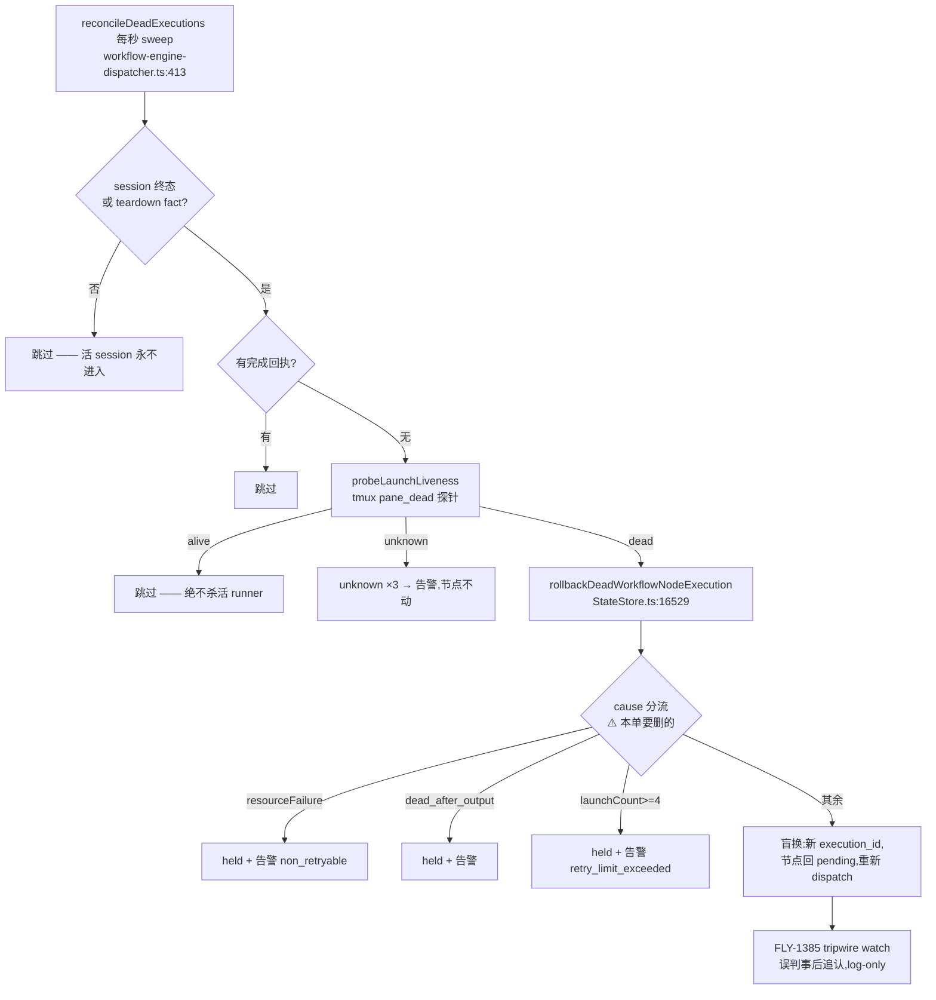

# FLY-1415 dead-exec 处理去判断化(Option 1 盲换)— 探索

Issue: FLY-1415 (https://linear.app/geoforge3d/issue/FLY-1415/engine韧性重构-dead-exec-处理去判断化-option-1bridge-只机械换人盲换3-耗尽升级所属-lead删死因分流)
日期: 2026-07-21
基于: 无

## 1. 问题与 founder 裁定

Annie 定的核心原则:**Bridge 不是 LLM,不该做判断。** Bridge 只做机械的「巡逻 + 检测死亡 + 换人」;「为什么死、该怎么办」的判断全留给 Lead(LLM)。

选定 **Option 1**:只要判死 → 盲换,不问原因,最多换 3 次;3 次换完还死 → run 置 held + 告警升级到**该 issue 所属的 Lead**。理由:偶发抖动自愈不打扰 Lead;升级时信号强(「盲换 3 次全死」≈ 系统性问题)。

硬不变量(防 founder 亲提的误判死循环):
- 「死」只用 pane_dead(进程真退出)信号;idle/输出停顿绝不进死亡路径。
- Bridge 绝不自动杀活着的 runner。
- 「卡住还是只是慢」的判断只在 Lead。

## 2. 现状代码审计(已读死码核实)

### 2.1 机械骨架已在 —— 本单主要是删/调/磨

死亡检测 + 换人 + 耗尽升级的完整闭环已由 FLY-1385 建成:

### 2.2 误判防线现状 —— 已满足硬不变量,无需新建

进入 rollback 前有**双守卫**,两道都是机械信号:

1. **守卫一(dispatcher:435-446 + StateStore:16650-16660)**:session 状态必须是不可逆终态(`isStateStoreIrreversibleTerminalForZombie`)或存在 teardown fact。「慢但活着」的长任务 session 状态是 working/awaiting_* → 在探针之前就被跳过。
2. **守卫二(dispatcher:497-509)**:`probeGeneralizedLaunchLiveness` → `tmux list-panes -F '#{pane_dead}'`(tmux-lookup.ts:355-400)。任一 pane 活(`pane_dead=0`)→ `alive` → 跳过;全 pane 死 → `dead_pin`;tmux **证明**窗口/会话消失 → `absent`;其余一律 `unknown`(不动节点,×3 才告警)。

idle/输出停顿**没有任何路径**进入这条链(那是 RunnerIdleWatchdog 的事,只升级不杀)。结论:硬不变量 1-3 现状已成立,本单的责任是**守住**(守卫测试 + 突变测试),不是新建。

### 2.3 要删的三个 cause-branch(核心工作)

| 分支 | 位置 | 现行为 | 删后 |
|---|---|---|---|
| `resourceFailure`(配额/auth 死)| dispatcher:472-474 正则判 `session.last_error`;StateStore:16661-16683 `retryDisposition:"hold"` → run held + 告警 | 配额死 0 次换、立刻 held | 同普通死:盲换,耗尽才 held |
| `approvedDesignFallback`(Fable 不可用 → 换 GPT-5.6)| dispatcher:476-481 判定;dispatcher:816-838 launch 侧读 `retryDisposition:"design_fallback"` 事件换模型;workflow-dispatch-resolution.ts:24-74 | design 节点 Fable 不可用时换供应商重跑 | 删整条链:盲换同模型;连死 3 次 → Lead 判断是否换模型 |
| `dead_after_output`(死但已写 output)| StateStore:16684-16721 → run held + 告警 | 死前已提交 output 的歧义死 → held | 盲换(见 2.5 后果分析) |

### 2.4 上限语义 —— 「4→3」是对现状的误读,数值上「最多换 3 次」已成立

**现状**(StateStore:16729):`launchCount >= 4` 才升级。launchCount 含原始 launch:原始死(count=1)→ 换 #1;再死(2)→ 换 #2;再死(3)→ 换 #3;第 4 个 launch 死(4)→ 升级。**即:原始 1 次 + 盲换 3 次,与 Annie「最多换三次」和验收第 3 条「换 3 次后停手」逐字一致。** FLY-1411 正文(Lead 读码后修正)也是同样核法(「launchCount >= 4,即换够次数还起不来」→「4 次后」)。

Issue 第 2 条「上限 4 → 3」把 dispatcher:486 的 `launches.length < 4`(那是**重试间隔 pacing** 的门,不是上限)读成了「4 次替换」。若真把 4 改 3,会变成只盲换 2 次,违反验收。

**取向**:数值不动(4 launches = 3 盲换),把魔数显式化为 `MAX_BLIND_REPLACEMENTS = 3`,两处(pacing 门 + 升级门)都用它表达,消除歧义。已向 Lead 发非阻塞 ask 确认(id `7d9f5e08`),若裁定「总共 3 launch」再改数。

### 2.5 删 `dead_after_output` 的后果分析(唯一有实质权衡的删除)

output 体系的两个硬约束(StateStore):
- `submitWorkflowNodeOutput`(17018-17030):output 按 (run,node,attempt) **append-only**,同 attempt 重复提交 → `output_already_exists` 拒绝。
- 完成回执(17213-17226):produces-output 节点完成时要求 `workflow_node_output_current.execution_id === 完成者自己`,否则 `missing_output`。

因此「A 写了 output → A 死于完成回执前 → 盲换出 B」时:B 重做工作后**既提交不了 output、也完成不了**。B 迟早退出(死)→ 再换 → 烧满 3 次盲换 → 耗尽升级 Lead。

评估:这仍是 Option 1 的**有界闭环**(≤3 次浪费的 run 后必达 Lead,无死循环、无判断),且触发窗口极窄(output 提交成功与完成上报之间的秒级窗口)。备选方案「引擎见 output 自动补完成回执」是把「死但有输出 ⇒ 输出有效」的判断塞回 Bridge,正是本单要删的东西;「把 output 归属改绑给 B」则破坏 append-only + credential 归属模型。**结论:纯盲换(Option A),并在耗尽告警 metadata 里带机械事实 `outputExistsForAttempt`,供 Lead 判断时一眼看到。**

### 2.6 告警链现状 —— 已到所属 Lead,剩话术

- 收件人解析:plugin.ts:5253 `resolveRunAlertIdentity` → 有 session 时 `resolveLeadForIssue(projects, projectName, labels)`(**非 hardcode**,`leadResolution:"resolved"`),无 session 时 fallback `config.defaultLeadAgentId`。
- 投递:StateStore 告警 outbox → dispatcher `reconcileWorkflowEngineAlerts`(claim-before-send,claims 去重,失败重投)→ `routedAlertSink`(plugin.ts:9203)→ LeadAlertNotifier `resolveLead(payload.leadId, projectName)`(:744)→ 按 lead 配置发 Discord;失败进 alert-queue/dead-letter。链路完整。
- **剩下的(并入的 FLY-1411 scope)**:①话术人话化 —— 现 body `Run <id> node <id> was held after execution <id>. Reason: retry_limit_exceeded. Recover with POST /api/runs/...`(StateStore:16038)夹带 API 细节;改成人话「FLY-XXX 的 X 节点换了 3 次仍起不来,已停手待人工处理」,run/exec/恢复端点移 metadata。②真机端到端验收:告警确实落到所属 Lead 并被转成 founder-facing(后者靠 Lead 转述,验收时确认)。

### 2.7 顺带发现:中途 repeated-dead 告警与 Option 1 的张力

现状(StateStore:16833-16881):第 2、3 次盲换时各发**两条** Discord 告警(`repeated_dead_execution_pattern`,escalation + issue-thread 两个 eventType),话术是「Inspect the liveness classifier and replacement chain」工程师腔。这与 Option 1「盲换自愈不打扰 Lead、耗尽才升级、升级信号要强」直接冲突 —— 3 次全死的场景下 Lead 会先收 4 条告警(2×repeated + 耗尽×1 + issue 侧),耗尽信号被稀释。

**建议**:删这两处 Discord 告警,**保留** `repeated_dead_execution_pattern` 事件行(run event,审计/取证用)。这不属于 issue 四条明列工作,但属于同一裁定的直接推论,在 plan 里作为显式决策项交 design review 裁。

### 2.8 不动的部分(明确边界)

- FLY-1385 tripwire(activity watch,误判事后追认):**log-only 设计原样保留**,盲换后照常建 watch、tripped 照常发 FALSE-POSITIVE 告警。
- probe_unknown ×3 告警:保留(那是 liveness 歧义信号,不是死因判断);话术不在本单打磨范围。
- `/api/runs/:id/hold|terminate` 恢复端点、run-quiescence、holdStrandedGeneralizedExecutions:不动。
- RunnerIdleWatchdog(idle 升级不杀):不动。

## 3. 影响面清单

代码(4 文件):
- `packages/teamlead/src/bridge/workflow-engine-dispatcher.ts` — 删两个正则 + 两个 helper + resourceFailure/approvedDesignFallback 判定 + disposition/reason 三元;pacing 门改用常量;launch 侧 design_fallback 事件扫描(816-838)删除。
- `packages/teamlead/src/StateStore.ts` — rollback 删 hold/dead_after_output 分支与 `retryDisposition` 入参(payload 恒写 `"retry"` 保 schema 兼容);耗尽门改常量;`workflowEngineAlertPayload` 只剩耗尽形态 + 人话化 + metadata 增补;删 design_fallback enqueue 与中途 repeated-dead 告警(建议项)。
- `packages/teamlead/src/workflow-dispatch-resolution.ts` — 删 `approvedDesignFallback` 入参、`APPROVED_FALLBACK_*` 常量、`approved_design_fallback` source。
- `packages/teamlead/src/LeadAlertNotifier.ts` — `AlertMetadata.workflowEngine.disposition` 联合类型删 `design_fallback` 成员(纯类型)。

测试(3 文件已存在,需改写 + 新增守卫):
- `StateStore.fly1385-dead-exec.test.ts`、`workflow-engine-dispatcher.test.ts`、`workflow-dispatch-resolution.test.ts`。
- 新增:同路径断言(配额死/普通死/歧义死走同一盲换路径)、pane_dead 突变测试、idle-不入死亡路径守卫测试、3 次耗尽升级 + 告警人话断言。

事件兼容:`execution_dead_rolled_back` payload 保留 `retryDisposition:"retry"` 字段;历史 `design_fallback` 回执行不再可达(sweep 的 latest-execution 守卫保证),无迁移。

## 4. 验收对照(issue 五条,全部能力级、真机)

1. 误判防护:慢但活(pane_dead=0)→ 永不判死 —— 双守卫真机验证。
2. 盲换自愈:死 1 次干净起 → 换 1 次,无告警,不打扰 Lead(2.7 建议落地后第 1 次换本就无告警,现状即满足)。
3. 耗尽升级:每次 spawn 即死 → 3 次盲换后 held + 人话告警到所属 Lead。
4. 去判断:配额死/普通死/歧义死同路径(代码级:cause 分支归零;测试级:三种 last_error 注入走同一结果)。
5. 无回退:pane_dead 突变测试 + idle 守卫测试。
