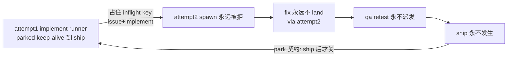

# FLY-1423 qa-fail 踢回锁死 — 探索

Issue: FLY-1423 (https://linear.app/geoforge3d/issue/FLY-1423/enginebug4-qa-fail-踢回锁死-attempt2-admit-幽灵-exec-terminal-complete-硬)
日期: 2026-07-22
基于: 无

## 1. 一句话

DAG 引擎在 QA fail 踢回时给 implement attempt2 记了 admission、却永远 launch 不出真 runner（幽灵 exec），同时真做完修复的 attempt1 runner 重报 complete 被硬 409 拒收——两头都进不来，QA retest 永不派发，FLY-1415 / FLY-1364 双双锁死。

## 2. 实证还原（生产 DB + Bridge log，2026-07-22 当场取证）

以 FLY-1415（run `1ecb3051`）为例，FLY-1364（run `9aff8b01`）机制逐字相同：

### 2.1 事件链（workflow_run_event，全部核过）

| seq | 事件 | 内容 |
|-----|------|------|
| 328 | node_completed | qa attempt1（exec `26f4d9e6`，claude-opus）verdict = **qa_fail** |
| 329 | loop_iteration | iteration 1 / maxIterations 3 |
| 330 | edge_traversed | 边 `qa_retry` → implement **attempt2**，successorExecutionId = `88e29905` |
| 331 | node_dispatched | engine_intent，ordinal 1 |
| 332 | dispatch_vendor_resolved | codex / gpt-5.6-sol / xhigh |
| 333 | **execution_admitted** | **最后一条事件。之后引擎图层再无任何推进。** |

### 2.2 三张表的残留形态（「幽灵」的定义）

* `workflow_run_node` (implement, 2)：state = **`admitted`**，execution_id = `88e29905`。
* `workflow_side_effect_ledger`：该 dispatch 行停在 **`intent_recorded`**（04:04:10 起），永远到不了 `launch_committed`/`started`。
* `workflow_launch_owner`：lease 每小时被引擎反复 re-acquire，状态一直 `pending`。
* `sessions` 表：`88e29905` / `d6273e15` **零行** —— 从没 spawn 过任何 runner。

### 2.3 launch 永远失败的直接原因（Bridge log 铁证）

```
[workflow-engine] workflow engine dispatch held for 88e29905-…: Run already in progress for issue FLY-1415 role implement
```

FLY-1415 撞 **14,034 次**、FLY-1364 撞 **9,188 次**（每秒 reconcile tick 一次，无上限、无告警、无回滚）。

抛错点：`run-dispatcher.ts:1204` —— RunDispatcher 用**内存 inflight map**（key = `issueId + role`）做同 issue 同 role 互斥。attempt1 implement runner（exec `ec9d3286`）虽然 session status 已 `completed`，但按三段 keep-alive 契约 **park 着不退出**（tmux `cmux-FLY-1415-implement-codex-G-…` 实测仍活着），`Blueprint.run()` promise 不 settle，`inflight.delete(key)` 只在 promise `.finally()` 里发生（`run-dispatcher.ts:1586`）→ **inflight 槽位被 superseded husk 永久占用**。

### 2.4 结构性死锁（不是 race，是契约互斥）



两个各自正确的契约撞死：**「phase runner park 到 ship 才关」**（三段 keep-alive，FLY-921/859）× **「每次踢回 = 新 attempt = 新 execution = 新 spawn」**（generalized 引擎，FLY-353/1372）。

### 2.5 另一半：真修复被 409 拒收

attempt1 runner（parked，被 Lead 带动 out-of-band）实际把修复做完了（17 commits、review APPROVED、CI 绿），2026-07-22 06:22 重跑 `complete --route needs_review`：

* `commitEnrolledCompletion`（StateStore.ts:17763）：exec `ec9d3286` 绑定在 (run, implement, **attempt 1**)；attempt1 已有 03:34 的 completion receipt；重报 payload（17 commits）digest 不同 → **`completion_conflict`** → HTTP 409（event-route.ts:686）。
* CLI 连撞 4 次 → marker 进 quarantine（`~/.flywheel/state/complete-failed-quarantine/ec9d3286….json` 实存，`attempts: 4, error: "Bridge returned 409"`）。
* 引擎从两个方向都收不到「fix 干完」→ 锁死成立。

### 2.6 为什么现有一切兜底都看不见它

* **dead-exec sweep（FLY-1385/1415）**只扫 `node.state === "running"` 的节点（workflow-engine-dispatcher.ts:444）——attempt2 停在 `admitted`，**不在扫描面内**。
* `rollbackDeadWorkflowNodeExecution` 也要求 `node.state === "running"`（StateStore.ts:17243）——admitted 幽灵**无法被回滚**。
* dispatch-hold 循环每秒重试但**零告警**（只有 probe_unknown 3 连才告警，"Run already in progress" 这类 start 抛错只写 log）。
* session/终端层看门狗盯的是活 pane，不盯「从没出生的 exec」。

## 3. 关键机制事实（决定设计空间）

1. **worktree 是 per-issue 共享的**：design / implement / qa 三个 runner 的 `worktree_path` 都是 `~/Dev/flywheel-FLY-1415`（sessions 表实测）。attempt2 不需要 attempt1 释放 worktree —— **唯一的物理阻塞就是 inflight map**。写权仲裁靠 TURN belt（FLY-921），多 runner 共存一个 worktree 是今天的常态（qa 活跃时 design+implement 都 park 在同一路径）。
2. **inflight 是纯内存态**：Bridge 重启即清空。但 parked husk 的 tmux 还在、per-issue 内存足迹还在，靠重启「解锁」既不可靠也不是设计。
3. **踢回后的 fix 上下文已经设计好了**：consume() 会给 attempt2 spawn 带 `phaseFixContext = { round, qaSummary }`（workflow-engine-dispatcher.ts:879-889）——设计意图明确是**新 spawn 一个 fixer**，只是从来没成功过。
4. **admission 是不可回滚的先行写**：`admitGeneralizedWorkflowExecution` 在 `startDispatcher.start()` **之前**执行（consume() 内序），写 binding + runtime + node state=admitted 三张表；launch 失败时这些写**全部留下**。
5. **complete 已有的幂等面**：同 digest 重放 → `idempotentReplay` 200（存在）；无 receipt 且节点被 supersede → `stale_execution_superseded` 200-settled（存在）。**缺的**是「有 receipt + 内容不同 + 节点已被踢回」这一格——今天它落进 `completion_conflict` 硬 409。

## 4. 设计方向（brainstorm 结论）

### 修一（主修）：踢回 staffing 正确性 —— evict-then-spawn

qa_fail 踢回时，attempt1 的 implement runner 已经是 **superseded husk**（session terminal + receipt 在案 + 只剩 keep-alive 占位）。引擎在 dispatch attempt2 前加一步 **predecessor-husk reconcile**：

* 判定条件（全部满足才动手，fail-closed）：inflight 持有者 exec 属于**同 run 同 node 更低 attempt** + 其 session status 为 terminal（completed）+ 该 attempt 有 completion receipt → 它是 husk，不是活工人。
* 动作：走**现有** closeout/close-runner 机制优雅关闭 husk（幂等、async）→ promise settle → inflight 释放 → 下一 tick 正常 fresh spawn attempt2（带 phaseFixContext）。
* 不满足判定 → 绝不杀，走告警升级（见修三）。
* keep-alive 语义交接：attempt2 接任 implement 阶段的 context holder；design runner（不同 role key）不受影响。

**否决的替代方案**：
* **Wake-rebind（唤醒 attempt1 husk 并改挂 attempt2 exec id）**：保暖上下文最优，但要求活 runner 中途切换 execution 身份（credentials、hooks env、watchdog、cmux 命名、comm.db 身份全部跟着换），全新机制、风险面大；而 fresh spawn 的上下文损失已被 phaseFixContext + 分支上的 plan/progress 文档兜住（本来就是 restart-resilience 的设计路径）。留作未来优化。
* **放宽 inflight 互斥（同 role 并存）**：husk 与 attempt2 并存会撞 tmux/cmux 命名、翻倍内存足迹（FLY-751 教训），且互斥是防双写的第一道闸，不动。

### 修二：terminal complete 幂等兜底（defense-in-depth）

`commitEnrolledCompletion` 补齐语义矩阵的缺格：

| 场景 | 现状 | 目标 |
|------|------|------|
| 同 digest 重放（含 Bridge 重启 marker 补投） | 200 idempotent | 保持，补 terminal-status 显式测试 |
| 无 receipt + 节点被 supersede | 200 settled | 保持 |
| **有 receipt + digest 不同 + 同 node 存在更新 attempt（踢回场景）** | **硬 409 → 4 连撞 → quarantine** | **200 + `stale_resubmission_escalated`：不推进 DAG（单写入者，呼应 bug5/FLY-1427）、完整证据入 engine event + Lead 告警、CLI 不再空转 quarantine** |
| 有 receipt + digest 不同 + 无更新 attempt（真双写冲突） | 硬 409 | 保持拒绝 |

CLI 侧小修：`complete` 对确定性 4xx（409）不再盲重试 4 次——重试留给 5xx/网络错。

### 修三：admission 不落幽灵（宣告+落地+兜底，与 bug1/bug2 同族基建）

* **unlaunched-admission 绊线**：引擎 reconcile 增加一条扫描——`intent_recorded` 超时（如 10 分钟）且 node 停在 `admitted` 且 sessions 零行 → 经现有 workflow alert outbox 告警所属 Lead（escalationUid 去重，报一次）。这是 FLY-1425「引擎图层看门狗」的同族条目，基建共享（alert outbox + engine events），本单独立交付踢回环这一条。
* **admission 回滚通道**：新增 `rollbackUnlaunchedWorkflowAdmission`（镜像 `rollbackDeadWorkflowNodeExecution` 但作用于 `admitted` 态）：清 binding/runtime、side-effect 行 → `abandoned`、node 回滚，留审计事件。供绊线在「原因不可自愈」时执行 + 供 Lead 手动杠杆（呼应 FLY-1416 的无杠杆之痛）。
* dispatch-hold 同 reason 连续 N 次 → 同一告警通道升级（当前 14k 次零告警不可再现）。

## 5. 验收面（与 issue 验收逐条对齐）

1. 隔离房真机 E2E 复现 1415 场景：engine-owned run → implement attempt1 完成 → husk park 住 → 注入 qa-fail → 引擎判定 husk 并 evict（tmux 实测关闭、inflight 释放）→ attempt2 **真 launch（sessions 有行）** → fix 完成 → complete 通过（含重放幂等）→ **qa attempt2（retest）自动派发**。
2. 修二矩阵四格逐格单测 + 集成测（含 marker reconciler 重启补投路径不 quarantine）。
3. 绊线：构造 admitted 幽灵 → 超时告警一次（去重）→ 回滚通道可清干净。
4. 反向兼容：非踢回流（首次 dispatch、design/qa/review 节点、非 engine-owned run）字节不变。
5. 存量 1415/1364 解锁不等本单（Lead 手动收尾），本单治机制。

## 6. 开放问题（research 阶段要钉死的）

1. evict 走哪个现有 closeout 入口最干净（lifecycle-closeout 的哪个 seam / close-tmux route / cmux-sync 联动），以及「关 husk」与 FLY-1427（终态覆盖保护）的写路径交集。
2. Bridge 重启后 inflight 清空、husk tmux 仍活时，attempt2 spawn 是否会以其它方式失败（orphan адoption / FLY-99 pre-create cleanup 的行为）——绊线是否足以兜住该分支。
3. `stale_resubmission_escalated` 的告警载荷放什么（digest 对比、commit 证据）能让 Lead 一眼决策。
4. maxIterations（3）耗尽路径与本修的交互（耗尽 → held + 告警,已有,确认不回归）。
