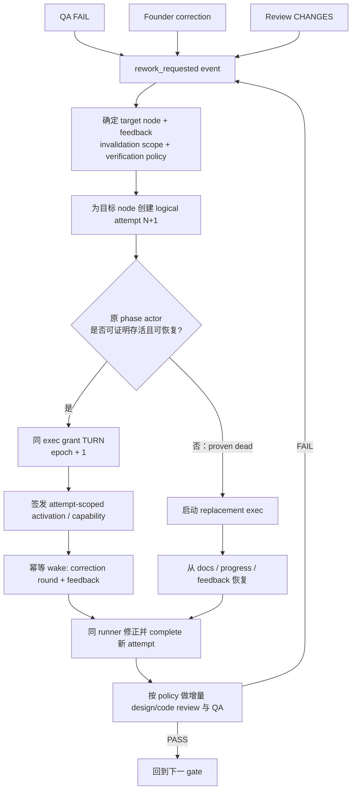

# FLY-1423 QA 踢回循环模型 — 调研
Issue: FLY-1423 (https://linear.app/geoforge3d/issue/FLY-1423/enginebug4-qa-fail-踢回锁死-attempt2-admit-幽灵-exec-terminal-complete-硬)
日期: 2026-07-22
基于: exploration.md

## 0. 执行结论

本轮研究改变了 FLY-1423 原计划的主路径。

**推荐终态是：C 作为正常路径，A 作为确认死亡后的恢复路径，B 淘汰。**

- **C — 同 runner、同 exec，续跑新的逻辑 attempt**：QA fail 后，DAG 仍然创建 `implement attempt 2` 这个新的逻辑事实；但只要原 implement phase actor 仍然存活，就给同一 `execution_id` 发新的 TURN epoch 和 attempt-scoped 权限，再唤醒它修复。它保留对话上下文，不“换工牌”。
- **A — 新 exec 接管**：只有原 actor 已被可靠证明死亡、不可达或状态损坏时，才创建替代 exec，从分支文档、progress 和 QA 报告恢复。这条路已被 FLY-1415 实证可行，但不应是正常返工路径。
- **B — 活进程改绑新 exec**：不采用。它同时承担“旧进程”和“新身份”，会让环境变量、CommDB、凭证、watchdog、审计和 TURN holder 出现分裂，是三者中双写风险最高、收益最少的方案。

在 A/B/C 之上还有一个更高层结论：**Flywheel 不应把 issue runtime 继续限制成 single-pass DAG scheduler；正确形式是“DAG 作为依赖模板 + 可重入的 durable workflow state machine”。** QA fail 和 founder correction 都是 `rework_requested` 事件：指定目标 node、反馈、影响范围和复验策略，然后追加新的 node attempt。静态图没有真的画出回边；展开后的 execution history 仍然有向无环。

Session 生命周期也应据此改口径：**phase work complete 不等于 phase actor terminal。** issue 仍在 QA / founder review / landing 的 correction horizon 内时，actor 应进入 parked/hibernated、可唤醒状态；只有 issue ship、取消、founder close，或容量策略选择可恢复的物理 eviction 时才下线。逻辑 actor 保持 open，不要求 OS 进程永不退出。

这不是把 DAG 改成“worker 私有状态决定流程”。恰恰相反，终态要把四层身份拆开：

1. **逻辑工作**：`(run_id, node_id, attempt)`，attempt2 是新的、不可覆盖的事实；
2. **常驻 phase actor**：稳定的 `actor_execution_id`，可服务多个逻辑 attempt；
3. **一次激活权**：`(actor_execution_id, attempt, turn_epoch)`，append-only、可审计、只能有一个 active lease；
4. **本地进程**：可死亡、可重建，不是真相源。

因此，FLY-1423 当前 PR #674 的 `evict → fresh exec` **不应以正常路径形态 ship**。其中“launch 成功后才承认 admission”“ghost launch fencing”“同内容 completion 幂等、真冲突仍 409”等基建仍有价值；但 QA kickback 的正常调度必须改为同 exec 唤醒，A 降级为 failover。拍板前，本研究不修改代码。

## 1. 最高层选择：不是放弃 DAG，而是把 DAG 放回正确层级

### 1.1 Annie 的两个根本问题

**问题一：Session 做完之后，是不是应该下线？**

答案是：**节点工作完成后应该释放写权并 park，但不应立刻把 phase actor 标成不可复活的 terminal。** 原因不是迷信进程内存，而是当前产品明确存在一个 correction horizon：QA、founder、review 都可能在下游完成后要求上游返工。FLY-1425 和本研究圈当天已两次用 Lead 人肉协议实现“转 TURN + 原 runner 修正 + 增量 review”，说明这不是纯理论边界。

需要区分三件事：

| 层 | 节点工作完成后 | 何时真正结束 |
|---|---|---|
| 写权限 / TURN | 立即释放，避免双写 | 下次合法 activation 再授予 |
| 逻辑 phase actor | parked / hibernated，可接 correction | issue ship、取消或 founder close |
| OS 进程 | 热保留优先；容量压力时允许 eviction | eviction 后由 durable state 恢复，不改变 actor/attempt 历史 |

Temporal 的 Workflow cache / Sticky Execution 正好给出类比：同一 worker 的内存缓存能避免全量 history replay，但缓存可以被驱逐，Workflow Execution 仍靠 durable history 恢复。Flywheel 也应把“保活”视作有价值的热缓存与身份连续性，而不是正确性的唯一来源。

**问题二：1、2、3 都完成后发现 2 错了，DAG 应不应该支持回去重做 2？**

答案是：**产品必须支持，但不能把它实现成静态 DAG 上的 3 → 2 回边。** 一旦静态图出现回边，它就不再是 DAG。正确做法是 outer workflow state machine 收到 correction event 后，追加新的尝试并重新验证受影响的下游：

```text
静态依赖模板：  design  →  implement  →  QA  →  founder_gate

展开后的历史：  design#1 → implement#1 → QA#1 → founder_correction
                                              ↓
                 design#2 → design_review#2 → implement#2? → QA#2? → founder_gate#2
```

这里每个 event/attempt 都只向前追加，execution history 仍是 DAG；“回去”是业务语义上的 re-entry，不是数据库记录倒流或状态覆盖。

### 1.2 三种形式的裁定

| 形式 | 能否表达任意节点 correction | 上下文连续性 | 审计 / 恢复 | 裁定 |
|---|---|---|---|---|
| 纯 DAG + task retry | 适合失败重试；已成功节点返工通常靠 clear/rerun 等运维命令 | worker 通常重建 | 历史清楚，但 correction 语义弱 | 保留为依赖与单轮调度层 |
| 可重入状态机 | correction 是显式 transition；可追加 node attempt 并失效下游 | 可选择原 actor 或 replacement | 最适合权限、回合、复验策略 | **作为 Flywheel runtime 主模型** |
| Temporal 式长活 workflow | 外部 Signal/Update 驱动长期逻辑实体；闭合后用 reset / with-start / 新 run | durable actor；worker cache 可粘滞也可驱逐 | 最强，但不要求我们直接引入 Temporal | **设计参照；由现有 engine 实现其语义** |

因此不是“DAG 不合理”，而是**把 DAG 当整个 runtime 不够**。Flywheel 应保留 DAG 定义节点依赖、并行性和 artifact contract；在外面加 issue-scoped、event-sourced、可重入的 workflow state machine，管理 correction、attempt、TURN 和 actor lifecycle。

### 1.3 first-class `founder_correction` 是否值得建？

**值得。** 人肉协议可以作为紧急操作和原型，但不应成为长期唯一通路。它缺少 durable trigger、重复消息幂等、目标节点授权、下游失效计算、自动增量 review 和 daemon restart 恢复；这些正是 FLY-1423 同族 bug 的来源。

不过不建议在静态图里新增一条字面上的 `founder_gate → design` 回边。建议统一成 first-class 事件：

```text
rework_requested {
  trigger: qa_fail | founder_correction | review_change,
  target_node,
  feedback,
  base_revision,
  invalidation_scope,
  verification_policy,
  requested_by,
  idempotency_key
}
```

统一机制负责：append 新 attempt → 选择健康原 actor 或 failover → grant TURN/epoch → 带反馈 wake → 记录 output → 按影响范围做增量 review / QA → 回到下一 gate。

两种触发源只在策略上不同：

| 触发 | 默认目标 | 下游处理 | 权限 |
|---|---|---|---|
| QA fail | implement | 固定重跑 QA retest | QA verdict + engine policy |
| founder correction | founder 指定 design / implement / QA | 先生成 impact plan；只重跑受影响 review/phase，但最终回 founder gate | founder / Lead 受监督指令 |

如果 founder 改 design，engine 不能武断地自动认为 implement/QA 全部作废或全部有效。应先产出一个可审计的 `invalidation_scope`：哪些 artifact 被替代、哪些下游结果要重做、哪些只需增量 review。这是 first-class 机制比“clear 某任务”更适合 LLM 软件工程流程的地方。

## 2. 先分清三个概念

成熟引擎里经常混用 “retry”，但 FLY-1423 的 QA fail 不是普通的瞬时失败。

| 概念 | 触发原因 | 逻辑身份 | 常见做法 |
|---|---|---|---|
| transient retry | 网络抖动、限流、临时服务错误 | 同一逻辑 task 的新执行尝试 | 退避、计数、换 worker 重跑 |
| semantic rework | QA 发现实现不符合验收，需要修改产物 | 新的业务回合 / 新逻辑 attempt | 显式状态机环、递归/循环、外层编排 |
| actor wake | 某个长期逻辑实体收到新消息继续处理 | actor 身份稳定，消息/epoch 递增 | durable state + message/lease；进程可换 |

FLY-1423 同时需要后两者：**DAG 账本上是 semantic rework，phase runner 生命周期上是 actor wake。** 把它只当 transient retry，会丢失 QA 回合的业务语义；把 actor 本地内存当唯一真相，则会破坏可恢复性。

## 3. 六个成熟引擎怎么做

### 3.1 对比总表

| 引擎 | retry / rework 的建模 | attempt 怎么记 | worker 会为返工保活吗 | 对 Flywheel 的启示 |
|---|---|---|---|---|
| Apache Airflow | TaskInstance retry；clear 后重跑；DAG 本身无环 | 同 TaskInstance 的 `try_number` 和历史 | 不会。task 被定义为 stateless、idempotent，状态应外置 | attempt 属于逻辑 task，不属于 worker；语义返工应在更高层显式表达 |
| Temporal | Activity retry 产生新的 Activity Task；Workflow 可在代码中做部分重试/消息循环 | Activity/Workflow attempt 与 event history | **worker 不保活**；Workflow Execution 是 durable stateful actor，可被任意 worker replay | 最接近 C，但保留的是 durable Workflow identity，不是某台 worker；Flywheel 需要把会话 actor 和进程分层 |
| Dagster | 同一 job run 内 op retry；复杂返工由 job/asset orchestration 表达 | op retry count / run event | 不会；step 常在独立进程、pod 或 task 执行 | 逻辑 attempt 和执行进程解耦 |
| Argo Workflows | `retryStrategy` 新建尝试；`withItems/withSequence`、递归模板显式成环 | retry limit / attempt；每次模板实例有节点/pod | 不会；每轮通常是新 pod | 语义 loop 必须显式，不能靠一个 pod 暗自续跑 |
| GitHub Actions | rerun workflow/job；同一 run id 下 attempt 增加 | `GITHUB_RUN_ID` 不变，`GITHUB_RUN_ATTEMPT` 增加 | 不会；GitHub-hosted runner 每个 job 是新 VM | “稳定逻辑 run + 新 attempt”是主流；runner 身份不参与正确性 |
| AWS Step Functions | `Retry` 处理状态失败；Choice + counter 表达业务环 | retrier attempt / state data counter；redrive 可重置 retry count | 不会；Activity worker 领取 task token，超时后 token 失效，其他 worker 可接 | rework 是显式状态机事实；执行权由短期 token/lease 约束 |

### 3.2 Apache Airflow

Airflow 的 TaskInstance 有 `up_for_retry` 等状态；同一 task 重试会增加 `try_number`。用户清理 task 后，也是在同一 TaskInstance 语义下创建新的尝试并保留尝试历史。Airflow 官方同时明确要求 task 尽量 stateless、idempotent，并把需要跨 retry 的状态放到外部系统。

所以 Airflow 的答案是：**同逻辑 task，新调度尝试；worker 不保活。** 由于 DAG 定义是有向无环图，跨 phase 的语义返工通常要由外层 DAG run、显式控制节点或重新触发来表达。

### 3.3 Temporal

Temporal 区分 Activity 与 Workflow：Activity retry 会把新的 Activity Task 放回 Task Queue，可能由另一 worker 执行；Workflow Execution 则是 durable、stateful 的逻辑实体，可以通过 event history replay，在原 worker 被驱逐后由同一或另一 worker 恢复。Signals/Updates 可以给运行中的 Workflow 发消息，形成长期交互。

Temporal 是对我们最有价值的参照，但也给出一条边界：**长期 actor 是 Workflow Execution，不是某个 OS 进程。** Temporal worker 官方定位仍是 stateless。Flywheel 的 resident LLM runner 比 Temporal worker 多保存了一层昂贵的对话状态，因此保活有性能与质量价值；但 durable docs、progress、attempt receipts 仍必须保证它死后可重建。

### 3.4 Dagster

Dagster 的 RetryPolicy / RetryRequested 对同一 op 做有限重试，事件日志记录 retry；执行器可让每个 step 运行在独立进程，也可使用临时 pod/task。复杂的返工关系在 job、asset 或外层 run 中表达。

它延续同一原则：**attempt 是 op/run 的属性，进程只是一次承载。**

### 3.5 Argo Workflows

Argo 的 `retryStrategy` 为模板节点创建新的 retry attempt；`limit` 不含首次执行，因此总尝试数是 `limit + 1`。对于真正的业务循环，Argo 用 `withSequence`、`withItems`、`withParam` 或递归模板显式生成多次节点实例。官方递归示例也会在每轮产生不同 pod。

它说明 QA 返工不能被藏在“重试同一容器”里：**循环回合必须进入 workflow history；pod 可以更换。**

### 3.6 GitHub Actions

GitHub Actions rerun 时保持 `GITHUB_RUN_ID`，增加 `GITHUB_RUN_ATTEMPT`，并让用户查看之前的 attempt。GitHub-hosted runner 对每个 job 提供新的 VM，不保留 worker。本质上是稳定的逻辑 run 身份加递增 attempt。

但“QA 发现代码问题 → agent 修改代码 → 再跑 QA”不是 Actions job 内置的 retry，而是 workflow 之外的开发循环：新 commit、新 workflow run，或另一个显式编排层。

### 3.7 AWS Step Functions

Step Functions 的 `Retry` 适合 Task/Map/Parallel 的技术失败；需要业务返工时，通常用 Choice 状态和 state data counter 形成显式循环。Activity worker 领取带唯一 task token 的任务；token 超时后失效，其他 worker 可以领取后续工作。

这与 TURN belt 很接近：**状态机记录回合，短期 token/lease 决定当前谁能写，worker 本身不拥有流程。**

### 3.8 已完成节点的 post-completion 修订

| 引擎 | 已完成后怎么修订 | 是否保留同 worker |
|---|---|---|
| Airflow | clear 已成功 TaskInstance，可选择 upstream/downstream/recursive，再由 executor 重跑；历史/log 保留，部分关联对象不保留 | 否 |
| Temporal | open Workflow 用 Signal/Update；closed execution 不能继续 progress，可 reset 到 event history 某点，或 Signal/Update-With-Start 创建/连接 workflow chain | 不保证。Sticky cache 优先同 worker，eviction 后 replay |
| Dagster | UI 可基于原 run re-execute；job 的 op selection 能选择目标 op、祖先或后代，形成新执行 | 否，step 默认独立进程 |
| Argo | `argo retry --restart-successful --node-field-selector` 可在成功 workflow 中重启指定成功节点；同 Workflow object，节点/pod 重建 | 否 |
| GitHub Actions | 最初 run 后 30 天内可 rerun 全部或指定 job；即使没有失败也可 rerun all；同 SHA/ref、RUN_ATTEMPT 增加 | 否，hosted runner 是 fresh VM |
| Step Functions | redrive 只支持未成功 execution；`SUCCEEDED` 不能 redrive，业务修订需新 execution 或定义内显式 loop | 否 |

成熟引擎并不认为“成功后永远不可重做”。Airflow clear、Dagster subset、Argo restart-successful、GitHub rerun 都提供某种 correction 手段；差别在于它们通常是 operator action，并且默认把 worker 当可替换资源。Temporal 进一步把“open logical workflow 接外部消息”和“closed execution 另开/reset”显式区分。

Flywheel 不应照搬任一命令的表面：我们需要把这些 operator action 提升为 durable product event，因为 founder correction 是业务流程的一部分，不是偶发运维修复。

### 3.9 教科书共识与我们不能照搬的部分

六个引擎的共同点很强：

- retry/rework 必须在 durable history 中有 attempt、event 或 state transition；
- worker 不是真相源，通常不会为返工保活；
- 同一逻辑 run 可以跨多个 attempt；
- 执行权由 task token、lease、claim 或一次调度约束；
- 幂等与冲突判断应按逻辑 task/attempt，而不是只看进程是否曾经 complete。

但 Flywheel 有一个真实差异：我们的 worker 不是普通的无状态函数，而是**带对话上下文、已读仓库、已做取舍、已和 Lead 交互过的 LLM phase actor**。丢弃它不只损失 RAM；会重新消费 token、时间，并增加“对已有设计理解偏移”的概率。这个差异值得特殊形态，但特殊形态应是“稳定 actor + durable attempt + epoch lease”，而不是让内存状态凌驾于 DAG。

## 4. FLY-1415：冷启动成本的现成数据点

FLY-1415 同时发生过两条路径，提供了难得的观察样本：

- 原 implement runner `ec9d3286…` 带着完整上下文被 Lead 手动唤醒，完成针对性 QA fix；
- fresh attempt2 runner `88e29905…` 后来真正启动，采用已有分支、rebase、复核并完成同一工作流。

### 4.1 时间与 token 观测

| 指标 | 原 runner 唤醒 | fresh attempt2 | fresh / wake |
|---|---:|---:|---:|
| 从 wake/start 到最终代码 commit | 约 5 分 27 秒 | 约 25 分 05 秒 | 约 4.6× |
| 新增 uncached input | 约 226,715 tokens | 约 482,562 tokens | 约 2.1× |
| 新增 output | 约 7,499 tokens | 约 37,975 tokens | 约 5.1× |
| 从 fresh start 到 workflow handoff | — | 约 32 分 58 秒 | — |
| branch process docs 冷读规模 | 已在原上下文中 | 39,398 bytes / 约 3,028 个空白分词 | — |

fresh attempt2 到 workflow completion 的累计 telemetry 是 21,614,441 input，其中 21,056,768 cached，约 557,673 uncached，output 49,549；表中为了比较“到最终代码 commit”，使用更接近实现完成点的 482,562 uncached / 37,975 output。

### 4.2 两个必须同时承认的事实

第一，**保活不等于零 token**。原 runner 闲置约 2.5 小时后，provider cache 已部分过期；第一次 wake 本身出现约 189k uncached input。保留本地进程不能保证模型侧 prompt cache 永远有效。

第二，**fresh runner 不是失败方案**。它成功采用分支、rebase、通过 review 和 CI，并触发 QA retest；这证明 durable docs/progress 能支撑恢复。因此 A 是可信 failover。

### 4.3 研究限制

这是生产观察，不是随机对照实验：fresh runner 还承担了 adopt、rebase、重新检查和交接；原 runner 做的是更聚焦的 QA fix。不能把所有差异都归因于上下文重建。但 4.6× 时间、2.1× uncached input、5.1× output 的量级，结合 fresh prompt 重新注入完整 runner contract、issue、doc-flow 并重读分支文档，足以否定“冷启动成本可忽略”这一假设。

历史容量研究曾测得旧 Claude+MCP 组合约 1.3–1.4 GB/runner，优化目标约 0.36–0.4 GB/runner；数据可能已漂移，不能当作当前容量承诺。重要的是：三阶段 keep-alive 已经是 FLY-887 的产品契约，C 不新增第四个进程，只复用已预算的 implement actor。它的主要风险是生命周期与双写，而非额外常驻内存。

## 5. 三个候选终态

### 5.1 总体评分

评分：5 最好，1 最差。

| 维度 | A：evict + 新 attempt / 新 exec | B：wake-rebind 到新 exec | C：同 runner / 同 exec + 新逻辑 attempt |
|---|---:|---:|---:|
| 与当前 immutable binding 一致 | **5** | 1 | 2（需拆分 actor 与 attempt binding） |
| 与 resident phase 产品契约一致 | 2 | 3 | **5** |
| 双写可控性 | 4（须先证明旧 actor 死亡） | 1 | **5**（TURN epoch + attempt lease） |
| token / 时间成本 | 2 | 4 | **5** |
| 机制复杂度 | 4（当前已有） | 1 | 3（但已有 PhaseOrchestrator 先例） |
| TURN belt 兼容性 | 4 | 2 | **5** |
| crash 后恢复能力 | **5** | 2 | 5（C 正常路径 + A failover） |
| 审计清晰度 | 5 | 1 | **5**（前提是 activation append-only） |
| 推荐角色 | **故障兜底** | **淘汰** | **正常路径** |

### 5.2 A — evict then spawn

优点：

- 最贴近当前 `workflow_execution_binding(execution_id → run/node/attempt)` 的 immutable schema；
- 新 exec 的凭证、CommDB session、watchdog 和审计身份天然一致；
- old actor 被确认死亡后，这是最清楚的恢复方案；
- FLY-1415 已实证 adopt + rebase + complete + QA retest 可行。

缺点：

- 正常 QA 返工也要付出冷启动 token/时间；
- launch 形成新的失败窗口，FLY-1415/1364 的 ghost admission 正发生在这里；
- 与 founder 和 FLY-887 已确认的“三 phase 不下线、QA fail 唤醒原 implement”语义相反；
- 主动 evict 一个健康、掌握上下文的 actor，是把可恢复性机制误当正常调度机制。

裁定：**保留为 proven-dead failover，不作为正常路径。**

### 5.3 B — wake-rebind，同进程换 exec 身份

表面收益是既保留上下文，又让每个 attempt 有新 exec。但 exec 身份已进入：启动环境变量、CommDB sessions、submission credentials、workflow binding、watchdog、lead instruction routing、completion ownership 和 TURN holder。活进程中途改绑意味着所有表面必须原子切换；任何遗漏都会出现“进程说自己是新 exec、数据库仍认为它是旧 exec”的双身份。

它还引入最危险的时序：旧身份可能仍可提交，新的身份已经被 admission；wake 重放可能重复切换；daemon restart 后到底恢复哪个身份不清楚。

裁定：**淘汰。** 它没有 C 的稳定身份，也没有 A 的隔离清晰度。

### 5.4 C — 同 runner、同 exec，续跑 attempt2

C 不是“attempt2 不存在”。DAG 仍创建新的 implement attempt2、QA round2 和独立 output receipt；变化只是**同一个 stable phase actor 可以被多次激活**。

本仓库已有两个直接先例：

- FLY-752 的 QA retest 明确复用同一 QA runner，exec-id 不变；
- FLY-887 的 `PhaseOrchestrator` 已实现 QA fail 后 `grantTurn` 给原 implement `execution_id`，随后 wake fix；只有 actor 证明死亡才 spawn 新 implement。测试也写明是 “new logical round on SAME execution”。

因此 C 不是引入陌生 actor 模型，而是让 generalized WorkflowEngineDispatcher 对齐已经存在的三阶段语义。

代价是当前 binding schema 把 exec 和单个 attempt 一对一绑死，不能直接覆盖或 update。正确做法不是解除 immutable 保护，更不是复用同一行，而是引入一层 append-only activation：

```text
workflow node attempt                  resident phase actor
(run, implement, attempt=2)   --->     actor_execution_id = impl-1
           |                              |
           +-- output/complete receipt    +-- process/session identity
           +-- attempt-scoped capability  +-- durable phase ownership
                         \               /
                          activation lease
                     (attempt=2, turn_epoch=4)
```

裁定：**正常路径。**

## 6. 推荐状态机



核心原则是：**先记 correction event 和 logical attempt，再决定由哪个 actor 承载。** 正常情况下 actor 不变；只有 liveness 证据明确失败才替换。QA fail 与 founder correction 共用这条控制流，不再各自发明人肉协议。

## 7. 一致性与防双写不变量

C 能否成立，取决于以下条件全部落地；不能只“发个 wake”。

1. **attempt append-only**：每次 QA fail 创建新的 `(run,node,attempt)`，不得覆盖 attempt1。
2. **actor identity stable**：同一进程不改 `execution_id`；B 式重绑禁止。
3. **activation append-only**：记录 actor 承载哪个 attempt、哪个 TURN epoch、何时激活/释放；历史不可 update/delete。
4. **single active lease**：同一 run/worktree 同时只能有一个写 actor；TURN grant 必须先于 wake。
5. **epoch fencing**：所有写入都带 TURN epoch；旧 epoch 即使迟到也被拒绝。
6. **attempt-scoped capability**：complete / verdict 权限绑定 `(run,node,attempt,actor,epoch)`，不能因为 exec 曾完成 attempt1 就永远 409，也不能让 attempt1 权限写 attempt2。
7. **completion receipt per attempt**：相同 attempt + 相同 digest 重放返回 200 settled；同 attempt + 不同 digest 仍 409；attempt1 complete 不阻止合法 attempt2 complete。
8. **wake idempotency**：同一个 round/epoch 的重复 phase-wake 只确认已处理，不重复 worktree 或外部副作用。
9. **death proof before replacement**：只有 session/process/heartbeat/TURN ownership 等证据满足“proven dead”规则，才走 A；launch success 后才承认 replacement admission。
10. **durable reconstruction**：C 是优化后的正常路径，不是依赖内存的唯一通路。每轮仍更新 QA report、progress、commit 和 output receipt，确保 A 随时可接管。

## 8. 对当前 FLY-1423 实现的影响

### 8.1 保留的部分

- launch 必须成功后才承认 admission；失败回滚/取消并报 Lead；
- cancellation fence，阻止撤销后迟到 launch 复活；
- admission/launch 长时间无进展的 tripwire；
- terminal completion 的内容一致幂等兜底；
- 真 digest 冲突继续拒绝；
- FLY-1415/1364 全链回归场景。

### 8.2 必须重做的部分

- `qa_retry` 正常路径不再 evict 健康 implement actor；
- dispatcher 先创建 logical attempt，再查询 phase actor liveness；
- 健康 actor 走 grant TURN + append activation + idempotent wake；
- 增加统一 `rework_requested` 事件；QA fail 与 founder correction 都走同一 attempt/actor/activation 基建；
- founder correction 需要 target node、反馈、base revision、下游 invalidation scope 和 verification policy；
- 当前一 exec 一 attempt 的 binding 需要拆出 stable actor / per-attempt activation，而不是修改 immutable 历史；
- completion ownership 从“exec 只能 complete 一次”调整为“exec 可在不同 attempt/epoch 下分别 complete”；
- A 仅在 proven-dead 后启动，不能用“上一 attempt 已 terminal”自动等价为“actor 应被淘汰”。

### 8.3 后续验收矩阵

| 场景 | 预期 |
|---|---|
| QA fail，implement actor 健康 | sessions 不新增 implement exec；同 exec 获得新 epoch；attempt2 activation 有记录；自动 wake |
| wake 重放 | 不重复修复、不重复 complete、不重复派 QA |
| attempt1 迟到 complete | 若内容一致返回 settled；不得覆盖 attempt2；旧 epoch 写入被 fence |
| actor 在 QA fail 前死亡 | A 启动新 exec；launch 成功后才 admit；从 durable docs/progress 恢复 |
| replacement launch 失败 | admission 撤销/取消，Lead 收到可操作告警，不留 ghost exec |
| attempt2 complete 重放 | 相同 digest 200；不同 digest 409 |
| QA 连续 fail 两轮 | 同 actor 可承载 attempt2/3，每轮独立 activation、receipt、epoch |
| founder 在 QA 完成后打回 implement | append implement 新 attempt；原 implement actor 获得新 epoch；增量 code review + QA 后回 founder gate |
| founder 打回 design 且影响实现 | append design 新 attempt；impact plan 标记 implement/QA stale；按 plan 依次产生新 attempt，不覆盖旧输出 |
| founder 打回 design 但只改文案 | impact plan 可保留 implement/QA freshness；只做目标修正与必要增量 review |
| 同一 founder correction 重放 | idempotency key 命中，只确认同一个 rework request，不重复发 TURN/wake |
| Bridge 在 grant 与 wake 之间重启 | 恢复后根据 activation/wake marker 幂等补发，不产生双 actor |
| TURN 被 QA 或别的 phase 持有 | implement wake 前必须完成合法 handoff；无权写 worktree |
| 原 actor 在 wake 后崩溃 | 撤销/过期 activation，再以 A replacement 接管同一 logical attempt |

真机隔离房 E2E 应复现 FLY-1415/1364：QA fail → attempt2 durable → 原 implement 同 exec 唤醒 → fix complete → QA retest 自动派；单独注入 actor death 验证 A；再加入 founder correction 分别打回 design 与 implement，验证 impact plan、增量 review、下游 freshness 和重复事件幂等。

## 9. 为什么这是“正确的 DAG loop”

如果只问教科书，答案会是“worker 无状态、每次新 worker”。但 Flywheel 的产品实体不是普通 task worker，而是一个被明确要求 resident 的 phase actor。正确抽象不是在 A 与 C 之间二选一，而是组合两层：

- **控制面遵循教科书**：所有 attempt、transition、capability、receipt 都 durable、显式、可 replay；
- **执行面利用 LLM 特性**：健康 phase actor 优先续用上下文，死亡时由 durable state 重建。

Temporal 的 Workflow Execution / worker 分离、Step Functions 的 state / task token 分离，以及 GitHub 的 run id / run attempt 分离，都支持这个方向。Flywheel 的特殊之处只是把“可选的热执行载体”做成 resident conversation actor；它不应该改变 durable state machine 的权威性。

因此最终答案是：**QA rework 必须是显式 loop；同 runner 唤醒是这个 loop 的首选执行策略，不是 loop 本身。**

## 10. 官方资料

- Apache Airflow Tasks: https://airflow.apache.org/docs/apache-airflow/stable/core-concepts/tasks.html
- Apache Airflow DAG Runs / rerun history: https://airflow.apache.org/docs/apache-airflow/stable/core-concepts/dag-run.html
- Apache Airflow stateless task guidance: https://airflow.apache.org/docs/apache-airflow/stable/core-concepts/task-and-asset-state-store.html
- Temporal Retry Policies: https://docs.temporal.io/encyclopedia/retry-policies
- Temporal Workflow Execution: https://docs.temporal.io/workflow-execution
- Temporal Workers: https://docs.temporal.io/workers
- Temporal Workflow message passing: https://docs.temporal.io/encyclopedia/workflow-message-passing
- Temporal CLI workflow reset / Signal-With-Start / Update-With-Start: https://docs.temporal.io/cli/command-reference/workflow
- Temporal TypeScript message passing and closed-workflow rules: https://docs.temporal.io/develop/typescript/workflows/message-passing
- Dagster Op retries: https://docs.dagster.io/guides/build/ops/op-retries
- Dagster Run executors: https://docs.dagster.io/guides/operate/run-executors
- Dagster job subset execution: https://docs.dagster.io/guides/build/jobs/job-execution#executing-job-subsets
- Argo retrying failed steps: https://argo-workflows.readthedocs.io/en/latest/walk-through/retrying-failed-or-errored-steps/
- Argo field reference (`retryStrategy`): https://argo-workflows.readthedocs.io/en/latest/fields/
- Argo loops: https://argo-workflows.readthedocs.io/en/latest/walk-through/loops/
- Argo recursion: https://argo-workflows.readthedocs.io/en/latest/walk-through/recursion/
- Argo retry successful selected nodes: https://argo-workflows.readthedocs.io/en/latest/cli/argo_retry/
- GitHub Actions rerun workflows/jobs: https://docs.github.com/en/actions/how-tos/manage-workflow-runs/re-run-workflows-and-jobs?tool=cli
- GitHub Actions variables (`GITHUB_RUN_ATTEMPT`): https://docs.github.com/en/enterprise-cloud@latest/actions/reference/workflows-and-actions/variables
- GitHub Actions workflow syntax: https://docs.github.com/en/actions/reference/workflows-and-actions/workflow-syntax
- GitHub-hosted runners: https://docs.github.com/en/actions/reference/runners/github-hosted-runners
- AWS Step Functions error handling / Retry: https://docs.aws.amazon.com/step-functions/latest/dg/concepts-error-handling.html
- AWS Step Functions iteration pattern: https://docs.aws.amazon.com/step-functions/latest/dg/tutorial-create-iterate-pattern-section.html
- AWS Step Functions Activities / task tokens: https://docs.aws.amazon.com/step-functions/latest/dg/concepts-activities.html
- AWS Step Functions workflow types: https://docs.aws.amazon.com/step-functions/latest/dg/choosing-workflow-type.html
- AWS Step Functions redrive eligibility and history: https://docs.aws.amazon.com/step-functions/latest/dg/redrive-executions.html
