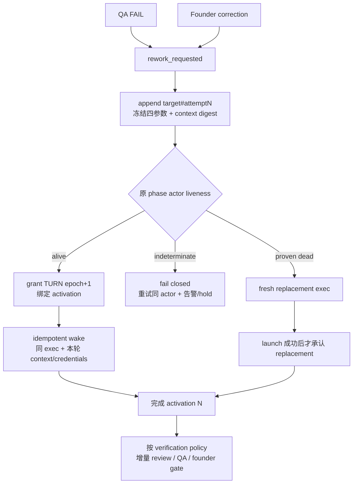

# FLY-1423 qa-fail 踢回锁死 — 实施计划

Issue: FLY-1423 (https://linear.app/geoforge3d/issue/FLY-1423/enginebug4-qa-fail-踢回锁死-attempt2-admit-幽灵-exec-terminal-complete-硬)
日期: 2026-07-22
基于: loop-model-research.md、c-architecture.html

> **For agentic workers:** REQUIRED SUB-SKILL: Use `superpowers:executing-plans` to implement this plan task-by-task. This resident runner must execute inline; do not dispatch successors or subagents. Steps use checkbox (`- [ ]`) syntax for durable tracking.

**Goal:** 把 QA fail 与 founder correction 统一为 `rework_requested`，优先用同一 phase actor / 同一 `execution_id`、新 logical attempt、新 TURN epoch 返工；只有原 actor 被正向证据证明死亡时才 fresh spawn，并让 completion、QA retest、marker 与 tripwire 全链幂等收敛。

**Architecture:** DAG 继续定义默认依赖，运行时改为可重入状态机。`execution_id` 是稳定 actor 身份，`workflow_execution_binding` 从“一 exec 一 attempt”拆成“一 actor 多个 append-only activation”；`workflow_rework_request` 记录 authority / target / invalidation scope / verification policy，`WorkflowReworkCoordinator` 以 durable request 为入口，先 grant 新 TURN epoch，再幂等 wake 原 actor。Fresh exec 仅是 proven-dead fallback，并继续受 launch owner、cancellation fence 与 unlaunched tripwire 保护。

**Tech Stack:** TypeScript、Node.js、SQLite（StateStore + CommDB）、Vitest、Express Bridge、tmux/Codex mailbox、GitHub Actions、529 隔离房真机 E2E。

**Version**: v1.5x（ship 时取空号；不预押版本号）
**Status**: v2 design-review APPROVED（question `31fca8fa-a5f3-4112-9f27-70341299896b`）；取代 v1 的 evict-then-spawn 正常路径。Annie 已于 2026-07-22 对 C 架构拍板 “ok lets do it”。

---

## 0. v2 修订裁决

### 0.1 正常路径与故障路径



必须同时成立：

1. **同 actor、同 exec**：健康 actor 不 close、不 rebind、不新建 session。
2. **新 attempt、新 activation**：每轮 `(run,node,attempt)`、output、credential、completion receipt 独立。
3. **先 TURN 后 wake**：wake 文本只传 context；CommDB 中 holder + epoch 才是共享 worktree 写权限。
4. **old epoch 被 fence**：所有 activation-aware 写入携带 activation id + epoch；旧轮迟到不能覆盖新轮。
5. **proven dead 才换人**：`alive` 与 `indeterminate` 都禁止 spawn；只有正向死亡证据链通过才创建 replacement exec。
6. **node done 不下线**：runner 交 TURN、写 `parked` 声明；issue ship / cancel / founder close 才 finalize 三个 phase actor。

### 0.2 统一打回工单

`workflow_rework_request` 的四个参数是协议，不从提示词猜：

| 参数 | QA fail | Founder correction |
|---|---|---|
| authority | `qa`，由 attempt-scoped QA verdict capability 证明 | `founder`，由 trusted founder source 中不可篡改的原话证明 |
| target | 固定 `implement` | Lead/解释层从自然语言生成 `design` 或 `implement` 路由提示；缺省 `implement` |
| invalidation scope | `implement,qa` | Lead/解释层生成的有序 phase 子集；缺省从 target 到 QA |
| verification policy | `code_review,qa_retest` | Lead/解释层生成 target 增量 review + scope 内下游重验 + `founder_gate` |

约束：

- `qa` 只能 target `implement`，且 scope 必须含 `qa`。
- founder target `implement` 的安全缺省为 `implement,qa`；target `design` 的安全缺省为 `design,implement,qa`。
- founder 可以显式声明 design-only 修订：scope=`design`、policy=`design_review,founder_gate`。实现修订若想跳过 QA 必须另有受监督 policy，本单拒绝这种输入，不做隐式豁免。
- founder 原话 verbatim、authority source digest、base revision 首次写入后冻结；同 source id 不同原话/authority payload 是 poison conflict。
- target/scope/policy 是路由提示，不冒充 founder authority。填错时追加 `workflow_rework_route_revision`，不改原 request；delivery claim 固定 effective revision 后不得原地换 target，必须先取消未 grant 的 delivery 或开新 correction request。
- 单一可信 founder source writer 不变。今天 `lead_ack_rejected` 已实证 Lead 不能冒充 founder 批 gate；本单不新增第二 founder decision endpoint。

### 0.3 PR #674 处置

继续使用 PR #674，不新开 superseding PR、不 force-push：

- 旧 A 方案 commits 保留为审计 provenance。
- v2 commits 明确删除正常路径 eviction，并添加 C 架构。
- 最终 PR diff 只保留可 ship 的 C 终态；不存在开关切回“健康 actor evict”过渡版。

### 0.4 Design-review advisory implementation constraints

设计审查虽已通过，以下 advisory 作为本次实现和验收的硬约束处理：

1. schema rebuild 在单次 StateStore 持久化边界内执行，先保留可恢复备份，再按 FK 依赖顺序重建 child→parent／parent→child copy；任一步失败回滚到原 schema 与原 bytes，成功后执行 `foreign_key_check` 才提交。
2. `getWorkflowExecutionBinding(execId)` 的所有调用点都逐一分类；multi-activation 上不允许任何调用者依赖 SQLite 的未指定首行。需要 actor 级语义的改用 actor API，需要 attempt 级语义的改 exact activation API，确认 legacy 单 activation 的调用也要有显式断言。
3. 加入部署切换测试：迁移前已经完成 node、仍 parked 的 legacy actor 没有 activation handoff row；首次 rework 时系统从 binding/actor/turn 状态安全 materialize 新 activation，再唤醒同 exec，不能要求 drain 所有在途 issue。
4. QA `max_iterations=3` 只统计 QA verdict 驱动的 retry；founder correction 使用独立 correction sequence，不消耗也不受 QA retry cap 限制。两种来源共享 coordinator，不共享限额。
5. CLI completion failure marker 必须保存 `activationId`、`runId`、`nodeId`、`attempt`、`turnEpoch`；reconciler replay 原样恢复 activation context，禁止 multi-activation actor 回放时退化成 exec-only 猜测。

## 1. 数据模型

### 1.1 Stable actor 与 attempt activation

保留 `execution_id` 作为物理/对话 actor 身份；新增稳定 actor 表，并迁移现有 binding 为 composite activation：

```sql
CREATE TABLE workflow_actor (
  execution_id TEXT PRIMARY KEY,
  project_name TEXT NOT NULL,
  issue_id TEXT NOT NULL,
  role TEXT NOT NULL,
  created_at TEXT NOT NULL
);

CREATE TABLE workflow_execution_binding_v2 (
  activation_id TEXT PRIMARY KEY,
  execution_id TEXT NOT NULL,
  run_id TEXT NOT NULL,
  node_id TEXT NOT NULL,
  attempt INTEGER NOT NULL CHECK (attempt > 0),
  mode TEXT NOT NULL CHECK (mode IN ('spawn','wake','replacement')),
  rework_request_id TEXT,
  bound_at TEXT NOT NULL,
  UNIQUE (execution_id, run_id, node_id, attempt),
  FOREIGN KEY (execution_id) REFERENCES workflow_actor(execution_id)
);
```

`workflow_execution_binding_v2` 只是 SQLite rebuild 的临时表名；copy + foreign-key check 成功后删除旧表并 rename 回 `workflow_execution_binding`，所以运行时代码与下游外键只看到一个 canonical 表名。

迁移规则：

- 每个旧 `workflow_execution_binding.execution_id` 回填一行 `workflow_actor`。
- actor 的 project/issue/role 从 binding→run pinned snapshot 推导；sessions 行缺失不能阻断 ghost-history migration。
- 每个旧 binding 回填 activation id `legacy:<exec>:<run>:<node>:<attempt>`、mode=`spawn`。
- `workflow_submission_credential`、`workflow_output_credential`、`workflow_node_outputs`、`workflow_node_completion` 增加 `activation_id`，外键改到 activation；原 execution/run/node/attempt 列保留作查询与审计。
- `workflow_execution_runtime`、`workflow_launch_owner`、`workflow_launch_cancellation` 继续按 physical actor exec 存一份，外键改到 `workflow_actor`。
- activation/binding 与历史 receipt 继续 no-update/no-delete；release/delivery 另表/事件追加，不改历史。
- 同 actor 只能绑定同一 issue + phase node 的多个 attempt；跨 issue、跨 role 重用一律 `actor_identity_conflict`。

禁止继续在 authority 路径调用含糊的 `getWorkflowExecutionBinding(execId)`。改为：

```ts
getWorkflowActivation(activationId: string): WorkflowActivationRow | undefined;
getWorkflowActivationForAttempt(input: {
  executionId: string;
  runId: string;
  nodeId: string;
  attempt: number;
}): WorkflowActivationRow | undefined;
listWorkflowActivationsForActor(executionId: string): WorkflowActivationRow[];
```

### 1.2 TURN 与 activation 绑定

StateStore 新增 append-only epoch receipt：

```sql
CREATE TABLE workflow_activation_turn (
  activation_id TEXT PRIMARY KEY,
  issue_id TEXT NOT NULL,
  execution_id TEXT NOT NULL,
  epoch INTEGER NOT NULL CHECK (epoch > 0),
  source_event_id TEXT NOT NULL UNIQUE,
  granted_at TEXT NOT NULL,
  FOREIGN KEY (activation_id) REFERENCES workflow_execution_binding(activation_id)
);
```

CommDB 扩展 `three_stage_turn`：nullable `target_run_id`、`target_node_id`、`target_attempt`、`activation_id`。旧非 engine TURN 字节兼容；engine re-entry 的 `grantTurn()` 必须同时写这些字段与现有 `workflow_source_event`，并返回冻结后的 epoch/source payload。

CommDB 新增 runner-readable current activation：

```sql
CREATE TABLE runner_workflow_activation (
  execution_id TEXT NOT NULL,
  epoch INTEGER NOT NULL,
  activation_id TEXT NOT NULL,
  run_id TEXT NOT NULL,
  node_id TEXT NOT NULL,
  attempt INTEGER NOT NULL,
  output_credential TEXT,
  submission_credential TEXT,
  context_json TEXT NOT NULL,
  context_digest TEXT NOT NULL,
  created_at INTEGER NOT NULL,
  PRIMARY KEY (execution_id, epoch)
);
```

这是本机 capability handoff，plaintext 只落项目 CommDB；StateStore 仍只保存 credential hash。`turn`、`workflow-output`、`qa-result`、`complete` 只读取“当前 TURN holder 的同 epoch activation”，绝不选旧行。

### 1.3 Rework request 与 delivery

```sql
CREATE TABLE workflow_rework_request (
  request_id TEXT PRIMARY KEY,
  run_id TEXT NOT NULL,
  source_event_id TEXT NOT NULL UNIQUE,
  authority TEXT NOT NULL CHECK (authority IN ('qa','founder')),
  source_node_id TEXT NOT NULL,
  source_attempt INTEGER NOT NULL,
  base_revision TEXT NOT NULL,
  authority_context_json TEXT NOT NULL,
  authority_context_digest TEXT NOT NULL,
  founder_feedback_verbatim TEXT,
  requested_at TEXT NOT NULL
);

CREATE TABLE workflow_rework_route_revision (
  request_id TEXT NOT NULL,
  revision INTEGER NOT NULL CHECK (revision > 0),
  target_node_id TEXT NOT NULL,
  target_attempt INTEGER NOT NULL,
  preferred_actor_execution_id TEXT NOT NULL,
  invalidation_scope_json TEXT NOT NULL,
  verification_policy_json TEXT NOT NULL,
  interpreted_by TEXT NOT NULL,
  interpretation_reason TEXT NOT NULL,
  created_at TEXT NOT NULL,
  PRIMARY KEY (request_id, revision),
  FOREIGN KEY (request_id) REFERENCES workflow_rework_request(request_id)
);

CREATE TABLE workflow_rework_delivery (
  request_id TEXT PRIMARY KEY,
  owner_id TEXT,
  generation INTEGER NOT NULL DEFAULT 0,
  lease_expires_at TEXT,
  route_revision INTEGER NOT NULL,
  state TEXT NOT NULL CHECK (state IN
    ('pending','turn_granted','wake_delivered','replacement_pending','completed','held')),
  last_error TEXT,
  updated_at TEXT NOT NULL
);
```

`workflow_rework_request` 与 route revisions 都 immutable；更正路由只 append revision。delivery 是 crash-recovery 状态机，只允许前进或同态重放，并在首次 claim 时固定 `route_revision`。每个 request 同时追加 `rework_requested` event，authority payload 字节级冻结；每个 revision 追加 `rework_route_interpreted` event。

## 2. 组件与数据流

### 2.1 QA fail

1. QA verdict credential 被消费，`commitWorkflowTransitionTx` 选择 `qa_retry`。
2. 同一 SQLite transaction 内：完成 QA attempt、追加 loop iteration、写 `workflow_rework_request(authority=qa,target=implement)`、创建 `implement#attemptN` pending node；**不 mint successor exec、不写 dispatch side-effect**。
3. `WorkflowReworkCoordinator` claim request，找到 target node 最近一次 actor exec。
4. graded liveness：
   - `alive` → 准备 activation credentials；
   - `indeterminate` → fail closed，保留 pending；
   - `dead_pin`，或 CommDB absent 且 persisted tmux direct probe 也 absent/dead → proven dead fallback。
5. alive 分支先检查 shared worktree clean 且 HEAD=`base_revision`；再 grant TURN，新 epoch/source event 写入 CommDB。
6. grant 前先在 StateStore append activation binding 并签发本轮 credentials；`grantTurn` 在一个 CommDB transaction 内写 TURN、source event、current activation credentials/context。若 crash 发生在 CommDB commit 前，reconcile 撤销未消费 token 并为同 activation 轮换；commit 后则直接读取 CommDB frozen row，不重新 mint。
7. StateStore 投影同一 source event，插 activation_turn；direct reconcile 与异步 source projector 对同 source id 收敛。
8. mailbox source id=`rework:<requestId>:<activationId>:<epoch>`；重复 deliver 命中 unique source id，不重复 side effect。
9. 原 implement runner 执行 `turn` 得到 yours + activation，读取 QA context，修复、review、complete。
10. completion 归到 implement attemptN；verification path 创建/唤醒 QA attemptN 做 retest。

### 2.2 Founder correction

Founder 继续只说自然语言。受信 founder source receipt 永久保存 `feedback` verbatim；同一可信写入路径可以附带由授权 Lead/解释层生成的可选路由提示：

```ts
interface FounderReworkSpec {
  target: "design" | "implement";
  invalidationScope: Array<"design" | "implement" | "qa">;
  verificationPolicy: Array<
    "design_review" | "code_review" | "qa_retest" | "founder_gate"
  >;
}
```

- founder 原话不要求、也不接受她手写结构化字段。
- 无 `rework` hint 的旧 founder feedback 继续 target implement，默认 implement+QA+founder gate；revision 记录 `interpreted_by=legacy_default`。
- 有授权 hint 时，StateStore 做 closed-enum、顺序、target/scope/policy 组合校验，并把 interpreter/Lead attribution写入 route revision；hint 不是 founder authority。
- hint 填错时，授权解释层 append revision N+1；原话、source receipt、request 都不改。TURN 尚未 grant 时 delivery可认领新 revision；grant 后禁止换 target，避免 active actor 双写。
- `rework_requested(authority=founder)` 之后与 QA fail 使用完全相同的 coordinator/activation/TURN/wake/fallback。
- `commitWorkflowTransitionTx` 在 active rework verification path 中按 scope 前进；旧 outputs/receipts 不删，只追加新 attempt。跳过的下游保持历史，不被伪造为“重跑过”。
- path 完成后 supersede 旧 gate holder，以新 head/materialized evidence 回 founder gate。

### 2.3 Completion 定位

`flywheel-comm complete` 在 body 中可选附带：

```ts
workflowActivation?: {
  activationId: string;
  runId: string;
  nodeId: string;
  attempt: number;
  turnEpoch: number;
};
```

Bridge 处理顺序：

1. 有 activation context：精确校验 activation、actor exec、TURN epoch、run current attempt；按该 attempt 入账。
2. 无 activation context：只允许 legacy 单-binding actor；一个 exec 已有多个 activation 时 fail closed `workflow_activation_required`，不得猜最新 attempt。
3. 同 activation + 同 digest：200 idempotent。
4. 同 activation + 不同 digest：409 true conflict。
5. 明确旧 activation 在新 attempt 后重报：内容相同 settled 200；内容变化 `stale_resubmission_escalated` 200 + frozen alert，不推进 DAG。
6. 合法 attempt2 complete 即使 sessions projection 为 terminal 也按 activation 入账，不能被旧 attempt receipt 硬 409。

## 3. v1 代码处置矩阵

| v1 部件 | v2 处置 | 理由 |
|---|---|---|
| `kickbackHuskEvictor` / `reconcileKickbackHusk` / `FLYWHEEL_KICKBACK_EVICT` | 删除 | 健康 actor eviction 与 C 冲突；不得保留过渡开关 |
| `kickback_evict_blocked` pre-admission tripwire | 改为 `rework_activation_stalled` | 监控 TURN/wake 状态，不再等 eviction |
| admitted fresh-spawn tripwire | 保留 | proven-dead replacement launch 仍可能 ghost admission |
| cancellation fence + launch 四入口检查 | 保留 | replacement launch rollback 需要 |
| 五面 unlaunched 正向证据 + rollback | 保留 | 仅用于 fresh spawn，绝不用于 wake activation |
| terminal same-digest completion 200 | 保留并改为 activation-scoped | C 的合法 attempt2 不能和 attempt1 混淆 |
| stale resubmission alert + settled marker | 保留并改为显式旧 activation | 旧轮迟到仍需幂等兜底 |
| CLI 非 retryable 4xx 立即停止 | 保留 | 避免硬冲突四连撞 |
| `workflow-completion-settled.ts` | 保留 | marker reconciler 单一 closed-settled 集合 |
| `LeadAlertNotifier` 的新 escalation disposition | 保留并改名/补 rework stalled | Lead 必须看见 fail-closed 状态 |

## 4. 文件结构

**Create**

- `packages/teamlead/src/bridge/workflow-rework-coordinator.ts` — claim request、liveness、TURN/source projection、wake、proven-dead fallback。
- `packages/teamlead/src/bridge/phase-actor-reentry.ts` — PhaseOrchestrator 与 WorkflowReworkCoordinator 共用 graded death proof、worktree readiness/wake input types。
- `packages/teamlead/src/__tests__/StateStore.workflow-rework.test.ts` — schema、request、activation、epoch、completion、verification path。
- `packages/teamlead/src/bridge/__tests__/workflow-rework-coordinator.test.ts` — cross-DB/effect state machine、crash boundaries、duplicate wake、fallback。
- `packages/teamlead/src/bridge/__tests__/workflow-rework.e2e.test.ts` — in-process Bridge capability flow。

**Modify**

- `packages/teamlead/src/StateStore.ts` — migrations、rework request/route revision/activation APIs、transition/completion resolution、tripwire receipts。
- `packages/teamlead/src/bridge/workflow-engine-dispatcher.ts` — 删除 eviction；只消费 fresh/replacement dispatch；调用 coordinator reconcile。
- `packages/teamlead/src/bridge/phase-orchestrator.ts` — 复用 shared re-entry proof；legacy three-stage 行为不变。
- `packages/teamlead/src/bridge/plugin.ts` — coordinator + shared effects + CommDB activation/turn wiring。
- `packages/teamlead/src/bridge/workflow-decision-routes.ts` — QA verdict 进入统一 request transaction。
- `packages/teamlead/src/bridge/approval-signal/write-gate-response.ts` — trusted founder source 可携带结构化 rework；legacy default。
- `packages/teamlead/src/bridge/event-route.ts` — activation-aware complete 与 settled response。
- `packages/teamlead/src/bridge/complete-marker-reconciler.ts`、`workflow-completion-settled.ts` — activation replay/closed-settled。
- `packages/flywheel-comm/src/db.ts` — TURN 扩展、activation handoff row、frozen source replay。
- `packages/flywheel-comm/src/commands/turn.ts` — 输出 activation 元数据但不输出 credential。
- `packages/flywheel-comm/src/commands/complete.ts` — 附 activation context、保留 fail-close marker。
- `packages/flywheel-comm/src/commands/qa-result.ts`、`workflow-output.ts` — 当前 activation credential 优先，legacy env fallback。
- `packages/config/src/feature-flags/registry.ts` — 删除 evict flag；登记 default-on `FLYWHEEL_WORKFLOW_REWORK_REENTRY`（OFF=hold+alert，绝不退回健康 actor eviction）。
- 现有相关 tests：`StateStore.generalized-execution.test.ts`、`workflow-engine-dispatcher.test.ts`、`phase-orchestrator*.test.ts`、`complete.test.ts`、`qa-result.test.ts`、`workflow-output.test.ts`、`three-stage-turn.test.ts`、`workflow-source-events.test.ts`、`event-route.test.ts`、`complete-marker-reconciler.test.ts`、feature-flag registry tests。

## 5. TDD 实施任务

### Task 1: Stable actor / multi-attempt activation migration

**Files:** `packages/teamlead/src/StateStore.ts`、`packages/teamlead/src/__tests__/StateStore.workflow-rework.test.ts`

- [ ] **Step 1.1 — 写失败 migration tests**

覆盖：旧单 binding DB 打开后 backfill actor+legacy activation；同 exec 可插 attempt1/2；同 `(exec,run,node,attempt)` 拒绝重复异 payload；actor/runtime/launch owner 仍唯一。

- [ ] **Step 1.2 — 运行红测**

```bash
pnpm --filter flywheel-teamlead test -- StateStore.workflow-rework.test.ts
```

Expected: FAIL，缺 `workflow_actor`、`activation_id` 与 exact activation APIs。

- [ ] **Step 1.3 — 实现 SQLite rebuild migration 与 exact getters**

按 §1.1 建表/回填/外键迁移；开启 foreign key check 并保留 no-update/no-delete triggers。删除 authority 路径对 ambiguous getter 的使用。

- [ ] **Step 1.4 — 运行绿测与 foreign-key integrity**

```bash
pnpm --filter flywheel-teamlead test -- StateStore.workflow-rework.test.ts
pnpm --filter flywheel-teamlead typecheck
```

Expected: PASS；`PRAGMA foreign_key_check` 零行。

- [ ] **Step 1.5 — Commit**

```bash
git add packages/teamlead/src/StateStore.ts packages/teamlead/src/__tests__/StateStore.workflow-rework.test.ts
git commit -m "feat(workflow): split stable actors from attempt activations"
```

### Task 2: Durable `rework_requested` transaction

**Files:** `packages/teamlead/src/StateStore.ts`、`packages/teamlead/src/__tests__/StateStore.workflow-rework.test.ts`、`packages/teamlead/src/bridge/workflow-decision-routes.ts`

- [ ] **Step 2.1 — 写失败 request matrix tests**

覆盖 QA defaults、founder verbatim authority、legacy implement default、授权 design/implement route revision、design-only policy、非法 scope/policy、route revision N+1、grant 后拒绝改 target、source replay、authority payload poison、loop cap、preferred actor 来源、request/node/event 同事务原子性。

- [ ] **Step 2.2 — 红测**

```bash
pnpm --filter flywheel-teamlead test -- StateStore.workflow-rework.test.ts workflow-decision-routes.test.ts
```

Expected: FAIL，当前 transition mint fresh `successorExecutionId` 且无 request row。

- [ ] **Step 2.3 — 实现 `requestWorkflowReworkTx`**

QA/founder loop 都调用同一 transaction helper：冻结 authority context、写 request + route revision + events + delivery、创建 target attempt pending；loop 路径不分配 dispatch ordinal。四参数通过 effective route revision读取，founder verbatim 永不被结构化提示覆盖。

- [ ] **Step 2.4 — 绿测并确认普通 edge byte-compat**

```bash
pnpm --filter flywheel-teamlead test -- StateStore.workflow-rework.test.ts workflow-decision-routes.test.ts StateStore.generalized-execution.test.ts
```

Expected: PASS；design→implement 首次 dispatch、qa_pass、founder_approved 不受影响。

- [ ] **Step 2.5 — Commit**

```bash
git add packages/teamlead/src/StateStore.ts packages/teamlead/src/__tests__/StateStore.workflow-rework.test.ts packages/teamlead/src/bridge/workflow-decision-routes.ts
git commit -m "feat(workflow): persist unified rework requests"
```

### Task 3: TURN activation handoff in CommDB and CLIs

**Files:** `packages/flywheel-comm/src/db.ts`、`commands/turn.ts`、`commands/qa-result.ts`、`commands/workflow-output.ts` 及对应 tests

- [ ] **Step 3.1 — 写失败 CommDB/CLI tests**

证明 grant returns epoch；source replay 不重复 epoch；current activation 必须与 holder+epoch 同时匹配；`turn` 输出 attempt/activation；QA/output 使用新 credential；旧 runner 仍读 env。

- [ ] **Step 3.2 — 红测**

```bash
pnpm --filter flywheel-comm test -- three-stage-turn.test.ts workflow-source-events.test.ts qa-result.test.ts workflow-output.test.ts
```

Expected: FAIL，当前 TURN 无 activation 字段，CLI 只读 env。

- [ ] **Step 3.3 — 实现 schema/API/CLI resolution**

`grantTurn` 在同 CommDB transaction 写 turn、source history、source event、current activation；同 source payload replay返回原 epoch。CLI helper 只在 `holder_exec_id===execId && activation.epoch===turn.epoch` 时返回 credential/context。

- [ ] **Step 3.4 — 绿测**

```bash
pnpm --filter flywheel-comm test -- three-stage-turn.test.ts workflow-source-events.test.ts qa-result.test.ts workflow-output.test.ts
pnpm --filter flywheel-comm typecheck
```

- [ ] **Step 3.5 — Commit**

```bash
git add packages/flywheel-comm/src/db.ts packages/flywheel-comm/src/commands packages/flywheel-comm/src/__tests__
git commit -m "feat(comm): carry workflow activations across TURN wakes"
```

### Task 4: Activation-aware completion and terminal idempotency

**Files:** `packages/flywheel-comm/src/commands/complete.ts`、`packages/teamlead/src/StateStore.ts`、`event-route.ts`、marker reconciler/shared predicate、tests

- [ ] **Step 4.1 — 写失败 completion matrix**

覆盖 attempt1/2 同 exec 各自 complete；activation2 same digest 200；activation2 changed digest 409；旧 activation changed digest settled+alert；old epoch/new activation mismatch 409；multi-activation 无 context 409；single legacy binding无 context继续成功；terminal sessions projection不影响合法 activation2。

- [ ] **Step 4.2 — 红测**

```bash
pnpm --filter flywheel-teamlead test -- StateStore.workflow-rework.test.ts event-route.test.ts complete-marker-reconciler.test.ts
pnpm --filter flywheel-comm test -- complete.test.ts
```

- [ ] **Step 4.3 — 实现 exact completion context**

`complete` 从 current activation附 metadata；StateStore以 activation id+epoch定位 binding；stale 分类只接受显式旧 activation。保留 non-retryable 4xx 立即停、marker fail-close 与 closed-settled shared predicate。

- [ ] **Step 4.4 — 绿测**

```bash
pnpm --filter flywheel-teamlead test -- StateStore.workflow-rework.test.ts event-route.test.ts complete-marker-reconciler.test.ts
pnpm --filter flywheel-comm test -- complete.test.ts
```

- [ ] **Step 4.5 — Commit**

```bash
git add packages/flywheel-comm/src/commands/complete.ts packages/flywheel-comm/src/__tests__/complete.test.ts packages/teamlead/src/StateStore.ts packages/teamlead/src/bridge/event-route.ts packages/teamlead/src/bridge/complete-marker-reconciler.ts packages/teamlead/src/bridge/workflow-completion-settled.ts packages/teamlead/src/__tests__
git commit -m "fix(workflow): complete the active attempt on reused actors"
```

### Task 5: Shared actor re-entry proof and coordinator

**Files:** new `phase-actor-reentry.ts`、new `workflow-rework-coordinator.ts`、PhaseOrchestrator、coordinator tests

- [ ] **Step 5.1 — 写失败 liveness/wake state-machine tests**

矩阵：alive wake；indeterminate hold；absent without persisted target hold；absent+direct absent fallback；dead_pin fallback；dirty/head drift hold；grant crash replay；wake failure replay same actor；duplicate mailbox；actor dies after grant then replacement；two coordinator owners恰一 claim。

- [ ] **Step 5.2 — 红测**

```bash
pnpm --filter flywheel-teamlead test -- workflow-rework-coordinator.test.ts phase-orchestrator.fly1224-probe-before-wake.test.ts phase-orchestrator.fly939-wake-not-respawn.test.ts
```

- [ ] **Step 5.3 — 提取 shared proof 并实现 coordinator**

严格顺序：claim → worktree/liveness → issue credentials/activation intent → grant TURN/source → StateStore source projection → mailbox wake → delivery receipt。任何失败保持 request replayable；alive wake 失败绝不 fresh spawn。

- [ ] **Step 5.4 — 绿测**

```bash
pnpm --filter flywheel-teamlead test -- workflow-rework-coordinator.test.ts phase-orchestrator.fly1224-probe-before-wake.test.ts phase-orchestrator.fly939-wake-not-respawn.test.ts phase-orchestrator.fly887-keepalive.test.ts
```

- [ ] **Step 5.5 — Commit**

```bash
git add packages/teamlead/src/bridge/phase-actor-reentry.ts packages/teamlead/src/bridge/workflow-rework-coordinator.ts packages/teamlead/src/bridge/phase-orchestrator.ts packages/teamlead/src/bridge/__tests__
git commit -m "feat(workflow): wake the original actor for rework"
```

### Task 6: Founder correction source and verification path

**Files:** `write-gate-response.ts`、`StateStore.ts`、source/projector tests、land lifecycle tests

- [ ] **Step 6.1 — 写失败 founder source tests**

覆盖 founder verbatim不变；legacy feedback→implement default；授权解释层 design full scope；design-only；implement full scope；错误 hint append修订；非法/未受信 metadata拒绝；Lead ack不能写 founder authority；source replay；gate holder supersede；verification path逐节点新 attempt；新 head回 founder gate。

- [ ] **Step 6.2 — 红测**

```bash
pnpm --filter flywheel-teamlead test -- write-gate-response.test.ts StateStore.land-lifecycle.test.ts StateStore.workflow-rework.test.ts
```

- [ ] **Step 6.3 — 实现 trusted payload + dynamic verification path**

仅 trusted founder source writer可落 founder verbatim authority；只有带 Lead/解释层 attribution 的 hint可写 route revision，旧路径安全默认。字段更正 append revision，不改 request。每个受影响 phase在被调度时追加 attempt，旧 rows/outputs不覆盖。path终点 materialize新 founder gate evidence。

- [ ] **Step 6.4 — 绿测**

```bash
pnpm --filter flywheel-teamlead test -- write-gate-response.test.ts StateStore.land-lifecycle.test.ts StateStore.workflow-rework.test.ts
```

- [ ] **Step 6.5 — Commit**

```bash
git add packages/teamlead/src/bridge/approval-signal/write-gate-response.ts packages/teamlead/src/StateStore.ts packages/teamlead/src/__tests__ packages/teamlead/src/bridge/__tests__
git commit -m "feat(workflow): route founder corrections through rework"
```

### Task 7: Delete healthy eviction; preserve proven-dead fallback and tripwires

**Files:** `workflow-engine-dispatcher.ts`、`plugin.ts`、config registry、dispatcher tests

- [ ] **Step 7.1 — 改写 tests 先红**

断言 QA/founder rework不调用 closeRunner、不创建新 session、不写 dispatch ledger；proven dead才 mint replacement；replacement launch失败走 cancellation/rollback/Lead alert；stalled activation durable alert/hold；feature flag OFF=hold。

- [ ] **Step 7.2 — 红测**

```bash
pnpm --filter flywheel-teamlead test -- workflow-engine-dispatcher.test.ts workflow-rework-coordinator.test.ts
pnpm --filter flywheel-config test -- feature-flags-registry.test.ts
```

- [ ] **Step 7.3 — 删除 eviction 代码并接线 coordinator**

移除 `kickbackHuskEvictor`、`reconcileKickbackHusk`、`kickback_evict_blocked` 与 `FLYWHEEL_KICKBACK_EVICT`。Dispatcher 只消费首次/normal edge/replacement fresh dispatch；rework pending交给 coordinator。

- [ ] **Step 7.4 — 适配 tripwire**

`rework_activation_stalled` 的年龄从 request/delivery frozen time起算，execution+request+generation隔离；阈值后 alert，再后 hold。原 unlaunched admission/fence仅覆盖 replacement spawn。

- [ ] **Step 7.5 — 绿测与 Commit**

```bash
pnpm --filter flywheel-teamlead test -- workflow-engine-dispatcher.test.ts workflow-rework-coordinator.test.ts
pnpm --filter flywheel-config test -- feature-flags-registry.test.ts
git add packages/teamlead/src/bridge/workflow-engine-dispatcher.ts packages/teamlead/src/bridge/plugin.ts packages/teamlead/src/__tests__/workflow-engine-dispatcher.test.ts packages/teamlead/src/bridge/__tests__/workflow-rework-coordinator.test.ts packages/config/src
git commit -m "fix(workflow): reserve fresh spawn for dead rework actors"
```

### Task 8: Session lifecycle and issue close

**Files:** `plugin.ts`、post-ship/finalization tests、park/re-adopt tests

- [ ] **Step 8.1 — 写失败 lifecycle tests**

node done后session/tmux存活且runner declared parked；Bridge restart可re-adopt；rework清 park marker；ship/cancel/founder close才 close all actor sessions + delete TURN/current activation；重复 close幂等。

- [ ] **Step 8.2 — 红测**

```bash
pnpm --filter flywheel-teamlead test -- post-ship-finalization.fly887.test.ts HeartbeatService.fly1329-readopt-parked.test.ts done-running-reconciler.fly1329-parked-veto.test.ts
```

- [ ] **Step 8.3 — 实现/接线 lifecycle receipts**

复用现有 park declaration、re-adopt、`finalizeThreeStagePhases`；补 engine activation cleanup，不在 node completion关闭 actor。

- [ ] **Step 8.4 — 绿测与 Commit**

```bash
pnpm --filter flywheel-teamlead test -- post-ship-finalization.fly887.test.ts HeartbeatService.fly1329-readopt-parked.test.ts done-running-reconciler.fly1329-parked-veto.test.ts
git add packages/teamlead/src/bridge packages/teamlead/src/__tests__
git commit -m "fix(workflow): keep phase actors wakeable until issue close"
```

### Task 9: Capability-level integration tests

**Files:** new `workflow-rework.e2e.test.ts` 与现有 route/integration tests

- [ ] **Step 9.1 — QA fail full in-process flow**

真实 StateStore + CommDB + coordinator effects：QA verdict → request → same implement exec activation2/epoch2 → mailbox context → attempt2 complete → same QA exec retest activation2。断言 sessions没有新 implement/QA exec。

- [ ] **Step 9.2 — Founder correction full in-process flow**

分别 target implement 与 design：trusted source → same target actor wake → scope内 attempts → QA（需要时）→新 founder gate。重复 source/wake/complete均幂等。

- [ ] **Step 9.3 — Proven-dead fallback**

注入 direct death proof；只此场景创建 replacement session。注入 launch failure，断言 cancellation fence、admission rollback、run held、Lead alert。

- [ ] **Step 9.4 — 运行 integration suite**

```bash
pnpm --filter flywheel-teamlead test -- workflow-rework.e2e.test.ts event-route-fly859-three-stage-qa.test.ts merge-ship-gate.integration.test.ts
```

Expected: PASS。

- [ ] **Step 9.5 — Commit**

```bash
git add packages/teamlead/src/bridge/__tests__/workflow-rework.e2e.test.ts packages/teamlead/src/__tests__ packages/teamlead/src/bridge/__tests__
git commit -m "test(workflow): cover same-actor rework loops end to end"
```

### Task 10: Full repository verification and review

- [ ] **Step 10.1 — Focused tests**

```bash
pnpm --filter flywheel-comm test
pnpm --filter flywheel-config test
pnpm --filter flywheel-teamlead test
```

- [ ] **Step 10.2 — Type/lint/build**

```bash
pnpm --filter flywheel-comm typecheck
pnpm --filter flywheel-teamlead typecheck
pnpm lint
pnpm build
git diff --check
```

- [ ] **Step 10.3 — Fresh code review**

Stage `code_review`，按 Codex request-driven gate 流程开新 question、注册 `request-review --type code`、处理所有 blocking finding；每次修复后新 gate/new question。

### Task 11: 529 隔离房真机 E2E

在能力级 integration 全绿后才进入 529：

- [ ] **Step 11.1 — QA fail rework**

启动真实 design/implement/QA actors；记录三个 exec id 与 TURN epoch。注入 credential-backed QA FAIL，验证：

- `workflow_rework_request.authority=qa,target=implement`；
- implement sessions 仍只有原 exec；
- TURN holder回原 implement，epoch递增；
- mailbox/agent拿到 QA summary + activation attempt；
- 修复 commit + new code review + activation2 complete；
- 原 QA exec被唤醒 retest，PASS 后自动进入 founder gate。

- [ ] **Step 11.2 — Founder correction rework**

在 founder gate 注入 trusted correction：一次 target implement，一次 target design。验证原 actor exec、scope attempts、增量 review、QA policy、回 founder gate；重复同 source id不产生第二轮。

- [ ] **Step 11.3 — Replacement failure drill**

单独杀死 parked actor并保留正向 death evidence；验证 replacement exec只有此时出现。再让 replacement launch pre-commit失败，验证不留 sessions 幽灵、run held、Lead alert可操作。

- [ ] **Step 11.4 — Evidence commit**

把隔离房 run ids、exec ids、epochs、request/activation rows、关键日志、PR head、测试结果写入同 doc folder 的 QA report，由 QA phase提交到本分支。

## 6. 验收不变量

| 场景 | 必须结果 |
|---|---|
| QA fail，implement alive | 同 exec、新 attempt、新 epoch、无新 implement session |
| wake 重放 | 同 activation/mailbox receipt；无重复修复/complete/QA派发 |
| actor liveness indeterminate | hold/retry/alert；绝不 spawn |
| actor proven dead | fresh exec；launch成功后才承认；同 logical attempt可恢复 |
| replacement launch失败 | cancellation fence + rollback/hold + Lead alert；无幽灵 session |
| same exec attempt1/2 complete | 各自 receipt；attempt2不被attempt1硬409 |
| same activation same digest | 200 idempotent |
| same activation changed digest | 409 true conflict |
| old activation changed resubmit | 200 settled + frozen alert；不推进 DAG |
| founder natural-language correction | verbatim authority不变；路由 hint/revision可审计更正 |
| founder target design | 原 design actor唤醒；scope内下游才新 attempt |
| founder target implement | 原 implement actor唤醒；按 policy code review + QA |
| issue未收口 | node done actor park/wakeable |
| ship/cancel/founder close | 三 actor、TURN、current activation幂等终结 |

## 7. Review / ship gates

1. plan v2 commit + fresh design review APPROVED。
2. TDD implementation + fresh code review APPROVED。
3. CI 全绿。
4. QA phase完成 capability integration + 529 真机两条 rework flow；报告已提交。
5. `verify-approval --exec-id ... --pr-head $(git rev-parse HEAD)` 只用于 ship authority验证；runner不自 merge。
6. `flywheel-land` 监控 PR #674 CI，写 `ready_to_merge` 或 `failed` landing signal。
7. implement phase执行 `complete --route needs_review` 后 park，等待 QA/ship controller；issue终态才结束 resident goal。

## 8. 自审清单

- [ ] 没有任何正常路径 close/evict healthy actor。
- [ ] 没有 B 式 live process exec rebind。
- [ ] activation、TURN epoch、credential、completion attempt 四者一致。
- [ ] founder verbatim/source authority 冻结；四参数 route revision append-only、可审计更正且在 delivery 时固定。
- [ ] QA fail/founder correction走同 coordinator。
- [ ] fresh spawn只在 proven-dead证据链后。
- [ ] 原 v1 terminal idempotency/cancellation/tripwire中可复用部分有测试保留。
- [ ] 文档、实现、529 evidence均不存在过渡版语义。
