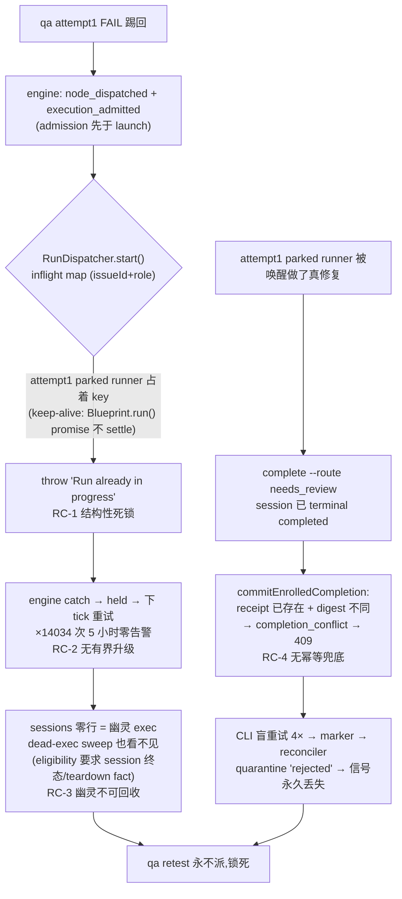

# FLY-1423 qa-fail 踢回锁死:幽灵 admit + terminal complete 硬 409 — 探索

Issue: FLY-1423 (https://linear.app/geoforge3d/issue/FLY-1423/enginebug4-qa-fail-踢回锁死-attempt2-admit-幽灵-exec-terminal-complete-硬)
日期: 2026-07-22
基于: 无(本文件夹首篇;上游为 Linear issue 正文与 2026-07-22 夜诊断)

## 1. 一句话问题

QA fail 踢回后,引擎给 implement attempt2 记了「admitted」却永远 launch 不出 runner(幽灵 exec,sessions 表零行);与此同时真修复由 attempt1 的 parked runner 完成,但它的 session 已是 terminal `completed`,重发 `complete --route needs_review` 被 Bridge 硬 409 连拒 4 次后进 quarantine——两条通路都死,qa retest 永不派,FLY-1415 / FLY-1364 双双锁死 5 小时,直到 Bridge 重启才「碰巧」解锁。

## 2. 实锭取证(生产 DB + Bridge log,2026-07-22)

以 FLY-1415(run `1ecb3051`)为主线,FLY-1364(run `9aff8b01`)形态完全相同:

### 2.1 事件时间线(`workflow_run_event`,UTC)

| seq | 事件 | 节点/exec | 时间 |
|-----|------|-----------|------|
| 16-19 | qa attempt1 FAIL → `loop_iteration` → `edge_traversed` | qa `26f4d9e6` | 04:04:10 |
| 20 | `node_dispatched` implement attempt2 | `88e29905` | 04:04:10 |
| 22 | **`execution_admitted`** | `88e29905` | 04:04:11 |
| — | **(幽灵窗口:5 小时无 `turn_granted`,sessions 表零行)** | | 04:04 → 09:05 |
| 23 | `turn_granted`(Bridge 重启后) | `88e29905` | 09:05:39 |

### 2.2 幽灵窗口内引擎在干什么(`/tmp/flywheel-bridge.log`)

```
[workflow-engine] workflow engine dispatch held for 88e29905-…: Run already in progress for issue FLY-1415 role implement   × 14034 次
[workflow-engine] workflow engine dispatch held for d6273e15-…: Run already in progress for issue FLY-1364 role implement   × 9188 次
```

每秒一 tick、重试 5 小时、同一原因、**零告警零升级**。side_effect_ledger 里 attempt2 的 dispatch 行卡在 `intent_recorded`(04:04:10 created,09:05:37 才 committed)。

### 2.3 「解锁」的真相

最后一条 held tick 的下一行就是 `[bridge-wrapper] 01:05:54 Starting Bridge`(本地时间)。所谓存量解锁 = **Bridge 重启把内存里的 inflight map 清了**,引擎下一 tick 立即把两个 attempt2 都真 launch 出去(sessions 行 09:05:35/09:05:38 出现),之后全链自然恢复(attempt2 修完 → qa attempt2 PASS → founder_gate 09:53 打开)。

### 2.4 attempt1 的 409(quarantine 文件)

`~/.flywheel/state/complete-failed-quarantine/ec9d3286-….json`:

```json
{ "attempts": 4, "error": "Bridge returned 409", "timestamp": "2026-07-22T06:22:55Z",
  "event_type": "session_completed", "payload": { "decision": { "route": "needs_review" },
  "evidence": { "commitCount": 17, "filesChangedCount": 14, … } } }
```

attempt1 runner(`ec9d3286`,03:34 已 `completed` 并 park)在 06:07-06:22 被 founder-ship 回复链唤醒、完成了真修复(17 个 commit),重发 complete → 4×409 → marker 被 reconciler 定性 `rejected` 进 quarantine → 引擎永远收不到。

## 3. 根因链(四个独立缺口)



- **RC-1(结构性死锁,launch 被挡的直接原因)**:`run-dispatcher.ts:1195-1207` 的 in-memory `inflight` map 以 `(issueId, role)` 为 key 防并发双跑;`inflight.delete` 只在 Blueprint.run() promise 的 `.finally()`(`:1587-1589`)触发。三阶段 keep-alive 让 implement attempt1 complete 后 **park 不退出** → promise 永不 settle → key 永被占。DAG qa_retry 的 attempt2 与 attempt1 同 issue 同 role → 永远被拒。**三阶段 keep-alive 与 DAG 踢回环在这个守卫上结构性互斥。**
- **RC-2(无有界升级)**:引擎 `consume()` 抛错只落 log(`workflow engine dispatch held for …`),持续 held 没有任何时长/次数上限触发的 Lead 告警。5 小时 14034 条相同日志,静默。
- **RC-3(幽灵不可回收)**:`execution_admitted` + `intent_recorded` 都在 launch 之前落账(`workflow-engine-dispatcher.ts:1150` admission 先于 `:1314` start),launch 永远失败时账面上就是「admitted 指向一个 sessions 零行的 exec」。dead-exec sweep 的准入(`:668-679`)要求 `getSession()` 返回不可逆终态或有 teardown fact——幽灵连 session 都没有 → `isStateStoreIrreversibleTerminalForZombie(undefined)` = false → **sweep 对幽灵不可见**,任何机械回收路径都够不着它。
- **RC-4(terminal complete 无幂等兜底)**:FLY-1427 的免疫守卫(`StateStore.ts:17879-17887`)**刻意排除 `completed`**(`&& sessionStatus !== "completed"`),所以已 completed session 的重发 complete 不走 200-settled;接着撞 receipt 冲突检查(`:17821-17842`):receipt 已存在且 submission digest 不同(fix commits 改了 evidence)→ `completion_conflict` → event-route `:694-704` 硬 409。CLI(`complete.ts:263-294`)对 409 与网络错误同等对待、盲重试 4 次;reconciler(`complete-marker-reconciler.ts:611-621`)把 `completion_conflict` 定性 quarantine。**没有任何一层认得「同一 exec、同一 route、只是 evidence 刷新」的语义幂等。**

注:事故时 FLY-1427(PR #672)尚未部署(merge 于 08:23 PDT,409 发生在 06:22 UTC);但即使部署了,`completed` 的排除口意味着同场景**今天依然 409**——RC-4 未被 sibling 覆盖,是本单真实的洞。

## 4. 代码坐标系(改动会落在哪)

| 缺口 | 文件:行 | 现状 |
|------|---------|------|
| inflight 守卫 | `packages/teamlead/src/bridge/run-dispatcher.ts:1195-1207` | 同 exec 幂等放行;异 exec 一律 throw |
| inflight 释放 | 同文件 `:1587-1589` | `.finally()` 无条件 `inflight.delete(key)`(无 identity check——若引入顶替,老 promise 会误删新条目;`:1593` 已有 identity-check 先例) |
| admission | `workflow-engine-dispatcher.ts:1150` `admitGeneralizedWorkflowExecution` | 先于 launch;幂等可重放,凭据可轮换 |
| launch | 同文件 `:1180` `recoverOrAcquireWorkflowLaunch` → `:1314` `startDispatcher.start()` | 失败→consume throw→held log,每 tick 重试 |
| dead-exec sweep 准入 | 同文件 `:663-716` | `node.state==='running'` + session 终态/teardown fact;幽灵(无 session)不可见 |
| 机械回滚原语 | `StateStore.ts:17248` `rollbackDeadWorkflowNodeExecution` | 要求 `livenessEvidence.liveness==='dead'`;event_uid 幂等;mint 新 exec;≤`MAX_BLIND_REPLACEMENTS` 后 held+告警 |
| terminal 免疫守卫 | `StateStore.ts:17879-17887`(commitEnrolledCompletion 内) | no-out-edge 终态免疫但排除 `completed` |
| receipt 冲突/幂等 | `StateStore.ts:17821-17842` | digest 全等→200 幂等;任一字段不同→`completion_conflict` 409 |
| 409 → HTTP | `event-route.ts:694-704` | 除 `stale_execution_superseded`/`terminal_status_immune` 两个 200-settled 口外全 409 |
| CLI 重试 | `flywheel-comm/src/commands/complete.ts:263-294` | 409 当普通失败盲重试 4×,无 deterministic-reject 分类 |
| marker 收敛 | `complete-marker-reconciler.ts:602-646` | `completion_conflict`→quarantine;`terminal_status_immune` settled 的 unlink 也排除 `completed` |
| 告警基建 | `workflow_alert_outbox` + `enqueueWorkflowEngineAlert` + `resolveRunAlertIdentity` | FLY-1415 建好的 escalation_uid 去重 + claim-before-send + 所属 Lead 三级解析,可直接复用 |

## 5. 修法方向(与 issue 拍板对齐)

### 修 1:踢回 admit 必须绑真 launch 成功的 runner(治 RC-1/RC-2/RC-3)

三件套,全部机械、零新周期负载(piggyback 现有 1s reconcile tick):

- **1a 结构性解锁(RC-1)**:inflight 守卫加一个引擎专属顶替口——engine-owned start(`req.generalizedExecution`)遇到既有条目,且该条目 exec 的 session 处于 no-out-edge 终态(复用 FLY-1427 导出的 `isNoOutEdgeTerminalStatus`)→ 判定为「parked 终态前任」,顶替其条目放行 successor。同时 `.finally()` 改 identity-check delete(照抄 `:1593` 先例),防老 promise 误删新条目。非引擎路径行为字节不变。生产已有旁证:09:05 重启后 attempt2 与 parked attempt1 共存同 worktree 跑完全链,TURN belt 正常仲裁。
- **1b 幽灵纳入机械回收(RC-3)**:dead-exec sweep 准入扩一条「幽灵腿」——node `running` + **`getSession()` 无行** + 最新 dispatch side-effect 仍 `intent_recorded` + admission 已超安全窗(≥ launch lease 的量级)→ 视同 dead(probe 对不存在的 tmux 返回 absent→dead,合同不变),走既有 `rollbackDeadWorkflowNodeExecution` mint 新 exec 盲换;≤ `MAX_BLIND_REPLACEMENTS` 后 run held + 人话告警到所属 Lead。幽灵从此=「未出生的 dead」,不再是账外物种。
- **1c 有界 held 升级(RC-2)**:dispatch intent 停在 `intent_recorded` 超阈值(无论 held 原因)→ 经 `workflow_alert_outbox` 发一次性去重告警(escalation_uid = `ghost_launch:{run}:{node}:{attempt}:{exec}`),带最近 held 原因原文。这不是新看门狗——是 launch 的 owner(dispatch reconcile 环)对自身持续失败的 fail-loud,与 FLY-1425 design-correction「不造专用看门狗」不冲突;跨节点通用不变量仍归 FLY-1386。

### 修 2:terminal session 的 complete 走幂等兜底(治 RC-4)

- **语义幂等判据**:`commitEnrolledCompletion` 对 prior status = `completed` 的 enrolled exec 增加「already settled」分支——receipt 已存在且 **execution_id 相同 + route 相同** → 200 settled(新 settled 值,如 `already_completed`),**digest 不同不算冲突**(evidence 刷新≠语义冲突);execution_id 或 route 不同 → 保留 409(真冲突照拒)。
- **落地兜底(宣告了但没落地)**:prior status = `completed` 而 receipt **缺失**(declared-not-landed 分叉)→ 照常落 receipt + `commitWorkflowTransitionTx` 推进节点(把「兜底补账」显式定为合同行为,并补测试锁住)。
- **载体对齐**:event-route 给新 settled 值镜像 `terminal_status_immune` 的 200 形态;reconciler 对该 settled 值 unlink marker(现 mirror-guard 排除 completed 的口子同步补上);CLI `complete.ts` 对 deterministic reject(如 `completion_conflict`)停止盲重试(镜像 FLY-1425 的 `classifyQaResultRejection` 形态)。

### 与 bug1(founder_gate 无宣告)的同族关系

同属「DAG 节点交接 = 宣告 + 落地 + 兜底」:本单的宣告=admission/completion 事件、落地=session 行/receipt+edge、兜底=幽灵回收+幂等 complete+有界告警。基建上复用 FLY-1415 告警链与 FLY-1427 终态判据,**不与 bug1 的实现耦合**,本单独立交付踢回环。

## 6. 已否决 / 暂缓的替代方案

| 方案 | 否决理由 |
|------|----------|
| 踢回时由引擎自动关掉 attempt1 的 parked runner | close-runner 属 Runner-lifecycle 保留动作(FLY-175 founder 合同域);且 parked 前任与 successor 共存已被 TURN belt 证明安全,无需增加生命周期动作 |
| 把 admission 挪到 launch 成功之后 | admission 铸造 output/submission 凭据,launch 需要它们作为入参,顺序不可倒;幽灵治理应走「有界+回收+fail-loud」而非改铸造时序 |
| 对 `completed` 也直接套 `terminal_status_immune` 免疫 settle | 免疫 settle 不比较内容、不落 receipt,会把「真冲突」和「declared-not-landed 需补账」一起吞掉;`completed` 需要的是内容感知的幂等+补账,不是无脑免疫 |
| 为 held 做逐案看门狗 | founder 已裁「不要来一个打一个的看门狗」(FLY-1425 design-correction);本单只做 owner 自身的 fail-loud,通用不变量归 FLY-1386 |
| inflight map 落库/持久化 | 大改;本单只需要引擎 successor 的终态顶替口,重启清空行为保持现状 |

## 7. 边界(本单做什么 / 不做什么)

**做**:引擎车道(generalized/DAG)的 qa_retry 踢回环——attempt2 真 launch、幽灵有界回收+告警、terminal completed 的 complete 幂等/补账;复现 1415/1364 场景的真机隔离房 E2E。

**不做**:存量 1415/1364 解锁(已由 Bridge 重启+Lead 收尾);three-stage shadow 车道多轮凭据(FLY-1429);跨节点通用不变量框架(FLY-1386);attempt1 被 founder-ship 链唤醒去做修复这个「车道混淆」本身(观察记录在案,治理属 shadow 车道语义,超本单半径);FSM 转移表、非 DAG 写路径、DB trigger 硬约束(FLY-1427 已裁)。

## 8. 待研究问题(带进 research)

1. `commitWorkflowTransitionTx` 在 session 已 `completed` 时补 receipt+推进是否有隐藏拒绝点(transition_refused?)——落地兜底分支的可行性需逐行核。
2. inflight 顶替口的判据取 session status 时,pre-registration 阶段(session 行未建)的窗口如何处理(条目在、session 不在 → 视为活跃 launch 中,不顶替)。
3. 幽灵腿的安全窗阈值与 `recoverOrAcquireWorkflowLaunch` 60min lease、`retryDelaysMs` pacing 的关系;`launch_committed`(已 commit 未 delivered)状态明确交给既有 delivery-repair,幽灵腿只认 `intent_recorded`。
4. `already_completed` settled 的幂等重放(同 event_id / 异 event_id)在 insertEvent 去重层与 receipt 层的交互;quarantine 存量是否需要一次性 backfill(倾向不做,存量已人工收尾)。
5. E2E 注入手法:如何在隔离房稳定复现「parked attempt1 占 inflight」(真 runner park?或 harness 持假 promise?)。
