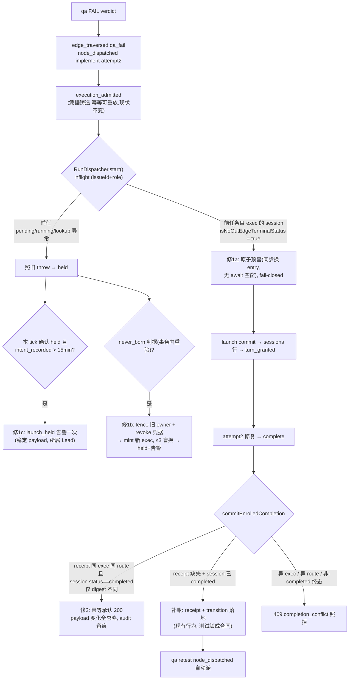

# FLY-1423 qa-fail 踢回锁死 — 实施计划(非权威,仅存档参考)

> **⚠️ 本文件不是 FLY-1423 的实施依据。** 权威计划 = `engineering/doc/FLY-1423-qa-kickback-deadlock/plan.md`(v2 C 架构:统一 rework_requested、同 actor 同 exec 唤醒返工,design review APPROVED + Annie 拍板 "ok lets do it",PR #674 已实现至 Task 5/6)。本文件是 design 节点 291571e6 在未读到 Lead「设计已既成事实」指示前的平行独立推导——其思路本质上是被 v2 取代的 v1 evict-then-spawn 方向;留档价值在:① exploration.md 的生产取证链(DB/日志铁证,与权威设计的问题定义互证);② 4 轮 codex review 逼出的机制细节(fence/marker/writer-serialization 论证)可供实现 Task 7 fallback 路径参考。见同级 `../FLY-1423-qa-kickback-deadlock/design-confirmation.md`。

Issue: FLY-1423 (https://linear.app/geoforge3d/issue/FLY-1423/enginebug4-qa-fail-踢回锁死-attempt2-admit-幽灵-exec-terminal-complete-硬)
日期: 2026-07-22
基于: research.md(机制判据)、exploration.md(取证与根因)、codex design review round 1+2(R1 五项阻塞 + R2 两项阻塞/两项重要/一项建议全采纳,本版已写回)

## 0. 目标与验收(照 issue)

修机制不修存量:

1. 踢回 admit 绑真 launch 成功的 runner——parked 终态前任不再挡 successor(修 1a);launch 持续失败有界告警(修 1c)+ 幽灵有界回收(修 1b),不留幽灵。
2. terminal `completed` session 的重发 complete 走幂等兜底:同 exec 同 route → 承认已完成,不硬 409;真冲突(异 exec / 异 route / 非-completed 终态)照拒。
3. 验收 E2E(真机隔离房):注入 qa-fail → attempt2 真 launch(sessions 有行,**不重启 Bridge**,记录 Bridge PID/启动时间为证)→ fix 完成 → complete 幂等通过 → qa retest 自动派。复现 1415/1364 场景全链通过。

修后的踢回环:

## 1. 任务分解(TDD:每任务先测后码)

### T1 — 修 1a:inflight 终态**原子**顶替口(`packages/teamlead/src/bridge/run-dispatcher.ts` + `run-infra.ts`)

1. `RetryDispatcher` 与 `RunDispatcher` 构造尾各追加可选参数 `sessionStatusLookup?: (executionId: string) => string | undefined`(undefined → 字节兼容 legacy);`RunDispatcher` 自身构造函数(`:1089-1132`)透传。生产装配点是 `createRunInfraDispatcher`(`packages/teamlead/src/bridge/run-infra.ts:631-666`),传 `(id) => store.getSession(id)?.status`;lookup **抛错时记 warn 并按现有 busy 行为拒绝顶替**(DB 异常不得泄漏成新的 start 失败语义)。
2. `start()` 守卫(`:1195-1207`)扩展,顺序:
   - 既有:同 exec → 幂等返回(不变)。
   - 新增(**原子顶替,无 delete→await 空窗**):`req.generalizedExecution` && 异 exec && `isNoOutEdgeTerminalStatus(lookup(旧 exec))` → **同步**用本 successor 的 reservation entry **原地替换**旧 entry,再进入 `admitLifecycle` 等 await;同 exec 重入识别该 reservation 幂等返回;其它 contender 在 reservation 在位期间照旧 throw(继续 held)。
   - **reservation promise = deferred lifecycle promise(R2#4)**:entry 自同步安装起持有一个 deferred promise 并**全程不更换 entry identity**——所有 prelaunch 路径(admission 失败 / TURN·guard abort / 异常)都必须 settle 它;Blueprint 启动后 deferred 链到真实 run promise。`drain()`(`:1073-1075` 直接快照 `Promise.allSettled`)因此既不会在 prelaunch 阶段提前完成,也不会因替换 promise 而永久等待。**settle 语义 = resolve(R3#3)**:prelaunch failure/abort 时 deferred **resolve**(错误仍由 `start()` 自身 throw 传播),与现有 Blueprint promise 链 catch-then-resolve 的 completion-signal 语义一致,杜绝 unhandled rejection;drain 测试挂 unhandled-rejection sentinel。
   - 其余 → 照旧 throw `Run already in progress …`。
3. **全路径 identity-check 清理**:`.finally()`(`:1587-1589`)、dispatch 腿(`:952`, `:1036`)以及 `abortPreLaunch`(现无 entry 参数,**需加 expected entry/token 入参**并让全部调用点携带)——一律只在 `this.inflight.get(key) === expected` 时删除 map 条目;**旧 exec 的 registry/claim 资源清理与 map 删除拆开执行**,identity 不匹配只跳过 map 删除、不跳过资源清理。
4. 导入:`isNoOutEdgeTerminalStatus` 自 `flywheel-core`(`packages/core/src/index.ts:292` 已导出)。

测试:
- 终态前任(completed / terminated / approved / shelved 参数化)+ 引擎 start → 顶替放行,新 entry 在位。
- 前任 pending / running / lookup 返回 undefined / lookup **抛错** / seam 未注入 → 照旧 throw(fail-closed 五连)。
- 非引擎 start 遇终态前任 → 照旧 throw(车道隔离)。
- **两个 successor 并发 start** → 恰一个拿到 reservation,另一个 held(原子性专测)。
- 顶替后老 promise resolve / reject / abort 三态 → 新 entry 均**不被删**,且老 exec 资源清理仍执行。
- **drain-during-reservation 三测(R2#4)**:admission reject/abort 后 drain 必须完成;admission 成功时 drain 必须等到 Blueprint promise settle;superseded 老 promise settle 不得 settle 或删除 successor reservation。
- 既有全部 dispatcher 测试跑绿(字节兼容基线)。

### T2 — 修 1c:launch_held 有界告警(`workflow-engine-dispatcher.ts` + `StateStore.ts`)

1. **held 原因结构化采集**:`consume()` 返回值改造为可携带 hold 原因(如 `{started:false, heldReason}`)或 dispatcher 在两类路径统一记录——**throw 腿与 return-false 腿(launch busy/hold,`:1180-1187`)都要覆盖**;per-intent 内存 map 存最近原因,intent 离开 `intent_recorded` 时清理。
2. 阈值判定:**本 tick 再次确认 held** 且最新 ordinal intent `created_at` 距今 > `LAUNCH_HELD_ALERT_MS = 15 * 60_000` → enqueue。重启后内存 map 为空:**须先观察到一次当前 held 才允许告警**(durable created_at 不因重启重置,防止重启即误报)。
3. **稳定不可变 payload**(outbox 对同 UID 要求 `payload_json` 逐字节相同,`enqueueWorkflowEngineAlertTx` 冲突即抛 `workflow_alert_uid_conflict`,`StateStore.ts:16654-16681`):payload 只含**确定性字段(R2#5)**——durable `intent.created_at`、越阈时间用 `intent.created_at + 15min` **计算值**(禁用进程首次观察 wall clock)、当次采集的原因原文;**禁含当前 `now` / HTTP event_id / 每 tick 变化值**。enqueue 前查 UID 已存在则跳过(或提供显式幂等 enqueue API);后续 tick 不再构造变化 payload。UID = `launch_held:{run}:{node}:{attempt}:{exec}`。
4. alert metadata 的 disposition union(`StateStore.ts:23070-23099`)补 `launch_held` 类型;identity 走 `resolveRunAlertIdentity`;人话文风照 FLY-1415。零新 timer。

测试:`<15min` 无告警;throw 腿与 return-false 腿两类原因均被采集;跨 1 小时 reconcile 不抛且 outbox 仍恰一条;重启(map 清空)后先观察一次 held 才告警;disposition 类型齐备。

### T3 — 修 1b:never_born 幽灵腿(**StateStore 原语先行**,再接 dispatcher)

**T3a — StateStore 事务分支 + durable fence(先做先测)**:

1. `rollbackDeadWorkflowNodeExecution` 的 evidence 改为 **discriminated union,legacy arm 用可选 discriminator(R2#3)**:
   - `{ basis?: "probe", liveness: "dead", observedAt }` — **`basis` 缺省即 probe**;持久化/receipt digest 前**规范化回旧的两字段 shape**(`execution_dead_rolled_back` payload 原样写入 `:17458-17472`、idempotent replay 做 canonical digest 比较 `:17301-17312`——旧 event payload JSON 必须精确相等,旧调用点零改动);
   - `{ basis: "never_launched", intentCreatedAt, observedAt }` — 新事务分支,discriminator 必填。
   - sentinel 测试:旧调用无改动、旧 event payload JSON 精确相等、旧 idempotent replay 仍成功。
2. 新分支**事务内重验全部判据**(防 TOCTOU;现有 `execution_not_terminal` 守卫(`:17367-17377`)仅对 never_launched 分支替换为以下重验,probe 腿不动):
   - current node/execution 未变(仍指向该 exec);
   - 最新 ordinal dispatch side-effect 属该 exec 且仍 `state==='intent_recorded'`;
   - `getSession(exec)` 仍无行;
   - launch owner 仍无 `committed_generation`;
   - durable `intent created_at` 已超 `GHOST_NEVER_BORN_MS = 60 * 60_000`(**以 intent 时间为准,不依赖 lease 过期——`recoverOrAcquireWorkflowLaunch` 每 tick 刷新 lease(`:14823-14843`),lease 永不自然过期**)。
3. **durable launch-abandonment fence(R2#2,覆盖 absent-owner 与未来 acquire)**:不采用「更新旧 owner 状态/generation CAS」(owner 行可能根本不存在——`recoverOrAcquireWorkflowLaunch` 在 owner 缺失时直接 INSERT generation 1,`:14732-14814`)。改为**新增按 executionId 键控的独立 fence 表**(不动现有 `delivery_state` CHECK),never_launched rollback 在同一事务内**无条件 INSERT** fence 事实(owner 存在与否皆然);`recoverOrAcquireWorkflowLaunch`、lease renew、output/submission rotation(常规与 delivery-repair 两组)、`fencedCommitWorkflowLaunch`、delivery-repair claim 全部入口在**各自 mutation 的事务内**(非 TOCTOU preflight)查 fence,命中返回稳定拒绝 `launch_abandoned`。同事务 **revoke 未消费凭据**。fence INSERT 失败 → 整个 rollback 事务回滚(node 与 side-effect 零改变)。
   - **fence 表 = 不可撤销事实(R3#2)**:最小字段 `execution_id PRIMARY KEY` + run/node/attempt + `abandoned_at` + reason;**无删除路径**,按项目 append-only 习惯加 no-update/no-delete trigger(或 schema contract test 锁定等价约束);新增 close/reopen StateStore 后所有 launch-authority 入口仍返回 `launch_abandoned` 的持久性 sentinel 测试。
   - **writer serialization(R3#1,唯一线性化点)**:`CompatDatabase.transaction` 现为默认 deferred(`:193-194`),而 `fencedCommitWorkflowLaunch` 在第一条 DB 写**之前**就写/rename/readback 最终 marker(`:15496-15513`)——SELECT 预检取不到 writer reservation,跨连接交错可留下「marker 已发布 + DB 已 abandoned」的矛盾双权威。**修法写死**:StateStore wrapper 增加 `transactionImmediate`(better-sqlite3 `.immediate()`),**仅** never_launched rollback 分支与 `fencedCommitWorkflowLaunch` 使用——先取 writer lock,再重查 abandonment/current owner/current node,然后才写 marker/`committed_generation` 或插入 abandonment/换 node。commit 先拿锁 → rollback 等待后看见 committed 拒绝;rollback 先拿锁 → commit 在写 marker **前**看见 abandonment 返回 `launch_abandoned`。FLY-1415 probe 分支保持现有事务模式不变。
4. 收敛复用现状:≤ `MAX_BLIND_REPLACEMENTS` 盲换、exhausted → run held + 所属 Lead 告警;event payload 带 `basis:"never_launched"`、reason `"ghost_never_launched"`。

**T3b — dispatcher 准入腿**:`reconcileDeadExecutions()` 增加并列腿,fail-closed 条件为(R2#1):
- 4 durable 判据(dispatcher 侧初筛)全满足;
- **activity baseline capture 必须成功**(失败 → hold 本 tick 重试,现状形态);
- **launch commit marker `state === "absent"` 才允许调用 never_launched 原语**——`fencedCommitWorkflowLaunch` 是 marker-first(先写 marker 再更新 `committed_generation`,`:15496-15524`),marker-present/DB-null 是**可恢复的 committed launch**(crash repair 属 `recoverOrAcquireWorkflowLaunch`,测试 `StateStore.generalized-execution.test.ts:519-548`),必须让位;marker stat `unknown` → hold 本 tick。
- marker absence 采样后若并发 commit 开始:由 **`transactionImmediate` writer lock**(T3a-3)保证线性化——旧 commit 先拿锁 → rollback 等待后重验看见 `committed_generation` 拒绝;rollback 先拿锁 → 旧 commit 在写 marker 前看见 abandonment 得 `launch_abandoned`。**两种交错只能有一个赢家;终态只允许 `(marker present + committed_generation)` 或 `(marker absent + abandonment)`,绝不允许 marker 与 abandonment 并存。**

测试:
- StateStore 级:逐判据残缺 → 拒绝(含 `launch_committed`、session pending 行、59min、node 已换 exec 四类 TOCTOU 单测);全满足 → 回滚 + 新 exec intent + payload basis 正确。
- **fence 矩阵(R2#2)**:无 owner rollback 后 late acquire 被拒;有 owner 后 late acquire / renew / 两组 rotation / commit / delivery-repair claim 全拒 `launch_abandoned`;fence INSERT 失败 → node 与 side-effect 零改变;probe legacy 路径不写 fence。
- **marker 三测(R2#1/R3#1)**:marker-after/DB-before → 不回滚且可被修复为 committed;marker stat unknown → 不回滚;**两个独立 StateStore 连接指向同一临时 DB** 的交错测试——终态只能是 `(marker present + committed_generation)` 或 `(marker absent + abandonment)`,loser 得稳定拒绝且 node/credential 状态与赢家一致。
- baseline capture 失败 → 本 tick hold(现状形态)。
- 幽灵反复不出生 → 3 次盲换 → exhausted held + 告警。
- **FLY-1415 既有 probe 腿测试全绿零改动**(含 dead_after_output 行为锁)+ byte-compat sentinel(上述 1)。

### T4 — 修 2:terminal complete 幂等兜底(**StateStore + event-route + reconciler + CLI = 一个不可拆合同切片**)

1. `commitEnrolledCompletion` receipt 腿(`:17821-17842`)拆分,**新分支前置读 session**:
   - `execution_id` 或 `route` 不同 → `completion_conflict`(不变)。
   - 三字段全等 → 幂等 replay(不变)。
   - **exec+route 相等、仅 digest 不同、且 `session.status === "completed"`** → `ok:true, idempotentReplay:true, evidenceRefreshed:true`;**合同=「承认已完成,新 payload 全部忽略」**——receipt/binding/route/投影一律不改写(诚实合同,不做非-evidence 字段语义投影比较);照 replay 腿重投影;audit 用**确定性 UID checked append**:`wfc_refresh:{run}:{node}:{attempt}:{newDigest}`(同 digest 重放恰一条,异 digest 各留痕);**audit payload 只含确定性字段(R2#5)**:run/node/attempt、原 receipt digest、新 digest、合同版本号——**禁含请求 event_id / 当前 `now`**(需要时间戳时用可重复读取的原 receipt 时间)。
   - exec+route 相等、digest 不同、但 session 为 **其它 no-out-edge 终态(terminated/shelved/approved)或无行** → `completion_conflict` 照拒(**不放宽 FLY-1427 合同**;既有 terminated+legacy receipt 精确 replay 测试 `StateStore.fly1427-terminal-immunity.test.ts:220-256` 保持全绿)。
2. 返回类型只增字段不改既有(reverse-compat);event-route 对 `ok:true` 维持 200,**只透传 StateStore 明确结果**(body 增 `evidenceRefreshed`),不自行推断。
3. **reconciler 两道守卫显式改**(现状会双重拦截幂等重放,「无需新码」判断已被 review 推翻):
   - 预检(`complete-marker-reconciler.ts:415-431`):异 exec/异 route 维持 quarantine;**同 exec+route、权威 session 为 `completed`、digest 不同 → 放行 replay**(让 StateStore 落 refresh audit);
   - 200 后验证(`:647-674`):仅当响应 `evidenceRefreshed:true` 且 receipt 仍等于原值、canonical binding/route 未变时接受并 unlink;其余 fail-closed 保留 marker。
   - 既有 changed-evidence quarantine 测试(`__tests__/complete-marker-reconciler.test.ts:614-649`)改为 completed-only refresh success;保留/新增 terminated、异 exec、异 route、session 缺失的 quarantine 测试。
4. declared-not-landed 补账**合同测试**(不写新码):session 先被 `recordEnrolledTerminalSignal` 腿翻 `completed`、receipt 缺失 → `commitEnrolledCompletion` → receipt 落账 + `edge_traversed` + 后继 `node_dispatched`。
5. CLI `complete.ts`:409 reason 分类(镜像 FLY-1425 形态):`completion_conflict` → deterministic 停重试、红错指引报 Lead;`retryable:true` 与 unknown → 保留 bounded retry。写 marker 行为不变。

测试:上述各分支 + 幂等之幂等(同请求重放仍 200 且 audit 不增)+ reverse-compat sentinel(未触发新分支时返回值逐字段一致)+ CLI mock 409 conflict 恰 1 请求即停 / missing_output 4 次 bounded retry 现状锁定。

### T5 — 真机隔离房 E2E(验收链)

QA framework 隔离房(FLY-96/115 slots),脚本入 `engineering/doc/FLY-1423-qa-retry-ghost-admit/`:

1. 引擎模板 run 起 implement attempt1(真 runner)→ complete needs_review → attempt1 keep-alive park(自然占 inflight)。
2. qa attempt1 注入 FAIL verdict(`/api/workflow/decision` 凭据车道)。
3. **断言 A(修 1a 铁证)**:attempt2 sessions 行在不重启 Bridge 前提下出现——**记录 Bridge PID + 启动时间前后一致为证**;断言 attempt1/attempt2 executionId 与 session 归属各自正确。
4. attempt2 完成 fix → complete → **断言 B**:qa attempt2 `node_dispatched`(retest 自动派)。
5. **断言 C(修 2,双形态)**:
   - CLI 形态:对已 completed 的 attempt1 exec 刷新 evidence 重发 complete → exit 0、无新 quarantine、无 conflict 事件;
   - **marker 形态(reconciler 恢复路径)**:预置一个 changed-evidence 的 pending marker → reconcile → unlink、receipt 未变、refresh audit 在、无 quarantine。
6. 定向回归:FLY-1415 dead/output tripwire、FLY-1427 terminal immunity、FLY-1425 CLI classification 测试套;然后全仓测试 + lint。
7. 1b/1c 的 60/15min 窗口用假时钟单测覆盖(T2/T3),不进真机。

## 2. 交付顺序与里程碑

**T1(原子顶替)→ T4(整切片:StateStore+event-route+reconciler+CLI)→ T2 → T3(T3a StateStore 原语先行并测毕,再 T3b dispatcher)→ T5(全链验收)** → codex code review → 独立 QA。全程一个 PR(同一踢回环,拆开会留「caller 已放行而 durable mutation/finalizer 未备」的中间态)。

## 3. 兼容性与守卫

- 缺省字节兼容:`sessionStatusLookup` 未注入、非引擎车道、无新判据命中 → 全部现状行为;`createRunInfraDispatcher` 装配是唯一激活点。
- 不动:FSM 转移表、legacy 三段式 `/events` 路径、`terminal_status_immune`(terminated 类)语义、FLY-1415 probe 腿合同、shadow 车道(FLY-1429)、通用不变量框架(FLY-1386)。
- lint + 全仓既有测试绿为 push 前置(项目惯例)。

## 4. 风险清单

| 风险 | 处置 |
|------|------|
| 顶替误放行双活 / 双 successor | 原子同步顶替(无 await 空窗)+ reservation 幂等 + 并发专测;判据 fail-closed(仅 no-out-edge 终态);TURN belt 兜底 |
| 旧 promise/abort 误删新 entry | 全路径 expected-entry identity-check(finally + abortPreLaunch 加参)+ 资源清理与 map 删除解耦 + 三态专测 |
| 幽灵回滚后旧 exec 晚出生(双活) | **durable fence 表(absent-owner 也覆盖)**+ revoke 凭据;acquire/renew/rotation/commit/repair 全入口查 fence;竞态矩阵铁测 |
| **marker-present/DB-null 可恢复 launch 被误回滚** | never_launched 准入强制 marker `absent`;present 让位 crash repair、unknown hold;交错线性化测试 |
| **marker 与 abandonment 双权威并存** | `transactionImmediate` writer lock 仅两分支启用;终态互斥断言;双连接交错铁测 |
| **fence 事实被未来 cleanup 误删** | append-only trigger/合同测试 + close/reopen 持久性 sentinel |
| never_born 误判(TOCTOU) | 事务内全判据重验;dispatcher 只做初筛;逐判据残缺测试 |
| **reservation promise 破坏 drain 生命周期** | deferred lifecycle promise 全路径 settle、entry identity 不换;drain-during-reservation 三测 |
| **probe basis 破坏 FLY-1415 字节合同** | legacy arm `basis?` 可选、持久化前规范化回两字段 shape;payload JSON 精确相等 sentinel |
| digest 放宽越界(非-completed 终态被误承认) | 新分支强制 `session.status==="completed"`;FLY-1427 既有测试全绿;audit 确定性 UID |
| 告警 payload 漂移炸 reconcile | 稳定不可变 payload + UID 预查/幂等 enqueue + 1 小时跨 tick 测试 |
| FLY-1415 测试锁 | evidence 判别联合缺省 probe 腿,既有调用与测试零触碰 |

## 5. 实现期非阻塞提醒(codex R4)

1. 双连接竞态测试要**真实并发**(worker thread / 子进程 + barrier 控制 commit-first / rollback-first 两序),不是同栈顺序调用——better-sqlite3 同步 API 下伪并发测不到 IMMEDIATE writer 等待。
2. `launch_abandoned` 在每种返回 shape(status union 与 `{ok:false, reason}`)中都按既有形态透传**同一 reason 字符串**;fence 矩阵与 close/reopen sentinel 逐入口精确断言,不许落回 `stale_launch_owner`/generic busy。

## 6. 状态

- Status: **codex-approved**(4 轮:R1 5 阻塞 → R2 2 阻塞+2 重要 → R3 1 阻塞 → R4 APPROVED,零遗留阻塞)
