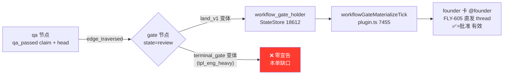

# FLY-1424 ship 就绪通知发射器 — 探索
Issue: FLY-1424 (https://linear.app/geoforge3d/issue/FLY-1424/enginebug1-founder-gate-变-ready-零宣告-接ship-就绪通知发射器谁-emit-emit-给谁-怎么判)
日期: 2026-07-22
基于: 无(上游为 issue 本体的夜诊断实证;相邻上下文 `engineering/doc/FLY-1407-binding-migration-engine/exploration.md`)

---

## 1. 问题(founder 原话)

> 「引擎这边做完了,该告诉安妮收到 ship gate 了。这个时候应该是引擎去告诉你,然后你再去处理。」
> 「你说 founder_gate 变 Ready 是 emit 一个 ship 就绪事件,**谁来 emit?emit 给谁?怎么样判断 founder_gate 变 Ready?**」

现状:tpl_eng_heavy 的 DAG run 走到 `founder_gate`(type:gate,无 runner)后,引擎把节点置 `review` 就停,**零宣告**。FLY-1375/1407 两单 qa done 后 `lead_events` 零 ship/founder 通知,ship gate 均由 Lead 人肉发现。本单 = 把 founder 三问落成明确设计。

## 2. 代码实证审计(2026-07-22,本 worktree HEAD ee2bf78f)

### 2.1 issue 给的实证,逐条核对

| Issue 断言 | 核对结果 |
|---|---|
| `founder_gate` 是 type:gate 图节点,qa pass → 引擎推到 review 就停 | ✅ 确认。`StateStore.ts:18595-18611`:边进入 gate 节点 → `upsertWorkflowRunNodeTx(state:"review")` + `gate_opened` 事件,之后无任何通知动作 |
| `workflow-engine-dispatcher.ts:695` 对 gate 节点 throw `engine_node_not_executable` | ⚠️ 行号已漂移:实际在 `workflow-engine-dispatcher.ts:812-814`(`:695` 现在是 land 节点分支)。结论不变:gate 节点无 dispatch,dispatcher 全文件无 founder-notify emit |
| FLY-605 通知器只绑 runner CommDB gate,没绑 DAG 图节点 | ✅ 确认,但**有重要例外**(见 2.2 F1):land_v1 变体已经绑上了 |
| FLY-1375/1407 qa done 后 lead_events 零通知 | ✅ 机制上必然(见 2.2 F3/F4):非 land 模板不建 gate holder → materializer 不触发;即使有 CommDB gate 问题,terminal source session 也会被准入层拒掉 |

### 2.2 审计新发现(比 issue 假设更深一层)

**F1 — 通知管线整机已存在,只是没接到 terminal_gate。**
land_v1 变体(`tpl_*_land_v1.yaml`)有一条完整的「gate 就绪 → founder 卡」流水线:
- 进 gate 的同一事务里建 `workflow_gate_holder` 行(`StateStore.ts:18612-18661`,条件 `schema_version===1 && manifest_variant==="land_v1"`,question_id = `workflow-gate:<digest>`,幂等);
- Bridge 的 `workflowGateMaterializeTick`(`plugin.ts:7455-7521`,挂在 GatePoller ~3s poll 上,`gate-poller.ts:702-710`)把 holder 逐段物化:CommDB 问题(checkpoint `approve_to_ship`)→ founder 卡(经 FLY-605 `emitFounderThreadNotification` 直发 issue thread,@founder)→ 卡片消息绑定(approval carrier)。分段持久(`question_intent→…→completed`),at-least-once,幂等重放。

**F2 — tpl_eng_heavy(terminal_gate,schema v1 非 land)不建 holder。**
`StateStore.ts:18612` 的条件把 terminal_gate 变体排除在外 → materializer 无物可物化 → 零卡、零事件。这就是「零宣告」的机制根因。

**F3 — 即使有 CommDB gate 问题,Lead 路也走不通:terminal session 准入拒绝。**
FLY-1373 后 Lead 收件由 `QuestionAdmission` 统一准入(`question-admission.ts:172-199`):gate 问题(checkpoint≠null)要求 source session 状态 ∈ {running, awaiting_review, approved_to_ship},否则 `revoked_terminal_session`。DAG qa 节点的 session 完成后是 `completed`(terminal)→ 永远不会进 Lead inbox。legacy 路径更狠:`gate-poller.ts:1853-1865` 直接驱逐(FLY-307 A)。**推论:land_v1 今天的 Lead 面也只有 founder 卡,没有 lead_event** —— issue 要求的双路①必须显式新做,不能靠现有 gate 问题 relay。

**F4 — founder 卡的「✅ 即批准」承诺对非 land run 绑定不上。**
approval-signal 的引擎批准权威有硬性 land-only 守卫:`gate-authority-view.ts:53-58` 要求 `isWorkflowManifestV1Land`。若给 terminal_gate 照抄 materializer(卡文案承诺「回复/✅ 即批准」),founder 点了 ✅ 也不会落 `founder_approved` claim —— **假承诺**。批准 ingest 侧同样:`applyWorkflowSourceEvent` 的引擎分支只处理 land_v1(转 land 节点)和 schema v2(直接 completed),v1 非 land 两头都不进(`StateStore.ts:19700-19790`)。

**F5 — 「怎么判 ready」的全部原料在 claims ledger 和 run 状态里。**
- qa_pass 转移必带 QA 过的 head:qa 节点经 claims 路径提交 `qa_passed` claim(subject_kind=`git_head`,`StateStore.ts:18198-18290`),`subjectDigest` 随转移进 gate;
- PR 号:`store.getWorkflowRunPrNumber(runId, headSha)`;
- 「尚无 founder_approved claim」:`workflow_claims` 查 `predicate='founder_approved' AND workflow_run_id=?`(founder 批准 ingest 时必写此 claim,`StateStore.ts:19660-19680`);
- 幂等骨架现成:`workflow_run_event.eventUid` 唯一(append-only);`lead_events` UNIQUE(lead_id, event_id) + `tryClaimLeadEvent`(`StateStore.ts:8304-8319`);
- 兜底告警骨架现成:`workflow_alert_outbox`(`enqueueWorkflowEngineAlertTx`,escalationUid 唯一)→ dispatcher 的 `reconcileWorkflowEngineAlerts`(claim-before-send)→ alertSink。

**F6 — 战略背景:工程类模板正在往 land 迁移。**
FLY-1396 → FLY-1380(种 binding)→ FLY-1407(引擎面,已 merge)→ 迁 binding → cutover 的路线图,终点是工程 category 跑 `*_land_v1` 模板 —— 那里通知+批准+auto-land 整链已通。**FLY-1424 是当下 tpl_eng_heavy 时代的补洞 + 任何非 land terminal gate 的永久安全网**,不应为一个正在退役的变体重建一套批准载体。

### 2.3 现状链路(mermaid)

## 3. 设计选项

### Option A(推荐)— 专用 ship-ready 发射器,挂引擎 reconcile

按 issue 钉的三问答案落地,复用现成部件但**不**造 holder/CommDB 问题:

- **谁 emit**:`WorkflowEngineDispatcher.reconcile()` 新增一个 readiness pass(1s tick,零新 timer)。Discord 投递臂以依赖注入进 dispatcher(先例:`landExecutor` 注入,`workflow-engine-dispatcher.ts:76-81`),plugin.ts 闭包里已有 lead/thread/botToken 解析。
- **emit 给谁(双路)**:① `lead_events` 行,event_type `workflow_ship_ready`,`tryClaimLeadEvent` 幂等,LeadInboxLoop 送达 + HeartbeatService 重投;② founder 卡:复用 FLY-605 `emitFounderThreadNotification`,新增 `ship_ready` checkpoint 文案(带 PR + QA head;**不**承诺 ✅ 绑定批准 —— 诚实文案:请回复本条/叫 Lead 执行 ship)。
- **怎么判 ready**:`run.engine_owned=1 ∧ status='active' ∧ current_node_id=terminal gate 节点 ∧ 该节点 state='review' ∧ 无 founder_approved claim`;dedup = `workflow_run_event` uid `ship_ready_notified:<runId>:<gate>:<attempt>`(attempt 维度 → founder 反馈 kickback 后再次到 gate 会正确地重新宣告)。
- **兜底**:review 停留超 T 未处理 → `enqueueWorkflowEngineAlertTx` 走现有 alert outbox 提醒 Lead。

### Option B(否决)— 把 land_v1 的 holder+materializer 扩到 terminal_gate

一度看似「复用整机」,审计后三处硬伤:
1. **假承诺**(F4):卡文案承诺 ✅ 批准,但批准权威 land-only,绑定不上;要改就得把 gate-authority/source-ingest/holder 生命周期全部为非 land 再开一条腿 —— 远超本单 scope;
2. **Lead 路照样不通**(F3):CommDB gate 问题被 terminal-session 准入拒掉,lead_event 还是要另做;
3. **为退役变体造二套批准载体**(F6):迁移终点是 land 模板,Option B 的增量在 cutover 后变死代码。

### Option C(否决)— Lead 侧轮询发现

违背 founder 原话「应该是引擎去告诉你」;Lead 判断是输入不是触发器(FLY-175 契约),且 Lead 轮询正是本次事故里失效的那条人肉路。

## 4. founder 三问 → 设计答案(定稿方向)

1. **谁 emit**:引擎自己 —— WorkflowEngineDispatcher 的 reconcile tick(Bridge 进程,1s,已在读全部 run 状态);Discord 投递臂由 Bridge 注入。不依赖 Lead、不依赖 runner。
2. **emit 给谁**:双路。① owning Lead:`lead_events` 行 `workflow_ship_ready`(durable + UNIQUE dedup + 心跳重投);② founder 本人:FLY-605 founder-thread 直发 @founder 进 issue thread(带 PR 号 + QA head),不经 Lead 转达。
3. **怎么判 ready**:`current_node_id = terminal gate 节点 ∧ 节点 state='review' ∧ 无 founder_approved claim`,证据取最新 `qa_passed` claim(head)+ `getWorkflowRunPrNumber`;emit 一次后写 `ship_ready_notified:<runId>:<gate>:<attempt>` 事件标记,幂等不重发;kickback 后新 attempt 重新宣告。

## 5. 边界

**做**:非 land 引擎 run(schema v1 terminal_gate,即 tpl_eng_heavy/light/trivial)的 ship-ready 双路宣告 + dedup + 超时兜底提醒。
**不做**:批准载体绑定(✅→founder_approved 自动落 claim,land 已有、非 land 等迁移);run 的 merge 后收尾/completed 语义;land_v1 与 schema v2 路径(land 已有整链;v2 的 gate 宣告是否同样缺失 → research 里核一遍再定去留);Lead 收到 lead_event 之后的处理动作(Lead 现有职责)。

## 6. 留给 research 的问题

1. readiness 查询的精确 SQL 形态与 StateStore API 落点;terminal gate 节点 id 从 snapshot 解析的正确函数(`workflowApprovalGate`)对三种 v1 非 land 模板的行为。
2. `qa_passed` claim → head 的精确取法(多 attempt 时取哪条);qa_exempt 进 gate 的路径是否存在(证据缺 head 时卡片降级形态)。
3. `workflow_ship_ready` lead_event 的 payload 形态、ack 策略、是否进 `RETRYABLE_LEAD_EVENT_TYPES`。
4. founder 卡投递失败分类(transient/permanent)下的重试与放弃策略;与 GatePoller fallback 的互不干扰证明。
5. schema v2 terminal gate 是否同样零宣告(决定检测器是否顺带覆盖 v2)。
6. 超时兜底的阈值、告警 payload、escalationUid 形态;与 `reconcileDeadExecutionTripwires` 等现有 pass 的关系。
7. 真机 E2E 复现 1375/1407 场景的隔离房方案(qa-framework 现有能力)。
