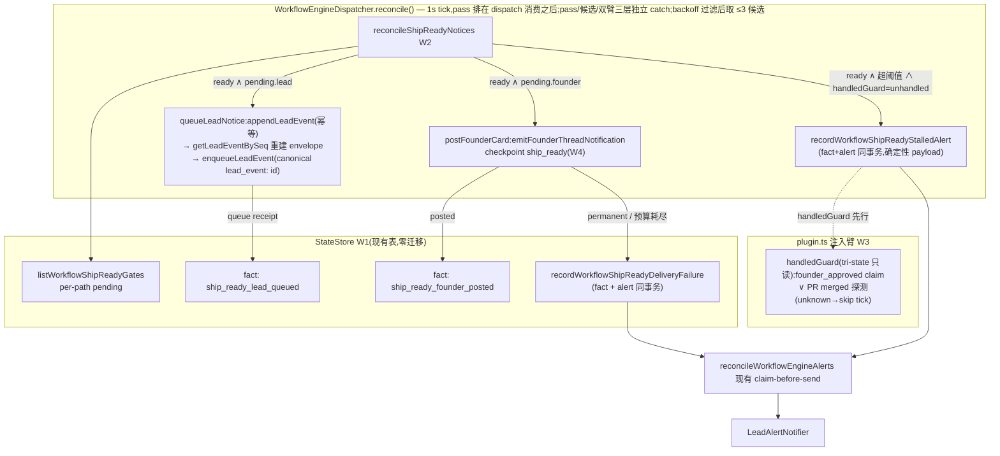

# FLY-1424 ship 就绪通知发射器 — 实施计划
Issue: FLY-1424 (https://linear.app/geoforge3d/issue/FLY-1424/enginebug1-founder-gate-变-ready-零宣告-接ship-就绪通知发射器谁-emit-emit-给谁-怎么判)
日期: 2026-07-22
基于: research.md
修订: R5(Codex design review R1 七项 + R2 六项 + R3 四项 + R4 三项全采纳。R4 增量:#1 `ship_ready_handled_observed` durable 收敛 fact(merged run 退出 stalled 扫描且不影响双路)、#2 500 护栏冻结为 warn-only 不截断、#3 founder retry map 生命周期清理)

---

## 0. founder 三问 → 定稿答案

1. **谁 emit**:引擎自己。`WorkflowEngineDispatcher.reconcile()`(Bridge 进程,1s tick)新增 ship-ready pass;Discord/lead 投递臂由 plugin.ts 注入(`landExecutor` 同款先例)。不依赖 Lead、不依赖 runner。
2. **emit 给谁**:双路,**各自独立的 durable fact,互不遮蔽**。① owning Lead:`lead_events` 行 + LeadInboxRuntime durable queue(1s LeadInboxLoop at-least-once 送达);② founder 本人:FLY-605 founder-thread 直发 @founder 进 issue thread,带 PR + QA 证据,不经 Lead 转达。
3. **怎么判 ready**:`engine_owned=1 ∧ status='active' ∧ current_node_id=terminal gate 节点 ∧ 该节点 state='review'(最新 attempt)∧ workflow_claims 无 founder_approved` → 对缺失的路补发;每路成功后写 per-path fact(`ship_ready_lead_queued:` / `ship_ready_founder_posted:`,uid 带 attempt),重复 tick / 重启不重发;kickback/重试后新 attempt 重新宣告。

**范围(Codex R1 #5 收窄)**:v1 非 land 工程模板 —— tpl_eng_heavy/light/trivial(qa→gate on qa_pass,ship_claims 含 qa_passed)。排除:land_v1(已有 holder→materializer 整链);**v2 三模板**(product/research/ops 是 no-code founder-review 语义,「ship/合并」文案对其是错误指令 → follow-up issue,见 §6)。

## 1. 目标 / 非目标

**目标**
- tpl_eng_heavy run 到 founder_gate 后 ≤10s(单候选常态):issue thread 出现 @founder ship-ready 卡(PR + QA 状态)∧ Lead 收到 `workflow_ship_ready` lead_event(durable queue receipt)。
- 每路各自幂等:重复 tick / Bridge 重启不重发;founder 路成功不遮蔽 Lead 路尾巴(反之亦然)。
- review 停留超阈值且**未处理**(handledGuard 过滤 PR 已 merge / 已有 founder_approved claim)→ alert outbox 提醒一次/attempt。
- 投递永久失败 / 预算耗尽 → fail-loud:终态 fact + 告警**同事务原子**落库。
- `FLYWHEEL_SHIP_READY_NOTIFY=0` 字节回落现状(default ON:本单修的就是「零宣告」bug)。

**非目标(诚实边界)**
- 卡片不是批准载体:✅/回复不自动落 `founder_approved` claim(权威守卫 land-only,`gate-authority-view.ts:53-58`;批准绑定随 FLY-1396 land 迁移获得)。ship 动作仍走现行 founder 表态 → Lead 执行合并。
- 不动 run 的 merge 后收尾/completed 语义;不动 land_v1 与 holder/materializer;不新增 CommDB 问题(terminal-session 准入/驱逐族问题,research F3/R7);不碰已退休的 `RETRYABLE_LEAD_EVENT_TYPES`(FLY-1393 后 heartbeat 重投恒关,R2 勘误)。
- v2 模板宣告 → follow-up issue。

## 2. 架构总览



## 3. 实施分块(顺序 = W0→W1→W4→W3→W2→W5;W6 归 QA 节点)

### W0 · 类型与 flag registry 先行(Codex R1 #7)

- `packages/teamlead/src/workflow-ship-ready.ts`(新文件)冻结三个类型:
  ```ts
  interface WorkflowShipReadyNotice {
    runId; issueId; issueIdentifier?;        // identifier 来源:sourceExecution session 行,缺则 issueId
    projectName; templateId;                  // templateId 来自 run 快照 manifest(卡文案用)
    gateNodeId; attempt; gateOpenedAt;        // workflow_run_node(gate).started_at
    sourceExecutionId;                        // 进 gate 的 edge_traversed:按 payload.targetNodeId+targetAttempt 匹配(事件 node_id 是 source 侧,不能直接用)
    ageMinutes;                               // 由 gateOpenedAt 派生,传给 notifier
    evidence: { headSha?: string; prNumber?: number; qaPassed: boolean };
    // per-path pending(Codex R2 #2:terminal fact 必须真 terminal):
    //   pending.lead    = !ship_ready_lead_queued
    //   pending.founder = !ship_ready_founder_posted && !ship_ready_delivery_failed
    pending: { lead: boolean; founder: boolean };
  }
  type ShipReadyFounderOutcome =
    | { kind: "posted" }
    | { kind: "transient"; reason: string; retryAfterMs?: number }
    | { kind: "permanent"; reason: string };   // 无 "already" —— durable fact 即其事实(Codex #3)
  interface ShipReadyMarkerPayload { path: "lead"|"founder"|"failed"; reason?; at }
  ```
- feature-flag registry(`packages/config/src/feature-flags/registry.ts`,drift guard 强制,`feature-flags-drift.test.ts:126-134`;registry `default` 类型为 `boolean | string`,Codex R2 #6a / R3 #2):
  - `FLYWHEEL_SHIP_READY_NOTIFY`:boolean,`default: true`,call-time 读(`!== "0"`),`toggleable: "direct"` + **directToggleProof 测试**(同一 dispatcher 实例 off↔on live mutation 生效);
  - `FLYWHEEL_SHIP_READY_REMIND_MS`:value,`default: "1800000"`(30min),**`toggleable: "readonly"`**(`isDirectToggleMetadata` 只允许 bool/有界 enum,value flag 声明 direct 会挂 direct-toggle 合同测试 —— 现有 TTL/grace numeric knob 同款 readonly);call-time 读,非法/非正 → 回默认;**不给 directToggleProof**,以 owning-parser 单测证明同一实例 call-time read 见到数值变化 + invalid→default。

### W1 · StateStore:readiness 查询 + per-path facts(`packages/teamlead/src/StateStore.ts`;现有表,零 schema 迁移)

```ts
listWorkflowShipReadyGates(input: { now: string }): WorkflowShipReadyNotice[]
// 谓词(R1):engine_owned=1 ∧ status='active' ∧ current_node_id=workflowApprovalGate(manifest).node
//   ∧ schema_version===1 ∧ !isWorkflowManifestV1Land(manifest)   ← 范围收窄:v1 非 land 工程
//   ∧ node(最新 attempt).state='review' ∧ 无 founder_approved claim
//   ∧ (pending.lead ∨ pending.founder)(见 W0 谓词:delivery_failed 终结 founder 路)
// 排序 gateOpenedAt ASC,返回**全集**(Codex R3 #1:固定 LIMIT 会队头阻塞 —— 20 条
// founder-backoff 候选可挡死第 21 条新 gate)。活跃停 gate 的 run 现实量级为个位~十位;
// **500 条护栏 = 仅 warning 阈值(Codex R4 #2):超限 fail-loud log 但仍返回完整数组,
// 绝不截断/中止(501 行合同测试兜住 visible-but-starving cap)**。每 tick 处理上限与
// per-path eligibility 全部在 W2 内存侧施加(backoff map 是 dispatcher in-process 状态)。
// evidence:qa 节点最新 attempt 的 qa_passed claim subject_digest(取值不裁决,
//   resolveEngineWorkflowShipClaims 同法定位,StateStore.ts:20038-20048)+ getWorkflowRunPrNumber;
//   缺失 → { qaPassed:false },照样宣告(宣告即安全网,卡上标注证据缺失)

recordWorkflowShipReadyFact(input: { runId; gateNodeId; attempt; path: "lead"|"founder"; now })
// appendWorkflowRunEventTx(uid=`ship_ready_${path==="lead"?"lead_queued":"founder_posted"}:<uid>`,
//   kind 同名);uid 冲突 → { ok:true, idempotentReplay:true }(不抛)

recordWorkflowShipReadyDeliveryFailure(input: { runId; gateNodeId; attempt; reason; alertIdentity; now })
// 新 public 方法内部单事务:fact 事件 `ship_ready_delivery_failed:<uid>` + 调 **private**
//   `enqueueWorkflowEngineAlertTx`(escalationUid=`ship_ready_delivery_failed:<uid>`)原子提交
//   (Codex R1 #4 + R2 #6b:不得在外层组合 public `enqueueWorkflowEngineAlert` —— 它自开事务
//   并 save,无法与 fact 原子)。幂等重放:fact 已在 → no-op 返 replay。

listWorkflowShipReadyStalled(input: { now; remindAfterMs }): WorkflowShipReadyNotice[]
// ready 基础谓词(不含 per-path fact 过滤 —— 已宣告未处理照样候选,Codex #2)
//   ∧ now - gateOpenedAt > remindAfterMs ∧ 无 `ship_ready_stalled_alerted:<uid>` fact
//   ∧ 无 `ship_ready_handled_observed:<uid>` fact(Codex R4 #1:merged run 的 durable 收敛)
// 返回全集(与 gates 查询同款 500-warn 语义,无固定前缀可被 UNKNOWN 消耗)
// handledGuard 在 W2 调用侧过(需 GitHub I/O,不进 StateStore)

recordWorkflowShipReadyHandledObserved(input: { runId; gateNodeId; attempt; reason: "pr_merged"; now })
// durable 收敛 fact `ship_ready_handled_observed:<uid>`(Codex R4 #1):只表示「提醒已无需发送」,
// **不冒充批准**、不进 ready 双路谓词(不抑制本来要发的 ship-ready 卡)。幂等重放 no-op。
// (founder_approved claim 情形无需此 fact —— ready 基础谓词已排除)

recordWorkflowShipReadyStalledAlert(input: {...})  // 同 failure 形态:public 方法内部
// fact `ship_ready_stalled_alerted:<uid>` + private enqueueWorkflowEngineAlertTx 同事务;
// escalationUid=`ship_ready_stalled:<uid>`,payload 确定性(含 gateOpenedAt,不含 now/age —— outbox
// 同 uid 要求 payload 字节相同,StateStore.ts:16575-16586)
```

- alert payload:扩 `WorkflowEngineAlertPayload.metadata.workflowEngine.disposition` 联合类型加 `ship_ready_stalled | ship_ready_delivery_failed`(`StateStore.ts:22593-22617`),新增 typed builder(现有 helper 只构造 held/partial 族)。

### W2 · dispatcher:ship-ready pass(`packages/teamlead/src/bridge/workflow-engine-dispatcher.ts`)

- Options 新增注入(landExecutor 同款,`:76-81`):
  ```ts
  shipReadyArm?: {
    queueLeadNotice(n: WorkflowShipReadyNotice): Promise<{ queued: boolean }>;
    postFounderCard(n: WorkflowShipReadyNotice): Promise<ShipReadyFounderOutcome>;
    classifyShipHandled(batch: readonly WorkflowShipReadyNotice[]): Promise<Map<string /*uid*/,
      | { kind: "handled"; reason: "pr_merged" | "founder_approved" }
      | { kind: "unhandled" }
      | { kind: "unknown" }>>;
    // batch manager(Codex R6 #2):每次 stalled 全集扫描调用一次(W2 在 finally 里
    // **必调,含空集**)—— 公平调度与 per-key 状态清理由同一 owner 完成,候选退出
    // 通过「本批不含该 key」被观察到。
    // tri-state 带原因(R2 #4 / R5 #1):checkPrMergeViaGh 超时/网络错返 unknown 不抛;
    // unknown/缺失 一律 skip-this-candidate,绝不映成 unhandled 去误告警;
    // 只有 reason:"pr_merged" 允许写 handled_observed fact(founder_approved 静默,
    // 由下一次基础查询的 claim 条件排除);返回 unhandled 前必须在 probe await 之后
    // **再读一次 founder_approved claim**(关闭 probe 期间 claim 到达的竞态)
  };
  ```
- **位置(Codex R2 #3)**:`reconcile()` 内插在 **dispatch 消费循环之后**(慢 Discord POST 不得推迟任何 engine dispatch;`reconciling` 互斥保证不并发)。**pass 整体 try/catch + 每候选独立 try/catch + 候选内双臂各自独立 try/catch**(Codex R2 #1:Lead queue 持续故障绝不阻止 founder 卡,反之亦然)。flag off 或未注入 → 零行为。
- **调度(Codex R2 #3 / R3 #1)**:`listWorkflowShipReadyGates` 返回全集(gateOpenedAt ASC)→ dispatcher 顺序扫描,**per-path eligibility**:`eligible = pending.lead ∨ (pending.founder ∧ founderRetryDue(uid))`(backoff map `Map<uid,{attempts, nextAttemptAtMs}>`,指数由 attempts 计算:base 30s、cap 5min、honor Retry-After;**backoff 只冻结 founder 臂,绝不冻结同候选的 Lead 臂**)→ 收齐 3 条 eligible 或扫完全集为止;进入候选后也只调 due 的臂。任意条 founder 全在 backoff 时,新 ready 与 lead-pending 候选当 tick 照发。
- 每候选(双臂互相独立):
  - **Lead 臂**:`pending.lead` → try { `queueLeadNotice` 成功 → fact(path:"lead") } catch { 记日志,保留 pending.lead,下 tick 重驱(幂等)} —— 不影响 founder 臂执行。
  - **founder 臂**:`pending.founder` → try { `postFounderCard`:
    - `posted` → fact(path:"founder");
    - `transient` → backoff map 记 attempts+1/nextAttemptAt;若 `now - gateOpenedAt > 45min`(durable 起点,跨重启)→ 按预算耗尽;
    - `permanent` / 预算耗尽 → `recordWorkflowShipReadyDeliveryFailure`(原子 fact+alert;此后 pending.founder 恒 false —— terminal 真 terminal,Codex R2 #2;Lead 臂若未完仍继续补)} catch { 同 transient 处置 }。
  - **stalled**:`listWorkflowShipReadyStalled`(全集)→ **一次** `classifyShipHandled(batch)`(**仅当查询成功**;成功返回 `[]` 才以空批调用触发全清 —— **查询抛错不得伪装空集**,否则清掉有效 backoff、恢复后提前重打 gh,Codex R7 #1;batch 即 lifecycle 信号,Codex R6 #2)→ 按返回 Map 逐候选:`{handled, reason:"pr_merged"}` → `recordWorkflowShipReadyHandledObserved(reason:"pr_merged")`(durable 收敛,之后不再进 stalled 扫描、Bridge 重启后不再 probe);`{handled, reason:"founder_approved"}` → 静默不写 merge fact(Codex R5 #1);`unknown`/缺失 → 跳过该候选本 tick 不告警;`unhandled` → `recordWorkflowShipReadyStalledAlert`。单候选失败在 manager 内部落 unknown,不影响同批其余候选(Codex R7 #1);整批抛错(结构性)→ 本 tick 全跳过。UNKNOWN 绝不消耗固定前缀挡住后面的 unhandled(公平性由 W3 batch manager 的选择规则保证,Codex R6 #1)。
- **in-process 状态生命周期(Codex R4 #3)**:founder retry map 条目在 posted / delivery_failed / 候选退出 ready 集合时立即 delete;每次全集扫描后 prune 掉不在当前候选集的 uid(长驻进程不积历史 attempt)。
- **上线 backfill 语义(Codex #6,显式决策)**:default-ON level scan 会在首次部署把**当时仍 active 停在 gate 的历史 run**(如未处理的 1375/1407 型)全部宣告 —— 这是特性不是事故(沉默 ship gate 正是本 bug),limit=3/tick 即节流;HTML 与 ship 说明须向 founder 预告部署日会有存量卡片浮出。已 merge 的历史 run 不会被 stalled 误报(handledGuard),但会收到一次 ship-ready 卡 —— 部署说明注明可忽略。

### W3 · plugin.ts:注入臂

- 组装 `shipReadyArm` 传入 dispatcher 构造,内部照抄 `workflowGateMaterializeTick` 的解析(`plugin.ts:7463-7477`):`resolveLeadForIssue` + `getChatThreadByIssue` + `lead.botToken ?? config.discordBotToken` + `config.discordOwnerUserId`。
- `queueLeadNotice`(Codex R2 #5 / R3 #3:按真实 API):
  1. `seq = store.appendLeadEvent(lead.agentId, "workflow_ship_ready:<uid>", "workflow_ship_ready", payload, sourceExecutionId)`(幂等,重复返既有 seq;重放时**不得**用新构造的 payload);
  2. 用 `store.getLeadEventBySeq(seq)` 的**持久化** payload/session_key/created_at 重建 envelope + content(byte-stable —— `LeadInboxQueue.enqueue` 拒绝同 id 不同 content,journal 重建才能让 crash/restart replay 过);**`created_at` 是 SQLite `datetime('now')` 形态(`YYYY-MM-DD HH:MM:SS`),必须经 `sqliteTimestampToIso` 转严格 UTC ISO 再进 `envelope.timestamp`(否则 enqueue 必抛 `createdAt must be a valid UTC ISO timestamp`)—— 从 `legacy-lead-event-reconciler.ts:68` 提取为共享的 journal-row→LeadEventEnvelope builder,两条 producer 共用不漂移**;
  3. `leadInboxRuntime.enqueueLeadEvent(envelope, content)` —— queue id 由 `lead-event-queue.ts` 固定生成 `lead_event:<leadId>:<eventId>`(canonical,**不是**自定 `ship_ready:` 前缀;调用方不可传 id)。
  两步全成才返 queued(fact 由 W2 写)。payload = HookPayload 惯例 + `status:"ship_ready"` + evidence + chat_thread_id。
- `postFounderCard`:`emitFounderThreadNotification({checkpoint:"ship_ready", questionId:uid, executionId:sourceExecutionId, ageMinutes: n.ageMinutes, summary: 证据文本, thread, botToken, ownerUserId})`;结果映射:`posted→posted`;`transient_failed→transient(retryAfterMs 透传)`;`skipped:no_chat_thread→transient`;`skipped 其余/permanent_failed→permanent(reason=skipReason|status)`。
- `classifyShipHandled`(batch manager,只读,Codex R2 #4 / R5 #1/#2 / R6 #1/#2):
  - 每候选判序:founder_approved claim 存在 → `{handled, reason:"founder_approved"}`;否则 prNumber 有 → PR merged 探测;merged → `{handled, reason:"pr_merged"}`;确认未 merge → **再读一次 founder_approved claim**(probe await 竞态闸)后 `{unhandled}`;prNumber 缺失且无 claim → `{unhandled}`。
  - 探测面:**只读**提取/复用 FLY-1238 的 definitive cache + single-flight + per-project probe budget(6 次/60s,`merged-gate-guard.ts:83,231-245`;不复用 `createMergedGateGuard` 整体 —— 其 MERGED 分支会 retire question/invalidate artifacts,是写路径);`checkPrMergeViaGh` 的 `{state:"unknown"}`(超时/网络)→ `{unknown}`。
  - **公平调度规则(冻结,Codex R6 #1 —— per-key backoff 单独不防 phase-lock)**:每个 project budget 窗口内,raw-probe 名额按 **`neverRawProbed 优先,其次 lastRawProbeAt ASC`** 从本批到期 key 中选取;`lastRawProbeAt` **只在真实 raw probe 后更新**(budget-UNKNOWN / cached-unknown 不更新任何排队状态,防同步 phase-lock);未获名额或 per-key backoff(30s→5min 指数)未到期的 key 返回 cached/unknown,不打 gh。该规则可证明轮转:任一旧 key 第二次 raw probe 前,所有 neverRawProbed key 必已各获一次。
  - **状态生命周期(Codex R6 #2)**:manager 持有全部 per-key 状态(backoff/lastRawProbeAt);每次 batch 调用在**内部 `finally`** 中 prune 不在本批的 key(空批 → 全清);definitive 结果即刻清 backoff。同 key 退出后再进入按全新 key 处理。不得每秒裸打 gh。
  - **per-key 故障隔离(Codex R7 #1)**:每个 uid 的 claim 读/project 解析/probe 分类各自独立 try/catch(或 `Promise.allSettled`),失败 key 落 `{kind:"unknown"}`,其余 key 照常产出 outcome —— `checkPrMerge` reject 会向外抛(`merged-gate-guard.ts:242-248` 只 `.finally`,不自动转 UNKNOWN),必须在 manager 内接住;仅「无法建立 batch 的结构性故障」允许整批抛。单 key 失败不得破坏 finally 里的 lifecycle prune。

### W4 · founder-thread-notifier:`ship_ready` 检查点(`packages/teamlead/src/bridge/founder-thread-notifier.ts`)

- `FounderGateCheckpoint` → `"brainstorm" | "approve_to_ship" | "ship_ready"`(`:33`)。
- `buildBody` 新分支(诚实文案,R3;PR/QA 行按 evidence 有无渲染):
  ```
  🚀 **Ship 就绪** — <identifier>
  <@founder>
  PR #<n>(head <short-sha>)· QA passed        ← evidence 缺失时:「⚠️ 证据缺失(无 qa_passed claim)」
  引擎已走完 <templateId> 流程,停在 founder gate 等 ship。
  Lead 已同步收到。要 ship 请在本 thread 表态,由 Lead 执行合并;此卡为通知,回复/✅ 不会自动记为批准。
  ```
- 现有 `approve_to_ship`/`brainstorm` 文案与审计事件名逐字不动(reverse-compat sentinel 断言)。

### W5 · 测试

| 层 | 覆盖 |
|---|---|
| StateStore 单测 | ready 谓词逐开关;per-path pending(lead fact 在→只补 founder;**delivery_failed 在→founder 永不再候选,lead 未完仍候选**);attempt 语义;land/v2 manifest 排除;evidence 降级;fact 幂等重放;stalled 独立于宣告 facts(已通知未处理→候选)且 **handled_observed 在→退出 stalled 候选、不影响双路 pending**;**failure/stalled 的 fact+alert 单事务原子(事务中途抛→两者都不在)**;alert payload 确定性 exact-replay 通过 + mismatch fail-closed;**501 行合同测:超 500 warn 但完整返回,不截断(Codex R4 #2)** |
| dispatcher 单测 | founder 四分支(posted/transient 退避/permanent 原子终态/45min 跨重启预算 —— 注入 now 推进);**双臂独立(Codex R2 #1):Lead 臂抛错→founder 仍 posted+fact;founder 臂抛错→Lead 仍 queued+fact**;**fault-injection 四例:appendLeadEvent 后崩、enqueue 后崩、同进程重驱、模拟重启(新实例)重驱 —— Lead 尾巴永不被 founder fact 压掉**;**队头(Codex R3 #1):20 条 founder-backoff 候选 + 第 21 条新 ready 当 tick 发出;founder 在 backoff 但 lead pending 的候选,Lead 臂当 tick 照驱**;**pass 在 dispatch 之后:慢通知不延迟既有 dispatch intent**;poison 候选不阻断其余候选与 dispatch;**stalled 收敛四例(Codex R4 #1):(a) merged 候选在前、unhandled 在后 → 后者同 tick 告警;(b) 重启后 merged 候选因 handled_observed 不再 probe;(c) handled fact 不抑制双路 ship-ready 卡;(d) UNKNOWN 候选不阻塞其后 unhandled**;handledGuard handled→写 handled_observed / unknown 与抛错→跳过该候选不告警 / unhandled→告警一次;**retry map 生命周期:posted/终态即删 + 全扫后 prune 失效 uid(Codex R4 #3)**;flag=0 零调用;**NOTIFY directToggleProof:同实例 off↔on live 生效;REMIND_MS owning-parser 测:call-time 数值变化生效 + invalid→default** |
| notifier 单测 | ship_ready 文案快照(有/无 evidence 两形态);既有两 checkpoint 字节不变 sentinel |
| plugin 集成 | 注入臂真跑:appendLeadEvent 幂等重放 + **getLeadEventBySeq journal 重建 → enqueue byte-stable(同 id 同 content 重放通过);时间戳用真实 appendLeadEvent 产出的 SQLite `datetime('now')` 值走 sqliteTimestampToIso(禁手造 ISO fixture,Codex R3 #3)** + canonical queue id `lead_event:` 形态;`workflow_ship_ready` 经 LeadInboxLoop mock adapter 送达;outcome 映射表全枚举;isShipHandled 带原因三态:**claim 在 guard 入口已存在→不误写 merge fact;claim 在 probe pending 间到达→不发 stalled alert(unhandled 前二次读);真实 merged→才落 pr_merged fact(Codex R5 #1 三例)** + cache/single-flight 不裸打 gh + **per-project probe budget 耗尽:同项目 distinct PR 返 unknown 且不再打 gh(Codex R3 #4)** + **公平调度(Codex R5 #2 / R6 #1,时钟推进确定性时间线):六个永久 UNKNOWN 在前、第七个 definitive PR 必须在任一旧 key 第二次 raw probe 之前被探测并收敛;budget-UNKNOWN 不推进排队状态** + **生命周期(R6 #2):UNKNOWN → 下一 pass 成功空批 → 全清 → 同 key 再进入按全新 key;查询失败≠空批(不清状态)** + **per-key 隔离(R7 #1):候选 A probe/解析抛错、候选 B definitive unhandled → 同 tick A 无提醒、B 照写 stalled alert、批外退出 key 仍被 prune** |
| 反向 sentinel | `FLYWHEEL_SHIP_READY_NOTIFY=0`:reconcile 全程零新事件/零 lead_events/零 POST(现状字节等同) |

### W6 · 真机 E2E(QA 节点执行;方案 = R8)

隔离房复现 1375/1407 场景:tpl_eng_heavy run 推到 qa_pass → 断言 ≤10s 双路出现;60s 幂等;调小 remind 阈值验 stalled 单发 + 预置 merged PR 验 handledGuard 静默;flag=0 全静默。

## 4. 验收映射(issue 验收 → 交付块)

| Issue 验收 | 落点 |
|---|---|
| founder_gate ready → N 秒内 thread 出 @founder ship-ready 卡(带 PR+QA 状态) | W1 evidence + W2 pass(1s tick)+ W3 postFounderCard + W4 文案 |
| Lead 收到 lead_event | W3 queueLeadNotice(lead_events + durable queue,LeadInboxLoop at-least-once) |
| 重复 reconcile tick 不重发(dedup) | W1 per-path facts(W5 fault-injection + W6 60s 断言) |
| 兜底:review 停留超时未处理 → 提醒 Lead | W1 stalled + W2 handledGuard + 原子 alert(单发/attempt) |
| 真机 E2E 复现 1375/1407 场景 | W6 |

## 5. 顺序与回滚

- 实施顺序 W0→W1→W4→W3→W2→W5(类型/registry 先冻结,Codex #7);单 PR 交付。
- 回滚:`FLYWHEEL_SHIP_READY_NOTIFY=0` 即回现状;无 schema 迁移;触碰面全加性(checkpoint 枚举、disposition 枚举、registry 两条、dispatcher 注入位)。
- 部署:纯 Bridge 侧 → 单次 Bridge 重启生效;**部署说明必须含 backfill 预告**(W2)。

## 6. Follow-up(本单不做,需开 issue)

- v2 模板(tpl_product_v1/research_light/ops_light)的 founder-review-ready 宣告:claim/能力驱动的 generic 合同 + no-code CTA 文案(Codex #5)。
- v1 非 land 的批准绑定 + run 收尾语义:随 FLY-1396 land binding 迁移路线获得,不在此重建。
