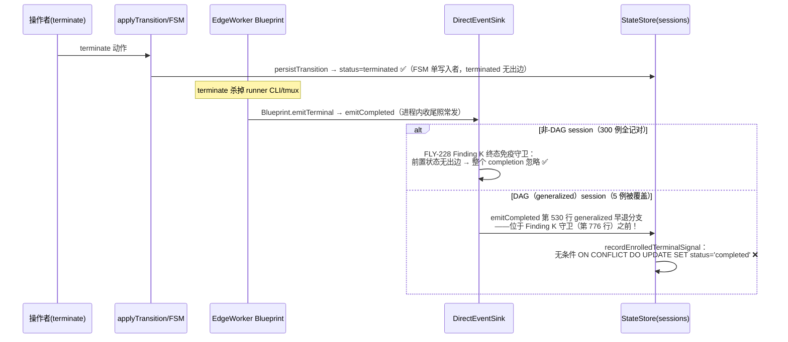

# FLY-1427 DAG 收尾第二写入者覆盖 terminate 终态 — 探索

Issue: FLY-1427 (https://linear.app/geoforge3d/issue/FLY-1427/enginebug5-dag-收尾第二写入者覆盖-terminate-终态completed-骗写-终态单写入者-覆盖保护)
日期: 2026-07-22
基于: 无

## 1. 问题一句话

被人为 terminate（中止、零产出）的 DAG 节点 session，在库里被随后到达的 `session_completed` 覆盖成「成功完成」——语义写反：任何读 `sessions.status` 的面板/日报都会把被杀掉的活算成干完的活。

## 2. 事故实证（本机生产 DB 复核，2026-07-22）

对 `~/.flywheel/teamlead.db` 只读查询，谓词「status='completed' 且 session_events 里存在 `state_transition → terminated`」精确命中 **5 行**，与 Aunt Cass 定界完全一致：

| execution_id | issue | status | session_stage | 最后活动 |
|---|---|---|---|---|
| 88d06933… | FLY-1412 | completed | started | 07-22 06:57:06 |
| 57e09567… | FLY-1412 | completed | started | 07-22 06:23:36 |
| a955657f… | FLY-1414 | completed | started | 07-22 01:20:08 |
| 7b76d2a0… | FLY-1413 | completed | started | 07-22 00:59:55 |
| c80fad41… | FLY-1414 | completed | started | 07-22 00:59:53 |

两条典型事件时序（session_events 原始记录）：

```
06:57:04  state_transition   source=fsm                {"from":"running","to":"terminated","trigger":"terminate"}
06:57:06  session_completed  source=direct-event-sink  {"failureKind":null,"lastError":null}
```

关键指纹：覆盖者的 `session_completed` 事件 **source=direct-event-sink**，payload 形状 `{failureKind, lastError}` 与 `StateStore.recordEnrolledTerminalSignal` 的插入语句逐字吻合（`StateStore.ts:16274`）。5 行全部是 **generalized workflow（DAG）design 节点**，对应 workflow_run_node.state 至今停在 `running`，三个 run 状态为 `held`（engine_owned=1）。

当前库里 completed 总数 868；`completed AND session_stage='started'` 共 32 行（5 行是本单覆盖事故，另 27 行无 terminate 转移，属独立 staleness，**本单不修**）。

## 3. 根因链（为什么只有 DAG 中招）



三个叠加缺陷：

1. **旁路口在守卫之前**：`DirectEventSink.emitCompleted` 对 enrolled（DAG）execution 在第 530 行早退走 `recordEnrolledTerminalSignal`，而 FLY-228 的终态免疫守卫在第 776 行——DAG 路径根本走不到守卫。`emitFailed`（第 1145 行）同构。
2. **写入者本身无守卫**：`StateStore.recordEnrolledTerminalSignal`（16284 行）读了 `previousStatus` 却只用于时间戳/revision，session 状态是无条件 upsert 覆盖。
3. **姊妹写入者同病**：`commitEnrolledCompletion → projectGeneralizedCompletionTx`（17727 行）同样无条件 `SET status='completed'`（flywheel-comm 携带路径；当晚没开火，但洞是同一类）。

FSM 本身是对的：`WORKFLOW_TRANSITIONS.terminated = []`（无出边终态），`applyTransition` 会拒绝任何 terminated→X。问题是 DAG 收尾的两个写入者**绕过了 FSM**直接写库——正是 issue 标题说的「第二写入者」。

## 4. 为什么非-DAG 全记对（300/300）

非-DAG 的三条终态写入路径都有护栏：
- HTTP `/events` sink → `applyTransition`（FSM 拒绝无出边终态的一切出边）；
- 进程内 `DirectEventSink` 普通分支 → FLY-228 Finding K 守卫（`WORKFLOW_TRANSITIONS[status].length === 0` → 忽略）；
- `complete-marker-reconciler` → 显式 `status !== 'running'` 守卫。

**只有 enrolled（DAG）分支是新引入的旁路**——与 issue 判断「新引入非历史积弊」一致。

## 5. 修法方向（issue 修法逐条落位）

1. **单一终态写入者语义**：不是把 StateStore 的多表事务改道 FSM 机器（那要把 fsm 注入 StateStore，动静大），而是让两个 enrolled 写入者**执行 FSM 的终态语义**：以 `WORKFLOW_TRANSITIONS` 无出边集合（approved/completed/shelved/terminated）为单一事实来源做覆盖免疫——与 FLY-228 守卫同源同语义。
2. **覆盖保护（CAS）**：守卫放进 StateStore 写事务内部（读 previousStatus 与写在同一 SQLite 事务，单进程同步执行即天然 CAS）：
   - `recordEnrolledTerminalSignal`：前置状态无出边且 ≠ 新状态 → **保留 status**（跳过 session 状态写 + revision bump），但**照常记 session_events 审计 + teardown fact**（进程确实死了，run 收尾账要平）；
   - `commitEnrolledCompletion`：前置状态无出边且 ≠ completed → 整单拒绝（不落 completion receipt、不推进引擎——被杀掉的执行的产出不算数）；
   - `projectGeneralizedCompletionTx`：同守卫兜底（防 crash-窗口 replay 复活覆盖）。
3. **存量清理**：5 行修正回 terminated（一次性、幂等、带审计事件）。
4. **27 行 staleness**：不动，另判是否立单。

## 6. 边界（本设计不做什么）

- 不改 FSM 转移表、不改非-DAG 的任何写入路径字节。
- 不修 `session_stage` staleness 家族（27 行）。
- 不动 workflow_run/node 级的 held/running 收尾语义（dead-exec sweep / FLY-1385 已有机制管节点命运）。
- 不做 DB trigger 级硬约束（评估过，作为 rejected alternative 记录在 research）。
