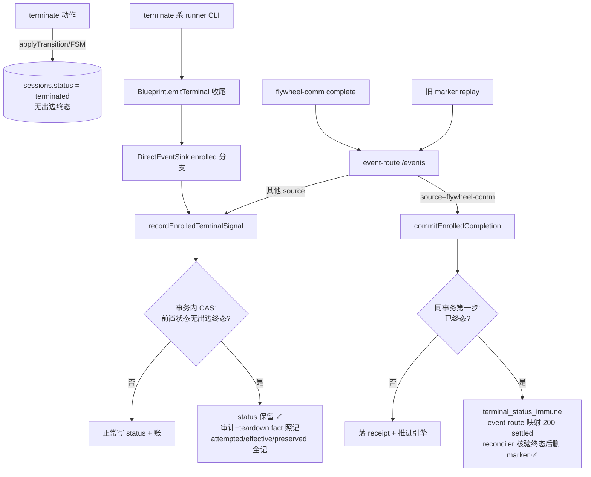

# FLY-1427 终态单写入者 + 覆盖保护 — 实施计划

Issue: FLY-1427 (https://linear.app/geoforge3d/issue/FLY-1427/enginebug5-dag-收尾第二写入者覆盖-terminate-终态completed-骗写-终态单写入者-覆盖保护)
日期: 2026-07-22
基于: research.md
修订: R2（吸收 Codex design review Round 1 全部 5 项）

## 0. 一句话方案

以 FSM 无出边终态集合（`approved/completed/shelved/terminated`）为单一事实来源，在 StateStore 的两个 enrolled（DAG）写入者**事务内部**加 CAS 覆盖免疫；`flywheel-comm` 完成提交对已终态执行整单拒绝并以 200-settled 形态回给 CLI，marker reconciler 同步消费该形态；定点修正存量 5 行回 terminated。非-DAG 路径行为不变（Finding K 判据换共享 helper，源码变、语义等价）。

## 1. 改动清单（按文件）

### 1.1 `packages/core/src/workflow-fsm.ts` + `packages/core/src/index.ts` — 共享判据

workflow-fsm.ts 新增导出（放 `isTerminal` 旁）：

```ts
/** FLY-1427: a status is overwrite-immune iff it has zero out-edges in the
 *  transition map. Unknown/absent statuses are NOT immune (can't prove). */
export function isNoOutEdgeTerminalStatus(status: string | undefined): boolean {
	return (
		status !== undefined &&
		(WORKFLOW_TRANSITIONS[status]?.length ?? -1) === 0
	);
}
```

语义与 FLY-228 Finding K 守卫逐字同源（`(WORKFLOW_TRANSITIONS[s]?.length ?? -1) === 0`）。

**（R1-#1）`packages/core/src/index.ts` 的显式 export list 必须同步加入 `isNoOutEdgeTerminalStatus`**——包 main/types 指向 dist/index，漏加则 teamlead 的 `from "flywheel-core"` import 在 typecheck/build 即失败。配 core 单测（四个无出边状态 true、有出边/未知/undefined false）+ 至少一个 package-root import 测试。

### 1.2 `packages/teamlead/src/StateStore.ts` — 两个 enrolled 写入者加 CAS

**(a) `recordEnrolledTerminalSignal`（~16198 行）**

返回契约（R1-#3）：ok-形态改为携带 `{ attemptedStatus, effectiveStatus, statusPreserved }`（`status` 字段保留 = attemptedStatus，兼容既有读点；`effectiveStatus` = 本次调用后 session 的实际状态）。**fresh 与幂等 replay 两条腿都必须计算同一组权威值**——replay 腿（16241-16262，早于 previousStatus 读取即返回）不能沿用默认 false，否则同 event_id 第二次 replay 的 HTTP 可观测值与 CommDB enqueue 决策会和第一次分叉。replay 腿实现：在事务内读当前 session status，重算 `statusPreserved = isNoOutEdgeTerminalStatus(current) && current !== attemptedStatus`（保护过的 replay 重算恒 true——current 仍是被保留的终态）。

fresh 腿：在既有事务内、`previousStatus` 读取之后：

```ts
const statusPreserved =
	isNoOutEdgeTerminalStatus(previousStatus) && previousStatus !== status;
if (statusPreserved) {
	console.warn(`[StateStore] FLY-1427 terminal-immune: ... status preserved, teardown fact still recorded`);
} else {
	/* 现有 sessions upsert + applyTerminalTimestamp + bumpLifecycleRevision 原样 */
}
```

- session_events 生命周期审计 + `generalized_teardown_recorded` fact **照常落**（run 收尾账要平）。
- **teardown fact payload 增记 `attemptedStatus / effectiveStatus / statusPreserved`**（R1-#3）——防审计里 `status:'completed'` 被误读为实际投影。

**(b) `commitEnrolledCompletion`（~17763 行）**

（R1-#4）免疫检查**必须是 receipt/engine transition 所在事务（17846-17898）的第一步**——事务外 `getSession()` 预检只是提示，不是 CAS。实现模式沿用现有 `transitionRefusal` 局部变量：

```ts
let terminalImmuneRefusal = false;
this.db.transaction(() => {
	const sessionStatus = this.getSession(input.executionId)?.status;
	if (isNoOutEdgeTerminalStatus(sessionStatus) && sessionStatus !== "completed") {
		terminalImmuneRefusal = true;
		throw new Error("engine_completion_terminal_immune");
	}
	/* 既有 receipt insert + commitWorkflowTransitionTx + projection 原样 */
});
// catch: terminalImmuneRefusal → return { ok:false, reason:"terminal_status_immune" }
```

- 现有 catch 会把 transition refusal 压成 `transition_refused`——`terminal_status_immune` 必须经独立局部变量原样带出。
- 不落 receipt、不推进引擎；replay 腿（receipt 已存在）不加此检查，由 (c) 投影守卫兜底。
- `WorkflowCompletionResult`（StateStore 内部封闭 union，生产唯一消费方 event-route）reason 加 `terminal_status_immune`。

**(c) `projectGeneralizedCompletionTx`（~17715 行）**

`previousStatus` 读取后：`statusImmune = isNoOutEdgeTerminalStatus(previousStatus) && previousStatus !== "completed"` → 跳过 sessions upsert + `applyTerminalTimestamp` + `bumpLifecycleRevision`（loud warn），`workflow_run_node SET state='done'` 照写（节点账与 session 终态语义两本账各记各的）。

（R1-#4 修订定位）fresh 路径的 receipt+transition+projection 本就在同一事务，**不存在** "receipt 落库后、投影前 crash" 的原子性缺口——此守卫的诚实定位是 **legacy/不一致 receipt 形态与 `observeEnrolledTeardown`（现仅测试引用）的纵深防御**，测试用显式 seed legacy receipt 构造，不得声称正常 fresh 事务能留下半提交态。

**(d) 存量 backfill（构造函数迁移区末尾，schema ALTER 之后；`StateStore.create()` 返回实例前同步执行）**

```ts
// FLY-1427: one-shot correction — 5 prod rows whose FSM terminate 终态被
// DAG 收尾 completion 覆盖 (2026-07-22 incident)。幂等:status 仍为
// 'completed' 才动;deterministic event_id 去重 audit。
const FLY1427_OVERWRITTEN_EXECUTIONS = [
	"88d06933-5795-4d21-aea0-db51930d7171", // FLY-1412
	"57e09567-68ba-49de-9448-9bcbc143c1d5", // FLY-1412
	"a955657f-010b-4527-99c4-5c0ef6714e8d", // FLY-1414
	"7b76d2a0-5a0a-45f1-9d29-09f14b57846c", // FLY-1413
	"c80fad41-998b-4843-b756-8886547049a8", // FLY-1414
];
```

每个 id 一个事务：`status === 'completed'` 才动 → `UPDATE sessions SET status='terminated'` + `bumpLifecycleRevision` + `INSERT OR IGNORE session_events(event_id='fly1427:'+execId, event_type='state_correction', source='fly-1427-backfill', payload={from:'completed',to:'terminated',reason:'FLY-1427'})`。
- `terminal_at` 不动（terminate 时的首 stamp 仍正确）。`session_stage` 不动（诚实值）。
- 非生产库（QA slot/测试）谓词恒空，天然 no-op。

### 1.3 `packages/teamlead/src/DirectEventSink.ts` — 调用方收口

- `emitCompleted` enrolled 早退分支（~530 行）：`recorded.ok && recorded.statusPreserved` → loud warn（含 FLY-1427 标记），行为照旧 return。
- `emitFailed` enrolled 早退分支（~1146 行）：`recorded.statusPreserved` 时**跳过** `enqueueTerminalCommDbStatus`（不给 CommDB 造 failed/blocked 假账）；replay 腿因契约 (a) 重算，同样正确跳过。
- 既有 Finding K 内联判据（~778 行）换用 `isNoOutEdgeTerminalStatus`（源码变化、行为等价——见 §0 表述）。

### 1.4 `packages/teamlead/src/bridge/event-route.ts` — 载体收口

- `session_completed` source=flywheel-comm 腿（~677 行）：`completion.reason === "terminal_status_immune"` → **200** `{ok:true, generalized:true, settled:"terminal_status_immune"}`（镜像 `stale_execution_superseded` 形态）。**不得走 409**——否则 CLI 重试烧尽后写 marker，进 reconciler 循环。
- `session_completed`/`session_failed` 非-flywheel-comm 腿（~733/767 行）：200 响应透传 `statusPreserved: recorded.statusPreserved`（可观测性；replay 与 fresh 一致，由 1.2(a) 契约保证）。

### 1.5 `packages/teamlead/src/bridge/complete-marker-reconciler.ts` — 旧 marker 收敛（R1-#2，新增）

现状：generalized replay 仅特判 `settled === 'stale_execution_superseded'`（627-631 行）删 marker；其他 2xx 要求看到 completion receipt + canonical audit（632-653），否则 `transient_failed` 保留 marker（654-659）。`terminal_status_immune` 刻意不写 receipt → 修复前遗留的旧 marker 会**永久重放**。

改动：replay 响应 `settled === 'terminal_status_immune'` 时——**重读 session，确认当前状态仍是无出边终态且 ≠ completed 才 unlink marker**（返回 reconciled/duplicate-terminal 形态）；验证不成立则保留 marker，不得盲信 200。配单测 + 真实 event-route 集成：terminated generalized session + marker + 无 receipt/audit → 一次 replay 后 marker 删除、session/node/run 均未被推进。

## 2. 数据流（修后）



## 3. 测试矩阵（TDD，先红后绿）

**flywheel-core 单测**：

| # | 场景 | 断言 |
|---|------|------|
| 0a | `isNoOutEdgeTerminalStatus` 全表 | approved/completed/shelved/terminated=true；running/failed/blocked/未知/undefined=false |
| 0b | package-root import | `import { isNoOutEdgeTerminalStatus } from "flywheel-core"` 可解析（R1-#1） |

**StateStore 单测**（扩展 generalized-execution 套件或新建 `StateStore.fly1427-terminal-immunity.test.ts`）：

| # | 场景 | 断言 |
|---|------|------|
| 1 | 基线：enrolled running → terminal signal completed | status=completed（不回归） |
| 2 | terminated → terminal signal completed | status 保持 terminated；`statusPreserved:true`，`effectiveStatus:'terminated'`；session_events 有 session_completed；teardown fact 已记且 payload 含 attempted/effective/preserved；revision/terminal_at 未变 |
| 3 | terminated → terminal signal failed / goal_blocked | 同 2（blocked 映射也被免疫） |
| 4 | shelved / approved → terminal signal completed | 同 2（免疫集参数化全覆盖） |
| 5 | **同 event_id protected replay**（R1-#3） | 第二次调用：fact 仍只一条；revision/timestamp 不变；`statusPreserved` 仍 true；effectiveStatus 一致 |
| 6 | terminated → commitEnrolledCompletion（fresh） | `ok:false, reason:'terminal_status_immune'`；无 receipt 行；node state 不变；无引擎推进事件；**检查发生在事务内**（实现走 terminalImmuneRefusal 变量路径） |
| 7 | **seed legacy receipt** + session terminated → replay 腿（同 digest 再提交） | replay `ok:true`；session 保持 terminated；node state='done'（R1-#4 修订后的 seeding 方式） |
| 8 | completed → commitEnrolledCompletion replay | 字节兼容：idempotentReplay，session 保持 completed |
| 9 | failed → terminal signal completed | **现状保留**（failed 有出边、不在免疫集，仍写 completed）——已知诚实边界 |
| 10 | backfill：seed 5 个真实 execution_id + status=completed → new StateStore() | 5 行全部 terminated；audit 事件存在；revision 已 bump；**第二次构造 no-op** |
| 11 | backfill：同 id 但 status 已是 terminated / 空库 | 不动 / no-op |

**DirectEventSink 单测**：

| # | 场景 | 断言 |
|---|------|------|
| 12 | enrolled + terminated → emitCompleted | status 保持；loud warn |
| 13 | enrolled + terminated → emitFailed（fresh + 同 event_id replay 各一次） | status 保持；`terminalCommDbSync.enqueue` 两次都**未被调用** |
| 14 | 非-enrolled 全套件 | 既有测试全绿（行为兼容） |

**event-route / reconciler 集成测**：

| # | 场景 | 断言 |
|---|------|------|
| 15 | POST session_completed source=flywheel-comm，enrolled 已 terminated | **200** + `settled:'terminal_status_immune'`（绝非 409） |
| 16 | POST session_completed source=orchestrator，enrolled 已 terminated | 200 `held_recorded` + `statusPreserved:true` |
| 17 | **旧 marker 收敛**（R1-#2）：terminated generalized session + marker + 无 receipt/audit | 一次 replay 后 marker **删除**；session/node/run 未被推进 |
| 18 | marker replay 但 session 当前状态验证不成立（如 running） | marker **保留**（不盲信 200） |
| 19 | **5 例回归**：按生产事件时序重放（started → FSM terminate → 进程内 emitCompleted）×5 | 最终 status 全部 terminated |

**run 级边界测（R1-#5）**：

| # | 场景 | 断言 |
|---|------|------|
| 20 | active run + 无 output 的 execution 被 terminate → dead-exec sweep | 既有 recovery 接管（收敛端到端） |
| 21 | held run（事故形态）终态修正后 | run/node 保持 held/running，**不自动推进**（显式 operator hold 语义） |

## 4. 验收（issue 逐条）

1. 注入「DAG run 中途 terminate」→ 库里终态保持 terminated：测试 2/12/15/16 + 部署后真机注入一次。
2. 回归覆盖 5 例场景：测试 19 + 测试 10。
3. 存量：生产 Bridge 重启后，只读语义谓词（`status='completed' AND EXISTS state_transition→terminated`）**归零**（before 基线 = 5 行 → 0 行）。
4. 27 行 staleness：验收查询确认仍是 27 行、未被本单误伤。
5. （R1-#5）**3 个 held run（FLY-1412/1413/1414）的人工处置归属**写入 ship runbook：session 终态修正 ≠ run 收敛；`settled` 200 只表示 completion 请求得到永久裁决，不表示 DAG run 已 settled。是否 retry/放弃由 Lead/founder 决定。

## 5. 部署与回滚

- flywheel-core helper + teamlead（StateStore/DirectEventSink/event-route/complete-marker-reconciler）→ **单次 Bridge 重启**部署；无需重启 Lead/Runner。遵守 Bridge ship 纪律（先改配置后杀、精准杀 run-bridge 树）。
- 部署前抓 before 基线（语义谓词 5 行存档），部署效果由独立 QA 复核（不由部署者自报）。
- 回滚：revert PR + Bridge 重启。backfill 已跑的 5 行不随回滚复原（terminated 本就是正确值，回滚无害）。

## 6. Out of scope（诚实边界）

- 27 行「completed 但 stage 停在 started、无 terminate 转移」staleness —— 另判立单。
- **run/node 级收敛（R1-#5 收窄表述）**：dead-exec dispatcher 只枚举 `listActiveWorkflowRuns()`——held run 不进 sweep；execution 已写 output 时 dead-exec 会把 active run 置 held 而非自动 replacement。故承诺仅为「active + 无 output 的 execution 由 dead-exec recovery 接管；held / output-written 维持显式 operator hold」。事故中的 3 个 held run 走人工处置（§4-5）。
- failed→completed 等「有出边但 FSM 非法」的写（测试 9）—— 完整 FSM 边校验被否决（research §5-B），留观察项。
- `upsertSession` 通用层守卫（research §5-C）—— 11 个调用方各有守卫且生产证据干净。
