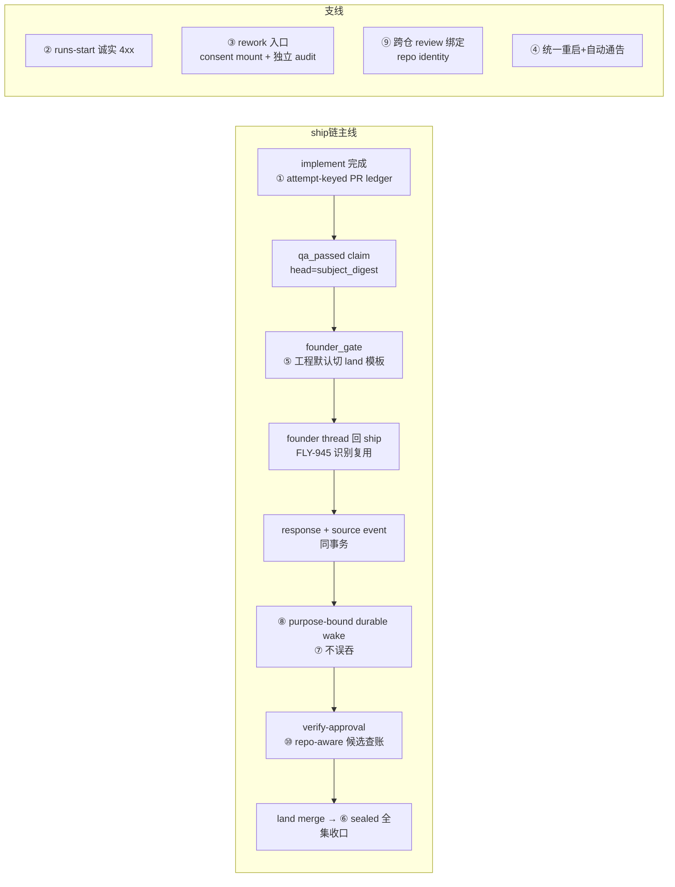

# FLY-1434 DAG ship 链小修族批 — 实施计划

Issue: FLY-1434 (https://linear.app/geoforge3d/issue/FLY-1434/engine族批-dag-ship-链小修-3-统一重启改造-pr-回写绑定-runs-start-假成功-闭-run-rework-入口)
日期: 2026-07-23（v16，纳入 Codex design review R1-R15 全部意见 + Lead 批复条件（c302446a：⑤ 双真机验收钉死、③ 增 Lead 只读诊断面）；nested repo 只做 review 声明与隔离落账，**自动 ship verify / land / merge 对 nested 一律统一拒绝**）
基于: research.md

## 0. 总览

2026-07-22 DAG ship 链首夜实测暴露的 10 项引擎/运维缺陷合批修（①-⑥ issue 正文 + ⑦-⑩ Tadashi 派单前增补）。每项独立可验收；按闭环耦合分 4 个 PR、显式部署序交付（§12）。



**贯穿概念（⑥⑨⑩ 共享）— canonical `target_repo_identity`**（R3-7 定稿，弃 NULL 语义）：identity 域 = **`'__main__'` 哨兵 ∪ 规范化 `owner/repo`**。target 是 session 主 worktree → `'__main__'`；nested/外部 repo → 服务端从 `git remote get-url origin` 规范化派生（无 remote → fail-closed 拒绝）。列一律 **NOT NULL**；存量行迁移时统一回填 `'__main__'`（⑨ 落地前所有 review 都在主仓，定义上成立，迁移无需 git 访问）。授权比较一律 exact；**GitHub probe 用配套 `probe_repo_slug`（`'__main__'` 由 helper 解析为项目主 remote canonical slug 后冻结）**。schema 演进契约（R5-5 统一口径）：加列类改动 = expand（DEFAULT 兼容）；`codex_review_record` 主键改动 = **quiescent roll-forward-only 原子 cutover**（§10.1），本单无 contract 阶段。

## 1. ① PR 回写绑定（主项）

**根因**（research §①）：DAG enrolled 完成绕过全部 legacy PR 写入器（`event-route.ts:769-808`），且 `needs_review` 路由本就不产 PR evidence（`complete.ts:207-223,502-519`）、generalized Blueprint 不带 `--pr`（`Blueprint.ts:1597-1600`）。生产者+消费者一起修。

**方案**：
1. **生产端（保留现有 wire shape，R2-4；nested 输入补全，R5-2）**：`flywheel-comm complete --route needs_review --pr <N> [--target-repo <rel>]` → evidence 形状沿用现契约：**top-level `evidence.headSha`** + `landingStatus: { status: 'ready_to_merge', prNumber, targetRepoPath? }`（与 `event-route.ts:702-714` 现读取面一致，只加可选字段）。**identity 永不由 caller 自报**：服务端按 §9 realpath+remote 规则从 `targetRepoPath` 派生；省略 = `'__main__'`。generalized Blueprint implement 指引文本加 `--pr` 要求。未带 `--pr` = evidence 缺省，消费端不写、可观测 warning（不 fail-close 完成）。
2. **持久层（attempt-keyed ledger，R2-4；canonical schema 列全，R5-5）**：新表
   `workflow_node_pr_binding(run_id, node_id, attempt, pr_number, head_sha, target_repo_identity TEXT NOT NULL DEFAULT '__main__', probe_repo_slug TEXT NOT NULL, target_repo_path TEXT NOT NULL CHECK(length(target_repo_path) > 0), worktree_binding_generation TEXT NOT NULL, receipt_id, bound_at, PRIMARY KEY(run_id, node_id, attempt))`
   （R7-3 + R8-2：`target_repo_path` = authority root 下 canonical realpath；`worktree_binding_generation` 冻结 set-once worktree binding 的 generation/ID 证明来源，binding 或 generation 缺失统一 422 fail-closed；probe_repo_slug 由 §0 helper 在写入时解析冻结，解析失败拒 evidence）
   在 `commitEnrolledCompletion` 同事务写入：
   - 边界校验：prNumber 正整数、headSha 40-hex；
   - **head authority 服务端派生（R6-2：caller 自证不成立）**：现 HTTP generalized 路径把 `evidence.headSha` 直接当 transition `subjectDigest`（`event-route.ts:693-714,760-768` → `StateStore.ts:20636-20688`）= 自证。改为：Bridge 从 **set-once worktree binding**（非 display-only `sessions.worktree_path`）解析 + realpath 校验 canonical target root，**独立执行 `git -C <canonical-target> rev-parse HEAD`**——只有该服务端值可作 `subjectDigest` 与 ledger `head_sha`；caller `evidence.headSha` 仅作 exact compare（不一致 → 拒 evidence + warning，completion 照常）。CLI `collectEvidence` 同步在 canonical target root 采集 HEAD/base/diff/log（主仓缺省 = 现行为不变）。测试：caller head 伪报拒、symlink swap/TOCTOU、落账 digest 确为服务端 HEAD；
   - **replay CAS 规则（幂等 payload = 全元组，R6-3 + R7-3）**：同 `receipt_id` 重放先验 payload digest（`pr_number, head_sha, target_repo_identity, probe_repo_slug, target_repo_path, worktree_binding_generation` 全元组）一致才幂等 no-op（同 receipt/同 head 但 path 或 generation 不同 = fail-closed，测试钉死）；更高 attempt 写入 = 新行（允许前移）；**低于当前最大 attempt 的写入 = 拒绝**；同 attempt **任一** authority 字段不同 = fail-closed 拒写 + warning。path/generation 同步纳入 session/ship-binding 投影规则。
3. **session 投影**：`sessions.pr_number/pr_head_sha` 只从该 run/node 的**当前最大 attempt** 绑定行投影（同事务）；rework 新 attempt 天然前移，无 COALESCE 问题。
4. **DirectEventSink**：generalized 分支（`DirectEventSink.ts:506-550`）显式拒绝承载 PR evidence（断言 + 注释导向 HTTP /events）。
5. **读侧（R8-1 修正 + R14-1 全调用点收口）**：现 `getWorkflowRunPrNumber`（`StateStore.ts:25057-25083`）遍历同 issue 全部 sessions、head 不中还退化「issue 恰一 PR」不校验 head。新增 **ledger-native accessor `getCurrentWorkflowNodePrBindingForHead(runId, headSha)`**：只在各节点**当前最大 attempt** 行中 exact 匹配，唯一完整 authority tuple，零/多行 fail-closed，**绝不走 issue 级/single-PR fallback**。**Bridge 生产调用点全部切换（R14-1 逐点列出）**：`approval-signal/gate-authority-view.ts:65`、`workflow-engine-dispatcher.ts:1357`、`land-executor.ts:157`、`plugin.ts:5738`——旧 accessor 仅 `StateStore.ts:23899` 的 legacy non-land `workflow_ship_ready` characterization 保留；**repo-wide 断言测试**：Bridge 生产代码零残留 `getWorkflowRunPrNumber`（characterization 位点除外）。阴性测试：同 issue 双 run / 旧 attempt / head 不中但 issue 仅一 PR / 同 head 冲突 tuple。

**验收**（R5-5 统一口径）：新工程 DAG 单 implement 完成后 ledger 行 + session 投影非空，**holder/land-operation 经 exact binding 取到真 PR**（主验收）；`workflow_ship_ready` 的 PR 显示仅作 legacy non-land 单对照项。
**测试**：CLI 单测（wire shape 兼容断言 + target-repo 派生）+ ledger CAS 矩阵（同 receipt 重放 / 高 attempt 前移 / 低 attempt 拒 / 同 attempt 冲突 / head≠subjectDigest 拒 / slug 解析失败拒）+ 三段式 characterization 对照。

## 2. ② /api/runs/start 假成功 → 诚实 4xx

**方案**（R1 后无新意见，维持 v2）：
1. 缓存回放前存活校验（权威 = reservation + current node/attempt）：run `status !== 'active'` → **409 `RUN_NOT_REWORKABLE_VIA_START`**（body `{ success:false, code, runId, runStatus, hint: "use /api/runs/:runId/rework" }`）；run active 但 `priorResponse.executionId` 非当前 attempt 活跃绑定 → **409 `STALE_START_RESPONSE`**。
2. 合法回放边界：run active 且 execution 为当前活跃绑定（202 在途形态 `:2077-2100` 不变）。
3. `exactActiveEngineStartSession` 豁免（`:643-645`）加同样校验（1418 形态）。
4. 新原因码入 `GENERALIZED_*` 族。

**验收/测试**：同 v2（三形态集成 + 在途阳性对照）。

## 3. ③ completed/blocked run 的 rework 入口

**R2-2/3 修正**：consent off 模式全局契约不动（off = 无 evaluator 无 consent-audit，`middleware.ts:33-46`/`wiring.ts:254-265` 现实）——本端点的审计**独立于 consent**、always-on；replacement 语义按现 schema 重写。

**方案**：
1. **路由与授权**：`POST /api/runs/:runId/rework`，loopback + master token 基线。**consent 接线 = 新增专用 run-rework mount/action**，注册项全列（R3-3，不留实施决定）：
   - `ActionKey = 'workflow_rework'`；**新增 `ActionClassKind = 'run_lifecycle'`**（R4-1：现 SSOT 只有 lifecycle/ship_gate/issue_lifecycle，`kind==='lifecycle'` 会进 `LIFECYCLE_ACTIONS`（`reserved-endpoints.ts:148,281-290`）——新 kind + SSOT coverage/filter 同步，确保**不**进 `LIFECYCLE_ACTIONS`/Lead gateway）；
   - **metadata 列全（R5-4：`ActionClassMeta` 必填字段 `reserved-endpoints.ts:151-164`）**：`canonicalEndpoint = 'POST /api/runs/:runId/rework'`；eligibility 语义是 **run 状态**非 session 状态 → `run_lifecycle` 配独立 metadata type/validator，`eligibleRunStatuses = ['completed','active']`（对应 §3.2 状态矩阵）；`idempotencyClass = 'idempotent'`（幂等键 = 派生 source_event_id）；`postconditionVerifier` = rework 后置校验（request/route/delivery 三表行存在 + 目标节点新 attempt 已预留）；
   - **单一挂载**（R4-1：现 dashboard `/actions` 是 loopback-only 无 token（`plugin.ts:1523-1544,2123-2144`），与 master-token 基线矛盾）——只挂 `POST /api/runs/:runId/rework`（master token），**不建 dashboard alias**；负向断言测试：`/actions/.../rework` 不存在；
   - **per-action `failMode='closed'` 固定 + 具体值**（R4-1 + R5-4 校准）：专用配置键 `FLYWHEEL_FOUNDER_CONSENT_WORKFLOW_REWORK_FAIL_MODE` **强制 closed——配置为 `open` 时 fail-start**（不是允许覆盖）；`..._WORKFLOW_REWORK_THRESHOLD` 缺省 **0.85**（对齐全局 fallback `founder-consent/config.ts:148-156`，R5-4 纠正 0.8 更宽松的误标）；
   - consent context **不走 session resolver**（completed run 可能无当前 authority session）——新 run-scoped resolver：从 `workflow_run` + 当前/历史 `workflow_gate_holder` + 服务端 project/thread（`chat_threads`）派生；thread 缺失 → 按上述钉死的 fail-closed 拒绝（audit_only/enforce 下的预期安全行为）；
   - `decisionMode` 三态：off = pass-through（**全局 off 契约不变**）；audit_only/enforce 照 middleware 语义；
   - **always-on 独立审计**：无论 decisionMode，端点在同一事务追加 `workflow_run_event(kind='operator_rework_requested')`，payload 含 requester 证据（caller identity、feedback、idempotencyKey、consent 结论若有）——审计不依赖 consent store。
2. **StateStore 事务 `openOperatorRework(...)`**（单 CAS 事务，幂等键派生 source_event_id）：
   - 状态矩阵：`completed` → 重开（active + `run_reopened` 事件）；`active` 且目标节点 blocked 无预留 → 补预留；`held`/`terminated` → 拒；目标节点非 quiescent（有活跃 execution）→ 拒 `target_not_quiescent`；
   - **写齐四张表**（对照 `StateStore.ts:21491-21624`）：request（source_node_id/source_attempt/base_revision/authority_context_json/digest）+ route_revision + verification_path + delivery(pending)；
   - **preferred actor（R2-3 + R3-2，按现 schema NOT NULL FK 与既有 fail-closed liveness 契约设计）**：服务端选目标节点最近的持久化历史 actor 填 `preferred_actor_execution_id`；**无历史 actor（目标节点从未跑过）→ 拒绝 `target_actor_history_missing`**（不伪造 preferred actor、不在本单做 first-actor materialization——诚实边界，§11 列明）。**replacement 证据矩阵写死**（对照 `phase-actor-reentry.ts:20-24,31-51` 的契约：registration/session 缺失不是死亡证据）：
     - actor session 行 **terminal**，或有 **persisted tmux target 的 dead-pin / absent-probe** 证据 → 原子转 `replacement_pending`（复用 `:318-349` 既有通道）；
     - session 行缺失且无 durable tombstone / persisted target → **hold + alert**（不 blind replacement）；
   - 目标节点新 attempt 预留 + current_node CAS；
   - **claim 撤销（R2-3）**：新增 **tx-local helper `revokeWorkflowClaimTx`**（公开 `revokeWorkflowClaim` `:23178-23210` 自开事务+save，不能内嵌）——同事务对旧 `founder_approved` 及 scope 内旧 attempt claims 逐条落 `workflow_claim_revocation`；live/approved holder 标 superseded；不假设 head 必变。
3. 驱动零新增：engine tick 自动接手。
4. **Lead 只读诊断面（Lead 批复条件 b；R10-2/3 契约钉死）**：新增 `GET /api/runs/:runId/diagnostic`，返回**版本化 allowlisted `WorkflowRunDiagnosticDto`**（`schema_version` 字段起步 1）：
   - **字段级 wire contract（R11-3：非域清单）**——实现按此 TS schema，逐字段 nullability/排序/cap 已定：
     ```ts
     // 时间戳一律 ISO-8601 string（仓内 workflow 表约定，R12-3）；每数组注明稳定排序与 cap
     interface WorkflowRunDiagnosticDto {
       schema_version: 1;
       run: { run_id: string; issue_id: string; status: string; entry_kind: string | null;
              template_id: string | null; current_node_id: string | null };     // ← workflow_run（template_id 按 SSOT nullable）
       nodes: Array<{ node_id: string; attempt: number; state: string;
              execution_id: string | null; started_at: string | null;
              ended_at: string | null }>;                                        // ← workflow_run_node，(node_id, attempt) 升序，cap 200
       activation: { execution_id: string; mode: string;
              rework_request_id: string | null } | null;                         // ← 当前 activation binding（R12-3）
       start_reservation: { execution_id: string; stage: string;
              idempotency_key_digest: string } | null;                           // ← workflow_start_reservation/stage（R12-3）
       admission: { blocker: string | null };       // 共享纯函数只读派生（如 successor_not_reserved），零写
       turn: { holder_execution_id: string | null; granted_at: string | null };
       gate_holders: Array<{ gate_node_id: string; attempt: number; head_sha: string;
              state: string; materialization_stage: string; question_id: string | null;
              superseded: boolean }>;                                            // (gate_node_id, attempt) 升序，cap 50
       claims: Array<{ claim_id: string; predicate: string; node_id: string | null;
              attempt: number | null; subject_kind: string; subject_digest: string;
              issuer_kind: string; decision_kind: string | null;
              revoked: boolean }>;                                               // evidence 不输出；(claim_id) 升序，cap 200
       rework: { request_id: string; state: string; route_revision: number;
              target_node_id: string; target_attempt: number;
              preferred_actor_execution_id: string;
              verification_path: { state: string; current_node_id: string | null;
                                   current_attempt: number | null } | null;      // R13-3：结构化，对齐 SSOT
              delivery: { state: string; owner_id: string | null; generation: number | null;
                          last_error: string | null } } | null;                  // authority_context/feedback 不输出（R12-3 补全）
       ship_target_binding: { approve_question_id: string; target_repo_identity: string;
              probe_repo_slug: string; frozen_head_sha: string; superseded: boolean } | null;
       pr_bindings: Array<{ node_id: string; attempt: number; pr_number: number;
              head_sha: string; target_repo_identity: string; probe_repo_slug: string }>; // (node_id, attempt) 升序，cap 50
       single_closeout_target: { probe_repo_slug: string; pr_number: number;
              frozen_head_sha: string; target_repo_identity: string } | null;
              // R12-2：由 getCurrentWorkflowNodePrBindingForHead 派生 + 与未 supersede ship-target binding 唯一匹配；
              // 不唯一/冲突 → 整体 409。runbook single 分支只消费此字段，绝不遍历历史 ledger
       pr_manifest: { expected_count: number; current_revision: number;
              sealed: boolean } | null;              // R12-2 表示法钉死：无 manifest = null（'single' 从 wire 域删除）
       declared_prs: Array<{ repo_identity: string; probe_repo_slug: string; pr_number: number;
              frozen_head_sha: string; state: 'declared' | 'merged';
              merged_at: string | null }>;           // 当前 revision，(repo_identity, pr_number) 升序，cap 50
       receipts: { attributed_in_set: number; attributed_out_of_set: number };
       finalization: { state: 'claimed' | 'completed' | null; last_error: string | null };
       land_operation: { present: boolean; state: string | null };
       latest_hold: { reason: string | null; event_at: string | null; alert_delivered: boolean };
       latest_termination: { event_at: string; reason: string; client_request_id: string;
              closeout_invariant_digest: string | null;
              closeout_kind: 'nested_manual' | 'operator' | null } | null;       // R12-1 + R13-2 + R14-3：复核与 lost-response 恢复用
       quiescence: { live_executions: number; quiescent: boolean };
       closeout_invariant_digest: string;            // R12-1：服务端权威 invariant（见下）
       truncated: { nodes: boolean; gate_holders: boolean; claims: boolean;
              pr_bindings: boolean; declared_prs: boolean };
     }
     ```
     三种明确状态：字段缺席（SSOT 无行）= null/空数组；数据冲突（含 single_closeout_target 不唯一）= 整体 409 `DIAGNOSTIC_DATA_CONFLICT` fail-closed；依赖 schema 未部署 = 503 `DIAGNOSTIC_SCHEMA_UNAVAILABLE`（R11-2）。
     **secret vs authority 分类（R11-3/R12-3 唯一口径）**：`token_hash`/credential 材料/敏感 payload hash **永不输出**；非 secret 的 authority/integrity 值（`frozen_head_sha`、`head_sha`、`subject_digest`、`idempotency_key_digest`）按 allowlist 原值返回（runbook 逐字节比较必需）。测试断言 secret 哨兵缺席 **且** exact 40-hex authority head 存在，并用真实 DTO 驱动 2-PR closeout 脚本；**用 1437 dead-holder 与 1423 标本 fixture 断言 DTO 自身足以解释卡点（零额外 SQL）**。
     **terminate 服务端 invariant CAS（R12-1 + R13-1/2 收口）**：
     - **digest 组成按模式分支（R13-2）**：公共段 = run status/hold reason + attributed out-of-set=0 + finalization 缺席 + land_operation 缺席 + **归一化 quiescence 证据**（R13-1：只含稳定排序的 execution/session status、lifecycle revision、liveness/trusted marker，**排除每次探针漂移的 `observedAt`**——freshness 由事务内既有 30s 校验独立保证）；declared 段 = manifest current revision/sealed + 全部声明 authority tuple；single 段 = current node/attempt + `single_closeout_target` 全 tuple + 未 supersede `ship_target_binding` 的 approve question/identity/head；
     - **强制性（R13-1：optional 即旁路）**：run 为 held 且最新权威 hold reason=`nested_land_unsupported` 时 `closeoutInvariantDigest` **必带**——缺失 → 409 `CLOSEOUT_INVARIANT_REQUIRED` 零 mutation；空/畸形 → 400；其他（普通 operator）terminate 保持现行为（兼容测试）；
     - StateStore 在 **held→terminated CAS 与 terminate event 同一事务**内重算 exact-compare——漂移 → 409 `CLOSEOUT_INVARIANT_CHANGED`，零 run 更新、零 event；
     - **幂等绑定（R13-1）**：terminate event payload 持久化 `closeout_invariant_digest` + `client_request_id` + **typed `closeout_kind='nested_manual'`**（R14-3：来源识别不解析自由文本 reason）；同 `clientRequestId` 重放须同时匹配 reason/principal/status/digest，不同 digest → 409 `operator_request_conflict`；
     - **服务端 exact-merge proof（R14-2：digest 不含「已 merged」事实，光凭 digest 可 terminate 未 merge 的 single PR）**：nested-single 的 mandatory terminate 请求，handler 在事务外先执行服务端 `gh pr view <pr> --repo <probe_repo_slug> --json state,headRefOid`——仅接受 `MERGED` 且 `headRefOid === frozen_head_sha`（merge 是单调事实，事务外 probe 安全）；随后 StateStore 事务内重读 current target/ship binding、校验 proof tuple 仍精确对应当前 invariant，才 CAS terminate；proof tuple 与 observed result 写入 terminate event 审计。declared 模式的服务端 merged 权威 = `workflow_declared_pr.state='merged'` 行（reconciler exact-head CAS 所得），事务内直接复验。客户端 `gh` 保留为操作员可见前置提示，**不是 authority**。测试：合法 digest + 未 merge 直接 POST / 服务端 head mismatch / probe unknown → 全部零 mutation；exact-merge 成功对照；
     - 竞态测试：preflight 后 reopen revision / 新 out-of-set receipt / finalization 或 land 行注入 / **rework 新 attempt / ship binding supersede（R13-2）** → 全部 409 + 零 terminate mutation；省略 digest / 同 request ID 换 digest 用例。（R10-2：runbook Step 0 与复核全部从本 DTO 读，Lead 不再查表。）
   - **admission blocker**（如 `successor_not_reserved`）：抽成与 admission 写路径**共享的纯函数只读 accessor**（现值是 `admitGeneralizedWorkflowExecution` 的即时返回、未持久化）——GET 绝不调用会写 admission/lease/event 的方法；
   - **鉴权 fail-closed（R10-3：外层 mount 在 token 未配置时直挂、`tokenAuthMiddleware` 缺 token no-op——handler 内自带双重 guard）**：master token 未配置 → 503；非 loopback Host（复用 `loopbackSelfOrigin`）→ 403；Bearer 非 exact master token（scoped/缺失）→ 401/403；
   - **脱敏（R10-3：raw 行含 claims evidence / authority_context_json / founder_feedback_verbatim / 绝对路径）**：只经显式 DTO mapper（禁 `SELECT *`/raw spread）；feedback verbatim 与 authority context → 省略；claims evidence → 不输出；绝对路径 → repo 相对/basename；secret vs authority 分类见上方 DTO 段唯一口径（R12-3：不再用「所有 hash 省略」的泛化句）；列表规模上限 + `truncated` 标志；
   - **测试**：调用前后 DB 逐表 rowcount/hash 不变（纯读证明）；tokenless/非 loopback/scoped-token 负向；raw 哨兵字段不出现在序列化 JSON；未知 run 404；2-PR runbook 所需字段完整性。
   归 PR-3 交付。

**验收**：802/1418 形态返工成功；audit 事件 always-on 落 `workflow_run_event`（off 模式下亦然）；**terminal/dead 证据 → replacement，missing 无证据 → hold + alert**（R4-1 语义修正）；重开后旧 founder claim 复用被拒。
**测试**：事务单测（状态矩阵 + 幂等 + 撤销 + tx-local helper）+ coordinator E2E（terminal/dead 证据→replacement 原子转换；missing 无证据→hold+alert；无历史 actor→拒）+ consent 三态（off pass-through + 独立 audit 仍写 + FAIL_MODE=open fail-start）。

## 4. ④ 统一重启改造（Annie 直令）

**方案**（R1-6 后无新意见，维持 v2）：
1. 唯一行为 = 每次合法调用强制 Bridge + 全部 Leads 重启；build/install 按需（`classify_changes` 保留 `need_install` 检测与通告内容用途，不再决定重启范围）。
2. 删 `--bridge-only` + bridge-only 分支 + PLUGIN_ONLY/Lead-only 分档（`:507-519,1400-1434`）；三处早退（`:507-519,:585-590,:601-605`）改写为「SHA 未变跳 build，不跳 restart」。
3. `--reason <text>` 显式输入（env-change/deploy/manual，缺省 manual），进通告文案。
4. 通告：全量路径既有 `notify_routine` 起止（`:1259,:1343`）覆盖所有调用 + reason 行。
5. 保留：`--dry-run/--wait-idle/--force`、self-ship-restart.sh、FLY-239 精准杀、FLY-516 port fail-closed。
6. 调用方同步：`setup-quota-monitor.sh:174,353`（去 flag + `--reason env-change`）、`flywheel-restart-guard.py:116-117`、`feature-flags registry.ts:930,958`、`three-stage-phases.ts:38,216`。
7. 测试同步：删 bridge-only 套件；改 guard/quota-monitor 断言；过 plugin/Lead-only 套件与 `restart-notify-routine.test.sh:119-131` 五调用点断言。
8. 边界：packaged `--no-leads` 不动；历史 doc 不改。
9. PR-4 改的是重启机制本身；其生效 = merge 后 git pull 即换脚本。本单最终统一部署重启直接使用新脚本并自动发通告（dogfood）。

**验收/测试**：同 v2（`--bridge-only` 报错；env-only 真全量 + 通告；SHA 未变不早退）。

## 5. ⑤ DAG founder-reply→decision（self-ship 最后一环）

**R2-1 修正（架构决策现在拍死，不留 spike 二选一）**：`synthesized_land` 路线废弃——pinned snapshot 严格校验根键并重算 digest（`workflow-run-snapshot.ts:352-375,576-601`），非-land v1 与 land_v1 是互斥 schema（`workflow-template.ts:268-340,596-664`），dispatcher 只执行 snapshot 内已解析的 land 节点（`workflow-engine-dispatcher.ts:1307-1325`）；快照迁移机器超本单射程。**选定：模板迁移路线**。

**方案**：
1. **binding migration（R3-1：不是改常量）**：模板选择的权威是持久化 `workflow_category_binding`（`workflow-template-selection.ts:58-82`、`StateStore.ts:14275-14356`），`ensureDefaultWorkflowBindings` 只给无 binding 项目播种（`workflow-template.ts:1318-1351`）。PR-2 落**幂等、审计化的 binding migration**：
   - 迁移对象：**system-owned 默认 binding** 中 `tpl_eng_{heavy,light,trivial}` → 对应 `_land_v1` 变体（light/trivial 的 land 变体 seed 若缺则本 PR 一并补齐，镜像 heavy land 变体结构）；
   - **founder/custom binding 不动**（保留 + 迁移日志 warning，尊重人工选择）；
   - 每条 rebind 落审计事件；migration 幂等（重跑 diff 空）；回滚 = 反向 rebind 脚本；
   - 更新既有 DB 测试（`workflow-template.test.ts:21-70` production-shaped 不改写断言 → 按新预期改写）。
2. land_v1 的完整物化链（holder 创建 `StateStore.ts:21699-21748` → materializer 开题/发卡/绑 thread → GateAuthorityView → FLY-945 识别 → response+source event 同事务 → projector → founder_approved claim → land 激活 `:23026-23082` → land 节点 engine-owned merge `workflow-engine-dispatcher.ts:1345-1432`）**全部是既有已建路径，零新协议**；feedback loop 模板自带。
3. **①⑤ 耦合闭合**：land 执行取 PR 靠 **`getCurrentWorkflowNodePrBindingForHead`（R9-4：不再经 `getWorkflowRunPrNumber`）**—— ① 的 ledger 供给之（①⑤ 同 PR 部署，§12）。
4. **唯一 actionable surface（R1-2 保留）**：holder-backed gate 存在时，`workflow_ship_ready` founder card（`workflow-ship-ready-arm.ts:144-163`）降级为 Lead-only 提醒；断言每 gate attempt 至多一张 actionable 卡。
5. **验收范围改写（R2-1/R3-1 采纳）**：⑤ 验收对象 = **迁移后新开的工程族 DAG 单**。**存量卡死单（1423 等）救援不在 ⑤**：rework 用 pinned snapshot **不换模板**（R3-1 纠正）——旧单只能在旧 graph 内经 ③ 返工后由 Lead 手工 ship，或关单新开 land run。issue 验收「1423 真机复现」改写为「1423 形态的新单」，已向 Lead 报备。
6. **范围边界**：product/v2 无-head 模板 + v2 工程 generalized 模板的 gate 物化 → follow-up issue（v2「不消费 holder 即完成」旁路维持现状，仅文档标注）。
7. consent 语义天然保持（land_v1 批准面就是 Surface B）。
8. **① 验收联动修正（R3-1 + R9-4）**：`listWorkflowShipReadyCandidates` 显式排除 land_v1（`StateStore.ts:23825-23831`）——迁移后新工程单不经 ship_ready 卡。① 的验收改为：**holder / land operation 按 exact head 经 `getCurrentWorkflowNodePrBindingForHead` 取到真 PR**（land 激活不再抛 `engine_land_authority_unavailable`）；ship_ready 的 PR 显示作为存量非 land 单的附带修复项验证。**accessor 的 current max attempt 权威 = `workflow_run_node`**（R9-4：LEFT JOIN binding，当前 attempt 无 binding = 零匹配 fail-closed，绝不用 binding 表自身 `MAX(attempt)` 回退旧 attempt；专门用例：run_node 已到 attempt 2、binding 只有 attempt 1 → fail-closed）。

**验收**（Lead 批复 c302446a 双真机钉死）：
- **(a-①) 能力承诺一寸不减**：迁移后**新起真 DAG 单**真机全链跑通「founder thread 回 ship → holder 卡批准 → founder_approved claim → land 节点 merge」（audit_only 分级 = claim + land 激活，enforce 全通）——模板迁移只是实现方式；
- **(a-②) 存量救援真机演一次**：用现成标本（1437 今晚的死 holder 接管 + 1423 历史现场，证据在 issue 评论）走 ③ 通道真机演练——「存量改走 ③」不许纸面转移；
- changes-requested → feedback loop 闭环；双卡阴性对照；migration 幂等（重跑 diff 空）+ founder/custom binding 不动。
**测试**：binding migration 单测（system-owned rebind / custom 保留 / 幂等 / 回滚）+ land_v1 链 characterization + 卡唯一性断言 + ①⑤ 集成（ledger→land 取 PR）。

## 6. ⑥ 多 PR 单完成判定 + 部分部署 flag-off

**R2-5/6 修正**：expected_count 不能由声明自身导出（循环证明）；revision/reopen 语义写实；guard 必须 run-bound + durable convergence。

**方案**：
1. **两步声明（R2-5）**：
   - **step-1 开模（独立可信步骤）**：`POST /api/runs/:runId/pr-manifest` `{ expectedCount }`（master-token；Lead 在派 implement 时按计划声明的交付 PR 数登记）→ `workflow_pr_manifest(run_id PK, mode='declared', expected_count INTEGER NOT NULL CHECK(expected_count BETWEEN 1 AND 50), current_revision, sealed_at NULL)`；**expectedCount 双层约束（R13-3）**：应用 validator（非整数/0/>50 → 400 `MANIFEST_EXPECTED_COUNT_INVALID`）+ DB CHECK；边界测试 0/1/50/51；50 = `declared_prs` DTO cap，保证 gate-critical 集合永不截断；**无 manifest 行 = single-PR 现状语义（零迁移）**；
   - **step-2 封口**：声明全集一次提交（runner complete evidence `declaredPrs` 或 Lead 端点），行数 **必须等于 step-1 的 expected_count** 才 CAS `sealed_at`；不等 → 拒绝（`manifest_count_mismatch`）。
2. **行结构（revision 入键，R2-5；canonical schema 列全，R5-5）**：`workflow_declared_pr(run_id, revision, repo_identity TEXT NOT NULL, probe_repo_slug TEXT NOT NULL, pr_number, frozen_head_sha, state CHECK('declared','merged'), merged_at, PRIMARY KEY(run_id, revision, repo_identity, pr_number))`（probe_repo_slug 在 seal 时由 §0 helper 冻结，解析失败 seal 拒绝）；manifest 持 `current_revision`；**reopen** = 原子提交新全集为 revision+1 + 更新 current_revision（旧 revision 行保留审计）；同 PR 换 head = 新 revision 中该行 merge receipt 重置；**finalization 行存在（claimed/completed）或 Linear Done 后 reopen 拒绝**。
3. **收口守门（run-bound + durable claim，R2-6 + R3-4）**：
   - **finalization 状态权威（R3-4 + R4-4 状态机拍死：无 failed 态）**：新表 `workflow_pr_finalization(run_id, revision, state CHECK('claimed','completed'), source_execution_id, claimed_at, completed_at, last_error, PRIMARY KEY(run_id, revision))`——领取后恒为 `claimed`，错误只更新 `last_error`，convergence scanner 重试直至 `completed`；**任何 finalization 行（claimed 或 completed）永久禁止该 run reopen**（外部副作用一旦可能发生就不许换 revision）。**declared mode 的 once-claim identity 从 executionId 切到 (run, revision)**（现按 executionId 唯一 `post-ship-finalization.ts:511-545,851-859`，declared run 多 PR/session 会各领一次 → 重复 teardown/Linear Done；legacy single-PR 保留旧 execution claim 不动）；guard CAS、partial retry、completion、reopen 拒绝全部以此表为权威；
   - `PostShipOpts` 增 `runId`（所有 finalization caller 显式传：`event-route.ts:1884,2340`、`DirectEventSink.ts:1081`、`merge-ship-gate.ts:535`、land executor `plugin.ts:5359-5387`、external reconcile）；**只有可证明无 workflow 归属的旧 session 才走 legacy 路径**（有 runId 而缺 manifest = single-PR 语义，非绕过）；
   - guard 位置：`runPostShipFinalization` once-claim/清理**之前**；「读 current sealed revision → 验全集 merged → CAS `workflow_pr_finalization(claimed)`」同一 lifecycle mutex/事务（防 reopen 竞态）；未全齐 → 统一返回**可重试 partial**（普通入口返回类型同步扩展）；
   - **run-state eligibility（R9-2：held run 不得被自动收口）**：shared guard 与 convergence query 一律**只对 `workflow_run.status='active'` 放行**；`held`（尤其 land_held reason=`nested_land_unsupported`）/`terminated` → non-mutating refused：不建 `workflow_pr_finalization` 行、不 teardown/archive/Linear Done。**无 manifest 的 single-PR run 同受此 guard**（external-merge/finalization 全部 caller 经 shared guard，legacy 无 workflow 归属的 session 除外）。测试：held nested run 人工 merge 后跨多个 reconcile tick + Bridge 重启，零 finalization row/零 archive/零 Done——只有 runbook 显式 terminate + 手动 Done；
   - **terminal-authority mutation fence（R15-1：terminated 必须冻结 closeout authority）**：所有会改变 closeout invariant 的控制面写入——manifest open/seal/**reopen**、current revision 切换、node PR binding 新 attempt、ship-target binding supersede/新 current 行——**只允许 run `active|held`**；`terminated`/`completed` → 固定原因码 `RUN_TERMINAL_AUTHORITY_FROZEN` 拒绝（完全相同 payload 的历史幂等重放 no-op 保留）。StateStore 事务双向线性化：authority write 先提交 → terminate 重算 digest 失败（`CLOSEOUT_INVARIANT_CHANGED`）；terminate 先提交 → 后续 authority write 被 terminal fence 拒。测试四类：两种并发顺序、single→terminate 后建 manifest、declared terminate 后 reopen、terminate 后 late ship-binding supersede——断言 termination event 绑定的 target 集在人工 Linear Done 前不可换；
   - **durable convergence（R2-6 崩溃窗）**：周期扫描「run status='active' + current revision sealed + 全行 merged + `workflow_pr_finalization` 无 completed 行」→ 重触发 finalization（挂现有 reconcile tick，无新 timer）。
4. **merge 发现（R4-3：授权 identity 与 probe slug 分离——`'__main__'` 不是合法 `gh --repo` 参数）**：声明行在 seal 时额外冻结服务端派生的 **`probe_repo_slug`**（canonical `owner/repo`）：identity 为 nested `owner/repo` 时即为 slug；identity 为 `'__main__'` 时由统一 helper 解析项目主 remote 的 canonical slug 冻结，**解析失败 → seal fail-closed 拒绝**。reconciler 枚举当前 revision 未 merged 行，用 `gh pr view --repo <probe_repo_slug>` 显式 probe，GitHub head 与 `frozen_head_sha` 精确匹配才 CAS `merged_at`；测试含 `'__main__'` manifest 的真实命令参数断言。**out-of-set 检测收窄（R2-6）**：只检查带 run/session/land-operation 归属的 merge receipt 是否落在声明集外，命中 → fail-closed 告警。
5. **flag-off 纪律**：partial 期间 Lead 通知带「partial delivery：先合部分必须 flag-off 直到全齐」提示行；构建期不强制（诚实边界）。
6. **bootstrap 诚实声明（R2-6）**：FLY-1434 自身 4 个 PR 合入时 ⑥ 尚未部署，其「Done 绑全集」由 Lead 流程纪律保证，非本机制自举。

**验收**：2-PR 单：step-1 登记 expectedCount=2 → 只声明 1 个被拒（count mismatch）→ 声明 2 个 sealed → PR-1 合入不进 Done + partial 提示 → PR-2 合入收口；sealed 后追加被拒；finalization 后 reopen 被拒；崩溃窗场景（merged_at CAS 后崩溃）由周期扫描收敛。单 PR 单 characterization 不变。
**测试**：两步声明矩阵（count mismatch / 晚登 / reopen revision / finalization 后拒）+ 共享 guard（全调用面传 runId + partial 返回 + mutex 竞态）+ durable 扫描 + reconciler head 精确匹配 + out-of-set 归属收窄 + 单 PR 阴性对照。

## 7. ⑦ wake_failed 假阳风暴根除

**R2-7 修正**：存量行不得 default 成 message_traffic；bulk ACK 与 admission cap 单独处理。

**方案**：
1. `runner_phase_wakes` 增 `purpose CHECK('message_traffic','gate_response','park_wake')`，**可空**；**存量/NULL 行 = legacy 语义（照走恢复阶梯，保守）**——不 backfill、不吞升级前 verdict wake（R2-7）。所有生产写点显式标注：send/instruction → `message_traffic`；⑧ verdict → `gate_response`（`message_id = response_id`）；park 唤醒 → `park_wake`。
2. **patrol 分类**（purpose × 目标状态）：`message_traffic` + live 非 durable-park → 原子 dispose finished（新方法 `disposeRunnerPhaseWakePending`，pending→finished + 新 ack scope `normal_traffic`）；`gate_response` → 无条件阶梯；`park_wake`/NULL/durable-park → 阶梯。状态源复用 `resolveTargetState` + `getEffectiveDeclaredState`。
3. **bulk ACK 收窄（R2-7 + R3-5 矛盾修正）**：`ackRunnerReceiptWakesStarted`（`db.ts:4271-4289`，execution 级）**只 ack `purpose='message_traffic'` 行——NULL legacy 行不入 bulk ack**（NULL 永远保守走阶梯；接受 §13.4 的一次性旧假阳，换取升级前 verdict wake 绝不被 inbox/turn 提前收口）；**`gate_response` wake 只能由 exact response read 完成**（⑧ 的 `consumeGateResponse` 同点）。
4. **admission cap（R2-7 + R3-5 拍死）**：`gate_response` wake **不计普通 message cap**（仍受自身唯一键与 queued-admission 校验）；任何非-queued admission 结果 → 回滚 response+wake 事务（⑧ §2 同点）。

**验收**：健康 running 对话零 wake_failed / 零 page；⑦⑧ 集成（running + open gate + 首投丢失 → 阶梯重推不被吞）；升级前 pending verdict wake 照走阶梯（legacy NULL 用例）；inbox bulk ack 不吃 gate wake；真 parked 阳性对照。
**测试**：purpose × 状态矩阵 + legacy NULL 行为 + bulk ACK 边界 + cap 旁路/回滚 + ⑦⑧ 集成。

## 8. ⑧ review verdict durable 递送

**R2-8 修正**：boot redrive 幂等契约写成三态。

**方案**：
1. **新 CommDB 事务方法 `insertReviewResponseWithWakeIfGateOpen(...)`**（owner/checkpoint/expiry 条件与 `db.ts:1592-1640` 不变），**三态契约（R2-8）**：
   - (i) 无 response → 同事务原子写 owned response + queued `gate_response` wake，返回 response ID；
   - (ii) 已有**同 author、byte-identical** response → 校验/补齐指向同 response ID 的 wake（升级前 owned response 无 wake 的形态在此补），返回 owned + response ID；
   - (iii) foreign/不同内容 response，或 wake admission 非 queued → 整体失败，**不 stamp job responded**（boot outbox 保留重放权）。
2. coordinator `respond()` 与 boot redrive `deliverStoredResponse` 都走此方法（幂等）。
3. **delivered 语义（R3-6 修正：`getResponse` 保持纯读）**：`getResponse` 被 coordinator/approval guard/reconciler/verify/hygiene 等大量非消费路径调用，命中即 mark 会假送达。新增原子方法 **`consumeGateResponse(questionId, executionId)`**：写 `delivered_at` + 按 `message_id=response.id` finish 对应 `gate_response` wake，**只在两个真实消费点调用**——`commands/check.ts:10-29` 与 blocking `commands/gate.ts:206`；内部查账、boot redrive、verify 一律用纯读 accessor。wake `started` 只停阶梯。
4. 递送可靠性 = ⑦ 的 `gate_response` 阶梯（T1 90s 起）。

**验收**：FLY-1364 复现 → 90s 重推递达；「事务已提交、stamp 前崩溃」→ boot 重放态 (ii) 收敛；升级前 owned response 无 wake → 补 wake；foreign response → 失败不 stamp。
**测试**：三态契约单测（含 R2-8 指定的两个崩溃/升级用例）+ coordinator 集成 + delivered 语义。

## 9. ⑨ 跨仓 review 绑定

**方案**（R2-9 的 identity 键落到 ⑩ §10；本节维持 v2 + 键位对齐）：
1. payload 增可选 `targetRepoPath`（相对路径）；CLI `--target-repo <rel>`。**缺省（未传）= target 即 authority worktree root（identity `'__main__'`），完全现状语义**（R3-7：strictly-contained 规则只对显式 nested target 生效，不得拒绝默认主仓形态）。
2. **containment root = set-once worktree binding（R7-2）**：`sessions.worktree_path` 是 runner 可写的 display-only metadata（`event-route.ts:1182-1189`），authority 只能来自 Bridge-local `bindWorktreeOnce` 的 `worktree_binding_*`（`StateStore.ts:11914-11975`）——⑨ 全部路径（containment、默认 main target、nested realpath、remote identity、head freeze）从 `getWorktreeBinding(executionId).path` 派生；binding 缺失 → 422 fail-closed。显式 nested target 物理校验：realpath 严格包含于 authority root + `realpath(target) === realpath(git -C target rev-parse --show-toplevel)`（证明嵌套 repo root）；不满足 → 422。`codex_review_job.target_repo_path` 存 authority root 下解析后的 **canonical realpath**。测试补：伪造/漂移 `worktree_ready`、binding 缺失、binding 与 display path 不一致——证明 reviewer cwd/head 从不跟随 display metadata。
3. target 贯穿全链：`codex_review_job` 增 `target_repo_path` + `target_repo_identity`（§0 identity 域，服务端派生）；reviewer cwd、pre/post/reround head recheck、job 幂等复用键、round 计数、reviewer session 分组全部落 target repo root。
4. record 落 exact `target_repo_identity`（NOT NULL，§0 哨兵域；键位见 §10）。

**验收/测试**：同 v2（fork sha 冻结、symlink/子目录 422、多 repo 并行/reround）。

## 10. ⑩ codex_review_record 查账键切换

**R2-9 + R3-7 修正**：identity 进**物理主键**（加索引替代不了 SQLite PK，必须 table rebuild）；NULL 域废除（§0 哨兵）；ship identity 有命名的存储权威；候选 family 判定用 author adapter。

**方案**：
1. **table-rebuild 迁移（R3-7 拍死，弃「并行 v2 ledger」；R5-3 部署契约诚实化）**：SQLite 标准 12-step rebuild——新建 `codex_review_record` 物理 **PK `(execution_id, target_repo_identity, target_pr_head_sha)`**，identity **NOT NULL DEFAULT `'__main__'`**（存量行回填）→ copy → 换名。同 execution 双 repo 同 SHA 可并存。**部署契约 = quiescent、roll-forward-only 原子 cutover（R5-3：旧 binary 的 `ON CONFLICT(execution_id, target_pr_head_sha)` 二列子句（如 `markCodexReviewSkipped` `StateStore.ts:6127-6139`）在 rebuild 后即非法——「首条 nested 行才不可回滚」不成立）**：旧 Bridge 完全退出并确认无第二 writer → 新 binary 备份 DB → rebuild → 启动；**rebuild 提交即禁止回滚旧 binary**（ship runbook 记录）；DEFAULT 只承诺兼容**新 binary 内**的 legacy overload / 省略列写入（旧 CLI 不带 `--target-repo` 亦安全）。本单无 expand/contract 阶段。**exact accessor 增 identity 形态**；legacy TS overload（不带 identity）内部映射 `'__main__'`；写/恢复路径（`StateStore.ts:6006-6118,6848-6864`）与全部旧 `ON CONFLICT` 语句切三列约束；补旧二列 `ON CONFLICT` 负向兼容测试。
2. **ship-gate 候选查询**：`listCodexReviewRecordCandidates(project, issue, repoIdentity, head)` —— identity 一律 exact 匹配（主仓 target = `'__main__'`，由**服务端**判定，非调用方自报；nested repo = exact `owner/repo`）。
3. **ship target identity 存储权威（R3-7 + R4-2 + R5-1 定稿：`workflow_ship_target_binding` 表）**：
   - **R5-1 纠正**：`codex_review_job.question_id` 属 review_code/design gate 域（`review-request-coordinator.ts:1278-1297`），而 verify-approval 的 `sessions.review_question_id` 属 founder `approve_to_ship` gate 域（`verify-approval.ts:284-299,363-375`）——两域不同 ID，且 job PK 只有 request_id（question 不唯一，`StateStore.ts:2655-2683,6194-6212`），Claude-family author 无 job（`review-request-coordinator.ts:500-509`）。故绑定不能挂在 job 上。
   - **新表**（R9-5 + R10-1：可执行 DDL，PK 禁 NULL——SQLite 非 INTEGER PK 不自动 NOT NULL）`workflow_ship_target_binding(approve_question_id TEXT NOT NULL PRIMARY KEY CHECK(length(trim(approve_question_id)) > 0), run_id TEXT, source_request_id TEXT, target_repo_path TEXT NOT NULL CHECK(length(target_repo_path) > 0), target_repo_identity TEXT NOT NULL, probe_repo_slug TEXT NOT NULL, frozen_head_sha TEXT NOT NULL CHECK(length(frozen_head_sha) = 40 AND frozen_head_sha NOT GLOB '*[^0-9a-f]*'), worktree_binding_generation TEXT NOT NULL, superseded_at INTEGER)`；StateStore producer validator 同样拒 null/空白 question id。**immutable 定义（R10-1 钉死）**：authority tuple 永不 UPDATE，唯一合法变更 = `superseded_at` 的一次性 NULL→timestamp CAS（supersede 走插新行）。schema 测试：NULL/空串/空白 拒；同 ID full-tuple 重放幂等；同 ID 冲突拒；不同 question 各一行。（R6-3 + R8-2：generation 两条 producer seam 原子复制；同 question 同 path/head 不同 generation = 冲突 + ship 行 generation 精确投影。）
   - **producer 时序钉死（R6-1：approve question 在 review 晋级时可能尚不存在——`Blueprint.ts:2247-2258` runner 在 verdict 后才开 approve gate；land-v1 的 approve question 在 `commitWorkflowTransitionTx` 开 gate 时才生成）**，两条 seam：
     - **land-v1/DAG**：在创建 `workflow_gate_holder` 的**同一 StateStore 事务**（`StateStore.ts:21682-21747`）内，从该 run 的 exact current `workflow_node_pr_binding`（run-scoped，见下）生成 binding 行（path 取 binding 持久化的 canonical target path）；
     - **legacy/non-DAG**：`complete --route needs_review --question-id` 到达、approve question 已存在（`complete.ts:245-261` 已携带）时，与 session review binding **同事务**写入；结构化 lane 来源行选择 = `(project, issue, identity, head)` 的 approved-record 唯一匹配（多行 ambiguous fail-closed）；**Claude legacy lane 显式写 `'__main__'` binding**；
     - 测试：same-question full-tuple replay、conflict、supersede、crash-redrive（两条 seam 各一组）。
   - **nested 统一拒绝面（R7-1 + R9-5 口径统一）**：nested review record / ship-target binding 行只作**审计与候选隔离**；`/api/workflow/head-authority`、verify CLI、merge decision（`codex-gate.ts` / `merge-ship-gate.ts`）对 `target_repo_identity !== '__main__'` **统一返回 `nested_ship_unsupported`，在任何自动 land/merge/finalization 副作用之前拒绝**（founder_approved claim / approved holder 允许已存在，审计保留——见下「land 只接主仓」时序）。nested 的自动 ship verify 不存在于本单。
   - **Bridge 侧**：`/api/workflow/head-authority` 请求以 **approve_to_ship question id** 为 selector，联查 binding → identity 非 `'__main__'` → `nested_ship_unsupported`；否则校验 execution/当前 gate/head → 在绑定 target root（= authority worktree root）重派生 head + identity 返回 `{ prHeadSha, targetRepoIdentity }`；`codex-gate.ts:55-99` 与 `merge-ship-gate.ts:64-86` 签名增 identity 参数（用于拒绝面与审计），同链传递。
   - **CLI 侧路径契约（R6-4 钉死）**：verify CLI 先从 session 读 current approve question id → 按该 ID 读 binding 的 immutable `target_repo_path`（identity 非 `'__main__'` → `nested_ship_unsupported` 直接退出）→ `realpath + git -C` **独立**派生 head + remote identity → 请求 `/head-authority` 带同一 question id，双方 **exact compare**；old/superseded question → 拒绝。主仓场景 binding path = authority worktree root，行为与现 `--pr-head $(git rev-parse HEAD)` 等价。
   - **land 只接主仓（R8-3 时序钉死 + R14-1 全 actuator 入口收口）**：approval 时序如实声明——founder_approved claim 与 approved holder **允许已存在**，保证收窄为「**任何自动 land/merge/finalization 副作用之前拒绝**」。**dispatcher 不是唯一 land 入口**：`/api/lifecycle/land`（`lifecycle-routes.ts:209-246`）直调 `plugin.ts` `createIntent` → `ensureLandOperation` → `kick`，不经 dispatcher。拒绝面三点齐钉：
     - dispatcher land 激活在 `ensureLandOperation` **之前**用 ledger accessor 读 binding，nested → 调用**现有** `holdWorkflowLandNode`（`StateStore.ts:25506-25618`，`reason='nested_land_unsupported'`、不传 operationId，单事务 held + event + durable dedup alert，exactly-once）；
     - **`plugin.ts` engine-owned `createIntent` 在 `ensureLandOperation`/`kick` 之前**同样读 current ledger binding，nested → 直接返回 `nested_land_unsupported`（hold/alert 仍由 dispatcher 统一落一次，避免双 alert）；
     - **`land-executor.ts` 在任何 driver 调用前**按 run/current attempt/full tuple 重验 operation（弃 issue/session heuristic），nested → 拒。
     测试：`/api/lifecycle/land` nested 集成（零 operation、零 driver/gh、随后 dispatcher 恰一 hold/alert）；两次 dispatcher tick + Bridge 重启仍恰一条 hold event/alert；founder approval 审计保留。**`land_operation`/`LandMergeDriver` 不加列、不改签名**。
   - **nested 终态写实（R7-4：手工 ship 不是闭环，诚实声明）**：nested PR 可由 Lead/founder 手工 merge，但 **run 保持 held、不会自动 Linear Done/归档**（`runPostShipFinalization` 不转换 run，③ 拒 held run）；人工收尾按命名 runbook **`nested-manual-closeout-runbook.md`（本 doc 文件夹内；文档随 PR-2 交付，其 QA drill 与「可执行」声明属 PR-3——R11-2 依赖 diagnostic endpoint）**；自动 closeout（manual-land acknowledgment / ⑥ convergence 补 land node）→ follow-up issue（§11）。
   - **测试**：cross-exec ship、同 review question 双 request、Claude legacy `'__main__'` binding、re-review supersede、nested → `nested_ship_unsupported`（head-authority / CLI / merge decision 三面）+ `nested_land_unsupported`（零副作用 + 单次 alert）+ `'__main__'` 旧行不满足 nested 查询。
4. **候选 family 判定（R2-9）**：候选逐条 JOIN **author session**，用**该 record 的 author execution adapter** 执行 `crossFamilyReviewSatisfied`（不得沿用正在 ship 的 session adapter）；family inversion / legacy fail-closed 语义原样。
5. 勘误落档：血缘 FLY-827/FLY-1188/FLY-945。

**验收**：FLY-1435 重放跨 exec verify 通过（`'__main__'` 主仓链路）；同 execution 双 repo 同 SHA 两行并存（rebuild 后，record 级隔离）；**nested identity 在 ship verify 全链统一 `nested_ship_unsupported` 拒绝、`'__main__'` 旧行绝不满足 nested 查询**；CLI/Bridge identity exact 绑定比较在主仓链路生效；写/恢复 exact 路径回归。
**测试**：table-rebuild 迁移（存量回填 + PK 约束）+ 候选查询矩阵（哨兵边界 / identity 区分 / author-adapter family 判定）+ head-authority 扩展 + verify-approval 集成 + exact accessor 回归。

## 11. 明确不做

- QA 递归 auto-QA 豁免 → FLY-1261
- bridge-only 补通告 → 模式删除（④）
- packaged（NPM 分发）重启面 → 不动
- product/v2 无-head 模板 + v2 工程 generalized 模板的 founder gate 物化 → follow-up issue（⑤ 范围）
- 存量卡死 run（1423 等）的 ⑤ 直接救援 → 旧 graph 内经 ③ 返工 + Lead 手工 ship，或关单新开 land run（rework 用 pinned snapshot 不换模板；⑤ 验收改写为新单，已向 Lead 报备）
- v1 非-land snapshot 的 land 尾合成 / 快照迁移机器 → 废弃（R2-1）
- ③ 对从未跑过的目标节点做 first-actor materialization → 不做（`target_actor_history_missing` 拒绝，R3-2）
- **nested-repo 的 land/merge 执行与 nested ship verify 链** → follow-up issue（收口：issue ⑨ 原文只要求 review 被审对象声明；nested = review 声明 + 隔离落账 only，自动 ship verify/land/merge 三面统一 `nested_*_unsupported` 拒绝；手工 merge 后 run 保持 held、人工收尾按 `nested-manual-closeout-runbook.md`（同文件夹，PR-2 交付物），自动 closeout 归 follow-up——**不把手工 ship 描述成闭环**）
- land 多 PR merge 执行重造 → ⑥ 只做收口判定 + flag-off 纪律
- 历史 doc 中 `--bridge-only` 文字引用 → 不改

## 12. PR 划分与部署序

| PR | 内容 | 依赖/部署序 |
|----|------|------------|
| PR-1 可靠性基座 | ⑦ purpose 分类 + ⑧ durable 递送 + ⑨ repo 绑定 + ⑩ identity 键（quiescent roll-forward-only cutover，§10.1）+ `workflow_ship_target_binding` 表与 **legacy seam** | review/merge 顺序第 1；PR-1→PR-2 是激活序，不是重启序 |
| PR-2 ship 链闭环 | ① attempt ledger（`workflow_node_pr_binding`）+ ⑤ 模板迁移 + ⑥ manifest/seal 收口 + ship-target binding 的 **DAG/land-v1 seam** 与 land 主仓校验（R6-5：node binding 的读写全部归 PR-2，PR-1 不引用该表） | review/merge 顺序第 2；与 PR-1 同一次统一重启激活 |
| PR-3 入口诚实化 | ② runs-start 4xx + ③ rework 入口（consent mount + 独立 audit）+ Lead 只读诊断面 `GET /api/runs/:runId/diagnostic` + runbook 可用性 gate/QA drill | review/merge 顺序第 3。runbook 文档随 PR-2 交付，但其 QA drill 与「可执行」声明移至 PR-3 |
| PR-4 统一重启 | ④ 脚本改造 | review/merge 顺序第 4；merge + git pull 后脚本生效，并由本次统一部署直接 dogfood |

- 行为兼容保证 = characterization fixtures + 阴性对照：三段式完成、land_v1 消费、单 PR finalization、exact review accessor、gate 卡唯一性、legacy NULL wake 阶梯。
- 本单 Done 绑 4 PR 全 merged —— **由 Lead 流程纪律保证（⑥ 部署前无法自举，§6.6 诚实声明）**。
- 四个 PR 按序 review/merge，但部署收拢为**一次统一全量重启**。§10.1 的 quiescent cutover 与该重启窗口天然相容；rebuild/迁移在同一次进程切换中原子生效。当前实现核查无「必须先激活 PR-1 才能验 PR-2」的硬依赖；若实现期发现新硬依赖，必须另行向 Annie surface，不能自行拆成分批部署。

## 13. 风险与开放点（design review 后余留）

1. ⑤-模板迁移影响面：只影响新 run；工程族判定入口（resolver 的模板选择）实现时确认唯一（防漏切）；land_v1 生产链此前未大规模跑过——PR-2 QA 必须含 land 全链真机（这正是 issue 验收 ⑤ 的内容）。
2. ③-consent run-scoped resolver：thread 缺失（completed 很久的 run）时 fail-closed 会挡住 rework——audit_only/enforce 下属预期安全行为；off 模式（当前生产）不受影响。
3. ⑥-expectedCount 来源：Lead 派单时从计划读取，登记错数 = 人为错误面（reopen revision 可改），机制不防。
4. ⑦-NULL legacy 行不清理：升级前 pending 假阳按旧阶梯走完消退（最长 12min + 30min grace 一波），部署通告说明，不做 backfill。

## 14. QA 计划（真机逐项）

①=新工程 DAG 单 ledger+投影非空、land 激活取到真 PR（不再 `engine_land_authority_unavailable`）、存量非 land 单 ship_ready 恢复 PR 显示；②=completed run 重调 start 得 4xx；③=802/1418 形态 rework 成功 + always-on audit 事件 + 证据矩阵（terminal/dead 证据→replacement / missing 无证据→hold+alert / 无历史 actor→拒）+ **存量标本真机演练（1437 死 holder + 1423 现场，Lead 批复 a-②）** + Lead 只读诊断面（无 mutation、无 secret 值）；④=`--bridge-only` 报错 + env-only 全量重启自动通告；⑤=binding migration 后**新起真 DAG 单**真机全链（founder thread 回 ship → land merge；audit_only 分级 / enforce 全通；Lead 批复 a-①「能力承诺一寸不减」）+ 双卡阴性对照 + changes-requested 闭环 + migration 幂等/custom 保留；nested-manual-closeout runbook drill 归 PR-3（实际跑脚本：2-PR 只合 1 → terminate 请求从未发出（访问日志证明）/ 全齐才收 / 409-503/断连 非零退出 / 并发+幂等重试）；⑥=2-PR 单两步声明→partial→收口 + count mismatch 拒 + reopen 语义 + (run,revision) 单次 finalization；⑦=健康 running 零 wake_failed + legacy NULL 阶梯（bulk-ack 不吃 NULL）+ parked 阳性对照 + ⑦⑧联测；⑧=首投丢失 90s 重推 + 三态契约崩溃/升级用例 + consumeGateResponse 消费点唯一（内部读不落 delivered）；⑨=嵌套 fork 冻 fork sha（authority binding root 派生）+ symlink/伪造 worktree_ready 拒 + 缺省主仓不受影响；⑩=跨 exec verify（主仓）+ 双 repo record 并存 + nested ship verify 三面统一拒 + `nested_land_unsupported` 零副作用 + 哨兵边界。characterization 护栏：三段式、land_v1、单 PR finalization、gate 卡唯一性、exact accessor、legacy wake 阶梯。
