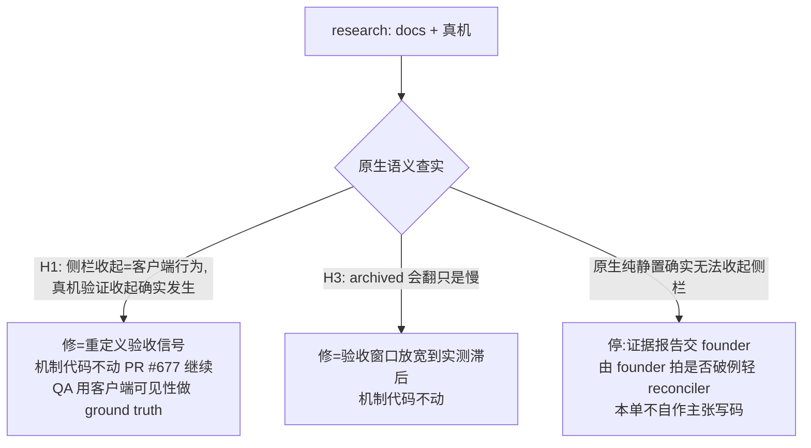

# FLY-1435 roundtable 原生 auto-archive 未触发查根因 — 探索
Issue: FLY-1435 (https://linear.app/geoforge3d/issue/FLY-1435/返工802-roundtable-thread-1h-自动归档-原生-auto-archive-未触发-查根因修复接替-fly-802)
日期: 2026-07-22
基于: 无(本 issue 首个文档;上游输入 = FLY-802 `plan.md`/`design-correction.md`、FLY-1431 `qa-report.md`(PR #680 分支)、PR #677)

## 问题

FLY-802 (PR #677) 让 roundtable / alert 新 thread 按父频道策略写入 `auto_archive_duration`(`#leads-roundtable` 配 60 → 新 thread 落 60)。独立 QA (FLY-1431) 真机实测:

- ✅ create body 落值正确(REST 回读 `auto_archive_duration=60`)
- ✅ 描述性命名、fallback 合同、reconciler 全仓归零、静置窗零 Flywheel 进程
- ❌ **核心机制未观测到**:thread 静置 150.2min(实现节点)→ 203.2min(verdict 节点),REST 回读 `thread_metadata.archived` 始终 `false` —— Discord 原生自动归档从未把标志翻成 true

Founder 诉求(FLY-802 原始目标):**「1h 无活动自动从侧栏收起,别一排排堆在侧栏」**。
Founder 方向(本单输入):**优先零巡检员**(纯 Discord 原生);若查实原生纯静置无法归档 → **停下来报告**,由 founder 决定是否破例加轻 reconciler,不许自作主张。

## 核心疑问

`auto_archive_duration` 到底承诺了什么?「到点把 `archived` 翻成 true」还是别的?

## 假设(按先验概率排序)

### H1(主假设): Discord 2022 年语义变更 —— `archived` 标志不再由服务端主动翻转;`auto_archive_duration` 现在控制的是「thread 何时从 channel list(侧栏)收起」的客户端行为

记忆中的线索:Discord 在 2022 年初改过 thread 归档行为 —— 系统不再在到点时主动 archive thread,而是把 `auto_archive_duration` 重新定义为「thread 在 channel list 里停留多久」;官方 docs 里 channel 对象的 `default_auto_archive_duration` 与 thread metadata 的 `auto_archive_duration` 字段描述都写的是 **"threads will stop showing in the channel list after … minutes of inactivity"**,而不是 "will be archived"。

若 H1 成立:
- REST `archived=false` 是**平台预期行为**,不是 bug —— 服务端 lazy/永不主动翻转。
- **founder 的产品目标(侧栏收起)可能已经达成**:客户端在 60min 无活动后把 thread 从侧栏 channel list 隐藏,与 `archived` 标志无关。
- FLY-1431 的 Fail 实际是**观测信号选错了**(用 REST `archived` 标志当 ground truth,而合同里的动作是客户端侧栏隐藏)。
- 修复路径:不改机制代码;把验收信号改成「客户端侧栏可见性」并真机验证。若验证过 → PR #677 机制成立,可继续走。

### H2: 权限/配置问题导致原生归档没生效

例如 thread 由 bot 创建、bot 权限组合影响归档;或 `flags`/`type` 某种组合让 Discord 跳过该 thread。先验低:Discord 归档不依赖创建者权限,且 QA 的 thread metadata 完全正常。

### H3: 原生归档存在但极度滞后(lazy sweep,小时~天级)

与 H1 不互斥 —— 可能「侧栏收起」由客户端按时执行,而服务端 `archived` 标志由某种低频惰性任务或首次访问时才补写。可用「更长静置后再回读」验证:FLY-1431 的 native-60 thread(`1529589050393235477`)至今仍在 QA guild 静置,现在(约 T+380min)再 GET 一次,之后按天级再看。

### H4: 观测手段本身抑制归档

每次 REST GET 会不会重置 inactivity?(docs 语义上 activity = 新消息,GET 不算;先验极低,但 QA 轮询恰好每隔一段 GET 一次,值得在 research 里排除。)

## 研究问题(research.md 要回答)

1. 官方 docs 现行原文:channel `default_auto_archive_duration` / thread `auto_archive_duration` / `archived` / `archive_timestamp` 的字段定义各说了什么?
2. 官方 changelog / discord-api-docs 仓库:2022 年那次 auto-archive 行为变更的原文与日期,变更前后语义各是什么?
3. 真机:FLY-1431 的 native-60 thread 在更长静置(T+380min → 天级)后 `archived` 是否翻转?
4. 真机:Discord **客户端**(web/桌面)侧栏里,该 thread 是否已经收起(不在 channel list 活跃列表)?—— 这是 founder 目标的直接 ground truth。
5. 若客户端确实按 60min 收起:archived 标志与侧栏可见性的关系如何向 QA 合同表述,验收怎么测才可自动化/可复核?
6. 若客户端也不收起:证据打包,停下报告 founder(方向:是否破例加轻 reconciler)。

## 决策分叉(设计原则,来自 founder 指令)

## 范围红线

- 不碰 issue chat thread(3d,FLY-292)、alert thread fallback(1440)的既有合同。
- 不重加任何 reconciler / scheduler / 周期任务 —— 除非 founder 明拍(路径 C 也只输出报告,不写码)。
- PR #677 资产处置:按查实结果决定继续用其分支或 supersede,写进 plan.md。
