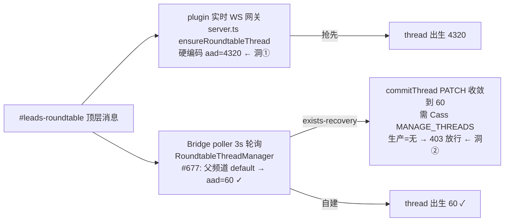

# FLY-1435 roundtable 1h 原生自动归档 — 实施计划
Issue: FLY-1435 (https://linear.app/geoforge3d/issue/FLY-1435/返工802-roundtable-thread-1h-自动归档-原生-auto-archive-未触发-查根因修复接替-fly-802)
日期: 2026-07-22
基于: research.md(Codex design review R1 六条意见已全部采纳,见 §评审记录)

## 一句话

根因已查实(research.md):Discord 的 `auto_archive_duration`(aad)控制的是**客户端侧栏收起**,不是服务端 `archived` 标志翻转——FLY-1431 的 Fail 是拿错了 ground truth,PR #677 的 Bridge 侧机制成立。但要让 **founder 实际看到的 thread** 真正 1h 收起,还差两个被 #677 范围排除的洞:**① plugin 实时网关抢建的 thread 硬编码 4320(跨仓,未修)**;**② 生产 poller bot(Cass)无 MANAGE_THREADS,#677 的 PATCH 收敛路径 403 放行(已真机探针证实)**。本单 = 采纳 #677 + 补这两个洞(全部是「配置/正确用法」修正,零 reconciler)+ 验收信号重定义 + QA 按新方法学真机复验。

## 设计判定(决策分叉走向)

按 founder 指令的分叉:「能靠配置/正确用法让原生真归档 → 修」。查实结果:

- **原生真归档(=侧栏收起)确实触发**:已读 thread 空闲超 aad 即从侧栏收起(真机 A/B 实证,research §E4)。
- REST `archived` 标志在安静 guild 上实际不翻(28 天铁证,research §E2)——这是**平台预期行为**,不构成「原生做不到」。
- 结论:走「修」分支,**不触发**「停下来报告加 reconciler」分支。修的对象是「让每条真实 roundtable thread 出生/收敛到 aad=60」的完整链路,收起本身交给 Discord 原生。
- **知情边界(随设计 HTML 呈报 founder,非阻塞)**:未读/被 @ 的 thread 被 Discord 未读保护钉在侧栏,aad 不生效,读掉即收。若 founder 想连未读一起强收,那是新的产品决策(需要 reconciler 类机制,她拍了才另开 issue)。

## 生产链路全景(修复覆盖面)

roundtable topic thread 的真实出生路径有两条,谁赢 create race 谁定出生 aad:



- 洞①证据:本机安装 cache `claude-plugins-official/discord/0.0.4/server.ts:199` `auto_archive_duration: 4320`(设计节点核实)。
- 洞②证据:真机探针(poller bot token 角色+overwrite 位运算):Cass 在 `#leads-roundtable` 无 ADMIN、无 MANAGE_THREADS;#677 `patchThread` 把 403 归为 permanent → warn + 照常持久化前进(`RoundtableThreadManager.ts` commitThread)。同一权限缺失也让 plugin 抢建 thread 的**描述性改名**失效。

## 改动清单(implement 节点执行)

### PR-1(本仓):采纳 #677 + 有界语义清理

1. **合流**:implement 时先 `git fetch` 刷新 refs、重跑 `git merge-tree` 预检,再 `git merge origin/flywheel-FLY-802` 进 `flywheel-FLY-1435`。**冲突处置红线**:双方都改过 `packages/teamlead/src/bridge/plugin.ts`(composition root);如有冲突,**按语义保留双方接线**(main 侧 FLY-1426 等 wiring + #677 侧 provider wiring),禁止 ours/theirs 整文件覆盖;无法证明等价则停下回报 Lead。合并后 `git diff origin/main --name-status` 人工过一遍最终文件集。
2. **机制逻辑零改动**(本条为首轮实施前基线;已被文末「QA R1 纠偏」的 fail-closed 合同取代):三条 create 路径共用 `channel-archive-default.ts` provider、fallback 合同、PATCH 收敛、命名。
3. **有界语义清理(零逻辑改动)**,防止后人再拿 `archived` 当 ground truth:
   - `channel-archive-default.ts` 头注释补 3-4 行:aad 控制 channel-list 收起;服务端 `archived` 由另一未公开惰性计时器控制,不可依赖;引用 FLY-1435 research。
   - `RoundtableThreadManager.ts` 等 runtime 注释与测试名里残留的「set the 1h archive」类措辞改为「channel-list duration / aad=60」口径(仅注释与测试名,不动断言逻辑)。
   - `engineering/doc/FLY-802-roundtable-thread-autoarchive/plan.md` 与 `design-correction.md` 顶部各加 superseded-by-FLY-1435 标注(指向本文件夹 research.md;不改写历史正文)。

### PR-2(跨仓,plugin fork repo):抢建路径出生即正确

4. `claude-plugins-official` fork 的 discord plugin `server.ts::ensureRoundtableThread`:创建前 GET 父频道 `default_auto_archive_duration`,值在 {60,1440,4320,10080} 内则用之;失败处置以文末「QA R1 纠偏」为准(每次创建现 GET,不强制加缓存——roundtable thread 创建频率极低)。
   **有界合同(硬性)**:GET 必须与现有 create POST 同款 5 秒有界超时(`server.ts:190-202` 同式 AbortController/`AbortSignal.timeout`),绝不让配置读取悬挂 `handleInbound()` 的 await 链(installed `server.ts:1492` 是实时消息入口)。
5. plugin fork 测试:为 resolver 抽可注入 fetch 的最小 seam,**表驱动**覆盖:四个合法枚举值、字段缺失/null、非法/畸形值(非数字、越界)、HTTP 401/403/404/429/5xx、network rejection、timeout——每行断言**最终 POST body 的 aad 值**。给出可复制的 `bun test` 命令(fork repo 套件)。
6. 交付含分发:merge 后同步 **marketplace 与本机 plugin cache 两处**(updater `~/.flywheel/bin/update-discord-plugin.sh` 双写 `.fork-sha`;marketplace 才是 Claude Code runtime 路径),重启受影响 Claude Lead/plugin 进程。安装断言(两处各自):`.fork-sha` == PR-2 merge SHA(注意 updater 写的是 `git rev-parse --short HEAD`,比较时用 `git rev-parse --short <merge-sha>` 对齐位数,勿拿 7 位 marker 与 40 位 SHA 字面比)+ resolver 正向 sentinel/body 断言 + roundtable 创建点旧硬编码 `auto_archive_duration: 4320` 归零。此为 FLY-802 原 plan 里被降级掉的 PR-2 的回补——正是 false-Done 的缺口。

### Ops(ship 窗,founder 执行/授权;全部一次性配置,零常驻)

7. **Annie 给 Cass(roundtable poller bot)在 `#leads-roundtable` 加 MANAGE_THREADS**(channel permission overwrite 即可)。作用:洞② PATCH 收敛(aad + 描述性改名)对 plugin 抢建 thread 生效——这是 #677 已有的 event-driven 单次收敛,不是巡检。PR-2 出生即正确后,此收敛只剩兜底与改名用途,但仍必需(改名依赖它)。
8. **Annie 把 `#test-leads-roundtable` 的 default auto-archive 设为 1h**(QA 前提,bot 无 MANAGE_CHANNELS;一次性)。

### 测试(可复制精确命令,零匹配必须 FAIL)

```bash
pnpm --filter flywheel-teamlead exec vitest run \
  src/bridge/roundtable/__tests__/roundtable-text.test.ts \
  src/bridge/roundtable/__tests__/channel-archive-default.test.ts \
  src/bridge/roundtable/__tests__/ensure-thread-from-message.test.ts \
  src/lead-backends/codex/__tests__/roundtable-reply-in-thread.test.ts \
  src/__tests__/AlertChannelHub.test.ts \
  src/bridge/roundtable/__tests__/RoundtableThreadManager.test.ts
```
- 验收断言输出含 `Test Files  6 passed (6)` 且 `Tests  130 passed (130)`(Lead 指令新增 permanent PATCH fail-loud 覆盖后,数量不得减少);`No projects matched` / 零匹配 = FAIL(包名是 `flywheel-teamlead`,不是 `teamlead`——R1-2 教训)。
- PR-2 的 plugin 测试在 fork repo 自己的套件跑绿。
- 全量 CI 绿(两仓各自)。

### PR / 资产处置

- 本仓从 `flywheel-FLY-1435` 开**新 PR**(代码 + FLY-802 历史文档 + 本单设计文档),body 写明 supersede #677、链接 FLY-1435。
- **PR #677 关闭**,留言 superseded by 本单 PR(机制原样采纳,根因与验收修正见 research.md)。
- FLY-1431 的 PR #680(纯 QA 文档)不受影响。

## Rollout(ship 窗执行,founder-gated;唯一序列,不留歧义)

1. 前置:Ops 7/8 完成(权限与频道配置);fresh GET 复核生产 `#leads-roundtable` default=60、Cass MANAGE_THREADS 生效。
2. 本仓 PR merge → canonical main checkout 更新到 merge SHA → **一次** canonical `restart-services.sh` 正常路径调用完成部署——它内建 stop Bridge → build → start → `/health`(`scripts/restart-services.sh:1256-1302`)作为同一步骤的子阶段;**禁止**额外手工第二次重启,**禁止** `--bridge-only`(不 build,不算代码部署)。成功后核对:boot log running HEAD == merge SHA、`packages/teamlead/dist` 含 FLY-1435 语义清理 sentinel(如 provider 头注释关键词)、`/health` OK、session 保全。
3. plugin fork PR merge → 分发 marketplace + 本机 cache(updater 双写)→ 安装断言(PR-2.6 合同:两处 `.fork-sha` == merge SHA + resolver sentinel + 硬编码归零)→ 重启受影响 Claude Lead/plugin。
4. 生产验证(创建面):触发一条真实 roundtable 顶层消息 → REST 回读新 thread **出生即 aad=60**(无论谁赢 race——PR-2 生效后 plugin 赢也应出生 60)。若观察到出生非 60 而 3s 内被 PATCH 收敛,记录为「兜底路径工作、出生面未达标」→ 按 QA L1-P 判 FAIL 回查 plugin 分发,不得当 PASS。
5. 存量 thread 不回溯(FLY-802 既定边界)。

## QA 合同(qa 节点执行;本节是验收权威)

**Ground truth = founder 客户端侧栏可见性(Claude-in-Chrome 截图),不是 REST `archived`。** REST `archived` 长期 false 是平台预期,**不得**作为 Fail 依据(FLY-1431 教训,research §E2)。QA 分两层,变量隔离:

### L1 产品 E2E(真实创建链,隔离房)

FLY-529 roundtable 镜像房(`#test-leads-roundtable`,default=1h 已由 Ops 8 配好,隔离 Bridge hostSlot):

**L1-B(Bridge creator,必跑)**
1. 经镜像 Bridge poller 真实路径投顶层消息建 thread。
2. 断言**出生** aad=60(REST),founder 自动成为成员(FLY-576 行为)、seed/回帖完成。
3. 等 seed 全落 → founder 账号(Annie 的 Chrome)打开该 thread mark-as-read → 以最后一条消息时间(`last_message_id` snowflake)为 T0。
4. 静置 ≥90min 零活动 → founder 客户端刷新/切走再截图:**thread 从侧栏消失 = PASS**。REST `archived` 值如实记录(观察字段,不判定)。

**L1-P(plugin creator,必跑;与 Cass 收敛严格隔离——R2-1)**
1. 在 test room 启用 reply-in-thread plugin(FLY-529 `scripts/test-deploy.sh:632-649` 已把 roundtable Lead plugin flags 接进房),并**暂停/禁用该房 host manager**(或用一个不被 manager 轮询的受控 parent 频道),确保没有任何 PATCH 收敛可能污染观测。
2. 由**真实 plugin** 创建 thread,留存 create 请求 + 创建后立即 GET:**newborn aad=60 = PASS;确认 plugin winner 且 newborn ≠ 60 = 直接 FAIL**(说明 PR-2 未生效——分发/resolver 问题,回查)。
3. 「3s PATCH 收敛」另立独立用例验证兜底能力(恢复 manager 后观察),只证 PR-1/Ops 7,**不得**替 L1-P 判 PASS。

### L2 平台 A/B(变量隔离,harness 显式 aad)

同一客户端、同一观测窗、同样 membership/read 状态的两条 harness thread(显式 create body,不依赖频道 default,任意测试频道即可):
- A:aad=60;B:aad=4320。两条都在最后消息后 mark-as-read。
- T+≥90min 统一刷新截图:**A 消失且 B 仍在 = PASS**(排除「消失另有原因」)。
- create request 与 REST 回读全留档。

### C(可选,知情边界复证)

@ founder 的 thread 静置超窗仍显示(未读钉住)→ founder 读掉 → 收起。research §E4 已有一次实证;是否重跑由 Lead 定夺(涉及 founder 真实未读)。

### 纪律

- test 频道未配置好 default=1h 时**停下等配置**(问 Lead/founder),不得拿生产 `#leads-roundtable` 冒充隔离房(生产 manager 正在轮询它——R1-3 教训)。
- 不触生产 Bridge、alert 队列零污染(FLY-529 纪律)。

## 风险与边界

| 风险 | 处置 |
|---|---|
| 侧栏收起是客户端实现行为,官方合同只有 docs 一句话,未来可能变 | QA 以真机 UI 为准;honest boundary 写进 founder HTML;未来客户端变更导致回归 = 新 issue |
| research §E4 收起实验 n=1 | QA L1+L2 以受控 ≥90min 窗复刻;不过则本单 Fail 回炉,**不得**擅自加 reconciler(founder 红线) |
| 未读钉住不符合 founder 对「别堆侧栏」的全部想象(`#flywheel-alerts` 大堆未读钉住,本单管不到) | 设计 HTML 明示三行映射表(已读✅/未读⚠️/alerts❌ 范围外);要不要强收未读 = founder 新决策 |
| plugin fork 分发/Lead 重启遗漏 → 又一轮 false-Done | Rollout 3 的安装内容断言 + 4 的创建面生产验证兜底 |
| merge 冲突处置不当丢 composition wiring | PR-1.1 红线:语义保留双方、无法证明等价即停 |
| Ops 权限/频道配置依赖 Annie | ship 本来就 founder-gated;两项一次性配置与 ship 批准同窗提出 |

## 范围红线(不碰)

- issue chat thread(3d,FLY-292)、alert fallback(1440)合同不变。
- 不新增任何 reconciler / scheduler / 周期任务 / runtime flag。
- 不回溯存量 thread。
- plugin fork 改动仅限 `ensureRoundtableThread` 的 aad 取值逻辑 + 测试。

## 验收

1. Codex design review 通过(本 plan)。
2. implement:PR-1 合流 + 语义清理 → 焦点 6 文件/129 断言口径全绿(精确命令)+ 全量 CI 绿;PR-2 plugin fork 测试绿 + CI 绿。
3. qa:L1 + L2 PASS(C 可选);codex code review 为独立 DAG 节点。
4. founder-gated ship;Rollout 1-5 全序列走完,生产创建面验证 aad=60。

## 评审记录

### QA R1 纠偏（2026-07-22，取代上文 fail-open 条款）

- QA 真机复验已证明原生机制成立：aad=60 的三条已读 thread 在 102.5–110.5 分钟后从 founder 侧栏消失，六条 1440/4320 对照仍在；所有 REST `archived=false`，再次证明它不是验收信号。
- QA 同时复现冷缓存父频道 GET 的 404/500/network failure：旧实现仍用 4320 创建，错误值会因「零 reconciler」永久保留。纠偏合同为 **fail-closed**：父频道策略无法读取、缺失或非法时，Bridge/plugin 均不得发送 create POST；Bridge 保持 cursor 让下一轮重试，并经 `MetaAlertNotifier` fail-loud。`resolveAutoArchiveMinutes` 没有显式合法 fallback 时返回 null，不再隐式产生 4320。
- Discord 真实“未配置”响应会省略 `default_auto_archive_duration`。provider 将该 wire shape 规范化并缓存为 null，区分于冷读失败（抛出 `ChannelArchiveDefaultUnavailableError`），避免重复 GET/warn；roundtable 对两者都 hold，alert hub 仍显式保留自己既有的安全 1440 fallback。
- plugin resolver 保留 5 秒超时，但失败返回 null；实时 gateway 留下顶层消息，由 Bridge poller 重试。新增两仓回归断言锁死“无法解析策略时零 create、零静默 4320”。

- Codex design review R1(2026-07-22,xhigh):CHANGES REQUESTED,6 条——①plugin creator 4320 缺口(采纳:PR-2 + Ops 7)②pnpm filter 包名假绿(采纳:精确命令+断言)③QA 未隔离变量/未覆盖真实链(采纳:两层 QA)④rollout 未钉死 build/plugin 分发(采纳:唯一序列)⑤冲突处置禁 ours/theirs(采纳:语义合并红线)⑥语义清理扩到 runtime 注释/测试名/历史文档 supersession(采纳)。设计节点对 ①② 做了独立真机/本机核实(Cass 无 MANAGE_THREADS 探针、plugin cache:199、`pnpm --filter teamlead` 零匹配 exit 0)。
- Codex design review R2(2026-07-22,xhigh):CHANGES REQUESTED,4 条——①[BLOCKING] plugin-winner 用例必跑且与 Cass 收敛隔离、安装断言须覆盖 marketplace+cache 双位置 `.fork-sha`(采纳:L1-P + PR-2.6 + Rollout 4 改判 FAIL 语义)②[HIGH] plugin GET 5s 有界超时合同 + 可注入 fetch seam + 表驱动全失败矩阵(采纳:PR-2.4/2.5)③[MEDIUM] rollout 与 restart-services.sh 真实 stop→build→start→health 序列冲突(采纳:合并为一次 canonical 调用)④[MEDIUM] research.md 残留被推翻的 E5/QA 结论(采纳:顶部 dated correction,指认 plan 为唯一权威)。
