# FLY-1436 work-kind cutover 解冻返工 — 实施计划
Issue: FLY-1436 (https://linear.app/geoforge3d/issue/FLY-1436/解冻1418-work-kind-binding-cutover-分档路由上线解锁-honey-lemon接替-fly-1418)
日期: 2026-07-22
基于: research.md

**Status**: **codex-approved**(design review 5 轮:R1 6H → R2 4H+1M → R3 3H+2M → R4 1H+1M → **R5 APPROVED**,2026-07-22;全部 findings 采纳零 reject)

> **谱系**:本 plan 是 FLY-1418 plan(codex-approved R8 + Bridge design review APPROVED,冻结于执行前)的解冻修订版。1418 的 EXECUTION HOLD 重开门四条件逐条兑现:①`design-correction.md` Lead 通用合同全文继承(C15);②updater-lock blast radius → **AVOID + 只读 quiescence barrier**(C14′);③P5 route 证据按实测模板 schema 重推(C13′);④incumbent wildcard 复核零漂移(research §4.4)。1418 旧 review 的 APPROVED 不覆盖本修订 —— 本 plan 重新走 codex design review。
> **⚠️ founder 红线(issue 原文)**:最后一步翻 flag 上线(`pipeline.work_kind` + `FLYWHEEL_WORKFLOW_GENERALIZED_TEMPLATES=1`)是 founder-gated —— 建好、测好、到 ship gate 找 Annie 拍,绝不自翻。**两个 flag 的翻转动作全部收拢在 G-GO 批准之后的受控序列内**(codex R1-1:不存在任何提前翻转步)。

---

## 0. 一句话

把 FLY-1407(引擎)+ FLY-1380(模板,均已 ship)建好的 work-kind 分档路由在生产 flywheel 项目真金打开:两个先行 PR(PR-A = 通用 Lead 教学 + binding cutover 工具;PR-B = cutover 本体)+ 一次 G-GO 之后的受控翻转序列(**GENERALIZED direct-toggle apply → merge PR-B → 标准 deploy → barrier 五证 + quiescence 探针 → stage/confirm → 单事务写六行 + durable receipt**)+ 三分支生产验收(valid 正样本 = **Honey Lemon**);五个 founder gate 每步经 Lead relay 显式呈报,本单是唯一执行 owner。

## 1. 核心决策(相对 1418 plan 的继承/修订标注)

| # | 决策 | 定案 | 相对 1418 |
|---|---|---|---|
| C1 | 执行范围 | flywheel-only pilot;runbook 可复用但后续项目每次翻转都是新的 founder-gated 执行。**server-side 收窄强化 pilot 边界**(C9′:cutover 路由写死 project=flywheel) | 继承+强化 |
| C2 | prompt 资产边界 | = `.flywheel/agents/engineering/{pm,prototype}-executor.md` 两个 legacy runtime 文件;v2 模板节点 prompt(repo 根 `agents/` 三件)= 1380 已交付,只 preflight 校验 published,不动 | 继承 |
| C3′ | 🔴 翻转次序 | **全部翻转动作在 G-GO 之后一个受控序列内,次序固定**:(i) **三零 preflight**(fail-closed;GENERALIZED 经共享 blockReason 间接控制 admission/side-effect/recovery,翻 on 会释放 held 态,research §4.2)。**三个零的 exact 谓词(R3-3 + R4-1:统一锚定「flag flip 可释放的非终态」= 必须关联 `status='active'` 的 schema-2 run;落成一个 shared read-only StateStore helper,P1-exit/P4/一切 GENERALIZED-off 收尾共用)**:① active schema-2 workflow run = 0;② **关联 active schema-2 run 的**未 terminal side effect = 0;③ **关联 active schema-2 run 的**、`workflow_start_stage` 未达 `responded` 的 schema-2 reservation = 0。**terminal(terminated/completed)run 的遗留 ledger/reservation 行只作 diagnostics 附报,不计入 gate** —— 源码支撑:admission/recovery/dispatcher 消费面全部要求 active run(`workflow-template-selection.ts:469-475`、`StateStore.ts:15934-15948`、`workflow-engine-dispatcher.ts:877-890`),terminal run 遗留行不会被 GENERALIZED 翻转重新释放;现有 `terminateWorkflowRunByOperator` 只改 run status 不 settle ledger/stage(`StateStore.ts:16640-16746`),若②③不锚定 active run,终止后 gate 永久卡死。reservation 表 append-only,**绝不按裸行数计**。helper 测试须覆盖:历史 `responded` 行不计 / active run 的 materialized·admitted·launch_committed 未响应行计 / **端到端:active v2 run+nonterminal side effect+未响应 reservation → dispatch off → terminate → 三零归零 → explicit replay 不复活 → GENERALIZED-off 允许** / terminal-run 遗留行与 active-run 行的分类边界→ (ii) **GENERALIZED=1 apply**:`flywheel-comm feature-flags` stage→single-use confirm→apply(registry `toggleable:"direct"`,SHA-CAS + 原子持久化 + live `process.env` mutate,**免 Bridge 重启、自带 audit**;手编 `.env`+重启方案废除)→ live+file 双证 → (iii) **merge PR-B + 标准 self-ship deploy** = 翻 `pipeline.work_kind`(pull 即生效)→ (iv) barrier + quiescence(C14′)→ (v) **binding 六行写入紧随**(窗口目标 <10 分钟)。**铁律:binding 写入必须在 GENERALIZED=1 于活 Bridge 进程生效之后** —— keyless 选中 schema-2 candidate(目标集 `*→tpl_generic` 恰满足)而 GENERALIZED off = 409 `GENERALIZED_WORKFLOW_REJECTED` 全瘫(research §4.1 逐点核证) | **重写**(R1-1/R1-2:取消提前 Step-1;改走 audited direct-toggle;加三零 preflight) |
| C4 | (iii)→(v) 窗口行为 | absent → generic 单 session(candidate-free 不查 binding)+ 提醒;显式合法 → 409 `WORK_KIND_BINDING_MISSING` fail-loud;非法 → 400 + allowed;templateId 照走;partial 写入态被单事务消灭(C9′)。窗口内不主动派单(双保险) | 继承 |
| C5′ | PR 切分 | **PR-A = ②拍指令面 + 工具面**:`department-lead-rules.md` 通用 work-kind 教学 + 本 repo 两个 identity 示例补 taskCategory + synthetic future-Lead contract test + **cutover 路由 + StateStore authoring API + durable claim + 薄 CLI + 全部测试**。**PR-A 诚实声明(R1-3 修正)**:零 dispatch-routing 行为变化(routing-neutral),但 **cutover 路由是新增的 production control plane**(master-token 面可达)——其安全边界(server-side authority + 三件安全底座)在 **G-rules-approve 显式呈批**,不冒称 inert。**PR-B = cutover 本体**:config `work_kind: true` + 两 executor markdown + Gemini required enum + staging fixture + 本 doc 归档,零工具文件。**P6b docs PR** 收尾。工具随 PR-A 三理由继承(pre-GO 验 production-installed;revert PR-B 不撤回滚依赖的控制面;提前可用) | 修订 |
| C6 | ②拍文本语义(dual-state) | 按 founder correction:always 显式传 taskCategory(五 canonical 值 + 何时用哪个);部门值只是建议;**不传 = generic 单 session + 收提醒(不是拒绝)**;产品单是否仍带 `no-three-stage` 以该项目 agent 文件现行要求为准;「非法值稳定 4xx」标注「项目完成切换后成立」 | 继承 |
| C7 | ③拍哨兵 | 哨兵 = bundle 自带 `RULES_BUNDLE_SHA`;权威判据 = fresh session 终点读回:9 个 spawn-capable Lead 逐位复述 SHA 前 12 位 + work-kind 要点 + 现场生成含自身 `leadId` + canonical `taskCategory` 的派发 payload;阴性 = 任一 CoS;前置 = 三 CoS plist `FLYWHEEL_LEAD_ROLE=cos` verify-or-set(幂等,实测三个已设) | 继承 |
| C8 | Gemini schema | `dispatch_runner` 加 `taskCategory` required enum(5 值 mirror `work-kind.ts` + 同源断言测试),进 PR-B;生效载体 = 标准 deploy 的 `pnpm build`;写 binding 前从生产 dist import 断言;voice 真派单不可得则具名 deferred(owner=Tadashi,触发=Annie 下次 voice session,关闭证据=回显含 taskCategory) | 继承 |
| C9′ | 🔴 binding cutover 工具 | **本单自建**(1380 未交付,ship-note 实证)。形态(R1-3/R1-4 + R2-3 修订)= **Bridge 进程内版本化 cutover 路由 + 薄 CLI**:`POST /api/workflow/cutovers/FLY-1436/{stage,apply}` —— **statement 化两口,`stage` 接受 server-validated `kind=activate\|restore`,`apply` 统一执行两类 mutation(不设独立 /restore 口,restore 走同一 stage→confirm→apply 模型)**。**server-side authority**:project=flywheel、activation id、六行目标集、actor 全部 server 端写死,不接受任意 bindings CRUD;安全底座三件:loopback host 校验 + **`apiToken` 未配置时 503**(通用 `tokenAuthMiddleware` 在 token 缺失时放行,不能复用)+ constant-time master Bearer。**stage**(=dry-run)按 **kind 分流的 preflight truth table(R3-1)** 执行 + 返回 canonical request(before/after)+ SHA + single-use confirm token:**`kind=activate`** = 全量前置(exact-only 查询——现有 getter 有 exact→`*` fallback 不能做 CAS,新增 exact-only getter;published+fresh-eligible;expected-baseline 校验;live flags + `work_kind` + deployed SHA/资产 digest 核验);**`kind=restore`** = **只**要求 master auth + 原 activation committed receipt 存在 + snapshot/hash 完好 + 当前 exact state == 该 activation committed target + 恢复目标行合法 + DB 可写 —— **显式允许 `TEMPLATE_DISPATCH=0`、GENERALIZED 任意态、PR-B 资产/config 已漂移的事故态**(restore 是恢复通道,绝不能被 containment 动作自锁);无 committed receipt / target drift / snapshot mismatch → fail-closed。apply 事务内 recheck 同样按 kind 分流。**apply handler 顺序写死(R2-3,单义协议)**:① master auth + canonical shape/hash 校验;② **先查 durable claim:同 id+同 hash 且已 committed → 只读返回原 receipt(不再要求 token);同 id+异 hash → 409**;③ 未命中 committed claim 才 verify-and-consume token(`ConfirmTokenStore` 单次消费、Bridge 重启清空 —— 未 commit 的重启后必须重新 stage);④ 事务内**再查一次 claim**(关并发 race)→ exact CAS → mutation → audit → receipt 同事务 commit;⑤ 语义:commit 后丢响应重试(同 id+同 hash,含已消费 token)= 200 原 receipt。**restore CAS「当前 exact state == 该 activation committed target」并引用原 activation receipt**(防重复 restore 误删后续合法行)。audit 统一 `action='rebind'` + typed detail JSON(operation_id/kind/before/after/删除行清单)——不做 CHECK migration。快照(路径+hash)+ 单事务(删 `*` 旧行 + 写 6 行)+ exact 复读。目标集(PRD §3.2,模板 ID 实测已发布):`prd→tpl_product_v1 / designer→tpl_product_designer / prototype→tpl_product_prototype / code→tpl_eng / research→tpl_generic / *→tpl_generic`。测试必含:response-loss-after-commit(已消费 token 重试返回原 receipt)/ Bridge 重启后同 op replay / **未 commit 的重启后 token 失效必须 restage** / 异 payload replay 409 / 并发 baseline drift / **同 op 并发 apply 只产生一次 mutation+audit** / 重复 restore(CAS 拒)/ restore 后新行 / **restore 无 token 拒、token-hash mismatch 拒** / **`TEMPLATE_DISPATCH=0` 下 restore stage+apply 成功 / PR-B 漂移后 restore 成功 / 无 committed receipt·target drift·snapshot mismatch 时 restore fail-closed(R3-1)** / baseline 冲突 / 单事务原子 / restore 删行语义 / endpoint 三件安全底座。journal 备选整块删除 | **重写**(R2-3 协议写死) |
| C10 | founder gate 五个 | G-rules-approve(P0a/P1/P2 生产动作前:PR-A 内容含 **cutover 控制面安全边界** + Lead 重启计划 + cos verify-or-set)→ G-rules-verify(②③拍证据)→ G-PR(PR-B 内容批准,批内容不 merge)→ **G-GO(翻转最终 GO = issue 红线的 ship gate:两 flag 翻转授权 + merge 授权 + 写入清单 + 快照方案 + 回滚双路径 + Pre-binding abort matrix + offline containment fallback + 残余 TOCTOU 风险包 + 窗口预案;GO 后动作次序 = 三零 preflight → GENERALIZED apply → merge——merge 一旦发出即触发 auto-updater 链,不存在"批 merge 拦 pull"暂停点)**→ G-verify(三分支+金丝雀+Gemini 证据包)。全部 Runner→Lead(Tadashi)relay 呈报 Annie | 继承(R2-5:GO 后首动作 = 三零 preflight,非 merge) |
| C11′ | 回滚:双路径 + Pre-binding abort matrix | **Normal rollback(Bridge/DB/receipt 健康,binding 已写)**:restore by operation receipt(杆①,DB 即时无 deploy)→ exact 复读验回全 v1 → revert PR-B + 标准 deploy(杆②,必须在杆①后——binding 已写时单独 revert = off 域 keyless 409)→ GENERALIZED off(杆③,audited direct-toggle,仅 binding 已回全 v1 **且三零重跑为零**后执行)。**Emergency containment(restore 不可用/结果不确定/故障扩大)分两类(R2-4)**:(a) **Bridge 可达、restore/DB 路径故障** → `TEMPLATE_DISPATCH off`(audited direct-toggle)—— candidate 解析**前**短路回 legacy(`runs-route.ts:1288-1301`,test 实证;现有 flag panel fail-stop 顺序同此)→ 验证新请求走 legacy → 按 durable receipt 对账 + restore → revert PR-B → 决定重开 TEMPLATE_DISPATCH → 最后 GENERALIZED off;(b) **Bridge 不可达/重启循环** → 停机本身 = 临时 containment(无新派发);**任何重启前**,按 G-GO 预批的 **offline 原子步骤**把 `.env` 的 `TEMPLATE_DISPATCH` 置 off(备份 → 临时文件全量改写 → `mv` 原子替换,权限保持;exact 手工步骤 + founder 预授权写进 G-GO 包,不运行时发明)→ 起 Bridge → file+live 双证 + legacy probe → 恢复后按 receipt 续对账。**Pre-binding abort matrix(R2-2,1436 特有「GENERALIZED 已 on、binding 未 commit」态,分四态)**:(i) GENERALIZED on、PR-B 未 merge → 三零重跑,仍为零才 direct-toggle GENERALIZED off;**非零时(R3-2,不虚构"停新 v2 但放行旧 v2"的 lever——共享 blockReason 决定了两者不可分离)**:先 `TEMPLATE_DISPATCH off`(audited direct-toggle)做全量 containment(诚实承认它同时 hold recovery/side-effect 消费)→ **呈报 Annie**:逐个非零项列出(run/side-effect/reservation),请示「批准逐项终止(active run 终止属 founder reserved action,升级本就是该走的路)或等待收敛」→ 处置后以三零 shared helper 查询证据收口 → GENERALIZED off → 与 founder 共同决定是否重开 TEMPLATE_DISPATCH。owner=本单 operator,超时=1h 无 founder 响应则维持 containment 不动等待,**禁止盲关**;(ii) PR-B 已 merge 未部署 → 先保证 origin/main 出现安全 revert descendant + 吸收原 marker(封存 marker 不能代替 revert),再处理 GENERALIZED;(iii) PR-B 已 live、binding exact count 仍旧基线 → revert/deploy PR-B → 回滚 barrier 过后三零重跑 → GENERALIZED off;(iv) apply 结果不确定或已有 activation receipt → 转 Normal/Emergency receipt 路径。**三零检查在任何 GENERALIZED-off 收尾动作前都必须重跑**。1418 deploy-in-flight 子矩阵仅作 (ii) 的 deploy 子步(生产 plist 无 QueueDirectories ⇒ 意外触发面收窄为 06:00 + 他人 kickstart)。**爆炸半径明示进 G-GO 包**:TEMPLATE_DISPATCH off 期间现役 v1 DAG 新派发回三段、active engine run admission/side-effect 被 hold + 重开条件。active pinned run 免疫不改道 | **重写**(R2-2/R2-4 折入) |
| C13′ | 验收取证 | 三个独立金丝雀 issue,按分支定义证据:**valid = Honey Lemon(flywheel-product-lead)prompt 面真发 `taskCategory=research`** → exact 命中 `tpl_generic` → **`workflow_v2` route** + 收据 + HTTP 回显 + thread/spawn 可见性;absent = curl → generic 单 session + `default_fallback` 收据 + 提醒实际送达;invalid = curl `desiner` → 400+allowed + rejected 收据 + 幂等一次提醒 + 零 session/run/thread。回归旁证:**Tadashi 真派 `taskCategory=code` → exact `tpl_eng`(schema-1,tier default heavy ≡ tpl_eng_heavy)→ `pipeline_dag_v1` route**;off 项目 keyless 负对照;金丝雀 spawn 注入 prompt 无矛盾指令 | 修订(route 证据按实测 schema) |
| C14′ | deploy barrier + 并发面 | **AVOID(advisory ① 收口)**:不修 `self-ship-queue.sh` 锁协议、不建 operator 锁、不与 updater 抢锁(stale-lock bug 实测仍在 `:319-334`,operator 锁会被误回收;1418 的 wrapper/holder-fencing/mixed-version 全家删除)。替代 = **检测+收敛四件套**:(1) 窗口唯一 ship 者(G-GO 划窗;P0 查 pending dir;避开 06:00);(2) **只读 quiescence barrier(R1-5)**:own-marker ack ≠ updater 退出(ack `update-flywheel.sh:153` 后同进程续扫,锁释放 `:242`)⇒ barrier 五证过后追加静默探针 = updater lock 目录不存在**且**记录 owner 进程已退出 + pending dir **完全为空** + 有界 quiet interval 内 deployed-sha/live-config/资产 digest 零漂移;**stage 后、apply 前重跑同一探针**,证据取不到或漂移即 fail-closed;(3) 写前断言 + 写后再断言(live-config `work_kind===true` + 资产与 mergeSHA 一致;写后失败 → 立即 Normal 杆①);(4) crash 恢复 = 按 durable receipt 对账收敛 + 重入断言。**barrier 五证**:(a) 本单 marker ack;(b) `merge-base --is-ancestor <mergeSHA> <deployed-sha>`(`self-ship-queue.sh:180-187`);(c) Bridge health;(d) 生产 dist import 断言 Gemini schema;(e) live-config 内容断言。deadline 20 分钟超时 → C11′。**残余 TOCTOU 明示**(最后探针→事务提交的秒级窗口不可消除)进 G-GO 风险包。**cutover-state 轻量化**:`~/.flywheel/state/cutovers/FLY-1436.json`(`phase/mergeSha/operationId/snapshotPath+hash/updatedAt`,原子 rename,CLI 维护;真相源 = DB 内 durable receipt,state 文件是断点导航);crash 接管 = Tadashi 确认原 operator 已死 → 按 receipt 对账 → 幂等续跑。handoff 后禁止写任何 repo checkout | **重写**(R1-5 quiescence + receipt 对账) |
| C15 | Lead 通用合同 | `design-correction.md` 全文继承:SSOT = `department-lead-rules.md`,示例以运行时 `<lead_id>/<project_name>/<issue_id>` 参数化,绝不 Tadashi-only;从生产 `projects.json` 枚举 9 个 spawn-capable Lead(含 rafiki/reflection)做读回/payload 终点矩阵;synthetic future-Lead fixture;CoS 阴性;Codex-backend Lead 今天结构不可派发(FLY-251 前 hard-false)⇒ 不改 Codex 工具面 + 显式 follow-up 注记 | 继承 |

## 2. 执行序列(runbook)

```mermaid
flowchart TD
    G0{{G-rules-approve: PR-A 内容含 cutover 控制面安全边界 + 重启计划 + cos verify}} --> P0[P0a 前置核对 — 只验现有生产面]
    P0 --> P1[P1 PR-A: ②拍教学 + cutover 工具面<br/>merge + 标准 deploy → P1-exit installed-tool gate<br/>预期三 blocker 失败断言 — 不冒称全绿]
    P1 --> P2[P2 运维窗口: 全 dept Lead 重启<br/>③拍哨兵读回 9-Lead 矩阵 + CoS 阴性 — 零 flag 动作]
    P2 --> G1{{G-rules-verify: ②③拍证据}}
    G1 --> P3[P3 PR-B: work_kind true + 两 markdown + Gemini schema + fixture]
    P3 --> G2{{G-PR: PR-B 内容批准 — 批内容不 merge}}
    G2 --> G3{{G-GO: issue 红线 ship gate<br/>两 flag 翻转授权 + merge 授权 + 写入清单 + 快照<br/>+ 回滚双路径 + 残余 TOCTOU 风险包}}
    G3 --> P4[P4 受控翻转序列<br/>① 三零 preflight → ② GENERALIZED apply direct-toggle + 双证<br/>→ ③ merge PR-B → poll MERGED → mergeSHA 入 state<br/>→ cd 生产 main + 移除 worktree → self-ship handoff<br/>→ ④ barrier 五证 + quiescence 探针 → 写前断言<br/>→ ⑤ stage→confirm→apply 单事务写六行 + receipt<br/>→ exact 复读 → 写后断言 → 窗口关闭播报 deadline 20min]
    P4 --> P5[P5 三分支验收: Honey Lemon valid + curl absent/invalid<br/>+ Tadashi code 回归 + off 项目负对照 + 金丝雀 spawn]
    P5 --> G4{{G-verify: 证据包呈报}}
    G4 --> P6a[P6a repo 外收尾: MEMORY/Linear/证据 + 零-live-refs 记录<br/>+ 建 retire 与 docs 两个具名 follow-up issue → 节点完成]
    P6a --> FUP[后续独立 issue: retire — G-retire pre-mutation gate<br/>+ P6b docs PR — 均不阻塞本单 close]
```

**DAG 化执行注记**:本单以 DAG run 执行(design / implement 分节点)。1418 原文的「唯一一次 session_completed」语义按节点合同转译:implement 节点完成 P6a 后按其节点 route 收尾;gate 呈报一律走 `flywheel-comm ask` / gate → Tadashi relay Annie,Runner 不直面 founder。

### P0a 前置核对(G-rules-approve 之后、进 P1 前全过;R2-1:只验**现有**生产面与基线,不含 PR-A 交付物)
1. FLY-1380 ship 且真机验证 ✅(已满足;复核生产 warm 零新 binding audit row);
2. 六目标模板 exact 查询 published + fresh-eligible + 未 retired(实测已满足,复核);
3. 三 CoS plist `FLYWHEEL_LEAD_ROLE=cos` verify-or-set(幂等,预期「已满足未改动」);
4. 「唯一执行 owner」违规检测:binding audit 无新行、`work_kind` 键未出现、GENERALIZED 不在任何活进程 env;
5. flag 域实测:`TEMPLATE_DISPATCH=1 / CLAIMS_RW=1`(漂移则全线暂停呈报);
6. `self-ship-pending.d` 无外部 pending marker;
7. **production feature-flags 控制面可用性(真实命令,R2-1/R3-5)**:HTTP `POST /api/fleet/flag/stage` 提交 no-op 变更验证 Bridge mutation route 可达(**丢弃返回的 confirm token,绝不 apply**)+ CLI 侧只做**本地无副作用检查**(dist 文件存在 + 版本/usage 输出)——**不用 `feature-flags report`**(它走 publish-report,会产生 hosted URL + Discord 投递,非只读探针);不可用 → fallback 方案含原子性论证进 G-GO 包请 founder 显式批;
8. **三零早期侦察(非权威,R4-2)**:用**现有只读 SQL** 观察三零现状并记录(权威 shared helper 属 PR-A 交付,P0a 时生产尚不存在);**权威首跑在 P1-exit gate**,P4-① 紧邻 apply 前重跑;
9. **offline containment fallback 可执行性演练**(C11′-(b)):在影子文件上演练 `.env` 原子改写步骤并记录。

### P1-exit installed-tool gate(PR-A merge + deploy 之后、G-GO 前;R2-1:与 P0a 分离)
- 生产 dist 内 cutover 路由存在 + CLI 版本与 PR-A merge SHA 一致 + 三件安全底座逐一验证(loopback 拒外部 host / 无 token 503 / 错 Bearer 401)+ durable claim schema 就位 + exact-only getter 读回现状基线 + **三零 shared helper 权威首跑(R4-2)**;
- **stage(kind=activate)预期失败断言**:此阶段 full stage **必须且只能**因 `GENERALIZED_OFF / WORK_KIND_OFF / PR_B_ASSETS_NOT_DEPLOYED` 三个预期 blocker 失败(stage 报告须逐项列出、无其它意外项)——**不冒称"全绿"**(全绿在物理上要求 PR-B 已部署 + 两 flag 已 on,只在 P4-⑤ 成立);
- 全部 C9′ 测试证据在案;PR-B barrier 后复验工具无漂移。

### P1(PR-A)
- `department-lead-rules.md`「Action Gate」段新增通用 work-kind 教学(C6 文本 + `<lead_id>` 参数化 payload 模板);
- 本 repo 两个 identity(`flywheel-eng-lead:56-58`、`flywheel-product-lead:247-249`)curl 示例补 canonical `taskCategory`;其余项目 repo identity 修正 = P2 附带操作(生产文件,G-rules-approve 内呈报);
- 通用 Lead contract test:synthetic future Lead 进共享装载路 → 自动获得 work-kind 规则并生成含自身 `leadId` 的 payload;cos 排除断言;
- **工具面(C9′ 全量)**:StateStore exact-only getter + `replaceWorkflowCategoryBindings`/`restore`(单事务 + durable claim + audit)+ cutover 路由三件安全底座 + stage/confirm/apply + `scripts/workkind-cutover.mjs` 薄 CLI + state 文件维护 + C9′ 测试清单全量;
- merge + 标准 deploy → **P1-exit installed-tool gate**(含预期三 blocker 失败断言,见上)。

### P2(运维窗口;**零 flag 动作**)
- 重启全部 9 个 spawn-capable dept Lead(低峰):每位 fresh session 读回新 `RULES_BUNDLE_SHA` 前 12 位 + work-kind 要点 + 现场生成含自身 `leadId` + canonical `taskCategory` 的 payload;任一 CoS 阴性对照;synthetic fixture 证据引用 PR-A CI;
- `check-rules-truth.sh` 起点旁证;repo 外 identity 示例附带修正。

### P3-P4(cutover 本体 + 受控翻转)
PR-B 内容:`.flywheel/config.yaml` `pipeline.work_kind: true` + 注释(owner=FLY-1436;回滚=C11′ 双路径,杆①先行);两 executor markdown 去 `no-three-stage` 改 work-kind 语义(⑤-4 压 founder 门,G-PR 呈报);`gemini-agent/src/tools/schemas.ts` required enum + 同源断言;staging fixture 钉 research §4.1/§7.3 两格;本 doc 归档。零工具文件。

翻转序列(G-GO 后,cutover operator 按 C14′ 驱动):**① 三零 preflight 重跑** → **② `flywheel-comm feature-flags apply` GENERALIZED=1(CLI 内部 stage→confirm→apply)** → live(`ps eww`/探针)+ file 双证 → **③ 受控 merge → poll PR=MERGED → `mergeCommit.oid` 持久化进 state 文件 → cd 生产 main + 移除 PR-B worktree → `self-ship-restart.sh` handoff** → **④ barrier 五证轮询 + quiescence 探针** → 写前断言 → **⑤ CLI stage kind=activate(此刻才可能全绿:全部 preflight 无 blocker,拿 canonical SHA + confirm token)→ quiescence 探针重跑 → apply(handler 按 C9′ 五步协议:claim 先查 → token 消费 → 事务内重查 + CAS → 单事务六行 + receipt)** → exact 复读 + audit 全数 → 写后断言 → 窗口关闭播报。deadline 20 分钟超时 → **C11′ Pre-binding abort matrix 按态处置**并呈报。

### P5 三分支验收(C13′;三个独立金丝雀 issue,成功分支取证后显式终结)
| 分支 | 发起面 | 输入 | 预期证据 |
|---|---|---|---|
| valid | **Honey Lemon prompt 面** | `taskCategory=research` | `workflow_v2` run 命中 `tpl_generic`;收据 `task_category/category_source`;HTTP 回显;thread 置顶 + spawn 播报 |
| absent | curl(master) | 不传 | generic 单 session;收据 `default_fallback`;提醒实际送达;thread/spawn 可见 |
| invalid | curl(master) | `taskCategory=desiner` | 400 `INVALID_TASK_CATEGORY`+allowed;rejected 收据;幂等一次提醒;零 session/run/thread |

- 回归:Tadashi 真派 `taskCategory=code` → `pipeline_dag_v1` 命中 `tpl_eng`@heavy;off 项目(joycon)keyless 负对照;
- 金丝雀 spawn:fresh spawn 注入 prompt 无矛盾指令;
- Gemini:fresh voice session 真派单(Annie 在场时;否则 C8 具名 deferred)。

### P6(收尾;拓扑继承 1418)
- **P6a(repo 外,节点完成前)**:MEMORY 更新、Linear 状态/评论、G-verify 证据归档;零-live-refs 检查记录(只查不改);固定创建两个具名 follow-up issue(① retire operation issue——`retired_at` 写入前有独立 pre-mutation founder gate;② P6b docs issue——CLAUDE.md 里程碑 + runbook 归档 + summary 交接 Honey Lemon 文档面,触发 = retire 终态)。两者均不阻塞 FLY-1436 close。

## 3. 改动面清单

| 文件 | 改动 | PR |
|---|---|---|
| `packages/teamlead/lead-rules-base/department-lead-rules.md` | Action Gate 段 + work-kind 通用教学(C6/C15) | A |
| `.lead/flywheel-eng-lead/identity.md` / `.lead/flywheel-product-lead/identity.md` | curl 示例补 canonical `taskCategory`(参数化) | A |
| 通用 Lead contract test(synthetic future Lead + cos 排除) | 新增 | A |
| `packages/teamlead/src/StateStore.ts` | exact-only getter + `replaceWorkflowCategoryBindings`/`restore`(单事务 + durable cutover claim + audit typed detail) | A |
| Bridge 新 cutover 路由文件 | `/api/workflow/cutovers/FLY-1436/{stage,apply}`(kind=activate\|restore;server-side authority + 三件安全底座 + confirm token + kind 分流 truth table) | A |
| `scripts/workkind-cutover.mjs` + state 文件维护 | 薄 CLI | A |
| 工具测试(C9′ 清单全量) | 新增 | A |
| `.flywheel/config.yaml` | `pipeline.work_kind: true` + 注释 | B |
| `.flywheel/agents/engineering/pm-executor.md` / `prototype-executor.md` | 去 no-three-stage,改 work-kind 语义 | B |
| `packages/gemini-agent/src/tools/schemas.ts` | `taskCategory` required enum + 同源断言测试 | B |
| staging fixture(§4.1/§7.3 两格) | 新增 | B |
| `engineering/doc/FLY-1436-work-kind-cutover-relaunch/*` | 过程文档 | A/B |
| 生产 `workflow_category_binding` | 六行写入(cutover apply,非 repo 文件) | 翻转序列 |
| `FLYWHEEL_WORKFLOW_GENERALIZED_TEMPLATES=1` | `flywheel-comm feature-flags` direct-toggle apply | 翻转序列(G-GO 后) |
| CLAUDE.md 里程碑 / runbook 归档 | 收尾 | P6b docs PR |
| **不动** | 引擎路由代码 / seeds / 根 `agents/` / `self-ship-queue.sh` 锁协议 / updater plist / 其它 rules / 其它项目 config / Codex gateway 工具面 | — |

## 4. 验收矩阵(对 issue 验收逐条)

1. **真机:非工程 work-kind 的 issue 派发能选中对应模板** ✅ P5 valid(Honey Lemon `research`→`tpl_generic` workflow_v2)+ prd/designer/prototype binding 在场(P4 复读)⇒ Honey Lemon 的产品/research 单能跑;
2. **现有工程单派发回归** ✅ 精确化两层:PR-A/P2 阶段 routing-neutral(字节不变,staging fixture 钉住);**翻转后**工程单形态 = 显式 `code`→`tpl_eng`@heavy(≡ tpl_eng_heavy,yaml diff 实证)/ keyless→generic 单 session+提醒(founder correction 语义)——G-GO 呈报写明,不冒称字节不变;
3. **翻 flag founder-gated** ✅ **两个 flag(GENERALIZED + work_kind)的翻转动作全部在 G-GO 批准之后**,G-GO 即 issue 红线的 ship gate;绝不自翻;
4. 唯一执行 owner ✅ P0-4 违规检测 + 全部写入动作只发生在本 runbook;
5. §8-D 四拍 ✅ ①=FLY-1402 Done、②=P1、③=P2(9-Lead 终点矩阵)、④=P4;
6. 回滚 ✅ C11′ 双路径 + binding-restore-first(Normal)/ TEMPLATE_DISPATCH containment(Emergency)+ 时点矩阵 + 诚实边界。

## 5. 风险与开放点

1. **Lead 重启波及(P2)**——既有 restart 纪律,低峰;GENERALIZED 改走 direct-toggle 后重启半径只剩 Lead 面;
2. **窗口内真实派单**——机制 fail-loud + 运维不主动派单双保险;
3. **残余 TOCTOU**——最后 quiescence 探针→事务提交的秒级窗口不可消除;唯一 ship 者纪律压概率、写后断言 + receipt 对账收敛后果;明示进 G-GO 风险包;
4. **Gemini enum 词表漂移**——同源断言测试钉住;
5. **voice 验收依赖 Annie 在场**——C8 具名 deferred;
6. **updater plist 漂移(生产 06:00-only、无 QueueDirectories)**——本单不收敛(scope 纪律),呈报知会;窗口避开 06:00;
7. **feature-flags 控制面不可用 / Bridge 不可达**——P0a-7 验证 route+CLI;C11′-(b) offline containment fallback(`.env` 原子改写 exact 步骤 + founder 预授权)进 G-GO 包,P0a-9 影子演练;
8. **后续项目展开 / FLY-251 Codex 派发接线**——out of scope,显式 follow-up 注记。
