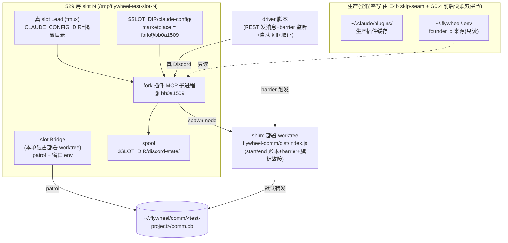

# FLY-1439 插件收据核销 producer 独立真机验收 — 实施计划
Issue: FLY-1439 (https://linear.app/geoforge3d/issue/FLY-1439/qafly-1437-独立真机验收-插件收据核销-producerfork-pr-17-bb0a1509)
日期: 2026-07-23
基于: research.md

**Status**: codex-approved(design review 5 轮:R1 8 项 + R2 5 项 + R3 6 项 + R4 3 项全部采纳,R5 APPROVED 零阻塞;见 §10 修订记录)

## 0. 一句话

在 529 房单 slot(Bridge + 真 slot Lead)里,用隔离 `CLAUDE_CONFIG_DIR` 加载 fork 插件 @ `bb0a150989c0d7477bbb03543052c87ee229d368`、用部署 worktree 的 CLI dist shim(barrier 驱动、脚本自动 kill)做确定性故障注入,把 FLY-1439 五条验收逐条打成真机铁证,verdict 供 FLY-1437 ship 门消费。

## 1. 目标 / 非目标 / verdict 语义

**目标** = issue 五条验收(exploration §3 拆解)。**能力级真机**:每条断言 ≥2 路独立取证(research §7 四路:comm.db / spool / Discord API / shim 账本+日志)。

**非目标**:重发耗尽→founder page 升级链(FLY-1426 QA 已真机 PASS);DM/roundtable msgKind 真机变体(fork 单测域);`handle-receipt ack` 腿的重新验证(上游 `discord-chat-receipt-contract.test.ts` 真 lease 已覆盖 —— **ack 非产品验收项,但作为 harness cleanup 是强制的,cleanup 失败 = HARNESS INVALID**,见 §5 通用收尾合同);codex code review 重跑;生产环境任何写操作。

**verdict 语义**:PASS = S1–S5 全绿且 head 未漂;任一红 = FAIL + 定位证据(产品缺陷 vs harness 故障严格分开);FAIL 单消费不可逆(复跑翻绿不收回,除非定位为 harness 缺陷且有证据)。verdict + 证据落本文件夹 qa-report.md,Lead 转录回 FLY-1437 thread。

## 2. 环境架构

### E 步骤(implement 节点照抄)

| # | 步骤 | 关键点 |
|---|---|---|
| E1 | **本单独占**部署 worktree(flywheel-FLY-1439 分支)`pnpm install && pnpm -r build`;记录 HEAD 完整 SHA | PR 不改主仓运行代码 → 与 main 等价;独占 = shim/trap 不与他人共享 dist |
| E2 | fork checkout:`git clone` fork → `git checkout bb0a150989c0d7477bbb03543052c87ee229d368`(detached)→ `bun install`;记录 `git rev-parse HEAD` 完整值 | 该 checkout **只作字节源**,mutation 探针(S5)绝不在此做 |
| E3 | 隔离 `CLAUDE_CONFIG_DIR = $SLOT_DIR/claude-config`:按既有 isolated logged-in recipe 种登录态(**recipe 须显式包含**:配置内绝对路径 rewrite 指向隔离根、清 stale Lead session-id;implement 节点不得靠猜)→ 注册/安装 claude-plugins-official marketplace → 用 E2 checkout 内容覆盖其 marketplace + cache 目录(镜像 `update-discord-plugin.sh:33-51` rsync 结构)→ `bun install` | **绝不写 `~/.claude/plugins/`**;`.fork-sha` 只是标签,字节证明在 G0.1(c) |
| E4a | test-deploy 钩子(本分支改动,default-off):`[[ -n "${TEST_LEAD_CLAUDE_CONFIG_DIR:-}" ]] && LEAD_EXTRA_ENV+=("CLAUDE_CONFIG_DIR=${TEST_LEAD_CLAUDE_CONFIG_DIR}")`(`env(1)` 后写胜出盖掉 `:1113` 的 `-u`)+ 守卫测试(unset=零行为/set=进 Lead env 块) | FLY-529 alert env 钩子同款先例 |
| E4b | **launcher 生产插件检查 skip seam**(本分支改动,default-off)。**三分支合同(R2#5 + R3#5)**:配套新 env `TEST_SKIP_PLUGIN_FORK_CHECK_EXPECTED_CONFIG_DIR`(由 test-deploy 与 `TEST_LEAD_CLAUDE_CONFIG_DIR` 同源传入)。fork 完整性检查块(`claude-lead.sh:706-737`)改为:① flag=1 **且** `CLAUDE_CONFIG_DIR` 非空 **且** 与 expected 逐字相等 → skip(log 注明);② flag=1 但 config 缺失/与 expected 不匹配 → **log ERROR + exit(fail-closed,配置错误的 QA launcher 不得落回生产 check/update)**;③ flag 未设 → 原检查块逐字节执行。守卫测试**三态**(unset=字节兼容 / flag-only 或 mismatch=exit 非零 / flag+匹配隔离 config=检查块整体不执行) | **R1#1**:launcher 每次启动都会跑硬编码 `$HOME` 的 check/update,update 会 `reset --hard` + rsync 写生产缓存 —— 事前阻断,不靠事后看 |
| E5 | shim 就位(§3):记录 `dist/index.js` 原始 SHA-256 → **先注册条件式 EXIT/INT/TERM restore trap(在第一次破坏性 rename 之前,R3#6)** → 原子 `mv index.js index.real.js` → 写入 shim(复原 = `mv index.real.js index.js`,核 hash 一致,删残余) | Bridge 零影响(teamlead 只 import subpath,research §4 已核);`dist/` 被 `.gitignore` 忽略,**`git checkout -- dist` 无效,复原只认 mv+hash** |
| E6 | 部署 env(全部 export 后再跑 `scripts/test-deploy.sh <slot>`):`FLYWHEEL_DELIVERY_SECRET_PATH=$SLOT_DIR/delivery-secret`、`TMPDIR=/tmp/fly1439t`、`FLYWHEEL_RECEIPT_WINDOW_P0_MIN=2`、`FLYWHEEL_RECEIPT_WINDOW_P1_MIN=2`、`TEST_LEAD_CLAUDE_CONFIG_DIR=$SLOT_DIR/claude-config`、`TEST_SKIP_PLUGIN_FORK_CHECK=1` | 窗口 env 双消费点(Bridge fork 继承 + launcher `:1443-1446` 透传插件);`FLYWHEEL_CHAT_RECEIPTS` 不设(默认启用) |
| E7 | driver bot 进 slot Lead 的 access allowBots(529 房 mirror 既有配方,`$SLOT_DIR/discord-state/access.json`) | A4 冒烟验证 |

## 3. 故障注入 shim 规格(协议冻结)

~80 行 node ESM,顶替部署 worktree `flywheel-comm/dist/index.js`:

- **默认 passthrough**:`spawn(process.execPath, [index.real.js, ...argv], {stdio: "inherit" 管道镜像})`,stdin/stdout/stderr/exit code 逐字节转发;**SIGTERM/SIGKILL 语义**:shim 收 SIGTERM 时向真 CLI 子进程转发后退出(被测 runtime `chat-receipt-runtime.ts:83,654-666` 固定 5s `proc.kill()`,shim 不豁免——见 hang 语义);
- **账本(两态)**:`$SLOT_DIR/shim-ledger.jsonl`,每次调用写 `{callId, phase:"start", ts, argv, mode}` 与 `{callId, phase:"end", ts, exit, durMs}` 两行(同 callId)——「已进入未结束」= 有 start 无 end **且 barrier 在**,不允许只靠缺 end 反推;
- **旗标**:`$SLOT_DIR/shim-mode`(无文件 = passthrough)。仅 `chat-receipt ` 匹配旗标才注入:`fail-begin`(begin 立即 exit 1)/`hang-complete`/`hang-settle`(命中后**原子写 barrier 文件** `$SLOT_DIR/shim-barrier--<msgId>.json`,内容 `{shimPid, callId, sub, msgId, ts}`,然后 sleep;**5s 后会被 runtime proc.kill() 杀掉是预期行为**——hang 的用途是「制造确定性失败 + 给 driver 一个自动化触发点」,不是无限挂起);其余子命令(ask/pending/handle-receipt…)永远 passthrough;
- **driver 自动化 + 硬 harness gate(R2#3;5s deadline 是真实约束,不豁免)**:S2b/S2c 的 kill 由 driver 脚本轮询 barrier 文件触发。**barrier→kill 协议冻结**:barrier 出现(记 monotonic `barrierSeenAt`)→ 只做**最小本地快照**(intent/settle-intent 文件存在性 + stat;不做任何网络调用)→ 原子恢复 shim passthrough(挪走旗标)→ **立即 kill**(记 `killAt`);**成立判据**:`killAt - barrierSeenAt < 2s`(保守预算,远小于 runtime `COMMAND_TIMEOUT_MS=5000`,`chat-receipt-runtime.ts:83,654-665`)且 kill 时该 callId 账本仍 start-without-end 且 barrier 的 shimPid/callId 与账本匹配;Discord reference 等网络取证**一律 kill 之后**按消息时间戳回查。**预算错过 / call 已 end / PID 不匹配 → 判 `HARNESS INVALID`:清场重做,绝不计产品 PASS/FAIL**;
- **orphan 清理**:每场景收尾断言零残留 shim 子进程(`pgrep -f index.real.js` 按 slot 路径过滤)、零残留 barrier 文件;
- **自测**(Q1 完成判据):passthrough 全链一致;三个故障模式逐一命中 + barrier 原子出现;账本 start/end 配对完整;trap 复原后 `dist/index.js` hash = 原始记录。

**Lead 生命周期协议(R2#2 + R3#1;`tmux kill-window` ≠ 停 Lead —— launcher supervisor loop 会自动重启,`claude-lead.sh:1654-1678,2893-2897,3077-3104,3166-3167`;supervisor 只观察 window,杀 MCP 不会让 pane 退出)**:
- **崩溃+自动重启(S2b/S2c 用)**:刻意**利用** supervisor。S2b:恢复 passthrough → `tmux kill-window` → supervisor 重建。**S2c 冻结全序**:barrier gate 内恢复 passthrough → `kill -9 <MCP pid>` → **证明旧 MCP 已死**(`ps -p` 无)→ **显式 `tmux kill-window`** 触发同 supervisor 重建(杀 MCP 本身不触发);**重启铁证** = 新 window id + 新 MCP pid + launcher restart log 行 + ready 后 lease 恢复;
- **orphan shim exact-PID 收割合同(R3#1;MCP 被 SIGKILL 后其 sleep 中的 shim 子进程不级联死亡,5s timer 也随 MCP 消失)**:证据保存后,按 barrier 里的 **exact shimPid** 校验其 command/slot 路径与父进程已死 → 主动 TERM/KILL + wait → **才删 barrier 文件**;S2b 同一合同;「零 orphan」断言以 exact-PID wait 为准,`pgrep` 只作旁证;
- **真停 Lead(S4 用)**:按 `test-teardown.sh:440-462` 模式 **SIGTERM supervisor PID** → 等 supervisor 进程与 window 双消失才算停;手启 companion 后记录其 supervisor PID,场景收尾对该 PID 同等清理;
- 取证一律 `ps -o pid,ppid,command`,**禁止 `ps eww` 落盘——env 含 token**。

## 4. G0 冒烟门(四门全过才进场景;任一失败 → 按 research §6 退路,绝不带病往下跑)

| 门 | 断言 | 铁证 |
|---|---|---|
| G0.1 插件字节(**三件合一**) | (a) MCP server 进程 argv/script path 在 `$SLOT_DIR/claude-config/` 下(`ps -o pid,ppid,command`,零 env 落盘);(b) 隔离配置的 `installed_plugins.json`/`known_marketplaces.json` 内绝对路径全部指向隔离根;(c) 运行时 Discord 插件目录受控文件清单 SHA-256 与 `git archive bb0a150989…:external_plugins/discord`(排除 node_modules/lock/install 产物/`.fork-sha`)**逐文件零 diff**;另记录 E2 checkout 完整 HEAD;插件 stderr 无 `CHAT RECEIPT WIRING BROKEN` | ps 输出(command 列)+ 两 JSON 摘录 + manifest diff 报告 + lead.log 摘录 |
| G0.2 shim 透明(A5) | 直连一条链(shim 暂 mv 回)与 shim passthrough 一条链,comm.db 状态迁移一致 | 两条链行 dump 对照 + 账本 start/end 配对 |
| G0.3 gate 放行(A4) | driver bot 消息被 Lead 收到(pane/回复可见) | Discord msg id + lead 响应 |
| G0.4 生产无害(**前后内容快照,非 mtime**) | 部署**前**快照:生产 `installed_plugins.json` hash、active cache 与 marketplace 的 `server.ts` SHA-256 + `.fork-sha`、`~/.flywheel/repos/claude-plugins-official` 的 HEAD/`git status`;QA 全程结束后**同项复拍逐字节一致**;delivery-secret 三判据(marker↔磁盘对上、无部署窗新文件) | 前后快照文件对 diff |

## 5. 场景矩阵

**通用收尾合同(R3#3 + R4#2:执行粒度 = 每个武装了 receipt 的 test case / 子窗之后、下一个 case 之前,不是「每场景」)**:
1. spool(含 settle/)零残留 intent、零残留 barrier、orphan shim 按 exact-PID 收割完毕(§3);
2. **该 case 的全部 test root 收据均已 processed** —— delivered-but-unprocessed 根 2 分钟后就会被 patrol 合法重发(`next_unprocessed_at` 由 complete 武装,`lead-inbox-queue.ts:685-712`;patrol 选择器 `db.ts:3916-3928`),污染下一个 case 的 oracle。优先用真实 explicit reply 关账;否则在真实 Lead pane 内 `handle-receipt ack` 作**强制 harness cleanup**(仍不是产品验收项);**cleanup 失败 = HARNESS INVALID,停止推进,不许「留给 teardown」**;
3. **具体执行点(R4#2)**:G0.2/G0.3 的真消息 → 收尾 processed 后才进场景;S2a 关闭 M3 后才进 S2b;S2b 关闭 M4 后才进 S2c;S3 的 M7 **必须 processed**(非可选)后才进 15min 变体,变体恢复/drain 后其根同样关闭;
4. S1/S2 的「patrol 零误重发」等待窗**只在全部相关根 processed 之后开始计时**。

### S1 全周期 + patrol 零重发(验收 1;1437 plan §7.2-7.4)

1. driver 发 M1(文本请 Lead 回复确认)→ 断言 `chat:<lead>:<M1>` 行 pending→delivered;`next_unprocessed_at - delivered_at ≈ 2min`(P1 窗透传铁证);
2. slot Lead **真模型**回复且 Discord API 上该回复 `message_reference.message_id = M1`(A3)→ settle → `processed_at` 非空 + evidence `kind=discord_explicit_reply` + 账本 settle start/end 恰一对;
3. 等 ≥2.5 × 窗口(≥5min)→ 断言:无 `resend_of = <M1 收据id>` 行、无 receipt_unprocessed alert;
4. **阳性对照 M2(证 patrol 真在跑,否则「零重发」空断言)**:用真 CLI 直接 begin+complete 合成一条收据行(不经插件、不回复)→ 窗口到期后断言 ≥2 路:resend child 行(`resend_of` 命中)+ `receipt_resend_deliveries` 账本/Lead 可见提醒;收尾按通用收尾合同 2:真实 Lead pane 内 `handle-receipt ack`(完整命令 + 唯一 request-id,lease env 天然在)作强制 harness cleanup —— **ack 不是产品验收项**(上游真 lease 测试已覆盖,R1#8),但 cleanup 失败 = HARNESS INVALID 停止推进(R3#3)。

A3 失败(Lead 不带 reply_to)= **产品级发现**记入 verdict(instructions 引导力不足),复跑 1 次排除偶然;机制级隔离定位可用 MCP 客户端直调 reply 工具补充,但不替代能力级结论。

### S2 崩溃恢复(验收 2;三个确定性窗;**并发回复控制 = 预写双 oracle + barrier 自动 kill**,R1#4)

| 窗 | 步骤 | 断言 |
|---|---|---|
| S2a begin 崩溃窗 | `fail-begin` → M3(文本注明「测试消息勿回」)→ 投递照走;恢复 passthrough → 下一条消息 piggyback kick 触发 drain | M3 期间:spool intent 在(目录 0700/文件 0600)、comm.db 无行。**双 oracle 预写(Lead 是否回复均为合法路径,以 Discord/settle-intent 实况判定走哪条)**:(α) Lead 未回复 → drain 补 begin → pending → `[redelivery]` notify → complete → delivered;(β) Lead 竟带 reference 回复(settle intent 已落)→ drain 补 begin 后 settle 重放 → processed,**零 redelivery 亦为正确**(pending selector 排除 processed,`lead-inbox-queue.ts:749-781`)。两条共同断言:**恰一行**、intent 全消、同信封手动重放 begin CLI = no-op(幂等) |
| S2b notify→complete 窗(**强制 oracle:必须走 redelivery**) | `hang-complete` → M4(注明勿回)→ begin ok、notify ok → driver 依 §3 barrier→kill 协议执行:barrier 出现 → 最小本地快照(comm.db 行 pending、`processed_at IS NULL`)→ 恢复 passthrough → **<2s 内 `tmux kill-window`**(supervisor 自动重建,§3 生命周期协议)| supervisor 重启铁证(新 window/MCP pid + restart log)→ ready kick → pending reconcile → `[redelivery]` 前缀重投(Discord 可见,kill 后按时间戳回查「kill 前无带 M4 reference 的成功回复」)→ complete → delivered 恰一次;§3 成立判据不满足 = HARNESS INVALID 重做 |
| S2c settle write-ahead 窗(R1 HIGH 真机复现) | `hang-settle` → M5 走完 begin/complete、Lead 真回复(reply_to)→ settle 命中旗标 → driver 依 §3 协议:barrier 出现 → 最小本地快照 → 恢复 passthrough → **<2s 内 `kill -9 <MCP pid>` + 让 window 退出**(supervisor 重建 MCP,§3) | **write-ahead 铁证三件(kill 时刻)**:`shim-barrier-settle-<M5>` 存在(= CLI 已进入)+ `spool/settle/<M5>.json` 已在盘(0600)+ 账本该 callId start-without-end;重启后 drainSettlePass 重放 → processed 恰一次 + intent 删除;同证据手动重放 settle = 幂等(「不重复销账」);§3 成立判据不满足 = HARNESS INVALID 重做 |

收尾:按通用收尾合同把 S2 全部根关到 **processed**(delivered 不是稳态 —— patrol 会合法重发,R3#3)→ 再等一个窗口断言 patrol 零误重发 → 零残留检查。

### S3 记账失败不拦消息(验收 3;**故障 = ENOTDIR,躲开 `ensureSpoolDir` 自愈**,R1#5)

1. 注入:`fail-begin` + **原子把空 spool 目录挪走、在 `chat-receipt-spool` 路径放一个普通文件**(`ensureSpoolDir()` 的 `chmodSync 0o700` 修不了 ENOTDIR;trap 登记复原)→ driver 发 M6(注明勿回,隔离 settle 腿的 advisory 计数)→ 断言:**M6 照常投递**(Lead 收到,能力核心)+ **begin-spool-failed 专属 advisory 恰一次**(`⚠️` 落 chat,Discord API 断言)+ comm.db 无 M6 行 + 无伪 delivered;**不要求 M6 事后自愈**(spool 写失败 = 无 intent 可 drain,这就是该路径的合同形态,如实记录 M6 终态);
2. 复原(目录挪回 + passthrough)→ **M7 健康阳性对照**:完整入账 pending→delivered→**processed(必须,R4#2 —— 回复或 ack 关账后才进变体)**;
3. 变体(时间盒 15min):仅 fail-begin(spool 可写)→ intent 落盘 + `attempts` 随 kick 递增(dump intent JSON 对照)。

### S4 companion 零行为(验收 4;**唯一做法冻结**,R1#6)

1. **真停 slot 标准 Lead**(§3 生命周期协议:SIGTERM supervisor PID → 等 supervisor+window 双消失,单 listener 原则)→ **手动调用同一 launcher** 起 companion 形态 Lead。**配置源冻结(R2#1:launcher 经 `_companion_query()` → `ProjectConfig.loadProjects()` 只读 `FLYWHEEL_PROJECTS` env,否则回落 `~/.flywheel/projects.json`,`ProjectConfig.ts:279-305` + `claude-lead.sh:340-351`;`FLYWHEEL_PROJECTS_FILE` 不被 launcher 读取)**:env = 标准 slot Lead env 块,但 **`FLYWHEEL_PROJECTS` 本身替换为预写 companion JSON**(冻结完整字段:projectName=<test-project>、该 lead 条目 agentId/bot token env/chat channel 与标准 slot 相同 + `companion:true`)+ **companion 专属** `DISCORD_STATE_DIR=$SLOT_DIR/discord-state-companion` + 专属 workspace + 同一隔离 `CLAUDE_CONFIG_DIR` + `TEST_SKIP_PLUGIN_FORK_CHECK=1` + **`TEST_SKIP_PLUGIN_FORK_CHECK_EXPECTED_CONFIG_DIR=$SLOT_DIR/claude-config`(R4#1:手启不经 test-deploy,expected env 不会自动出现;启动前断言其与 `CLAUDE_CONFIG_DIR` 逐字相等,并纳入 pane/launcher 白名单证据 —— 缺它 E4b 会按设计 fail-closed 直接退出)**。**session-id 合同(R3#2:`SESSION_ID_FILE = ~/.flywheel/claude-sessions/${PROJECT_NAME}-${LEAD_ID}.session-id` 是固定路径,不受 workspace/state dir/config dir 影响,`claude-lead.sh:190,466-468`;不动它 = companion 会 `--resume` 标准 Lead 的会话,`:3001-3016`,且旧 workspace session-id 是确定性 resume crash,`test-deploy.sh:1080-1086`)**:真停标准 supervisor 后,把该 session-id 文件(连同同 key 的 manifest)**原子挪到 slot backup** 并注册 trap;**断言 companion 启动日志为 `Fresh start` 而非 `Resuming`**;收尾停 companion 后删 companion session-id,再还原 backup(或明确记录不再重启标准 Lead)。「专属 session-id」不是 env 配置项,只能靠这套挪文件协议。**启动前在 companion state dir 预种最小脱敏 `access.json`(allowBots 含 driver bot ID —— 否则插件直接丢弃 driver 消息,pinned `server.ts:1505-1511`),其 hash/allowBots 摘要入 pre/post 证据**。**Bridge 不重启**(本场景断言全在插件侧,不依赖 Bridge boot-time config);
2. 身份铁证:launcher 日志 `Role: companion`(`claude-lead.sh:382`)+ pane 内白名单取证 `env | grep '^FLYWHEEL_LEAD_COMPANION='`(**不落 `ps eww`**);记录 companion supervisor PID;
3. driver 发消息 → **pre/post delta 断言**(不是「全局从未存在」,S2/S3 历史在别的 state dir):回复照常;comm.db **零新增** `chat:<companionLead>:` 行(零假收据);companion state dir 下**零新增** spool/settle intent;零 receipt advisory;stderr 零 broken 告警;
4. 收尾:对 companion supervisor PID 执行同款真停协议(SIGTERM → 双消失)→ 需要时重启标准 Lead;stock 形态不做真机 —— 由 S5 审计 fork byte-compat 断言域真实性覆盖(诚实边界,写进报告)。

### S5 172 测试口径复核(验收 5)

1. E2 checkout 独立重跑 `bun test`(真 built PR-1 CLI + `/usr/bin/sqlite3` 在位)→ **硬门 = 精确 172 pass / 0 fail / 411 assertions 且输出零 loud-skip**(R1#4 纪律);记录 bun/sqlite 版本;若计数漂移:先产出**逐测试文件 discovery diff + 等价性证据**,交 Lead 明确例外裁定,**不接受「同数量级」**(R1#7);
2. 四类断言真实性审计(research §5):集成真 CLI 真库;byte-compat 快照与 fork main(`ff159052`)server.ts 三处字符串逐字对照;settle 谓词负测用真 payload 构造;spool 权限断言真 fs mode;
3. **定向 mutation 探针 ×3(时间盒 45min;全部在 disposable detached copy 中做,E2 checkout 一个字节不动;每针冻结「文件/语句/测试命令/测试名/预期失败断言」,R2#4)**:
   - m1 = copy 中注释 `chat-receipt-runtime.ts` settle write-ahead 落盘语句(intent 写在 CLI 调用之前那行)→ `bun test chat-receipt-runtime.test.ts` 的 write-ahead 边界回归测必须红(断言「CLI in-flight 时 intent 已存在」的那条);
   - m2 = copy 中改 **`chat-receipt-recorder.ts:64-69` 三个 stock 常量之一**一个字符(stock 字符串常量在 recorder,不在 server.ts)→ `bun test chat-receipt-recorder.test.ts` 的 byte-compat 快照测(`chat-receipt-recorder.test.ts:268-277` 域)必须红;
   - m3 = **CLI 集成 seam 的确定性破坏(构建+路由+证据靶点全冻结,R3#4 + R4#3)**:主仓 disposable copy 中把 `lead-inbox-queue` enqueue 的 `INSERT OR IGNORE` 改为 `INSERT` → `pnpm --filter flywheel-comm build` 重建该 copy 的 dist;**mutation 证据 = patched source 与 emitted `dist/lead-inbox-queue.js` 的 before/after SHA-256(tsc 逐模块输出,SQL 变化落在该文件;入口 `dist/index.js` 通常字节不变,其 hash 只作 CLI 路由证明)+ 断言 emitted SQL 已变为 `INSERT`** → fork disposable copy 中以 **`FLYWHEEL_COMM_CLI=<mutated-copy>/packages/flywheel-comm/dist/index.js` 显式路由**跑 `bun test chat-receipt-runtime.test.ts`(集成测从 env 取 CLI,缺失即 loud-skip,`chat-receipt-runtime.test.ts:81-86` —— **必须同时断言零 loud-skip**,否则可能一直在测原 CLI 假绿);**冻结预期 = 第二次 `runtime.begin()` 不再返回 `ok`(重放撞主键抛错),测试在第二个 begin 断言处失败**(现测试只查 canonical id count,`:102-106`,「另造一行」不保证触发,故用主键撞击这种必然形态);
   - 每针后删 copy;任一探针不红 = 空过绿 = FAIL 级发现;
4. 扫 FLY-1435 形态:fixture 中「显式 null/空串」vs「省略字段」用法与判定逻辑比对 —— companion 空串合同恰是本被测物敏感点,重点核启用判定矩阵用例 env shape 真实性;
5. **verdict 前 clean 三查**:E2 checkout `git rev-parse HEAD` = bb0a1509 完整 SHA、`git status --porcelain` 空、与 `git archive` manifest 零 diff。

## 6. 安全护栏(硬规则)

- **生产零写清单**:`~/.claude/plugins`(E4b skip-seam 事前阻断 + G0.4 前后内容快照双保险)、`~/.flywheel/.env`(只读)、生产 comm/teamlead/audit 各 db(零触)、fork main(零推)、生产 Bridge/Lead(零动);
- **证据脱敏**:零 token —— 进程取证只用 `ps -o pid,ppid,command`;env 取证只用 pane 内白名单 grep 单键;Discord 证据只留 msg id/内容摘录;
- `FLYWHEEL_DELIVERY_SECRET_PATH` + 短 `TMPDIR` 必设(E6);部署前 grep slot bridge.log 无 `No project runtimes initialized`(research §3.2);
- **trap 纪律**:E5 shim、S3 ENOTDIR、S4 状态切换全部在注入当刻注册 EXIT/INT/TERM trap;teardown 复原以 **hash 核对**为准;
- **两阶段收尾(R3#6)**:① evidence checkpoint commit(全部场景证据)→ ② teardown:`test-teardown.sh` + shim mv 复原(核 hash)+ slot lock 清理 + **G0.4 后快照**(teardown 自身的结果也是证据)→ ③ 据 ②的实际结果写定 qa-report/verdict → final commit。teardown 若失败,verdict 必须如实反映,不允许先落笔后清场;QA 证据保留至 Annie 验收;
- **执行隔离**:本单 QA 由全新 implement 节点会话执行,不得是 `3870740d` 或任何写过 FLY-1437 代码的会话(开场自证并写进报告);
- **head 钉死**:开跑前 + verdict 落笔前 `git fetch` 后比对 fork 分支 head = `bb0a150989c0d7477bbb03543052c87ee229d368`,漂移 = 作废重测。

## 7. 交付物

1. `qa-report.md`(本文件夹;结构参照 FLY-1426 qa-report.md:范围诚实划界 / 逐场景证据 / follow-up / verdict);
2. 证据附件(脱敏零 token):DB dump 摘录、Discord msg id 清单、shim 账本摘录、`ps -o command` 输出、G0 四门记录、G0.4 前后快照对 —— commit 进本文件夹 `evidence/`;
3. 主仓代码改动(仅 harness,均 default-off 字节兼容):E4a test-deploy 钩子(守卫测试两态)+ E4b launcher skip seam(守卫测试三态,R3#5);shim 不 commit 运行态,源码入 `evidence/shim.mjs` 存档;
4. Lead DONE 报告:verdict + qa-report 路径 + 关键证据指针;Lead 转录 FLY-1437 thread。

## 8. 实施切片(implement 节点执行序;每 chunk 末更新 progress.md)

| chunk | 内容 | 完成判据 |
|---|---|---|
| Q1 | E4a+E4b 钩子/seam+守卫测试(E4a 两态 + E4b 三态);shim 实现+离线自测(§3,含 trap/barrier/账本配对) | 守卫测试绿;shim 自测全过;trap 复原 hash 一致 |
| Q2 | E1-E3+E5-E7 环境搭建 + G0 四门(G0.4 **前**快照先拍) | G0 全过,铁证落 evidence/ |
| Q3 | S1 + S2 | 断言全绿(或红=定位证据),证据落盘;每场景收尾合同过 |
| Q4 | S3 + S4 | 同上 |
| Q5 | S5 复跑+审计+mutation 探针(disposable copies) | 172/0/411 精确复现 + 探针 3/3 红 + clean 三查 |
| Q6 | **两阶段收尾(§6)**:evidence checkpoint commit → teardown+shim 复原+G0.4 后快照 → 据实写定 qa-report/verdict → final commit → DONE 报 Lead | 两次 commit 均在;生产前后快照逐字节一致 |

## 9. 风险

| 风险 | 缓解 |
|---|---|
| A1 不成立(CLAUDE_CONFIG_DIR 不搬插件根) | G0.1 三件合一兜住;退路 = 隔离 HOME 形态;再不行升级 Lead ——**任何情况不动生产缓存** |
| Lead 模型不带 reply_to(A3) | 本身是被验能力;复跑 1 次排偶然;结论如实进 verdict |
| Lead 并发回复搅 S2 oracle | S2a 双 oracle 预写;S2b barrier 自动 kill + kill 时三项取证;消息文本注明勿回作第一道减噪 |
| founder P0 腿打不到(P1-only) | producer 三条腿同路,P1 等价驱动;P0 = 诚实边界,Annie 在场可选补录,非阻塞 |
| patrol tick 与 2min 窗时序抖动 | 断言窗留 2.5× 裕量;阳性对照 M2 锚 patrol 活性 |
| 172 复跑数字漂移(bun/环境差异) | 硬门精确 172/0/411;漂移走 discovery diff + Lead 例外裁定,不降门 |
| slot 房被生产 audit.db 损坏拖死 | 部署前 bridge.log 探测;命中则先报 Lead 修产线,不硬跑 |
| shim 引入 Heisenbug / 残留污染 | G0.2 直连对照;故障注入只匹配 chat-receipt 子命令;trap+hash 复原;每场景零残留合同 |

## 10. 修订记录

- v1(2026-07-23):初稿。
- v5(2026-07-23,codex design review R4,3 项全采纳):
  1. HIGH S4 手启显式带 `TEST_SKIP_PLUGIN_FORK_CHECK_EXPECTED_CONFIG_DIR` + 启动前 byte-equal 断言 + 白名单证据(否则 E4b 按设计 fail-closed)(§5 S4)。
  2. HIGH 收尾合同粒度下沉:每个武装 receipt 的 case/子窗之后立即关账(G0.2/G0.3、S2a→S2b、S2b→S2c、S3 M7 必须 processed 后才进变体);§1 ack 措辞与 §5 对齐(强制 harness cleanup,失败=HARNESS INVALID)(§1/§5)。
  3. MEDIUM m3 证据靶点改 emitted `dist/lead-inbox-queue.js` before/after hash + emitted SQL 断言;`dist/index.js` hash 只作路由证明(§5 S5)。
- v4(2026-07-23,codex design review R3,6 项全采纳):
  1. HIGH S2c 全序冻结:恢复 passthrough → SIGKILL MCP → 证明已死 → 显式 `tmux kill-window` 触发 supervisor 重建(杀 MCP 不触发);orphan shim 改 exact-PID 收割合同(校验 command/父进程死亡 → TERM/KILL+wait → 才删 barrier),S2b 同款(§3/§5)。
  2. HIGH S4 session-id 挪文件协议:固定路径 `~/.flywheel/claude-sessions/<project>-<lead>.session-id` 原子挪 backup + trap,断言 companion `Fresh start` 非 `Resuming`;收尾删 companion session-id + 还原 backup(§5 S4)。
  3. HIGH 通用收尾合同升级:全部 test root 必须 processed(delivered 非稳态,patrol 会合法重发);ack 升为强制 harness cleanup(仍非产品验收项),cleanup 失败 = HARNESS INVALID 停止推进;零误重发窗在全根 processed 后起算(§5)。
  4. HIGH m3 构建+路由冻结:主仓 copy 改语句 → `pnpm --filter flywheel-comm build` + 记 mutated dist hash → fork copy 以 `FLYWHEEL_COMM_CLI=<mutated dist>` 显式路由 + 断言零 loud-skip(§5 S5)。
  5. MEDIUM E4b 三分支:flag+expected-path 逐字相等才 skip;flag-only/mismatch = exit fail-closed;unset = 原块逐字节;守卫三态,交付物措辞同步(§2/§7)。
  6. MEDIUM 两阶段收尾:evidence checkpoint commit → teardown+shim 复原+后快照 → 据实写定 verdict → final commit;E5 restore trap 在首次破坏性 rename 前注册(§2/§6/§8)。
- v3(2026-07-23,codex design review R2,5 项全采纳):
  1. HIGH S4 配置源冻结:`FLYWHEEL_PROJECTS` env 本身替换为 companion JSON(launcher 不读 `FLYWHEEL_PROJECTS_FILE`,`ProjectConfig.ts:279-305`);companion state dir 预种含 driver bot 的最小 `access.json`(否则插件丢弃 driver 消息)(§5 S4)。
  2. HIGH Lead 生命周期协议冻结:`tmux kill-window` 会被 supervisor 自动拉起 —— S2b/S2c 刻意利用 supervisor(恢复 passthrough → kill → 以新 window/MCP pid + restart log 证明重启);S4 真停 = SIGTERM supervisor PID 等双消失(`test-teardown.sh:440-462` 模式)+ PID 记账(§3/§5)。
  3. HIGH barrier→kill 硬 harness gate:最小本地快照 → 恢复 passthrough → <2s kill(monotonic 计时,远小于 runtime 5s deadline);kill 时 callId 须 start-without-end 且 PID 匹配;网络取证一律 kill 后回查;判据不满足 = HARNESS INVALID 重做,不计产品 PASS/FAIL(§3/§5)。
  4. HIGH S5 探针钉死到真实靶点:m2 改 `chat-receipt-recorder.ts:64-69` stock 常量(快照测在 recorder.test:268-277,非 server.ts);m3 改 CLI 副本 `INSERT OR IGNORE`→`INSERT` 主键撞击(现集成测只查 canonical id count,「另造一行」不保证触发);每针冻结文件/语句/测试名/预期失败(§5 S5)。
  5. MEDIUM E4b 完整 if/else 合同:skip 分支需 flag=1 **且**隔离 CLAUDE_CONFIG_DIR 非空;仅 flag = fail-closed;守卫测试三态(§2 E4b)。
- v2(2026-07-23,codex design review R1,8 项全采纳):
  1. HIGH 生产插件缓存保护由「事后 mtime」改「事前阻断」:新增 E4b launcher skip seam(default-off)+ G0.4 改前后内容快照;取证禁 `ps eww`(token 卫生)(§2/§4/§6)。
  2. HIGH G0.1 字节证明改三件合一(argv 路径 + 配置 JSON 指向 + `git archive` 逐文件 SHA-256 零 diff),`.fork-sha`/`git rev-parse` 降为标签;E3 recipe 显式含 path-rewrite/session-id 清理(§2/§4)。
  3. HIGH shim 协议冻结:独占 worktree、mv+hash+EXIT trap(明确 `git checkout -- dist` 无效)、start/end 两态账本、barrier 文件、driver 自动 kill(5s proc.kill 窗内全脚本化)、orphan/残留清理(§3)。
  4. HIGH S2 并发回复控制:S2a 预写双 oracle(settle-before-complete 是合法路径);S2b 强制 redelivery oracle = barrier 自动 kill + kill 时三项取证;每场景零残留收尾合同(§5)。
  5. HIGH S3 故障注入改 ENOTDIR(普通文件占位 spool 路径),躲开 `ensureSpoolDir` chmod 自愈;oracle 改「fail-open 投递 + 专属 advisory + 无行 + 不要求自愈」+ M7 健康对照(§5)。
  6. HIGH S4 冻结唯一做法:停标准 Lead → 手动同 launcher + companion-true `FLYWHEEL_PROJECTS_FILE` + 专属 state dir/session-id;断言改 pre/post delta;Bridge 不重启的依据写明(§5)。
  7. MEDIUM S5 硬门恢复精确 172/0/411 + 零 loud-skip;漂移走 discovery diff + Lead 裁定;mutation 全部 disposable copy + 每针冻结「行/测试/预期失败」;m3 钉到 CLI 集成 seam;verdict 前 clean 三查(§5)。
  8. MEDIUM ack 腿降级 best-effort(真实 Lead pane 内跑,lease 天然在;不设门),阳性对照证据改 ≥2 路(resend child + resend_deliveries/提醒可见)(§1/§5)。
