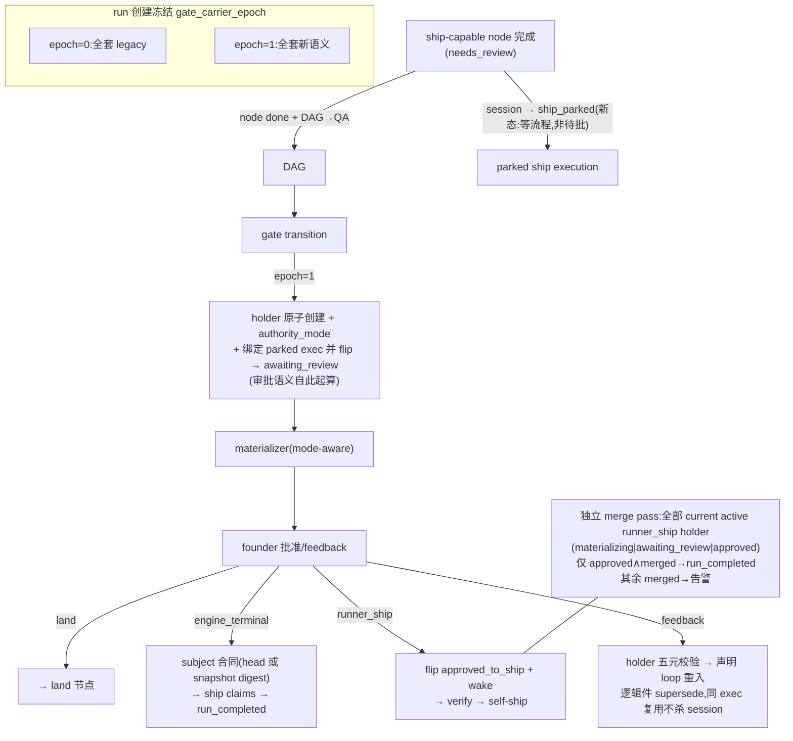

# FLY-1441 Gate 到达发射 — 实施计划(design epoch 4)
Issue: FLY-1441 (https://linear.app/geoforge3d/issue/FLY-1441/规则回迁-qa-绿了才发-ship-gate-把-fly-579-定过的规矩在-dag-引擎上重新落地-加防丢测试)
日期: 2026-07-23
基于: research.md
修订: R6(R5 唯一 HIGH 采纳:`gate-carrier-rebind` 定为单一原子 authority 事务 —— holder 增 `carrier_binding_state=unbound|bound` 列,rebind apply 在一个 StateStore 事务内完成:①复验 run active/epoch=1/runner_ship/holder 仍 materializing·question_intent·unbound;②三重重证明 candidate(current activation + session 恰 `ship_parked` + head≡holder/evidence);③CAS holder source/binding_state + session flip `ship_parked→awaiting_review` + `review_question_id/pr_head_sha` 绑定 + review window 重置戳;④immutable audit receipt,一起 commit;**materializer 查询只返回 `carrier_binding_state=bound` 的 runner_ship holder(land/engine_terminal 创建即 bound)—— question 绝不先于 session authority 出现**;同 actor 重放返原 receipt、竞争 candidate CAS 失败、任何失败保持 question_intent 且 CommDB 零 question;W7 增 rebind-commit-后-materializer-前崩溃恢复 / 双 candidate 并发唯一成功 / 重放不重置 48h window / session authority 完成前 CommDB+card 恒空。正常路径同款不变量:Gate 创建事务本身即完成绑定(bound),unbound 只出现在绑定解析失败分支。R4 四 HIGH + 二 MEDIUM 全采纳:H1 新增 `workflow_gate_holder_evidence` 不可变子表 —— 每条 manifest 声明的非 founder prerequisite 一行(holder 身份/claim id/predicate+decision binding/node id/node attempt/subject kind+digest),Gate 事务证明证据集 ≡ 冻结 ship_claims∖{founder} 且 head-bearing 全收敛同一 head 才随 holder 提交,generic 零 head = 零行,schema 清单同步;H2 credential janitor(run-infra.ts:700-715 内层 running|awaiting_review allowlist)纳入 `ship_parked`,并审计全部 getActiveSessions caller 的二次 status 过滤,W7 加 retained-home sentinel 跨重启 + 后续批准→wake→verify→ship 全链、terminal 对照仍被 scrub;H3 持久 `workflow_loop_reentry_request` 状态机(stable request id/canonical digest/token 身份/source node+attempt/expectedIteration/status/最终 receipt),同一 SQLite 事务内 idempotency row+transition+receipt 一起 commit,重放**先查 committed receipt 再验 token**,四个 crash 窗口 + 重启测试;H4 unbound 修复弃用业务 loop —— 新增独立审计化 `gate-carrier-rebind` 两段命令(仅绑经 current-activation/session/head 重证明的 parked/replacement actor,不产生任何 QA/founder outcome),W7 从真实 missing-carrier 走到 materialized→批准→ship;M5 Blueprint 合同钉死为 `ctx.generalizedExecutionContext?.gateCarrierEpoch`(嵌套对象扩展,两个构造位点都写);M6 架构图 merge pass 补 materializing、风险 §6.2 改六族矩阵口径并纳入 janitor/caller 过滤审计。R3 七 HIGH 全采纳:H1 feedback 两阶段状态合同 —— 五元事务内 `awaiting_review→ship_parked`(同步清 review binding/timeout 语义),wake 才 `ship_parked→running`;H2 `ship_parked` 逐消费者迁移矩阵入 W3(re-adopt/active inventory/duplicate admission/worktree protection/parked patrol/manual finalize-terminate 六族)+ W7 六条固定测试;H3 新增「execution 当前 activation」权威解析器(active run/current node/attempt 唯一解析,歧义 fail-closed 绝不退 legacy),fence 与全部 execution-only 消费面迁移;H4 subject kind 由 admission 冻结的 ship_claims+decision binding 推导,head 必须取自当前 attempt 已解析 passing claim,runner 携带值不得改 kind;H5 Gate 到达时把已接受的 current-attempt verdict 冻进 holder 作 durable evidence(supersede/revocation 管理),resolver 验 holder/attempt/revocation 而非提交 credential 的 1h TTL —— 48h 审批窗死锁根除;H6 merge pass 候选含 `materializing|awaiting_review|approved` 全部 current active holder,仅 approved∧merged 完成、其余 merged 告警;H7 loop-reentry 恢复 loopback+same-origin+两段 confirm token(绑 runId+loopId+source node/attempt+expectedIteration,mutation 前持久 claim,重放返原 receipt,expectedIteration 必由 token 固定)。R2 七 HIGH+一 MEDIUM 全采纳:H1 新驻留态 `ship_parked` —— 到 Gate 才事务性进入 `awaiting_review`,审批语义(badge/gate_timed_out/park-watch)从 Gate 起算;H2 supersede 改为「先 supersede 逻辑件(activation/credential/binding/holder),同 execution 复用不 terminalize session;仅当替换者以不同 execution durable admission 后才关旧 session」;H3 merge pass 候选集扩为全部 active runner_ship holder(awaiting_review|approved),rogue 分支可达;H4 engine_terminal subject 合同重定:有 artifact head 用 gate-entry git head,仅 `tpl_generic` 类零 claim 流程用 snapshot digest,并把 snapshot 路径贯穿 payload/claim/system-claim invariant/resolver;H5 v1/v2 validator 增 Gate-feedback 拓扑合同,4 个 eng seed 补 loop,4 个 engine_terminal seed 本轮不支持 feedback 且卡上不给必败按钮;H6 loop-reentry 放弃 lead authority 枚举 —— API 只能提交声明 loop 的机器 outcome(authority 由 outcome 服务端推导,qa 类受 max_iterations,founder 越限仅认 durable source event),initiator 记入事件 payload 审计,零 schema CHECK 改动;H7 decision family/predicates/subject 从 manifest 声明的 verdict 对推导冻结,credential mint/rotation/decision route/claim writer/ship resolver 同源;M prompt 谓词改 `gateCarrierEpoch1`,不重定义 isGeneralizedExecution。R1 六 HIGH+三 MEDIUM 已于 R2 折入)

---

## 0. 一句话

**engine-owned run 的 ship 审批载体 = 引擎在流程真正抵达模板 terminal Gate 时权威物化的 gate holder;ship-capable 节点完成后 session 进入新驻留态 `ship_parked`,到 Gate 才事务性变 `awaiting_review`(审批语义从 Gate 起算);批准后按 capability bundle 推导的三种 authority mode 执行;runner 永不自建 ship question;零 QA/模板/节点名特判;`gate_carrier_epoch` run 级冻结零混代零回填;拓扑回归测试 + 节点名中立守卫常驻 CI。**

## 1. 目标 / 非目标

**目标**
1. **Generic Gate-arrival 载体**:engine-owned terminal Gate 到达时(且仅此时)原子创建唯一 holder → materializer 物化真实 `approve_to_ship` question + founder 卡。`tpl_generic` 无 QA 直达 Gate 照常开门(正向测试)。
2. **审批语义从 Gate 起算(H1)**:ship-capable 节点完成 → session `ship_parked`(新 FSM 态:等流程走完,**不是**待批)→ Gate 到达事务内 flip `awaiting_review` + holder 绑定。issue 显示/`gate_timed_out`/park-watch 的「待批」语义只在 `awaiting_review`(= Gate 后)出现。
3. **三种 authority mode(coherent bundle 推导,admission fail-closed)**:`land` 现链不动;`runner_ship`(creates_pr ∧ can_ship ∧ route=needs_review ∧ wake-capable)批准→flip→wake→verify→self-ship→独立 merge pass 收口;`engine_terminal` 批准即完成 run(subject 合同见 W3)。
4. **越权拦死**:generalized prompt 隔离 legacy epilogue(epoch 谓词);7 呈现面 fence(仅辖 `approve_to_ship`)。
5. **引擎去特化(grep 全量)**:scanner 拓扑化(epoch 分流);`current_qa_attempt` 4 消费者;completion-outcome / **decision family-predicates-subject(H7)** / ship-claim-resolution / rework-scope 全部改为 snapshot/capability 推导;通用 loop 重入 API(机器 authority);CI 守卫 allowlist 仅存储字面量。
6. **rollout 无混代**:`workflow_run.gate_carrier_epoch` run 创建冻结,prompt(dispatch 注入)/fence/holder/scanner 全按 run epoch。

**非目标**
- 不改 eng 主拓扑;4 个非 land eng seed 声明性追加 `founder_feedback` loop;**4 个 engine_terminal seed 本轮不支持 founder feedback**(卡上不提供 feedback 动作,founder 改意见走 Lead 人工,H5 边界)。
- 不做历史 gate 回填(epoch=0 全套 legacy 至自然结束)。
- 不动 `/re-qa`;不删 legacy scanner(epoch=0 专用+退役条件);legacy 非 engine 流程 byte-compatible。
- 卡片投递 = at-least-once + bound-card-authoritative(不承诺物理 exactly-once)。

## 2. 架构

## 3. 实施分块(顺序 W0→W1→W2→W3→W4→W5→W6→W7;W8 归 QA 节点)

### W0 · 先钉失败测试
- Blueprint 生产组合 prompt 回归(修前红)。
- **lifecycle pin(H1/H2)**:真实 `completeGeneralizedWorkflowNode`:ship-capable 完成 → session `ship_parked`(修前红);**implement 完成后超 review timeout、QA 仍在跑 → 零待批 badge、零 `gate_timed_out`、零 founder gate notice**;Gate 到达 → `awaiting_review` + holder,审批语义起算。
- 拓扑合同骨架:before_gate 零 holder/question/卡;at_gate 恰一 current holder。

### W1 · Blueprint prompt 隔离(M 修订)
- 新谓词 `gateCarrierEpoch1 = ctx.generalizedExecutionContext?.gateCarrierEpoch === 1`(M5 钉死:扩展嵌套对象字段,run-dispatcher 两个构造位点都写;prompt 测试用此真实路径);`Blueprint.ts:1757/1771/1716` 补 `!gateCarrierEpoch1` 守卫(**不**重定义 `isGeneralizedExecution` —— 它还控 contract/credential/stage)。epoch=0 generalized 与 legacy 文案逐字不动。不动 phaseKeepAlive 字段/接线。

### W2 · Gate ownership 分类器 + 7 面 fence
- 规则零:`checkpoint !== "approve_to_ship"` → 放行;然后走 **「execution 当前 activation」权威解析器(R3-H3 新增)**:从 active run + current node/attempt(或持久 current pointer)唯一解析 execution 的 typed binding —— **多 activation 历史行导致的歧义 fail-closed(suppress + 告警),绝不退 legacy**(现 `getWorkflowExecutionBinding` 行数≠1 返 undefined 的语义不可用于 fence);确实无任何 engine 归属 → legacy 放行;run epoch=0 → 放行;epoch=1:question===holder → 放行;未在 gate → suppress;其余 → suppress。durable disposition;7 面 consumer test + 非 ship passthrough。
- **execution-only 消费面随迁(R3-H3)**:`event-route.ts:729/826/855`、`DirectEventSink.ts:532/1151`、`complete-marker-reconciler.ts:452`、`actions.ts:783` 全部改用当前-activation 解析器;认证 completion 继续要求 exact activation(`workflow_activation_required` 防线不动)。测试:同 execution 第二次 activation 后,rogue question 仍 suppress、事件仍可归属、旧 activation 拒、零 legacy fallthrough。
- **status 消费面收口(H1 配套)**:issue-display「待批」、HeartbeatService `gate_timed_out`、park-watch founder-gate 文案对 `ship_parked` 一律中性显示(「流程进行中/等 Gate」),`awaiting_review` 语义不变(此时必在 Gate)。

### W3 · 生命周期 + holder 泛化(H1/H2/H3-前置/H4/M9)
- **新 FSM 态 `ship_parked`**(`core/workflow-fsm.ts`):`running→ship_parked`(ship-capable 完成)、`ship_parked→awaiting_review`(Gate 到达,与 holder 创建同事务)、**`awaiting_review→ship_parked`(founder feedback 五元事务内回退,同步清 review binding 与 badge/timeout 语义,H1)**、`ship_parked→running`(rework wake)、`ship_parked→completed|terminated`(不同 execution 替换/人工处置,terminate 接入 FSM action allowlist)。`projectGeneralizedCompletionTx`:epoch=1 ∧ ship-bundle 节点 → 写 `ship_parked`;其余节点照旧 completed。
- **`ship_parked` 消费者迁移矩阵(H2,W3 交付物,W7 逐条固定)**:

  | 消费者族 | `ship_parked` 分类 |
  |---|---|
  | restart re-adopt(`getReadoptCandidateSessions` `:4348-4351` / `READOPT_PARKED_STATUSES` `HeartbeatService.ts:348-363`) | **re-adoptable**(纳入,重启不丢管) |
  | active inventory(`getActiveSessions` `:4362-4365`) | **live**(计入活跃) |
  | duplicate phase admission(`getActivePhaseSessionForIssue` `:4556-4565`) | **dedup-blocking**(挡重复 admission) |
  | worktree protection(`listWorktreeProtectionSessions` `:4806-4812`) | **protected**(worktree 不回收) |
  | parked reclaim/patrol(`getParkedPhaseCandidates`/`listParkWatchSessions` `:4623-4629,4377-4381`) | **parked**(patrol 语义=中性等待,非 founder gate) |
  | manual finalize/terminate(`close-runner.ts:76-85` / FSM action allowlist `workflow-fsm.ts:240-258`) | **terminable**(接入 allowlist) |
  | **credential janitor(R4-H2:`run-infra.ts:700-715` 启动 scrub 的内层 `running‖awaiting_review` allowlist)** | **live-retained**(`ship_parked` 同 running 保留 CODEX_HOME/凭据;并审计**所有** `getActiveSessions()` caller 的二次 status 过滤,不止改底层 SQL) |
  | 展示三面(issue-display/HeartbeatService timeout/park-watch) | 中性「流程进行中/等 Gate」,零待批/零 gate_timed_out |
- **supersede 规则改写(H2)**:同节点新 attempt admission:
  - 复用同一 execution(现行 rework 主路径,`preferredActorExecutionId`)→ **只 supersede 逻辑件**:activation/credential/attempt binding/holder;session `ship_parked→running`(wake),physical session 不 terminalize;
  - 替换为**不同** execution(dead-actor replacement)→ 新 execution durable admission 成功后,旧 session 事务转 completed(reason=superseded_by_replacement)。
- **mode 推导 = coherent bundle**(M9,同 R2):缺项 admission fail-closed `incoherent_ship_bundle`。
- **holder 创建守卫**:land-only → `engine_owned ∧ epoch=1`;`authority_mode` + `subject_kind` 两列(幂等 ADD COLUMN,旧行 NULL=land/git_head)。
- **subject 合同(R3-H4 修订:kind 由冻结 claim topology 推导,不由 runner 输入形状决定)**:
  - expected subject kind 在 **admission 冻结的 `ship_claims + decision binding`** 上推导:manifest 存在 head-bearing prerequisite claim(qa_passed / design_review_approved,decision binding 产 git_head)⇒ kind=git_head,且 holder head **必须取自当前 attempt 已解析的 passing claim 的 canonical head**(缺失/不匹配 ⇒ 拒开 holder,fail-loud);manifest 无 head-bearing claim(`tpl_generic` 类)⇒ kind=snapshot_digest,**runner 携带的任何 40-hex 一律忽略,不得切换 kind**。
  - land / runner_ship 天然落在 git_head 分支(qa_passed 声明);snapshot 路径正式贯穿:source payload 校验按 kind 分派(23182-23204)、claim writer subject_kind(23415-23434)、`appendWorkflowSystemClaim` 禁令按 holder subject_kind 放行(22955-22991)、resolver「git_head claims 共享同一 head;founder claim 匹配 holder subject;无 head-claim run 免 head 合流」(23749-23818)。
- **verdict 证据冻结(R3-H5 + R4-H1:证据集合子表)**:新增不可变子表 `workflow_gate_holder_evidence`(每条 manifest 声明的非 founder prerequisite 一行:holder 身份、claim id、predicate + decision binding、node id、node attempt、subject kind/digest)。Gate 创建事务必须证明:**证据集 ≡ 冻结 ship_claims∖{founder_approved}**(v2 允许同时声明 qa_passed 与 design_review_approved —— 单条 triple 不够)∧ 全部 head-bearing 证据收敛到同一 head,才与 holder 同事务提交;generic 零 head 流程 = 零证据行。此后批准/完成 resolver 验证 **证据行 + attempt 现时性 + 未撤销**,不再依赖提交 credential 的 `expires_at`(1h TTL vs 48h 审批窗死锁根除);kickback/新 attempt 走 holder supersede 使证据失效;不任意延长 credential TTL。时钟测试:Gate 后 1h/48h 前后批准均成立;supersede/revoke 拒;**自定义 v2 同时含 QA+review 的 Gate→延迟批准→revoke 测试**。
- **runner_ship 绑定**:holder 增 `carrier_binding_state`(unbound|bound)列。正常路径:Gate 创建事务解析「最新 attempt ship-bundle 节点 execution ∧ status='ship_parked'」→ 同事务 flip `awaiting_review` + `review_question_id/pr_head_sha` 绑定 + review window 起点戳 + holder bound。解析失败 → holder 以 **unbound** 落库 + `gate_carrier_unbound` 告警;**materializer 查询只返回 bound 的 runner_ship holder(land/engine_terminal 创建即 bound)—— CommDB question 绝不先于 session authority 出现(R5-H1)**。修复 = `gate-carrier-rebind` 两段命令(loopback+same-origin+confirm token,不借业务 loop、零 QA/founder outcome),apply 为**单一 StateStore 原子事务**:复验(run active/epoch=1/runner_ship/holder 仍 unbound·question_intent)→ 三重重证明 candidate(current activation + session 恰 ship_parked + head≡holder/evidence)→ CAS holder source/binding_state + session flip + binding + window 戳 + immutable audit receipt 一起 commit;同 actor 重放返原 receipt,竞争 candidate CAS 失败,任何失败保持 unbound 且 CommDB 零 question。
- materializer / gate-authority-view mode-aware(同 R2:from_agent=绑定 exec、session_bound 真绑、卡文案按 mode 且 **engine_terminal 卡不含 feedback 动作**、land 逐字不动)。

### W4 · 批准/feedback/merge 投影(H3/H5)
- runHook / applyWorkflowSourceEvent 三分支同 R2(runner_ship flip 自 `awaiting_review`,H1 保证在 Gate 后)。
- **merge pass(R3-H6 修订)**:`listRunnerShipHoldersForMergeProbe()` 候选 = **全部 current active runner_ship holder(state ∈ materializing|awaiting_review|approved ∧ run active)** —— 含物化卡在 question_intent 的窗口;probe definitive merged:仅 `approved` → `completeWorkflowGateRunAfterShip`(run_completed + gate done + session→completed);**其余任何 state 的 merged → rogue-merge 告警不完成**。测试从生产 list 方法驱动 materializing 与未批准两分支。
- **feedback(H5;R3-H1 两阶段状态)**:`commitWorkflowTransitionTx` authority-driven gate 校验改 holder 五元匹配(holder/question/attempt/subject/founder-attributed response);**五元事务内**:holder/binding supersede + bound session `awaiting_review→ship_parked`(清 review binding,badge/timeout 语义即刻消失);随后 durable rework TURN/wake 才 `ship_parked→running`;覆盖「feedback commit 后、wake 前崩溃」重放测试;**validator 增 Gate-feedback 拓扑合同**:v1 非 land 与 v2 的 terminal Gate 允许声明恰一条 `founder_feedback_kickback` loop(exit=founder_approved 作 terminal predicate 合法化,目标=声明 re-entry 节点),仍禁普通 success 出边;4 个非 land eng seed 补 loop;4 个 engine_terminal seed 不声明(卡无 feedback 动作)。kickback 事务:新 attempt + 逻辑件 supersede(H2 规则)+ holder supersede;12 seed 全量重 parse 测试。

### W5 · scanner epoch 分流(同 R2)
epoch=0 逐字现状(零 backfill);epoch=1 全 skip(holder 独占呈现);退役条件成文。

### W6 · 去特化(H6/H7 修订)
- `current_qa_attempt` 4 消费者 → `(run_id, node_id)` 通用查询;列休眠。
- completion outcome ← 节点唯一声明出边条件(拓扑推导)。
- **decision 合同冻结(H7)**:decision 节点 := 声明 verdict 对(loop_when fail + exit_when pass)的节点;`decision_family`/pass-fail predicates/subject resolver 从该声明推导并**在 snapshot/admission 冻结**;credential mint/rotation(16925-1933,17023-1031,18830-1845,19038-1070)、`/decision` canonical route(63-130)、claim writer、ship resolver 全读同一冻结 binding,node.type 判定全数移除。
- ship claim resolution ← manifest ship_claims ↔ 冻结 decision binding(随 H7 同源)。
- rework invalidation scope ← capability/拓扑派生集合。
- **loop-reentry(H6 + R3-H7 + R4-H3 修订)** 两段式:`/stage {runId, loopId}` → 服务端解析 source node/attempt/当前 iteration,签发绑定 `runId+loopId+source node/attempt+expectedIteration` 的一次性 confirm token + staged payload(含 stable request id + canonical digest);apply → loopback+same-origin,**先按 request id 查 durable committed receipt(已提交 ⇒ 直接返原 receipt,不再验 token —— 内存 ConfirmTokenStore 单次消费与重放天然冲突,顺序必须 receipt-first)**,否则 token verifyAndConsume 后进 **StateStore 单事务 seam:`workflow_loop_reentry_request` idempotency 行 + `commitWorkflowTransitionTx` + 最终 receipt 同一 SQLite 事务一起 commit**(新表:request id/canonical digest/token 身份/source node+attempt/expectedIteration/status/receipt)。crash 合同:token 消费后/claim 后/transition 后/receipt 后四窗口 + Bridge 重启,重放语义均确定(committed ⇒ 原 receipt;未 committed ⇒ 因单事务而全无,可安全重走 stage)。**只能提交 snapshot 声明 loop 的机器 outcome**(= loop.loop_when),authority 服务端由 outcome 推导(qa 类受 max_iterations,on_limit=escalate 照旧);**`founder_feedback_kickback` 经 API 一律拒**(founder 越限仅认 founder-attributed durable source event);initiator + request id 入事件 payload 审计;零 schema CHECK 改动。无 qa-retest 别名(溯源明示);`/re-qa` 不动。
- CI 守卫:allowlist 仅 `current_qa_attempt` 列声明 + epoch=0 scanner 冻结路径(带删除条件);H7 完成后 credential/decision 面必须 grep-clean,守卫覆盖之。

### W7 · 测试(常驻 CI;R2/R3 新增全折入)
| 层 | 覆盖 |
|---|---|
| 生命周期 | ship-capable 完成→`ship_parked`;**超时窗口零待批/零 gate_timed_out/零 founder notice**;Gate 到达→awaiting_review+holder+证据集同事务;verify 四约束全过;**rework 复用同 exec:逻辑件 supersede、session 不死、feedback 两阶段 + commit 后 wake 前崩溃重放**;dead-actor 替换收口;非 ship 节点照旧 completed;**矩阵七条:重启 re-adopt / duplicate admission 挡 / worktree 保护 / manual terminate / active inventory / parked patrol 中性 / credential janitor retained-home sentinel(跨重启不 scrub + 后续批准→wake→verify→ship 全链;terminal 对照仍 scrub,R4-H2)** |
| 拓扑合同 | before_gate/at_gate;crash 窗口(at-least-once + bound card);tpl_generic 正向;自定义命名 verdict/loop 节点全链(admission→credential→submit→claim resolve→gate,H7 全程零 type 判定) |
| 三 mode | land 零回归;engine_terminal:product 型(head 取自当前 attempt passing claim;缺失/错 head 拒开 holder)与 generic 型(snapshot 全链;**伪造 40-hex 不得切 kind,R3-H4**)各一条批准→completed;**时钟测试:Gate 后 1h/48h 前后批准均成立,supersede/revoke 拒(R3-H5)**;runner_ship 全链;**merge pass 生产 list 驱动三分支:approved∧merged→completed;materializing/awaiting_review∧merged→rogue 告警(R3-H6)**;incoherent bundle fail-closed;**unbound:告警 → `gate-carrier-rebind` 原子事务 → materialized→批准→ship 全链;rebind-commit-后-materializer-前崩溃恢复;双 candidate 并发唯一成功;重放不重置 48h window;session authority 完成前 CommDB+card 恒空(R5-H1);evidence 子表:集合≡ship_claims∖founder、head 收敛、QA+review 双声明 v2** |
| feedback | 五元校验逐项;非 land eng feedback→loop 重入→新 attempt→重到 Gate 新 holder;**validator:12 seed 全量 parse;engine_terminal 卡无 feedback 动作**;land 零回归 |
| fence | 规则零 passthrough;七面 consumer;event-route fall-through;**status 消费面:ship_parked 中性显示三处(H1 配套)** |
| epoch | 混代矩阵(epoch=0 flag ON 后逐字;epoch=1 flag OFF 后冻结);prompt exact 混代(M);directToggleProof=影响下一 run |
| 去特化 | outcome 拓扑推导;decision 合同冻结端到端;rework scope 派生;4 消费者等价;loop-reentry(声明校验/founder loop 经 API 拒/max_iterations/审计 payload/**幂等:首响丢失+整圈循环后旧请求重试不增 iteration、无 token/非 loopback 拒,R3-H7**);grep 守卫红绿样例 |

### W8 · 真机 E2E(QA 节点执行)
R2 稿 8 场景 +:⑨implement 完成后 QA 期间实测零待批 badge/零 timeout;⑩product 模板批准合流 + generic 模板 snapshot 批准各一遍。

## 4. 验收映射(Lead 指令逐条)

| 指令 | 落点 |
|---|---|
| ① Gate-arrival 权威物化/runner 永不自建/零特判/无 QA 正向 | W3 + W1/W2 + W5 + W7 |
| ② 三处去特化 | W5 / W6(qa-retest 溯源=无别名对象,§6 明示)|
| ③ 拓扑回归测试挂 CI | W7 拓扑+epoch 矩阵 |
| ④ grep 硬验收 | W6(含 H7 decision 面)+ CI 守卫 |

## 5. Rollout / 回滚 / 部署

- epoch 冻结同 R2;schema 全加性:holder +3 列(`authority_mode`/`subject_kind`/`carrier_binding_state`,均幂等 ADD COLUMN;**旧行三列皆 NULL,读取语义 NULL≡land/git_head/bound** —— 存量 land holder 与 materializer 现行为逐字不变)、run +1 列、**新表 `workflow_gate_holder_evidence`(R4-H1)与 `workflow_loop_reentry_request`(R4-H3)**、sessions FSM 增 `ship_parked` 态(core 枚举+边,无表结构变更)、validator 拓扑合同扩展、4 seed loop 声明;零 CHECK 改动、零数据迁移。
- 回滚 = flag OFF(新 run legacy);在途 epoch=1 run 走完新语义。
- 部署 = Bridge 重启一次;prompt 随 dispatch 注入 epoch。FLY-1261 零依赖照删。

## 6. 风险与明示偏离(供 Lead/founder 拍)

1. qa-retest 无兼容别名(源码从未存在,仅 stale dist/)。
2. 新 FSM 态 `ship_parked`:按 W3 六族+janitor 迁移矩阵逐消费者分类交付(M6:不再是「三处已知面」口径),实现中以「搜 status 枚举消费点 + getActiveSessions caller 二次过滤」双清单收口;epoch=0 不变。**PR 描述必须逐项写明哪些消费面已核及结论(含 watchdog / patrol / admission / Lead 巡检脚本),放行前重点核。**
3. engine_terminal 本轮不支持 founder feedback(卡无该动作);需要改意见走 Lead 人工;后续单补。
4. rework scope 通用化触碰 FLY-1423 机器 —— 等价改造;不可证则回退为「显式缩窄验收 + founder 接受」,不得两头占。
5. 卡片 at-least-once(诚实合同)。
6. **activation claims 机器合同 follow-up 已由 founder 撤销(cancelled-by-founder,2026-07-23)。** 本单交付合同仍只覆盖已批的 Gate-arrival carrier、Gate 前呈现 fence、`ship_parked` 生命周期、批准/反馈/merge 投影、scanner 让位与通用 loop-reentry,scope 一字不变;不新增版本化 `activation_claims`、满足账本或授权写 API。按 Annie 裁定,这类高频变化约束保留为 LLM-native 纪律:设计即合同,完成宣布权归 runner,不另建刚性机器合同。
