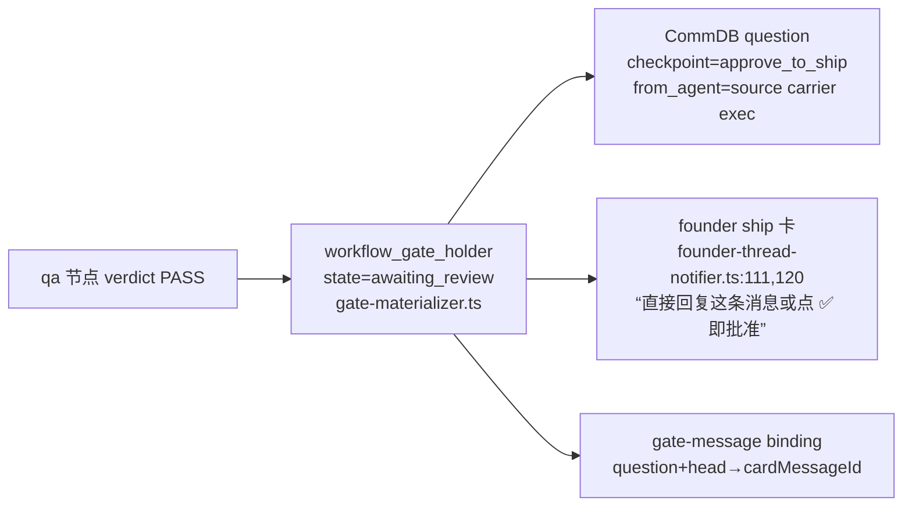
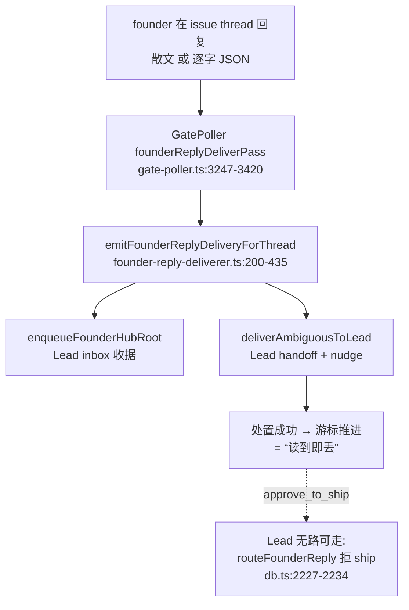

# FLY-1448 批准断路 — 调研

Issue: FLY-1448 (https://linear.app/geoforge3d/issue/FLY-1448/p1批准断路-founder-批准被静默丢弃-session-卡-running-无-durable-park-wake-拒投)
日期: 2026-07-23
基于: exploration.md

所有 file:line 均核对于本 worktree(main @ 0ff4fbf4,含 #690/#692)。

## 1. 现状链路全景

### 1.1 DAG ship-gate 的物化(正常前半程,房测已验 PASS)



- `gate-materializer.ts:60-199`:五阶段幂等物化(question_written → session_bound → card_posted → card_bound → completed),question 落 CommDB(`:98-101`,checkpoint `approve_to_ship`),holder 即 durable binding。
- 房测断言 A/B/D 全 PASS —— 到「卡已呈现、holder awaiting_review」为止,链路是好的。

### 1.2 批准的**正规消费面**(应答怎么变成 run 推进)

所有批准面最终汇入同一收口 `writeGateResponseAndRunPostWrite`(write-gate-response.ts):

- engine authority 判定:`gateAuthorityView.resolve(questionId)`(gate-authority-view.ts:44-118)解析 workflow holder + run snapshot;
- engine 路径写入:`insertFounderApprovalResponseWithSource`(flywheel-comm db.ts:1666-1737)—— **一个事务**里写 response、terminal-dispose question、插 `workflow_source_event(kind=founder_approval)`(write-gate-response.ts:580-607 调用);
- 投影:`founder-approval-projector.ts:74-170`(5s interval)drain source events → `StateStore.applyWorkflowSourceEvent`(StateStore.ts:25987)→ holder flip `approved`(`:26465-26472`)+ `founder_approved` claim + **land authority 直接 commit transition 推进 run**(`:26478+`)—— land 模板批准后**不需要唤醒任何 runner**;
- runner_ship authority:holder approved 后需要 wake `ship_parked` carrier 去执行 ship。

现有四个批准面(全部接在上面收口上):

| 面 | 接线点 | 状态 |
|---|---|---|
| ✅ reaction | gate-poller.ts:3893 `founderReactionApprovalPass` → plugin.ts:6797 `makeFounderReactionApprovalCallback` | ✅ 已接线(房测因 Chrome 点击工具问题零证据) |
| voice | plugin.ts:6830 `/api/voice` | ✅ 已接线 |
| dashboard / decision routes | workflow-decision-routes.ts:308 `approve_question_id` | ✅ 已接线 |
| Lead founder-consent respond | founder-consent/gate-response-router.ts(`respond --bridge-url`) | ✅ 已接线(人工) |
| **founder text 回复** | —— | ❌ **无消费者(见 §2)** |

### 1.3 founder text 的实际路径(断的后半程)



- deliverer v2 对**每条** founder 消息只做两件事:hub-root 收据 + Lead handoff(founder-reply-deliverer.ts:442-503),成功即游标推进;
- `routeFounderReply` 明确拒绝 `approve_to_ship / review_design / review_code / report`:「question is not founder-routable」(flywheel-comm db.ts:2227-2234)—— **Lead 不能路由 ship 批准**(这是刻意的安全语义,FLY-208 MERGE AUTHORITY 一脉);
- 结果:founder text 批准 = hub 收据 + Lead 通知,**没有任何自动绑定**;若 Lead 不人工跑 founder-consent `respond`,gate 永不 resolve,且游标已推进 → 消息不再被重扫。

## 2. RC-1 铁证:text 归因组件何时被弃线

| 时点 | 事实 | 收据 |
|---|---|---|
| FLY-1099(PR #545,`d0039166`) | deliverer **有** ship 分支:`tryFounderShipApproval?` dep(`:202`)+ ship 消息分流调用(`:552-553`) | `git show d0039166:…/founder-reply-deliverer.ts` |
| FLY-1392(PR #661,`d817eff2`) | 「category-agnostic Lead receipt foundation v2」重写 deliverer(-500 行),ship 分支被删,deps 只剩 `deliverAmbiguousToLead` | `git show d817eff2 --stat`;现行文件 `founder-reply-deliverer.ts:163-180` |
| 现状 | `makeFounderShipApprovalCallback` 生产代码零调用方(仅 `__tests__` + feature-flags registry 路径引用) | `grep -rn makeFounderShipApprovalCallback packages/teamlead/src`(非测试为空) |

组件本体完好且持续演进:handler `founder-ship-approval-handler.ts:212-791`(A-2 narrow → TextSource Tier-3 → 共享 writer → FLY-1099 postcondition/deferral/park-for-convergence/dead-letter 处置矩阵)、factory `founder-ship-approval-factory.ts`(kill-switch `FLYWHEEL_FOUNDER_AUTO_APPROVE` 默认 ON、per-project denylist、canonical founder id fail-closed)。**engine-aware**:handler 的 narrow/prewrite/postcondition 全部优先走 `gateAuthorityView`(`:222-231, :513-537, :751-765`)—— 接回即同时覆盖 DAG holder 与 legacy session 两种 authority。

结论:恢复「散文/JSON 都能批」不需要新建机制,需要的是**把已审组件接回 v2 deliverer**,并把它的 `ShipApprovalOutcome` 处置矩阵(bound/deferred/retry/deadLetter,founder-reply-deliverer.ts:79-105 类型仍在)映射到 v2 的游标/重试账本上。

## 3. RC-2 铁证:wake 合同与 park 记账错位

### 3.1 wake 指针合同(拒投原文出处)

`runner-recovery-nudge.ts:196-214`:

```ts
const wakePointerStatusAllowed =
  mode === "wake_pointer" &&
  (session.status === "awaiting_review" ||
   session.status === "approved_to_ship" ||
   session.status === "design_done" ||
   (session.status === "running" &&
    deps.isDeclaredParked?.(executionId, session.project_name) === true));
// 拒投文案 = `status is "${status}" without a durable park — wake pointers require parked/design_done/awaiting_review`
```

`isDeclaredParked` 由 plugin.ts:7874-7886 接到 CommDB `getEffectiveDeclaredState(...).kind === "parked"`(runner 自声明 park 基座)。

### 3.2 三个错位

1. **keep-alive phase session 无人替它落 park**:DAG/三段式 keep-alive(FLY-887/FLY-1269)让 phase session 在节点间合法地停 `running`;没有任何角色写 declared park → 该 session 收任何 mailbox 消息都在 T2 被拒 → `wake_pointer_status is "running" without a durable park` → escalate `wake_failed`(runner-receipt-patrol.ts:154-181)。房测因果链第 ③ 环(qa session `3c1750ea` = `running`)是本形态;生产 16+/天假警报家族同源(Lead 复核:pane 全活着且健康,「没有 Runner 需要抢救,坏的是 Bridge 侧 park/wake 记账」)。
2. **`ship_parked` 不在 allowlist**:#690 新增 FSM 态 `ship_parked`(workflow-fsm.ts:126,138)= runner_ship carrier 的停驻语义本体,但 FLY-1441 W3 六族消费面矩阵(re-adopt / active inventory / duplicate admission / worktree protection / parked patrol / finalize-terminate,plan.md W3)**不含 wake 合同** —— runner_ship 模板批准后的 park_wake 会在 T2 被拒,批准照样送不到 carrier。这是 W3 漏掉的第七个消费面。
3. **message_traffic 静默 dispose**:`runner-receipt-patrol.ts:116-124` —— 目标 live 且无 durable park 时,`message_traffic` purpose 的 wake 被 `disposeRunnerPhaseWakePending` **静默丢弃**(无审计事件、无告警)。Lead 把 founder 决定 relay 给 runner(FLY-168 `send` 双写)恰好走 message_traffic → founder 决定第二种「读到即丢」形态。

### 3.3 wake purpose 与 routeFounderReply 的落点

CommDB `runner_phase_wakes.purpose ∈ {message_traffic, gate_response, park_wake}`(db.ts:146)。`routeFounderReply` 路由普通问题时 wake purpose = `park_wake`(db.ts:2318-2324);Lead `send` = `message_traffic`(db.ts:2513);gate response 唤醒 = `gate_response`(db.ts:3297)。patrol 只对 `message_traffic` 做静默 dispose,其余进 ladder(T1 push → T2 wake_pointer → T3 escalate)。

## 4. RC-3 铁证:wake_failed 指纹跑步机

- 指纹铸造:plugin.ts:7905-7910 `episodeFingerprint = sha256(wake.message_id).slice(0,16)` —— **每条新 wake 一个新指纹**,对同一个已完结 session 的重复投递永远绕过 `notifyDetectionEpisodeWithOutcome` 的 episode 去重;
- 终态清单不全:plugin.ts:7775-7782 `resolveTargetState` 只把 `failed/blocked/timeout/canceled/cancelled` 判 terminal;**`completed`/`terminated` 被判 live** → 跑完整 ladder(T1 push 到已拆 tmux 的 mailbox、T2 拒投、T3 escalate),而不是走 `terminal_before_started` 的一次性处置;
- patrol 的 escalate 有 `enqueueRunnerReceiptWakeEscalation` + `revalidateRunnerReceiptWakeAlert` 去重(runner-receipt-patrol.ts:219-242),但去重键含 message_id → 新消息 = 新告警,闩不住。

房测 §7.5:Lead 观察「已处理/已完结侧没有重复铸指纹」为**转述**、claims.db 实测 0 字节(§10.3),⑦ 无一手证据 —— 本单实现后需一手复核指纹表。

## 5. RC-4:「批准必达」缺兜底

- deliverer 的 disposal 语义:hub 交接成功 = 消息处置成功 = 游标推进(founder-reply-deliverer.ts:1-12 顶部合同注释「processed-through (at least once)」——但 processed 只覆盖到 Lead 交接,不覆盖「决定被绑定」);
- FLY-1099 §7.1 bounded-retry/dead-letter(`FounderReplyRetryLedger`,founder-reply-deliverer.ts:126-161)只在 `processFounderMessage` 返回失败/异常时介入 —— **处理成功但语义丢失**(RC-1 形态)完全落在账本外;
- `workflow_alert_outbox` 只在 `gate_carrier_unbound` 等引擎侧异常时发声(房测 §2.2);「founder 批了但 gate 没 resolve」不在任何告警谓词里。

## 6. 生产 vs 房测证据边界(诚实标注)

- 房测 run A 的三个 phase 节点完成事件是探针驱动(`POST /events`),session 未跑 `flywheel-comm complete` → 停 `running` 有房测放大成分;但「keep-alive phase session 合法停 running」在生产真实存在(FLY-887/FLY-1269),且 pre-#690 生产全天 16+ 条同款拒投证明该形态不依赖房测 fixture。
- `wake_failed` 告警原文(因果链第 ④ 环)在房 DB/bridge.log 均未一手命中,来自房内 Lead 转述;但拒投文案与 `runner-recovery-nudge.ts:210` 逐字一致,代码侧可证。
- reaction 路径零产品证据(工具侧点击未落),不能据此断言 reaction 面有缺陷。

## 7. 可复用资产清单(实现时直接取用)

| 资产 | 位置 | 用途 |
|---|---|---|
| ship 归因 handler + factory(全套) | approval-signal/founder-ship-approval-{handler,factory}.ts | Fix A 直接接线 |
| FLY-1099 deliverer ship 分支原型 | `git show d0039166:…/founder-reply-deliverer.ts`(:200-260, :552-620) | Fix A 的分流/处置矩阵参照 |
| deferral / rebind / park-for-convergence | approval-signal/deferred-approval.ts + plugin.ts:8134 `deferredRebind` | Fix A 的收敛闭环(已在生产接线) |
| declared-park 基座 | CommDB `runner_declared_states` + `getEffectiveDeclaredState`;消费点 runner-recovery-nudge.ts:202 / runner-receipt-patrol.ts:116-117 | Fix B2 引擎侧写入的落点 |
| detection escalation(episode 去重/latch) | plugin.ts `notifyDetectionEpisodeWithOutcome` + `resolveDetectionOwner`(kind 白名单 `receiptDetectionKinds` plugin.ts:7435) | Fix C/Fix D 的告警载体 |
| bounded-retry / dead-letter 账本 | founder-reply-deliverer.ts:126-161 + gate-poller.ts `founderReplyRetryLedger` | Fix A 的 retry/deadLetter 处置落点 |
| 房测现场 | 529 房 run A `d0824c3e…`(founder_gate、批准两次被丢)、run B `d67ed110…` | 验收 ①②④ 的既有取证现场 |
