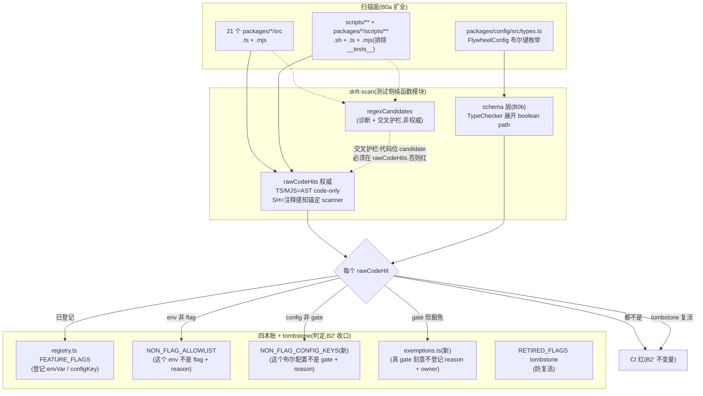

# FLY-1455 flag 登记强制·不许野建 — 实施计划

Issue: FLY-1455 (https://linear.app/geoforge3d/issue/FLY-1455/flag治理登记强制第1批-不许野建-flag-漂移守卫补洞b0a-扩全-package-b0b-astschema-豁免登记-b2-登记)
日期: 2026-08-16
基于: 无(上游输入: `product/doc/FLY-1412-flag-governance-source/prd.md` §1.3/§5.4/§9.1/§9.3 + 同文件夹 `plan.md` §2,均为 PM 侧终版,本文是它们的工程实施计划)

> 修订记录:v2(2026-08-16)按 Codex design review R1 全部 8 项修订 —— 账本语义拆分(非 flag config key 独立分类账)、reverse 基线更新到当前 head(`ask_hygiene` 已被 FLY-1807 退役)、AST 覆盖 `.mjs` + 生产 `scripts/**/*.ts`、shell 锚定补 presence/alias/注释处理、readSite 级 resolver 身份、豁免防腐前置到 PR-1、schema 枚举改 TypeChecker、scanner 生产可达性钉死。
> v3(2026-08-16)按 R2 全部 5 项修订 —— **direct-form AST 前移进 PR-1**(TS/JS 命中改为 code-only,注释/字符串不再假保活 stale 豁免)、扫描结果 = broad direct ∪ AST(**并集,不替换**,无锚定的 `parseBool(raw)` 形态不回退)、两本 non-flag 分类账补 trim 非空机器断言 + `NON_FLAG_CONFIG_KEYS` 骨架前置 PR-1、`dynamic` 4 个描述串 symbol 迁真实 identifier(6 个 dynamic site 全点名)、config reverse 加 readSite 级 `configAccess` 锚点(杜绝无关 `.enabled` 假证据)。
> v4(2026-08-16)按 R3 全部 3 项修订 —— 集合语义定成**三层数据流**(`regexCandidates` 仅诊断/交叉护栏、`rawCodeHits` 为唯一命中权威且**不依赖账本**、`unhandledHits` = 分类后余项;stale 只消费 `rawCodeHits`;可解析文件的注释/字符串 candidate 按位置分类后丢弃,解析失败 **fail-closed**)、config 迁移映射逐行点名(`doc_flow` 锚到真实读点方法、`skill_framework_split_participation` readSite 迁 canonical reader)+ 定义 class-method symbol 解析与链规范化、dynamic 按**文件类型分派**(`.sh` 的 `converge_cmux_symlink` 用 shell scanner 验证,不硬套 TS AST)。
> v5(2026-08-16)按 R4 全部 3 项修订 —— config 迁移表**7 行全部钉死**(file/symbol/configAccess 逐行,含删除 Blueprint 假 consumer 行 + 显式不列 run-infra delegated site)、全文清剿残余「正则∪AST 权威」措辞(图/§5.1/§5.3/§8 统一为 rawCodeHits 唯一权威)、交叉护栏升级 **occurrence 级 span 对账**(同文件同名合法 hit 不得替漏解析 candidate 抵账,fixture 22 负例)。**Codex design review R5 APPROVED。**

---

## 0. 一句话

把「新 flag 必须登记、不许野建」这张网补严:forward 漂移守卫从 4/21 个 package 扩到**全部生产 package + 生产脚本(sh/ts/mjs)**(B0a),用 **AST + config-schema 枚举**认出现有正则认不出的写法(B0b),外加**显式豁免登记**(白名单+理由+归属),最终 CI 断言收口为一条不变量:**「要么登记,要么带理由入账 —— 没有第三种存在方式」**(B2′)。

## 1. 裁决边界(红线,照抄自 issue 重写版 —— 实现时不许越)

**Annie 2026-07-23 亲手砍掉的,本单绝不做**:

1. ⛔ 不做「创建时必须声明退役条件」—— 原话「flag 不需要必须带退役条件呀」。
2. ⛔ 不做「自动同步建 follow-up 清理单」(退役出口归每周扫描 FLY-1781)。
3. ⛔ 不做退役申报 scaffolding:adoption 快照 / grandfather / 墓碑守恒 / digest / partition 五件套。
4. ⛔ 不碰 `question` checkpoint 行为。
5. ⛔ 不实现 `longTermKeep` 字段本身(FLY-1779 已落地;它是「扫描时写入」的状态位)。

现有守卫测试里已经有一条 `"no CI gate demands longTermKeep at creation time (Annie killed that)"`(`feature-flags-registry.test.ts:581`)—— 本单所有新增断言都不得与它冲突,B2′ **只留登记那半**。

**依赖:无。** 不依赖 FLY-1778 地基、不依赖 FLY-1150(PRD §9.1 原文「ship-now,不依赖 FLY-1150」)。

## 2. 现状审计(本 worktree `8ce9388bf` 实测,不是抄文档;R1 复核后修正口径)

### 2.1 现有守卫

守卫 = `packages/config/src/__tests__/feature-flags-drift.test.ts`(vitest,随 CI unit matrix「light」跑):

| 方向 | 现状 | 实测缺口 |
|---|---|---|
| forward(野建拦截) | 正则扫 4 个目录的 `.ts`(`teamlead/config/flywheel-comm/edge-worker` 的 `src/`),4 种 pattern:`process.env.X`、bracket 形式、参数名恰为 `env` 且带 `===/!== "0"/"1"/"true"/"false"` 比较的两种 | 全仓 **21** 个 package 有 `src/`,17 个不扫;根/包级生产脚本(`.sh`/`.ts`/`.mjs`)完全盲区;`payload-endpoint` 全包是 `.mjs`,即使加目录也扫不到;解构 / 封装 helper / 非 `env` 参数名 / truthy / const-string-key 全绕过;`project_config` 布尔键零覆盖 |
| reverse(登记必真读) | `flag.readSites.some(file.includes(envVar))` | 声明 N 个 readSite 只要一个文件含该字符串就过;**注释里的字符串也算**;delegated-resolver 形态(consumer 只 import canonical resolver,文件里没有 envVar 字面量)会被「每文件必含」的朴素收紧误伤 |
| tombstone(防复活) | `RETIRED_FLAGS` 只对 TS 扫描结果查 | shell 里复活的旧 gate 查不到(`FLYWHEEL_CHAT_RECEIPTS` 当年正是从 `claude-lead.sh` 溜过去的;该读点已被 FLY-1645 拆除,tombstone 在账) |

### 2.2 撞网规模(首跑 backfill 的量;census 数字**以实现时 scanner 输出为准**,下列为设计期实测参考)

- **TS 扩目录**(4→21 package,含 `.mjs`,现有 4 正则):新增 13 个名,其中 11 个既未登记也不在 `NON_FLAG_ALLOWLIST`(`FLYWHEEL_GEMINI_AGENT`、`FLYWHEEL_VOICE_EDGE_TTS`、`FLYWHEEL_TMUX_*` 等)。
- **shell 全递归面**(`scripts/**/*.sh` + `packages/*/scripts/**/*.sh`,排除 `__tests__`):**~195 个文件、~438 个 distinct `FLYWHEEL_*` 名**;其中**布尔锚定(直接比较形态)~42 个名**,多为 QA / 部署接缝(`FLYWHEEL_QUOTA_QA_INJECTION`、`FLYWHEEL_CMUX_DRY_RUN`、`FLYWHEEL_BUDDY_NONINTERACTIVE`…)。presence/alias 形态(§4.2)会再加一批,数量实现时出。
- **生产 `scripts/**/*.ts`**(`run-bridge.ts`、`check-flag-truth.ts` 等):17 个 distinct `FLYWHEEL_*` 读点 —— R1 指出的既有盲区,一并入网。
- 结论不变:shell 侧**必须**锚定扫描,不能按提及扫(438 名按提及扫首跑即 400+ 条噪声)。

### 2.3 现有资产(直接复用,不重建)

- `NON_FLAG_ALLOWLIST`(`truth.ts`,name→reason,~180 条):**「这个 env 不是 flag」的分类账**。保留原语义与原形态,不动存量。
- `RETIRED_FLAGS`(`truth.ts`):tombstone,防复活。**注意 `FLYWHEEL_ASK_HYGIENE` 已在其中(FLY-1807)** —— v1 计划把它当活 flag 引用是过期基线,已修正(§5.4)。
- `FeatureFlagSpec.readSites[].pattern`:已有 `"process.env" | "env-param" | "dynamic" | "config"` 四值。
- `typescript@^5.3.3` 已是 `packages/config` devDependency → AST 用 compiler API,**零新依赖**(生产可达性约束见 §5.5)。
- `packages/config/src/types.ts`:project config 的 interface 全集(`FlywheelConfig` 可达闭包,设计期实测 **14 个 boolean dot path**)→ B0b 枚举的 canonical 来源。

## 3. 设计总览



**账本语义(R1 blocker-1 修正,四本账各说一件事,禁止跨账重叠)**:

| 账本 | 语义 | 键 | 必填 |
|---|---|---|---|
| `FEATURE_FLAGS`(registry) | 「这是 flag,已登记」 | `envVar` / `configKey` | 现有 spec 全字段 |
| `NON_FLAG_ALLOWLIST`(现有) | 「这个 **env** 不是 flag」(plumbing/context/value) | env 名 | reason |
| `NON_FLAG_CONFIG_KEYS`(新,truth.ts) | 「这个**布尔 config 键**不是 rollout gate,是普通配置」 | dot path | reason |
| `FLAG_EXEMPTIONS`(新,exemptions.ts) | 「这**是** gate,刻意不登记」(QA 故障注入 / Chrome 回收接缝) | env 名或 dot path + kind | reason + owner |

核心结构改动:把扫描逻辑抽成**纯函数模块**(输入 = 文件集/源文本,输出 = 结构化命中列表),真仓扫描与负向 fixture 共用同一段代码 ——「测试的尺子和生产的尺子是同一把」,负向 fixture 喂 fixture 树证明「真的会红」不再是自证。**落点在 `packages/config/src/__tests__/drift-scan/`(测试 helper,不进 build、不从任何 index 导出)**——`typescript` 只是 devDependency,若从 `feature-flags/index.ts` 或包 public index 导出,生产-only 安装会加载不存在的依赖(R1 MEDIUM-8);防误导出的 smoke 见 §9.7。

## 4. B0a · forward 扫描扩全(必做,先行)

### 4.1 TS/JS 面

- `SCAN_DIRS` 从硬编码 4 个目录改为**动态枚举每个 `packages/*` root**。每个 package root 递归扫描,只负排除 `node_modules` / `dist` / `__tests__` / `__mocks__` / `coverage` / `e2e` / `test-scripts` / `examples`;普通 `test` / `tests` / `fixtures` 目录不按名字跳过。这样不再假设生产代码必在 `src/`:已发布的 `packages/onboard-shell/bin` + `lib` 和 `packages/agent-team-transport/bin` 同样入网。未来新增 package **自动入网**,守卫不再随仓库长大而烂。
- **根级生产脚本一并入网**:`scripts/**` 的 `.ts` / `.mjs` / `.js` / `.sh` 进入同一扫描集。
- 文件类型:`.ts`(排除 `.test.ts` / `.d.ts`)+ `.mjs` + `.js` + `.sh`;`*.test.*` / `*.spec.*`、`*.test.sh`、package-root `vitest.config/setup.*` 与 `test/setup|fixtures.*` 这些已知测试基础设施文件排除。普通 `test/tests/fixtures` 目录里的其他文件仍扫描,避免按目录名制造盲区。
- **direct-form AST 扫描从 PR-1 起就是 TS/JS 命中的唯一权威**(R2 blocker-2:PR-1 若还用裸正则,`// process.env.FLYWHEEL_PREPLANTED` 一行注释或字符串示例就能让 stale 豁免假保活;而「剥注释再正则」剥不动 bracket 形式里的合法字符串键 —— 只有 AST 能天然做到 code-only)。PR-1 的 AST 只认 **direct 四形态**:`process.env.X` 属性读、`process.env["X"]` element access、`const { FLYWHEEL_X } = process.env` 解构(含重命名,以属性名为准)、同文件 const-string-key(`const K = "FLYWHEEL_X"; env[K]`)—— 这四种**无条件命中,不要求布尔锚定**(现守卫的 broad 正则语义就是无锚定,`const raw = process.env.FLYWHEEL_NEW; parseBool(raw)` 必须仍在网内,R2 blocker-1)。注入对象形态(`env.X === "0"` 等带布尔锚定的现有两条正则语义)由 AST 同形态承接;其扩展(任意参数名/truthy)归 B0b。
- **集合语义 = 三层数据流**(R3 blocker-3:裸「正则∪AST」会让注释/字符串命中重新混进权威集,与 code-only 合同自相矛盾;分层后两头都保住):
  1. `regexCandidates`:broad 正则跑在原始文本上 —— **仅作诊断与交叉护栏,永远不是命中权威**。
  2. `rawCodeHits`:**唯一命中权威**。`.ts` / `.mjs` / `.js` = AST(code-only);`.sh` = 注释感知的锚定 scanner。**产生时完全不依赖四本账**(账本过滤放在分类层;scanner 层过滤会让合法豁免的读点从 stale 证据里消失、反被误判 stale)。
  3. `unhandledHits`:`rawCodeHits` 经四本账分类后的余项 —— 不变量断言的对象(必须为空)。
  - **交叉护栏**:对可解析文件,把每个 regexCandidate 按源码位置分类 —— 落在注释/字符串 trivia 内 → 丢弃;落在代码位 → 必须出现在 `rawCodeHits`,否则守卫红(「AST 有洞」诊断;R2 blocker-1 的「不许覆盖回退」以此形态成立,fixture 7b/22 固定;occurrence 级 span 对账见 §5.1)。
  - **解析失败 fail-closed**:`.ts` / `.mjs` / `.js` 解析失败 → 守卫直接红(点名文件);正则结果仅作该文件的诊断输出,**不得**用于保活豁免或抵账。
  - 两条 stale 检查(env PR-1 / config-key PR-2)**只消费 `rawCodeHits`**。

### 4.2 shell 面(新增)

扫描集:根级 `scripts/**/*.sh` + package-root 负排除后的全部 `.sh`。

**预处理**:逐行剥离 full-line 注释(`^\s*#`)后再匹配 —— 注释里的示例文本不算命中(否则误报 + 让 stale exemption 假存活,R1 blocker-4)。行内注释与 heredoc 内容不做剥离(bash 无廉价可靠的词法切分)—— 该残余列 §9 诚实边界(R2 blocker-2 尾注)。

**锚定 pattern**(v2 集合;全部形态容忍 `${X}`/`$X`/`${X:-d}`/引号、var 在左或右):

| # | 形态 | 例(均为当前生产脚本实测存在的写法) |
|---|---|---|
| a | test/`[[` 布尔比较 | `[ "${FLYWHEEL_X:-0}" = "1" ]`、`[[ "$FLYWHEEL_X" != "0" ]]`(`=`/`==`/`!=` × `0/1/true/false`) |
| b | case 分支 | `case "${FLYWHEEL_X:-}" in` 且相邻 arm 是 `0)`/`1)`/`true)`/`false)` |
| c | 布尔默认展开于条件位 | `${FLYWHEEL_X:-0}` / `${FLYWHEEL_X:-1}` 出现在 `if`/`[`/`[[`/`test` 上下文 |
| d | **presence gate**(R1 补) | `[ -n "${FLYWHEEL_TUI_HOME_REEXEC:-}" ]`、`[ -z "${FLYWHEEL_LEAD_CORE_MENTION_GATED:-}" ]` —— `-n`/`-z` 直接作 on/off 用 |
| e | **alias-then-compare**(R1 补) | `local v="${FLYWHEEL_CMUX_DRY_RUN:-0}"` 后续比较 —— 判定规则:赋值右侧是 `FLYWHEEL_*` 且带布尔默认(`:-0/:-1/:-true/:-false`),即记该 FLYWHEEL 名命中(不做跨行数据流,单行赋值形态即锚定) |
| f | **while 条件**(QA rework 补) | `while [ "${FLYWHEEL_X:-0}" = "1" ]; do ...` |
| g | **命令链条件**(QA rework 补) | `prepare && [ "${FLYWHEEL_X:-false}" = "true" ]` |

明确**不做**成 bash 解析器。锚定集合覆盖当前仓库**实测存在**的全部写法形态(a–g);仍认不出的间接形态(`eval`、`${!name}`、拼接变量名、`printenv X`、无布尔默认的 alias 再比较)列 §9 诚实边界 —— **闭网承诺相应收窄为「锚定形态集内不许野建」**,不夸大。

- **tombstone 检查扩到 shell**:`RETIRED_FLAGS` 成员在 shell 生产脚本里以锚定形态出现 → 红(防「从 shell 复活」)。
- shell 命中与 TS 命中走**同一套四本账判定**。

### 4.3 首跑 backfill(B0a 落地的一半工作量在这)

扩网当天,~11 个 TS 名 + 40~60 个 shell 名(a–e 全集,实现时以 scanner 输出为准)会撞网。处理纪律:

1. 逐名裁决,env 命中**只有三个去处**:registry 登记(真 feature gate)/ `NON_FLAG_ALLOWLIST` + reason(不是 flag)/ `FLAG_EXEMPTIONS` + reason + owner(是 gate 但刻意不登记)。
2. 裁决记录进本文件夹 `backfill-ledger.md`(name → 去处 → 一句话理由),PR 里可审计。
3. 拿不准的名(像 `FLYWHEEL_GEMINI_AGENT` 这种可能是真 gate 的)→ 在 PR 里点名列给 Lead,不许静默塞 allowlist。

## 5. B0b · AST + schema 枚举 + 豁免登记(必做;规模大,实现节点可拆单独 PR/单独排期)

### 5.1 AST 层(TS/JS 语法变体 —— PR-2 在 PR-1 direct 四形态之上**增量扩展**)

同一 AST 基建(单文件 `createSourceFile` + 遍历,`.ts` → `ScriptKind.TS`,`.mjs` → `ScriptKind.JS`,不建 Program、不 type-check;PR-1 已上线,§4.1),PR-2 **新增**认出:

| 变体 | 形态 | 判定 |
|---|---|---|
| 任意参数名注入 | `cfg.FLYWHEEL_X !== "0"`,参数/变量名不限于 `env` | 属性名 `FLYWHEEL_*` 且同表达式树内有布尔字面量比较锚定 |
| truthy(注入对象) | `cfg.FLYWHEEL_X && ...`、`if (opts.FLYWHEEL_X)` | `FLYWHEEL_*` 属性访问出现在条件位置(if/三元/`&&`/`||`/`!`)→ 命中 |
| 无锚定注入读 | `parseBool(cfg.FLYWHEEL_X)`、`const v = opts.FLYWHEEL_X` 后传 helper | 注入对象上的 `FLYWHEEL_*` 属性访问,即使无布尔锚定 → **无条件进 `rawCodeHits`**(R3 blocker-3:scanner 层不看账本;非 gate 的注入 value/context 读量大,但它们几乎全在 allowlist,由分类层消化,首跑新增走 backfill) |
| 封装 helper | helper 内部照样是 direct 四形态或上面形态之一 | AST 扫的是**读点**,helper 体内逃不掉;调用侧不需要识别 |

(direct 四形态 —— `process.env` 属性/element/解构/const-string-key —— PR-1 已无条件命中,见 §4.1;PR-2 不改它们的语义。)

**命中权威恒为 `rawCodeHits`,正则只作交叉护栏**(§4.1 三层数据流,PR-2 延续)。**occurrence 级身份(R4 HIGH-3)**:regexCandidate 与内部 AST hit 都携带 source span(start/end),交叉护栏按 span 重叠**逐 occurrence** 对账 —— 同文件同名的另一处合法 AST hit 不能替漏解析的 candidate 抵账;面向账本分类的去重结果保持 `{ name, file, form }`,`form` 进错误消息方便修。

### 5.2 project_config 布尔键(schema 枚举)

上游 plan §2.2 指出的四个前置,逐一给答案:

1. **枚举来源**:对 `packages/config` 建一次**真 Program + TypeChecker**(仅此一处;R1 HIGH-7:types.ts 里有 `Record<string, CheckpointConfig>`、数组元素、多层 type reference,手写单文件遍历必漏),从 `FlywheelConfig` 展开全部可达 `boolean` 成员为 dot path(`qa.auto`、`skills.proofshot.vision_default`、`checkpoints.*.enabled`(Record 通配)、`xiaohongshu_learning.collections[].auto_create`(数组元素)等)。**types.ts 就是 canonical schema**,不另建声明式 schema。
2. **「feature gate vs 普通布尔配置」判定合同**:**不由类型自动判**。判定 = 人裁决 + 四本账落账:每个枚举出的 boolean dot path 必须命中 registry 的 `configKey`、`NON_FLAG_CONFIG_KEYS`(普通配置 + reason)、或 `FLAG_EXEMPTIONS`(`kind: "config_key"`,真 gate 刻意不登记)之一。**普通配置进分类账,不进豁免账**(R1 blocker-1:两账语义不同,混用会让账面说谎)。
3. **既有未注册布尔的 backfill**:设计期实测 14 个 path(`skills.enabled`、`checkpoints.*.enabled`、`founder_milestone_report.enabled`、`xiaohongshu_learning.video_opt_in` 等)逐条进 backfill-ledger,同 §4.3 纪律。
4. **通配 configKey 的展示语义**:`Record`/数组通配路径展开到项目里的实际实例；所有实例同值时展示该值，实例为空时走 registry default，实例值混合时 fail-loud 为 project error，绝不把字面 `*`/`[]` 查找失败伪装成 default。
5. **账本自己不变成绕过口**:见 §5.3 防腐条款(对 `NON_FLAG_CONFIG_KEYS` 同样适用 stale 检查)。

**枚举器自证**(防空过绿,两层):(a) 结构断言:枚举结果非空且包含 `qa.auto`;(b) **集合级 census 断言**:枚举结果与「当前 14-path 快照」逐集合比对 —— 新增 path 会红,提示走判定合同;漏扫(枚举器坏了)也会红。census 快照就是断言里的字面集合,更新它 = 过一次 PR review。

**types.ts ↔ ConfigLoader 手写校验的 parity**:两者漂移(ConfigLoader 校验了 types.ts 没有的键,或反之)不在本单闭环 —— 枚举器只认 types.ts。列 §9 诚实边界,并在 drift 测试的错误消息里注明「若键在 ConfigLoader 有校验但枚举不到,先修 types.ts」。

### 5.3 豁免登记机制(Tadashi 硬要求)

新文件 `packages/config/src/feature-flags/exemptions.ts`:

```ts
export interface FlagExemption {
  /** envVar 名或 config dot path */
  name: string;
  kind: "env" | "config_key";
  /** 必填:为什么这个 gate 刻意不登记 */
  reason: string;
  /** 必填:归属人/归属角色(谁对这个豁免负责) */
  owner: string;
  /** 建档 issue(可选但强烈建议) */
  issue?: string;
}
export const FLAG_EXEMPTIONS: FlagExemption[] = [ /* … */ ];
```

- **语义**:只收「**是** gate、刻意不登记」的条目(QA 故障注入 `FLYWHEEL_QUOTA_QA_INJECTION`、Chrome 窗口回收接缝等 —— 与 Lead 1413「不给这两个接缝补登记选项」的判断一致:仍不登记,只是从盲区改为记账)。「不是 flag/不是 gate」的分类归两本 allowlist,**不进这里**。
- **防腐条款(R1 blocker-6:PR-1 豁免账一上线,当时可判定的防腐必须同批上线;R2 blocker-3:分类账的 reason 同样要机器校验)**:

| 条款 | 上线批次 |
|---|---|
| exemption `reason`/`owner` trim 后非空 → 否则红 | **PR-1** |
| `NON_FLAG_ALLOWLIST` 全部 value(reason)trim 后非空 → 红(实测现有 171 条全非空,零存量清理) | **PR-1** |
| `NON_FLAG_CONFIG_KEYS` 全部 reason trim 后非空 → 红 | PR-2(账随枚举器启用;**骨架空账 PR-1 即建**,见下) |
| `(kind, name)` 唯一,重复 → 红 | **PR-1** |
| 与 registry 互斥:比对用**外部身份**(`envVar`/`configKey`),不是内部 `spec.name`;同名同 kind 双挂 → 红 | **PR-1** |
| 与 `NON_FLAG_ALLOWLIST` / `NON_FLAG_CONFIG_KEYS`(骨架,PR-1 为空)/ `RETIRED_FLAGS` 互斥 → 红 | **PR-1** |
| stale 豁免(`kind: "env"` 在 `rawCodeHits` 中零命中)→ 红(豁免不许挂空账,防「先豁免、后野建」预留位;**只消费 `rawCodeHits`**,TS/JS 注释与字符串、正则诊断输出都不算保活 —— R2 blocker-2 / R3 blocker-3) | **PR-1** |
| stale 豁免(`kind: "config_key"` 不在枚举结果)→ 红 | PR-2(枚举器随 PR-2 上线) |

**批次一致性(R2 blocker-3 尾注)**:`NON_FLAG_CONFIG_KEYS` 的**空骨架**在 PR-1 随 exemptions.ts 一起建(让互斥断言 PR-1 即完整);首批条目 PR-2 backfill 时填。

- 豁免文件 git 跟踪,增删走 PR review;无 runtime 加载路径,不可能绕过 review 加豁免。

### 5.4 reverse 改造(pattern-aware,替掉 `.some(includes)`)

**基线更正(R1 blocker-2)**:当前 head 上 delegated 形态的现存合法 site **只有 1 个** —— `codex_hard_gate_killswitch` @ `packages/teamlead/src/bridge/auto-qa-held.ts`(调用 `codex-gate.ts` 导出的 `codexHardGateEnabled`)。v1 引用的 `ask_hygiene` 已被 FLY-1807 整 flag 退役(`truth.ts:450` tombstone),registry 无此行 —— 它属于 tombstone 回归(fixture 19b),不是 migration fixture。

- `FlagReadSite.pattern` 增加值 **`"delegated"`**,resolver 身份落在 **readSite 级**(R1 blocker-5:顶层 `resolverSymbol` 证明不了 import 来源,本地同名函数可假通过):

```ts
interface FlagReadSite {
  // …现有字段
  /** pattern === "delegated" 必填:canonical resolver 的模块与导出名 */
  resolverModule?: string;  // repo-relative,如 "packages/teamlead/src/bridge/codex-gate.ts"
  resolverSymbol?: string;  // 如 "codexHardGateEnabled"
  /** pattern === "config" 必填:该文件读取此键的确切成员访问链,如 "ps.enabled" */
  configAccess?: string;
}
```

- 校验合同,按 pattern 分派(语义从 some 收紧为 **every**,每个声明的 site 按自己的 pattern 过):
  - `"process.env"` / `"env-param"`:AST 证明该文件确有该 envVar 的属性读取/解构/**const-string-key element access**(§4.1/§5.1 全部形态;**注释不算** —— `.includes` 的病根就在这)。canonical resolver `codex-gate.ts` 自己的 const-key 写法由此覆盖,不会误红(R1 blocker-5 后半)。
  - `"delegated"`:AST 证明该文件有来自 `resolverModule` 的 named import(含 alias;相对路径解析到该模块文件)且该 import 被调用。
  - `"config"`:readSite 增加必填锚点 **`configAccess`**(该文件里读取此键的确切成员访问链文本,如 `ps.enabled`),AST 证明该链出现在声明 `symbol` 的子树内(R2 HIGH-5:只查末段属性名会被同文件无关 `.enabled` 假通过 —— `ConfigLoader.validate` 里 proofshot/checkpoints/doc_flow/milestone/ponytail/xiaohongshu 全有 `.enabled`;不做 dot-path 全链数据流,锚点显式声明即机器可查)。
    - **symbol 解析语法**:接受顶层 function/const declaration 名,以及 class method 的 `ClassName.methodName` 形态(匹配 MethodDeclaration/PropertyDeclaration);**链规范化**:比对前把 `?.` 归一为 `.`、剥掉 `!` 非空断言、`as` 断言与括号 —— `this.docFlowConfig?.enabled` 规范化为 `this.docFlowConfig.enabled`(R3 blocker-1 尾注)。
    - **现存 7 行 `pattern: "config"` 的精确迁移映射(R3 blocker-1 + R4 blocker-1:全部钉死,fixture 17 逐行断言 file/symbol/pattern/configAccess 四元组;实现时 AST 复核,若与本表不符 → 改表须过 review,不许实现自行猜)**:
      | flag | file | symbol | configAccess |
      |---|---|---|---|
      | `qa_auto` | `packages/teamlead/src/bridge/auto-qa-policy.ts` | `resolveAutoQaPolicy` | `cfg.auto` |
      | `doc_flow` | `packages/edge-worker/src/Blueprint.ts` | `Blueprint.runInner`(现描述串 `doc-flow injection` 废弃;真实读点 `Blueprint.ts:2159` 在该方法内,已核) | `this.docFlowConfig.enabled` |
      | `skill_framework_split_participation` | **迁到** `packages/teamlead/src/bridge/skill-framework-participation.ts` | `makeSkillFrameworkParticipationReader` | `skillFramework.split` |
      | `proofshot` | `packages/config/src/ConfigLoader.ts` | `ConfigLoader.validate` | `ps.enabled` |
      | `xiaohongshu_learning` | `packages/config/src/ConfigLoader.ts` | `ConfigLoader.validate` | `xhs.enabled` |
      | `ponytail` | `packages/config/src/ConfigLoader.ts` | `ConfigLoader.validate` | `ponytail.enabled` |
      | `founder_ux_gate` | `packages/config/src/ConfigLoader.ts` | `ConfigLoader.validate` | `founderUxGate.mode` |
      - `skill_framework_split_participation` 的旧 `Blueprint.ts` consumer 行**删除**(已核:Blueprint **不** import canonical reader,那只是注入回调 —— catalog 不留假证据);真实 import-and-call 在 `run-infra.ts:95/1065`,**显式决定不另列 delegated site**(canonical reader 行即读点证据,consumer 枚举不是 readSites 的合同义务,列了反而把 catalog 变成 call-graph 维护负担)。
  - `"dynamic"`:**按 readSite 文件类型分派**(R3 blocker-2:6 个 dynamic site 里 `converge_cmux_symlink` 在 `scripts/converge-flywheel-bin.sh`,是 shell 变量,TS AST 摸不到):
    - `.ts`/`.mjs` site:声明的 `symbol` 必须是真实源码 identifier(declaration 或 call 在该文件 AST 中存在),不再接受描述串、不许无条件 true。
    - `.sh` site:shell scanner(注释感知)验证「锚定赋值存在(如 `converge_cmux_symlink="${FLYWHEEL_CONVERGE_CMUX_SYMLINK:-1}"`,右侧含该 envVar)+ 该变量确有 gate 引用(比较/case 使用)」,同名注释或无关变量不通过。
    - **migration(R2 blocker-4)**:4 个描述串 symbol(两个 `resolveDefaultOnGate live dotenv CLI fallback (…)`、`resolveDefaultOffGate live dotenv CLI fallback`、`verifyApprovalWithBridgeHead workflow dotenv read`)PR-2 迁成真实 declaration identifier;`resolveLiveMailboxQueueEnabled`(TS,真 identifier)不动;`converge_cmux_symlink` 走 shell 分派验证。6 个 site 全部进 migration fixture。

## 6. B2′ · 登记 CI 断言(小)

B0a/B0b 落完,B2′ = 把「登记强制」收口成显式、可点名的 CI 断言(全部住在 `packages/config` 的 vitest 里,已随 CI unit matrix 跑,零新 CI job):

1. **不变量断言**(核心一条):扫描全命中(env)∈ registry ∪ `NON_FLAG_ALLOWLIST` ∪ `FLAG_EXEMPTIONS`,枚举全 path(config)∈ registry ∪ `NON_FLAG_CONFIG_KEYS` ∪ `FLAG_EXEMPTIONS`;tombstone 零命中;**四本账两两零重叠**。违反即红,错误消息给出合法去处的操作指引(照抄现有 `register it, or add to NON_FLAG_ALLOWLIST with a reason` 风格,补齐新账本选项)。
2. **豁免/账本完整性断言**:§5.3 防腐全表。
3. **reverse 断言**:§5.4 every-site 合同。
4. 🔴 **不加任何退役断言**。`longTermKeep` 相关的现有守护测试(「no CI gate demands …」)保持绿,是 B2′ 的**反向验收项**。

「绕开 registry」的口子经 B0a/B0b 已在读点层面关闭(新建 resolver 也得读 env/config,读点即被扫)——B2′ 不需要再造「resolver 必须一一对应 registry」的独立机器(FLY-1811 那次是人工 recheck,常态化归每周扫描线,不归本单)。

## 7. 测试计划(TDD:先红后绿;fixture 全部走 drift-scan 纯函数喂 fixture 树,不污染真仓)

上游 plan §2.3/§2.4 验收 fixture 全收编 + R1 补强,按归属分开(**不许拿 B0a 认领 B0b 的 fixture**):

| # | fixture(负向为主) | 期望 | 归属 |
|---|---|---|---|
| 1 | fixture 树:`claude-runner` 形态目录里未注册 `process.env.FLYWHEEL_FAKE_GATE` | 红 | B0a |
| 2 | fixture 树:`voice-bridge` 形态目录同上 | 红 | B0a |
| 3 | fixture 树:`.mjs` 文件里未注册 gate(正则可见形态) | 红 | B0a |
| 4a–4e | shell 锚定五形态各一:比较 / case / 布尔默认条件位 / **presence `-n`/`-z`** / **alias-then-compare**(左右值、引号、default 变体覆盖) | 红 | B0a |
| 5 | shell 里 `RETIRED_FLAGS` 成员(如 `FLYWHEEL_CHAT_RECEIPTS`)锚定读 | 红(tombstone 复活) | B0a |
| 6 | shell 纯提及(export/透传/路径)不带锚定 | 绿(降噪正向对照) | B0a |
| 6b | shell **注释行**里的锚定形态文本 | 绿(不算命中) | B0a |
| 7 | `const { FLYWHEEL_FAKE } = process.env` 解构(含**重命名**变体) | 红 | **B0a**(direct 四形态 PR-1 即有) |
| 7b | **无锚定 direct 读**:`const raw = process.env.FLYWHEEL_FAKE; parseBool(raw)`(证 AST authority 无覆盖回退 + 正则交叉护栏兜底,R2 blocker-1) | 红 | B0a |
| 7c | TS 文件**注释里** `process.env.FLYWHEEL_PREPLANTED` / **字符串字面量里**同文本:不算命中,且不能给 stale 豁免保活(R2 blocker-2) | 绿(非命中)+ 豁免仍红 | B0a |
| 8 | 参数名非 `env` 的注入式读 + 布尔比较 | 红 | B0b |
| 9 | **注入对象 truthy**:`cfg.FLYWHEEL_FAKE && ...`(旧正则不可见 —— R1:`process.env` truthy 已被 broad 正则抓到,证不了 AST 增量) | 红 | B0b |
| 9b | **const string key**:`const K = "FLYWHEEL_FAKE"; env[K]` | 红 | B0a(direct 形态) |
| 9c | `.mjs` 文件里的解构/truthy 变体(证 AST 真扫 `.mjs`) | 红 | B0a(解构)/B0b(truthy) |
| 9d | **无锚定注入读**:`parseBool(cfg.FLYWHEEL_FAKE)` | 红 | B0b |
| 10 | fixture types 树:未注册 boolean config key | 红 | B0b |
| 11 | 豁免①:在 exemptions + 未登记 | 绿 | B0a(骨架即验) |
| 12 | 豁免②:不在 exemptions + 未登记 | 红 | B0a |
| 13 | 豁免③:缺 reason 或 owner(含**纯空白**) | 红 | B0a |
| 13b | 豁免④:`(kind,name)` 重复 / 与 registry(按 envVar/configKey)或 allowlist 或 tombstone 双挂 | 红 | B0a |
| 13c | 分类账 reason 空白:`NON_FLAG_ALLOWLIST` 值为 `"   "` → 红;PR-2 对 `NON_FLAG_CONFIG_KEYS` 同 | 红 | B0a / B0b |
| 14 | 豁免⑤:env-kind 挂空账(全扫描面无命中,「预埋豁免」;含 **comment-only** 与 **string-only** 假保活两个变体) | 红 | B0a |
| 14b | 豁免⑥:config_key-kind 挂空账(不在枚举结果) | 红 | B0b |
| 15 | reverse 负向 a:声明 direct readSite 但文件里只有**注释**含 envVar | 红 | B0b |
| 16 | reverse 负向 b:声明 `delegated` 但文件没有来自 `resolverModule` 的 import 调用(含「本地同名函数假通过」变体) | 红 | B0b |
| 16b | reverse 负向 c:声明 `config` site,同文件存在无关 `.enabled` 但目标 `configAccess` 链不存在 → 必须红(R2 HIGH-5) | 红 | B0b |
| 16c | reverse 负向 d:声明 `dynamic`(TS site)但 `symbol` 不是文件里的真实 identifier(描述串) | 红 | B0b |
| 16d | reverse 正/负对:`dynamic`(shell site)锚定赋值 + gate 引用齐 → 绿;只有同名注释或无关变量 → 红 | 绿/红 | B0b |
| 17 | migration:现存唯一 delegated site(`codex_hard_gate_killswitch` @ auto-qa-held.ts)改标后全套 reverse 过;canonical `codex-gate.ts` const-key 形态 direct 过;**6 个 dynamic site(4 个 symbol 迁真实 identifier 后)全过**;现存 `config` site 补 `configAccess` 后全过 | 绿 | B0b |
| 18 | 真仓扫描 + 四本账收口(backfill 完成后) | 绿 | B2′ |
| 19 | 现有 `no CI gate demands longTermKeep at creation time` 原样通过 | 绿 | B2′(反向验收) |
| 19b | `ask_hygiene`/`FLYWHEEL_ASK_HYGIENE` 只存在于 tombstone,不得复活为 registry 行或生产读点 | 绿 | B2′ |
| 20 | 枚举器双自证:非空含 `qa.auto` + **14-path census 集合级比对**(含 optional/Record 通配/数组元素/嵌套各形态至少一例) | 绿 | B0b |
| 21 | AST 解析失败 **fail-closed**:喂一个语法坏文件 → 守卫红并点名该文件(正则仅作诊断输出,不抵账、不保活豁免) | 红 | B0a |
| 22 | 交叉护栏:代码位的 regexCandidate 不在 `rawCodeHits` → 红(「AST 有洞」);注释/字符串位的 candidate 被丢弃不红(与 7c 同源);**负例(R4 HIGH-3)**:同文件同名两处 occurrence,一处有 AST hit、另一处故意缺 → 仍必须红(span 级对账,旁边合法 hit 不抵账) | 红/绿 | B0a |

自验(仓库门,executor 老规矩):`pnpm lint` 全仓 + `pnpm -r build` + 定向 vitest(host 上按记忆规则只跑定向文件,全量交 CI)。

## 8. 交付切分

| PR | 内容 | 规模 |
|---|---|---|
| **PR-1(B0a + direct AST + 豁免账全防腐)** | drift-scan 抽取(测试 helper 纯函数化)→ 扩目录(动态枚举)+ `.mjs` + 生产 scripts(sh/ts/mjs)+ **direct 四形态 AST(code-only 唯一权威)+ 正则交叉护栏(occurrence 级 span 对账)** + shell 五形态锚定 + 注释剥离 + tombstone-in-shell + `exemptions.ts` 与 `NON_FLAG_CONFIG_KEYS` **空骨架** + **PR-1 全部防腐条款(§5.3 表,含 allowlist reason 非空)** + 首跑 backfill(§4.3 ledger)+ fixture 1–7c、9b、9c(解构)、11–14、21、22 | 中 |
| **PR-2(B0b)** | AST 变体扩展(注入对象:任意参数名/truthy/无锚定)+ TypeChecker config 枚举 + `NON_FLAG_CONFIG_KEYS` 首批条目 + config-key 防腐(reason 非空 + stale)+ reverse pattern-aware 改造(readSite 级 resolver 身份 + `configAccess` + dynamic 真 identifier 迁移)+ config-key backfill + fixture 8–10、13c(config 半)、14b–17(含 16b/16c/16d)、20 | 中~大 |
| **B2′** | 收口断言(四本账零重叠 + 不变量 + 指引文案)+ fixture 18、19、19b,**折进 PR-2 尾部**(单独开 PR 是 issue 增殖) | 小 |

issue 允许 B0b 拆出去单独排期 —— 若实现节点判断 PR-2 超一次 review 的舒适规模,按此切分线拆。**豁免账连同全部 env 侧防腐已在 PR-1,不存在「防腐晚于放行口上线」的中间态**(R1 blocker-6)。

## 9. 诚实边界(做不到的,写明,不藏)

1. **平台层不拦 merge**:本仓 Free plan 无 branch protection,CI 红只靠「没人 merge 红 PR」的纪律(PRD §1.3 原话,照抄不改口)。
2. **shell 扫描是启发式**:锚定集覆盖当前实测存在的 a–g 七形态(含 `while [...]` 与 `cmd && [...]`);仍认不出:`eval`/`${!name}` 间接展开、拼接变量名、`printenv X`、**无布尔默认的 alias 再比较**(`v="$FLYWHEEL_X"` 后续 `[ "$v" = 1 ]`)。**行内注释与 heredoc 不做完整 bash 词法切分**:只有本身也满足 conditional prefix 的行内注释,或 heredoc 中形似条件语句的正文,可能保守误命中并让 shell 侧 stale 豁免假保活(TS/JS 侧已由 AST code-only 关死,shell 侧属已知残余)。闭网承诺 = 「锚定形态集内不许野建」,新写法漏网属已知残余,发现即补形态+fixture。
3. **TS 动态访问认不出**:`process.env[computed]` 计算键、跨文件传递字符串键 —— AST 标 `dynamic`,registry 里 `pattern: "dynamic"` 走 §5.4 的最低检查(文件在 + symbol 锚在),不能证明真读。
4. **扫描面 = 仓库文件**:运行时 `~/.flywheel/.env` 手塞变量不在网内(flag console / FLY-1150 地界)。
5. **枚举器绑定 types.ts 现状**:types.ts ↔ ConfigLoader 手写校验的 parity 不在本单闭环(枚举只认 types.ts;两者漂移时先修 types.ts)。若来日 config 改 declarative schema,枚举器要跟改 —— census 断言(fixture 20)保证它坏的时候红着坏,不是静默空转。
6. **豁免机制拦不住恶意**:有权 merge 的人永远可以连豁免一起提交 —— 网防「顺手野建」,不防蓄意;与第 1 条同源。
7. **`typescript` 是 devDependency**:drift-scan 模块住测试侧、不进 build、不从任何 index 导出(§3);守卫含 public-import smoke(fixture 侧断言 `packages/config` 构建产物不含 drift-scan)防未来误导出。
8. **普通 `process.env` / `env-param` readSite 的 `symbol` 仍是人工锚点**:本单 reverse 对这两类验证的是同文件真实 envVar code hit；只有 `dynamic` / `config` / `delegated` 的 symbol 身份被 AST 强校验。后续若要把全部 symbol 变成机器合同，应另单迁移，不能把当前字段误读成已全量验证。

## 10. 验收清单(实现节点逐条打勾)

- [ ] 21/21 package root 负排除后的生产 `.ts` / `.mjs` / `.js` / `.sh` + 根级生产 scripts 全部入扫描面,package root 动态枚举
- [ ] fixture 1–22 全部按期望红/绿(负向 fixture 先红后绿,红的证据留 PR)
- [ ] 首跑 backfill:真仓扫描零未裁决命中;`backfill-ledger.md` 逐名可审计;拿不准的名已点名给 Lead
- [ ] 四本账语义零混用(普通 config 进 `NON_FLAG_CONFIG_KEYS`,不进豁免账);两两零重叠断言在
- [ ] 「要么登记,要么带理由入账」不变量断言在 CI 红/绿两向都被 fixture 证明
- [ ] `no CI gate demands longTermKeep at creation time` 原样绿(红线 5 的机器证据)
- [ ] drift-scan 不进 build 产物、不被任何 index 导出(smoke 证据)
- [ ] 全仓 `pnpm lint` + `pnpm -r build` + 定向测试绿;全量 vitest 交 CI
